# YiShape-Math 易形数学

[](https://www.oracle.com/java/)
[](LICENSE)
[]()

## 项目简介 / Project Introduction

**易形数学（YiShape-Math）** 是一个基于Java开发的数学计算库，提供向量&矩阵运算、数据可视化、统计学、最优化、时间序列、信号处理、音频分析、图像处理和机器学习等核心功能，其API设计最大程度拟合了Python NumPy和SciPy的API。本库的初始目的是用于 电子科技大学、西南财经大学、河南工业大学 的《商务统计》、《商业大数据》、《数据分析与决策》、《项目管理实验》、《机器学习和数据挖掘》、《人工智能理论与应用》等课程的实验教学，通过亲自动手编程以学习线性代数、统计学、最优化、机器学习等领域算法的底层计算原理。本库当前也是 [易形空间 向量数据库管理系统（YiShape VecDB）](https://github.com/ScaleFree-Tech/YiShape-VecDB) 的底层数值计算组件。本库支持SIMD计算，性能优异，适用于科学计算、数据分析、运筹学和机器学习等各类应用（[ModelZoo](model_zoo/)下有大量应用建模示例）。我们也正在编写中文版的[教材](book/)，内容完善将翻译对应的英文版本。

**YiShape-Math** is a Java-based mathematical computing library that provides functionalities including  vector & matrix operations, data visualization, statistics, optimization, time series, signal processing, audio analysis, image processing and machine learning models. Its API design closely mirrors that of the Python NumPy and SciPy API. The initial purpose of this library is to be used for the experimental teaching of courses such as Business Statistics, Business Big Data, Data Analysis and Decision Making, Machine Learning and Data Mining, and Theory and Application of Artificial Intelligence at UESTC, SWUFE and HAUT. Through hands-on programming, students can learn the underlying computational principles of algorithms in fields such as linear algebra, statistics, optimization, and machine learning. The library now also serves as the underlying numerical computing component for the [YiShape Vector DataBase](https://github.com/ScaleFree-Tech/YiShape-VecDB). The library supports SIMD computing, with excellent performance. It is suitable for a wide range of applications such as large-scale scientific computing, data analysis, operation research, and machine learning ([ModelZoo](model_zoo/) contains numerous modeling examples).


### 核心模块


## 主要功能 / Key Functions

### 🔢 核心数学运算 / Core Mathematical Operations
- **向量运算** / **Vector Operations**: 向量创建、数学运算、统计运算、切片索引等 / Vector creation, mathematical operations, statistical operations, slicing and indexing
- **矩阵运算** / **Matrix Operations**: 矩阵创建、基本运算、线性代数、矩阵变换、矩阵分解等 / Matrix creation, basic operations, linear algebra, matrix transformations, matrix decompositions
- **数学工具** / **Math Utilities**: 类型转换、随机数生成、数学函数 / Type conversion, random number generation, mathematical functions

### 📋 数据框操作 / DataFrame Operations
- **结构化数据处理** / **Structured Data Processing**: 完整的DataFrame数据处理功能
  - *Complete DataFrame data processing functionality*
  - CSV文件读写：支持自定义分隔符、表头、编码设置 / CSV file read/write: custom delimiters, headers, encoding settings
  - 灵活数据切片：行切片、列切片、通用切片，支持负数索引和步长 / Flexible data slicing: row, column, general slicing with negative indices and steps

### 📈 统计学运算 / Statistical Methods
- **概率分布** / **Probability Distributions**: 14种概率分布（正态、t、卡方、F、均匀、指数、Beta、Gamma、伯努利、二项、泊松、几何、负二项、离散均匀）和多元分布 / 14 probability distributions (Normal, t, Chi-squared, F, Uniform, Exponential, Beta, Gamma, Bernoulli, Binomial, Poisson, Geometric, Negative Binomial, Discrete Uniform) and multivariate distributions
- **概率函数** / **Probability Functions**: PDF、CDF、PPF、SF、ISF计算 / PDF, CDF, PPF, SF, ISF calculations
- **统计描述** / **Statistical Descriptions**: 均值、方差、标准差、中位数、众数、偏度、峰度等 / Mean, variance, standard deviation, median, mode, skewness, kurtosis and more
- **假设检验** / **Hypothesis Testing**: t检验、卡方检验、F检验、参数估计、置信区间估计 / t-tests, Chi-squared tests, F-tests, parameter estimation, confidence interval estimation
- **方差分析** / **Analysis of Variance**: 单因素ANOVA、双因素ANOVA、重复测量ANOVA / One-way ANOVA, Two-way ANOVA, Repeated Measures ANOVA
- **统计模型** / **Statistical Models**: 高斯混合模型(GMM)、EM算法 / Gaussian Mixture Model (GMM), EM Algorithm
- **相关性分析** / **Correlation Analysis**: 皮尔逊相关系数、协方差计算 / Pearson correlation coefficient, covariance calculation

### 📊 数据可视化 / Data Visualization
- **基础图表** / **Basic Charts**: 线图、散点图、饼图、柱状图、直方图 / Line, scatter, pie, bar, histogram charts
- **统计图表** / **Statsistical Charts**: 箱线图、K线图、小提琴图、回归图、核密度曲线图、配对图、联合图、热力图 / Boxplot, candlestick charts, violinplot, regplot, kde, pairplot, jointplot heatmap and etc.
- **特殊图表** / **Special Charts**: 漏斗图、桑基图、旭日图、热力图、雷达图等 / Funnel, Sankey, Sunburst, heatmap, radar charts
- **统一样式系统** / **Unified Style System**: matplotlib风格样式表达式、流式API、主题管理 / matplotlib-style expressions, fluent API, theme management
- **三种后端实现** / **Three plotting providers**: JavaFx、Echarts、SVG三种后端实现，适用于不同场景 / JavaFx、Echarts、SVG, three kinds of ploting providers for difference applications


### 🧠 机器学习算法 / Machine Learning Algorithms
- **线性回归** / **Linear Regression**: 支持L1、L2、ElasticNet正则化，LBFGS优化 / Support for L1, L2, ElasticNet regularization with LBFGS optimization
- **分类算法** / **Classification Algorithms**: 逻辑回归、XGBoost、RandomForest、EnsembleClassifier
- **聚类算法** / **Clustering Algorithms**: K-Means++聚类、高斯混合模型聚类、聚类质量评估 / K-Means++ clustering, Gaussian Mixture Model clustering, clustering quality evaluation
- **降维算法** / **Dimensionality Reduction**: PCA、SVD、t-SNE、UMAP等降维方法 / PCA, SVD, t-SNE, UMAP dimensionality reduction methods
- **模型评估** / **Model Evaluation**: 回归结果分析和分类结果分析 / Regression and classification result analysis

### ⚡ 数学最优化 / Optimization Algorithms
- **优化器** / **Optimizers**: L-BFGS、DFP、共轭梯度法、最速下降法
  - *Quasi-Newton optimization algorithms*
- **在线优化器** / **Online Optimizers**: SGD、Adam
  - *Online stochastic optimization algorithms*
- **线搜索** / **Line Search**: 一维搜索优化方法
  - *One-dimensional search optimization methods*
- **线性规划求解器** / **Linear Programming Solvers**: 单纯形法、内点法、拉格朗日乘数法、整数规划求解器
  - *Linear programming solvers*:Simplex method, interior point method, Lagrange multiplier method, integer programming solvers
- **约束优化** / **Constrained Optimization**: 拉格朗日乘数法
  - *Lagrange multiplier method*

### 📡 信号处理 / Signal Processing
- **信号生成与滤波** / **Signal Generation & Filtering**: 基本波形生成、噪声信号、移动平均、中值滤波、巴特沃斯滤波器等 / Basic waveform generation, noise signals, moving average, median filtering, Butterworth filters
- **频谱分析** / **Spectral Analysis**: FFT变换、功率谱密度、短时傅里叶变换、自相关分析等 / FFT transform, power spectral density, STFT, autocorrelation analysis
- **小波分析** / **Wavelet Analysis**: 离散小波变换(DWT)、连续小波变换(CWT)、小波去噪、小波压缩等 / Discrete Wavelet Transform (DWT), Continuous Wavelet Transform (CWT), wavelet denoising, wavelet compression

### ⏰ 时间序列分析 / Time Series Analysis
- **数据管理** / **Data Management**: 单变量/多变量时间序列、数据切片、重采样、时间戳处理等 / Univariate/multivariate time series, data slicing, resampling, timestamp handling
- **预测方法** / **Forecasting Methods**: 移动平均、指数平滑、ARIMA模型、Holt-Winters、自动模型选择等 / Moving average, exponential smoothing, ARIMA models, Holt-Winters, automatic model selection
- **滤波与分解** / **Filtering & Decomposition**: 时域/频域滤波、趋势/季节性分解、STL分解、小波分解等 / Time/frequency domain filtering, trend/seasonal decomposition, STL decomposition, wavelet decomposition

### 🔊 音频分析 / Audio Analysis
- **音频特征提取** / **Audio Feature Extraction**: MFCC特征、频谱质心、过零率、频谱分析等 / MFCC features, spectral centroid, zero crossing rate, spectrum analysis
- **音频处理** / **Audio Processing**: 音高检测、音频增强、音频分割、音频合成等 / Pitch detection, audio enhancement, audio segmentation, audio synthesis
- **音频嵌入向量** / **Audio Embedding Vectors**: i-vector模型训练、在线增量训练等 / i-vector model training, online incremental training


### 🚀 SIMD支持 / SIMD Support
- **SIMD (Single Instruction, Multiple Data)支持** / **SIMD Support**: 基于Java Vector API提供向量&矩阵乘法、通用函数、规约函数等方面的SIMD并行计算支持 / SIMD (Single Instruction, Multiple Data) parallel computing support based on Java Vector API


## 快速开始 / Quick Start

### 环境要求 / Requirements
- Java 21 或更高版本 / Java 21 or higher
- Maven 3.6+ / Maven 3.6+

### 安装依赖 / Installation

**Jar:**

直接从右侧的Releases中下载最新的[Jar包](https://github.com/ScaleFree-Tech/yishape-math/releases)。Directly download the latest [Jar package](https://github.com/ScaleFree-Tech/yishape-math/releases) from the Releases on the right.


**Maven:**

```xml
<dependency>
    <groupId>com.yishape.lab</groupId>
    <artifactId>yishape-math</artifactId>
    <version>0.3.x</version>
</dependency>
```

**JVM 运行参数（可选 SIMD / Vector API） / Optional JVM options for SIMD**

本库编译与测试依赖 **JDK 21**。**不加** `--add-modules jdk.incubator.vector` 时，本库仍可正常使用，向量运算走标量（SISD）实现；**加上**该参数后，运行时会探测并成功加载 Vector API，即可使用 SIMD 路径（默认尝试 SIMD，可用 `-Dyishape.math.use.simd=false` 强制始终使用标量）。

The library is built and tested with **JDK 21**. **Without** `--add-modules jdk.incubator.vector`, it still runs normally and vector ops use scalar (SISD) paths. **With** that flag, the runtime can load the Vector API and use SIMD (SIMD is tried by default; use `-Dyishape.math.use.simd=false` to force scalar).

在需要 SIMD、运行测试或与 `pom.xml` 中 Surefire 配置一致时，可将下列参数加入 JVM：

When you need SIMD, run tests, or align with Surefire in `pom.xml`, add:

```
--enable-native-access=ALL-UNNAMED
--add-opens java.base/java.lang=ALL-UNNAMED
--add-modules jdk.incubator.vector
```

集成到自己的应用时，可将上述参数写入启动脚本、`JAVA_TOOL_OPTIONS` 或 IDE Run Configuration。若未添加 `--add-modules` 且出现与 `jdk.incubator.vector` 相关的 `NoClassDefFoundError`（例如自行反射加载 SIMD 类），请补全模块参数或保持默认标量路径即可。

Put these in your launch script, `JAVA_TOOL_OPTIONS`, or IDE Run Configuration. If you omit `--add-modules` and see `NoClassDefFoundError` for `jdk.incubator.vector` (e.g. when reflecting into SIMD classes), add the module flags or stay on the default scalar path.

**JavaFX 绘图 / JavaFX plotting (`Plots.of` + `show()` 等)**

在 **JDK 22+**（及部分 JDK 21 更新）上，若 JavaFX 通过 **classpath**（例如将 `javafx-*-win.jar` 放进 `lib/` 与依赖一起 `-cp`）加载，Glass 会调用 `System::load` 加载本地库，从而出现：

`WARNING: A restricted method in java.lang.System has been called` / `Use --enable-native-access=ALL-UNNAMED`

**处理：** 在运行带 JavaFX 的 `main`、IDE Run Configuration、`java -jar` 或 `exec:java` 的 JVM 参数中加入（与上文 SIMD 列表中的第一项相同即可）：

**Fix:** add to the JVM that runs your app (IDE, `java`, `exec:java`), at minimum:

```
--enable-native-access=ALL-UNNAMED
```

建议与 SIMD 段一并使用 `--add-opens java.base/java.lang=ALL-UNNAMED`。**仅**执行 `mvn test` 时，本仓库 `pom.xml` 里 Surefire 已包含上述参数；**自行运行应用**时仍需在 IDE/脚本中配置，否则仍会看到警告。

Maven `mvn test` in this repo already sets these via Surefire; **your own app** must set VM options in the IDE or launch script.

另可能出现：`Unsupported JavaFX configuration: classes were loaded from 'unnamed module …'`。这表示 JavaFX 在 **unnamed module（classpath）** 上运行——官方推荐用 **`--module-path`** 指向各 `javafx-*.jar` 并 `--add-modules javafx.controls,javafx.graphics,...`；classpath 方式在多数桌面场景仍可用，该条多为**提示**。若无需 JavaFX（仅导出图），可使用 **`Plots.ofSvg`** 等纯矢量后端，避免加载 JavaFX 本地库。

You may also see *Unsupported JavaFX configuration: classes were loaded from 'unnamed module'*: JavaFX is on the **classpath** instead of the **module path**. For a fully supported setup, use OpenJFX’s **module path** layout; classpath mode often still works and the message is informational. To avoid JavaFX natives entirely, use **`Plots.ofSvg`** for headless vector output.

**日志 / Logging**

库使用 **SLF4J** 门面记录日志；请在应用中提供绑定实现（如 `logback-classic`、`slf4j-simple` 等）。未配置绑定时，默认无输出（SLF4J NOP），不会产生控制台刷屏。

The library logs through the **SLF4J** facade; provide a binding in your app (e.g. `logback-classic`, `slf4j-simple`). With no binding, output is suppressed by default (SLF4J NOP), so the console is not flooded.


### 基本使用示例 / Basic Usage Examples

#### 向量运算 / Vector Operations
```java
// 创建向量 / Create vectors
var v1 = Linalg.vector(new double[]{1, 2, 3, 4});
var v2 = Linalg.range(10);

// 基本运算 / Basic operations
var sum = v1.add(v2.slice("1:10:2"));
double dotProduct = v1.dot(v2.slice(5, -1, 1));

// 统计运算 / Statsistical operations
double mean = v1.mean();
double std = v1.std(1);//ddof = 1, 计算样本标准差/ sample std
```

#### 矩阵运算 / Matrix Operations
```java
// 创建矩阵 / Create matrices
var matrix1 = Linalg.ones(3, 3);
var matrix2 = Linalg.eye(3, 3);
var matrix3 = Linalg.rand(3, 3);

// 矩阵运算 / Matrix operations
var result = matrix1.add(matrix2).mmul(2.0);
var transposed = matrix2.t();
// 二维矩阵乘对应 NumPy np.dot(A,B) / A @ B，用 mmul；同形逐元素乘再求和用 frobeniusInnerProduct（≈ np.sum(A*B)）
// 2D matmul like np.dot(A,B) uses mmul; Frobenius inner product uses frobeniusInnerProduct
```

#### DataFrame 数据框操作 / DataFrame Operations
```java
// 从CSV文件读取数据 / Read data from CSV file
var df = DataFrame.readCsv("data.csv", ",", true);

// 数据切片 / Data slicing
var sliced = df.slice("1:3", "0:2");  // 行1-2，列0-1

// 转换为矩阵 / Convert to matrix
var matrix = df.toMatrix();

// 保存数据 / Save data
df.toCsv("output.csv");
```

#### 统计学分布 / Statistical Distributions
```java
// 创建分布 / Create distributions
var normal = Stats.norm(0, 1);  // 正态分布 / Normal distribution
var tDist = Stats.t(10);  // t分布 / t-distribution
var chi2Dist = Stats.chi2(5);  // 卡方分布 / Chi-squared distribution
var fDist = Stats.f(3, 7);  // F分布 / F-distribution
var uniform = Stats.uniform(0, 1);  // 均匀分布 / Uniform distribution
var exp = Stats.exponential(2.0);  // 指数分布 / Exponential distribution
var beta = Stats.beta(2, 3);  // Beta分布 / Beta distribution
var gamma = Stats.gamma(2, 1);  // Gamma分布 / Gamma distribution
var bernoulli = Stats.bernoulli(0.3);  // 伯努利分布 / Bernoulli distribution
var binomial = Stats.binomial(10, 0.5);  // 二项分布 / Binomial distribution
var poisson = Stats.poisson(2.5);  // 泊松分布 / Poisson distribution

// 概率函数计算 / Probability function calculations
double pdf = normal.pdf(1.0);  // 概率密度函数 / PDF
double cdf = normal.cdf(1.0);  // 累积分布函数 / CDF
double ppf = normal.ppf(0.95);  // 百分点函数 / PPF
double mean_val = normal.mean();  // 均值 / Mean
double variance = normal.var();  // 方差 / Variance
double[] samples = normal.sample(1000);  // 随机采样 / Random sampling
```

#### 假设检验与参数估计 / Hypothesis Testing and Parameter Estimation
```java
// 创建样本数据 / Create sample data
var sample = Linalg.vector(new double[]{1.2, 2.3, 1.8, 3.1, 2.7, 1.5, 2.9, 3.2, 2.1, 2.8});

// 参数估计 / Parameter estimation
var meanInterval = Stats.estimator.estimateMeanIntevalWithT(sample, 0.95);  // 均值置信区间 / Mean confidence interval

// 假设检验 / Hypothesis testing
var meanTest = Stats.tester.testMeanEqualWithT(2.0, sample, 0.95);  // 均值检验 / Mean test

// 方差分析 / Analysis of Variance
var group1 = Linalg.vector(new double[]{1, 2, 3, 4, 5});
var group2 = Linalg.vector(new double[]{2, 3, 4, 5, 6});
var result = Stats.anova.performOneWayANOVA(group1, group2);  // 单因素方差分析 / One-way ANOVA

// 相关性分析 / Correlation analysis
var x = Linalg.vector(new double[]{1, 2, 3, 4, 5});
var y = Linalg.vector(new double[]{2, 4, 6, 8, 10});
double correlation = Stats.corr(x, y);  // 皮尔逊相关系数 / Pearson correlation coefficient
```

#### 数据可视化 / Data Visualization
```java
// 基础线图 / Basic line chart
var x = Linalg.vector(new double[]{1, 2, 3, 4, 5});
var y = Linalg.vector(new double[]{10, 20, 15, 30, 25});
Plots.of(800, 600)
    .line(x, y)
    .title("销售趋势图", "2024年各月销售数据")
    .xlabel("月份")
    .ylabel("销售额（万元）")
    .show();

// matplotlib风格样式表达式 / matplotlib-style style expressions
Plots.of(800, 600)
    .line(x, y, "r-")        // 红色实线
    .line(x, y, "b--o")      // 蓝色虚线带圆圈
    .scatter(x, y, "ko")     // 黑色圆圈散点
    .title("样式表达式示例")
    .show();

// 高级颜色操作 / Advanced color operations
PlotStyle style = new PlotStyle()
    .color("#3498DB")
    .lineWidth(2.5)
    .opacity(0.8)
    .emphasis(new PlotStyle().color("#E74C3C").lineWidth(4.0))
    .blur(new PlotStyle().opacity(0.3));

Plots.of(800, 600)
    .line(x, y, style)
    .title("高级样式应用")
    .show();

// 主题管理 / Theme management
Plots.of(800, 600, "dark")  // 使用dark主题
    .line(x, y)
    .title("暗色主题图表")
    .show();

// 散点图，矢量图 / Scatter chart, vector graphics
Plots.ofSvg().scatter(x, y)
    .title("身高体重关系图")
    .xlabel("身高（cm）")
    .ylabel("体重（kg）")
    .saveAsSvg("scatter_chart.svg");

// 饼图 / Pie chart
IVector<Double> data = Linalg.vector(new double[]{30, 25, 20, 15, 10});
Plots.pie(data)
    .title("市场份额分布")
    .saveAsPng("pie_chart.png");

// 柱状图 / Bar chart
Plots.bar(data)
    .title("销售业绩对比")
    .xlabel("季度")
    .ylabel("销售额（万元）")
    .saveAsPng("bar_chart.png");

// 直方图 / Histogram
var histData = Linalg.vector(new double[]{1.2, 2.3, 1.8, 3.1, 2.7, 1.5, 2.9, 3.2, 2.1, 2.8});
Plots.hist(histData, true)  // true表示显示拟合线
    .title("数据分布直方图")
    .xlabel("数值区间")
    .ylabel("频次")
    .saveAsPng("histogram_chart.png");

// 箱线图 / Box plot
var boxData = Linalg.vector(new double[]{1, 2, 3, 4, 5, 6, 7, 8, 9, 10, 11, 12, 13, 14, 15});
List<String> labels = Arrays.asList("数据集");
Plots.boxplot(boxData, labels)
    .title("数据分布箱线图")
    .xlabel("指标")
    .ylabel("数值")
    .saveAsPng("boxplot_chart.png");

// K线图 / Candlestick chart
double[][] candlestickArray = {{100, 110, 95, 115}, {110, 120, 105, 125}, {120, 115, 110, 130}};
var candlestickData = Linalg.matrix(candlestickArray);
var dates = Arrays.asList("2024-01-01", "2024-01-02", "2024-01-03");
Plots.ofEcharts().candlestick(candlestickData, dates)
    .title("股票价格K线图")
    .xlabel("日期")
    .ylabel("价格（元）")
    .saveAsHtml("candlestick_chart.html");

// 小提琴图 / Violin plot
var violinData = Linalg.vector(new double[]{1, 2, 3, 4, 5, 6, 7, 8, 9, 10, 11, 12, 13, 14, 15});
Plots.violinplot(violinData, labels)
    .title("数据分布小提琴图")
    .xlabel("指标")
    .ylabel("数值")
    .saveAsPng("violin_chart.png");

```

#### 图表展示 / Chart Gallery

以下展示了YiShape-Math支持的各种图表类型，点击图片可查看详细的使用示例：

The following showcases various chart types supported by YiShape-Math. Click on the images to view detailed usage examples:

##### 基础图表 / Basic Charts

| 图表类型 / Chart Type | 示例图片 / Example | 描述 / Description | 图表类型 / Chart Type | 示例图片 / Example | 描述 / Description |
|---------------------|------------------|-------------------|---------------------|------------------|-------------------|
| **线图 / Line Chart** | [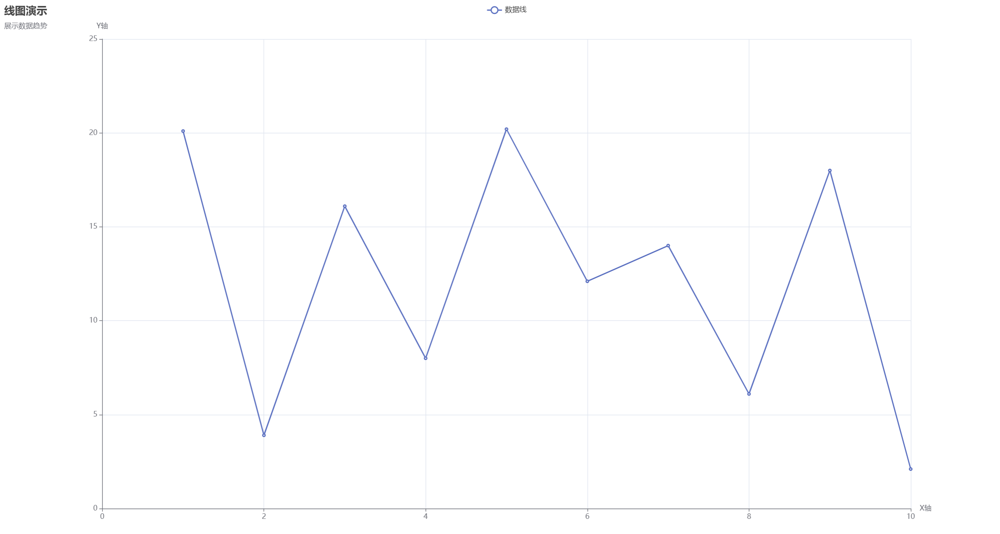](./docs/Visualization-Plotting.md#单向量线图--single-vector-line-chart) | 展示数据随时间的变化趋势 / Display data trends over time | **多组线图 / Multi-group Line Chart** | [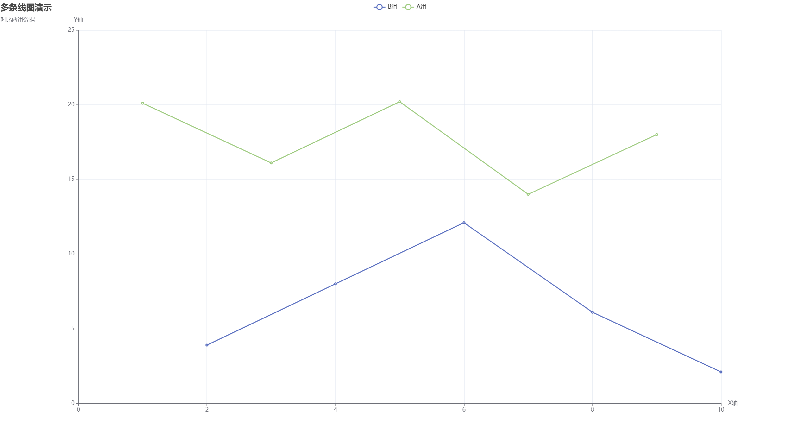](./docs/Visualization-Plotting.md#多组线图--multi-group-line-chart) | 比较不同组别的数据趋势 / Compare data trends across different groups |
| **散点图 / Scatter Chart** | [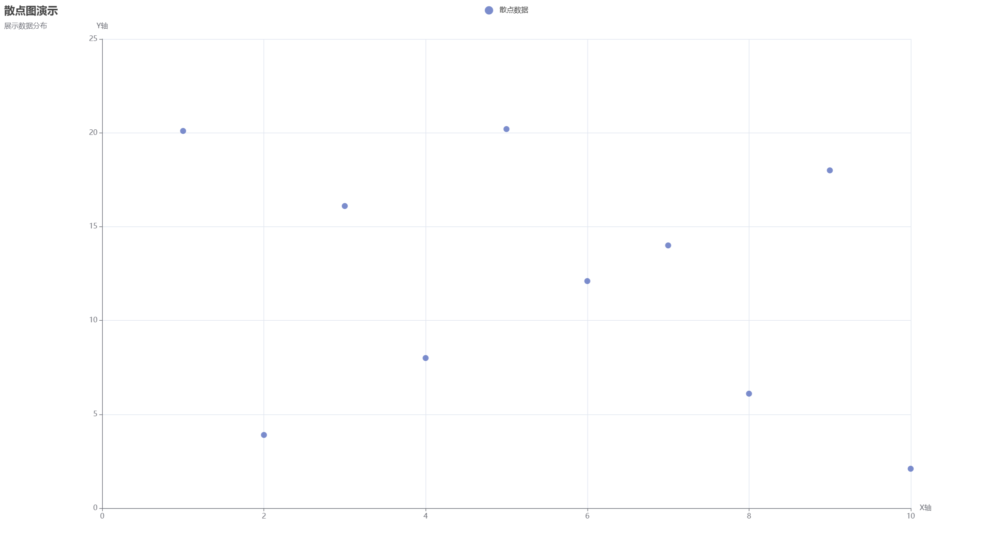](./docs/Visualization-Plotting.md#基础散点图--basic-scatter-chart) | 展示两个变量之间的关系 / Display relationships between two variables | **多组散点图 / Multi-group Scatter Chart** | [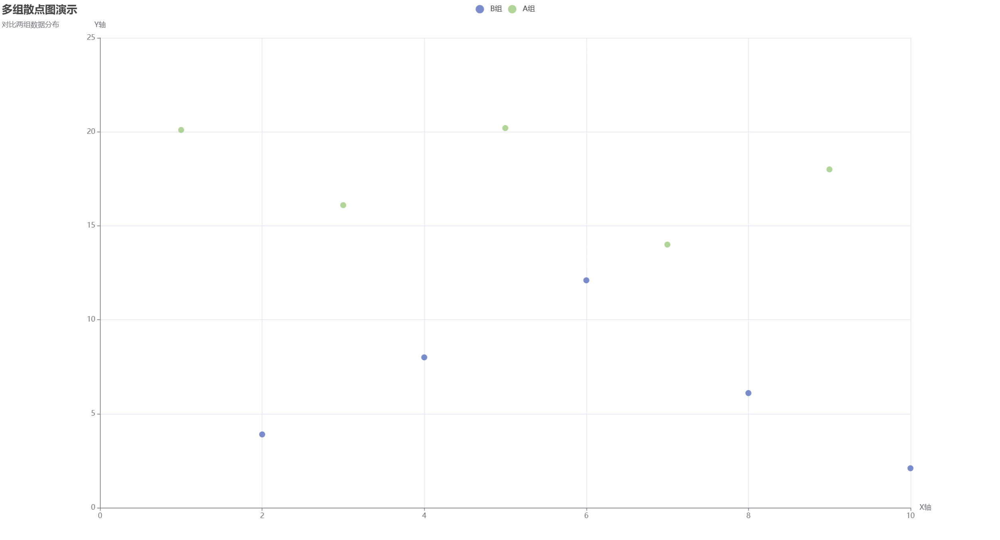](./docs/Visualization-Plotting.md#多组散点图--multi-group-scatter-chart) | 比较不同组别的数据分布 / Compare data distributions across different groups |
| **饼图 / Pie Chart** | [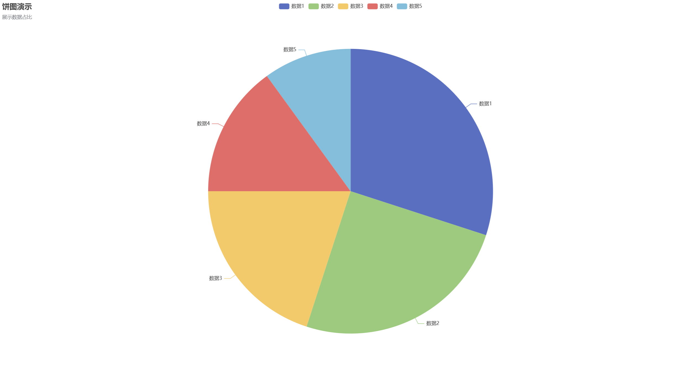](./docs/Visualization-Plotting.md#饼图--pie-charts) | 展示各部分占整体的比例 / Display proportion of each part to the whole | **柱状图 / Bar Chart** | [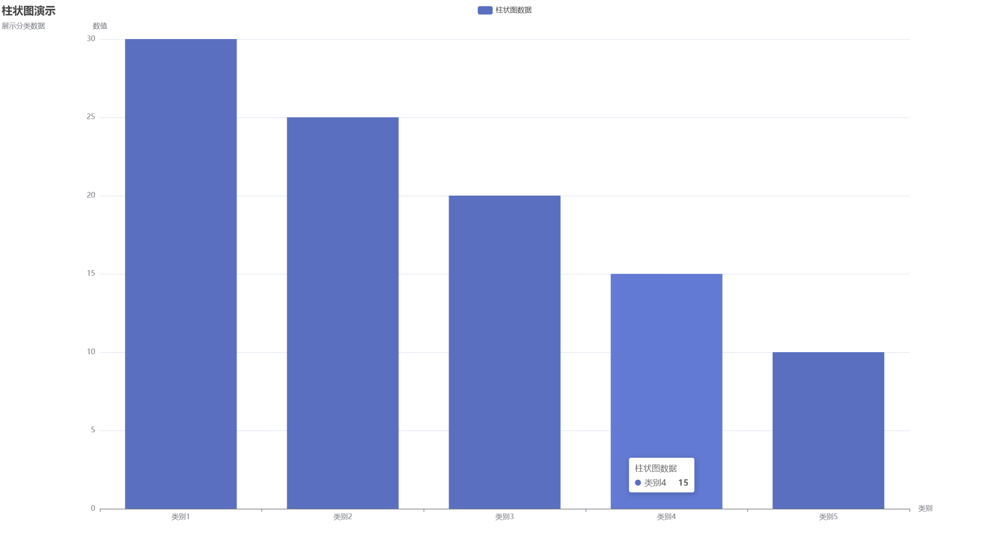](./docs/Visualization-Plotting.md#基础柱状图--basic-bar-chart) | 比较不同类别的数值大小 / Compare numerical values across different categories |
| **分组柱状图 / Grouped Bar Chart** | [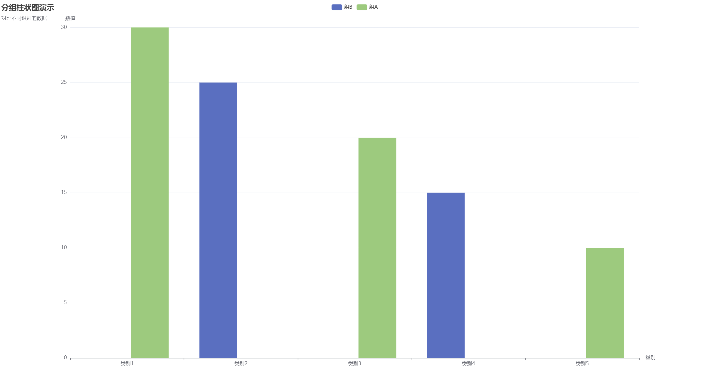](./docs/Visualization-Plotting.md#分组柱状图--grouped-bar-chart) | 多维度比较分析 / Multi-dimensional comparative analysis | **直方图 / Histogram** | [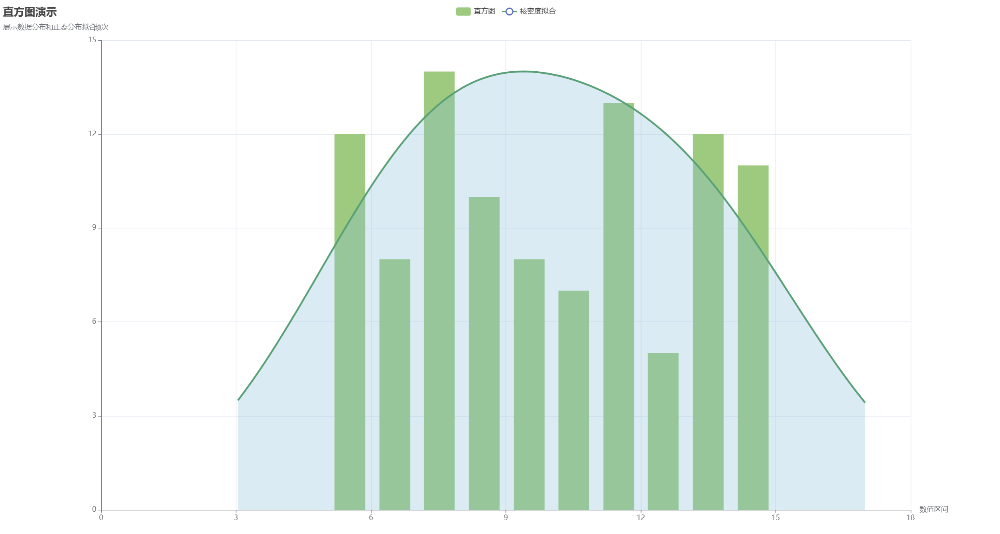](./docs/Visualization-Plotting.md#直方图--histograms) | 展示数据的分布情况 / Display data distribution |

##### 极坐标图表 / Polar Coordinate Charts

| 图表类型 / Chart Type | 示例图片 / Example | 描述 / Description | 图表类型 / Chart Type | 示例图片 / Example | 描述 / Description |
|---------------------|------------------|-------------------|---------------------|------------------|-------------------|
| **极坐标柱状图 / Polar Bar Chart** | [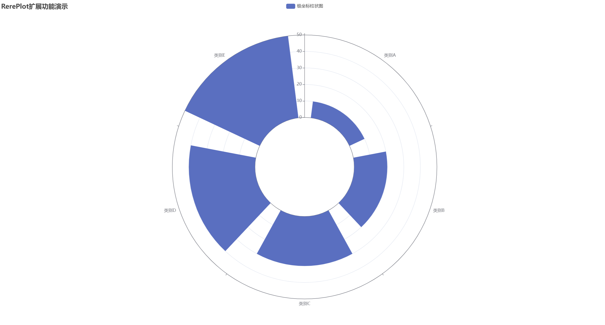](./docs/Visualization-Plotting.md#极坐标柱状图--polar-bar-chart) | 在极坐标系中展示柱状图 / Display bar charts in polar coordinate system | **极坐标线图 / Polar Line Chart** | [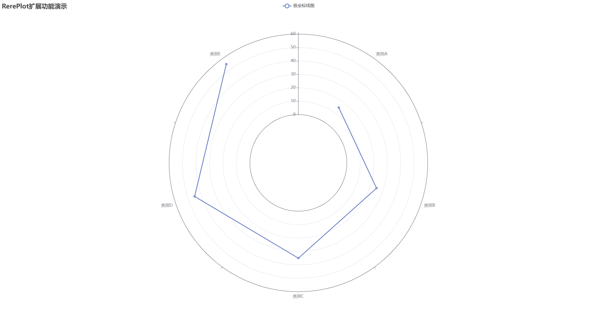](./docs/Visualization-Plotting.md#极坐标线图--polar-line-chart) | 在极坐标系中展示线图 / Display line charts in polar coordinate system |
| **极坐标散点图 / Polar Scatter Chart** | [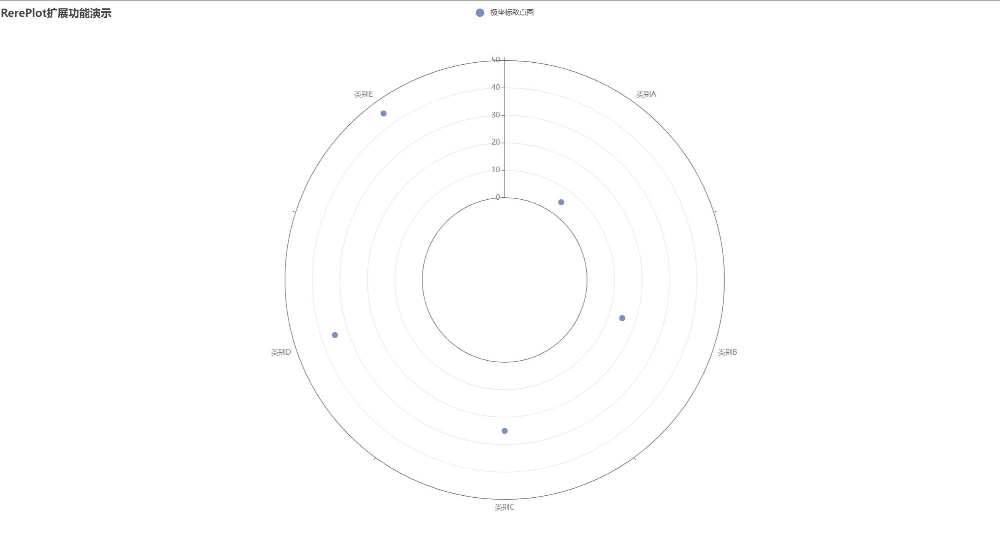](./docs/Visualization-Plotting.md#极坐标散点图--polar-scatter-chart) | 在极坐标系中展示散点图 / Display scatter charts in polar coordinate system | | | |

##### 统计图表 / Statsistical Charts

| 图表类型 / Chart Type | 示例图片 / Example | 描述 / Description | 图表类型 / Chart Type | 示例图片 / Example | 描述 / Description |
|---------------------|------------------|-------------------|---------------------|------------------|-------------------|
| **单组箱线图 / Single Box Plot** | [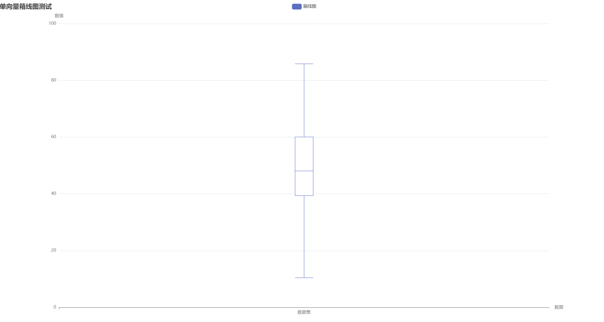](./docs/Visualization-Plotting.md#单组箱线图--single-box-plot) | 展示单个数据集的分布特征和异常值 / Display distribution characteristics and outliers of a single dataset | **多组箱线图 / Multi-group Box Plot** | [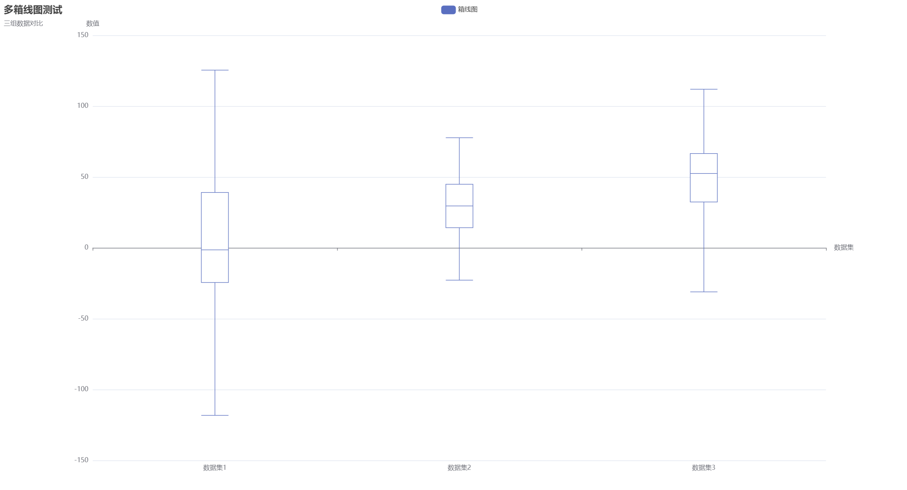](./docs/Visualization-Plotting.md#多组箱线图--multi-group-box-plot) | 比较多个数据集的分布特征 / Compare distribution characteristics across multiple datasets |
| **单组小提琴图 / Single Violin Plot** | [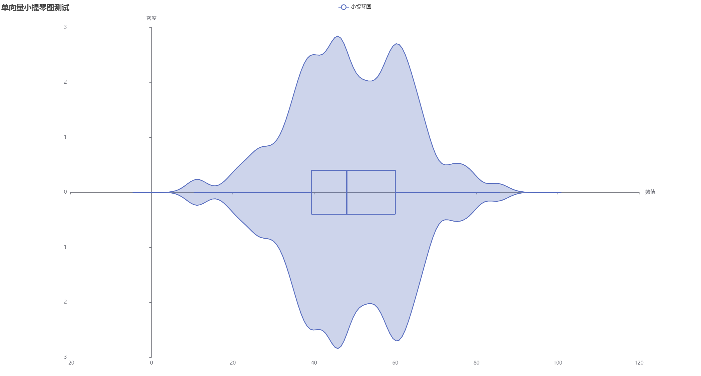](./docs/Visualization-Plotting.md#单组小提琴图--single-violin-plot) | 结合箱线图和密度图的特点，展示单个数据集 / Combine characteristics of box plots and density plots for a single dataset | **多组小提琴图 / Multi-group Violin Plot** | [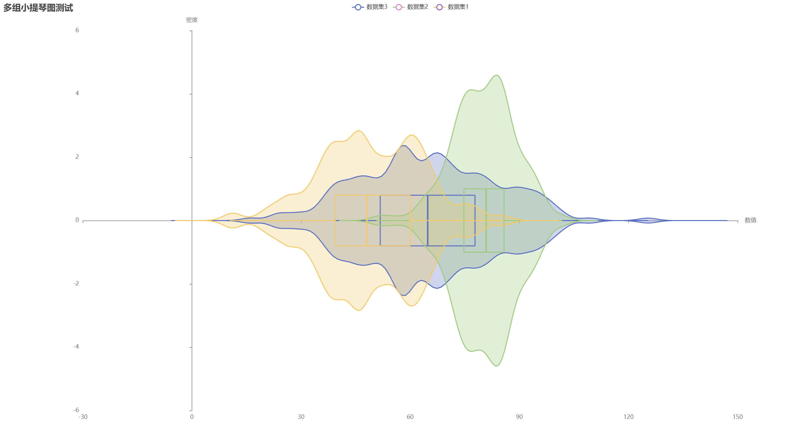](./docs/Visualization-Plotting.md#多组小提琴图--multi-group-violin-plot) | 比较多个数据集的分布密度 / Compare distribution densities across multiple datasets |
| **K线图 / Candlestick Chart** | [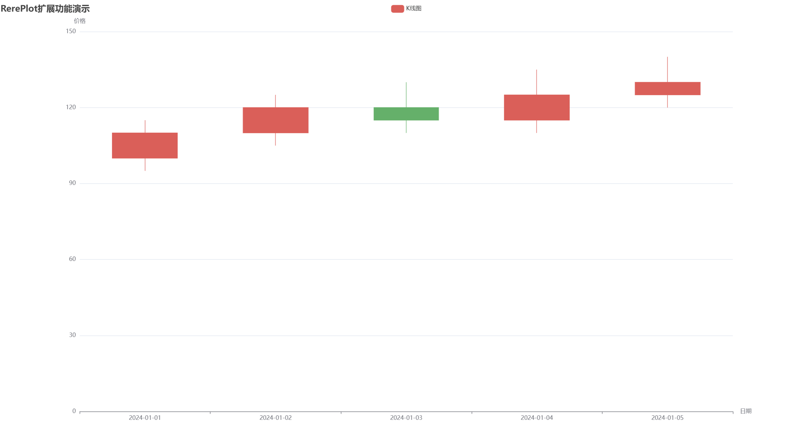](./docs/Visualization-Plotting.md#k线图蜡烛图--candlestick-chart) | 展示金融数据的开盘价、收盘价等 / Display financial data including opening, closing prices | | | |

##### 特殊图表 / Special Charts

| 图表类型 / Chart Type | 示例图片 / Example | 描述 / Description | 图表类型 / Chart Type | 示例图片 / Example | 描述 / Description |
|---------------------|------------------|-------------------|---------------------|------------------|-------------------|
| **漏斗图 / Funnel Chart** | [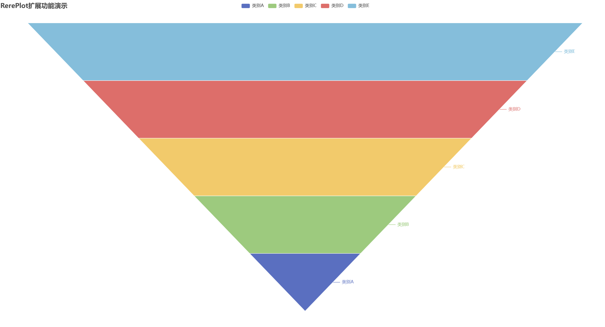](./docs/Visualization-Plotting.md#漏斗图--funnel-chart) | 展示流程中各个阶段的转化情况 / Display conversion rates at each stage of a process | **桑基图 / Sankey Diagram** | [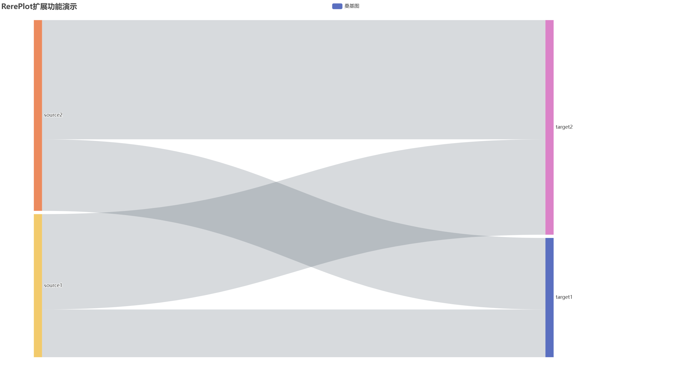](./docs/Visualization-Plotting.md#桑基图--sankey-diagram) | 展示数据在多个节点之间的流动 / Display data flow between multiple nodes |
| **旭日图 / Sunburst Chart** | [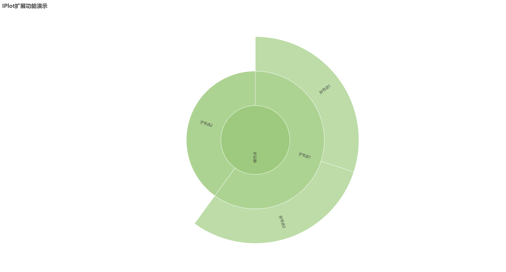](./docs/Visualization-Plotting.md#旭日图--sunburst-chart) | 展示层次数据的比例关系 / Display proportional relationships in hierarchical data | **主题河流图 / Theme River Chart** | [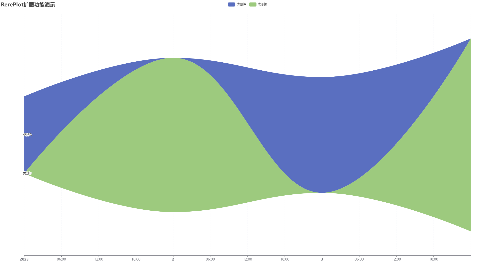](./docs/Visualization-Plotting.md#主题河流图--theme-river-chart) | 展示时间序列数据中不同主题的变化 / Display trends of different themes in time series data |
| **树图 / Tree Chart** | [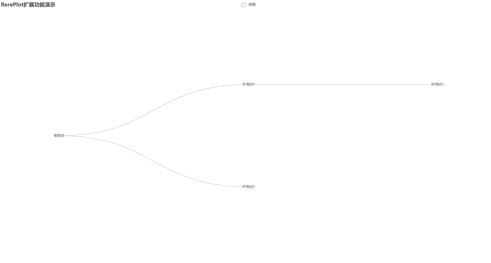](./docs/Visualization-Plotting.md#树图--tree-chart) | 展示层次结构数据 / Display hierarchical structure data | **矩形树图 / Treemap Chart** | [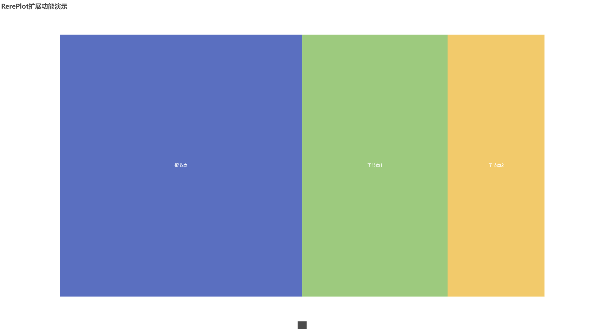](./docs/Visualization-Plotting.md#矩形树图--treemap-chart) | 通过矩形面积大小表示数据量 / Represent data volumes through rectangle sizes |
| **关系图 / Graph Chart** | [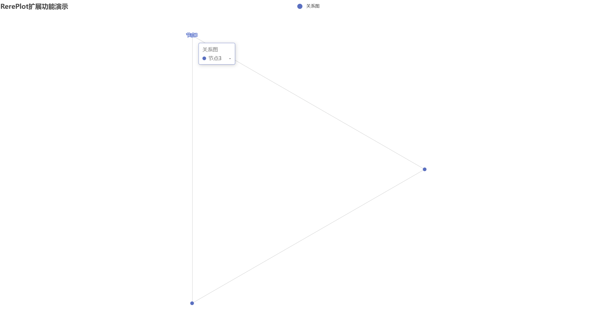](./docs/Visualization-Plotting.md#关系图--graph-chart) | 展示节点之间的连接关系 / Display connections between nodes | **平行坐标图 / Parallel Coordinates Chart** | [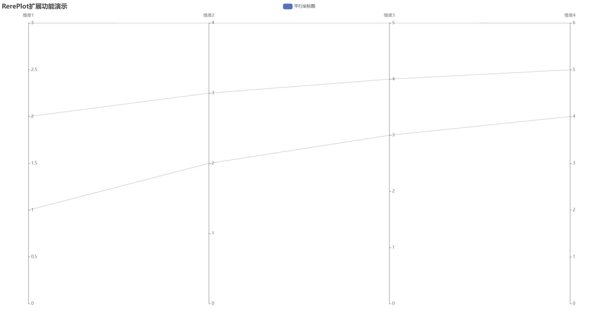](./docs/Visualization-Plotting.md#平行坐标图--parallel-coordinates-chart) | 展示多维数据的分布和关系 / Display distribution and relationships of multi-dimensional data |

##### 扩展图表 / Enhanced Charts

| 图表类型 / Chart Type | 示例图片 / Example | 描述 / Description | 图表类型 / Chart Type | 示例图片 / Example | 描述 / Description |
|---------------------|------------------|-------------------|---------------------|------------------|-------------------|
| **热力图 / Heatmap** | [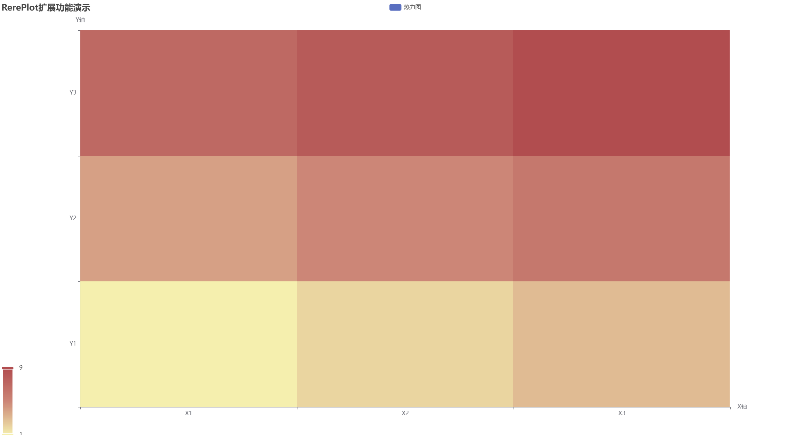](./docs/Visualization-Plotting.md#热力图--heatmap) | 通过颜色深浅表示二维数据大小 / Represent two-dimensional data magnitude through color intensity | **雷达图 / Radar Chart** | [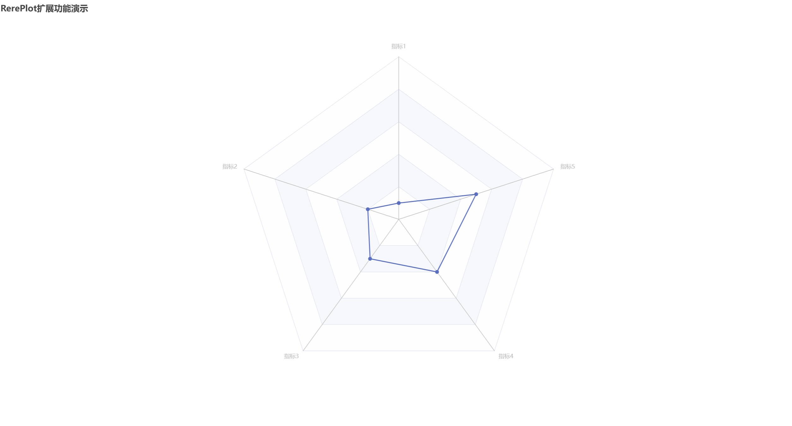](./docs/Visualization-Plotting.md#雷达图--radar-chart) | 展示多维数据的分布情况 / Display distribution of multi-dimensional data |
| **仪表盘 / Gauge Chart** | [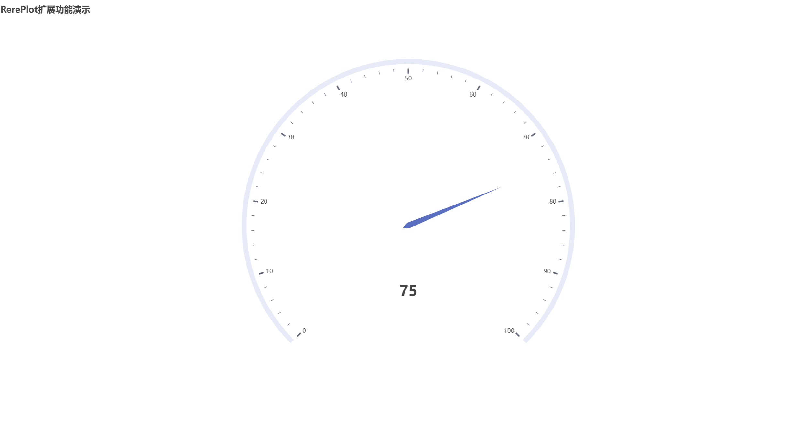](./docs/Visualization-Plotting.md#仪表盘--gauge-chart) | 展示单一指标的当前值 / Display current values of single indicators | | | |


#### 最优化算法 / Optimization Algorithms
```java
// L-BFGS优化器示例 / L-BFGS Optimizer Example
var optimizer = Opts.lbfgs();

// 定义目标函数（Rosenbrock函数）/ Define objective function (Rosenbrock function)
var objFun = new IObjectiveFunction() {
    @Override
    public double computeObjective(IVector x) {
        double x1 = x.get(0).doubleValue();
        double x2 = x.get(1).doubleValue();
        return (1 - x1) * (1 - x1) + 100 * (x2 - x1 * x1) * (x2 - x1 * x1);
    }
};

// 定义梯度函数 / Define gradient function
var grdFun = new IGradientFunction() {
    @Override
    public IVector computeGradient(IVector x) {
        double x1 = x.get(0).doubleValue();
        double x2 = x.get(1).doubleValue();
        double[] grad = new double[2];
        grad[0] = -2 * (1 - x1) - 400 * x1 * (x2 - x1 * x1);
        grad[1] = 200 * (x2 - x1 * x1);
        return Linalg.vector(grad);
    }
};

// 执行优化 / Execute optimization
var initX = Linalg.ones(2);
var result = optimizer.optimize(initX, objFun, grdFun);
```

```java
// 在线Adam优化器示例 / Online Adam Optimizer Example
var adamOptimizer = Opts.onlineAdam();

// 初始化优化器 / Initialize optimizer
var initialParams = Linalg.zeros(2);
adamOptimizer.initialize(initialParams);

// 在线学习循环 / Online learning loop
for (int i = 0; i < numIterations; i++) {
    IVector gradient = computeGradient(adamOptimizer.getCurrentParams());
    double loss = computeLoss(adamOptimizer.getCurrentParams());
    
    // 执行一步优化 / Perform one optimization step
    IVector updatedParams = adamOptimizer.step(gradient, loss);
    
    if (loss < tolerance) break;
}
```


#### 线性规划 / Linear Programming
```java
// 创建单纯形法求解器 / Create simplex solver
var solver = Opts.simplexLinProgSolver();

// 定义线性规划问题 / Define linear programming problem
// minimize 2x1 + 3x2
// subject to x1 + x2 = 5, x1 ≥ 0, x2 ≥ 0
var c = Linalg.vector(new double[]{2.0, 3.0});
var A_eq = Linalg.matrix(new double[][]{{1.0, 1.0}});
var b_eq = Linalg.vector(new double[]{5.0});

// 求解(等式约束调用solveEq，小于等于约束调用solve) / Solve(use solveEq() for equal constraints, use solve() for less than or equal constraints)
var result = solver.solveEq(c, A_eq, b_eq);

double optimalValue = result.getOptimalValue();
var optimalSolution = result.getOptimalPoint();

System.out.println("最优解: " + optimalSolution);
System.out.println("最优值: " + optimalValue);

```

#### 整数规划（0-1规划） / Integer Programming (0-1 Programming)
```java
// 创建整数规划求解器 / Create integer programming solver
var solver = Opts.intLinProgSolver();

// 定义整数规划问题 / Define integer programming problem
// minimize x1 + x2
// subject to x1 + x2 = 3, x1 ≥ 0, x2 ≥ 0, x1,x2 ∈ Z
var c = Linalg.vector(new double[]{1.0, 1.0});
var A_eq = Linalg.matrix(new double[][]{{1.0, 1.0}});
var b_eq = Linalg.vector(new double[]{3.0});

// 设置所有变量为整数(如果不是所有变量序号，则为混合整数规划) / Set all variables as integer(if not all variable indexes, it is mixed integer programming)
solver.addIntegerVariables(0, 1);
// 另一种方法设置所有变量为整数变量 / Another method to set all variables as integer variables
//solver.setAllVariablesInteger();
// 设置所有变量为二进制变量（0-1变量） / set all variables as binary variables (0-1 variables)
//solver.setAllVariablesBinary();

// 求解(等式约束调用solveEq，小于等于约束调用solve) / Solve(use solveEq() for equal constraints, use solve() for less than or equal constraints)
var result = solver.solveEq(c, A_eq, b_eq);

double optimalValue = result.getOptimalValue();
var optimalSolution = result.getOptimalPoint();

System.out.println("最优整数解 / Optimal solution: " + optimalSolution);
System.out.println("最优值 / Optimal value: " + optimalValue);

```


#### 线性回归 / Linear Regression
```java
// 创建线性回归模型（L2正则化，岭回归） / Create linear regression model with L2 regularization, i.e., Ridge regression
var lr = ML.linearRegression(0.0,0.1);

// 训练模型 / Train model
var result = lr.fit(featureMatrix, labelVector);

// 预测 / Predict
double prediction = lr.predict(newFeatureVector);
```

#### PCA降维 / PCA Dimensionality Reduction
```java
// 创建PCA降维器 / Create PCA reducer
var pca = ML.pcaDimReducer();

// 执行降维 / Perform dimensionality reduction
var reducedData = pca.dimensionReduction(originalData, 2);
```

#### 逻辑回归分类 / Logistic Regression Classification
```java
String path = "path of iris dataset/iris.csv";
try {
    // 读取数据集 / Read dataset
    var df = DataFrame.readCsv(path);
    // 提取特征和标签 / Extract features and labels
    var feature = df.sliceColumn(0, -1).toMatrix(); // get all the columns except the last one
    var labels = df.getColumn(-1).toStringArray(); // get the last column of the dataframe
    // 创建逻辑回归分类器（两个参数分别是L1和L2正则化系数） / Create logistic regression classifier (the two parameters are L1 and L2 regularization coefficients)
    var lr = ML.logisticRegression(0.0,0.0);
    // 训练模型 / Train model
    var res = lr.fit(feature, labels);
    System.out.println(res);
    // 预测类别 / Predict classes
    var predicted = lr.predictBatch(feature);
    // 计算分类指标 / Compute classification metrics
    var metrics = ML.classificationMetrics(lr, feature, labels);
    System.out.println(metrics);
    // 交叉验证 / Cross validation
    var result = ML.kFoldCrossValidation(lr, feature, labels, 3);
    System.out.println(result);
} catch (Exception e) {
    e.printStackTrace();
}
```

#### 信号处理 / Signal Processing
```java
// 生成信号 / Generate signals
var time = Signals.linspace(0, 1, 1000);
var signal = Signals.sin(2 * Math.PI * 5 * time);  // 5Hz正弦波 / 5Hz sine wave

// 添加噪声 / Add noise
var noise = Signals.randn(1000).mul(0.1);
var noisySignal = signal.add(noise);

// 卡尔曼滤波 / Signal filtering
var filteredSignal = Signals.kalmanFilter(noisySignal, 0.1);

// 信号可视化 / Signal visualization
Plots.of(800, 400)
    .line(time, signal, "b-", "原始信号 / Original Signal")
    .line(time, noisySignal, "r-", "含噪声信号 / Noisy Signal")
    .line(time, filteredSignal, "g-", "滤波后信号 / Filtered Signal")
    .xlabel("时间 (秒) / Time (s)")
    .ylabel("幅度 / Amplitude")
    .title("信号处理示例 / Signal Processing Example")
    .legend()
    .show();
```

#### 时间序列分析 / Time Series Analysis
```java
// 创建时间序列数据 / Create time series data
var timestamps = Linalg.vector(new double[]{1, 2, 3, 4, 5, 6, 7, 8, 9, 10});
var values = Linalg.vector(new double[]{10, 12, 13, 15, 18, 20, 22, 25, 28, 30});

// 创建时间序列对象 / Create time series object
var ts = new TimeSeriesData(timestamps, values);

// 时间序列分析 / Time series analysis
var analyzer = new TimeSeriesAnalyzer();
double trend = analyzer.calculateTrend(ts);  // 计算趋势 / Calculate trend
double[] forecast = analyzer.forecast(ts, 3);  // 预测未来3个点 / Forecast next 3 points

// 时间序列可视化 / Time series visualization
Plots.of(800, 400)
    .line(timestamps, values, "bo-", "历史数据 / Historical Data")
    .scatter(Linalg.vector(new double[]{11, 12, 13}), Linalg.vector(forecast), "ro-", "预测数据 / Forecast Data")
    .xlabel("时间 / Time")
    .ylabel("数值 / Value")
    .title("时间序列分析示例 / Time Series Analysis Example")
    .legend()
    .show();
```

#### 音频分析 / Audio Analysis
```java
// 读取音频文件 / Read audio file
var audioData = Audios.readAudio("sample.wav");

// 音频特征提取 / Audio feature extraction
var mfccFeatures = Audios.calculateMFCC(audioData);  // MFCC特征 / MFCC features
double spectralCentroid = Audios.calculateSpectralCentroid(audioData, 1024);  // 频谱质心 / Spectral centroid
double zeroCrossingRate = Audios.calculateZeroCrossingRate(audioData);  // 过零率 / Zero crossing rate

// 音频分析 / Audio analysis
double pitch = Audios.detectPitch(audioData);  // 音高检测 / Pitch detection
var spectrum = Audios.spectrum(audioData);  // 频谱分析 / Spectrum analysis

// 音频综合特征提取 / Audio comprehensive feature extraction
var extractor = Audios.createStandardFeatureExtractor();
var result = extractor.extractAudioFeatures(audioData);  // 提取时域、频域、谱域综合音频特征 / Extract time-domain, frequency-domain, and spectral features
var tp = result.toNumericalFeatures(); // 转换为数值特征(特征名、特征的值)

// 音频嵌入向量 / Audio embedding vector
var embedder = Audios.createAudioEmbedder(64);  // 创建64维嵌入器 / Create 64-dim embedder
embedder.train(audioDataList); // 训练嵌入器
var embedding = embedder.embed(audioData);  // 生成嵌入向量 / Generate embedding vector


```

## 核心类文档 / Core Classes Documentation

- [内容导读 (Reading Guide)](./docs/README.md) / [Reading Guide](./docs/README.md)
- [API参考手册 (API Reference)](./docs/API-Reference.md) / [API Reference Manual](./docs/API-Reference.md)
- [向量操作 (Vector Operations)](./docs/Vector-Operations.md) / [Vector Operations Documentation](./docs/Vector-Operations.md)
- [矩阵操作 (Matrix Operations)](./docs/Matrix-Operations.md) / [Matrix Operations Documentation](./docs/Matrix-Operations.md)
- [DataFrame 数据框操作 (DataFrame Operations)](./docs/DataFrame-Operations.md) / [DataFrame Operations Documentation](./docs/DataFrame-Operations.md)
- [数学工具类 (Math Utilities)](./docs/Math-Utilities.md) / [Math Utilities Documentation](./docs/Math-Utilities.md)
- [统计操作 (Statsistics Operations)](./docs/Statistics-Operations.md) / [Statistics Operations Documentation](./docs/Statsistics-Operations.md)
- [数据可视化 (Data Visualization)](./docs/Visualization-Plotting.md) / [Data Visualization Documentation](./docs/Visualization-Plotting.md)
- [机器学习 (Machine-Learning)](./docs/Machine-Learning.md) / [Machine-Learning Documentation](./docs/Machine-Learning.md)
- [优化算法 (Optimization Algorithms)](./docs/Optimization-Algorithms.md) / [Optimization Algorithms Documentation](./docs/Optimization-Algorithms.md)
- [信号处理 (Signal Processing)](./docs/Signal-Processing.md) / [Signal Processing Documentation](./docs/Signal-Processing.md)
- [时间序列分析 (Time Series Analysis)](./docs/Time-Series-Analysis.md) / [Time Series Analysis Documentation](./docs/Time-Series-Analysis.md)
- [音频操作 (Audio Operations)](./docs/Audio-Operations.md) / [Audio Operations Documentation](./docs/Audio-Operations.md)


## 使用示例 / Usage Examples

- [向量运算示例](./docs/examples/Vector-Examples.md) / [Vector Operations Examples](./docs/examples/Vector-Examples.md)
- [矩阵运算示例](./docs/examples/Matrix-Examples.md) / [Matrix Operations Examples](./docs/examples/Matrix-Examples.md)
- [DataFrame 数据框示例](./docs/examples/DataFrame-Examples.md) / [DataFrame Examples](./docs/examples/DataFrame-Examples.md)
- [数学工具类示例](./docs/examples/Math-Utilities-Examples.md) / [Math Utilities Examples](./docs/examples/Math-Utilities-Examples.md)
- [统计操作示例](./docs/examples/Statistics-Examples.md) / [Statistics Operations Examples](./docs/examples/Statsistics-Examples.md)
- [数据可视化示例](./docs/examples/Visualization-Plotting-Examples.md) / [Data Visualization Examples](./docs/examples/Visualization-Plotting-Examples.md)
- [机器学习示例](./docs/examples/Machine-Learning-Examples.md) / [Machine Learning Examples](./docs/examples/Machine-Learning-Examples.md)
- [优化算法示例](./docs/examples/Optimization-Examples.md) / [Optimization Algorithms Examples](./docs/examples/Optimization-Examples.md)
- [信号处理示例](./docs/examples/Signal-Processing-Examples.md) / [Signal Processing Examples](./docs/examples/Signal-Processing-Examples.md)
- [时间序列分析示例](./docs/examples/Time-Series-Examples.md) / [Time Series Analysis Examples](./docs/examples/Time-Series-Examples.md)
- [音频处理示例](./docs/examples/Audio-Examples.md) / [Audio Processing Examples](./docs/examples/Audio-Examples.md)

## 项目结构 / Project Structure

### 整体架构图 / Overall Architecture

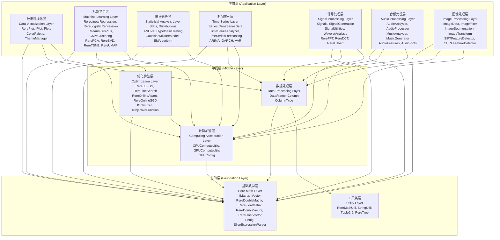
```mermaid
graph TB
    subgraph "应用层 (Application Layer)"
        VIZ[数据可视化层<br/>Data Visualization Layer<br/>RerePlot, IPlot, Plots<br/>ColorPalette, ThemeManager]
        ML[机器学习层<br/>Machine Learning Layer<br/>RereLinearRegression, RereLogisticRegression<br/>KMeansPlusPlus, GMMClustering<br/>RerePCA, RereSVD, RereTSNE, RereUMAP]
        STAT[统计分析层<br/>Statistical Analysis Layer<br/>Stats, Distributions<br/>ANOVA, HypothesisTesting<br/>GaussianMixtureModel, EMAlgorithm]
        TS[时间序列层<br/>Time Series Layer<br/>Series, TimeSeriesData<br/>TimeSeriesAnalyzer, TimeSeriesForecasting<br/>ARIMA, GARCH, VAR]
        SIG[信号处理层<br/>Signal Processing Layer<br/>Signals, SignalGeneration<br/>SignalUtilities, WaveletAnalysis<br/>RereFFT, RereDCT, RereHilbert]
        AUD[音频处理层<br/>Audio Processing Layer<br/>AudioAnalyzer, AudioProcessor<br/>MusicAnalyzer, MusicGenerator<br/>AudioFeatures, AudioPlots]
        IMG[图像处理层<br/>Image Processing Layer<br/>ImageData, ImageFilter<br/>ImageSegmentation, ImageTransform<br/>SIFTFeatureDetector, SURFFeatureDetector]
    end
    
    subgraph "中间层 (Middle Layer)"
        DATA[数据处理层<br/>Data Processing Layer<br/>DataFrame, Column<br/>ColumnType]
        OPT[优化算法层<br/>Optimization Layer<br/>RereLBFGS, RereLineSearch<br/>RereOnlineAdam, RereOnlineSGD<br/>IOptimizer, IObjectiveFunction]
        COMP[计算加速层<br/>Computing Acceleration Layer<br/>CPUComputeUtils, GPUComputeUtils<br/>GPUConfig]
    end
    
    subgraph "基础层 (Foundation Layer)"
        MATH[基础数学层<br/>Core Math Layer<br/>IMatrix, IVector<br/>RereDoubleMatrix, RereFloatMatrix<br/>RereDoubleVector, RereFloatVector<br/>Linalg, SliceExpressionParser]
        UTIL[工具类层<br/>Utility Layer<br/>RereMathUtil, StringUtils<br/>Tuple2-9, RereTree]
    end
    
    VIZ --> MATH
    VIZ --> DATA
    VIZ --> COMP
    ML --> MATH
    ML --> OPT
    ML --> COMP
    STAT --> MATH
    STAT --> COMP
    TS --> MATH
    TS --> DATA
    TS --> COMP
    SIG --> MATH
    SIG --> DATA
    SIG --> COMP
    AUD --> MATH
    AUD --> DATA
    AUD --> COMP
    IMG --> MATH
    IMG --> DATA
    IMG --> COMP
    DATA --> MATH
    DATA --> UTIL
    OPT --> MATH
    OPT --> COMP
    COMP --> MATH
```


### 文件结构 / File Structure

[文件结构 / File Structure](./file_structure.md "Click to view file structure")


## 性能特性 / Performance Features

- **内存优化** / **Memory Optimization**: 高效的数组操作和内存管理，支持大矩阵运算
  - *Efficient array operations and memory management, supporting large matrix operations*
- **算法优化** / **Algorithm Optimization**: 优化的数学算法实现，包括LBFGS优化器
  - *Optimized mathematical algorithm implementations, including LBFGS optimizer*
- **类型安全** / **Type Safety**: 强类型系统，避免运行时错误，提供完整的类型检查
  - *Strong type system, avoiding runtime errors, providing complete type checking*
- **接口设计** / **Interface Design**: 清晰的接口设计，易于扩展和自定义实现
  - *Clear interface design, easy to extend and customize implementations*
- **数值稳定性** / **Numerical Stability**: 采用数值稳定的算法实现，确保计算精度
  - *Numerically stable algorithm implementations, ensuring computational accuracy*
- **并行计算支持** / **Parallel Computing Support**: 支持多线程并行计算，提高大规模数据处理效率
  - *Multi-threaded parallel computing support, improving efficiency for large-scale data processing*


## 扩展计算 / Extentions

Java的主流社区主要面向Server端应用开发。虽然我们已尽最大努力实现Java数值计算，但终归而言，Java数值计算的社区生态有限。为了弥补Java天生的数值计算能力不足，我们构建了一个专门的与Julia语言（数学专用语言）进行桥接的中间件库：[Ju4Ja](https://github.com/lteb2002/ju4ja), [https://github.com/lteb2002/ju4ja](https://github.com/lteb2002/ju4ja)。如果您有复杂的数值计算需求，可以使用Julia语言实现，然后在Java中通过Ju4Ja库来调用Julia功能。

Java's mainstream community is oriented towards server-side application development. While we've done our best to implement numerical computing in Java, the community ecosystem for Java numerical computing is ultimately limited. To address the inherent limitations of Java's numerical computing capabilities, we've built a specialized middleware library, [Ju4Ja](https://github.com/lteb2002/ju4ja), [https://github.com/lteb2002/ju4ja](https://github.com/lteb2002/ju4ja), to bridge the gap with the mathematically specialized Julia language. If you have complex numerical computing needs, you can implement them in Julia and call Julia functionality from Java using the Ju4Ja library.

## 贡献指南 / Contributing

我们欢迎社区贡献！请遵循以下步骤：

We welcome community contributions! Please follow these steps:

1. Fork 本项目 / Fork this project
2. 创建特性分支 / Create a feature branch (`git checkout -b feature/AmazingFeature`)
3. 提交更改 / Commit your changes (`git commit -m 'Add some AmazingFeature'`)
4. 推送到分支 / Push to the branch (`git push origin feature/AmazingFeature`)
5. 开启 Pull Request / Open a Pull Request

### 贡献指南 / Contribution Guidelines

- 请确保代码符合项目的编码规范 / Please ensure your code follows the project's coding standards
- 添加适当的测试用例 / Add appropriate test cases
- 更新相关文档 / Update relevant documentation
- 确保所有测试通过 / Ensure all tests pass

## 许可证 / License

本项目采用 MIT 许可证 - 查看 [LICENSE](LICENSE.txt) 文件了解详情。

This project is licensed under the MIT License - see the [LICENSE](LICENSE.txt) file for details.

### MIT 许可证条款 / MIT License Terms

MIT 许可证是一个宽松的开源许可证，允许您自由使用、修改、分发和销售软件，只要您保留版权声明和许可证文本。

The MIT License is a permissive open-source license that allows you to freely use, modify, distribute, and sell the software, as long as you retain the copyright notice and license text.

## 联系方式 / Contact

- 项目维护者 / Project Maintainer: Big Data and Decision Analytics Research Center of UESTC, Big Data Research Institute of SWUFE, School of Artificial Intelligence and Big Data of HAUT, and Chengdu Scale-Free Tech Ltd.
- 项目地址 / Project URL: [https://github.com/ScaleFree-Tech/yishape-math](https://github.com/ScaleFree-Tech/yishape-math), [https://gitee.com/scalefree-tech/yishape-math](https://gitee.com/scalefree-tech/yishape-math).
- 问题反馈 / Issues: [https://github.com/ScaleFree-Tech/yishape-math/issues](https://github.com/ScaleFree-Tech/yishape-math/issues)

### 获取帮助 / Getting Help

如果您在使用过程中遇到问题，可以通过以下方式获取帮助：

If you encounter any issues while using the library, you can get help through the following channels:

- **GitHub Issues**: 报告bug或提出功能请求 / Report bugs or request features
- **文档**: 查看详细的API文档和示例 / Check detailed API documentation and examples
- **社区**: 参与讨论和分享经验 / Participate in discussions and share experiences

## 更新日志 / Changelog

### v0.3.8 (2026-05)
- **Bug Fixes** / **Bug Fixes**: 修复了矩阵分解、降维等方面的错误 / Bug fixes concering matrix decomposition and dimension reduction
- **绘图系统增加JavaFx和SVG两种新的实现 / Two new implementations of the plotting system: JavaFx and SVG**:  增加JavaFx和SVG两种新的绘图实现，增强了kde曲线、回归线、配对图、联合图等 / Added two new plotting implementations, JavaFx and SVG, which enhanced KDE curves, regression lines, scatter plots, joint plots, etc.
- **分类器增加线性SVM和决策树，增强了XGBoost / New classifiers: linear SVM and decision tree, and enhanced XGBoost.**:  增加了线性SVM和单颗决策树，XGBoost性能得到增强 / Added linear SVM and decision tree, and the performance of XGBoost has been enhanced.

### v0.3.7 (2025-12)
- **Bug Fixes** / **Bug Fixes**: 修复了LU分解、T检验、逻辑斯蒂回归等方面的错误 / Bug fixes and error corrections
- **优化运算效率提升 / Optimization Performance Improvement**:  改进了L-BFGS等算法中的缓存机制，优化效率得以提升 / The cache mechanism in optimization algorithms such as L-BFGS has been improved, leading to an enhanced optimization efficiency.
- **暂时移除GPU支持 / Remove GPU support temporarily**:  由于GPU计算依赖的包过重，在复杂的优化算法中性能提升有限，暂时移除 / Due to the heavy dependency of GPU computing packages, the performance improvement in complex optimization algorithms is limited, and GPU support is temporarily removed.

### v0.3.0 (2025-10)
- **SIMD (Single Instruction, Multiple Data)支持** / **SIMD Support**: 基于Java Vector API提供向量&矩阵乘法、通用函数、规约函数等方面的SIMD并行计算支持 / SIMD (Single Instruction, Multiple Data) parallel computing support based on Java Vector API
- **Bug Fixes** / **Bug Fixes**: 修复已知问题和错误 / Bug fixes and error corrections

### v0.2.2 (2025-09)
- **新增音频处理功能** / **New Audio Processing Features**: 音频特征提取、音高检测、音频增强、i-vector模型训练等 / Audio feature extraction, pitch detection, audio enhancement, i-vector model training
- 📡 信号处理模块：信号生成、滤波、频谱分析、小波分析 / Signal processing: generation, filtering, spectral analysis, wavelet analysis
- ⏰ 时间序列分析：数据管理、预测方法、滤波分解、可视化 / Time series: data management, forecasting, filtering, visualization

### v0.2.0 (2025-08，初始开源 / initial open source)
- ⚡ GPU加速计算：矩阵运算、向量运算、高级运算，支持自动回退 / GPU acceleration: matrix/vector operations, advanced computing with auto-fallback
- 📊 DataFrame数据框：CSV读写、数据切片、NumPy风格切片语法 / DataFrame: CSV I/O, data slicing, NumPy-style slicing
- 📊 数据可视化：基础图表、统计图表、特殊图表，ECharts集成 / Visualization: basic/statistical/special charts, ECharts integration
- 📈 统计学增强：14种概率分布、统计描述、假设检验 / Statistics: 14 distributions, statistical descriptions, hypothesis testing
- 📊 统计学分布函数库：正态、t、卡方、F、均匀、指数分布 / Statistical distributions: normal, t, chi-squared, F, uniform, exponential
- 🔢 概率密度函数和累积分布函数 / PDF and CDF functions
- 📋 统计描述功能：均值、方差、中位数、众数等 / Statistical descriptions: mean, variance, median, mode
- ✨ 向量与矩阵、最优化与机器学习：核心向量矩阵运算、机器学习算法、优化算法、降维算法 / Initial release: core operations, ML algorithms, optimization, dimensionality reduction

---

**YiShape-Math** - 让Java应用中的数学计算更简单、更高效！

**YiShape-Math** - Making mathematical computing simpler and more efficient for Java applications!
