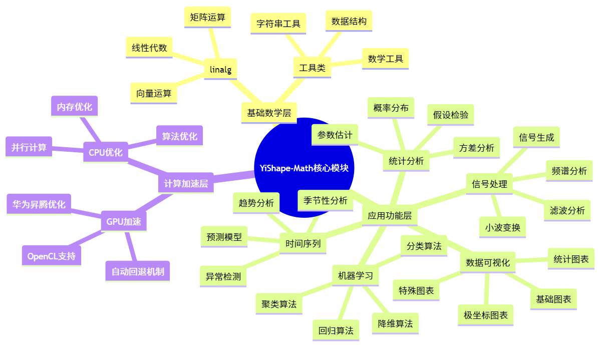
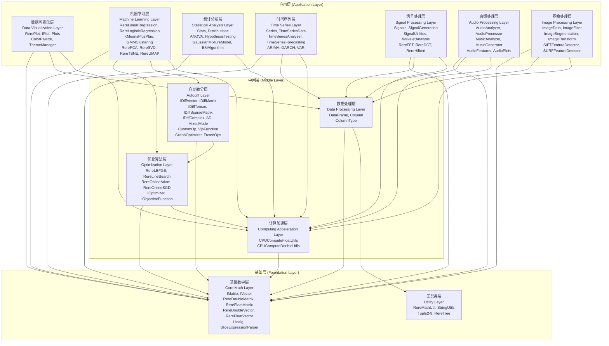

# YiShape-Math 易形数学

[](https://www.oracle.com/java/)
[](LICENSE.txt)
[]()

## 项目简介 / Project Introduction

**易形数学（YiShape-Math）** 是一个基于Java开发的数学计算库，提供向量&矩阵运算、数据可视化、统计学、最优化、距离度量学习、多目标规划、时间序列、信号处理、机器学习、向量索引等核心功能，其API设计最大程度拟合了Python NumPy、SkLearn等现代数值计算库的API风格。项目源自发起人读博期间研究距离度量学习算法时的最优化代码积累，后用于 电子科技大学 等高校 的《商务统计》、《商业大数据》、《数据分析与决策》等课程的实验教学。近年来经SIMD、Rust后端支持、BLAS3及列主序计算范式等方面性能优化改造，当前已经具备Java领域领先的工业级性能水准。本库当前也是 [易形空间 向量数据库管理系统（YiShape VecDB）](https://github.com/ScaleFree-Tech/YiShape-VecDB) 的底层数值计算组件，并已用于科学计算、商务数据分析、运筹学和机器学习的各类商业场景。为方便学习，我们提供的[ModelZoo](model_zoo/)下有大量应用建模示例，同时我们也正在编写中文版的[教材](book/)，内容完善将翻译对应的英文版本。

**YiShape-Math** is a Java-based mathematical computing library that provides core functionalities including vector & matrix operations, data visualization, statistics, optimization, distance metric learning, multi-criteria decision making, time series, signal processing, machine learning, and vector indexing. Its API design closely mirrors that of the Python NumPy and SciPy API. The library originated from optimization code accumulated during the founder's PhD research on distance metric learning algorithms, and has been used for experimental teaching of courses such as Business Statistics, Business Big Data, Data Analysis and Decision Making, Machine Learning and Data Mining at UESTC. The library has undergone performance optimization via SIMD, Rust native backend support, BLAS3, and column-major computation paradigms, and now achieves industrial-grade and leading performance in Java communities. It also serves as the underlying numerical computing component for the [YiShape Vector DataBase](https://github.com/ScaleFree-Tech/YiShape-VecDB), and has been applied in scientific computing, business data analysis, operations research, and machine learning. For learning purposes, the [ModelZoo](model_zoo/) provides numerous application modeling examples, and a Chinese textbook is being written at [book/](book/), with an English version to follow.


### 核心模块


## 主要功能 / Key Functions

### 🔢 核心数学运算 / Core Mathematical Operations
- **向量运算** / **Vector Operations**: 向量创建、数学运算、统计运算、切片索引等 / Vector creation, mathematical operations, statistical operations, slicing and indexing
- **矩阵运算** / **Matrix Operations**: 矩阵创建、基本运算、线性代数、矩阵变换、矩阵分解等 / Matrix creation, basic operations, linear algebra, matrix transformations, matrix decompositions
- **数学工具** / **Math Utilities**: 类型转换、随机数生成、数学函数 / Type conversion, random number generation, mathematical functions

### 📋 数据框操作 / DataFrame Operations
- **结构化数据处理** / **Structured Data Processing**: 完整的DataFrame数据处理功能 - *Complete DataFrame data processing functionality*
- **CSV文件读写** / **CSV file read/write**：支持自定义分隔符、表头、编码设置 / custom delimiters, headers, encoding settings
- **灵活数据切片** / **Flexible data slicing**：行切片、列切片、通用切片，支持负数索引和步长 / row, column, general slicing with negative indices and steps

### 📈 统计学运算 / Statistical Methods
- **概率分布** / **Probability Distributions**: 14种概率分布（正态、t、卡方、F、均匀、指数、Beta、Gamma、伯努利、二项、泊松、几何、负二项、离散均匀）和多元分布 / 14 probability distributions (Normal, t, Chi-squared, F, Uniform, Exponential, Beta, Gamma, Bernoulli, Binomial, Poisson, Geometric, Negative Binomial, Discrete Uniform) and multivariate distributions
- **概率函数与统计描述** / **Probability Functions and Statistical Descriptions**: PDF、CDF、PPF、SF、ISF计算, 均值、方差、标准差、中位数、众数、偏度、峰度等 / PDF, CDF, PPF, SF, ISF calculations, Mean, variance, standard deviation, median, mode, skewness, kurtosis and more
- **假设检验** / **Hypothesis Testing**: t检验、卡方检验、F检验、参数估计、置信区间估计 / t-tests, Chi-squared tests, F-tests, parameter estimation, confidence interval estimation
- **方差分析** / **Analysis of Variance**: 单因素ANOVA、双因素ANOVA、重复测量ANOVA / One-way ANOVA, Two-way ANOVA, Repeated Measures ANOVA
- **统计模型** / **Statistical Models**: 高斯混合模型(GMM)、EM算法 / Gaussian Mixture Model (GMM), EM Algorithm

### 📊 数据可视化 / Data Visualization
- **基础图表** / **Basic Charts**: 线图、散点图、饼图、柱状图、直方图、箱线图、K线图、小提琴图、回归图、核密度曲线图、配对图、联合图、热力图、漏斗图、桑基图、旭日图、热力图、雷达图等 / Line, scatter, pie, bar, histogram charts, boxplot, candlestick charts, violinplot, regplot, kde, pairplot, jointplot heatmap, funnel, sankey, sunburst, heatmap, radar charts.
- **统一样式系统** / **Unified Style System**: matplotlib风格样式表达式、流式API、主题管理 / matplotlib-style expressions, fluent API, theme management
- **三种后端实现** / **Three plotting providers**: JavaFx、Echarts、SVG三种后端实现，适用于不同场景 / JavaFx、Echarts、SVG, three kinds of ploting providers for difference applications


### 🧠 机器学习算法 / Machine Learning Algorithms
- **线性回归** / **Linear Regression**: 支持L1、L2、ElasticNet正则化，LBFGS优化 / Support for L1, L2, ElasticNet regularization with LBFGS optimization
- **分类算法** / **Classification Algorithms**: 逻辑回归、XGBoost、RandomForest、EnsembleClassifier
- **聚类算法** / **Clustering Algorithms**: K-Means++聚类、高斯混合模型聚类、聚类质量评估 / K-Means++ clustering, Gaussian Mixture Model clustering, clustering quality evaluation
- **降维算法** / **Dimensionality Reduction**: PCA、SVD、t-SNE、UMAP等降维方法 / PCA, SVD, t-SNE, UMAP dimensionality reduction methods
- **模型评估** / **Model Evaluation**: 回归结果分析和分类结果分析 / Regression and classification result analysis

### ⚡ 数学最优化 / Optimization Algorithms
- **优化器** / **Optimizers**: L-BFGS、DFP、共轭梯度法、最速下降法 / Quasi-Newton optimization algorithms
- **在线优化器** / **Online Optimizers**: SGD、Adam / Online stochastic optimization algorithms
- **线搜索** / **Line Search**: 一维搜索优化方 /One-dimensional search optimization methods
- **线性规划求解器** / **Linear Programming Solvers**: 单纯形法、内点法、拉格朗日乘数法、整数规划求解器 / Linear programming solvers*:Simplex, interior point, Lagrange multiplier, integer programming
- **约束优化** / **Constrained Optimization**: 拉格朗日乘数法、ADMM / Lagrange multiplier method, ADMM

### 🔗 自动微分 / Automatic Differentiation
- **反向模式 AD** / **Reverse-mode AD**: `AD.vector()` 创建变量，`loss.backward()` 自动传播梯度，支持 40+ 种运算（含 softmax/gelu/silu/mish/clamp/dropout/layerNorm 等高级激活函数）/ `AD.vector()` creates variables, `loss.backward()` auto-propagates gradients, 40+ ops (advanced activations: softmax/gelu/silu/mish/clamp/dropout/layerNorm + matmul)
- **前向模式 AD** / **Forward-mode AD**: `AD.jacobian()` 计算完整 Jacobian 矩阵，`AD.tangent()` 计算 Jacobian-vector product / `AD.jacobian()` for full Jacobian, `AD.tangent()` for JVP
- **混合模式 AD** / **Mixed-Mode AD**: `MixedMode.hvp()` 计算 Hessian-vector product，`MixedMode.hessian()` 计算完整 Hessian，forward-over-reverse 架构 / `MixedMode.hvp()` for HVP, `MixedMode.hessian()` for full Hessian, forward-over-reverse architecture
- **高阶微分** / **Higher-order Differentiation**: `AD.grad()` tape-of-tape 架构支持任意阶梯度计算 / `AD.grad()` tape-of-tape architecture supports arbitrary-order gradients
- **VJP / vmap** / **VJP & vmap**: `AD.vjp()` 可复用向量-Jacobian积算子，`AD.vmap()` 自动批处理，`AD.batchVjp()` 批量 VJP / `AD.vjp()` reusable VJP operator, `AD.vmap()` automatic batching, `AD.batchVjp()` batch VJP
- **计算图工具** / **Graph Tools**: 常量折叠、JIT 算子融合（`AD.fuse()`）、DOT 可视化（`AD.render()`）、JSON 调试导出（`AD.dumpGraphJson()`）、HPC 执行桥接 / Constant folding, JIT operator fusion (`AD.fuse()`), DOT visualization (`AD.render()`), JSON dump (`AD.dumpGraphJson()`), HPC execution bridge
- **Neural ODE**: `AD.odeint()` 通过 adjoint method 反向传播梯度穿过 ODE 求解器，含 RK4 积分器 / `AD.odeint()` backpropagates through ODE solvers via adjoint method, includes RK4 integrator
- **高级类型支持** / **Advanced Type Support**: 稀疏矩阵 autodiff（`IDiffSparseMatrix`）、复数 Wirtinger 导数（`IDiffComplex`）、可微张量（`IDiffTensor`）、混合精度 FP32（`AD.diffFloat()`）/ Sparse autodiff, complex Wirtinger derivatives, differentiable tensors, mixed precision FP32
- **自定义操作** / **Custom Operations**: `CustomOp` / `TensorCustomOp` 自包含可微操作，反向嵌入图节点 / `CustomOp` / `TensorCustomOp` self-contained differentiable ops with backward embedded in graph nodes
- **ML 集成** / **ML Integration**: `AD.optimize()` 一行代码替代手写梯度，与 L-BFGS/Adam/SGD 等优化器无缝配合 / One-liner gradient-free optimization with L-BFGS/Adam/SGD

### 🎯 多目标决策 / Multi-Criteria Decision Making
- **多目标线性规划 (MCLP)** / **Multi-Criteria Linear Programming**: 加权求和法、字典序法、目标规划法、Pareto 最优法、AHP、TOPSIS、交互式 STEM 法 / Weighted sum, lexicographic, goal programming, Pareto optimal, AHP, TOPSIS, interactive STEM
- **多目标二次规划 (MCQP)** / **Multi-Criteria Quadratic Programming**: 针对二次目标函数的多目标优化，支持双目标快速求解及完整 MCLP 求解器迁移 / Multi-objective optimization for quadratic objectives, bi-objective quick solve and full MCLP solver suite

### 📏 距离度量学习 / Distance Metric Learning (DML)
- **自主研发 DDML 算法** / **Proprietary DDML Algorithm**: 正则化对角距离度量学习，已发表于 INFORMS Journal on Computing (2025)，支持 L1/L2/弹性网正则化和自动特征选择 / Regularized diagonal distance metric learning published in INFORMS Journal on Computing (2024), with L1/L2/ElasticNet regularization and automatic feature selection
- **经典 DML 算法** / **Classic DML Algorithms**: NCA、LMNN、ITML、DML-eig、MMC、LDML、MCML、NCMML 等 14+ 种算法 / 14+ classic algorithms including NCA, LMNN, ITML, DML-eig, MMC, LDML, MCML, NCMML
- **核化 DML** / **Kernelized DML**: KLDA、KANMM、KDMLMJ、KODML 等核方法扩展 / Kernel extensions: KLDA, KANMM, KDMLMJ, KODML

### 📡 信号处理 / Signal Processing
- **信号生成与滤波** / **Signal Generation & Filtering**: 基本波形生成、噪声信号、移动平均、中值滤波、巴特沃斯滤波器等 / Basic waveform generation, noise signals, moving average, median filtering, Butterworth filters
- **频谱分析** / **Spectral Analysis**: FFT变换、功率谱密度、短时傅里叶变换、自相关分析等 / FFT transform, power spectral density, STFT, autocorrelation analysis
- **小波分析** / **Wavelet Analysis**: 离散小波变换(DWT)、连续小波变换(CWT)、小波去噪、小波压缩等 / Discrete Wavelet Transform (DWT), Continuous Wavelet Transform (CWT), wavelet denoising, wavelet compression

### ⏰ 时间序列分析 / Time Series Analysis
- **数据管理** / **Data Management**: 单变量/多变量时间序列、数据切片、重采样、时间戳处理等 / Univariate/multivariate time series, data slicing, resampling, timestamp handling
- **预测方法** / **Forecasting Methods**: 移动平均、指数平滑、ARIMA模型、Holt-Winters、自动模型选择等 / Moving average, exponential smoothing, ARIMA models, Holt-Winters, automatic model selection
- **滤波与分解** / **Filtering & Decomposition**: 时域/频域滤波、趋势/季节性分解、STL分解、小波分解等 / Time/frequency domain filtering, trend/seasonal decomposition, STL decomposition, wavelet decomposition


### 🚀 高性能计算 / High Performance Computing
- **SIMD (Single Instruction, Multiple Data)支持** / **SIMD Support**: 基于Java Vector API提供向量&矩阵乘法、通用函数、规约函数等方面的SIMD并行计算支持 / SIMD (Single Instruction, Multiple Data) parallel computing support based on Java Vector API 
- **Rust端HPC支持 / Rust Native Support**：支持通过 Java FFM 调用 Rust 原生数值计算库，为线性代数、线性规划、近似最近邻搜索和最优化提供 **3-12×** 加速。HPC 模式与纯 Java SISD/SIMD 共享同一套 API，切换无需修改业务代码。/ Support calling Rust native numerical libraries via Java FFM, providing **3-12×** speedup for linear algebra, linear programming, approximate nearest neighbor search, and optimization. HPC mode shares the same API as pure Java SISD/SIMD — no code changes needed to switch.


## 快速开始 / Quick Start

### 环境要求 / Requirements
- Java 25 或更高版本 / Java 25 or higher
- Maven 3.6+ / Maven 3.6+

### 安装 / Installation

#### 方式一：GitHub Packages（推荐 / Recommended）

在 `~/.m2/settings.xml` 中配置 GitHub Personal Access Token（需 `read:packages` 权限），`server` 的 `id` 须与仓库 `id` 一致。示例见 [`.github/maven-settings.example.xml`](.github/maven-settings.example.xml)。

Configure a GitHub Personal Access Token (PAT) with `read:packages` scope in `~/.m2/settings.xml`. The `server` `id` must match the repository `id`. See [`.github/maven-settings.example.xml`](.github/maven-settings.example.xml) for an example.

**核心库 / Core Library（必选 / Required）：**

```xml
<repositories>
  <repository>
    <id>github-math</id>
    <url>https://maven.pkg.github.com/ScaleFree-Tech/yishape-math</url>
  </repository>
</repositories>

<dependency>
  <groupId>com.yishape.lab</groupId>
  <artifactId>yishape-math</artifactId>
  <version>0.5.0</version>
</dependency>
```

**HPC 加速扩展 / HPC Acceleration（可选 / Optional）：**

添加 Rust 原生加速层，为线性代数、线性规划等提供 3–12× 加速：

Add the Rust native acceleration layer for 3–12× speedup on linear algebra, LP, and more:

```xml
<repositories>
  <repository>
    <id>github-hpc</id>
    <url>https://maven.pkg.github.com/ScaleFree-Tech/yishape-math-hpc</url>
  </repository>
</repositories>

<dependency>
  <groupId>com.yishape.lab</groupId>
  <artifactId>yishape-math-hpc</artifactId>
  <version>0.5.0</version>
</dependency>
```

**GPU 加速扩展 / GPU Acceleration（可选 / Optional）：**

添加 wgpu 着色器加速，为 autodiff 计算图提供 GPU 执行：

Add wgpu shader acceleration for GPU execution of autodiff compute graphs:

```xml
<repositories>
  <repository>
    <id>github-gpu</id>
    <url>https://maven.pkg.github.com/ScaleFree-Tech/yishape-math-gpu</url>
  </repository>
</repositories>

<dependency>
  <groupId>com.yishape.lab</groupId>
  <artifactId>yishape-math-gpu</artifactId>
  <version>0.5.0</version>
</dependency>
```

#### 方式二：源码构建 / Build from Source

无需 GitHub 账号，只需 JDK 25：

No GitHub account required — just JDK 25:

```bash
git clone https://github.com/ScaleFree-Tech/yishape-math.git
cd yishape-math
./mvnw install -DskipTests
```

HPC 和 GPU 扩展同样支持源码构建（`libs/` 目录已包含各平台预编译原生库，无需 Rust 工具链）：

The HPC and GPU extensions can also be built from source (`libs/` contains prebuilt native libraries for each platform — no Rust toolchain required):

```bash
# HPC（需预编译原生库放入 libs/ 目录 / requires prebuilt native libs in libs/）
git clone https://github.com/ScaleFree-Tech/yishape-math-hpc.git
cd yishape-math-hpc
./mvnw install -DskipTests -DskipNativeBuild=true

# GPU（需预编译原生库放入 libs/ 目录 / requires prebuilt native libs in libs/）
git clone https://github.com/ScaleFree-Tech/yishape-math-gpu.git
cd yishape-math-gpu
./mvnw install -DskipTests -DskipNativeBuild=true
```

#### JAR 下载 / JAR Download

无需 Maven：仓库 `libs/` 目录已包含 `yishape-math`、`yishape-math-hpc`、`yishape-math-gpu` 的预编译 JAR 及全部依赖（batik、javafx、pdfbox、echarts-java 等），直接下载加入 classpath 即可使用。也可从 [Releases](https://github.com/ScaleFree-Tech/yishape-math/releases) 下载。

No Maven needed: the `libs/` directory in this repo contains prebuilt JARs for `yishape-math`, `yishape-math-hpc`, `yishape-math-gpu`, and all dependencies (batik, javafx, pdfbox, echarts-java, etc.). Download and add to your classpath directly. You can also get them from [Releases](https://github.com/ScaleFree-Tech/yishape-math/releases).

### JVM 运行参数 / JVM Runtime Options

**SIMD / Vector API（可选 / Optional）：**

**不加** `--add-modules jdk.incubator.vector` 时，本库仍可正常使用，向量运算走标量（SISD）实现；**加上**该参数后，运行时会探测并成功加载 Vector API，即可使用 SIMD 路径（默认尝试 SIMD，可用 `-Dyishape.math.use.simd=false` 强制始终使用标量）。

**Without** `--add-modules jdk.incubator.vector`, it still runs normally and vector ops use scalar (SISD) paths. **With** that flag, the runtime can load the Vector API and use SIMD (SIMD is tried by default; use `-Dyishape.math.use.simd=false` to force scalar).

**HPC / GPU 原生访问（使用 HPC/GPU 扩展时必需 / Required for HPC/GPU）：**

```
--enable-native-access=ALL-UNNAMED
```


### API设计哲学

本库在API设计中参考了现代科学计算库的风格，如NumPy、SkLearn等，主要功能均包装在门面类中，并通过流式API引出绝大多数功能。十大面入口类如下表所示，使用时输入如：ML.，IDE会提示类下的成员。

This library follows the style of modern scientific computing libraries such as NumPy and SkLearn in its API design. Its main functions are encapsulated in facade classes, and most of its functionalities are exposed through a fluent API. The ten facade entry classes are shown in the following table. When using it, input like "ML." and the IDE will prompt the members under the class.

| 门面入口类 / Facade class | 包路径 / package | 职责 / Functions |
|--------|--------|------|
| `Linalg` | `com.yishape.lab.math.linalg` | 线性代数：矩阵/向量创建、分解、求解 /Linear Algebra: Matrix/Vector Creation, Decomposition, and Solution |
| `DataFrame` | `com.yishape.lab.math.data` | 数据框操作：结构化数据处理、CSV文件读写、数据切片 / Data Frame Operations: Structured Data Processing, CSV file read/write, Flexible data slicing.|
| `Stats` | `com.yishape.lab.math.stats` | 统计学：概率分布、假设检验、参数估计 / Statistics: Probability Distribution, Hypothesis Testing, Parameter Estimation |
| `ML` | `com.yishape.lab.math.ml` | 机器学习：分类、回归、降维、聚类、度量学习 / Machine Learning: Classification, Regression, Dimensionality Reduction, Clustering, Metric Learning |
| `Opts` | `com.yishape.lab.math.optimize` | 优化：无约束优化、线性规划、在线优化 / Optimization: Unconstrained optimization, linear programming, online optimization |
| `AD` | `com.yishape.lab.math.autodiff` | 自动微分：反向/前向/混合模式、计算图优化、Neural ODE、稀疏/复数/Tensor、HPC桥接 / Automatic differentiation: reverse/forward/mixed mode, graph optimization, Neural ODE, sparse/complex/tensor, HPC bridge |
| `Signals` | `com.yishape.lab.math.signal` | 信号处理：生成、滤波、变换、分析 / Signal processing: generation, filtering, transformation, analysis|
| `TSA` | `com.yishape.lab.math.timeseries` | 时间序列：预测、分解、滤波、协整分析 / Time series: Prediction, decomposition, filtering, cointegration analysis |
| `Plots` | `com.yishape.lab.math.plot` | 绘图：静态工厂创建 `IPlot`，支持 JavaFX/ECharts/SVG 后端 / Drawing: Static factory creates `IPlot`, supporting JavaFX/ECharts/SVG backends|
| `VI` | `com.yishape.lab.math.vecidx` | 向量索引：最近邻搜索（hnsw、LSH、KD-Tree等）/ Vector Index: Nearest Neighbor Search (hnsw, LSH, KD-Tree, etc.) |


### 基本使用示例 / Basic Usage Examples

#### 向量运算 / Vector Operations
```java
// 创建向量 / Create vectors
var v1 = Linalg.vector(new double[]{1, 2, 3, 4});
var v2 = Linalg.range(10);

// 基本运算 / Basic operations
var sum = v1.add(v2.slice("1:10:2"));
double dotProduct = v1.dot(v2.slice(5, -1, 1));

// 统计运算 / Statsistical operations
double mean = v1.mean();
double std = v1.std(1);//ddof = 1, 计算样本标准差/ sample std
```

#### 矩阵运算 / Matrix Operations
```java
// 创建矩阵 / Create matrices
var matrix1 = Linalg.ones(3, 3);
var matrix2 = Linalg.eye(3, 3);
var matrix3 = Linalg.rand(3, 3);

// 矩阵运算 / Matrix operations
var result = matrix1.add(matrix2).mmul(2.0);
var transposed = matrix2.t();
// 二维矩阵乘对应 NumPy np.dot(A,B) / A @ B，用 mmul；同形逐元素乘再求和用 frobeniusInnerProduct（≈ np.sum(A*B)）
// 2D matmul like np.dot(A,B) uses mmul; Frobenius inner product uses frobeniusInnerProduct
```

#### DataFrame 数据框操作 / DataFrame Operations
```java
// 从CSV文件读取数据 / Read data from CSV file
var df = DataFrame.readCsv("data.csv", ",", true);

// 数据切片 / Data slicing
var sliced = df.slice("1:3", "0:2");  // 行1-2，列0-1

// 转换为矩阵 / Convert to matrix
var matrix = df.toMatrix();

// 保存数据 / Save data
df.toCsv("output.csv");
```

#### 统计学分布 / Statistical Distributions
```java
// 创建分布 / Create distributions
var normal = Stats.norm(0, 1);  // 正态分布 / Normal distribution
var tDist = Stats.t(10);  // t分布 / t-distribution
var chi2Dist = Stats.chi2(5);  // 卡方分布 / Chi-squared distribution
var fDist = Stats.f(3, 7);  // F分布 / F-distribution
var uniform = Stats.uniform(0, 1);  // 均匀分布 / Uniform distribution
var exp = Stats.exponential(2.0);  // 指数分布 / Exponential distribution
var beta = Stats.beta(2, 3);  // Beta分布 / Beta distribution
var gamma = Stats.gamma(2, 1);  // Gamma分布 / Gamma distribution
var bernoulli = Stats.bernoulli(0.3);  // 伯努利分布 / Bernoulli distribution
var binomial = Stats.binomial(10, 0.5);  // 二项分布 / Binomial distribution
var poisson = Stats.poisson(2.5);  // 泊松分布 / Poisson distribution

// 概率函数计算 / Probability function calculations
double pdf = normal.pdf(1.0);  // 概率密度函数 / PDF
double cdf = normal.cdf(1.0);  // 累积分布函数 / CDF
double ppf = normal.ppf(0.95);  // 百分点函数 / PPF
double mean_val = normal.mean();  // 均值 / Mean
double variance = normal.var();  // 方差 / Variance
double[] samples = normal.sample(1000);  // 随机采样 / Random sampling
```

#### 假设检验与参数估计 / Hypothesis Testing and Parameter Estimation
```java
// 创建样本数据 / Create sample data
var sample = Linalg.vector(new double[]{1.2, 2.3, 1.8, 3.1, 2.7, 1.5, 2.9, 3.2, 2.1, 2.8});

// 参数估计 / Parameter estimation
var meanInterval = Stats.estimator.estimateMeanIntevalWithT(sample, 0.95);  // 均值置信区间 / Mean confidence interval

// 假设检验 / Hypothesis testing
var meanTest = Stats.tester.testMeanEqualWithT(2.0, sample, 0.95);  // 均值检验 / Mean test

// 方差分析 / Analysis of Variance
var group1 = Linalg.vector(new double[]{1, 2, 3, 4, 5});
var group2 = Linalg.vector(new double[]{2, 3, 4, 5, 6});
var result = Stats.anova.performOneWayANOVA(group1, group2);  // 单因素方差分析 / One-way ANOVA

// 相关性分析 / Correlation analysis
var x = Linalg.vector(new double[]{1, 2, 3, 4, 5});
var y = Linalg.vector(new double[]{2, 4, 6, 8, 10});
double correlation = Stats.corr(x, y);  // 皮尔逊相关系数 / Pearson correlation coefficient
```

#### 数据可视化 / Data Visualization
```java
// 基础线图 / Basic line chart
var x = Linalg.vector(new double[]{1, 2, 3, 4, 5});
var y = Linalg.vector(new double[]{10, 20, 15, 30, 25});
Plots.of(800, 600)
    .line(x, y)
    .title("销售趋势图", "2024年各月销售数据")
    .xlabel("月份")
    .ylabel("销售额（万元）")
    .show();

// matplotlib风格样式表达式 / matplotlib-style style expressions
Plots.of(800, 600)
    .line(x, y, "r-")        // 红色实线
    .line(x, y, "b--o")      // 蓝色虚线带圆圈
    .scatter(x, y, "ko")     // 黑色圆圈散点
    .title("样式表达式示例")
    .show();

// 高级颜色操作 / Advanced color operations
PlotStyle style = new PlotStyle()
    .color("#3498DB")
    .lineWidth(2.5)
    .opacity(0.8)
    .emphasis(new PlotStyle().color("#E74C3C").lineWidth(4.0))
    .blur(new PlotStyle().opacity(0.3));

Plots.of(800, 600)
    .line(x, y, style)
    .title("高级样式应用")
    .show();

// 主题管理 / Theme management
Plots.of(800, 600, "dark")  // 使用dark主题
    .line(x, y)
    .title("暗色主题图表")
    .show();

// 散点图，矢量图 / Scatter chart, vector graphics
Plots.ofSvg().scatter(x, y)
    .title("身高体重关系图")
    .xlabel("身高（cm）")
    .ylabel("体重（kg）")
    .saveAsSvg("scatter_chart.svg");

// 饼图 / Pie chart
IVector<Double> data = Linalg.vector(new double[]{30, 25, 20, 15, 10});
Plots.pie(data)
    .title("市场份额分布")
    .saveAsPng("pie_chart.png");

// 柱状图 / Bar chart
Plots.bar(data)
    .title("销售业绩对比")
    .xlabel("季度")
    .ylabel("销售额（万元）")
    .saveAsPng("bar_chart.png");

// 直方图 / Histogram
var histData = Linalg.vector(new double[]{1.2, 2.3, 1.8, 3.1, 2.7, 1.5, 2.9, 3.2, 2.1, 2.8});
Plots.hist(histData, true)  // true表示显示拟合线
    .title("数据分布直方图")
    .xlabel("数值区间")
    .ylabel("频次")
    .saveAsPng("histogram_chart.png");

// 箱线图 / Box plot
var boxData = Linalg.vector(new double[]{1, 2, 3, 4, 5, 6, 7, 8, 9, 10, 11, 12, 13, 14, 15});
List<String> labels = Arrays.asList("数据集");
Plots.boxplot(boxData, labels)
    .title("数据分布箱线图")
    .xlabel("指标")
    .ylabel("数值")
    .saveAsPng("boxplot_chart.png");

// K线图 / Candlestick chart
double[][] candlestickArray = {{100, 110, 95, 115}, {110, 120, 105, 125}, {120, 115, 110, 130}};
var candlestickData = Linalg.matrix(candlestickArray);
var dates = Arrays.asList("2024-01-01", "2024-01-02", "2024-01-03");
Plots.ofEcharts().candlestick(candlestickData, dates)
    .title("股票价格K线图")
    .xlabel("日期")
    .ylabel("价格（元）")
    .saveAsHtml("candlestick_chart.html");

// 小提琴图 / Violin plot
var violinData = Linalg.vector(new double[]{1, 2, 3, 4, 5, 6, 7, 8, 9, 10, 11, 12, 13, 14, 15});
Plots.violinplot(violinData, labels)
    .title("数据分布小提琴图")
    .xlabel("指标")
    .ylabel("数值")
    .saveAsPng("violin_chart.png");

```

#### 最优化算法 / Optimization Algorithms
```java
// L-BFGS优化器示例 / L-BFGS Optimizer Example
var optimizer = Opts.lbfgs();

// 定义目标函数（Rosenbrock函数）/ Define objective function (Rosenbrock function)
IObjectiveFunction objFun = (IVector x) -> {
            double x1 = x.get(0);
            double x2 = x.get(1);
            return (1 - x1) * (1 - x1) + 100 * (x2 - x1 * x1) * (x2 - x1 * x1);
        };

// 定义梯度函数 / Define gradient function
IGradientFunction grdFun = (IVector x) -> {
            double x1 = x.get(0);
            double x2 = x.get(1);
            double[] grad = new double[2];
            grad[0] = -2 * (1 - x1) - 400 * x1 * (x2 - x1 * x1);
            grad[1] = 200 * (x2 - x1 * x1);
            return Linalg.vector(grad);
        };

// 执行优化 / Execute optimization
var initX = Linalg.ones(2);
var result = optimizer.optimize(initX, objFun, grdFun);
```

```java
// 在线Adam优化器示例 / Online Adam Optimizer Example
var adamOptimizer = Opts.onlineAdam();

// 初始化优化器 / Initialize optimizer
var initialParams = Linalg.zeros(2);
adamOptimizer.initialize(initialParams);

// 在线学习循环 / Online learning loop
for (int i = 0; i < numIterations; i++) {
    IVector gradient = computeGradient(adamOptimizer.getCurrentParams());
    double loss = computeLoss(adamOptimizer.getCurrentParams());
    
    // 执行一步优化 / Perform one optimization step
    IVector updatedParams = adamOptimizer.step(gradient, loss);
    
    if (loss < tolerance) break;
}
```


#### 线性规划 / Linear Programming
```java
// 创建单纯形法求解器 / Create simplex solver
var solver = Opts.simplexLinProgSolver();

// 定义线性规划问题 / Define linear programming problem
// minimize 2x1 + 3x2
// subject to x1 + x2 = 5, x1 ≥ 0, x2 ≥ 0
var c = Linalg.vector(new double[]{2.0, 3.0});
var A_eq = Linalg.matrix(new double[][]{{1.0, 1.0}});
var b_eq = Linalg.vector(new double[]{5.0});

// 求解(等式约束调用solveEq，小于等于约束调用solve) / Solve(use solveEq() for equal constraints, use solve() for less than or equal constraints)
var result = solver.solveEq(c, A_eq, b_eq);

double optimalValue = result.getOptimalValue();
var optimalSolution = result.getOptimalPoint();

System.out.println("最优解: " + optimalSolution);
System.out.println("最优值: " + optimalValue);

```

#### 整数规划（0-1规划） / Integer Programming (0-1 Programming)
```java
// 创建整数规划求解器 / Create integer programming solver
var solver = Opts.intLinProgSolver();

// 定义整数规划问题 / Define integer programming problem
// minimize x1 + x2
// subject to x1 + x2 = 3, x1 ≥ 0, x2 ≥ 0, x1,x2 ∈ Z
var c = Linalg.vector(new double[]{1.0, 1.0});
var A_eq = Linalg.matrix(new double[][]{{1.0, 1.0}});
var b_eq = Linalg.vector(new double[]{3.0});

// 设置所有变量为整数(如果不是所有变量序号，则为混合整数规划) / Set all variables as integer(if not all variable indexes, it is mixed integer programming)
solver.addIntegerVariables(0, 1);
// 另一种方法设置所有变量为整数变量 / Another method to set all variables as integer variables
//solver.setAllVariablesInteger();
// 设置所有变量为二进制变量（0-1变量） / set all variables as binary variables (0-1 variables)
//solver.setAllVariablesBinary();

// 求解(等式约束调用solveEq，小于等于约束调用solve) / Solve(use solveEq() for equal constraints, use solve() for less than or equal constraints)
var result = solver.solveEq(c, A_eq, b_eq);

double optimalValue = result.getOptimalValue();
var optimalSolution = result.getOptimalPoint();

System.out.println("最优整数解 / Optimal solution: " + optimalSolution);
System.out.println("最优值 / Optimal value: " + optimalValue);

```

#### 多目标线性规划 / Multi-Criteria Linear Programming
```java
// 定义3个目标的线性系数 / Define 3 objective coefficients
IVector[] c = new IVector[]{
    Linalg.vector(new double[]{1.0, 2.0, 3.0}),
    Linalg.vector(new double[]{2.0, 1.0, 2.0}),
    Linalg.vector(new double[]{1.0, 1.0, 1.0})
};

// 不等式约束 Ax <= b / Inequality constraints
IMatrix A_ub = Linalg.matrix(new double[][]{
    {1.0, 1.0, 1.0},
    {2.0, 1.0, 0.0}
});
IVector b_ub = Linalg.vector(new double[]{10, 8});

// 加权求和法求解 / Weighted sum solver
var solver = Opts.mclp.weightedSumMclp(new double[]{0.5, 0.3, 0.2});
var result = solver.solve(c, A_ub, b_ub);

System.out.println(result.getSummary());
System.out.println("最优解 / Best solution: " + result.getSelectedSolution());
```

#### 多目标二次规划 / Multi-Criteria Quadratic Programming
```java
// 双目标二次规划：投资组合优化 / Bi-objective QP: portfolio optimization
IMatrix Q1 = Linalg.matrix(new double[][]{{0.1, 0.02}, {0.02, 0.08}}); // 风险矩阵 / Risk
IVector c1 = Linalg.vector(new double[]{-0.08, -0.06});                 // 收益 / Return
IMatrix Q2 = Linalg.matrix(new double[][]{{0.05, 0.01}, {0.01, 0.04}});
IVector c2 = Linalg.vector(new double[]{-0.05, -0.07});

// 约束：权重和为1，各资产>=0 / Constraints: sum=1, non-negative
IMatrix A_ub = Linalg.matrix(new double[][]{{-1.0, -1.0}});
IVector b_ub = Linalg.vector(new double[]{-1.0});

// 快速双目标求解（权重0.5）/ Quick bi-objective solve (weight 0.5)
var result = Opts.mcqp.solveBiObjective(Q1, c1, Q2, c2, A_ub, b_ub, 0.5);

System.out.println("最优配置 / Optimal allocation: " + result.getSelectedSolution());
System.out.println("目标值 / Objective values: " + Arrays.toString(result.getSelectedObjectiveValues()));
```

#### 自动微分 / Automatic Differentiation
```java
// 反向模式：定义损失函数，自动计算梯度
var x = AD.vector(new double[]{3.0, 4.0});
var loss = x.pow(2).sum();         // f(x) = Σ x_i²
loss.backward();                     // 自动计算 ∂f/∂x = 2x
var grad = x.getGradient();         // [6.0, 8.0]

// ML 训练：无需手写梯度代码
// 用 AD.matrix() 包装特征矩阵，AD.constant() 包装标签向量
var Xm = AD.matrix((IDoubleMatrix) Xc);
var yConst = AD.constant((IDoubleVector) y);
var w0 = Linalg.zeros(nFeatures + 1);
var result = AD.optimize(w0,
    w -> Xm.matmul(w).sub(yConst).square().mean(),  // MSE loss
    Opts.lbfgs()
);

// 前向模式 Jacobian
var J = AD.jacobian(z -> z.mul(z).exp(), x);

// Neural ODE: 梯度穿过 ODE 求解器反向传播
var z1 = AD.odeint(
    z -> z.tanh(),  // dynamics: dz/dt = tanh(z)
    z0, 0.0, 2.0, 0.1
);
var lossOde = z1.square().sum();
lossOde.backward();  // 通过 adjoint method 反向传播
```

#### 线性回归 / Linear Regression
```java
// 创建线性回归模型（L2正则化，岭回归） / Create linear regression model with L2 regularization, i.e., Ridge regression
// lambda1>0 → L1, lambda2>0 → L2, 均大于0 → ElasticNet / lambda1>0 → L1, lambda2>0 → L2, both >0 → ElasticNet
var lr = ML.reg.linear(0.0, 0.1);

// 训练模型 / Train model
var result = lr.fit(featureMatrix, labelVector);

// 预测 / Predict
double prediction = lr.predict(newFeatureVector);
```

#### 降维 / Dimensionality Reduction
```java
// 创建PCA降维器 / Create PCA reducer
var pca = ML.dr.pca(2);

// 执行降维 / Perform dimensionality reduction
var reducedData = pca.fitTransform(originalData);
```

#### 逻辑回归分类 / Logistic Regression Classification
```java
String path = "path of iris dataset/iris.csv";
try {
    // 读取数据集 / Read dataset
    var df = DataFrame.readCsv(path);
    // 提取特征和标签 / Extract features and labels
    var feature = df.sliceColumn(0, -1).toMatrix(); // get all the columns except the last one
    var labels = df.getColumn(-1).toStringArray(); // get the last column of the dataframe
    // 创建逻辑回归分类器（两个参数分别是L1和L2正则化系数） / Create logistic regression classifier (the two parameters are L1 and L2 regularization coefficients)
    var lr = ML.clf.logisticRegression(0.0,0.0);
    // 训练模型 / Train model
    var res = lr.fit(feature, labels).getResult();
    System.out.println(res);
    // 预测类别 / Predict classes
    var predicted = lr.predictBatch(feature);
    // 计算分类指标 / Compute classification metrics
    var metrics = ML.clf.classificationMetrics(lr, feature, labels);
    System.out.println(metrics);
    // 交叉验证 / Cross validation
    var result = ML.clf.kFoldCrossValidation(lr, feature, labels, 3);
    System.out.println(result);
} catch (Exception e) {
    e.printStackTrace();
}
```

#### 距离度量学习 / Distance Metric Learning
```java
// 学习对角度量（特征选择）/ Learn diagonal metric (feature selection)
var metric = ML.dml.diagDml(0.1, 0.01).fit(features, labels);

// 转换数据 / Transform data
var transformed = metric.transform(features);

// 查看特征权重 / View feature weights
IMatrix<Double> diag = metric.transformMatrix();
for (int i = 0; i < diag.getRowNum(); i++) {
    System.out.printf("Feature %d weight: %.4f%n", i, Math.sqrt(diag.get(i, i)));
}
```

#### 信号处理 / Signal Processing
```java
// 生成信号 / Generate signals
var time = Signals.linspace(0, 1, 1000);
var signal = Signals.sin(2 * Math.PI * 5 * time);  // 5Hz正弦波 / 5Hz sine wave

// 添加噪声 / Add noise
var noise = Signals.randn(1000).mul(0.1);
var noisySignal = signal.add(noise);

// 卡尔曼滤波 / Signal filtering
var filteredSignal = Signals.kalmanFilter(noisySignal, 0.1);

// 信号可视化 / Signal visualization
Plots.of(800, 400)
    .line(time, signal, "b-", "原始信号 / Original Signal")
    .line(time, noisySignal, "r-", "含噪声信号 / Noisy Signal")
    .line(time, filteredSignal, "g-", "滤波后信号 / Filtered Signal")
    .xlabel("时间 (秒) / Time (s)")
    .ylabel("幅度 / Amplitude")
    .title("信号处理示例 / Signal Processing Example")
    .legend()
    .show();
```

#### 时间序列分析 / Time Series Analysis
```java
var values = Linalg.vector(new double[]{10, 12, 13, 15, 18, 20, 22, 25, 28, 30});
var ts = TSA.data(values, "sales");

// Decompose
var decomp = TSA.decompose.classical(values, 4, DecompositionModel.ADDITIVE);
System.out.println("Trend: " + decomp.getTrend());
System.out.println("Seasonal: " + decomp.getSeasonal());

// Forecast
var forecast = TSA.forecast.arima(values, 2, 1, 1, 3, 0.95);
System.out.println("Forecast: " + forecast.getForecast());
System.out.println("95% CI lower: " + forecast.getLowerBounds());
System.out.println("95% CI upper: " + forecast.getUpperBounds());
```


## 核心类文档 / Core Classes Documentation

- [API设计哲学 (API Design Philosophy)](./docs/API-DESIGN-PHILOSOPHY.md) / [API Design Philosophy](./docs/API-DESIGN-PHILOSOPHY.md)
- [向量操作 (Vector Operations)](./docs/Vector-Operations.md) / [Vector Operations Documentation](./docs/Vector-Operations.md)
- [矩阵操作 (Matrix Operations)](./docs/Matrix-Operations.md) / [Matrix Operations Documentation](./docs/Matrix-Operations.md)
- [DataFrame 数据框操作 (DataFrame Operations)](./docs/DataFrame-Operations.md) / [DataFrame Operations Documentation](./docs/DataFrame-Operations.md)
- [数学工具类 (Math Utilities)](./docs/Math-Utilities.md) / [Math Utilities Documentation](./docs/Math-Utilities.md)
- [统计操作 (Statsistics Operations)](./docs/Statistics-Operations.md) / [Statistics Operations Documentation](./docs/Statsistics-Operations.md)
- [数据可视化 (Data Visualization)](./docs/Visualization-Plotting.md) / [Data Visualization Documentation](./docs/Visualization-Plotting.md)
- [机器学习 (Machine-Learning)](./docs/Machine-Learning.md) / [Machine-Learning Documentation](./docs/Machine-Learning.md)
- [距离度量学习 (DML)](./docs/DML/README.md) / [Distance Metric Learning Documentation](./docs/DML/README.md)
- [优化算法 (Optimization Algorithms)](./docs/Optimization-Algorithms.md) / [Optimization Algorithms Documentation](./docs/Optimization-Algorithms.md)
- [自动微分 (Autodiff)](./docs/Autodiff-Reference.md) / [Automatic Differentiation Documentation](./docs/Autodiff-Reference.md)
- [多目标线性规划 (MCLP)](./docs/MCLP-Operations.md) / [Multi-Criteria Linear Programming Documentation](./docs/MCLP-Operations.md)
- [多目标二次规划 (MCQP)](./docs/MCQP-Operations.md) / [Multi-Criteria Quadratic Programming Documentation](./docs/MCQP-Operations.md)
- [信号处理 (Signal Processing)](./docs/Signal-Processing.md) / [Signal Processing Documentation](./docs/Signal-Processing.md)
- [时间序列分析 (Time Series Analysis)](./docs/Time-Series-Analysis.md) / [Time Series Analysis Documentation](./docs/Time-Series-Analysis.md)
- [HPC 性能指南 (HPC Performance)](./docs/HPC-Performance.md) / [HPC Performance Guide](./docs/HPC-Performance.md)


## 使用示例 / Usage Examples

- [向量运算示例](./docs/examples/Vector-Examples.md) / [Vector Operations Examples](./docs/examples/Vector-Examples.md)
- [矩阵运算示例](./docs/examples/Matrix-Examples.md) / [Matrix Operations Examples](./docs/examples/Matrix-Examples.md)
- [DataFrame 数据框示例](./docs/examples/DataFrame-Examples.md) / [DataFrame Examples](./docs/examples/DataFrame-Examples.md)
- [数学工具类示例](./docs/examples/Math-Utilities-Examples.md) / [Math Utilities Examples](./docs/examples/Math-Utilities-Examples.md)
- [统计操作示例](./docs/examples/Statistics-Examples.md) / [Statistics Operations Examples](./docs/examples/Statsistics-Examples.md)
- [数据可视化示例](./docs/examples/Visualization-Plotting-Examples.md) / [Data Visualization Examples](./docs/examples/Visualization-Plotting-Examples.md)
- [机器学习示例](./docs/examples/Machine-Learning-Examples.md) / [Machine Learning Examples](./docs/examples/Machine-Learning-Examples.md)
- [距离度量学习示例](./docs/examples/DML-Examples.md) / [Distance Metric Learning Examples](./docs/examples/DML-Examples.md)
- [优化算法示例](./docs/examples/Optimization-Examples.md) / [Optimization Algorithms Examples](./docs/examples/Optimization-Examples.md)
- [自动微分示例](./docs/examples/Autodiff-Examples.md) / [Automatic Differentiation Examples](./docs/examples/Autodiff-Examples.md)
- [多目标线性规划示例](./docs/examples/MCLP-Examples.md) / [Multi-Criteria Linear Programming Examples](./docs/examples/MCLP-Examples.md)
- [多目标二次规划示例](./docs/examples/MCQP-Examples.md) / [Multi-Criteria Quadratic Programming Examples](./docs/examples/MCQP-Examples.md)
- [信号处理示例](./docs/examples/Signal-Processing-Examples.md) / [Signal Processing Examples](./docs/examples/Signal-Processing-Examples.md)


## 项目结构 / Project Structure

### 整体架构图 / Overall Architecture


```mermaid
graph TB
    subgraph "应用层 (Application Layer)"
        VIZ[数据可视化层<br/>Data Visualization Layer<br/>RerePlot, IPlot, Plots<br/>ColorPalette, ThemeManager]
        ML[机器学习层<br/>Machine Learning Layer<br/>RereLinearRegression, RereLogisticRegression<br/>KMeansPlusPlus, GMMClustering<br/>RerePCA, RereSVD, RereTSNE, RereUMAP]
        STAT[统计分析层<br/>Statistical Analysis Layer<br/>Stats, Distributions<br/>ANOVA, HypothesisTesting<br/>GaussianMixtureModel, EMAlgorithm]
        TS[时间序列层<br/>Time Series Layer<br/>Series, TimeSeriesData<br/>TimeSeriesAnalyzer, TimeSeriesForecasting<br/>ARIMA, GARCH, VAR]
        SIG[信号处理层<br/>Signal Processing Layer<br/>Signals, SignalGeneration<br/>SignalUtilities, WaveletAnalysis<br/>RereFFT, RereDCT, RereHilbert]
        AUD[音频处理层<br/>Audio Processing Layer<br/>AudioAnalyzer, AudioProcessor<br/>MusicAnalyzer, MusicGenerator<br/>AudioFeatures, AudioPlots]
        IMG[图像处理层<br/>Image Processing Layer<br/>ImageData, ImageFilter<br/>ImageSegmentation, ImageTransform<br/>SIFTFeatureDetector, SURFFeatureDetector]
    end
    
    subgraph "中间层 (Middle Layer)"
        DATA[数据处理层<br/>Data Processing Layer<br/>DataFrame, Column<br/>ColumnType]
        OPT[优化算法层<br/>Optimization Layer<br/>RereLBFGS, RereLineSearch<br/>RereOnlineAdam, RereOnlineSGD<br/>IOptimizer, IObjectiveFunction]
        AUDIFF[自动微分层<br/>Autodiff Layer<br/>IDiffVector, IDiffMatrix<br/>IDiffTensor, IDiffSparseMatrix<br/>IDiffComplex, AD, MixedMode<br/>CustomOp, VjpFunction<br/>GraphOptimizer, FusedOps]
        COMP[计算加速层<br/>Computing Acceleration Layer<br/>CPUComputeFloatUtils<br/>CPUComputeDoubleUtils]
    end
    
    subgraph "基础层 (Foundation Layer)"
        MATH[基础数学层<br/>Core Math Layer<br/>IMatrix, IVector<br/>RereDoubleMatrix, RereFloatMatrix<br/>RereDoubleVector, RereFloatVector<br/>Linalg, SliceExpressionParser]
        UTIL[工具类层<br/>Utility Layer<br/>RereMathUtil, StringUtils<br/>Tuple2-9, RereTree]
    end
    
    VIZ --> MATH
    VIZ --> DATA
    VIZ --> COMP
    ML --> MATH
    ML --> OPT
    ML --> AUDIFF
    ML --> COMP
    AUDIFF --> MATH
    AUDIFF --> OPT
    STAT --> MATH
    STAT --> COMP
    TS --> MATH
    TS --> DATA
    TS --> COMP
    SIG --> MATH
    SIG --> DATA
    SIG --> COMP
    AUD --> MATH
    AUD --> DATA
    AUD --> COMP
    IMG --> MATH
    IMG --> DATA
    IMG --> COMP
    DATA --> MATH
    DATA --> UTIL
    OPT --> MATH
    OPT --> COMP
    COMP --> MATH
```


### 文件结构 / File Structure

[文件结构 / File Structure](./file_structure.md "Click to view file structure")


## 高性能计算 / High Performance Computing (HPC)

过去40年，高性能数值计算库主要由Fortran、C++及Rust语言构建，如BLAS、LAPACK、Highs等。虽然我们已在SIMD、BLAS3、列主序计算等方面作了最大程度的优化，但Java作为一种主要用于商务系统的虚拟机语言，短期内难以补全在CPU密集数值计算领域的积累。鉴于此，我们为本库构建了一种HPC （High Performance Computing）模式，即通过Java FFM调用由Rust语言封装的Faer、Highs等库，以实现原生的高性能计算。因此，本库主要有三种后端支持：SISD、SIMD、HPC，如下表介绍。

Over the past 40 years, high-performance numerical computing libraries have mainly been built using Fortran, C++ and Rust languages, such as BLAS, LAPACK, Highs, etc. Although we have made the maximum optimization in areas like SIMD, BLAS3, and column-major computing, Java, as a virtual machine language mainly used for business systems, is unlikely to fully compensate for the accumulated experience in CPU-intensive numerical computing in the short term. In view of this, we have built an HPC (High Performance Computing) mode for this library, that is, by calling the libraries encapsulated in Rust language such as Faer and Highs through Java FFM, to achieve native high-performance computing. Therefore, this library mainly has three backend supports: SISD, SIMD, and HPC, as introduced in the following table.


The HPC library is optional. To use the HPC extention, you need to include the following reference in your Maven pom.xml.

**Maven（须与 yishape-math 同版本；不随主库传递，须显式声明）:**

```xml
<repositories>
  <repository>
    <id>github-hpc</id>
    <url>https://maven.pkg.github.com/ScaleFree-Tech/yishape-math-hpc</url>
  </repository>
</repositories>

<dependency>
    <groupId>com.yishape.lab</groupId>
    <artifactId>yishape-math-hpc</artifactId>
    <version>0.5.0</version>
</dependency>
```

`settings.xml` 中为 `github-hpc` 配置 PAT，见 [`.github/maven-settings.example.xml`](.github/maven-settings.example.xml)。Windows 预编译库已打入 HPC JAR 的 `META-INF/native-libs/windows-x86_64/`；运行应用时需 `--enable-native-access=ALL-UNNAMED`。


**三种执行后端 / Three Execution Backends**:

| 后端 / Backend | 说明 / Description | 适用场景 / Use Case |
|------|------|------|
| **YiShape SISD** | 纯 Java 标量 / Pure Java scalar | 零依赖部署 / Zero-dependency deployment |
| **YiShape SIMD** | Java Vector API 向量化 / Vector API vectorization | 通用加速 / General acceleration |
| **YiShape HPC** | Rust 原生 via JNI / Rust native via JNI | 大规模极致性能 / Max performance at scale |

为验证本库的数值计算性能，我们针对常见的数值计算场景，如SVD、GEMM、线性规划等，与其它著名的数值计算库，如Common Math3（CM4）、NumPy（BLAS/LAPACK Python封装）进行了对比验证。

> 测试环境：Java 25，Intel Core i7-13700H，DDR5-5600。/ Test env: Java 21, Intel Core i7-13700H, DDR5-5600.

**SVD 分解 / SVD Decomposition**（单位 ms）

| 规模 | SISD | SIMD | HPC | CM4 | NumPy |
|------|-----:|-----:|----:|----:|------:|
| 200×200 | 54.7 | 91.9 | **15.2** | 87.4 | 90.8 |
| 500×500 | 775 | 876 | **131** | 1818 | 555 |
| 1000×1000 | 7131 | 6146 | **597** | 23551 | 1978 |

**GEMM 矩阵乘法 / Matrix Multiplication**（单位 ms）

| 规模 | SISD | SIMD | HPC | CM4 | NumPy |
|------|-----:|-----:|----:|----:|------:|
| 500×500 | 16.1 | 20.2 | 6.3 | 176 | **3.1** |
| 1000×1000 | 136 | 146 | 33.5 | 1975 | **28.8** |
| 1500×1500 | 539 | 581 | 111 | 23879 | **101** |

**Cholesky 分解 / Cholesky Decomposition**（单位 ms）

| 规模 | SISD | SIMD | HPC | CM4 | NumPy |
|------|-----:|-----:|----:|----:|------:|
| 200×200 | **0.46** | 4.1 | 4.9 | 1.5 | 4.0 |
| 500×500 | **5.0** | 5.2 | 24.0 | 13.7 | 11.3 |
| 1000×1000 | 78.1 | 63.3 | 50.8 | 106 | **33.8** |

**LU 分解 / LU Decomposition**（单位 ms）

| 规模 | SISD | SIMD | HPC | CM4 | NumPy |
|------|-----:|-----:|----:|----:|------:|
| 200×200 | 8.2 | 8.8 | 12.4 | 9.6 | **2.1** |
| 500×500 | 85.3 | **41.4** | 58.5 | 49.2 | 92.8 |
| 1000×1000 | 334 | 239 | 150 | 507 | **146** |

**QR 分解 / QR Factorization**（单位 ms）

| 规模 | SISD | SIMD | HPC | CM4 | NumPy |
|------|-----:|-----:|----:|----:|------:|
| 200×200 | 8.0 | 7.5 | 106 | **4.4** | 23.1 |
| 500×500 | 85.5 | 63.2 | 283 | 111 | **109** |
| 1000×1000 | 666 | 486 | 1039 | 802 | **345** |

**线性方程组求解 Ax=b / Linear System**（单位 ms）

| 规模 | SISD | SIMD | HPC| CM4 | NumPy |
|------|-----------|-----------|-----------------|----------|------------|
| 100 | 1.7 | **0.94** | 2.8 | 0.73 | 9.8 |
| 500 | 9.8 | **8.9** | 42.6 | 44.2 | 121 |
| 1000 | **83.9** | 97.0 | 101 | 574 | 154 |
| 1500 | 283 | 270 | 189 | 2919 | **165** |

**线性规划 (LP) / Linear Programming**（单位 ms；SISD 列为本库的纯Java实现：RereSimplexLinProgSolver，HPC和SciPy均使用线性规划专业求解库：HiGHS，CM4不适用）

| 规模 (n×m) | SISD | SIMD | HPC | CM4 | SciPy |
|------------|-----:|-----:|----:|----:|------:|
| 500×500 | 27.9 | — | 12.6 | — | **8.5** |
| 500×1000 | 530 | — | **204** | — | 224 |
| 1000×1000 | 167 | — | 44.1 | — | **20.3** |
| 1000×2000 | 4991 | — | 844 | — | **774** |
| 2000×2000 | 783 | — | 223 | — | **62.8** |
| 2000×4000 | 41999 | — | **3577** | — | 3673 |
| 3500×3500 | 2721 | — | 706 | — | **185** |


**L-BFGS 最优化 / L-BFGS Optimization**（单位 ms）

| 问题 | SISD | SIMD | HPC | CM4 | SciPy |
|------|-----:|-----:|----:|----:|------:|
| Rosenbrock 2D | **0.37** | 0.68 | 0.39 | — | 4.8 |
| Extended Rosenbrock, d=100 | **0.35** | — | 1.2 | — | 64.9 |
| Extended Rosenbrock, d=500 | **3.1** | — | 2.2 | — | 69.3 |


> 详细文档 / Full documentation: [HPC Performance Guide](docs/HPC-Performance.md)


以上测试结果表明，在大规模矩阵乘法等运算上，本库的纯Java实现相对于其它Java数值计算库（如Common-Math4.jar）有约 **10** 倍的性能领先。而在大规模矩阵分解（SVD / LU）等方面，本库的HPC版本相对纯Java实现又加速达 **3–12×** 倍。

The above test results indicate that in operations such as large-scale matrix multiplication, the pure Java implementation of this library has approximately **10** times higher performance compared to other Java numerical computing libraries (such as Common-Math4.jar). In terms of large-scale matrix decomposition (SVD/LU), the HPC version of this library is **3-12** times faster than the pure Java implementation.

## 扩展计算 / Extentions

为打通Java与专业数值计算社区的生态，我们构建了一个专门的与Julia语言（数学专用语言）进行桥接的中间件库：[Ju4Ja](https://github.com/lteb2002/ju4ja), [https://github.com/lteb2002/ju4ja](https://github.com/lteb2002/ju4ja)。如果您有复杂的数值计算需求，可以使用Julia语言实现，然后在Java中通过Ju4Ja库来调用Julia功能。

To connect the Java communities to professional numerical computing capabilities, we've built a specialized middleware library, [Ju4Ja](https://github.com/lteb2002/ju4ja), [https://github.com/lteb2002/ju4ja](https://github.com/lteb2002/ju4ja), to bridge the gap with the mathematically specialized Julia language. If you have complex numerical computing needs, you can implement them in Julia and call Julia functionality from Java using the Ju4Ja library.

## 贡献指南 / Contributing

我们欢迎社区贡献！请遵循以下步骤：

We welcome community contributions! Please follow these steps:

1. Fork 本项目 / Fork this project
2. 创建特性分支 / Create a feature branch (`git checkout -b feature/AmazingFeature`)
3. 提交更改 / Commit your changes (`git commit -m 'Add some AmazingFeature'`)
4. 推送到分支 / Push to the branch (`git push origin feature/AmazingFeature`)
5. 开启 Pull Request / Open a Pull Request

### 贡献指南 / Contribution Guidelines

- 请确保代码符合项目的编码规范 / Please ensure your code follows the project's coding standards
- 添加适当的测试用例 / Add appropriate test cases
- 更新相关文档 / Update relevant documentation
- 确保所有测试通过 / Ensure all tests pass

## 许可证 / License

本项目采用 Apache License 2.0 - 查看 [LICENSE](LICENSE.txt) 文件了解详情。

This project is licensed under the Apache License, Version 2.0 - see the [LICENSE](LICENSE.txt) file for details.

### Apache 2.0 许可证条款 / Apache 2.0 License Terms

Apache 2.0 是一个宽松的开源许可证，允许您自由使用、修改、分发和销售软件，同时提供专利授权保护。

The Apache 2.0 License is a permissive open-source license that allows you to freely use, modify, distribute, and sell the software, with explicit patent grant protection.

## 联系方式 / Contact

- 项目维护者 / Project Maintainer: Big Data and Decision Analytics Research Center of UESTC, Big Data Research Institute of SWUFE, School of Artificial Intelligence and Big Data of HAUT, and Chengdu Scale-Free Tech Ltd.
- 项目地址 / Project URL: [https://github.com/ScaleFree-Tech/yishape-math](https://github.com/ScaleFree-Tech/yishape-math), [https://gitee.com/scalefree-tech/yishape-math](https://gitee.com/scalefree-tech/yishape-math).
- 问题反馈 / Issues: [https://github.com/ScaleFree-Tech/yishape-math/issues](https://github.com/ScaleFree-Tech/yishape-math/issues)

### 获取帮助 / Getting Help

如果您在使用过程中遇到问题，可以通过以下方式获取帮助：

If you encounter any issues while using the library, you can get help through the following channels:

- **GitHub Issues**: 报告bug或提出功能请求 / Report bugs or request features
- **文档**: 查看详细的API文档和示例 / Check detailed API documentation and examples
- **社区**: 参与讨论和分享经验 / Participate in discussions and share experiences

## 更新日志 / Changelog

### v0.5.0 (2026-06)
- 自动微分 / Automatic Differentiation
- 多目标决策 / Multi-Criteria Decision Making
- 距离度量学习 / Distance Metric Learning
- Rust端HPC支持 / Rust Native Support
- WGPU支持 / WGPU Support
- 由于依赖于Java FFM API与RUST端交互，JDK切换为25 / JDK switch to version 25 because Java FFM API is need

### v0.3.8 (2026-05)
- **Bug Fixes** / **Bug Fixes**: 修复了矩阵分解、降维等方面的错误 / Bug fixes concerning matrix decomposition and dimension reduction
- **绘图系统增加JavaFx和SVG两种新的实现 / Two new implementations of the plotting system: JavaFx and SVG**:  增加JavaFx和SVG两种新的绘图实现，增强了kde曲线、回归线、配对图、联合图等 / Added two new plotting implementations, JavaFx and SVG, which enhanced KDE curves, regression lines, scatter plots, joint plots, etc.
- **分类器增加线性SVM和决策树，增强了XGBoost / New classifiers: linear SVM and decision tree, and enhanced XGBoost.**:  增加了线性SVM和单颗决策树，XGBoost性能得到增强 / Added linear SVM and decision tree, and the performance of XGBoost has been enhanced.

### v0.3.7 (2025-12)
- **Bug Fixes** / **Bug Fixes**: 修复了LU分解、T检验、逻辑斯蒂回归等方面的错误 / Bug fixes and error corrections
- **优化运算效率提升 / Optimization Performance Improvement**:  改进了L-BFGS等算法中的缓存机制，优化效率得以提升 / The cache mechanism in optimization algorithms such as L-BFGS has been improved, leading to an enhanced optimization efficiency.
- **暂时移除GPU支持 / Remove GPU support temporarily**:  由于GPU计算依赖的包过重，在复杂的优化算法中性能提升有限，暂时移除 / Due to the heavy dependency of GPU computing packages, the performance improvement in complex optimization algorithms is limited, and GPU support is temporarily removed.

### v0.3.0 (2025-10)
- **SIMD (Single Instruction, Multiple Data)支持** / **SIMD Support**: 基于Java Vector API提供向量&矩阵乘法、通用函数、规约函数等方面的SIMD并行计算支持 / SIMD (Single Instruction, Multiple Data) parallel computing support based on Java Vector API
- **Bug Fixes** / **Bug Fixes**: 修复已知问题和错误 / Bug fixes and error corrections

### v0.2.2 (2025-09)
- **新增音频处理功能** / **New Audio Processing Features**: 音频特征提取、音高检测、音频增强、i-vector模型训练等 / Audio feature extraction, pitch detection, audio enhancement, i-vector model training
- 📡 信号处理模块：信号生成、滤波、频谱分析、小波分析 / Signal processing: generation, filtering, spectral analysis, wavelet analysis
- ⏰ 时间序列分析：数据管理、预测方法、滤波分解、可视化 / Time series: data management, forecasting, filtering, visualization

### v0.2.0 (2025-08，初始开源 / initial open source)
- ⚡ GPU加速计算：矩阵运算、向量运算、高级运算，支持自动回退 / GPU acceleration: matrix/vector operations, advanced computing with auto-fallback
- 📊 DataFrame数据框：CSV读写、数据切片、NumPy风格切片语法 / DataFrame: CSV I/O, data slicing, NumPy-style slicing
- 📊 数据可视化：基础图表、统计图表、特殊图表，ECharts集成 / Visualization: basic/statistical/special charts, ECharts integration
- 📈 统计学增强：14种概率分布、统计描述、假设检验 / Statistics: 14 distributions, statistical descriptions, hypothesis testing
- 📊 统计学分布函数库：正态、t、卡方、F、均匀、指数分布 / Statistical distributions: normal, t, chi-squared, F, uniform, exponential
- 🔢 概率密度函数和累积分布函数 / PDF and CDF functions
- 📋 统计描述功能：均值、方差、中位数、众数等 / Statistical descriptions: mean, variance, median, mode
- ✨ 向量与矩阵、最优化与机器学习：核心向量矩阵运算、机器学习算法、优化算法、降维算法 / Initial release: core operations, ML algorithms, optimization, dimensionality reduction

---

**YiShape-Math** - 让Java应用中的数学计算更简单、更高效！

**YiShape-Math** - Making mathematical computing simpler and more efficient for Java applications!
