# YiShape-Math 易形数学

[](https://www.oracle.com/java/)
[](LICENSE)
[]()

## 项目简介 / Project Introduction

**易形数学（YiShape-Math）** 是一个基于Java开发的数学计算库，提供向量运算、矩阵运算、机器学习算法、优化算法、统计学方法和降维算法等核心功能，其API设计最大程度拟合了Python NumPy和SciPy的API。本库的初始目的是用于 电子科技大学《商务统计》、《商业大数据》、《数据分析与决策》、《工程项目管理》等课程的实验教学，通过亲自动手编程以学习线性代数、统计学、最优化、机器学习等领域算法的底层计算原理。本库当前也是 [易形空间 向量数据库管理系统（YiShape VecDB）](https://github.com/ScaleFree-Tech/YiShape-VecDB) 的底层数学基础设施。本库使用简单、性能优异，适用于科学计算、数据分析和机器学习等领域的各类应用。

**YiShape-Math** is a Java-based mathematical computing library that provides core functionalities including vector and matrix operations, machine learning algorithms, optimization algorithms, statistical methods, and dimensionality reduction techniques, and its API design closely mirrors that of the Python NumPy and SciPy API. The initial purpose of the library is to be used for the experimental teaching of courses such as "Business Statistics", "Big Data in Business", "Data Analysis and Decision Making", and "Project Management" at UESTC. Through hands-on programming, students can learn the underlying computational principles of algorithms in fields such as linear algebra, statistics, optimization, and machine learning. The library now also serves as the underlying mathematical infrastructure for the [YiShape Vector DataBase](https://github.com/ScaleFree-Tech/YiShape-VecDB). The library offers ease of use and excellent performance, making it suitable for scientific computing, data analysis, machine learning applications, etc.

## 主要特性 / Key Features

### 🚀 核心数学运算 / Core Mathematical Operations
- **向量运算** / **Vector Operations**: 完整的向量数学运算和统计功能
  - *Complete vector mathematical operations and statistical functions*
  - 向量创建：支持多种数据类型、范围向量、特殊向量（全1、全0、随机） / Vector creation: multiple data types, range vectors, special vectors (ones, zeros, random)
  - 数学运算：向量间运算、标量运算、内积、外积、叉积 / Mathematical operations: vector-to-vector, scalar operations, inner product, outer product, cross product
  - 统计运算：均值、方差、标准差、中位数、众数、偏度、峰度等 / Statistical operations: mean, variance, standard deviation, median, mode, skewness, kurtosis
  - 切片索引：支持NumPy风格切片、布尔索引、条件筛选 / Slicing and indexing: NumPy-style slicing, boolean indexing, conditional filtering
  - 通用函数：数学函数、三角函数、对数函数、指数函数 / Universal functions: mathematical, trigonometric, logarithmic, exponential functions
- **矩阵运算** / **Matrix Operations**: 完整的矩阵数学运算和线性代数功能
  - *Complete matrix mathematical operations and linear algebra functions*
  - 矩阵创建：多种构造方式、特殊矩阵（单位、对角、随机）、文件加载 / Matrix creation: multiple construction methods, special matrices (identity, diagonal, random), file loading
  - 基本运算：矩阵加减乘除、标量运算、元素级运算 / Basic operations: matrix addition/subtraction/multiplication/division, scalar operations, element-wise operations
  - 线性代数：矩阵分解、特征值分解、奇异值分解、QR分解 / Linear algebra: matrix decomposition, eigenvalue decomposition, SVD, QR decomposition
  - 矩阵变换：转置、幂运算、逆矩阵、伪逆矩阵、行列式 / Matrix transformations: transpose, power, inverse, pseudo-inverse, determinant
  - 统计功能：协方差矩阵、相关系数矩阵、矩阵范数 / Statistical functions: covariance matrix, correlation matrix, matrix norms
- **数学工具** / **Math Utilities**: 类型转换、随机数生成、数学函数
  - *Type conversion, random number generation, and mathematical functions*

### 📊 数据框操作 / DataFrame Operations
- **结构化数据处理** / **Structured Data Processing**: 完整的DataFrame数据处理功能
  - *Complete DataFrame data processing functionality*
  - CSV文件读写：支持自定义分隔符、表头、编码设置 / CSV file read/write: custom delimiters, headers, encoding settings
  - 灵活数据切片：行切片、列切片、通用切片，支持负数索引和步长 / Flexible data slicing: row, column, general slicing with negative indices and steps

### 📊 统计学运算 / Statistical Methods
- **分布函数** / **Statistical Distributions**: 正态分布、t分布、卡方分布、F分布、均匀分布、指数分布等
  - *Normal, t, Chi-squared, F, Uniform, Exponential distributions and more*
- **概率密度函数** / **Probability Density Functions**: 完整的PDF和CDF计算
  - *Complete PDF and CDF calculations*
- **随机数生成** / **Random Number Generation**: 各种分布的随机数生成器
  - *Random number generators for various distributions*
- **统计描述** / **Statistical Descriptions**: 均值、方差、标准差、中位数、众数等
  - *Mean, variance, standard deviation, median, mode, and more*
- **假设检验** / **Hypothesis Testing**: 假设检验、参数估计
  - *Hypothesis testing and parameter estimation*
- **方差分析** / **ANOVA**: Analysis of Variance
  - *Analysis of Variance*

### 📈 数据可视化 / Data Visualization
- **基础图表** / **Basic Charts**: 线图、散点图、饼图、柱状图、直方图
  - *Line, scatter, pie, bar, histogram charts*
- **极坐标图表** / **Polar Charts**: 极坐标柱状图、极坐标线图、极坐标散点图
  - *Polar bar, polar line, polar scatter charts*
- **统计图表** / **Statistical Charts**: 箱线图、K线图、小提琴图
  - *Boxplot, candlestick charts, violinplot*
- **特殊图表** / **Special Charts**: 漏斗图、桑基图、旭日图、主题河流图、树图、矩形树图、关系图、平行坐标图
  - *Funnel, Sankey, Sunburst, Theme River, Tree, Treemap, Graph, Parallel charts*
- **扩展图表** / **Enhanced Charts**: 热力图、雷达图、仪表盘
  - *Heatmap, radar, gauge charts*
- **ECharts集成** / **ECharts Integration**: 基于ECharts-Java的丰富可视化功能
  - *Rich visualization capabilities based on ECharts-Java*
- **流式API** / **Fluent API**: 支持链式调用的简洁API设计
  - *Fluent API design supporting chained method calls*
- **主题支持** / **Theme Support**: 多种内置主题和自定义主题
  - *Multiple built-in themes and custom theme support*
- **交互功能** / **Interactive Features**: 缩放、平移、悬停、图例交互等
  - *Zoom, pan, hover, legend interaction and more*


### 🤖 机器学习算法 / Machine Learning Algorithms
- **线性回归** / **Linear Regression**: 支持L1、L2、ElasticNet正则化，LBFGS优化
  - *Support for L1, L2, ElasticNet regularization with LBFGS optimization*
- **逻辑回归** / **Logistic Regression**: 二分类和多分类逻辑回归
  - *Binary and multi-class logistic regression*
- **分类算法** / **Classification Algorithms**: 完整的分类器接口和实现
  - *Complete classifier interfaces and implementations*
- **模型评估** / **Model Evaluation**: 回归结果分析和分类结果分析
  - *Regression result analysis and classification result analysis*

### 🔧 优化算法 / Optimization Algorithms
- **L-BFGS优化器** / **L-BFGS Optimizer**: 拟牛顿法优化算法
  - *Quasi-Newton optimization algorithm*
- **线搜索** / **Line Search**: 一维搜索优化方法
  - *One-dimensional search optimization methods*
- **目标函数接口** / **Objective Function Interface**: 灵活的优化目标定义
  - *Flexible optimization objective definition*

### 📊 降维算法 / Dimensionality Reduction
- **PCA** / **Principal Component Analysis**: 主成分分析降维
  - *Principal Component Analysis for dimensionality reduction*
- **SVD** / **Singular Value Decomposition**: 奇异值分解
  - *Singular Value Decomposition*
- **t-SNE** / **t-Distributed Stochastic Neighbor Embedding**: 非线性降维
  - *Non-linear dimensionality reduction*
- **UMAP** / **Uniform Manifold Approximation and Projection**: 流形学习降维
  - *Manifold learning for dimensionality reduction*

## 快速开始 / Quick Start

### 环境要求 / Requirements
- Java 21 或更高版本 / Java 21 or higher
- Maven 3.6+ / Maven 3.6+

### 安装依赖 / Installation

**Jar:**

直接从右侧的Releases中下载最新的[Jar包](https://github.com/ScaleFree-Tech/yishape-math/releases)。Directly download the latest [Jar package](https://github.com/ScaleFree-Tech/yishape-math/releases) from the Releases on the right.


**Maven:**

```xml
<dependency>
    <groupId>com.reremouse.lab</groupId>
    <artifactId>yishape-math</artifactId>
    <version>0.1</version>
</dependency>
```


### 基本使用示例 / Basic Usage Examples

#### 向量运算 / Vector Operations
```java
// 创建向量 / Create vectors
IVector v1 = IVector.of(new float[]{1, 2, 3, 4});
IVector v2 = IVector.range(10);

// 基本运算 / Basic operations
IVector sum = v1.add(v2.slice("1:10:2"));
float dotProduct = v1.dot(v2.slice(5, -1, 1));

// 统计运算 / Statistical operations
float mean = v1.mean();
float std = v1.std(1);//ddof = 1, 计算样本标准差/ sample std
```

#### 矩阵运算 / Matrix Operations
```java
// 创建矩阵 / Create matrices
IMatrix matrix1 = IMatrix.ones(3, 3);
IMatrix matrix2 = IMatrix.eye(3, 3);
IMatrix matrix3 = IMatrix.rand(3, 3);

// 矩阵运算 / Matrix operations
IMatrix result = matrix1.add(matrix2).mmul(2.0f);
IMatrix transposed = matrix2.t();
```

#### DataFrame 数据框操作 / DataFrame Operations
```java
// 从CSV文件读取数据 / Read data from CSV file
DataFrame df = DataFrame.readCsv("data.csv", ",", true);

// 数据切片 / Data slicing
DataFrame sliced = df.slice("1:3", "0:2");  // 行1-2，列0-1

// 转换为矩阵 / Convert to matrix
IMatrix matrix = df.toMatrix();

// 保存数据 / Save data
df.toCsv("output.csv");
```

#### 统计学分布 / Statistical Distributions
```java
// 创建正态分布 / Create normal distribution
NormalDistribution normal = Stat.norm(0, 1);  // 均值0，标准差1 / Mean=0, std=1
NormalDistribution standardNormal = Stat.norm();  // 标准正态分布 / Standard normal distribution

// 计算概率密度和累积分布函数 / Calculate PDF and CDF
float pdf = normal.pdf(1.0f);  // 概率密度函数 / Probability density function
float cdf = normal.cdf(1.0f);  // 累积分布函数 / Cumulative distribution function

// 生成随机数 / Generate random numbers
float[] randomSamples = normal.sample(1000);  // 生成1000个随机样本 / Generate 1000 random samples

// 其他分布 / Other distributions
StudentDistribution tDist = Stat.t(10);  // t分布，自由度10 / t-distribution with 10 degrees of freedom
Chi2Distribution chi2Dist = Stat.chi2(5);  // 卡方分布，自由度5 / Chi-squared distribution with 5 degrees of freedom
FDistribution fDist = Stat.f(3, 7);  // F分布，自由度(3,7) / F-distribution with degrees of freedom (3,7)
UniformDistribution uniform = Stat.uniform(0, 1);  // 均匀分布[0,1] / Uniform distribution [0,1]
ExponentialDistribution exp = Stat.exponential(2.0f);  // 指数分布，参数2 / Exponential distribution with rate 2

// 统计描述 / Statistical descriptions
float mean = normal.mean();        // 均值 / Mean
float variance = normal.var();     // 方差 / Variance
float stdDev = normal.std();       // 标准差 / Standard deviation
float median = normal.median();    // 中位数 / Median
float mode = normal.mode();        // 众数 / Mode
float skewness = normal.skewness(); // 偏度 / Skewness
float kurtosis = normal.kurtosis(); // 峰度 / Kurtosis

// 分位数计算 / Quantile calculations
float q1 = normal.q1();            // 第一四分位数 / First quartile
float q3 = normal.q3();            // 第三四分位数 / Third quartile
float ppf = normal.ppf(0.95f);     // 95%分位数 / 95th percentile

// 生存函数 / Survival function
float sf = normal.sf(1.0f);        // 生存函数值 / Survival function value
float isf = normal.isf(0.05f);     // 逆生存函数值 / Inverse survival function value
```

#### 数据可视化 / Data Visualization
```java
// 基础线图 / Basic line chart
IVector x = IVector.of(new float[]{1, 2, 3, 4, 5});
IVector y = IVector.of(new float[]{10, 20, 15, 30, 25});
Plots.of(800, 600)
    .line(x, y)
    .title("销售趋势图", "2024年各月销售数据")
    .xlabel("月份")
    .ylabel("销售额（万元）")
    .show();

// 散点图 / Scatter chart
Plots.scatter(x, y)
    .title("身高体重关系图")
    .xlabel("身高（cm）")
    .ylabel("体重（kg）")
    .saveAsHtml("scatter_chart.html");

// 饼图 / Pie chart
IVector data = IVector.of(new float[]{30, 25, 20, 15, 10});
Plots.pie(data)
    .title("市场份额分布")
    .saveAsHtml("pie_chart.html");

// 柱状图 / Bar chart
Plots.bar(data)
    .title("销售业绩对比")
    .xlabel("季度")
    .ylabel("销售额（万元）")
    .saveAsHtml("bar_chart.html");

// 直方图 / Histogram
IVector histData = IVector.of(new float[]{1.2, 2.3, 1.8, 3.1, 2.7, 1.5, 2.9, 3.2, 2.1, 2.8});
Plots.hist(histData, true)  // true表示显示拟合线
    .title("数据分布直方图")
    .xlabel("数值区间")
    .ylabel("频次")
    .saveAsHtml("histogram_chart.html");

// 热力图 / Heatmap
float[][] heatmapArray = {{1, 2, 3, 4}, {2, 3, 4, 5}, {3, 4, 5, 6}, {4, 5, 6, 7}};
IMatrix heatmapData = IMatrix.of(heatmapArray);
List<String> xLabels = Arrays.asList("X1", "X2", "X3", "X4");
List<String> yLabels = Arrays.asList("Y1", "Y2", "Y3", "Y4");
Plots.heatmap(heatmapData, xLabels, yLabels)
    .title("相关性热力图")
    .saveAsHtml("heatmap_chart.html");

// 雷达图 / Radar chart
IVector radarData = IVector.of(new float[]{80, 90, 70, 85, 95, 75});
List<String> indicators = Arrays.asList("指标1", "指标2", "指标3", "指标4", "指标5", "指标6");
Plots.radar(radarData, indicators)
    .title("能力雷达图")
    .saveAsHtml("radar_chart.html");

// 箱线图 / Box plot
IVector boxData = IVector.of(new float[]{1, 2, 3, 4, 5, 6, 7, 8, 9, 10, 11, 12, 13, 14, 15});
List<String> labels = Arrays.asList("数据集");
Plots.boxplot(boxData, labels)
    .title("数据分布箱线图")
    .xlabel("指标")
    .ylabel("数值")
    .saveAsHtml("boxplot_chart.html");

// K线图 / Candlestick chart
float[][] candlestickArray = {{100, 110, 95, 115}, {110, 120, 105, 125}, {120, 115, 110, 130}};
IMatrix candlestickData = IMatrix.of(candlestickArray);
List<String> dates = Arrays.asList("2024-01-01", "2024-01-02", "2024-01-03");
Plots.candlestick(candlestickData, dates)
    .title("股票价格K线图")
    .xlabel("日期")
    .ylabel("价格（元）")
    .saveAsHtml("candlestick_chart.html");

// 仪表盘 / Gauge chart
Plots.gauge(75.5f, 100.0f, 0.0f)
    .title("系统性能监控", "CPU使用率实时监控")
    .saveAsHtml("gauge_chart.html");
```

#### 图表展示 / Chart Gallery

以下展示了YiShape-Math支持的各种图表类型，点击图片可查看详细的使用示例：

The following showcases various chart types supported by YiShape-Math. Click on the images to view detailed usage examples:

##### 基础图表 / Basic Charts

| 图表类型 / Chart Type | 示例图片 / Example | 描述 / Description | 图表类型 / Chart Type | 示例图片 / Example | 描述 / Description |
|---------------------|------------------|-------------------|---------------------|------------------|-------------------|
| **线图 / Line Chart** | [](./docs/Visualization-Plotting.md#单向量线图--single-vector-line-chart) | 展示数据随时间的变化趋势 / Display data trends over time | **多组线图 / Multi-group Line Chart** | [](./docs/Visualization-Plotting.md#多组线图--multi-group-line-chart) | 比较不同组别的数据趋势 / Compare data trends across different groups |
| **散点图 / Scatter Chart** | [](./docs/Visualization-Plotting.md#基础散点图--basic-scatter-chart) | 展示两个变量之间的关系 / Display relationships between two variables | **多组散点图 / Multi-group Scatter Chart** | [](./docs/Visualization-Plotting.md#多组散点图--multi-group-scatter-chart) | 比较不同组别的数据分布 / Compare data distributions across different groups |
| **饼图 / Pie Chart** | [](./docs/Visualization-Plotting.md#饼图--pie-charts) | 展示各部分占整体的比例 / Display proportion of each part to the whole | **柱状图 / Bar Chart** | [](./docs/Visualization-Plotting.md#基础柱状图--basic-bar-chart) | 比较不同类别的数值大小 / Compare numerical values across different categories |
| **分组柱状图 / Grouped Bar Chart** | [](./docs/Visualization-Plotting.md#分组柱状图--grouped-bar-chart) | 多维度比较分析 / Multi-dimensional comparative analysis | **直方图 / Histogram** | [](./docs/Visualization-Plotting.md#直方图--histograms) | 展示数据的分布情况 / Display data distribution |

##### 极坐标图表 / Polar Coordinate Charts

| 图表类型 / Chart Type | 示例图片 / Example | 描述 / Description | 图表类型 / Chart Type | 示例图片 / Example | 描述 / Description |
|---------------------|------------------|-------------------|---------------------|------------------|-------------------|
| **极坐标柱状图 / Polar Bar Chart** | [](./docs/Visualization-Plotting.md#极坐标柱状图--polar-bar-chart) | 在极坐标系中展示柱状图 / Display bar charts in polar coordinate system | **极坐标线图 / Polar Line Chart** | [](./docs/Visualization-Plotting.md#极坐标线图--polar-line-chart) | 在极坐标系中展示线图 / Display line charts in polar coordinate system |
| **极坐标散点图 / Polar Scatter Chart** | [](./docs/Visualization-Plotting.md#极坐标散点图--polar-scatter-chart) | 在极坐标系中展示散点图 / Display scatter charts in polar coordinate system | | | |

##### 统计图表 / Statistical Charts

| 图表类型 / Chart Type | 示例图片 / Example | 描述 / Description | 图表类型 / Chart Type | 示例图片 / Example | 描述 / Description |
|---------------------|------------------|-------------------|---------------------|------------------|-------------------|
| **单组箱线图 / Single Box Plot** | [](./docs/Visualization-Plotting.md#单组箱线图--single-box-plot) | 展示单个数据集的分布特征和异常值 / Display distribution characteristics and outliers of a single dataset | **多组箱线图 / Multi-group Box Plot** | [](./docs/Visualization-Plotting.md#多组箱线图--multi-group-box-plot) | 比较多个数据集的分布特征 / Compare distribution characteristics across multiple datasets |
| **单组小提琴图 / Single Violin Plot** | [](./docs/Visualization-Plotting.md#单组小提琴图--single-violin-plot) | 结合箱线图和密度图的特点，展示单个数据集 / Combine characteristics of box plots and density plots for a single dataset | **多组小提琴图 / Multi-group Violin Plot** | [](./docs/Visualization-Plotting.md#多组小提琴图--multi-group-violin-plot) | 比较多个数据集的分布密度 / Compare distribution densities across multiple datasets |
| **K线图 / Candlestick Chart** | [](./docs/Visualization-Plotting.md#k线图蜡烛图--candlestick-chart) | 展示金融数据的开盘价、收盘价等 / Display financial data including opening, closing prices | | | |

##### 特殊图表 / Special Charts

| 图表类型 / Chart Type | 示例图片 / Example | 描述 / Description | 图表类型 / Chart Type | 示例图片 / Example | 描述 / Description |
|---------------------|------------------|-------------------|---------------------|------------------|-------------------|
| **漏斗图 / Funnel Chart** | [](./docs/Visualization-Plotting.md#漏斗图--funnel-chart) | 展示流程中各个阶段的转化情况 / Display conversion rates at each stage of a process | **桑基图 / Sankey Diagram** | [](./docs/Visualization-Plotting.md#桑基图--sankey-diagram) | 展示数据在多个节点之间的流动 / Display data flow between multiple nodes |
| **旭日图 / Sunburst Chart** | [](./docs/Visualization-Plotting.md#旭日图--sunburst-chart) | 展示层次数据的比例关系 / Display proportional relationships in hierarchical data | **主题河流图 / Theme River Chart** | [](./docs/Visualization-Plotting.md#主题河流图--theme-river-chart) | 展示时间序列数据中不同主题的变化 / Display trends of different themes in time series data |
| **树图 / Tree Chart** | [](./docs/Visualization-Plotting.md#树图--tree-chart) | 展示层次结构数据 / Display hierarchical structure data | **矩形树图 / Treemap Chart** | [](./docs/Visualization-Plotting.md#矩形树图--treemap-chart) | 通过矩形面积大小表示数据量 / Represent data volumes through rectangle sizes |
| **关系图 / Graph Chart** | [](./docs/Visualization-Plotting.md#关系图--graph-chart) | 展示节点之间的连接关系 / Display connections between nodes | **平行坐标图 / Parallel Coordinates Chart** | [](./docs/Visualization-Plotting.md#平行坐标图--parallel-coordinates-chart) | 展示多维数据的分布和关系 / Display distribution and relationships of multi-dimensional data |

##### 扩展图表 / Enhanced Charts

| 图表类型 / Chart Type | 示例图片 / Example | 描述 / Description | 图表类型 / Chart Type | 示例图片 / Example | 描述 / Description |
|---------------------|------------------|-------------------|---------------------|------------------|-------------------|
| **热力图 / Heatmap** | [](./docs/Visualization-Plotting.md#热力图--heatmap) | 通过颜色深浅表示二维数据大小 / Represent two-dimensional data magnitude through color intensity | **雷达图 / Radar Chart** | [](./docs/Visualization-Plotting.md#雷达图--radar-chart) | 展示多维数据的分布情况 / Display distribution of multi-dimensional data |
| **仪表盘 / Gauge Chart** | [](./docs/Visualization-Plotting.md#仪表盘--gauge-chart) | 展示单一指标的当前值 / Display current values of single indicators | | | |


#### 线性回归 / Linear Regression
```java
// 创建线性回归模型 / Create linear regression model
RereLinearRegression lr = new RereLinearRegression();
lr.setRegularizationType(RegularizationType.L2);
lr.setLambda2(0.1f);

// 训练模型 / Train model
RegressionResult result = lr.fit(featureMatrix, labelVector);

// 预测 / Predict
float prediction = lr.predict(newFeatureVector);
```

#### PCA降维 / PCA Dimensionality Reduction
```java
// 创建PCA降维器 / Create PCA reducer
RerePCA pca = new RerePCA();

// 执行降维 / Perform dimensionality reduction
IMatrix reducedData = pca.dimensionReduction(originalData, 2);
```

#### 逻辑回归分类 / Logistic Regression Classification
```java
// 创建逻辑回归分类器 / Create logistic regression classifier
RereLogisticRegression lr = new RereLogisticRegression();

// 训练模型 / Train model
ClassificationResult result = lr.fit(featureMatrix, labelVector);

// 预测分类 / Predict classification
int prediction = lr.predict(newFeatureVector);
float[] probabilities = lr.predictProbabilities(newFeatureVector);
```


## 核心类文档 / Core Classes Documentation

- [向量操作 (Vector Operations)](./docs/Vector-Operations.md) / [Vector Operations Documentation](./docs/Vector-Operations.md)
- [矩阵操作 (Matrix Operations)](./docs/Matrix-Operations.md) / [Matrix Operations Documentation](./docs/Matrix-Operations.md)
- [DataFrame 数据框操作 (DataFrame Operations)](./docs/DataFrame-Operations.md) / [DataFrame Operations Documentation](./docs/DataFrame-Operations.md)
- [数学工具类 (Math Utilities)](./docs/Math-Utilities.md) / [Math Utilities Documentation](./docs/Math-Utilities.md)
- [统计操作 (Statistics Operations)](./docs/Statistics-Operations.md) / [Statistics Operations Documentation](./docs/Statistics-Operations.md)
- [数据可视化 (Data Visualization)](./docs/Visualization-Plotting.md) / [Data Visualization Documentation](./docs/Visualization-Plotting.md)
- [线性回归 (Linear Regression)](./docs/Linear-Regression.md) / [Linear Regression Documentation](./docs/Linear-Regression.md)
- [优化算法 (Optimization Algorithms)](./docs/Optimization-Algorithms.md) / [Optimization Algorithms Documentation](./docs/Optimization-Algorithms.md)
- [降维算法 (Dimensionality Reduction)](./docs/Dimensionality-Reduction.md) / [Dimensionality Reduction Documentation](./docs/Dimensionality-Reduction.md)
- [API参考手册 (API Reference)](./docs/API-Reference.md) / [API Reference Manual](./docs/API-Reference.md)


## 使用示例 / Usage Examples

- [向量运算示例](./docs/examples/Vector-Examples.md) / [Vector Operations Examples](./docs/examples/Vector-Examples.md)
- [矩阵运算示例](./docs/examples/Matrix-Examples.md) / [Matrix Operations Examples](./docs/examples/Matrix-Examples.md)
- [DataFrame 数据框示例](./docs/examples/DataFrame-Examples.md) / [DataFrame Examples](./docs/examples/DataFrame-Examples.md)
- [数学工具类示例](./docs/examples/Math-Utilities-Examples.md) / [Math Utilities Examples](./docs/examples/Math-Utilities-Examples.md)
- [统计操作示例](./docs/examples/Statistics-Examples.md) / [Statistics Operations Examples](./docs/examples/Statistics-Examples.md)
- [数据可视化示例](./docs/examples/Visualization-Plotting-Examples.md) / [Data Visualization Examples](./docs/examples/Visualization-Plotting-Examples.md)
- [机器学习示例](./docs/examples/Machine-Learning-Examples.md) / [Machine Learning Examples](./docs/examples/Machine-Learning-Examples.md)
- [优化算法示例](./docs/examples/Optimization-Examples.md) / [Optimization Algorithms Examples](./docs/examples/Optimization-Examples.md)
- [降维算法示例](./docs/examples/Dimensionality-Reduction-Examples.md) / [Dimensionality Reduction Examples](./docs/examples/Dimensionality-Reduction-Examples.md)


## 项目结构 / Project Structure

### 整体架构图 / Overall Architecture

```mermaid
graph TB
    subgraph "应用层 (Application Layer)"
        VIZ[数据可视化层<br/>Data Visualization Layer<br/>RerePlot, IPlot]
        ML[机器学习层<br/>Machine Learning Layer<br/>RereLinearRegression]
        DIM[降维算法层<br/>Dimensionality Reduction Layer<br/>RerePCA]
        STAT[统计分析层<br/>Statistical Analysis Layer<br/>Stat, Distributions]
    end
    
    subgraph "中间层 (Middle Layer)"
        DATA[数据处理层<br/>Data Processing Layer<br/>DataFrame, Column]
        OPT[优化算法层<br/>Optimization Layer<br/>RereLBFGS, IOptimizer]
    end
    
    subgraph "基础层 (Foundation Layer)"
        MATH[基础数学层<br/>Core Math Layer<br/>IMatrix, IVector<br/>RereMatrix, RereVector]
        UTIL[工具类层<br/>Utility Layer<br/>RereMathUtil<br/>SliceExpressionParser<br/>Tuple2, Tuple3]
    end
    
    VIZ --> MATH
    VIZ --> DATA
    ML --> MATH
    ML --> OPT
    DIM --> MATH
    STAT --> MATH
    DATA --> MATH
    DATA --> UTIL
    OPT --> MATH
```



### 文件结构 / File Structure

```
src/main/java/com/reremouse/lab/
├── math/                     # 数学计算模块 / Mathematical Computing Module
│   ├── IVector.java          # 向量操作接口 / Vector Operations Interface
│   ├── RereVector.java       # 向量实现类 / Vector Implementation Class
│   ├── IMatrix.java          # 矩阵操作接口 / Matrix Operations Interface
│   ├── RereMatrix.java       # 矩阵实现类 / Matrix Implementation Class
│   ├── RereMathUtil.java     # 数学工具类 / Math Utilities Class
│   ├── YishapeMath.java      # 主入口类 / Main Entry Class
│   ├── SliceExpressionParser.java # 切片表达式解析器 / Slice Expression Parser
│   ├── stat/                 # 统计学模块 / Statistics Module
│   │   ├── Stat.java         # 统计分布工厂类 / Statistical Distribution Factory Class
│   │   ├── distribution/     # 概率分布实现 / Probability Distribution Implementations
│   │   │   ├── NormalDistribution.java      # 正态分布 / Normal Distribution
│   │   │   ├── StudentDistribution.java     # t分布 / Student's t-Distribution
│   │   │   ├── Chi2Distribution.java        # 卡方分布 / Chi-squared Distribution
│   │   │   ├── FDistribution.java           # F分布 / F-Distribution
│   │   │   ├── UniformDistribution.java     # 均匀分布 / Uniform Distribution
│   │   │   ├── ExponentialDistribution.java # 指数分布 / Exponential Distribution
│   │   │   ├── BetaDistribution.java        # Beta分布 / Beta Distribution
│   │   │   ├── GammaDistribution.java       # Gamma分布 / Gamma Distribution
│   │   │   ├── BinomialDistribution.java    # 二项分布 / Binomial Distribution
│   │   │   ├── PoissonDistribution.java     # 泊松分布 / Poisson Distribution
│   │   │   ├── GeometricDistribution.java   # 几何分布 / Geometric Distribution
│   │   │   ├── NegativeBinomialDistribution.java # 负二项分布 / Negative Binomial Distribution
│   │   │   ├── BernoulliDistribution.java   # 伯努利分布 / Bernoulli Distribution
│   │   │   ├── DiscreteUniformDistribution.java # 离散均匀分布 / Discrete Uniform Distribution
│   │   │   ├── IContinuousDistribution.java # 连续分布接口 / Continuous Distribution Interface
│   │   │   └── IDiscreteDistribution.java   # 离散分布接口 / Discrete Distribution Interface
│   │   ├── anova/            # 方差分析模块 / ANOVA Module
│   │   │   ├── ANOVA.java                   # 方差分析 / ANOVA
│   │   │   ├── ANOVAResult.java             # 方差分析结果 / ANOVA Result
│   │   │   ├── ANOVATest.java               # 方差分析测试 / ANOVA Test
│   │   │   ├── RepeatedMeasuresANOVAResult.java # 重复测量方差分析结果 / Repeated Measures ANOVA Result
│   │   │   └── TwoWayANOVAResult.java       # 双因素方差分析结果 / Two-Way ANOVA Result
│   │   └── testing/          # 假设检验模块 / Hypothesis Testing Module
│   │       ├── HypothesisTesting.java      # 假设检验 / Hypothesis Testing
│   │       ├── ParameterEstimation.java    # 参数估计 / Parameter Estimation
│   │       └── TestingResult.java          # 检验结果 / Testing Result
│   ├── ml/                   # 机器学习算法 / Machine Learning Algorithms
│   │   ├── lr/               # 线性回归 / Linear Regression
│   │   │   ├── IRegression.java             # 回归接口 / Regression Interface
│   │   │   ├── RereLinearRegression.java    # 线性回归实现 / Linear Regression Implementation
│   │   │   └── RegressionResult.java        # 回归结果 / Regression Result
│   │   └── cls/              # 分类算法 / Classification Algorithms
│   │       ├── IClassification.java         # 分类接口 / Classification Interface
│   │       ├── RereLogisticRegression.java  # 逻辑回归实现 / Logistic Regression Implementation
│   │       ├── ClassificationResult.java    # 分类结果 / Classification Result
│   │       └── LogisticRegressionResult.java # 逻辑回归结果 / Logistic Regression Result
│   ├── optimize/             # 优化算法 / Optimization Algorithms
│   │   ├── IOptimizer.java       # 优化器接口 / Optimizer Interface
│   │   ├── IObjectiveFunction.java # 目标函数接口 / Objective Function Interface
│   │   ├── IGradientFunction.java  # 梯度函数接口 / Gradient Function Interface
│   │   ├── RereLBFGS.java        # L-BFGS优化器 / L-BFGS Optimizer
│   │   └── RereLineSearch.java   # 线搜索 / Line Search
│   ├── dimreduce/            # 降维算法 / Dimensionality Reduction Algorithms
│   │   ├── RerePCA.java          # PCA降维 / PCA Dimensionality Reduction
│   │   ├── RereSVD.java          # SVD降维 / SVD Dimensionality Reduction
│   │   ├── RereTSNE.java         # t-SNE降维 / t-SNE Dimensionality Reduction
│   │   └── RereUMAP.java         # UMAP降维 / UMAP Dimensionality Reduction
│   └── viz/                  # 数据可视化模块 / Data Visualization Module
│       ├── IPlot.java            # 绘图接口 / Plotting Interface
│       ├── RerePlot.java         # 绘图实现类 / Plotting Implementation Class
│       ├── Plots.java            # 绘图工厂类 / Plotting Factory Class
│       ├── AxisTicks.java        # 坐标轴刻度类 / Axis Ticks Class
│       └── PlotException.java    # 绘图异常类 / Plotting Exception Class
├── data/                     # 数据结构模块 / Data Structure Module
│   ├── DataFrame.java        # 数据框类 / DataFrame Class
│   ├── Column.java           # 列类 / Column Class
│   └── ColumnType.java       # 列类型枚举 / Column Type Enum
└── util/                     # 工具类模块 / Utility Module
    ├── RereCollectionUtil.java   # 集合工具类 / Collection Utility Class
    ├── RereExecutor.java         # 执行器工具类 / Executor Utility Class
    ├── RereTree.java             # 树结构工具类 / Tree Structure Utility Class
    ├── RereTreeNode.java         # 树节点工具类 / Tree Node Utility Class
    ├── StringUtils.java          # 字符串工具类 / String Utility Class
    ├── Tuple2.java               # 二元组 / Tuple2
    ├── Tuple3.java               # 三元组 / Tuple3
    ├── Tuple4.java               # 四元组 / Tuple4
    ├── Tuple5.java               # 五元组 / Tuple5
    ├── Tuple6.java               # 六元组 / Tuple6
    ├── Tuple7.java               # 七元组 / Tuple7
    ├── Tuple8.java               # 八元组 / Tuple8
    └── Tuple9.java               # 九元组 / Tuple9
```


### 快速入门指南 / Quick Start Guide

这些示例文档提供了详细的使用指南和代码示例，帮助您快速上手：

These example documents provide detailed usage guides and code examples to help you get started quickly:

- **基础数学运算** / **Basic Mathematical Operations**: 向量和矩阵的基本操作 / Basic vector and matrix operations
- **统计学应用** / **Statistical Applications**: 概率分布和统计分析的实践 / Practical probability distributions and statistical analysis
- **数据可视化** / **Data Visualization**: 丰富的图表类型和可视化功能 / Rich chart types and visualization capabilities
- **机器学习实践** / **Machine Learning Practice**: 回归和分类算法的实际应用 / Real-world applications of regression and classification algorithms
- **高级功能** / **Advanced Features**: 优化算法和降维技术的使用 / Usage of optimization algorithms and dimensionality reduction techniques


## 性能特性 / Performance Features

- **内存优化** / **Memory Optimization**: 高效的数组操作和内存管理，支持大矩阵运算
  - *Efficient array operations and memory management, supporting large matrix operations*
- **算法优化** / **Algorithm Optimization**: 优化的数学算法实现，包括LBFGS优化器
  - *Optimized mathematical algorithm implementations, including LBFGS optimizer*
- **类型安全** / **Type Safety**: 强类型系统，避免运行时错误，提供完整的类型检查
  - *Strong type system, avoiding runtime errors, providing complete type checking*
- **接口设计** / **Interface Design**: 清晰的接口设计，易于扩展和自定义实现
  - *Clear interface design, easy to extend and customize implementations*
- **数值稳定性** / **Numerical Stability**: 采用数值稳定的算法实现，确保计算精度
  - *Numerically stable algorithm implementations, ensuring computational accuracy*
- **并行计算支持** / **Parallel Computing Support**: 支持多线程并行计算，提高大规模数据处理效率
  - *Multi-threaded parallel computing support, improving efficiency for large-scale data processing*


## 贡献指南 / Contributing

我们欢迎社区贡献！请遵循以下步骤：

We welcome community contributions! Please follow these steps:

1. Fork 本项目 / Fork this project
2. 创建特性分支 / Create a feature branch (`git checkout -b feature/AmazingFeature`)
3. 提交更改 / Commit your changes (`git commit -m 'Add some AmazingFeature'`)
4. 推送到分支 / Push to the branch (`git push origin feature/AmazingFeature`)
5. 开启 Pull Request / Open a Pull Request

### 贡献指南 / Contribution Guidelines

- 请确保代码符合项目的编码规范 / Please ensure your code follows the project's coding standards
- 添加适当的测试用例 / Add appropriate test cases
- 更新相关文档 / Update relevant documentation
- 确保所有测试通过 / Ensure all tests pass

## 许可证 / License

本项目采用 MIT 许可证 - 查看 [LICENSE](LICENSE.txt) 文件了解详情。

This project is licensed under the MIT License - see the [LICENSE](LICENSE.txt) file for details.

### MIT 许可证条款 / MIT License Terms

MIT 许可证是一个宽松的开源许可证，允许您自由使用、修改、分发和销售软件，只要您保留版权声明和许可证文本。

The MIT License is a permissive open-source license that allows you to freely use, modify, distribute, and sell the software, as long as you retain the copyright notice and license text.

## 联系方式 / Contact

- 项目维护者 / Project Maintainer: Big Data and Decision Analytics Research Center of UESTC, Scale-Free Tech.
- 项目地址 / Project URL: [https://github.com/ScaleFree-Tech/yishape-math](https://github.com/ScaleFree-Tech/yishape-math), [https://gitee.com/scalefree-tech/yishape-math](https://gitee.com/scalefree-tech/yishape-math).
- 问题反馈 / Issues: [https://github.com/ScaleFree-Tech/yishape-math/issues](https://github.com/ScaleFree-Tech/yishape-math/issues)

### 获取帮助 / Getting Help

如果您在使用过程中遇到问题，可以通过以下方式获取帮助：

If you encounter any issues while using the library, you can get help through the following channels:

- **GitHub Issues**: 报告bug或提出功能请求 / Report bugs or request features
- **文档**: 查看详细的API文档和示例 / Check detailed API documentation and examples
- **社区**: 参与讨论和分享经验 / Participate in discussions and share experiences

## 更新日志 / Changelog

### v0.1.2 (2025-09)
- 📊 DataFrame 数据框操作 / DataFrame Operations: 完整的结构化数据处理功能
  - *Complete structured data processing functionality*
  - CSV文件读写支持，支持自定义分隔符和表头 / CSV file read/write support with custom delimiters and headers
  - 灵活的数据切片操作，支持行切片、列切片和通用切片 / Flexible data slicing operations supporting row, column, and general slicing
- 🔧 切片表达式解析器 / Slice Expression Parser: 支持类似NumPy的切片语法
  - *Support for NumPy-like slicing syntax*
  - 支持负数索引、步长切片、范围切片 / Support for negative indices, step slicing, range slicing
  - 通用切片表达式：`df.slice("1:3", "0:2")` 支持行列同时切片 / General slicing expressions: `df.slice("1:3", "0:2")` supporting simultaneous row and column slicingefficiency
- 📊 数据可视化功能 / Data Visualization Features: 丰富的图表绘制能力
  - *Rich charting capabilities*
  - 基础图表：线图、散点图、饼图、柱状图、直方图 / Basic charts: line, scatter, pie, bar, histogram charts
  - 统计图表：箱线图、K线图、热力图、雷达图、仪表盘 / Statistical charts: boxplot, candlestick, heatmap, radar, gauge charts
  - 特殊图表：漏斗图、桑基图、旭日图、主题河流图、树图等 / Special charts: funnel, Sankey, sunburst, theme river, tree charts
  - ECharts集成：基于ECharts-Java的流式API和主题支持 / ECharts integration: fluent API and theme support based on ECharts-Java
- 📈 统计学功能增强 / Enhanced Statistical Features: 完整的概率分布和统计计算
  - *Complete probability distributions and statistical computations*
  - 14种概率分布：8种连续分布和6种离散分布 / 14 probability distributions: 8 continuous and 6 discrete distributions
  - 统计描述：均值、方差、中位数、众数、偏度、峰度等 / Statistical descriptions: mean, variance, median, mode, skewness, kurtosis
  - 假设检验：均值检验、方差检验、参数估计 / Hypothesis testing: mean tests, variance tests, parameter estimation
  - 随机数生成：支持各种分布的随机采样 / Random number generation: random sampling for various distributions

### v0.1.1 (2025-09)
- 📊 完整的统计学分布函数库（正态、t、卡方、F、均匀、指数分布） / Complete statistical distribution library (Normal, t, Chi-squared, F, Uniform, Exponential distributions)
- 🔢 完整的概率密度函数和累积分布函数 / Complete probability density and cumulative distribution functions
- 📋 丰富的统计描述功能（均值、方差、中位数、众数等） / Rich statistical description functions (mean, variance, median, mode, etc.)
- 🎯 支持统计矩计算（偏度、峰度、分位数等） / Support for statistical moment calculations (skewness, kurtosis, quantiles, etc.)
- ⚡ 优化的随机数生成器，支持多种分布 / Optimized random number generators supporting multiple distributions
- 🔧 完整的分布接口设计，易于扩展 / Complete distribution interface design for easy extension

### v0.1 (2025-08)
- ✨ 初始版本发布 / Initial release
- 🚀 核心向量和矩阵运算功能 / Core vector and matrix operations
- 🤖 线性回归和逻辑回归机器学习算法 / Linear regression and logistic regression machine learning algorithms
- 🔧 L-BFGS优化器和线搜索算法 / L-BFGS optimizer and line search algorithms
- 📈 PCA、SVD、t-SNE、UMAP降维算法 / PCA, SVD, t-SNE, UMAP dimensionality reduction algorithms
- 🎯 支持L1、L2、ElasticNet正则化 / Support for L1, L2, ElasticNet regularization

---

**YiShape-Math** - 让Java应用中的数学计算更简单、更高效！

**YiShape-Math** - Making mathematical computing simpler and more efficient for Java applications!
