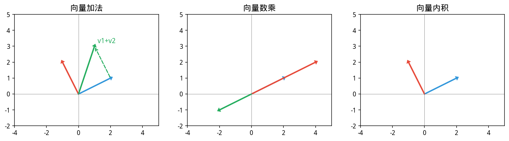

# 1.1 向量——世界在你眼前展开的方式

> ⚠️ **防坑**：
> - `IVector` 上有两个相似但语义不同的乘法：`multiply(IVector)` 是逐元素 Hadamard 积（返回向量），`dot(IVector)` 与 `innerProduct(IVector)` 是内积（返回 `double`）。混用会编译失败或得到错误结果。
> - 标量乘法的方法名是 `multiplyByScalar(double)`，**不是** `multiply(double)`。
> - `get(int)` 返回 **原始 `double`**，无需 `.doubleValue()`；它**不支持负索引**——负数索引需要走 `slice("expression")` 重载。


> **📌 学习目标**
> - 理解向量的几何意义（方向与长度）
> - 掌握向量内积、外积、范数的计算与物理含义
> - 能用 YiShape-Math 创建向量并进行基本运算
> - 理解向量空间与线性组合的概念

## 开篇：一份用户评分矩阵的难题

假设你是一个短视频平台的算法工程师。

平台有 100 万用户、10 万条视频。用户看过视频后会打分（1~5 星），但绝大多数用户看过就走了，**评分数据极度稀疏**——平均每个用户只给不到 20 条视频打过分。

现在产品部门提了一个需求：**给每个用户推荐他可能喜欢但还没看过的视频**。

你的脑子里会出现一个直觉：**如果用户 A 和用户 B 历史上喜欢的视频很相似，那当 B 喜欢一个新视频时，A 大概率也会喜欢。** 这背后有一个数学模型叫「协同过滤」，而它的核心数据结构，正是**向量**。

更具体地说：把每个用户的评分历史写成一个向量——

```
用户 A：[5, 0, 3, 0, 0, 4, 0, 0, 2, 0, ...]  ← 第1/3/6/9个视频打了分，其余为0
用户 B：[4, 0, 2, 0, 0, 5, 0, 0, 3, 0, ...]  ← 评分结构几乎一样，只是稍微低一点
```

**向量相似度**（余弦相似度）一算，0.97。系统立刻知道：用户 A 和 B 是「同类」，推荐池可以互相参考。

这就是线性代数在产业里最朴素的应用之一：**用向量表示用户/商品/文本，然后算相似度、做聚类、跑回归**。本章就从此处开始。

---

## 1.1.1 向量是什么？


> 📝 **历史故事**：向量最初来自 **Hamilton（1843）** 的「四元数」研究——他激动地在都柏林皇家运河桥上刻下 i²=j²=k²=ijk=-1。但真正让向量统治物理的是 **Gibbs（1881）** 在 Yale 教授课程时发明了向量点积和叉积（Heaviside 也独立贡献）。

下图向量运算的几何意义。


*图1.1.1 向量运算。向量加法、数乘、点积、叉积；向量长度的几何意义*

从程序员视角看，向量就是一个**固定长度的数组**：

```java
// Java 里的向量：长度为 5 的浮点数组
var userVector = new double[]{5.0, 0.0, 3.0, 0.0, 4.0};
```

但这只是「容器」层面。**线性代数视角下的向量，是空间里的一个方向和长度。**

在二维平面里，一个向量 $\mathbf{v} = (3, 4)^\top$ 可以画成一条从原点指向点 (3,4) 的箭头。这条箭头有：
- **方向**（指向哪里）
- **长度**（$|\mathbf{v}| = \sqrt{3^2+4^2} = 5$，叫 L2 范数）

为什么要用「方向」来理解向量？因为很多东西天然就是方向：用户喜好的特征画像、一句话的语义向量、股票收益率的时间序列……**一旦变成向量，你立刻可以用向量加减、点乘、距离公式来处理它们**。

这就是为什么向量空间是线性代数的起点：**它足够简单，但足够强大到能描述现实世界里的几乎所有结构**。

---

## 1.1.2 范数：向量的「长度」怎么量？

「向量有多长」这个问题，答案不止一种。不同场景下，你需要不同的「尺子」。

### L2 范数（欧氏距离）——最直觉的长度

$$\|\mathbf{v}\|_2 = \sqrt{v_1^2 + v_2^2 + \cdots + v_n^2}$$

这就是平面上两点距离的公式推广。初中学的勾股定理，就是 L2 范数的特例。

**产业场景**：计算两个用户向量的欧氏距离，判断相似度；计算残差向量的 L2 范数，衡量回归模型的误差。

```java
var a = Linalg.vector(new double[]{3.0, 4.0});
double len = a.norm2();  // 5.0
```

### L1 范数（曼哈顿距离）——不走斜路，只走直角

$$\|\mathbf{v}\|_1 = |v_1| + |v_2| + \cdots + |v_n|$$

想象你在曼哈顿街头打车：只能沿经纬度方向走，不能穿越建筑。实际距离就是 L1 范数。

**产业场景**：Lasso 回归（机器学习里的特征选择）中用 L1 范数作为正则项；异常检测里用 L1 范数比 L2 更鲁棒（对离群点不那么敏感）。

```java
double manhattan = a.manhattanDistance(b);  // |a₁-b₁| + |a₂-b₂|
```

### L∞ 范数——只看最大的那个分量

$$\|\mathbf{v}\|_\infty = \max(|v_1|, |v_2|, \ldots, |v_n|)$$

只关心「最极端的那个方向」，忽略其他的。

**产业场景**：对冲基金用它来限制组合资产的最大回撤；鲁棒优化里用它描述最坏情况。

```java
double worst = v.normInf();  // 向量中绝对值最大的分量
```

### 余弦相似度——方向一致程度，不在乎长度

$$s = \frac{\mathbf{a} \cdot \mathbf{b}}{|\mathbf{a}||\mathbf{b}|} = \frac{\sum_i a_i b_i}{\|\mathbf{a}\|_2 \cdot \|\mathbf{b}\|_2}$$

**向量长度是 3 还是 300 不重要，重要的是它们指向同一个方向。** 这是推荐系统和文本相似度（NLP）里最常用的指标。

```java
double sim = a.cosineSimilarity(b);  // 范围 [-1, 1]，1 表示完全相同方向
```

> **为什么余弦相似度比欧氏距离更适合文本/推荐？** 假设用户 A 给所有视频打 5 星，用户 B 给所有视频打 3 星——欧氏距离很远，但两人的「口味结构」其实完全一样。余弦相似度都是 1。欧氏距离衡量的是数值差异，余弦衡量的是方向/结构相似度。

---

## 1.1.3 线性组合与线性相关性——什么时候信息是冗余的？

回到推荐系统的例子。假设你提取了三个用户特征向量：

```
特征₁ = (1, 2, 3)ᵀ   ← 用户活跃度
特征₂ = (2, 4, 6)ᵀ   ← 好像等于 2 × 特征₁？
特征₃ = (0, 1, 0)ᵀ   ← 独立的新维度
```

注意看：**特征₂ = 2 × 特征₁**。这意味着特征₂ 完全不提供新信息——它是冗余的。在线性代数里，这叫**线性相关**。

### 线性组合与线性相关

**线性组合**：$\alpha_1\mathbf{v}_1 + \alpha_2\mathbf{v}_2 + \cdots + \alpha_k\mathbf{v}_k$ 就是把一组向量按权重加起来。

**线性相关**：存在一组**不全为零**的系数 $\alpha_1, \ldots, \alpha_k$，使得 $\alpha_1\mathbf{v}_1 + \cdots + \alpha_k\mathbf{v}_k = \mathbf{0}$。

换句话说：**其中至少一个向量可以被其余向量的线性组合表示**——它没有「独立贡献」。

**线性无关**：只有全部 $\alpha_i = 0$ 时组合才为零。这意味着每个向量都**携带了其他向量给不了的信息**。

```java
// 判断特征向量是否线性无关 → 相当于检查矩阵列秩
// 如果 rank(A) < 列数 → 存在线性相关 → 特征冗余
```

**产业意义**：

| 场景 | 线性相关意味着什么 |
|------|------------------|
| 用户特征 | 某个特征是其他特征的加权组合，信息冗余 |
| 股票收益率数据 | 某些「因子」实际上是一回事，分散风险效果打折 |
| 文本语料的词向量 | 近义词往往线性相关（这也是降维有效的原因） |

---

## 1.1.4 基与维数——你有多少自由度？

**基**：一组线性无关的向量，它们可以线性组合出空间里的任意向量。

**维数**：基里有多少个向量。

以 $\mathbb{R}^3$ 为例：

```
标准基：e₁=(1,0,0)ᵀ, e₂=(0,1,0)ᵀ, e₃=(0,0,1)ᵀ
任意向量 (x,y,z)ᵀ = x·e₁ + y·e₂ + z·e₃
```

**为什么同一个向量可以有很多组基？**

```java
// 在标准基下，(1,2)ᵀ 的坐标就是 (1,2)
// 但换一组基，比如 v₁=(1,1)ᵀ, v₂=(1,-1)ᵀ
// 同一向量在 新基 下的坐标就变成了 (1.5, -0.5)ᵀ
// 基变了，坐标就变了，但向量本身没变
```

**换基 = 乘以一个可逆矩阵。** 这是数据预处理、**主成分分析**（Principal Component Analysis，**PCA**）、甚至 PageRank 的核心操作。

**产业意义**：

| 问题 | 为什么需要理解基与维数 |
|------|---------------------|
| 数据降维（PCA） | 原始特征维度太高，换一组「更好的基」——主成分基——让少数几个基向量就能表达大部分信息 |
| 图像压缩 | 换到 DCT 基（或小波基）后，能量集中在少数几个系数上，扔掉其余的不影响肉眼感知 |
| 神经网络 | 权重矩阵的**奇异值分解**（Singular Value Decomposition，**SVD**）帮助理解网络的秩（有效参数量）|

---

## 1.1.5 统计量：向量自己的属性

向量作为数据载体，本身就携带统计信息。这些量在数据分析里是高频使用的：

```java
var data = Linalg.vector(new double[]{10.0, 20.0, 30.0, 40.0, 50.0});

double sum     = data.sum();      // 150.0 — 总和
double mean    = data.mean();     // 30.0  — 均值
double variance= data.var();      // 样本方差（分母 n-1）
double stdev   = data.std();      // 样本标准差
double med     = data.median();   // 30.0  — 中位数
double mn      = data.min();      // 10.0
double mx      = data.max();      // 50.0
double q1      = data.percentile(25.0);  // 第25百分位
double q3      = data.percentile(75.0);  // 第75百分位
```

> ⚠️ 这里有意避开了 `var`、`std`、`min`、`max` 等局部变量名，因为 `var` 是 Java 关键字、其余几个在标准库中常被遮蔽，容易让读者误以为代码能直接 copy。

**在产业分析里，这些量回答什么问题？**

- **均值**：整体平均水平，但容易被极端值拉偏
- **中位数**：当数据倾斜时，比均值更「真实」地反映典型水平（比如「上海平均工资」被高收入者拉高，看中位数更有意义）
- **标准差**：数据分散程度——波动大不大？风险高不高？
- **四分位数**：箱线图的核心，用来判断离群点和数据分布形态

```java
// 一个典型的探索性分析流水线
System.out.printf("均值=%.2f, 中位数=%.2f, 标准差=%.2f%n", data.mean(), data.median(), data.std());
// 快速判断：均值和中位数差距大 → 数据右偏（或有异常值）
```

---

## 1.1.6 点乘与内积——两个向量怎么「对话」？

**点乘（内积）**：$\mathbf{a} \cdot \mathbf{b} = \sum_i a_i b_i$

从几何上看：$\mathbf{a} \cdot \mathbf{b} = |\mathbf{a}||\mathbf{b}|\cos\theta$，其中 $\theta$ 是两向量夹角。

这意味着：
- $\mathbf{a} \cdot \mathbf{b} > 0$ → 夹角 < 90°，方向「相近」
- $\mathbf{a} \cdot \mathbf{b} = 0$ → 夹角 = 90°，**正交**（完全不相关）
- $\mathbf{a} \cdot \mathbf{b} < 0$ → 夹角 > 90°，方向「相反」

```java
var u = Linalg.vector(new double[]{1.0, 2.0, 3.0});
var v = Linalg.vector(new double[]{4.0, 5.0, 6.0});
double dot = u.innerProduct(v);  // 1*4 + 2*5 + 3*6 = 32
```

**产业用法**：

- **推荐系统**：用户向量 · 商品向量 = 预测评分（见本章应用节）
- **NLP**：词向量点乘得到词相似度（Word2Vec 的核心操作）
- **信号处理**：两个传感器信号的内积越大，相关性越强
- **主成分分析**：找主成分就是找投影后方差最大的方向，而方差最大化等价于找内积最大化

### 关于叉积（Cross Product）的说明

向量叉积是三维空间中特有的运算：$\mathbf{a} \times \mathbf{b}$ 的结果是一个**垂直于 $\mathbf{a}$ 和 $\mathbf{b}$ 所在平面**的新向量，其长度等于 $|\mathbf{a}||\mathbf{b}|\sin\theta$（即两向量张成的平行四边形面积）。

> 🤔 **为什么 YiShape-Math 没有叉积 API？**
>
> YiShape-Math 面向的是**高维数据分析**（数百甚至数千维的特征向量），而叉积是三维（或七维，通过八元数推广）空间的几何运算。在高维空间中，"垂直于两个向量"的方向有无穷多个，叉积失去了唯一性。因此叉积不属于本库的 API 范围——如果你需要叉积，说明你在做 3D 几何/物理仿真，而非数据科学。

**如果确实在做 3D 几何**，可以用外积（outer product）来间接实现：两个三维向量的外积矩阵的某些线性组合可以给出叉积的分量。但更推荐使用专门的 3D 几何库。

---
## 1.1.7 本节 API 一览

`IVector<Double>` 是 YiShape-Math 中向量的主接口，`IDoubleVector` 是它的具体实现。日常使用直接用 `Linalg.vector(...)` 工厂创建：

| 操作            | API 示例                                                  | 返回类型 / 说明                              |
| ------------- | ------------------------------------------------------- | -------------------------------------- |
| 创建            | `Linalg.vector(new double[]{1,2,3})`                    | `IVector<Double>`，从数组创建                |
| 加 / 减 / 逐元素乘 | `a.add(b)`、`a.sub(b)`、`a.multiply(b)`                   | `IVector<Double>`，逐元素运算                |
| 数乘            | `a.multiplyByScalar(2.0)`                               | `IVector<Double>`，每个元素乘以标量             |
| 内积            | `a.innerProduct(b)` 或 `a.dot(b)`                        | `double`                               |
| L2 范数         | `a.norm2()`                                             | `double`                               |
| L1 范数         | `a.norm1()`                                             | `double`                               |
| L∞ 范数         | `a.normInf()`                                           | `double`                               |
| 欧氏距离          | `a.euclideanDistance(b)`                                | `double`                               |
| 曼哈顿距离         | `a.manhattanDistance(b)`                                | `double`                               |
| 余弦相似度         | `a.cosineSimilarity(b)`                                 | `double`，范围 `[-1, 1]`                  |
| 均值/方差/标准差     | `a.mean()`、`a.var()`、`a.std()`                          | `double`，方差/标准差默认 ddof=1（样本）          |
| 中位数/最值        | `a.median()`、`a.min()`、`a.max()`                        | `double`                               |
| 分位数           | `a.percentile(25.0)`                                    | `double`，q 在 `[0, 100]`                |
| 元素访问          | `a.get(0)`、`a.set(0, 3.14)`、`a.length()`                | `get` 返回 `double`（不是 `Double`、不支持负索引） |
| 子向量切片         | `a.slice(1, 4)`、`a.slice("-3:")`                        | `IVector<Double>`，字符串重载支持类似 Python 的负索引 |
| 单位化           | `a.normalize()`                                         | `IVector<Double>`，返回 `a / ‖a‖₂`        |
| 生成等差序列       | `Linalg.range(5)` → `[0,1,2,3,4]`；`Linalg.range(1,6)` → `[1,2,3,4,5]`；`Linalg.range(0,10,2)` → `[0,2,4,6,8]` | `IVector<Double>`，类似 Python 的 `range()` |
| 标量加减         | `a.addScalar(1.0)`、`a.subScalar(1.0)`                    | `IVector<Double>`，每个元素加/减同一个标量    |
| 填充            | `Linalg.ones(5).mul(3.14)`                                  | `IVector<Double>`，创建长度为 5、全为 3.14 的向量 |
| 截断（clamp）     | `a.clamp(-1.0, 1.0)`                                    | `IVector<Double>`，每个元素截断到 `[-1, 1]`  |
| 拼接            | `a.concat(b)`                                           | `IVector<Double>`，`[a₁,…,aₙ,b₁,…,bₘ]`    |
| 排序            | `a.sort()`                                              | `IVector<Double>`，升序排列（新实例）          |
| 映射            | `a.map(x -> x * x)`                                    | `IVector<Double>`，逐元素函数变换            |
| 转数组           | `a.toDoubleArray()`                                     | `double[]`，底层原始数组的**副本**            |

## 1.1.8 章节练习 / Exercises

**1. 向量范数的几何意义（画图题）**

在二维平面直角坐标系中，标出以下三个向量的端点，并计算它们的 $\ell_1$ 范数（曼哈顿距离）和 $\ell_2$ 范数（欧氏距离）：

$$\mathbf{a} = (3, 4), \quad \mathbf{b} = (-3, 4), \quad \mathbf{c} = (5, -5)$$

（a）分别画图并标注。

（b）对于 $\mathbf{a}$，比较 $\|\mathbf{a}\|_1$ 和 $\|\mathbf{a}\|_2$ 的大小，说明为什么 $\ell_1$ 范数总是 $\geq$ $\ell_2$ 范数。

（c）如果 $\|\mathbf{a}\| = 1$（单位向量），$\mathbf{a}$ 的端点在二维平面上构成什么形状？

**2. 内积与向量夹角（证明题）**

证明余弦定理在向量形式下的等价表达：

$$\mathbf{a} \cdot \mathbf{b} = \|\mathbf{a}\| \|\mathbf{b}\| \cos \theta$$

其中 $\theta$ 是向量 $\mathbf{a}$ 和 $\mathbf{b}$ 的夹角。

**提示**：将 $\|\mathbf{a} - \mathbf{b}\|^2$ 分别用向量展开和几何余弦定理两种方式计算，然后比较。

**3. 用 YiShape-Math 实现向量投影（编程题）**

```java
// 向量 a 和 b（2D）
var a = Linalg.vector(new double[]{3.0, 1.0});
var b = Linalg.vector(new double[]{1.0, 2.0});
```

**要求**：
1. 计算 $\mathbf{b}$ 在 $\mathbf{a}$ 方向上的投影 $\text{proj}_{\mathbf{a}}\mathbf{b} = \frac{\mathbf{a} \cdot \mathbf{b}}{\mathbf{a} \cdot \mathbf{a}} \mathbf{a}$
2. 计算投影向量的长度（标量形式）
3. 用 `Plots` 画图可视化：画出 $\mathbf{a}$、$\mathbf{b}$ 和 $\text{proj}_{\mathbf{a}}\mathbf{b}$，标注各向量
4. 验证：$\mathbf{b}$ 与其投影的差向量是否垂直于 $\mathbf{a}$（用内积验证）

**4. 向量空间线性相关性（判断题）**

判断以下三组向量在 $\mathbb{R}^2$ 中是否线性相关。如果线性相关，找出其中的极大线性无关组：

（a）$\mathbf{v}_1 = (2, 1)$，$\mathbf{v}_2 = (4, 2)$

（b）$\mathbf{v}_1 = (1, 0)$，$\mathbf{v}_2 = (0, 1)$，$\mathbf{v}_3 = (1, 1)$

（c）$\mathbf{v}_1 = (1, 2)$，$\mathbf{v}_2 = (-1, 1)$，$\mathbf{v}_3 = (3, 7)$

> **几何直觉**：在 $\mathbb{R}^2$ 中，2 个向量线性相关意味着它们共线；3 个向量中只要任意 2 个线性无关，则整个组线性无关（因为 $\mathbb{R}^2$ 的维度最多为 2）。


## 本节小结

本章介绍了向量的基本概念：向量是既有大小又有方向的量，在数据中通常表示为一个样本的特征组合。向量运算（加减、数乘、内积、范数）构成了线性代数的基础砖块。

**核心要点**：向量是线性代数的起点；内积用于衡量相似性；范数用于衡量距离；这些概念在机器学习中无处不在。