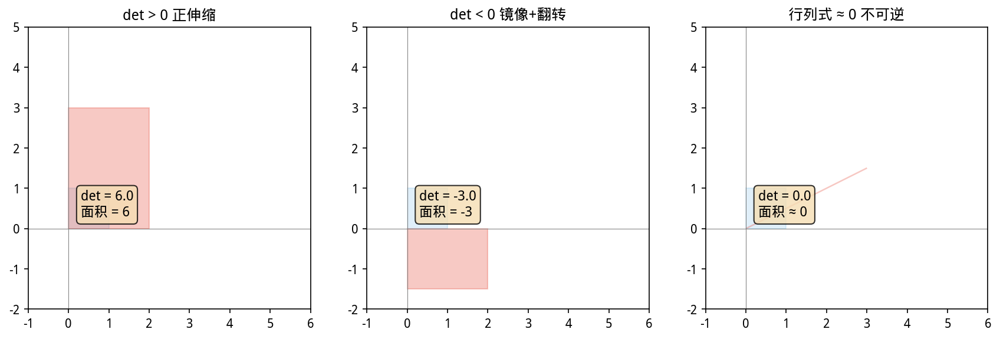
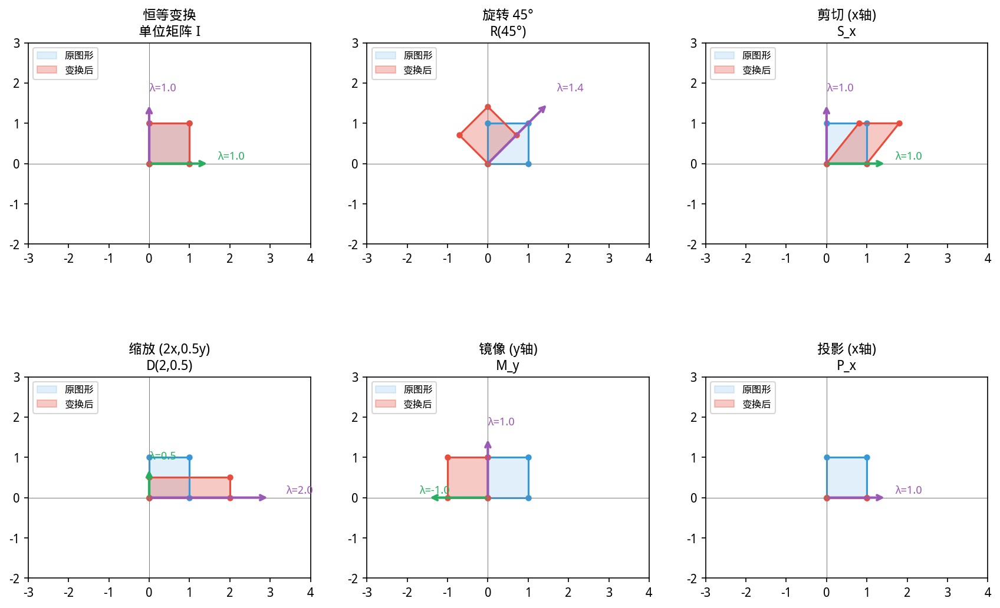

# 第 1 章 · 1.2 矩阵运算与线性变换
### Matrix Operations and Linear Transformations

上一节：[1.1.Vector.md](1.1.Vector.md) ｜ 下一节：[1.3.Matrix decomposition.md](1.3.Matrix decomposition.md)

---

## 1.2 矩阵运算与线性变换

> ⚠️ **防坑**：YiShape-Math 中的矩阵乘法是 `A.mmul(B)`，**不是** `A.multiply(B)` —— 后者是逐元素 Hadamard 积。矩阵乘法 `A·B ≠ B·A`（一般情况）；单位矩阵 `I` 仍满足 `AI=IA=A`，但左逆和右逆对**非方阵**不一定相等。

> ⚠️ **防坑**：矩阵求逆方法名是 `A.inv()`，**不是** `A.inverse()`。对病态或奇异矩阵直接调用 `A.inv()` 会导致数值爆炸，求解线性方程组请用 `A.solve(b)` 或 `A.lstsq(b)`。


> **📌 学习目标**
> - 理解矩阵作为线性变换的本质（拉伸+旋转）
> - 掌握矩阵乘法、转置、逆矩阵的运算规律
> - 能用 YiShape-Math 创建矩阵并进行运算
> - 理解行列式的几何意义（面积/体积缩放因子）

## 开场：Photoshop 里的「滤镜」和「线性代数」有什么关系？

你用 Photoshop 给照片加了个「锐化」滤镜——点击一下，照片变得更清晰了。

这个操作在数学上干了什么？**它把照片中每个像素的新值，算成了周围若干像素的线性加权平均。**

这就是矩阵作为**线性算子**的核心应用：一个矩阵乘以一个向量（所有像素排成一列），输出一个新向量（处理后的像素）。

Photoshop 的每个滤镜都是一个矩阵。旋转、缩放、模糊、锐化——全都是矩阵乘法。

**但矩阵不只是「滤镜」。** 在机器学习里，1000 个用户对 100 件商品的打分，是一个 1000×100 的矩阵；在金融里，10 只股票过去 252 个交易日的收益率，是一个 10×252 的矩阵。

矩阵是这个世界数据结构的通用语言。

---

### 1.2.1 矩阵：从数据表到线性算子


> 📝 **历史故事**：矩阵（Matrix）这个词由 **Sylvester（1850）** 命名，但他讨厌矩阵乘法——觉得太丑。是他的学生 **Cayley** 在 1858 年的论文里真正建立了矩阵代数。「矩阵」最初只是「数的矩形阵列」，没人想到它会成为线性代数的核心。
矩阵在三个完全不同的语境中出现，却共享同一套运算法则：

| 视角 | 数学对象 | 例子 |
|------|----------|------|
| **数据表** | $n\times p$ 表格：$n$ 个样本，$p$ 个特征 | 100 名患者的 20 项化验指标 |
| **线性算子** | 线性映射 $T:\mathbb{R}^n \to \mathbb{R}^m$ 的矩阵表示 | Photoshop 锐化滤镜 |
| **双线性形式** | $\mathbf{x}^\top \mathbf{A}\mathbf{y}$ | 协方差矩阵定义的 Mahalanobis 距离 |

理解矩阵的这三种身份，是阅读机器学习论文和编写数值代码的前提。

### 1.2.2 矩阵的存储约定与索引

YiShape-Math 的 `IMatrix<T>` 采用**行主序**存储：底层为 `data[i][j]`，表示第 $i$ 行、第 $j$ 列（均从 0 起算）。这与 Java 的 `double[][]` 自然顺序一致，但与 Fortran/MATLAB 的列主序不同。

```java
import com.yishape.lab.math.linalg.IMatrix;
import com.yishape.lab.math.linalg.IVector;
import com.yishape.lab.math.linalg.Linalg;

// 从二维数组创建
var A = Linalg.matrix(new double[][]{
    {1, 2, 3},
    {4, 5, 6}
});
// A 是 2 行 3 列：A ∈ ℝ^(2×3)

// 单元素访问（纸上 a₂₁ 对应 get(1,0)，返回原始 double）
double a21 = A.get(1, 0);   // 4

// 提取行/列
var row0 = A.getRow(0);       // [1, 2, 3]
var col2 = A.getColumn(2);    // [3, 6]

// 形状信息
int rows = A.rows();         // 2（或 A.getRowNum()）
int cols = A.cols();         // 3（或 A.getColNum()）
var shape = A.shape();     // [2, 3]
```

**切片**支持类 **NumPy**（Numerical Python，Python 数值计算库）的字符串表达式，包括负数索引：

```java
// 子矩阵：行 0~0，列 1~2
var sub = A.slice("0:1", "1:3");  // [[2, 3]]

// 花式切片
var everyOther = A.slice("::2", "::2");  // 每隔一行一列
var exceptLast = A.slice(":-1", ":-1");  // 去掉最后一行和最后一列
var reversed = A.slice("::-1", "::-1");  // 完全翻转
```

### 1.2.3 特殊矩阵的创建

```java
// 全 1、全 0、单位矩阵
var ones = Linalg.ones(3, 3);
var zeros = Linalg.zeros(3, 3);
var eye = Linalg.eye(3);         // 3×3 单位矩阵

// 随机矩阵
var rand = Linalg.rand(3, 3);    // 均匀分布 [0, 1)
var randn = Linalg.randn(3, 3);  // 标准正态分布
var randnSeeded = Linalg.randn(3, 3, 0.0, 1.0, 42L);  // 指定种子

// 对角矩阵
var diag = Linalg.diag(new double[]{1, 2, 3});

// 从一维数组重塑
var reshaped = Linalg.fromArray(new double[]{1,2,3,4,5,6}, 2, 3);
```

### 1.2.4 矩阵基本运算

**加减法与标量运算**：同型矩阵可逐元素加减。

```java
var A = Linalg.matrix(new double[][]{{1, 2}, {3, 4}});
var B = Linalg.matrix(new double[][]{{5, 6}, {7, 8}});

var sum = A.add(B);           // [[6, 8], [10, 12]]
var diff = A.sub(B);          // [[-4, -4], [-4, -4]]
var scaled = A.mmul(2.0);     // [[2, 4], [6, 8]]
```

**矩阵乘法**（`mmul`）：这是线性代数的核心运算。若 $\mathbf{A}\in\mathbb{R}^{m\times n}$，$\mathbf{B}\in\mathbb{R}^{n\times p}$，则 $\mathbf{C}=\mathbf{AB}\in\mathbb{R}^{m\times p}$，其中
$$c_{ij} = \sum_{k=1}^{n} a_{ik}b_{kj}$$

```java
var C = A.mmul(B);
// [[1*5+2*7, 1*6+2*8], [3*5+4*7, 3*6+4*8]] = [[19, 22], [43, 50]]
```

**矩阵乘向量**：

```java
var x = Linalg.vector(new double[]{1, 2});
var y = A.mmul(x);  // [1*1+2*2, 3*1+4*2] = [5, 11]
```

> **矩阵乘法的五种视角**（Strang）：
> 1. **行×列**：结果矩阵的 $(i,j)$ 元 = A 的第 $i$ 行 点积 B 的第 $j$ 列
> 2. **列的组合**：结果的每一列 = A 的列以 B 对应列为系数的线性组合
> 3. **行的组合**：结果的每一行 = B 的行以 A 对应行为系数的线性组合
> 4. **列×行的和**：$\mathbf{AB} = \sum_k \mathbf{a}_k\mathbf{b}_k^\top$（秩一矩阵之和）
> 5. **分块乘法**：将 A、B 划分为子矩阵，按同样规则相乘

**逐元素运算**：

```java
// Hadamard 积（逐元素乘）
var hadamard = A.multiply(B);  // [[5, 12], [21, 32]]

// 逐元素除
var quotient = A.divide(B);

// Frobenius 内积：对应元素乘积之和（与向量化后再做点积等价）
double frob = A.frobeniusInnerProduct(B);  // 1*5+2*6+3*7+4*8 = 70

// 逐元素数学函数
var expA = A.exp();
var logA = A.log();
var absA = A.abs();
```

**转置、幂、开方**：

```java
var AT = A.transpose();  // 或 A.t()
var A2 = A.pow(2.0);     // 逐元素平方
var sqrtA = A.sqrt();    // 逐元素开方
```

### 1.2.5 行列式、秩与可逆性

**行列式**（方阵）：$\det(\mathbf{A})$ 是标量，几何上表示线性变换对体积的缩放因子。

```java
var A = Linalg.matrix(new double[][]{{1, 2}, {3, 4}});
double det = A.det();   // -2，返回原始 double
```

性质：
- $\det(\mathbf{AB}) = \det(\mathbf{A})\det(\mathbf{B})$
- $\det(\mathbf{A}^\top) = \det(\mathbf{A})$
- $\det(\mathbf{A}) \neq 0 \iff \mathbf{A}$ 可逆
- 对角阵的行列式 = 对角元之积

下图列出了行列式的几何意义。


*图1.2.1 行列式的几何意义。行列式等于基向量张成平行四边形的面积（2D）或平行六面体的体积（3D）*

**迹（Trace）**：$\text{tr}(\mathbf{A})$ 是主对角线元素之和，看似简单却有深刻的含义。

$$\text{tr}(\mathbf{A}) = \sum_{i=1}^{n} a_{ii} = \lambda_1 + \lambda_2 + \cdots + \lambda_n$$

最后一行是关键：**矩阵的迹等于所有特征值之和**。这意味着：
- 迹不随相似变换改变（$\text{tr}(\mathbf{P}^{-1}\mathbf{AP}) = \text{tr}(\mathbf{A})$），是矩阵的「内在属性」
- 在统计学中，协方差矩阵的迹 = 总方差（所有维度方差之和）
- 在 PCA 中，第一主成分的方差贡献率 = $\lambda_1 / \text{tr}(\boldsymbol{\Sigma})$

```java
var A = Linalg.matrix(new double[][]{{4, 2}, {1, 3}});
double tr = A.trace();  // 4 + 3 = 7
// 后续学了特征值分解后可以验证：λ₁ + λ₂ = 7
```

**秩**：矩阵列向量的极大线性无关组的个数（行秩 = 列秩）。

```java
int rank = A.rank();  // 2（满秩）

// 秩亏矩阵
var S = Linalg.matrix(new double[][]{{1, 1}, {1, 1}});
System.out.println(S.rank());   // 1（两列相同，秩亏）
System.out.println(S.det());    // 0（奇异）
```

**可逆矩阵**：仅当方阵且满秩时存在。

```java
var Ainv = A.inv();
var check = A.mmul(Ainv);  // 应 ≈ 单位矩阵
```

> **警告**：实践中**永远不要**为解方程而显式求逆。应使用 `A.solve(b)`（见 1.4 节）。

### 1.2.6 线性变换：矩阵的几何含义

**为什么说矩阵就是「变换」？**

想象你在 Photoshop 里拉伸一张图片：在 Unity/Three.js 里旋转一个 3D 模型；在 MATLAB 里对信号做 FFT 滤波——这些操作在数学上都是**矩阵乘法**。

- 一个 $2\times 2$ 对角矩阵 = 按坐标轴缩放（宽高拉伸）
- 一个 $2\times 2$ 正交矩阵 = 旋转（或镜像）
- 一个 $2\times 2$ 三角矩阵 = 剪切（斜切）

这就是「线性变换」的直觉：**矩阵乘法不改变空间的整体结构（直线还是直线，原点不动），只是拉伸、旋转、剪切。**

反过来：每一个线性变换都可以用一个矩阵表示。这就是为什么物理模拟、计算机图形、信号处理全都离不开矩阵。

---

每一个矩阵 $\mathbf{A}\in\mathbb{R}^{m\times n}$ 都定义了一个线性变换 $T(\mathbf{x})=\mathbf{Ax}$。反过来，每一个线性变换都可以用矩阵表示。

**几何变换示例**：2D 旋转与缩放

```java
double theta = Math.PI / 4;  // 45°
var R = Linalg.matrix(new double[][]{
    {Math.cos(theta), -Math.sin(theta)},
    {Math.sin(theta),  Math.cos(theta)}
});

var S = Linalg.matrix(new double[][]{
    {2, 0},
    {0, 3}
});

var point = Linalg.vector(new double[]{1, 0});
var rotated = R.mmul(point);  // (cos45°, sin45°) ≈ (0.707, 0.707)
var scaled = S.mmul(point);  // (2, 0)
```

**仿射变换与齐次坐标**：平移不是线性变换（不保持原点），但可以用齐次坐标表示为 $3\times 3$ 矩阵：

$$\begin{pmatrix} x' \\ y' \\ 1 \end{pmatrix} = \begin{pmatrix} \cos\theta & -\sin\theta & t_x \\ \sin\theta & \cos\theta & t_y \\ 0 & 0 & 1 \end{pmatrix}\begin{pmatrix} x \\ y \\ 1 \end{pmatrix}$$

下图列出了矩阵线性变换几何意义的示意图。


*图1.2.2 矩阵与线性变换。矩阵乘法对应线性变换：旋转、缩放、剪切、投影等*

### 1.2.7 四大子空间与秩-零化度定理

**解方程组 $\mathbf{Ax}=\mathbf{b}$ 时，你到底在找什么？**

方程有解意味着 $\mathbf{b}$ 必须落在某个空间里——$\mathbf{A}$ 的列张成的空间。如果 $\mathbf{b}$ 在这个空间之外，无论怎么凑 $\mathbf{x}$ 的组合，都不可能得到 $\mathbf{b}$。

这四个子空间回答的就是「解方程时你受什么约束」这个问题：

对矩阵 $\mathbf{A}\in\mathbb{R}^{m\times n}$，四个基本子空间：

| 子空间 | 定义 | 维数 |
|--------|------|------|
| 列空间 $\mathcal{C}(\mathbf{A})$ | A 的列张成的空间 | $\mathrm{rank}(\mathbf{A})$ |
| 行空间 $\mathcal{C}(\mathbf{A}^\top)$ | A 的行张成的空间 | $\mathrm{rank}(\mathbf{A})$ |
| 零空间 $\mathcal{N}(\mathbf{A})$ | $\mathbf{Ax}=\mathbf{0}$ 的解空间 | $n - \mathrm{rank}(\mathbf{A})$ |
| 左零空间 $\mathcal{N}(\mathbf{A}^\top)$ | $\mathbf{A}^\top\mathbf{y}=\mathbf{0}$ 的解空间 | $m - \mathrm{rank}(\mathbf{A})$ |

**秩-零化度定理**：
$$\dim\mathcal{C}(\mathbf{A}) + \dim\mathcal{N}(\mathbf{A}) = n$$

这决定了线性方程组 $\mathbf{Ax}=\mathbf{b}$ 的解的情况：
- $\mathrm{rank}(\mathbf{A}) = n$（列满秩）：至多一个解
- $\mathrm{rank}(\mathbf{A}) < n$：无穷多解或无解
- $\mathrm{rank}([\mathbf{A}|\mathbf{b}]) \neq \mathrm{rank}(\mathbf{A})$：无解

### 1.2.8 广播机制（Broadcasting）

**动机**：将偏置向量加到数据矩阵的每一行，或将尺度向量乘到每一列。若手写循环冗长易错。

YiShape-Math 提供显式广播 API（避免 **NumPy** 隐式广播的形状困惑）：

```java
var X = Linalg.ones(3, 4);
var bias = Linalg.vector(new double[]{1, 2, 3});  // 长度 = 行数

// 将 bias 广播到每一列（每列都加上 bias）
var Xb = X.broadcastAddColumn(bias);

// 将行向量广播到每一行
var scale = Linalg.vector(new double[]{1, 2, 3, 4});  // 长度 = 列数
var Xs = X.broadcastAddRow(scale);
```

> **关键规则**：`broadcastAddColumn` 要求向量长度 = **行数**；`broadcastAddRow` 要求向量长度 = **列数**。

### 1.2.9 矩阵拼接与分割

```java
var A = Linalg.matrix(new double[][]{{1, 2}, {3, 4}});
var B = Linalg.matrix(new double[][]{{5, 6}, {7, 8}});

// 水平拼接
var h = A.hstack(B);  // [[1,2,5,6], [3,4,7,8]]

// 垂直拼接
var v = A.vstack(B);  // [[1,2], [3,4], [5,6], [7,8]]

// 分割
IMatrix<Double>[] split = A.hsplit(new int[]{1});  // 在列 1 处分割
```

**构造设计矩阵**：在线性回归中，常将特征矩阵与截距列拼接：

```java
var X = Linalg.matrix(new double[][]{{1}, {2}, {3}});
var ones = Linalg.ones(3, 1);
var X_design = ones.hstack(X);  // [[1,1], [1,2], [1,3]]
```

### 1.2.10 矩阵的统计运算

```java
var data = Linalg.matrix(new double[][]{
    {1, 2, 3},
    {4, 5, 6},
    {7, 8, 9}
});

// 行/列统计
var rowMeans = data.rowMeans();   // 每行均值
var colMeans = data.colMeans();   // 每列均值

// 整体统计
double sum = data.sum();
double mean = data.mean();

// 中心化（减列均值）
var centered = data.center();

// 协方差矩阵（从原始数据 / 从已中心化数据）
var cov = data.covariance();
var covCentered = centered.covarianceFromCentered();

// 归一化
var normedRows = data.normalizeRows();     // 行归一化
var normedCols = data.normalizeColumns();  // 列归一化
```

### 1.2.11 Kronecker 积与外积

**Kronecker 积**：将矩阵 $\mathbf{A}$ 的每个元素替换为 $a_{ij}\mathbf{B}$ 的块矩阵。

```java
var A = Linalg.matrix(new double[][]{{1, 2}, {3, 4}});
var B = Linalg.matrix(new double[][]{{0, 1}, {1, 0}});
var kron = A.kron(B);
// [[0,1,0,2], [1,0,2,0], [0,3,0,4], [3,0,4,0]]
```

**矩阵展平外积**：等价于 `np.outer(A.ravel(), B.ravel())`。

```java
var outer = A.outer(B);
```

### 1.2.12 矩阵性质检查

```java
boolean isSquare = A.isSquare();
boolean isSymmetric = A.isSymmetric();
boolean isPositiveDefinite = A.isPositiveDefinite();
```

### 1.2.13 常见误区

| 误区 | 纠正 |
|------|------|
| 矩阵乘法可交换 | 一般不成立：$\mathbf{AB} \neq \mathbf{BA}$ |
| `multiply` = 矩阵乘 | `multiply` 是逐元素乘，矩阵乘用 `mmul` |
| 行列式接近 0 就"几乎可逆" | 用条件数判断，见 1.6 节 |
| `solve` 能解任意形状 | 仅限方阵，非方阵用 `lstsq`（见 1.4 节） |
| 广播维度搞反 | `broadcastAddColumn` 的向量长度必须等于**行数** |
| 协方差矩阵不对称 | 浮点误差可能导致微小不对称，通常可接受 |

### 1.2.14 自测与练习

1. 手算 $2\times2$ 矩阵 $\begin{pmatrix}1&2\\3&4\end{pmatrix}$ 的逆矩阵，并与 `A.inv()` 结果对照
2. 证明 $(\mathbf{AB})^\top = \mathbf{B}^\top\mathbf{A}^\top$
3. 编程：构造两个 $3\times3$ 矩阵 $\mathbf{A}$、$\mathbf{B}$，验证 $\mathbf{AB} \neq \mathbf{BA}$
4. 证明：若 $\mathbf{A}$ 列满秩，则 $\mathbf{A}^\top\mathbf{A}$ 正定

### 1.2.15 与官方文档的对照

- API 文档：[`docs/Matrix-Operations.md`](../../docs/Matrix-Operations.md) —— 完整的接口参考
- 示例：[`docs/examples/Matrix-Examples.md`](../../docs/examples/Matrix-Examples.md) —— 可运行代码
- 本节侧重**数学含义与形状推理**，文档侧重**API 签名**

---

**上一节**：[1.1.Vector.md](1.1.Vector.md) ｜ **下一节**：[1.3.Matrix decomposition.md](1.3.Matrix decomposition.md)


## 本节 API 一览

| API                                                  | 用途                                  | 示例                                                |
|------------------------------------------------------|-------------------------------------|---------------------------------------------------|
| `Linalg.matrix(double[][])`                          | 创建矩阵                                | `Linalg.matrix(new double[][]{{1,2},{3,4}})`      |
| `Linalg.eye(int n)`                                  | n 阶单位阵                              | `Linalg.eye(3)`（注意：方法名是 `eye`，不是 `identity`）       |
| `Linalg.zeros(int m, int n)` / `Linalg.ones(int m, int n)` | 零矩阵 / 全 1 矩阵                  | `Linalg.zeros(4,4)`                               |
| `Linalg.diag(double...)`                             | 对角矩阵                                | `Linalg.diag(1.0, 2.0, 3.0)`                      |
| `Linalg.fromArray(double[], int, int)`               | 由扁平数组重塑                             | `Linalg.fromArray(arr, 2, 3)`                     |
| `A.subMatrix(int r0,int r1,int c0,int c1)`           | 子矩阵（注意大写 `M`）                       | `A.subMatrix(0, 2, 0, 2)`                         |
| `A.slice("0:2", "1:3")`                              | NumPy 风格切片，支持负索引                    | `A.slice(":-1", ":-1")`                           |
| `A.transpose()` / `A.t()`                            | 转置                                  | `A.t()`                                           |
| `A.mmul(B)`                                          | 矩阵乘法（`mmul` 也支持向量 & 标量）             | `A.mmul(B)`、`A.mmul(b)`、`A.mmul(2.0)`             |
| `A.multiply(B)` / `A.divide(B)`                      | 逐元素 Hadamard 积 / 除法                 | `A.multiply(B)`                                   |
| `A.frobeniusInnerProduct(B)`                         | Frobenius 内积，返回 `double`            | `A.frobeniusInnerProduct(B)`                      |
| `A.det()` / `A.trace()` / `A.rank()`                 | 行列式 / 迹 / 秩，前两个返回 `double`、秩返回 `int` | `A.det()`                                         |
| `A.inv()` / `A.pinv()`                               | 逆 / 伪逆                              | `A.inv()`                                         |
| `A.solve(b)` / `A.lstsq(b)`                          | 解方程 / 最小二乘                          | `A.solve(b)`                                      |
| `A.kron(B)` / `A.outer(B)`                           | Kronecker 积 / 矩阵展平外积                | `A.kron(B)`                                       |
| `A.broadcastAddColumn(v)` / `A.broadcastAddRow(v)`   | 列广播 / 行广播加法                        | 列广播要求 `v.length() == A.rows()`                    |
| `A.center()` / `A.normalizeColumns()`                | 列中心化 / 列归一化                         | 用于 PCA 预处理                                       |
| `A.covariance()` / `A.covarianceFromCentered()`      | 协方差矩阵                               | 已中心化矩阵走第二个，避免重复中心化误差                              |
| `A.isSquare()` / `A.isSymmetric()` / `A.isPositiveDefinite()` | 性质检查                       | 浮点比较已内置容差                                          |
| `A.copy()`                                             | 深拷贝矩阵                             | `A.copy()` 返回新实例，修改副本不影响原矩阵              |
| `A.set(int r, int c, double v)`                        | 就地设置元素                            | 注意：会修改原矩阵（与不可变 API 不同）                |
| `A.setRow(int r, IVector v)` / `A.setColumn(int c, IVector v)` | 就地替换整行/列                   | 要求长度匹配                                        |
| `A.getRowMean()` / `A.getRowStd()`                     | 按行聚合                               | 返回 `IVector`，每行一个统计量                       |
| `A.colMeans()` / `A.colVariances()`                    | 按列聚合                               | 返回 `IVector`，每列一个统计量                       |
| `A.flatten()`                                          | 展平为一维向量                           | 行主序：`[row0, row1, ...]`                        |
| `A.diag()`                                             | 提取对角线                              | 返回 `IVector`，与 `Linalg.diag()` 互为反操作          |
| `A.exp()` / `A.log()` / `A.abs()` / `A.sqrt()` / `A.pow(n)` | 逐元素数学函数                  | 新矩阵，不修改原矩阵                                  |
| `A.frobeniusNorm()`                                    | Frobenius 范数                          | $\|\mathbf{A}\|_F = \sqrt{\sum_{ij} a_{ij}^2}$  |
| `A.sum(int axis)` / `A.mean(int axis)`                 | 按轴求和/均值                            | `axis=0` 按列聚合，`axis=1` 按行聚合                 |
| `A.cond()`                                             | 条件数                                | $\kappa(\mathbf{A}) = \|\mathbf{A}\| \cdot \|\mathbf{A}^{-1}\|$ |
| `A.hstack(B)` / `A.vstack(B)`                          | 水平/垂直拼接                            | `hstack` 列拼接，`vstack` 行拼接                     |
| `A.hsplit(int n)`                                      | 按列等分                               | 返回 `IMatrix[]`，每块列数相等                       |

## 本节小结

矩阵是向量的推广——它是一个二维数组，每一行是一个样本，每一列是一个特征。矩阵乘法 AB 意味着「对 A 的每一行做 A 的列的线性组合」，这是数据变换的核心运算。

**核心要点**：矩阵乘法是线性变换的代数表示；转置、行列式、逆矩阵是矩阵的三大属性；行列式为零的矩阵不可逆（奇异矩阵）。但**判断奇异性更稳健的指标是 `rank()` 与 `cond()`**，因为 `det()` 受矩阵尺度影响：把 $A$ 整体除以 10 会让 $\det(A)$ 缩小 $10^n$ 倍，秩与条件数却保持不变。