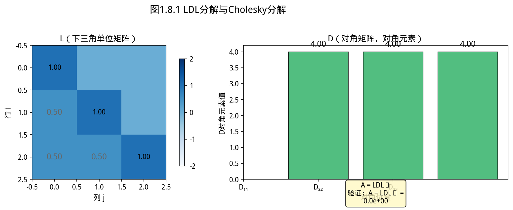
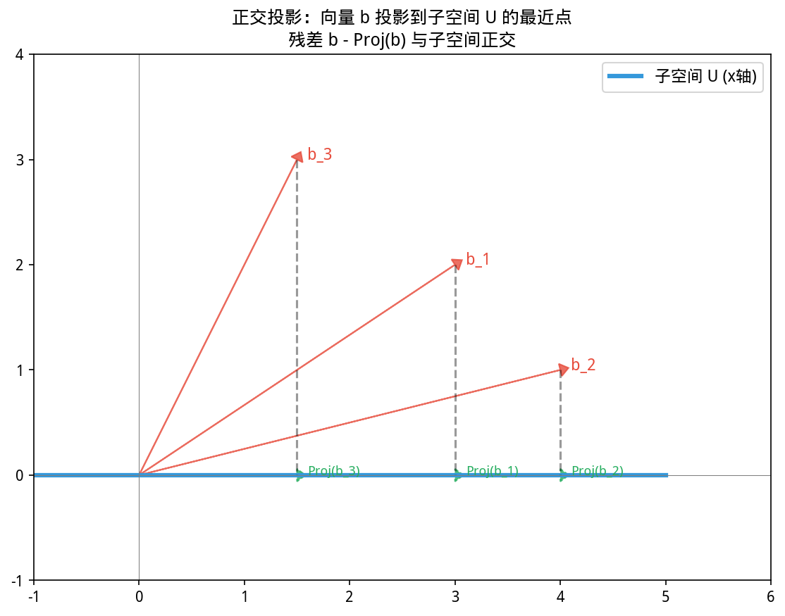
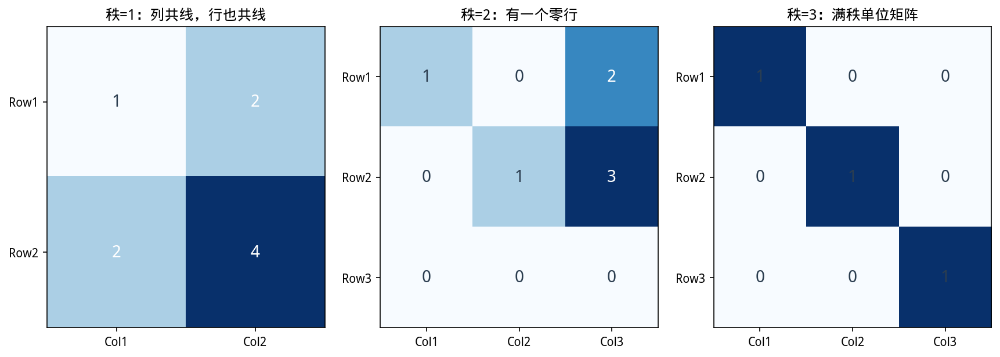
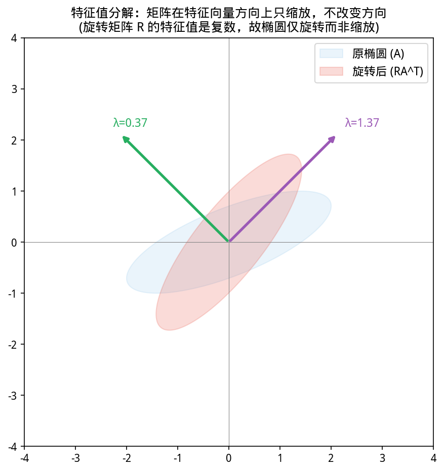
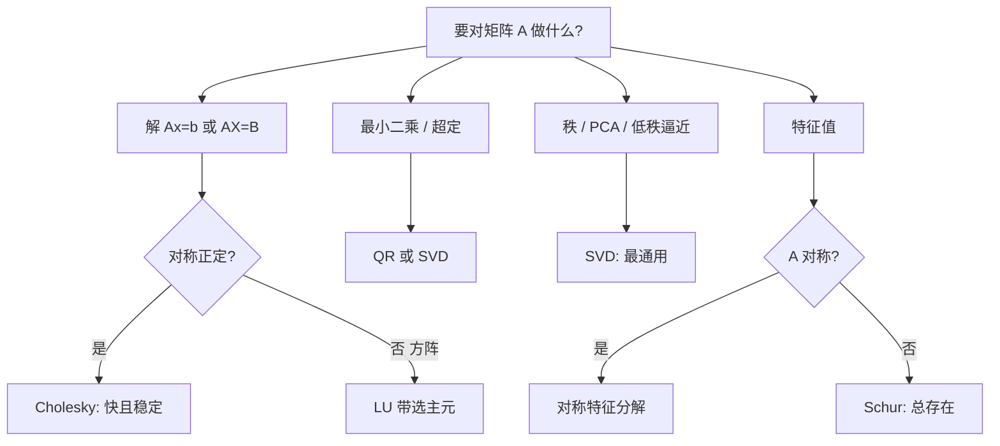

# 第 1 章 · 1.3 矩阵分解与特征分析
### Matrix Decompositions and Eigendecomposition

上一节：[1.2.Matrix.md](1.2.Matrix.md) ｜ 下一节：[1.4.Linear Equation System.md](1.4.Linear Equation System.md)

---

## 1.3 矩阵分解与特征分析


> 📝 **历史故事**：特征分解 A = VΛV^{-1} 的历史纠缠了整整一个世纪。Cayley（1858）首先定义了矩阵的特征方程，但谁先想到特征值仍是悬案。最终是 **Hamilton** 在 1853 年的《Lectures on Quaternions》中隐约提出了特征多项式概念。这提醒我们：好的数学概念往往不是一个人的发明，而是几代人共同雕琢的结果。


> **📌 学习目标**
> - 理解 LU、QR、Cholesky、特征分解、SVD 的各自适用场景
> - 掌握 SVD 与 PCA 的关系——协方差矩阵的特征分解即 PCA
> - 能用 YiShape-Math 的 `Decomps` 工厂进行各种分解
> - 理解 SVD 的几何意义：正交基变换


*图1.3.1 LDL分解与Cholesky分解。LDL分解：A=LDLᵀ；Cholesky是L=D⁰·⁵时的情况，要求A对称正定*

从图中可以看出，LDL分解与Cholesky分解。

*图1.3.2 正交投影。向量到子空间的正交投影；残差与投影正交；最小二乘几何意义*

从图中可以看出，正交投影。

*图1.3.3 矩阵的秩。矩阵的秩=列空间维度=行空间维度；秩衡量矩阵「有效维度」*

从图中可以看出，矩阵的秩。

*图1.3.4 特征值的几何意义。特征向量是变换后方向不变的向量；特征值是缩放倍数*

从图中可以看出，特征值的几何意义。
## 开场：Netflix 是怎么猜出你想看什么的？

2009 年，Netflix 举办了一场算法竞赛：谁能把我推荐系统的预测误差降低 10%，就拿 100 万美元。

最终获奖方案的核心思想，今天已经成为推荐系统的标准方法——**矩阵分解**。

问题是这样的：Netflix 有 5 万部电影、200 万用户。但用户不会给每部电影打分——大多数人只看过其中几十部。所以 rating 矩阵是 200万×5万，但里面 99% 是空白。

矩阵分解的思路是：**假设每个用户有一个「口味向量」（喜欢动作片、讨厌爱情片），每部电影也有一个「属性向量」——用户对电影的评分，就等于这两个向量的内积。**

$$\text{rating}_{ij} \approx \mathbf{u}_i \cdot \mathbf{m}_j$$

问题是我们不知道这些向量是什么——但用户的评分数据间接告诉了我们。矩阵分解就是从已有的评分，反推这些隐含向量——然后用这些向量预测空白位置。

这就是 SVD（奇异值分解）和 PCA（主成分分析）的实际应用。

---

### 1.3.1 为什么需要矩阵分解？

矩阵分解是数值线性代数的通用语言。将矩阵 $\mathbf{A}$ 分解为具有简单结构的因子（三角、正交、对角）的乘积，有三个核心好处：

1. **揭示结构**：秩、谱、不变子空间、正定性、条件数一目了然
2. **算法稳定**：避免显式求逆和条件数平方的灾难（如最小二乘中用 QR/SVD 代替正规方程）
3. **降低复杂度**：在简化结构（三对角、双对角）上迭代，比在稠密矩阵上直接迭代高效

**工业标准**：LAPACK、MATLAB、NumPy 都遵循「先归约（reduction）→ 再迭代（iteration）」的流水线。YiShape-Math 的 `Decomps` 工厂类与之对应。

### 1.3.2 分解选型总览

| 分解 | 形式 | 适用条件 | 典型用途 | YiShape-Math 入口 |
|------|------|----------|----------|-------------------|
| **LU 分解** | $\mathbf{PA}=\mathbf{LU}$ | 方阵 | 多右端求解、行列式 | `A.lu()` / `Decomps.createLU()` |
| **Cholesky 分解** | $\mathbf{A}=\mathbf{LL}^\top$ | 对称正定 | 协方差/核矩阵、SPD 系统 | `A.cholesky()` / `Decomps.createCholesky()` |
| **QR** | $\mathbf{A}=\mathbf{QR}$ | 任意形状 | **最小二乘**、正交化 | `A.qr()` / `Decomps.createQR()` |
| **特征分解** | $\mathbf{A}=\mathbf{V}\Lambda\mathbf{V}^{-1}$ | 方阵（对称时最干净） | PCA、谱分析 | `A.eigen()` / `Decomps.createEigen()` |
| **SVD** | $\mathbf{A}=\mathbf{U}\Sigma\mathbf{V}^\top$ | **任意矩阵** | 秩、伪逆、PCA、低秩逼近 | `A.svd()` / `Decomps.createSVD()` |
| **Schur** | $\mathbf{A}=\mathbf{U}\mathbf{T}\mathbf{U}^\top$ | 任意方阵 | 矩阵函数、控制系统 | `Decomps.createSchur()` |



### 1.3.3 LU 分解与部分选主元

#### 历史的视角：为什么是高斯消元的矩阵形式？

**高斯消元法**（Gaussian Elimination）发明于公元前 200 年的中国《九章算术》，但在西方通常归功于卡尔·弗里德里希·高斯（Carl Friedrich Gauss, 1777—1855）——虽然高斯本人主要用它做天体测量中的最小二乘拟合，而非系统性地研究算法。

真正把高斯消元**系统化**并给出稳定性分析的是 20 世纪的计算机先驱们。1950 年代，随着电子计算机的出现，人们才意识到：**同样的数学公式，在计算机上可能算不出正确结果**——消元过程中的数值放大，可以让结果完全失真。

LU 分解，本质上是把「手算高斯消元」翻译成矩阵语言：

- 消元操作 → 左乘一系列下三角矩阵 $\mathbf{L}_1^{-1}, \mathbf{L}_2^{-1}, \ldots$
- 最终结果 → 上三角矩阵 $\mathbf{U}$
- 完整分解 → $\mathbf{A} = \mathbf{LU}$（忽略选主元的情况）

> **补充历史**：选主元策略（pivoting）的数学必要性，是 1948 年由 John von Neumann 和 Herman Goldstine 在一篇著名论文中首次系统研究的。他们证明了：不用选主元的高斯消元，在某些矩阵上会产生灾难性的误差传播。

#### 怎么记住 LU 在干什么？

把 $\mathbf{A}$ 想象成一台机器，它的内部结构被藏在黑箱里。我们不知道里面是什么，但知道它能做「消元」这件事——LU 分解就是**拆开这台机器**，看看里面是由哪两个简单部件串联而成的：先经过一个下三角阀门 $\mathbf{L}$（只允许下层的东西通过），再经过一个上三角阀门 $\mathbf{U}$（只允许上层的东西通过）。

#### 为什么拆开有用？

如果同一个 $\mathbf{A}$ 要解 1000 个不同的 $\mathbf{b}$，LU 分解的价值就体现出来了：
- 分解一次 $\mathbf{A} = \mathbf{LU}$（成本 $O(n^3/3)$）
- 每个 $\mathbf{b}$ 做两次回代（成本 $O(n^2)$）
- 总成本：$O(n^3/3) + 1000 \times O(n^2)$ vs. 1000次高斯消元 $O(1000 \times n^3/3)$

在有限元分析（一次分解，百万次回代）、电路模拟（直流分析一次，瞬态分析千次）中，这个差距是决定性的。

**部分选主元**（partial pivoting）：每一步选列主元并交换行，得到置换阵 $\mathbf{P}$：
$$\mathbf{PA} = \mathbf{LU}$$

#### 优缺点一览

| | 说明 |
|---|---|
| **优点** | 速度快；揭示行列式（等于 $\mathbf{U}$ 对角元乘积）；适合多右端 |
| **缺点** | 需要选主元保证数值稳定；不适合病态矩阵；必须是方阵 |
| **适用场景** | 工程仿真（结构分析、电路分析）、多右端线性系统 |

**YiShape-Math 用法**：

```java
import com.yishape.lab.math.linalg.IMatrix;
import com.yishape.lab.math.linalg.Linalg;
import com.yishape.lab.math.linalg.decomposition.Decomps;
import com.yishape.lab.math.linalg.decomposition.ILUDecomposition;
import com.yishape.lab.util.Tuple2;

var A = Linalg.matrix(new double[][]{{2, 1}, {1, 3}});

// 快捷方式：返回 Tuple2<L, U>
Tuple2<IMatrix<Double>, IMatrix<Double>> lu = A.lu();
var L = lu._1;
var U = lu._2;

// 工厂方式（完整信息）
ILUDecomposition luFull = Decomps.createLU();
luFull.decompose(A);
System.out.println("行列式: " + luFull.getDeterminant());  // 5.0
```

**应用场景**：
- 多个右端 $\mathbf{b}$：分解一次，多次回代
- 行列式计算：$\det(\mathbf{A})$ 从 $\mathbf{U}$ 的对角元读取

---

### 1.3.4 Cholesky 分解

#### 历史的视角：一个法国军官的意外遗产

**安德烈-路易·乔莱斯基（André-Louis Cholesky, 1875—1918）** 是法国军队的一名测量工程师和数学家。第一次世界大战期间（1918 年），他在战役中阵亡，年仅 42 岁。

Cholesky 生前发明了一种解线性方程组的算法——但从未正式发表。他的方法记录在一份法国军事情报部门的手稿里，直到 1950 年代才被法国数学家 **Jean Battani** 发现并公开发表。

意外的是：Cholesky 的算法，正好利用了对称性——而对称矩阵在测量学、统计学和工程学中无处不在。

#### 为什么 SPD 矩阵无处不在？

「对称正定」（Symmetric Positive Definite, SPD）矩阵之所以常见，是因为它们天然地出现在以下场景：

- **协方差矩阵**：样本数据 $\mathbf{X}$ 的协方差 $\mathbf{X}^\top\mathbf{X}/(n-1)$ 天然对称正定（满秩时）
- **Gram 矩阵**：任意列满秩矩阵的 $\mathbf{X}^\top\mathbf{X}$ 是 SPD
- **核矩阵**：Mercer 定理保证正定核 $k(x_i, x_j)$ 生成 SPD 矩阵
- **Hessian 矩阵**：严格凸优化问题的 Hessian 矩阵是 SPD（保证梯度下降有唯一全局最优）
- **刚度矩阵**：结构工程中的有限元刚度矩阵

这就是为什么 Cholesky 分解不是「一个小技巧」——它处理的矩阵类型，几乎覆盖了半个工程和科学计算世界。

#### 优缺点一览

| | 说明 |
|---|---|
| **优点** | 计算量约为 LU 的一半；数值稳定性天然优于 LU（不需要显式选主元）；唯一性（取正对角元约定下） |
| **缺点** | 只能用于 SPD 矩阵；非 SPD 会抛出明确异常 |
| **适用场景** | 统计回归、机器学习（Gaussian Process）、金融（协方差矩阵）、工程（有限元）、信号处理 |

**为什么 Cholesky 比 LU 快一倍？**

因为对称性允许只存储和计算一半的矩阵元素。从 $n^2$ 个元素减少到 $n(n+1)/2$ 个，以及对应的计算量节省——这在 $n=10000$ 的协方差矩阵上是 50 倍的存储差距和 8 倍的计算速度差距。

```java
import com.yishape.lab.math.linalg.decomposition.ICholeskyDecomposition;

var SPD = Linalg.matrix(new double[][]{{4, 2}, {2, 3}});

// 快捷方式
var L = SPD.cholesky();

// 工厂方式（可调节容差，处理近奇异）
ICholeskyDecomposition chol = Decomps.createCholesky();
chol.decompose(SPD);
```

**失败情形**：对称但非正定（如协方差矩阵接近奇异）时抛出 `NonPositiveDefiniteMatrixException`。处理策略：
```java
try {
    L = SPD.cholesky();
} catch (NonPositiveDefiniteMatrixException e) {
    // 策略 1：在对角线上加一个小正则项 λI（λ>0 很小），让矩阵变成严格正定
    int n = SPD.rows();
    var regularized = SPD.add(Linalg.eye(n).mmul(1e-6));
    L = regularized.cholesky();
    // 策略 2：退回到 LU 分解（牺牲一些速度但更通用）
    // Tuple2<IMatrix<Double>, IMatrix<Double>> lu = SPD.lu();
}
```

---

### 1.3.5 QR 分解

#### 历史的视角：从 Gram-Schmidt 正交化到 Householder 反射

**Jørgen Gram**（1850—1916，丹麦数学家）和 **Erhard Schmidt**（1876—1959，德国数学家）发明了将一组向量正交化的方法——从几何上说，就是把歪歪扭扭的坐标系「掰正」。

但经典的 Gram-Schmidt 过程有一个致命缺陷：**正交性在数值上不稳定**——每一步的舍入误差会累积，导致算出来的向量彼此不再正交（术语叫「正交性漂移」）。

1958 年，**Alston Householder**（1904—1993，美国数学家）提出了一种用反射矩阵做正交化的方法，彻底解决了这个问题。Householder 变换的核心思想是：**找一个镜面，把向量一步反射到目标方向——精确、正交、数值稳定。**

Householder 变换的几何直觉：把向量 $\mathbf{x}$ 沿垂直于镜面 $\mathbf{u}$ 的方向反射，得到 $\mathbf{y}$。镜面方程是：
$$\mathbf{y} = \mathbf{x} - 2\mathbf{uu}^\top\mathbf{x}, \quad \mathbf{u} = \frac{\mathbf{x} - \|\mathbf{x}\|_2\mathbf{e}_1}{\|\mathbf{x} - \|\mathbf{x}\|_2\mathbf{e}_1\|_2}$$

用一句话总结：**Householder QR = Gram-Schmidt 的思想 + 反射的几何稳定性**。

#### QR 为什么比正规方程稳定？

最小二乘问题 $\min\|\mathbf{Ax}-\mathbf{b}\|_2$ 的正规方程为 $\mathbf{A}^\top\mathbf{Ax} = \mathbf{A}^\top\mathbf{b}$。但 $\mathbf{A}^\top\mathbf{A}$ 的条件数是 $\mathbf{A}$ 条件数的**平方**：
$$\kappa(\mathbf{A}^\top\mathbf{A}) = \kappa(\mathbf{A})^2$$

当 $\kappa(\mathbf{A}) = 10^6$ 时，正规方程的条件数已达 $10^{12}$，双精度几乎完全丧失精度。QR 路径直接将 $\mathbf{A}=\mathbf{QR}$ 代入：
$$\min\|\mathbf{QRx}-\mathbf{b}\|_2 = \min\|\mathbf{Rx}-\mathbf{Q}^\top\mathbf{b}\|_2$$
由于正交变换保范数，条件数不变。

#### QR 的三大核心应用

**应用一：解超定最小二乘**（最常见！）
$$\mathbf{Ax} \approx \mathbf{b} \quad (m > n)$$
QR 分解把问题化为上三角系统 $\mathbf{Rx} = \mathbf{Q}^\top\mathbf{b}$，直接回代即可。

**应用二：QR 算法求特征值**
对称 QR 算法（包含位移）在 $O(n^3)$ 时间内求出全部特征值，是 LAPACK 中特征值求解的标准前端。

**应用三：QR 分解本身即正交化**
对 $\mathbf{A}$ 的列向量做 QR，得到标准正交基——这在 Gram-Schmidt 失效的场合（病态矩阵列相关）尤其重要。

#### 优缺点一览

| | 说明 |
|---|---|
| **优点** | 极其稳定（正交变换保范数）；适用于任意形状矩阵；不产生正规方程的条件数膨胀 |
| **缺点** | 计算量约为 LU 的两倍；不适合实时嵌入（计算量固定） |
| **适用场景** | 线性回归（统计标配）、最小二乘、QR 算法、求解超定方程组 |

```java
import com.yishape.lab.math.linalg.decomposition.IQRDecomposition;
import com.yishape.lab.util.Tuple2;

var A = Linalg.matrix(new double[][]{{1, 2}, {3, 4}, {5, 6}});

// 快捷方式：返回 Tuple2<Q, R>
Tuple2<IMatrix<Double>, IMatrix<Double>> qr = A.qr();
var Q = qr._1;
var R = qr._2;

// 验证正交性：Q^T Q ≈ I
var QtQ = Q.transpose().mmul(Q);

// 工厂方式
IQRDecomposition qrFull = Decomps.createQR();
qrFull.decompose(A);
```

> **实现细节**：工业库使用 **Householder 反射**做 QR，而非经典 Gram-Schmidt（正交性漂移严重）。YiShape-Math 的 `RereQRDecomposition` 基于 Householder 实现。

**进阶：带列主元的 QR 分解（QRCP）**

当矩阵列之间高度相关时，标准 QR 可能遇到数值不稳定问题。QRCP（QR with Column Pivoting）在分解过程中动态选择「最大的列」优先处理，显著提升稳定性。

$$\mathbf{AP} = \mathbf{QR}$$

其中 $\mathbf{P}$ 是列置换矩阵。QRCP 在求解秩亏最小二乘问题、数值 rank 估计等场景中尤为重要。

```java
// QRCP 分解（带列主元）
import com.yishape.lab.math.linalg.decomposition.IQrcpDecomposition;
IQrcpDecomposition qrcp = Decomps.createQrcp();
qrcp.decompose(A);
var Q2 = qrcp.getQ();
var R2 = qrcp.getR();
int[] pivot = qrcp.getColumnPivots();  // 列置换顺序
```

---

### 1.3.6 特征分解（谱分解）

#### 历史的视角：从振动分析到量子力学

特征值的故事，从**振动力学**开始。

1751 年，**莱昂哈德·欧拉**（Leonhard Euler）在研究多自由度弹簧-质量系统的振动时，发现某些特定的振动模式（后来叫特征向量）会以特有的频率振动（后来叫特征值）。他证明：无论初始条件如何，系统的运动都可以分解为这些「本征模式」的叠加。

后来，**约瑟夫·拉格朗日**（Joseph-Louis Lagrange）在分析行星运动稳定性时，再次遇到了特征值问题。

最终，**特征值分解**成为贯穿整个数学和物理的主线：
- 机械振动的固有频率 → 特征值
- 量子力学的可观测物理量 → 算子的特征值
- 谷歌 PageRank → 矩阵的特征向量
- 主成分分析 → 协方差矩阵的特征向量

#### 什么是特征分解？

对 $n\times n$ 矩阵 $\mathbf{A}$，如果存在可逆 $\mathbf{V}$ 和对角 $\Lambda$ 使 $\mathbf{A} = \mathbf{V}\Lambda\mathbf{V}^{-1}$，则 $\mathbf{A}$ **可对角化**。列 $\mathbf{v}_j$ 为特征向量，$\lambda_j$ 为特征值，满足 $\mathbf{Av}_j = \lambda_j\mathbf{v}_j$。

**几何直觉**：特征向量是「变换后方向不变」的向量——矩阵对它的作用只是拉伸（或压缩），不改变方向。特征值就是拉伸的倍数。

**实对称矩阵的特殊性（谱定理）**：
- 所有特征值为实数（不再有复数困扰）
- 存在正交特征向量基：$\mathbf{A} = \mathbf{Q}\Lambda\mathbf{Q}^\top$
- 正定性 $\iff$ 所有特征值 $> 0$（这是判断 SPD 最实用的方法）

**非对称矩阵的麻烦**：
- 可能有复特征值（需要复数运算）
- 可能不可对角化（亏损矩阵）：如 Jordan 块 $\begin{pmatrix} \lambda & 1 \\ 0 & \lambda \end{pmatrix}$

#### 什么时候特征分解不存在？

| 矩阵类型 | 可对角化？ | 怎么办 |
|----------|-----------|--------|
| 对称矩阵 | ✅ 一定可对角化 | $\mathbf{A} = \mathbf{Q}\Lambda\mathbf{Q}^\top$ |
| 有 $n$ 个线性无关特征向量 | ✅ 可对角化 | $\mathbf{A} = \mathbf{V}\Lambda\mathbf{V}^{-1}$ |
| 有重复特征值且特征向量不足 | ❌ Jordan 标准形 | 用 Schur 分解 |
| 一般实矩阵 | ❌ 可能有复特征值 | 用实 Schur（拟上三角）|

#### PCA 就是特征分解的产业应用

**PCA（主成分分析）就是特征分解的产业应用。**

步骤回顾：
1. 中心化数据：每列减去均值 $\bar{x}$
2. 算协方差矩阵 $\mathbf{C} = \frac{1}{n-1}\mathbf{X}_c^\top\mathbf{X}_c$
3. 对 $\mathbf{C}$ 做特征分解：$\mathbf{C} = \mathbf{V}\Lambda\mathbf{V}^\top$

**为什么这样就能降维？** 特征值 $\lambda_1 \geq \lambda_2 \geq \cdots$ 衡量每个方向上数据的方差。$\lambda_1 / \sum\lambda_i$ 就是第一主成分「解释了多少比例的方差」。如果前 5 个特征值加起来占了总方差的 95%，那这 5 个方向就保留了原始 50 维 95% 的信息——这就是降维的数学保证。

#### 优缺点一览

| | 说明 |
|---|---|
| **优点** | 揭示矩阵的本质结构；谱（特征值集合）是矩阵的「指纹」；PCA/SVD/PageRank 都依赖它 |
| **缺点** | 不一定存在（可能不可对角化）；对扰动敏感（条件数大时）；实矩阵可能有复特征值 |
| **适用场景** | PCA（降维）、振动分析、PageRank、量子力学、控制理论 |

```java
import com.yishape.lab.math.linalg.decomposition.IEigenDecomposition;
import com.yishape.lab.util.Tuple2;

// 对称矩阵的特征分解
var sym = Linalg.matrix(new double[][]{{2, 1}, {1, 2}});

// 快捷方式
Tuple2<IVector<Double>, IMatrix<Double>> eig = sym.eigen();
var eigenvalues  = eig._1;        // IVector<Double>，特征值（一般为降序）
var eigenvectors = eig._2;        // IMatrix<Double>，列为对应特征向量

// 验证：A·v = λ·v
for (int i = 0; i < eigenvalues.length(); i++) {
    var vi      = eigenvectors.getColumn(i);
    var Avi     = sym.mmul(vi);
    double lambda  = eigenvalues.get(i);            // 直接返回 double
    var expected   = vi.multiplyByScalar(lambda);    // 向量数乘的真实方法名
    // Avi 应与 expected 在容差内近似相等
}

// 工厂方式（可调参）
IEigenDecomposition eigFull = Decomps.createEigen(1e-10, 1000);
eigFull.decompose(sym);
```

---

### 1.3.7 奇异值分解（SVD）

#### 历史的视角：三个数学家，三个国家，一个发现

奇异值分解（SVD）的历史，比大多数教科书里写的要复杂得多。

**1873 年**，意大利数学家 **Eugenio Beltrami** 首次发表了 SVD 的完整理论——但他的论文是用意大利语写的，传播范围有限。

**1874 年**，法国数学家 **Camille Jordan** 独立重新发现了同样的分解——用的是更容易理解的方式，因此更广为人知。

**1980 年**，历史学家 Steven Stigland 发现，比 Beltrami 和 Jordan 都更早，法国数学家 **René B. Escott** 在 1888 年就已经独立发现了 SVD——但他的结果从未正式发表，只在一份葡萄牙期刊的角落里出现过。

> **这段历史让我们看到：重要的数学发现，往往被多人同时独立发现——不是因为抄袭，而是因为数学问题是时代的需求，有人在研究同样的问题，自然会产生相同的结果。**

在计算机时代，SVD 成为了**信息检索（IR）**的标准工具——1990 年代，Google 的创始人在研究 PageRank 算法时用的就是 SVD 的思想。这或许是 SVD 最出乎发明者意料的应用。

#### SVD 为什么是「最诚实」的矩阵分解？

因为它是**唯一对任何矩阵都存在的分解**——不要求方阵、不要求对称、不要求正定。

任意 $\mathbf{A}\in\mathbb{R}^{m\times n}$ 可分解为：
$$\mathbf{A} = \mathbf{U}\Sigma\mathbf{V}^\top$$

- $\mathbf{U}\in\mathbb{R}^{m\times m}$：左奇异向量矩阵（正交）
- $\Sigma\in\mathbb{R}^{m\times n}$：对角矩阵，对角元为奇异值 $\sigma_1 \geq \sigma_2 \geq \cdots \geq 0$
- $\mathbf{V}\in\mathbb{R}^{n\times n}$：右奇异向量矩阵（正交）

**几何解释**：SVD 描述了 $\mathbf{A}$ 将单位球映射为椭球的过程——奇异值是椭球的半轴长度，奇异向量是主轴方向。

**怎么记住 SVD 在干什么**：想象你有一块橡皮泥，上面画了一个圆。你把橡皮泥往某个方向拉长（$\mathbf{V}^\top$ 旋转到标准基），再压扁（$\Sigma$ 拉伸/压缩每个方向），再旋转回去（$\mathbf{U}$ 旋转到最终方向）。奇异值 $\sigma_1, \sigma_2, \ldots$ 告诉你每一步拉伸了多少。

**一句话总结**：SVD 告诉你任意矩阵在「最坏情况」和「最好情况」下分别能放大或缩小向量多少倍——这是条件数的几何本质。

#### SVD 的四大核心应用

**应用一：秩与数值秩**

非零奇异值个数 = 秩。但更有用的是**数值秩**——在容差 $\varepsilon$ 内接近零的奇异值揭示了「有效」维度：

```java
ISVDDecomposition svd = Decomps.createSVD();
svd.decompose(A);
int numericalRank = svd.getRank();  // 奇异值 > machine epsilon × σ_max
```

**应用二：最优低秩逼近（Eckart-Young 定理）**

截断到前 $k$ 个奇异值，在 Frobenius 范数下是**数学上证明的最优**秩 $k$ 近似：

$$\min_{\_rank(\tilde{\mathbf{A}})=k} \|\mathbf{A} - \tilde{\mathbf{A}}\|_F = \|\mathbf{A} - \mathbf{U}_k\Sigma_k\mathbf{V}_k^\top\|_F$$

这就是 JPEG 压缩（保留前 $k$ 个 DCT 系数）、推荐系统（只存储最重要的隐因子）的数学原理。

**应用三：Moore-Penrose 伪逆**

当 $\mathbf{A}$ 不是方阵或不满秩时，$\mathbf{A}^+ = \mathbf{V}\Sigma^+\mathbf{U}^\top$ 是唯一良定义的广义逆——这就是为什么解最小二乘最好用 `lstsq` 而非手动算逆。

**应用四：主成分分析（PCA 的完整形式）**

对数据中心化后的协方差矩阵 $\mathbf{C} = \mathbf{X}^\top\mathbf{X}/(n-1)$，其 SVD 为 $\mathbf{C} = \mathbf{V}\frac{\Sigma^2}{n-1}\mathbf{V}^\top$，特征值 = $\sigma_i^2/(n-1)$，特征向量 = $\mathbf{V}$ 的列。

#### 产业故事：Google 的 PageRank，本质上是矩阵特征分解

1996 年，Stanford 的两个博士生 **Larry Page 和 Sergey Brin** 在研究如何对网页进行排名。他们面临的问题是：互联网上有数十亿个网页，如何判断哪个页面「更重要」？

Page 的灵感来自学术论文的引用机制——一篇论文被引用得越多，往往越重要。网页也一样——被其他网页链接得越多，往往越重要。

但这就产生了一个数学问题：网页之间相互链接，形成了一个巨大的有向图。如何给每个网页打一个「重要性分数」，使得分数既反映它被多少网页链接，也反映链接它的网页本身有多重要？

Page 提出的模型是：假设网页 $i$ 的重要性分数是 $r_i$，所有指向 $i$ 的网页 $j$ 的重要性分数为 $r_j$，则：
$$r_i = \sum_{j \to i} \frac{r_j}{d_j}$$
其中 $d_j$ 是网页 $j$ 的出链数量。

这个模型的矩阵形式是：$\mathbf{r} = \mathbf{M}^\top \mathbf{r}$——也就是说，$\mathbf{r}$ 是矩阵 $\mathbf{M}^\top$ 的**特征向量**，对应的特征值为 1。

**这就是 PageRank，本质是一个特征向量问题——和 SVD / 特征分解是同一类数学。**

Brin 和 Page 把这个算法做成了一个搜索引擎，成立了 Google——而 Google 后来成了世界上最有价值的公司之一。这个故事告诉我们：**扎实的线性代数，有时候比产品经理更能改变世界。**

#### 优缺点一览

| | 说明 |
|---|---|
| **优点** | 任何矩阵都存在；数值最稳定；揭示秩、条件数、低秩结构；伪逆不用求逆 |
| **缺点** | 计算成本最高（$O(mn^2)$  vs. LU 的 $mn^2/3$）；存储三个矩阵 |
| **适用场景** | 推荐系统、图像压缩、信号处理、PCA、伪逆、稳健统计 |

```java
import com.yishape.lab.math.linalg.decomposition.ISVDDecomposition;
import com.yishape.lab.util.Tuple3;

var A = Linalg.matrix(new double[][]{{1, 2}, {3, 4}, {5, 6}});

// 快捷方式：返回 Tuple3<U, S, V^T>
// 注意：第三分量是 V^T（不是 V），与 numpy.linalg.svd 的 vh 一致
Tuple3<IMatrix<Double>, IVector<Double>, IMatrix<Double>> svd = A.svd();
var U  = svd._1;          // 左奇异向量
var S  = svd._2;          // 奇异值（降序排列），IVector<Double>
var VT = svd._3;          // V^T（右奇异向量的转置）

// 重建：A ≈ U · diag(S) · V^T
var S_diag        = Linalg.diag(S.toDoubleArray());
var reconstructed = U.mmul(S_diag).mmul(VT);

// 条件数 = σ_max / σ_min
double cond = S.get(0) / S.get(S.length() - 1);  // get(int) 直接返回 double
System.out.println("条件数: " + cond);

// 工厂方式
ISVDDecomposition svdFull = Decomps.createSVD();
svdFull.decompose(A);
System.out.println("数值秩: " + svdFull.getRank());
```

**经济型 SVD**（thin SVD）：当 $m > n$ 时，只保留前 $n$ 个左奇异向量和前 $n$ 个奇异值。这在低秩逼近中常见。

---

### 1.3.8 Schur 分解

#### 历史的视角：为什么需要比特征分解更通用的形式？

**艾萨克·舒尔（Issai Schur, 1875—1941）** 是德国数学家，犹太裔，后因纳粹迫害流亡美国。他在群表示论和矩阵理论方面做出了基础性贡献。

Schur 分解解决了一个特征分解无法回答的问题：**如果矩阵不可对角化（亏损），怎么办？**

答案是：**至少能把矩阵化成一个「分块上三角」的形式**——对角块是 $1\times 1$（实特征值）或 $2\times 2$（共轭复特征值对）。这个形式叫**拟上三角矩阵（Schur form）**，总是存在的。

#### 什么时候用 Schur 而不是特征分解？

| 场景 | 推荐 |
|------|------|
| 矩阵可对角化且对称 | 用特征分解（更简单更快） |
| 矩阵不可对角化（如 Jordan 块） | 必须用 Schur |
| 需要所有特征值（实数或复数都要） | 用实 Schur（拟上三角）|
| 计算矩阵函数 $f(\mathbf{A})$ | Schur 是标准方法（Schur-Parlett 算法）|

**应用场景**：控制理论（稳定性判据——所有特征值在复平面左半平面）、矩阵指数（$e^{\mathbf{A}t}$ 在微分方程中）、数值特征值求解（QR 算法的理论支撑）。

```java
import com.yishape.lab.math.linalg.decomposition.ISchurDecomposition;

var A = Linalg.matrix(new double[][]{{0, -1}, {1, 0}});  // 旋转90°，复特征值

ISchurDecomposition schur = Decomps.createSchur();
schur.decompose(A);
var U = schur.getU();
var T = schur.getT();  // 拟上三角形式
```

---

### 1.3.9 中间归约分解（幕后英雄）

这些分解通常不直接暴露给终端用户，而是专业实现的中间步骤——但理解它们有助于理解为什么工业库「总是先把矩阵变成某种特殊形式」：

| 分解 | 形式 | 功能 | 为什么需要它 |
|------|------|------|-------------|
| **Hessenberg 化** | $\mathbf{A} = \mathbf{QHQ}^\top$ | 把任意方阵变成「近上三角」（次对角线以下全为0） | 非对称 QR 算法的第一步，$O(n^3)$ 完成，目标将问题显式化 |
| **对称三对角化** | $\mathbf{A} = \mathbf{QTQ}^\top$ | 对称矩阵 → 三对角（带状） | 对称 QR 迭代的特征值求解，复杂度从 $O(n^3)$ 降到 $O(n^2)$ 每步 |
| **双对角化** | $\mathbf{A} = \mathbf{UBV}^\top$ | 任意矩阵 → 双对角（上三角和下三角各一条带） | SVD 迭代的标准前端（Golub-Kahan 双对角化路径）|

为什么需要中间归约？因为在稠密 $1000\times 1000$ 矩阵上直接迭代特征值是灾难——每步 $O(n^3)$，迭代几十步就是天文数字。归约到带状矩阵后，每步迭代降到 $O(n^2)$，总时间从「不可能」变成「几秒」。

```java
// Hessenberg 化
import com.yishape.lab.math.linalg.decomposition.IHessenbergDecomposition;
IHessenbergDecomposition hess = Decomps.createHessenberg();
hess.decompose(A);

// 对称三对角化
import com.yishape.lab.math.linalg.decomposition.ITridiagonalDecomposition;
ITridiagonalDecomposition tri = Decomps.createTridiagonal();
tri.decompose(symMatrix);

// 双对角化
import com.yishape.lab.math.linalg.decomposition.IBidiagonalDecomposition;
IBidiagonalDecomposition bi = Decomps.createBidiagonal();
bi.decompose(A);
```

---

### 1.3.10 `Decomps` 工厂的参数调优

`Decomps` 工厂类提供多种重载，允许调整容差和迭代上限：

```java
// Cholesky：控制对称性和正定性判断阈值
Decomps.createCholesky(relativeSymmetryThreshold, absolutePositivityThreshold);

// LU：控制奇异性判断阈值
Decomps.createLU(singularityThreshold);

// QR、SVD、Eigen、Schur：epsilon 和 maxIterations
Decomps.createSVD(epsilon, maxIterations);
Decomps.createEigen(epsilon, maxIterations);
```

**调参原则**：
- **病态或近奇异矩阵**：放大 `epsilon` 或奇异性阈值
- **大规模矩阵**：增加 `maxIterations`
- **教学演示**：默认参数即可

---

### 1.3.11 分解失败与异常处理

```java
try {
    // 对非 SPD 矩阵做 Cholesky 将抛出明确异常
    var notSPD = Linalg.matrix(new double[][]{{1, 2}, {2, 1}});
    notSPD.cholesky();
} catch (NonPositiveDefiniteMatrixException e) {
    System.err.println("矩阵非正定，尝试 LU 或 SVD");
} catch (NonSymmetricMatrixException e) {
    System.err.println("矩阵不对称");
} catch (DecompositionFailedException e) {
    System.err.println("分解失败，检查条件数");
}
```

**调试清单**：
1. 打印 `A.rows()`、`A.cols()` —— 确认矩阵形状
2. 检查对称性：`A.isSymmetric()` —— 是 → 考虑 Cholesky
3. 检查条件数：`A.cond()` —— $>10^{10}$ → 病态，考虑正则化
4. 打印所选分解名与参数
5. 查看异常链的 `cause`

---

### 1.3.12 六种分解对比总览

| 分解 | 计算复杂度 | 数值稳定 | 存在条件 | 典型应用 |
|------|-----------|---------|---------|---------|
| **LU** | $n^3/3$ | 需选主元 | 方阵 | 多右端求解、行列式 |
| **Cholesky** | $n^3/6$ | ✅ 天然稳定 | 对称正定 | 协方差、有限元、正定系统 |
| **QR** | $2n^3/3$ | ✅ 正交变换保范数 | 任意 $m\times n$ | 最小二乘、正交化、QR算法 |
| **特征分解** | $O(n^3)$ | 对称时稳定 | 方阵（对称时最干净） | PCA、PageRank、振动分析 |
| **SVD** | $O(mn^2)$ | ✅ 最稳定 | **任意矩阵** | 低秩逼近、伪逆、推荐系统 |
| **Schur** | $O(n^3)$ | ✅ 稳定 | **任意方阵** | 矩阵函数、控制理论 |

> **选择口诀**：有对称正定 → Cholesky（最快）；最小二乘 → QR（最稳）；任意矩阵找秩 → SVD（最诚实）；特征值不收敛 → 先 Schur 归约。

---

### 1.3.13 常见误区

| 误区 | 纠正 |
|------|------|
| "先求逆再相乘解方程" | 用 `solve` 或 `lstsq`，不要 `inv()` |
| "对非 SPD 矩阵做 Cholesky" | 数学上不成立，会抛异常 |
| "用 LU 解超定最小二乘" | 用 QR 或 SVD，避免正规方程 |
| "SVD 第三分量是 V" | 是 **V^T**，与 NumPy 的 `vh` 一致 |
| "QR 分解 = QR 算法" | QR 分解是因子化，QR 算法是求特征值的迭代方法 |
| "特征值总存在" | 实矩阵可能有复特征值，或不可对角化 |

---

### 1.3.14 自测与练习

1. 写出 QR 解最小二乘的代数步骤，说明为何避免 $\mathbf{A}^\top\mathbf{A}$
2. 说明 SVD 截断到前 $k$ 个奇异值为什么是最优低秩逼近（Eckart-Young 定理）
3. 构造 $5\times 5$ 对称矩阵，手算特征值并与 `eigen()` 结果对照
4. 比较 Cholesky 和 LU 的计算量：当 $n=10000$ 时，Cholesky 比 LU 快多少倍？
5. 打开 `Decomps.java`，列举至少五种 `create` 方法名及其参数
6. **思考**：如果 PageRank 本质是特征向量问题，为什么 Google 后来还大规模使用 SVD？

---

### 1.3.15 与官方文档的对照

（相关：第 4 章统计推断中，主成分分析（PCA）依赖特征分解；在第 5 章降维中，SVD 是主要工具。）
- API 文档：[`docs/Matrix-Operations.md`](../../docs/Matrix-Operations.md) —— 分解的快捷方法参考
- 示例：[`docs/examples/Matrix-Examples.md`](../../docs/examples/Matrix-Examples.md) —— 可运行的分解示例
- 本节侧重**分解的数学含义、历史脉络与选型逻辑**

---

**上一节**：[1.2.Matrix.md](1.2.Matrix.md) ｜ **下一节**：[1.4.Linear Equation System.md](1.4.Linear Equation System.md)

> **⚠️ 常见误区**
> - **混淆矩阵的左奇异向量和右奇异向量**：$\mathbf{A} = \mathbf{U} \boldsymbol{\Sigma} \mathbf{V}^\top$ 中，$\mathbf{U}$ 的列是 $\mathbf{AA}^\top$ 的特征向量（左奇异向量，对应 $\mathbf{A}$ 的**列空间** $\mathcal{C}(\mathbf{A})$）；$\mathbf{V}$ 的列是 $\mathbf{A}^\top\mathbf{A}$ 的特征向量（右奇异向量，对应 $\mathbf{A}$ 的**行空间** $\mathcal{C}(\mathbf{A}^\top)$）。说到「SVD 的基向量」时，要明确是哪个，并且要把「左/列空间」「右/行空间」的对应关系背牢。
> - **认为 SVD 第三分量是 V**：YiShape-Math 的 `A.svd()._3` 返回的是 **V^T**（与 numpy.linalg.svd 的 `vh` 一致）。与奇异值 $\sigma_3$ 对应的右奇异向量是 `V` 的第 3 **列**，对应 `V^T` 的第 3 **行**。

---

## 本节小结

矩阵分解将复杂矩阵拆解为简单矩阵的乘积：LU 解方程组、Cholesky 处理正定对称矩阵、特征分解揭示矩阵的「内在频率」、SVD 是所有矩阵的最稳定分解。

**核心要点**：LU 分解将高斯消元系统化；Cholesky 是 LU 的特例（正定对称）；特征分解 A = VΛV⁻¹ 揭示周期性和主方向；SVD A = UΣVᵀ 是 PCA 的数学基础。

## 本节 API 一览

YiShape-Math 提供两种调用风格：**矩阵快捷方法**（`A.xxx()`）与**显式工厂**（`Decomps.createXxx(...)`）。两者底层走同一份实现，前者更常用，后者支持自定义收敛参数。

| 场景       | 矩阵快捷方法                          | 显式工厂方法                                     | 返回结构（Tuple 用 `_1/_2/_3`）                                |
| ---------- | ------------------------------- | ------------------------------------------- | --------------------------------------------------------- |
| LU 分解     | `A.lu()`                        | `Decomps.createLU([threshold])`             | `Tuple2<IMatrix L, IMatrix U>`                            |
| Cholesky | `A.cholesky()`                  | `Decomps.createCholesky()`                  | `IMatrix L`（满足 $A = LL^\top$，仅对称正定矩阵有效）                    |
| QR 分解     | `A.qr()`                        | `Decomps.createQR()`                        | `Tuple2<IMatrix Q, IMatrix R>`                            |
| 特征分解     | `A.eigen()`                     | `Decomps.createEigen([eps, maxIter])`       | `Tuple2<IVector eigenvalues, IMatrix eigenvectors>`，列即特征向量 |
| SVD 分解    | `A.svd()`                       | `Decomps.createSVD([eps, maxIter])`         | `Tuple3<IMatrix U, IVector S, IMatrix Vᵀ>`，注意第三项已转置        |
| Schur     | （无快捷）                          | `Decomps.createSchur()`                     | 上三角化分解，特征分解的中间形态                                          |
| 伪逆       | `A.pinv()`                      | （内部走 SVD）                                   | `IMatrix`，Moore-Penrose 伪逆                                |

> ⚠️ **不存在的 API**：`Decomps.svd(A)`、`Decomps.eigen(A)`、`Decomps.qr(A)`、`Decomps.cholesky(A)`、`Decomps.pca(A, k)` 等"直接传矩阵到 Decomps 静态方法"的形式不存在——`Decomps` 的工厂方法都是无矩阵参数的 `createXxx()`，需要先 `var svd = Decomps.createSVD(); var result = svd.decompose(A);` 两步走。日常请直接用 `A.svd()` 等快捷方法。
>
> ⚠️ **低秩重构需手动完成**：YiShape-Math 没有 `reconstruct(k)` 之类的方法。截断 SVD 重构示例：
> ```java
> var svd = A.svd();
> var U = svd._1; var S = svd._2; var Vt = svd._3;
> // 保留前 k 个奇异值，其余截零
> var Sk = S.copy();
> for (int i = k; i < Sk.length(); i++) Sk.set(i, 0.0);
> // A_k = U · diag(S_k) · Vᵀ
> var diagSk = Linalg.diag(Sk);
> var Ak = U.mmul(diagSk).mmul(Vt);
> ```
>
> ⚠️ **PCA 不在 `Decomps`**：PCA 入口是 `ML.dr.pca(int k)`，调用 `pca.fitTransform(X)` 即可得到降维后的数据。底层依然是 SVD 或协方差特征分解，但接口在 `ML.dr` 子工厂中，不在 `Decomps` 下。

> **SVD 是 PCA 的推广**：不要求方阵、不要求对称、不要求正定；SVD 存在性对任何矩阵都成立。
