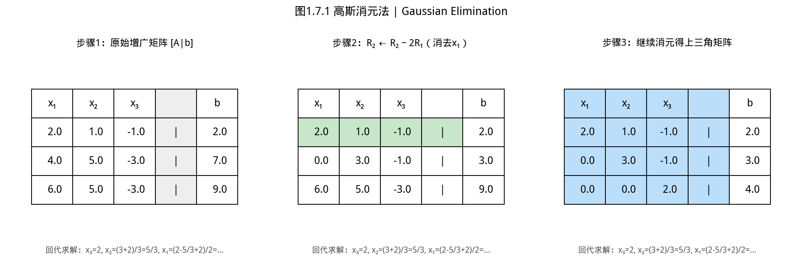

# 第 1 章 · 1.4 线性方程组与最小二乘
### Linear Systems and Least Squares

上一节：[1.3.Matrix decomposition.md](1.3.Matrix decomposition.md) ｜ 下一节：[1.5.Applications.md](1.5.Applications.md)

---
## 1.4 线性方程组与最小二乘

> ⚠️ **防坑**：用 `solve(A, b)` 时，若 A 接近奇异，解会剧烈放大误差。求解前先检查 `A.det()` 是否接近 0，或用 `A.rank()` 对比增广矩阵的秩。

> **📌 学习目标**
> - 理解线性方程组有解的条件（秩的关系）
> - 掌握最小二乘问题的几何意义
> - 能用 `Linalg.lstsq()` 求解病态与非病态方程组
> - 理解条件数与数值稳定性的关系

## 开场：为什么你解的「方程组」总是不精确？

工程师在实验中测了一批数据：输入 [1, 2, 3, 4, 5] 个因素，输出 [2.1, 4.3, 6.2, 8.1, 9.9] 个单位。理论上它们应该满足 $y = kx$，但实验数据有误差——每一个点都不完全在直线上。

这时候你写出来的方程组 $\mathbf{Ax}=\mathbf{b}$：

$$2x = 2.1, \quad 2x = 4.3, \quad 2x = 6.2, \quad 2x = 8.1, \quad 2x = 9.9$$

这五个方程不可能同时满足——**无解**。

但你仍然想知道「最接近的」$x$ 是多少。这条直线到底有多陡？

**最小二乘（Least Squares）** 回答的就是这个问题：在所有可能的解中，找一个让「误差平方和」最小的解。这就是线性代数在数据分析中最常见的应用之一。

---

### 1.4.1 问题的三种形态


> 📝 **历史故事**：求解线性方程组的高斯消元法，其实**中国人比高斯早 1800 年**——《九章算术》（公元前200年-公元50年）就记载了「方程术」，用算筹摆矩阵。中国古代数学在代数领域曾领先世界。

下图列出高斯消元法的工作原理。


*图1.4.1 高斯消元法。高斯消元通过行初等变换将增广矩阵化为上三角，再回代求解*

给定 $\mathbf{Ax}=\mathbf{b}$，其中 $\mathbf{A}\in\mathbb{R}^{m\times n}$，$\mathbf{b}\in\mathbb{R}^m$。根据 $m$ 与 $n$ 的关系，问题分为三类：

| 类型 | 条件 | 解的情况 | YiShape-Math API |
|------|------|----------|-----------------|
| **恰定** | $m=n$，满秩 | 唯一解 | `A.solve(b)` |
| **超定** | $m>n$ | 通常无精确解，求最小二乘 | `A.lstsq(b)` |
| **欠定** | $m<n$ | 无穷多解，求最小范数 | `A.lstsq(b)` |

**核心规则**：
- `A.solve(b)` **仅适用于方阵**，内部自动选分解（Cholesky→LU→QR→SVD）
- `A.lstsq(b)` 适用于**任意形状**，返回解与残差信息

```java
import com.yishape.lab.math.linalg.IMatrix;
import com.yishape.lab.math.linalg.IVector;
import com.yishape.lab.math.linalg.Linalg;
import com.yishape.lab.util.Tuple2;
```

### 1.4.2 恰定系统：`A.solve(b)`

当 $\mathbf{A}$ 为方阵且满秩时，`solve` 自动选择最优分解路径：

```java
var A = Linalg.matrix(new double[][]{{2, 1}, {1, 3}});
var b = Linalg.vector(new double[]{5, 7});

var x = A.solve(b);

// 验证：Ax ≈ b
var residual = A.mmul(x).sub(b);
System.out.println("残差范数: " + residual.norm2().doubleValue());
```

**内部选型策略**（`LinearSystemSolver`）：

1. 检测对称正定 → 尝试 **Cholesky**（最快）
2. 对称非正定 → 尝试对称三对角化
3. 大规模方阵（>100）→ 尝试 **Hessenberg**
4. 一般方阵 → **LU**，失败则 **QR**
5. 良态 → **QR**
6. 兜底 **SVD**
7. 若秩亏 → 抛 `ArithmeticException`，提示改用 `lstsq`

**多右端**：一次解多个方程组

```java
// A X = B，B 的每一列是一个右端
var B = Linalg.matrix(new double[][]{{5, 6}, {7, 8}});
var X = A.solve(B);
```

### 1.4.3 超定最小二乘：`A.lstsq(b)`

当 $m > n$（方程数 > 未知数）时，通常无精确解。最小二乘求
$$\hat{\mathbf{x}} = \arg\min_{\mathbf{x}} \|\mathbf{Ax} - \mathbf{b}\|_2^2$$

**几何解释**：$\mathbf{A}\hat{\mathbf{x}}$ 是 $\mathbf{b}$ 在 $\mathbf{A}$ 的列空间 $\mathcal{C}(\mathbf{A})$ 上的**正交投影**。残差 $\mathbf{r} = \mathbf{b} - \mathbf{A}\hat{\mathbf{x}}$ 与列空间正交（$\mathbf{A}^\top\mathbf{r} = \mathbf{0}$）。

```java
// 3 个方程，2 个未知数：超定系统
var A = Linalg.matrix(new double[][]{
    {1, 2},
    {3, 4},
    {5, 6}
});
var b = Linalg.vector(new double[]{1, 2, 3});

Tuple2<IVector<Double>, Double> result = A.lstsq(b);
var x = result._1;       // 最小二乘解
Double residualNorm = result._2;     // 残差信息

// 验证：A^T (b - Ax) ≈ 0（正交条件）
var r = b.sub(A.mmul(x));
var orthogonality = A.transpose().mmul(r);
System.out.println("正交性检查: " + orthogonality.norm2().doubleValue());
```

**也可用静态入口**：

```java
Tuple2<IVector<Double>, Double> result2 = Linalg.lstsq(A, b);
```

### 1.4.4 为什么不用正规方程？

理论上，最小二乘解满足正规方程：
$$\mathbf{A}^\top\mathbf{A}\mathbf{x} = \mathbf{A}^\top\mathbf{b}$$

但数值上**不推荐**显式构造 $\mathbf{A}^\top\mathbf{A}$，原因有二：

1. **条件数平方**：$\kappa(\mathbf{A}^\top\mathbf{A}) = \kappa(\mathbf{A})^2$
2. **信息丢失**：$\mathbf{A}^\top\mathbf{A}$ 可能将原本可区分的特征压缩到一起

**对比实验**：

```java
// 方法一：正规方程（不推荐）
var AtA = A.transpose().mmul(A);
var Atb = A.transpose().mmul(b.asColumnMatrix());
var xNormal = AtA.solve(Atb.getColumn(0));

// 方法二：lstsq（推荐）
Tuple2<IVector<Double>, Double> xLstsq = A.lstsq(b);

// 比较
var diff = xNormal.sub(xLstsq._1);
System.out.println("解的差异: " + diff.norm2().doubleValue());
```

对于良态矩阵，两种方法结果接近；对于病态矩阵，`lstsq` 显著更优。

### 1.4.5 伪逆：`A.pinv()`

Moore-Penrose 伪逆 $\mathbf{A}^+$ 是逆矩阵的推广，适用于任意形状和秩的矩阵。

**定义**（通过 SVD）：若 $\mathbf{A} = \mathbf{U}\Sigma\mathbf{V}^\top$，则
$$\mathbf{A}^+ = \mathbf{V}\Sigma^+\mathbf{U}^\top$$
其中 $\Sigma^+$ 是将 $\Sigma$ 的非零对角元取倒数后转置。

**性质**：
- 若 $\mathbf{A}$ 可逆：$\mathbf{A}^+ = \mathbf{A}^{-1}$
- $\mathbf{x} = \mathbf{A}^+\mathbf{b}$ 给出最小范数最小二乘解

```java
var A = Linalg.matrix(new double[][]{{1, 2}, {3, 4}, {5, 6}});
var pinv = A.pinv();

// 用伪逆解最小二乘
var b = Linalg.vector(new double[]{1, 2, 3});
var xPinv = pinv.mmul(b.asColumnMatrix()).getColumn(0);

// 与 lstsq 结果应一致
Tuple2<IVector<Double>, Double> xLstsq = A.lstsq(b);
```

### 1.4.6 齐次方程组与零空间

齐次方程组 $\mathbf{Ax} = \mathbf{0}$ 的解构成**零空间** $\mathcal{N}(\mathbf{A})$。

- 若 $\mathrm{rank}(\mathbf{A}) = n$：只有零解 $\mathbf{x} = \mathbf{0}$
- 若 $\mathrm{rank}(\mathbf{A}) < n$：存在非零解，解空间维数 = $n - \mathrm{rank}(\mathbf{A})$

**用 SVD 求零空间基**：对应零奇异值的右奇异向量即零空间的正交基。

### 1.4.7 投影矩阵与帽子矩阵

当 $\mathbf{A}$ 列满秩时，投影矩阵
$$\mathbf{P} = \mathbf{A}(\mathbf{A}^\top\mathbf{A})^{-1}\mathbf{A}^\top$$

将任意向量投影到 $\mathbf{A}$ 的列空间。在统计中称为**帽子矩阵**，因为 $\hat{\mathbf{y}} = \mathbf{Py}$ "戴上帽子" 成为拟合值。

**性质**：
- $\mathbf{P}^2 = \mathbf{P}$（幂等）
- $\mathbf{P}^\top = \mathbf{P}$（对称）
- 特征值为 0 或 1

### 1.4.8 常见误区

| 误区 | 纠正 |
|------|------|
| `solve` 能解非方阵 | 不行，会抛 `IllegalArgumentException` |
| `lstsq` 只用于超定 | 欠定也行，给出最小范数解 |
| 忽略 `lstsq` 返回的残差 | 应报告残差以评估拟合质量 |
| 奇异方阵仍用 `solve` | 可能抛异常，改用 `lstsq` |
| 盲目用 `inv()` | 用 `solve` 或 `lstsq` |

### 1.4.9 自测与练习

1. 构造 $4\times 2$ 矩阵 $\mathbf{A}$ 和向量 $\mathbf{b}$，比较 `lstsq` 与 `pinv()` 的结果
2. 对 $2\times 2$ 良态矩阵，比较 `solve(b)` 与 `inv().mmul(b)` 的数值误差
3. 验证：对超定系统的 `lstsq` 解 $\hat{\mathbf{x}}$，残差 $\mathbf{r}=\mathbf{b}-\mathbf{A}\hat{\mathbf{x}}$ 满足 $\mathbf{A}^\top\mathbf{r}\approx\mathbf{0}$
4. 构造一个秩亏方阵，观察 `solve` 的行为与 `lstsq` 的差异

### 1.4.10 与后续章节的衔接

（参考第 6 章优化：最小二乘法是凸优化的经典案例。）
- **第 5 章**：`RereLinearRegression` 在平方损失+正则化下求解，本质上与 `lstsq` 同源，但支持 L-BFGS、$\ell_1$ 正则等
- **第 6 章**：优化算法中的牛顿方向需解线性方程组
- **1.6 节**：条件数与数值稳定性，解释为何病态系统需要正则化

---

**上一节**：[1.3.Matrix decomposition.md](1.3.Matrix decomposition.md) ｜ **下一节**：[1.5.Applications.md](1.5.Applications.md)

---

## 本节小结

线性方程组 Ax = b 可能有唯一解、无解或无穷多解——这由系数矩阵 A 的秩决定。最小二乘法通过最小化残差平方和，为「无解」情况提供一个「最优近似解」。

**核心要点**：秩揭示了解的结构；最小二乘是凸优化的经典案例；病态矩阵的条件数衡量解对扰动的敏感度。

## 本节 API 一览

| 场景 | API | 说明 |
|------|-----|------|
| 最小二乘解 | `Decomps.solveLeastSquares(A, b)` | 超定方程最优近似 |
| QR求解 | `Decomps.qr(A).solve(b)` | 数值稳定最小二乘 |
| 特征值条件数 | `Decomps.eigen(A).conditionNumber()` | 判断方程稳定性 |
| 病态检测 | `Stats.cond(A)` | cond>1000需正则化 |
| 迭代精修 | `Opts.lbfgs(objective, x0).withPreconditioner(A)` | 带预条件的L-BFGS |

> **选择指南**：良态矩阵（cond<100）用 `A.solve(b)`；病态矩阵用SVD正则化。
