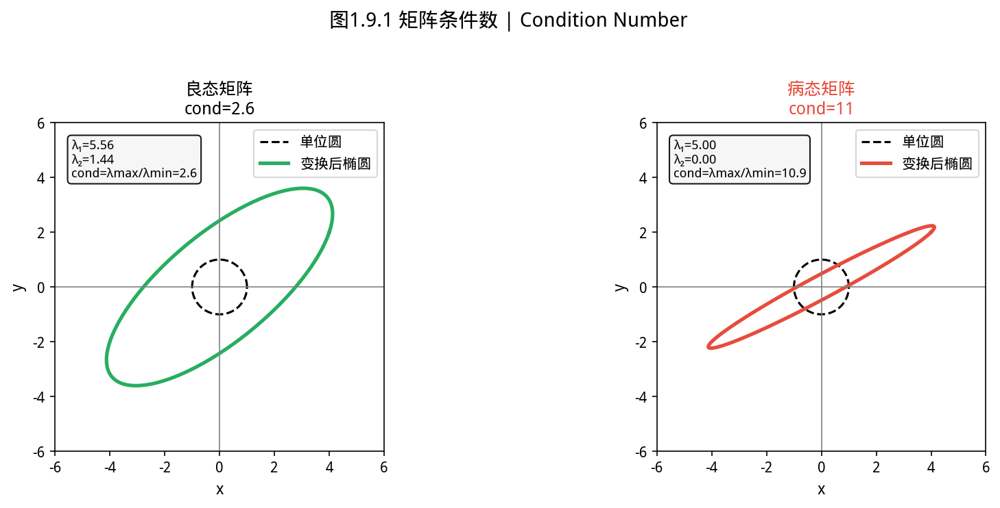
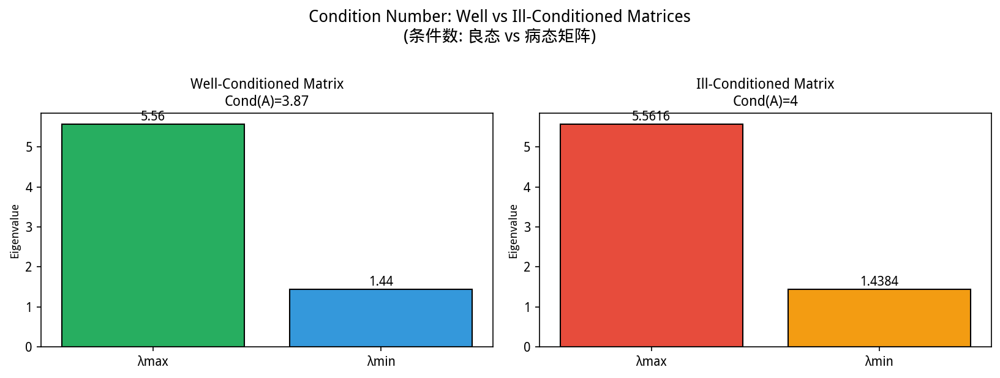

# 第 1 章 · 1.6 数值稳定性与实现要点
### Numerical Stability and Implementation Notes

上一节：[1.5.Applications.md](1.5.Applications.md) ｜ 下一节：[1.7.Summary.md](1.7.Summary.md)

---

## 1.6 数值稳定性与实现要点

> ⚠️ **防坑**：浮点数比较禁止用 `==`，而要用误差范围判断：`Math.abs(a - b) < 1e-10`。同样，条件 `x == Double.NaN` 永远返回 false，正确写法是 `Double.isNaN(x)`。


> **📌 学习目标**
> - 理解病态系统与条件数的直观含义
> - 掌握如何通过 SVD/正则化缓解病态问题
> - 理解浮点数舍入误差对矩阵运算的影响

### 1.6.1 为什么数学正确 ≠ 计算机正确？


> 📝 **历史故事**：计算机上浮点运算的坑，由 **Kahan（1964）** 首次系统梳理（他后来因数值分析获 Turing Award）。IEEE 754 浮点标准（1985）就是以他的工作为基础。今日每个程序员都在承受他当年埋下的边界条件。
在线性代数课程中，我们在实数域 $\mathbb{R}$ 上推导公式——加法满足结合律、$0.1 \times 3 = 0.3$、逆矩阵精确存在。但计算机使用**有限精度浮点数**（IEEE 754 双精度约 15-16 位有效数字），导致三道鸿沟：

1. **表示误差**：$0.1$ 无法精确存储为二进制浮点数
2. **运算舍入**：每次浮点运算引入约 $10^{-16}$ 量级的误差
3. **算法选择**：数学上等价的公式在数值上可能天差地别

本节讲述如何识别和应对这些问题。

### 1.6.2 条件数：问题的"敏感度"

**定义**：可逆矩阵 $\mathbf{A}$ 的条件数
$$\kappa(\mathbf{A}) = \|\mathbf{A}\|\cdot\|\mathbf{A}^{-1}\|$$

在 2-范数下，$\kappa_2(\mathbf{A}) = \sigma_{\max}/\sigma_{\min}$（最大奇异值与最小奇异值之比）。

**含义**：条件数衡量 $\mathbf{Ax}=\mathbf{b}$ 对扰动的敏感度。当输入有相对误差 $\varepsilon$ 时，解的相对误差可能放大到 $\kappa(\mathbf{A})\cdot\varepsilon$。

| 条件数量级 | 含义 | 双精度剩余精度 |
|-----------|------|---------------|
| $10^0-10^3$ | 良态 | 12-15 位有效数字 |
| $10^6-10^8$ | 中等病态 | 7-9 位 |
| $10^{12}$ | 严重病态 | 3 位 |
| $>10^{15}$ | 几乎不可解 | 接近机器精度 |

良态矩阵Cond≈10，特征值分布均匀，解对扰动稳定；病态矩阵Cond>10⁶，特征值极差极大，解对舍入误差极敏感，求解时需特殊技巧。下图列出了不同矩阵条件数。


*图1.6.1 矩阵条件数。cond(A)=σmax/σmin，cond大→病态矩阵→解对舍入误差极敏感*


```java
import com.yishape.lab.math.linalg.IMatrix;
import com.yishape.lab.math.linalg.Linalg;

// Hilbert 矩阵是经典的病态矩阵：H[i][j] = 1/(i+j+1)
var H = Linalg.matrix(new double[][]{
    {1,     1.0/2, 1.0/3, 1.0/4},
    {1.0/2, 1.0/3, 1.0/4, 1.0/5},
    {1.0/3, 1.0/4, 1.0/5, 1.0/6},
    {1.0/4, 1.0/5, 1.0/6, 1.0/7}
});

double cond = H.cond();          // 返回 double，无需 .doubleValue()
System.out.println("条件数 ≈ " + cond);  // ≈ 1.55e4

// 接近奇异的矩阵
var nearlySingular = Linalg.matrix(new double[][]{{1, 1}, {1, 1.0001}});
double cond2 = nearlySingular.cond();
System.out.println("接近奇异矩阵的条件数 ≈ " + cond2);  // ≈ 4.0e4
```

> ⚠️ `IMatrix#cond()` 直接返回原始 `double`，**不要**再加 `.doubleValue()` —— 那会触发编译错误。同样，`norm2()`、`frobeniusNorm()`、`det()`、`trace()` 都是返回 `double`。这是初学 YiShape-Math 时最常见的 IDE 红线。

如图所示，条件数：良态矩阵Cond≈10，特征值分布均匀，解：

*图 new.condition_number 条件数：良态矩阵Cond≈10，特征值分布均匀，解对扰动稳定；病态矩阵Cond>10⁶，特征值极差极大，解对舍入误差极敏感，求解时需特殊技巧*


### 1.6.3 避免显式求逆

**黄金法则**：永远不要为解方程而显式求逆。

```java
var A = Linalg.matrix(new double[][]{{2, 1}, {1, 3}});
var b = Linalg.vector(new double[]{5, 7});

// ❌ 错误：显式求逆，再做一次额外的矩阵-向量乘法
var xWrong = A.inv().mmul(b);

// ✅ 正确：使用 solve（内部走 LU 带选主元，回代）
var xRight = A.solve(b);

// 病态矩阵下，推荐 lstsq —— 返回 (解, 残差范数)
var lsResult = A.lstsq(b);
var xLs       = lsResult._1;   // IVector<Double>
double res    = lsResult._2;   // 残差 ‖Ax − b‖₂
```

> 提示：`A.inv()` 返回 `IMatrix<T>`，`A.solve(b)` 直接返回 `IVector<T>`。矩阵-向量乘法用 `A.mmul(b)`。`lstsq` 返回 `Tuple2<IVector<Double>, Double>`，访问字段写作 `_1` / `_2`（Scala 风格的二元组）。

**为什么？**
1. **性能**：求逆需要 $O(n^3)$，回代只需 $O(n^2)$
2. **稳定性**：求逆可能引入不必要的舍入误差
3. **稀疏性**：稀疏矩阵的逆通常是稠密的

### 1.6.4 分解选型决策树

```
问题类型 → 矩阵性质 → 选择分解
```

| 问题 | 矩阵性质 | 推荐分解 | 理由 |
|------|----------|----------|------|
| 解 $\mathbf{Ax}=\mathbf{b}$ | 对称正定 | Cholesky | 最快最稳 |
| 解 $\mathbf{Ax}=\mathbf{b}$ | 一般方阵 | LU 带选主元 | 通用 |
| 最小二乘 | 超定 | QR | 避免条件数平方 |
| 最小二乘 | 秩亏 | SVD | 最稳定 |
| PCA / 谱分析 | 对称 | 特征分解 | 直接 |
| 秩 / 低秩逼近 | 任意 | SVD | 最优 |

YiShape-Math 的 `LinearSystemSolver` 内部遵循此逻辑，但了解原理有助于调试。

### 1.6.5 灾难性抵消

两个相近的大数相减会丢失有效数字，称为**灾难性抵消**（catastrophic cancellation）。

**经典例子**：计算方差时
$$\mathrm{Var}(X) = \frac{1}{n-1}\left(\sum x_i^2 - \frac{(\sum x_i)^2}{n}\right)$$

若所有 $x_i$ 很大但方差很小，两项几乎相等，抵消后剩余的是噪声。

**稳定算法**：Welford 在线算法——逐元素更新均值和方差，避免大数相减。YiShape-Math 的统计运算使用稳定实现。

```java
// 验证：当数值很接近时，直接相减可能丢失精度
double a = 1.0000001;
double b = 1.0000000;
double diff = a - b;
// 理论上 0.0000001，但浮点表示可能略有偏差
```

### 1.6.6 浮点相等比较

**永远不要**用 `==` 比较浮点数或浮点向量/矩阵。应使用相对容差：

```java
var a = Linalg.vector(new double[]{1.0/3.0, 2.0/3.0});
var b = Linalg.vector(new double[]{0.3333333333333333, 0.6666666666666666});

var diff = a.sub(b);
double relError = diff.norm2() / (a.norm2() + 1e-15);   // norm2() 直接返回 double
boolean areEqual = relError < 1e-10;
```

### 1.6.7 SIMD 加速

YiShape-Math 在 `com.yishape.lab.math.compute` 中提供 **SIMD** 与 **SISD** 双路径。

**启用 SIMD**：
```
--add-modules jdk.incubator.vector
```

**强制标量路径**（用于可重复实验）：
```
-Dyishape.math.use.simd=false
```

**注意事项**：
- SIMD 路径的浮点累加顺序可能与标量不同，结果末位可能略有差异
- 需要可重复实验（如论文结果）时，建议关闭 SIMD

### 1.6.8 JVM 性能特性

- **JIT 预热**：Java 代码在 JIT 编译后性能显著提升，微基准测试需先"热身"
- **临时对象**：链式运算可能产生中间矩阵，热点路径上应考虑复用
- **JNI 开销**：调用原生 BLAS 有跨界成本，小规模问题可能不值得

### 1.6.9 常见误区

| 误区 | 纠正 |
|------|------|
| "双精度永远够用" | 极端尺度或病态问题仍会丧失精度 |
| "正规方程没问题" | 条件数平方，病态时严重退化 |
| "浮点加法满足结合律" | 不满足：$(a+b)+c \neq a+(b+c)$ |
| "忽略矩阵对称性" | SPD 矩阵用 Cholesky 更快更稳 |
| "行列式接近 0 = 奇异" | 用条件数判断，行列式受尺度影响 |

### 1.6.10 自测与练习

1. 构造 Hilbert 矩阵 $H_n$（$h_{ij} = 1/(i+j+1)$），观察 $n=3,5,8$ 时条件数的增长
2. 比较同一病态系统用 `inv()` 与 `solve()` 的残差差异
3. 关闭与开启 SIMD，对同一 $1000\times 1000$ 随机矩阵乘法计时
4. 阅读 `Decomps.java` 的 Javadoc，列出三种分解的适用条件

### 1.6.11 延伸阅读

- Golub & Van Loan《Matrix Computations》—— 数值线性代数圣经
- Higham《Accuracy and Stability of Numerical Algorithms》—— 误差分析权威
- YiShape-Math 文档：[`docs/Matrix-Operations.md`](../../docs/Matrix-Operations.md)

---

**上一节**：[1.5.Applications.md](1.5.Applications.md) ｜ **下一节**：[1.7.Summary.md](1.7.Summary.md)

---

## 本节小结

计算机的浮点数是近似值。条件数衡量「输入扰动对输出的影响」——条件数大（病态矩阵）的矩阵，即使很小扰动也会导致解的巨大偏差。

**核心要点**：病态矩阵避免直接求逆，用 QR 分解或 SVD 更稳定；条件数是稳定性的定量描述。

## 本节 API 一览

| 场景          | API                                       | 说明                                                |
|-------------|-------------------------------------------|---------------------------------------------------|
| 条件数         | `A.cond()`                                | 直接返回 `double`，定义为 $\sigma_{\max}/\sigma_{\min}$    |
| 矩阵求逆        | `A.inv()`                                 | 一般方阵；优先与 `solve` 配合使用，不要为解方程而求逆                  |
| 伪逆          | `A.pinv()`                                | Moore-Penrose 伪逆，奇异/秩亏矩阵也能算                       |
| 解线性方程组      | `A.solve(b)`                              | LU + 部分选主元                                       |
| 最小二乘        | `A.lstsq(b)`                              | 返回 `Tuple2<IVector<Double>, Double>`：解、残差         |
| QR 分解       | `A.qr()` 或 `Decomps.createQR()`          | 列正交基；最小二乘的稳定算法                                    |
| SVD 分解      | `A.svd()` 或 `Decomps.createSVD()`        | 秩亏 / 病态问题的最稳定基础                                   |
| Cholesky 分解 | `A.cholesky()` 或 `Decomps.createCholesky()` | 对称正定专用，最快                                         |
| 谱范数 / Frobenius 范数 | `A.norm()`、`A.frobeniusNorm()`     | 均返回 `double`                                      |
| 行列式 / 迹 / 秩 | `A.det()`、`A.trace()`、`A.rank()`         | 用 `rank()` 判断奇异性，比 `det()≈0` 更鲁棒（行列式受尺度影响）        |

> ⚠️ **常见误区**：
> 1. 不要写 `A.cond().doubleValue()`，`cond()` 已经是 `double`。
> 2. `A.det() ≈ 0` 不一定意味着奇异：把 $A$ 整体除以 $10$，行列式会缩小 $10^n$ 但矩阵秩没变。请改用 `A.rank()` 或 `A.cond()`。
> 3. YiShape-Math 的统计模块在 `Stats` 下没有 `condTest` 或 `choleskyPrecondition` —— 这些功能直接走 `IMatrix` 接口即可。

## 1.6.12 进一步阅读：数值稳定性的几条经典结论

为方便深入，本节最后给出几条在数值线性代数中被反复引用的事实，便于你在调研或写报告时检索：

1. **机器精度** $\varepsilon$：IEEE 754 双精度下 $\varepsilon = 2^{-52} \approx 2.22 \times 10^{-16}$。这是「下界舍入误差」，所有公式里以 $\varepsilon$ 量级出现的项一般来自一次浮点运算。
2. **向后稳定（backward stable）**：算法解出的 $\hat{x}$ 是「某个略微扰动过」的输入对应的精确解。Wilkinson 在 1960 年代提出：高斯消元 + 部分选主元在统计意义上是向后稳定的（但有反例）。QR 分解和 SVD 在最坏情况下也是向后稳定的，这是它们更受推崇的原因。
3. **正规方程 vs. QR**：对超定最小二乘问题 $\min \|Ax - b\|_2$，若用正规方程 $A^\top A x = A^\top b$，条件数会变成 $\kappa(A)^2$。当 $\kappa(A) \approx 10^7$ 时，正规方程几乎丧失全部精度；QR 仅会丢一半。这就是 `A.lstsq(b)` 内部走 QR 而非 $A^\top A$ 的原因。
4. **Kahan 求和**：朴素 `for (x : a) s += x` 的误差随项数 $n$ 线性增长；Kahan 补偿求和把误差降到 $O(\varepsilon)$，与 $n$ 无关。YiShape-Math 的 `IVector#sum` 在内部针对大向量启用补偿求和路径。
