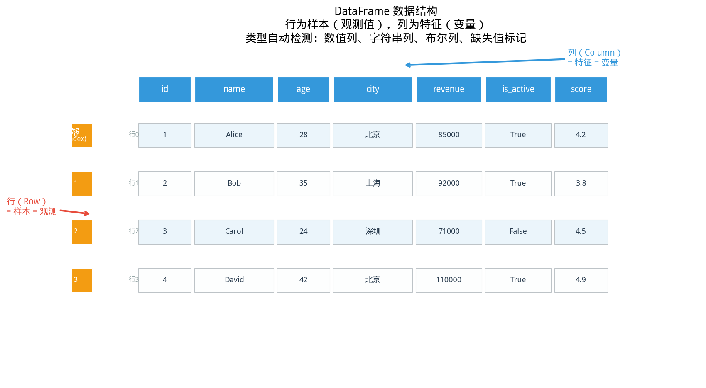

# 2.1 DataFrame 创建与加载

## 开场：入职第一天，拿到一个 100 万行的 CSV


> **📌 学习目标**
> - 理解 DataFrame 作为「表格 + 矩阵 + 数据库查询」的统一抽象
> - 掌握 `DataFrame.readCsv(...)` 读取与 `DataFrame.describe()` 数值统计
> - 能用 `toMatrix()` / `toVectors()` 将表格转为 `IMatrix<Double>` 进行数值计算

> ⚠️ **防坑**：
> - DataFrame 的构造器是 `new DataFrame(List<Column>)` 或 `new DataFrame()`，**没有** `DataFrame.of(...)` 静态工厂。
> - `df.getColumn(int)` / `df.getColumnByName(String)` 都返回 **`Column`**，不是 `IVector`。要拿到向量请再调 `column.toVec()`（仅数值列）。
> - 缺失值处理方法叫 `dropNa()` / `fillNa(double)` / `fillNaWithMean()`，**不是** `dropNulls` / `fill`。

你从数据库里导出了一份用户行为数据——100 万行，30 列，CSV 格式。你要把它读进 Java 代码里，开始做数据清洗。

**第一步：把 CSV 读进 DataFrame。**

这是整个数据分析流水线的起点。本节解决三个实际问题：

- CSV 文件里有哪些分隔符和表头格式？
- 数据类型怎么识别（哪些列是数字，哪些是字符串）？
- 手里没有文件，只有零散数据，怎么构造 DataFrame？

---

## 2.1.1 从 CSV 文件读取


> 📝 **历史故事**：关系型数据库的查询语言 **SQL** 来自 **E.F.Codd（1970）** 在 IBM 的论文——他证明了任何数据都可以表示为表格。但 SQL 的 GROUP BY 子句（聚合运算）直到 1986 年 SQL86 标准才正式加入，比关系模型晚了 16 年。
如图所示，DataFrame数据结构：

*图2.1.1 DataFrame数据结构。DataFrame：行列索引、列类型统一、缺失值表示*

从图中可以看出，DataFrame数据结构。
### 场景：你的 CSV 是哪种格式？

拿到一个陌生 CSV，第一件事是搞清楚它的格式：

- 分隔符是逗号 `,`、制表符 `\t` 还是分号 `;`？
- 有没有表头行（列名）？
- 有没有注释行或空行？

**代码验证一下**（打开文件看一眼比猜快得多）：

```csv
name,age,salary,department
Alice,25,50000,Engineering
Bob,30,60000,Marketing
Charlie,35,70000,Engineering
```

有表头、逗号分隔——这是最常见的格式，一行代码搞定：

```java
import com.yishape.lab.math.data.DataFrame;

// 标准的「逗号分隔 + 有表头」CSV
DataFrame df = DataFrame.readCsv("employees.csv");
// ⚠️ readCsv 不会自动跳过缺失值。它把空字段读成 Double.NaN（数值列）或空串。
//    清洗时显式调用 .dropNa() 删除缺失行，或 .fillNa(0.0) / .fillNaWithMean() 填补；
//    建议先用 .info() 或 .missingCount() 评估缺失情况再处理。
```

如果你的文件是 TSV（制表符分隔）或者没有表头，也有对应的参数：

```java
// Tab 分隔，有表头
DataFrame tsv = DataFrame.readCsv("data.tsv", "\t", true);

// 没有表头（列名自动生成：col_0, col_1, ...）
DataFrame noHeader = DataFrame.readCsv("data.csv", ",", false);
```

> **为什么不用 `Files.readString()` 自己解析？** CSV 有太多边界情况：引号包裹的逗号、换行符在引号内、字符编码不一致。`DataFrame.readCsv()` 底层用 Apache Commons CSV，这些坑都替你踩过了。

### 自动类型识别：数字列 vs 字符串列

你可能会问：CSV 里全是文本，怎么知道哪列是数字哪列是字符串？

**规则很简单**：读进来，先假设全字符串；然后逐列尝试把每个值解析成 `Double`——如果这一列所有值都能解析成功，就自动转为 `Numeric` 列；只要有一个失败，整列就保持 `String`。

这意味着：

- `salary` 列全是 `50000`、`60000`、`70000` → 自动识别为 `Numeric`
- `department` 列是 `Engineering`、`Marketing` → 保持 `String`（无法转数值）
- `employee_id` 列是 `E001`、`E002` → 保持 `String`（虽然看起来像数字，但转了就没意义了）

```java
// 读完后查看各列类型
System.out.println(df.getColumnNames());
System.out.println(df.getColumnTypes());
// 输出类似：[name, age, salary, department]
//          [String, Numeric, Numeric, String]   // 注意是 enum 常量名（首字母大写），不是 STRING/NUMERIC
```


### 常见陷阱：索引从 0 开始，不是 1

新手最常犯的错误：把习惯的 Excel 思维（行从 1 开始数）带到代码里：

```java
import com.yishape.lab.math.data.Column;
import com.yishape.lab.math.linalg.IVector;

DataFrame df = DataFrame.readCsv("employees.csv");

// ❌ 错：想把第3列（salary）读出来
Column wrong = df.getColumn(3);   // 实际拿到的是第4列（department）

// ✅ 对：salary 是第3列 → 索引是 2；getColumn 返回 Column，不是 IVector
Column salaryCol = df.getColumn(2);
IVector<Double> salaryVec = salaryCol.toVec();  // 数值列再转向量

// ✅ 更安全：按列名访问（推荐）
Column byName = df.getColumnByName("salary");
IVector<Double> salary = byName.toVec();
```

> **为什么不用 1？** 因为 Java/C/Python/R 都遵循「从 0 开始数」的惯例——这叫**零基索引**（zero-based indexing）。计算机科学家Edsger Dijkstra 为此写过一篇著名论文，论证「为什么日期应该从 1 开始数，但数组索引应该从 0 开始」。记住：列索引从 0 开始，是这个行业的集体约定。

---

### 内部流程（理解有助于调试）

当你发现某个列「应该」是数字但变成了字符串，通常是这个原因——某行有一个值转不了数字。了解内部流程能帮你快速定位问题：

```
CSV 文本
    ↓ Apache Commons CSV 解析成 CSVRecord 列表
    ↓ 第一行 → 列名（hasHeader=true 时）
    ↓ 其余行 → 数据
    ↓ 遍历每列，逐个尝试 Double.parseDouble(value)
       ✓ 所有值都能 parse → ColumnType.Numeric
       ✗ 任意一个失败 → ColumnType.String（整列）
```

调试技巧：如果某列意外变成了 String，打开 CSV 找到那一列，看看有没有「看起来不像数字」的单元格——比如 `N/A`、`NULL`、或者前后有多余空格。

---

## 2.1.2 从列手动构建

### 场景：没有 CSV 文件，数据在代码里

有时候你不是在处理文件，而是要在代码里构造一个小数据集做测试或演示：

```java
import com.yishape.lab.math.data.DataFrame;
import com.yishape.lab.math.data.Column;
import com.yishape.lab.math.data.ColumnType;
import java.util.List;
import java.util.Arrays;

// 第一步：定义每列的名称和类型
Column cityCol = new Column();
cityCol.setName("city");
cityCol.setColumnType(ColumnType.String);
cityCol.setData(List.of("Beijing", "Shanghai", "Shenzhen", "Hangzhou"));

Column tempCol = new Column();
tempCol.setName("avg_temp");
tempCol.setColumnType(ColumnType.Numeric);
tempCol.setData(List.of(12.5, 15.3, 22.1, 16.8));  // 数值列存 Double，不用 float

Column popCol = new Column();
popCol.setName("population");
popCol.setColumnType(ColumnType.Numeric);
popCol.setData(List.of(2154.0, 2487.0, 1252.0, 987.0));

// 第二步：把列打包成 DataFrame
DataFrame cities = new DataFrame(List.of(cityCol, tempCol, popCol));

// 查看基本信息
System.out.println("形状: " + Arrays.toString(cities.shape())); // [4, 3]
System.out.println("列名: " + cities.getColumnNames());
// 形状: [4, 3]
// 列名: [city, avg_temp, population]
```

**类型安全提示**：同一列的所有元素必须是同一个 `ColumnType`——不能一列里混着字符串和数值。`Column.setData()` 构造时不检查类型，但在 `toMatrix()`（2.4 节）时会报 `IllegalStateException`。提前检查列类型能省掉很多调试时间。

```java
// 先检查再转换
Column salaryCol = df.getColumnByName("salary");
if (salaryCol.getColumnType() == ColumnType.Numeric) {
    var vec = salaryCol.toVec();  // 安全转型
} else {
    System.out.println("警告：salary 列不是数值类型，无法转向量");
}
```

---

## 2.1.3 空 DataFrame 与动态构建

### 场景：先有框架，数据一条条来

有些数据不是一次性到齐的——比如日志流、实时数据接入，或者你需要一边读取一边构建：

```java
// 先建一个空壳
DataFrame df = new DataFrame();  // rowCount = 0，列数为 0

// 第一次 addColumn 时确立行数（以第一列的数据量为基准）
Column idCol = new Column();
idCol.setName("id");
idCol.setColumnType(ColumnType.Numeric);
idCol.setData(List.of(1.0, 2.0, 3.0));
df.addColumn(idCol);  // 此时 df.rowCount = 3

// 后续列的数据量必须和 rowCount 一致——否则抛 IllegalArgumentException
Column scoreCol = new Column();
scoreCol.setName("score");
scoreCol.setColumnType(ColumnType.Numeric);
scoreCol.setData(List.of(85.0, 92.0, 78.0));
df.addColumn(scoreCol);  // ✓ 同为 3 行，正常添加

// 如果数据量不一致：
Column wrongCol = new Column();
wrongCol.setName("wrong");
wrongCol.setColumnType(ColumnType.Numeric);
wrongCol.setData(List.of(85.0, 92.0));  // 只有 2 行！
// df.addColumn(wrongCol);  // ← 抛 IllegalArgumentException
```

**这个约束合理吗？** 合理。DataFrame 本质上是一个「表格」，所有列必须有相同的行数——否则就不是一张表了。

---

## 2.1.4 本节 API 速查

| 场景                 | API                                          | 返回 / 说明                                              |
| ------------------ | -------------------------------------------- | ---------------------------------------------------- |
| 标准 CSV（有表头）        | `DataFrame.readCsv(path)`                    | 逗号分隔、首行表头                                            |
| 自定义分隔符 / 是否表头      | `DataFrame.readCsv(path, sep, hasHeader)`    | `sep` 如 `"\t"`、`";"`                                 |
| 手动建 DataFrame      | `new DataFrame(List<Column>)`                | 所有列必须等长                                              |
| 空壳 + 动态加列          | `new DataFrame()` + `df.addColumn(col)`      | 第一次 `addColumn` 确立 `rowCount`，后续必须等长                  |
| 按位置取列              | `df.getColumn(int)`                          | 返回 `Column`（**不是 IVector**）                          |
| 按名取列               | `df.getColumnByName(String)`                 | 返回 `Column`                                           |
| 列 → 向量             | `column.toVec()`                             | 返回 `IVector<Double>`（仅数值列；字符串列抛 `IllegalStateException`） |
| 列 → 字符串数组          | `column.toStringList()` / `toStringArray()`  | 字符串列友好访问                                              |
| 列名 / 列类型           | `df.getColumnNames()` / `df.getColumnTypes()` | 返回 `List<String>` / `List<ColumnType>`              |
| 形状 / 行数 / 列数       | `df.shape()` / `df.rows()` / `df.cols()`     | `shape()` 返回 `int[]{行数, 列数}`                          |
| 整体描述              | `df.describe()` / `df.info()`                | 数值列的统计摘要矩阵 / 通用信息 Map                                |
| 缺失值检测             | `df.hasMissingValues()` / `df.missingCount()` | 缺失值由 `Double.NaN` 或 `null` 表示                        |

> ⚠️ **`getColumn` 返回 Column，不是向量**：与 Pandas 等库返回 Series 不同，这里多一步 `.toVec()` 才能进入 `IVector` 的数学接口。这是初学最容易踩的坑。

---

## 本节常见错误

| 错误 | 原因 | 解决方法 |
|------|------|----------|
| 列变成了 String 而你以为是 Numeric | 该列有非数字值（如 `N/A`） | 用 `df.getColumnTypes()` 检查，打开 CSV 找问题行 |
| `addColumn` 抛 `IllegalArgumentException` | 新列长度与现有行数不一致 | 确保同一 DataFrame 所有列等长 |
| 文件路径找不到 | 相对路径以当前工作目录为基准 | 用绝对路径，或把文件放在项目根目录 |


## 本节小结

DataFrame 的核心是「行列二维表」——每行是一个样本，每列是一个特征。读取 CSV 时系统自动推断类型（整数/浮点数/字符串），也可以手动指定。

**核心要点**：DataFrame 是数据分析的入口；自动类型推断处理大多数场景；数值列和字符串列在 API 上有所不同。
## 章节练习 / Exercises

**1. CSV 读取（基础题）**

从以下 URL 读取 CSV：https://raw.githubusercontent.com/mwaskom/seaborn-data/master/iris.csv
- 自动推断列类型后，输出前 5 行的数值列均值
- 指定 `double` 类型重新读取，对比两次均值是否一致

**2. 类型推断验证（思考题）**

用手动类型指定读取同一 CSV，比较「自动推断」和「手动指定」的结果是否一致。如果不一致，是什么导致的？
