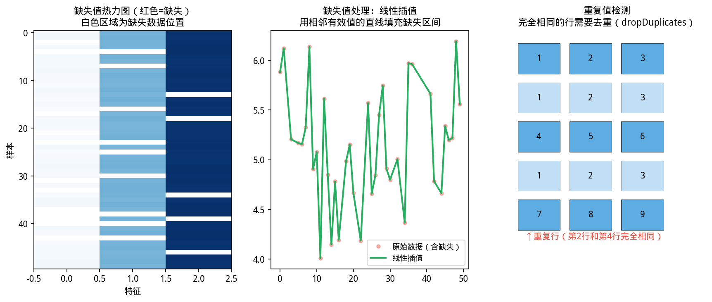

# 2.2 数据访问——认识你的 DataFrame

## 开场：CSV 读进来了，第一件事是什么？


> **📌 学习目标**
> - 掌握按标签（`.col()`）和位置（`.rowAt()`）选取数据
> - 能用布尔索引实现条件筛选
> - 理解「视图 vs 副本」的内存语义

打开一个陌生数据集，你不会直接开始建模。通常先回答三个问题：

1. **有多大？**（多少行、多少列）
2. **每列叫什么名字、是什么类型？**
3. **具体数值是什么样的？**

这三个问题分别对应本节的三个操作：属性查询、按名/按位置访问列、读取列数据。

---


### 历史视角：NaN 的发明，和一个「没有空值」的世界

你知道为什么很多编程语言用 `NaN`（Not a Number）表示缺失值吗？

在 IEEE 754 浮点数标准出现之前（1985 年），每种语言的「缺失值」表示都不一样：Fortran 用 `99999`，SAS 用 `.`，有些系统直接用 `0`。数据在系统间迁移，缺失值秒变「诡异数值」。

IEEE 754 统一了这一切：定义了 `NaN`、`Inf`、`-Inf`，让所有语言有了共同的「这不是一个数」的表示。

pandas 和 YiShape-Math 的 `NaN` 概念，就源于这个标准。

---

## 2.2.1 先认识你的 DataFrame：属性查询


> 📝 **历史故事**：数据框（DataFrame）的概念来自 **R 语言（2003）**，但让它统治数据分析的是 **Wes McKinney（2007）** 创立的 **pandas**。他当时在 AQR Capital Management 工作，觉得现有工具太慢，于是一个人写出了 pandas——后来成为 Python 成为数据科学第一语言的核心原因。

如图所示，缺失值与异常值处理：

*图2.2.1 缺失值与异常值处理。缺失值：删除/填充/插值；异常值：IQR/Z-score检测*

读进来第一件事，先摸清数据的基本情况：

```java
DataFrame df = DataFrame.readCsv("employees.csv");

// 形状：[行数, 列数]
var shape = df.shape();
System.out.println("行数: " + shape[0] + ", 列数: " + shape[1]);
// 等价于：
System.out.println("行数: " + df.getRowCount() + ", 列数: " + df.getColumnCount());

// 检查数据是否为空
if (df.isEmpty()) {
    System.out.println("警告：DataFrame 为空，请检查文件路径");
}

// 所有列名
List<String> colNames = df.getColumnNames();
System.out.println("列名: " + colNames);

// 每列的类型
List<ColumnType> colTypes = df.getColumnTypes();
for (int i = 0; i < colNames.size(); i++) {
    System.out.printf("  [%d] %-20s %s%n", i, colNames.get(i), colTypes.get(i));
}
```

**输出示例**（帮助你对数据有直观印象）：

```
行数: 1000, 列数: 10
列名: [name, age, salary, department, ...]
  [0] name           STRING
  [1] age            NUMERIC
  [2] salary         NUMERIC
  [3] department      STRING
  ...
```

这一步骤看似简单，但很多人拿到数据直接跑模型，跑半天报错才知道某列是字符串而不是数字——其实只要 `df.getColumnTypes()` 打一行就知道了。

---

## 2.2.2 按位置 vs 按名称——两种取列方式

DataFrame 支持两种取列方式，用哪个取决于你「知道位置」还是「知道名字」：

```java
// 方式1：按位置（整数，从 0 开始）
Column firstCol = df.get(0);           // 快捷写法
Column firstCol2 = df.getColumn(0);    // 更显式

// 方式2：按名称（知道列名叫什么）
Column nameCol = df.getColumnByName("name");

// 方式3：负数索引（从右往左数）
Column lastCol = df.get(-1);            // 最后一列
Column secondLast = df.get(-2);         // 倒数第二列
```

**什么时候用哪个？**

- 写探索性代码（随便看看数据）→ 按位置最方便
- 写数据处理流水线（需要明确哪列是什么）→ 按名称最安全（列顺序可能变）
- 从后往前取 → 负数索引

> **负数索引的直觉**：把 DataFrame 想象成一个圆圈，-1 是最后一个，-2 是倒数第二个，和 Python list 的负索引逻辑一样。

---

## 2.2.3 取到列之后：读出具体数值

拿到一列之后，怎么把里面的数据拿出来用？

```java
Column ageCol = df.getColumnByName("age");

// 方式1：getData() → 原始 List<Object>
List<Object> raw = ageCol.getData();

// 方式2：toVec() → IVector（数值列专用）
var ageVec = ageCol.toVec();
System.out.printf("平均年龄: %.1f 岁%n", ageVec.mean());

// 方式3：toStringList() → 字符串列表（任意列）
List<String> ageStrings = ageCol.toStringList();
// 注意：数值转字符串，"25" 而不是 25
```

**类型安全提醒**：如果你在 `Numeric` 列上调用 `toVec()` 但没有先检查类型，会抛出 `IllegalStateException`。养成习惯，先看一眼列类型：

```java
Column col = df.getColumnByName("age");
if (col.getColumnType() == ColumnType.Numeric) {
    var vec = col.toVec();  // 安全
    // ... 做统计计算
} else {
    System.out.println("该列不是数值类型，无法计算统计量");
}
```

---

## 2.2.4 快速统计摘要：IVector 方法

DataFrame 本身不做统计运算——把列转成 `IVector` 之后，用第 1 章和第 4 章的方法做统计：

```java
DataFrame df = DataFrame.readCsv("employees.csv");

// 遍历所有数值列，快速打印统计摘要
for (String colName : new String[]{"age", "salary", "years_employed"}) {
    Column col = df.getColumnByName(colName);
    if (col.getColumnType() != ColumnType.Numeric) continue;

    var vec = col.toVec();
    System.out.printf("%-15s 均值=%6.1f  标准差=%6.1f  最小=%6.1f  最大=%6.1f%n",
        colName, vec.mean(), vec.std(), vec.min(), vec.max());
}
```

**输出示例**：

```
age             均值=  34.5  标准差=   8.2  最小=  22.0  最大=  62.0
salary          均值=60000.0  标准差=25000.0  最小=30000.0  最大=150000.0
years_employed  均值=   5.3  标准差=   3.1  最小=   1.0  最大=  15.0
```

这一行代码，就是探索性数据分析（EDA）里最常用的「快速看分布」操作。

---

## 2.2.5 负数索引语义速查

| 表达式 | 含义 | 等价于 |
|--------|------|--------|
| `df.get(-1)` | 最后一列 | `df.get(df.getColumnCount() - 1)` |
| `df.get(-2)` | 倒数第二列 | `df.get(df.getColumnCount() - 2)` |
| `df.sliceColumn(-2)` | 倒数两列 | 从 `size-2` 到末尾 |
| `df.sliceColumn(-3, -1)` | 倒数第三列到倒数第一列之前 | `[size-3, size-2]` |

---

> ⚠️ **常见误区**：`df.iloc[-1]` 在空 DataFrame 上会报错，而不是返回空行。访问数据前先判断 `df.isEmpty()` 或 `df.rowCount() > 0`。

## 2.2.6 本节 API 速查

| 场景 | API | 示例 |
|------|-----|------|
| 查看形状 | `df.shape()` | 返回 `[行数, 列数]` |
| 查看列名 | `df.getColumnNames()` | 返回 `List<String>` |
| 查看列类型 | `df.getColumnTypes()` | 返回 `List<ColumnType>` |
| 按位置取列 | `df.get(int)` / `df.getColumn(int)` | 0-indexed |
| 按名称取列 | `df.getColumnByName(name)` | 最推荐 |
| 负数索引 | `df.get(-k)` | 从右数，第 k 列 |
| 列转 IVector | `col.toVec()` | 仅 Numeric 列 |
| 列转字符串列表 | `col.toStringList()` | 任意类型 |
| IVector 统计 | `vec.mean()`, `vec.std()`, `vec.min()`, `vec.max()` | 见第 1/4 章 |


## 本节小结

按位置取列（iloc）适合已知列序号时；按名称取列（loc）适合列顺序可能变化的场景。取出的列可以用 `toDoubleArray()`、`toStringArray()` 等方法还原为 Java 数组。

**核心要点**：iloc 用数字下标，loc 用列名字符串；负数索引从末尾计数（-1 = 最后一列）。
## 章节练习 / Exercises

**1. 数据访问综合（应用题）**

读取 iris.csv，按名称取 setosa 品种的花瓣长度列，输出均值、标准差和最大值。

**2. 负数索引练习（概念题）**

用负数索引取最后一列、倒数第二列，验证负数索引的行为是否符合预期。
