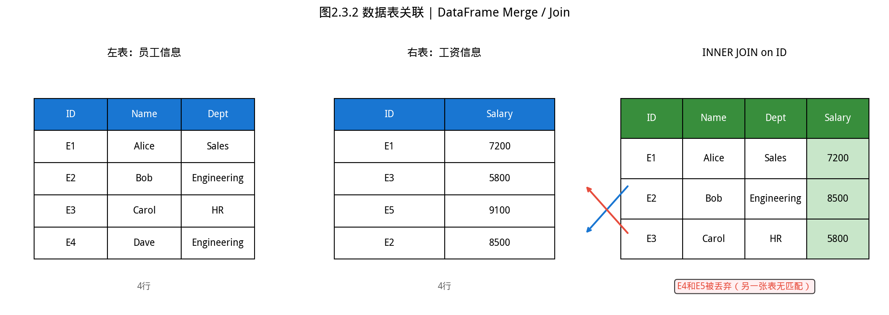
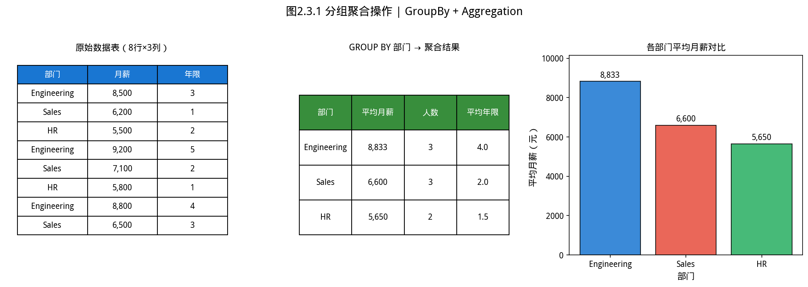

# 2.3 数据切片——只取你需要的那部分


## 历史故事：GROUP BY 来自 E.F. Codd 的关系数据库革命


> **📌 学习目标**
> - 掌握列切片 `sliceColumn(start, stop[, step])` 与通用切片 `slice(rowExp, colExp)`
> - 理解切片表达式 `"start:stop:step"` 的左闭右开语义与负数索引
> - 能用切片实现训练/测试集划分等常见数据预处理任务

## 开场：老板说「我只要看前 1000 行」

你辛辛苦苦读了一个 100 万行的 CSV，模型跑起来慢得要死。老板说：「先拿前 1000 行做个快速原型，看看效果再说。」

**你怎么办？**

从头重建一个小 CSV？太麻烦。
用数据库 LIMIT？数据还没入库。

正确姿势：**用切片，把前 1000 行切出来。**

数据切片是做数据分析最频繁的操作之一。本节覆盖三种场景：

1. **只要几列**（切列）：剔除无关字段，专注建模需要的特征
2. **只要部分行**（切行）：快速原型、数据采样、时间窗口
3. **行列同时切**：把整个 DataFrame 切成一个子集

---

1970 年，IBM 研究员 **E.F. Codd** 发表了划时代论文《用于大规模共享数据的关系数据模型》，奠定了 SQL 的理论基础。

他的核心洞察：**数据存在表里，表之间通过键（key）关联——不需要预先知道所有查询。**

`GROUP BY` 正是这一思想的体现：「把相同的键合并，聚合它们的值」。当你用 pandas 的 `groupby()` 时，你实际上在使用 1970 年代诞生、经半个世纪工业验证的数据操作思想。

## 2.3.1 列切片——我不需要这 10 列里的 8 列

如图所示，数据表关联：

*图2.3.1 数据表关联。INNER JOIN只保留两边匹配的行；LEFT/RIGHT/FULL JOIN保留一侧或两侧全保留*

从图中可以看出，数据表关联。

*图2.3.2 分组聚合操作。GROUP BY按类别分组后用SUM/AVG/COUNT等聚合函数计算组统计量*

从图中可以看出，分组聚合操作。
### 场景：你的 CSV 有 30 列，但模型只需要 5 列

打开 CSV 发现有 30 列——员工 ID、入职日期、邮箱、工位号、爱好……而你的模型只需要 `age`、`salary`、`department`、`years_employed`、`left`。

**两种方式**：按位置切（知道列的索引顺序），或者先看有哪些列再切。

```java
DataFrame df = DataFrame.readCsv("employees.csv");  // [N, 30]

// 假设 age 是第 0 列、salary 是第 1 列、department 是第 2 列...
// 切出前 5 列（索引 0, 1, 2, 3, 4）
DataFrame modelData = df.sliceColumn(0, 5);

// 等价写法：切到第 5 列（不含），即索引 0~4
DataFrame modelData2 = df.sliceColumn(0, 5);
```

**负数索引**——从右边数而不是从左边数：

```java
// 最后 2 列
DataFrame last2 = df.sliceColumn(-2);           // 索引 -2, -1

// 倒数第 3 列到倒数第 1 列（不含倒数第 1 列，即只取倒数第 3 和倒数第 2）
DataFrame tail3 = df.sliceColumn(-3, -1);         // 索引 -3, -2

// 步长切片：每隔一列——适合特征是成对出现的（如特征A、特征A_error）
DataFrame everyOther = df.sliceColumn(0, df.getColumnCount(), 2);
```

> **什么时候用 `sliceColumn`，什么时候用 `getColumnByName`？** 如果你知道哪几列有用且它们位置连续，用 `sliceColumn`（一行搞定）；如果只知道列名不知道位置，用 `getColumnByName` 逐列取（更灵活但代码长）。

**NumPy 风格的字符串切片**——如果你已经习惯 pandas，这个语法很眼熟：

```java
// 和 pandas iloc 语法几乎一样，闭开区间 [start, stop)
DataFrame sub = df.slice(null, "1:4");   // 取第 1, 2, 3 列（不含第 4 列）
```

---

## 2.3.2 通用切片——行列同时切

### 场景：我要前 1000 行里的 salary 和 age

`slice(rowExp, colExp)` 让你同时指定行和列切片，`null` 表示「不切这一维」：

```java
DataFrame df = DataFrame.readCsv("employees.csv");  // 1000 行 × 10 列

// 只要前 100 行（行 0~99）
DataFrame top100 = df.slice("0:100", null);

// 只要 salary 和 age（第 1 列和第 2 列）
DataFrame twoCols = df.slice(null, "1:3");

// 同时切：前 500 行的 salary 和 age
DataFrame sub = df.slice("0:500", "1:3");
```

### 切片表达式语法

`"start:stop:step"`——三个都可以省略，冒号不能省：

| 表达式 | 等价 | 含义 |
|--------|------|------|
| `"0:10"` | — | 索引 0, 1, ..., 9（不含 10） |
| `"5:"` | `"5:<end>"` | 从索引 5 到最后 |
| `":-1"` | `"0:<last>"` | 从头到最后一项之前（不含最后） |
| `"::2"` | `"0:<end>:2"` | 每隔一个（步长 2） |
| `"::-1"` | — | 反向（最后到第一个） |

**记不住规则？记住这个**：冒号分隔 start 和 stop，**左闭右开**——`"0:10"` 意思是「从 0 到 10，但不包括 10」。

```java
// 反向切片在时间序列里有用：取最近 30 天的数据
DataFrame recent = df.slice("-30:", null);

// 取偶数行（调试时跳过表头行有用）
DataFrame dataOnly = df.slice("1::2", null);  // 跳过第 0 行（表头），然后每隔一行取一行
```

---

## 2.3.3 切片是深拷贝——修改子集不影响原数据

这是个重要的设计细节——理解它能避免很多调试困惑：

```java
DataFrame df = DataFrame.readCsv("employees.csv");
DataFrame top10 = df.slice("0:10", null);

// 修改子集
top10.get(0).getData().set(0, "Hacker");

// 原始 DataFrame 不受影响——因为 slice 返回的是新 DataFrame
System.out.println(df.get(0).getData().get(0));  // 仍是原值
System.out.println(top10.get(0).getData().get(0));  // Hacker
```

**为什么这样设计？** 因为数据分析里最怕的事情之一是「不小心改坏了原始数据」。深拷贝让你可以随意折腾子集，原始数据永远是安全的。

---

## 2.3.4 实战：训练集/测试集划分

这是机器学习流水线的标准第一步——把数据切成「用来训练模型的部分」和「用来评估模型的部分」：

```java
DataFrame full = DataFrame.readCsv("housing.csv");  // 假设 506 行
int total = full.rows();
int trainSize = (int)(total * 0.8);  // 80% = 404 行

// 训练集：前 404 行
DataFrame train = full.slice("0:" + trainSize, null);
// 测试集：后 102 行
DataFrame test  = full.slice(trainSize + ":", null);

System.out.printf("训练集: %d 行，测试集: %d 行%n", train.rows(), test.rows());
// 输出：训练集: 404 行，测试集: 102 行
```

> ⚠️ **顺序切片有偏差**：直接按行号前 80% 切训练集，假设了数据是随机排列的——但 CSV 通常按类别或时间排序，这样切训练集和测试集分布会差异显著。生产环境应该用 `df.shuffle(seed).trainTestSplit(0.8)`：
>
> ```java
> DataFrame[] split = full.shuffle(42L).trainTestSplit(0.8);  // 固定种子，可复现
> DataFrame trainSet = split[0], testSet = split[1];
> ```
>
> `shuffle(long)` 接受随机种子，`trainTestSplit(double)` 返回长度为 2 的 `DataFrame[]`。

**为什么是 80%/20%？** 这是经验法则，不是硬性规定。数据量越大，测试集可以越小——10 万行数据，5% 的测试集也有 5000 条，足够评估模型了。

---

## 2.3.5 本节 API 速查

（相关：第 5 章机器学习的训练/测试集分割与此处相同。）

| 场景               | API                                          | 示例 / 说明                                        |
| ---------------- | -------------------------------------------- | ---------------------------------------------- |
| 按位置切列            | `df.sliceColumn(start, stop)`                | `sliceColumn(1, 4)` → 第 1, 2, 3 列              |
| 切到末尾            | `df.sliceColumn(start)`                      | `sliceColumn(0)` → 所有列                         |
| 负数索引             | `df.sliceColumn(-k)`                         | `sliceColumn(-2)` → 最后 2 列                     |
| 步长切片            | `df.sliceColumn(start, stop, step)`         | `sliceColumn(0, -1, 2)` → 偶数列                  |
| 通用切片（行列）        | `df.slice(rowExp, colExp)`                   | `slice("0:100", "1:4")`                        |
| 用 null 跳过       | `df.slice(null, colExp)` 等                   | 只切列不切行；表达式支持 `"start:stop:step"`、负索引、`"::-1"` 等 |
| 花式行选            | `df.fancySlice(int[] rowIndices)`            | 任意行号列表（不要求连续）                                  |
| 列选 / 排除         | `df.selectByName(pattern)` / `excludeByName(pattern)` | 正则匹配列名                                          |
| 按列名集合选          | `df.selectColumns(List<String>)`             | 指定列名顺序                                          |
| 按类型选            | `df.selectByType(ColumnType)` / `selectNumeric()` | 只保留数值列等                                         |
| 行洗牌            | `df.shuffle(long seed)`                      | 固定种子，可复现                                        |
| 训练/测试集分割        | `df.trainTestSplit(double trainRatio)`       | 返回 `DataFrame[2]`，`[0]` 训练，`[1]` 测试            |

> **pandas 对照**：`df.sliceColumn(1, 3)` ≈ `df.iloc[:, 1:3]`（闭开区间一致）；`df.slice("0:100", null)` ≈ `df.head(100)`；`df.fancySlice(new int[]{0,5,3})` ≈ `df.iloc[[0,5,3]]`。

> **⚠️ 常见误区**
> - **错把切片当视图**：`df.slice(...)` / `df.sliceColumn(...)` 返回的是**深拷贝新 DataFrame**——和 NumPy/pandas 默认返回视图的语义不同。修改子集不会回写原始数据；如果想"指向原数据"，目前只能自己维护索引。
> - **越界切片不报错**：切片表达式如果指定了不存在的索引，YiShape-Math 会沉默截断到实际范围内，不会抛异常。`df.slice("0:10000", null)` 在仅有 100 行时返回前 100 行，不会失败。
> - **用 0 填充缺失**：缺失的数值不一定等于 0（0 可能是有意义的测量值，如温度降到 0°C）。请用 `df.fillNaWithMean()` 或自行做插值/中位数填充，不要简单地 `fillNa(0.0)`。
> - **NaN 在统计上的传播**：`IVector#sum/mean/std/var` 等聚合方法**不会**自动忽略 NaN——若数据可能含缺失，请先 `df.dropNa()` 或 `df.fillNa(...)` 清洗再统计。


## 本节小结

切片（slice）用于选取数据的子集——按范围（between）、按条件（filter）、按行号（head/tail）是三种最常见的切片方式。机器学习的训练/测试集分割是切片的典型应用。

**核心要点**：切片不改变原 DataFrame，返回新对象；训练/测试分割常用比例是 80/20 或 70/30。
## 章节练习 / Exercises

**1. 训练/测试分割（应用题）**

读取 iris.csv，将前 4 列转为 IMatrix，后 1 列转为标签向量。分别用 80/20 和 70/30 比例分割，比较两种比例下训练集和测试集的大小。

**2. 过滤器组合（编程题）**

实现：筛选 petal_length > 3.0 且 species = 'versicolor' 的行，输出符合条件的样本数量。
