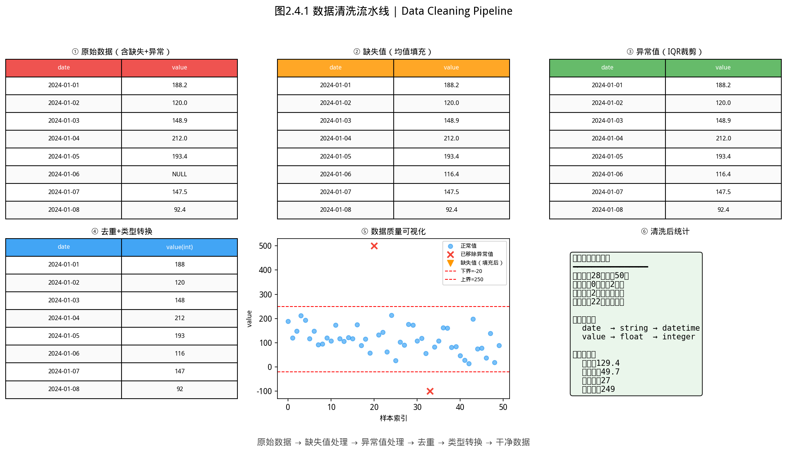

# 2.4 类型转换——DataFrame 怎么喂给机器学习模型


### 行业警示：一个脏数据 Bug，让 Target 多损失了 400 万美元


> **📌 学习目标**
> - 掌握 `groupBy()` + 聚合函数的标准分析流程
> - 能用 `pivotTable()` 实现数据透视
> - 理解 SQL GROUP BY 与 DataFrame groupBy 的对应关系

2012 年，美国连锁超市 **Target** 的数据团队训练了一个模型：根据用户浏览和购买历史，预测顾客是否怀孕，并向她们推送婴儿用品广告。

**结果：** 一个愤怒的父亲向 Target 投诉——向他的高中生女儿寄送婴儿用品广告。Target 的模型是对的（女儿确实怀孕了），但这个故事暴露了一个数据质量问题：**模型没有过滤「为他人购买」的情况**，把「父亲为女儿买了婴儿用品」误判为「这位父亲是孕妇」。

> 这个真实案例后来被《纽约时报》报道。**数据的「脏」不一定是指缺失值——有时是数据的语义错了，比缺失更危险。** 数据清洗的第一步：先理解每列数据「真正在测量什么」。

---

## 开场：你的 DataFrame 不能直接丢给 ML 模型

辛辛苦苦把 CSV 读进来了，清洗完了，切片也做好了。你信心满满地把 DataFrame 传给机器学习模型——

然后报错了：`ML.fit()` 只接受 `IMatrix`，不接受 `DataFrame`。

**因为 ML 模型是数学运算：矩阵乘法、求导、梯度下降——这些操作在 `double` 数组上进行，不认识 `DataFrame` 这个「带表头的 Excel」。**

本节解决这个转换问题：

- DataFrame → `IMatrix`（数值列进模型）
- Column → `IVector`（单列提取）
- 导出为 CSV（保存清洗后的数据）

---

## 2.4.1 DataFrame → IMatrix（`toMatrix`）


> 📝 **历史故事**：特征工程作为独立学科的兴起，源于 **Andrew Ng** 在 Stanford 的 MOOC（2011）——他强调「特征工程决定了机器学习的上限，算法只是逼近这个上限」。
如图所示，数据清洗流水线：

*图2.4.1 数据清洗流水线。ETL流程：Extract(抽取)→Transform(清洗转换)→Load(加载)，确保数据质量*

从图中可以看出，数据清洗流水线。
### 场景：终于可以把数据喂给模型了

```java
DataFrame df = DataFrame.readCsv("employees.csv");
// 假设列：[name(String), age(Numeric), salary(Numeric), years_employed(Numeric)]

// toMatrix() 提取所有 Numeric 列，拼成一个矩阵
var X = df.toMatrix();
// X: N 行 × 3 列（name 列被忽略了——它是字符串，不是数字）
System.out.printf("矩阵形状: %d 行 × %d 列%n", X.getRowNum(), X.getColNum());
```

**三件需要记住的事：**

1. **只提取数值列**——字符串列（如 `name`、`department`）无法参与数学运算，`toMatrix()` 自动忽略它们
2. **只提取数值列**——如果你只有一列数值列，`toMatrix()` 就返回 N×1 矩阵（一个列向量）
3. **数值列必须等长**——这在 2.1 节已经保证了

### 什么时候会报错？

```java
// 场景1：所有列都是 String
DataFrame allStr = DataFrame.readCsv("all_strings.csv");
// allStr.toMatrix();
// 抛 IllegalStateException："没有 Numeric 类型的列可以转换为矩阵"
// 解决方法：先确认 df.getColumnTypes() 里有 NUMERIC

// 场景2：数值列里混进了非数字值（如 "N/A"）
DataFrame mixed = DataFrame.readCsv("messy.csv");
// mixed.toMatrix();
// 同样抛 IllegalStateException — 这一列被识别成了 String
// 解决方法：先清洗数据（见 2.5 节），把 "N/A" 替换或删除
```

**为什么 `toMatrix()` 设计成自动忽略字符串列而不是报错？**

因为有些列「看起来像数字但不该转数字」——比如员工编号 `E001`、`E002`。如果自动转，`E001` 会变成 `0` 或 `NaN`，模型就跑出了完全错误的结果。显式要求你通过 `slice()` 选取真正需要的数值列，是类型安全的设计。

```java
// 如果你确定 salary 和 age 是建模需要的列，手动切出来再转
DataFrame modelCols = df.sliceColumn(1, 3);  // 假设 salary 和 age 在第 1~2 列
var X = modelCols.toMatrix();    // 这次不会误伤字符串列
```

---

## 2.4.2 Column → IVector（`toVec`）

### 场景：单独处理某一列

有时候你不需要整个矩阵，只需要一列来做统计分析（比如看年龄分布、算平均薪资）：

```java
Column ageCol = df.getColumnByName("age");

// toVec()：把 Numeric 列转成 IVector
var ageVec = ageCol.toVec();

// 之后就可以用 IVector 的统计方法了（见第 1 章和第 4 章）
System.out.printf("平均年龄: %.1f 岁%n", ageVec.mean());
System.out.printf("年龄标准差: %.1f%n", ageVec.std());
System.out.printf("年龄最小值: %.0f，最大值: %.0f%n", ageVec.min(), ageVec.max());
```

**两种写法的对比**：

```java
// 方式1：toVec()（简洁，但绑定了 Column 实例）
var v1 = ageCol.toVec();

// 方式2：手动转 Double[] 再用 Linalg.vector()（显式，流水线里更清晰）
Double[] arr = ageCol.getData().toArray(Double[]::new);
var v2 = Linalg.vector(arr);

// 两者数学上等价——选哪个看团队风格
```

---

## 2.4.3 Column → 字符串列表（`toStringList`）

非数值列（或者你想保留原始字符串格式）可以用 `toStringList()`：

```java
Column nameCol = df.getColumnByName("name");
List<String> names = nameCol.toStringList();  // ["Alice", "Bob", "Charlie", ...]
```

注意：即使是 Numeric 列，`toStringList()` 也会把所有值转成字符串——`["25", "30", "35"]` 而不是 `[25, 30, 35]`。这是给「需要字符串格式」的场景用的（比如打印日志、生成报告）。

---

## 2.4.4 导出为 CSV（`toCsv`）

清洗后的 DataFrame 可以导出保存：

```java
DataFrame cleaned = /* 清洗后的 DataFrame */;
cleaned.toCsv("processed.csv");  // 逗号分隔，含表头
```

导出的 CSV 可以直接用 Excel 打开，也可以下次 `DataFrame.readCsv("processed.csv")` 重新读进来。

---

## 2.4.5 完整流水线：DataFrame → 数据分析/ML

这是本书的核心流水线之一——从原始 CSV 到模型输入：

```
脏 CSV → DataFrame.readCsv()
    ↓
清洗（2.5 节）→ df.slice() 选列
    ↓
数值列 toMatrix() → IMatrix<Double>
    ↓
第1章：X.center() 中心化、X.covarianceFromCentered() 协方差矩阵
第4章：ageVec.mean()、ageVec.std() 描述统计
第5章：ML.logisticRegression().fit(X, y) 训练模型
```

一个具体例子——用员工数据训练离职预测模型：

```java
DataFrame raw = DataFrame.readCsv("employees.csv");

// 选数值列，转矩阵（假设最后一列 left 是标签）
DataFrame features = raw.slice(null, "0:-1");  // 除最后一列的所有列
var X = features.toMatrix();

// 标签列单独提取（不是数值，不能 toMatrix，要 toVec）
Column labelCol = raw.getColumnByName("left");
var y = labelCol.toVec();

// 机器学习模型（见第 5 章）
IClassifier clf = ML.logisticRegression(0.01, 0.1);
clf.fit(X, y);
```

---

> ⚠️ **常见误区**：toMatrix 会丢弃列名，所有数值变成纯矩阵——与机器学习代码衔接时注意特征顺序与列顺序的一致性。

## 2.4.6 本节 API 速查

| 场景 | API | 注意 |
|------|-----|------|
| DataFrame → 矩阵 | `df.toMatrix()` | 只含 Numeric 列；无 Numeric 列抛异常 |
| Column → 向量 | `col.toVec()` | 只适用于 Numeric 列 |
| Column → 字符串列表 | `col.toStringList()` | 任意类型均可 |
| DataFrame → CSV | `df.toCsv(path)` | 逗号分隔，含表头 |
| 切片后转矩阵 | `df.slice(...).toMatrix()` | 推荐写法（显式选列） |

---

*第 2 章的核心就是这句话：**好模型的前提是好数据，好数据的前提是把 CSV 正确读进来、干净地切片、正确地转换成数值矩阵。***（提示：与第 5 章机器学习的特征工程一脉相承——将 DataFrame 转为 Matrix 是数据的「标准化预处理」。）


## 本节小结

DataFrame 不能直接丢给机器学习模型——必须转换为 IMatrix（数值特征）和 IVector（标签）。toMatrix 是连接「数据分析」和「机器学习」的桥梁。

**核心要点**：机器学习需要矩阵和向量输入；toMatrix 只保留数值列；特征顺序在转换后以列添加顺序为准。
## 章节练习 / Exercises

**1. 流水线转换（应用题）**

读取 iris.csv，转换为 IMatrix 后，用 `MatrixStats.corr()` 计算特征间的相关性矩阵，并找出相关性最高的一对特征。

**2. toMatrix 维度验证（概念题）**

混合数值和字符串列的 DataFrame 调用 toMatrix，会发生什么？实际操作验证，并说明为什么。
