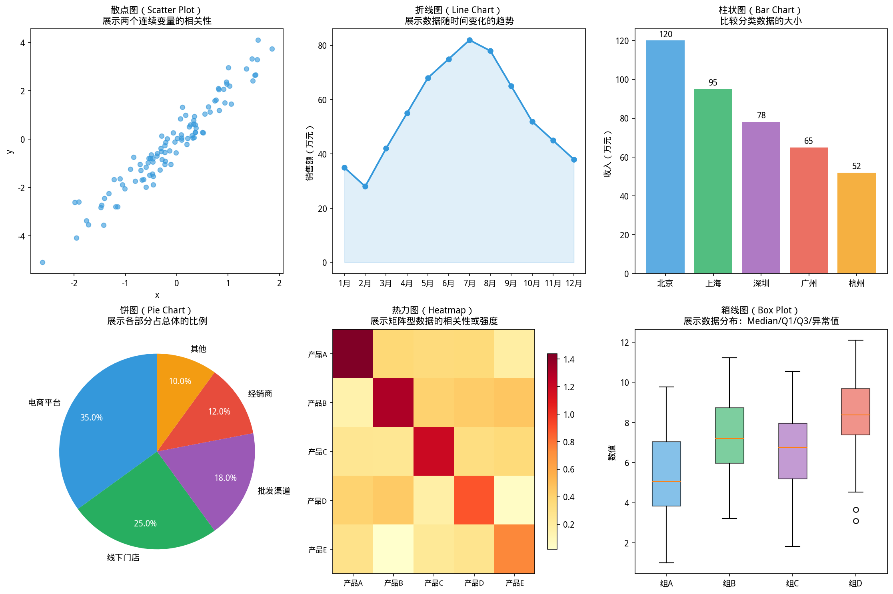

# 3.1 基础图表类型


### 思考题：这张图在说真话，还是在说谎？


> **📌 学习目标**
> - 理解 Tufte 数据墨水比原则——图表能说的话，不要用数字
> - 掌握 Anscombe 四组数据的警示意义：先画图，再下结论
> - 能识别三种常见「图表说谎」方式：截断坐标轴、不当缩放、嵌套陷阱

你有没有过这种经历：看完一张图得出的结论，和别人看完同一张图得出的结论，完全不同？

**这就是「图表会撒谎」的典型场景——不是因为数据造假，而是因为选择了错误的图表类型，或设置了误导的坐标轴。**

最常见的三种误导方式：
1. **截断坐标轴**：把柱状图的 Y 轴从 0% 改成从 80% 开始，两个本来只差 2% 的数，看起来差了 5 倍
2. **选择错误的基准**：把「增长了 100%」和「从 100 万增长到 200 万」用同一个图表展示，读者会以为前者更显著
3. **堆积面积图掩盖分量**：把多条趋势线堆在一起，某个分量其实在下降，但总量在上升——总量那条线掩盖了分量的下降

**本章的目标：不只是教你画图，而是教你用图表讲真话、讲清楚话。**

---

## 开场：选错图表有多可怕

你做了两周分析，向领导汇报：双十一销量同比增长 8%。

你用的是**饼图**——领导看完问：「所以到底是哪个渠道增长了多少？」

你答不上来。

**选错图表，不只是丑的问题，而是让人看不懂、甚至看错。**

本节覆盖六种最基础图表：**线图、散点图、柱状图、饼图、直方图、热力图**——每种讲清楚一件事：**什么时候用它，什么时候千万别用。**

---

## 3.1.1 线图——看趋势


> 📝 **历史故事**：统计图表的革命来自 **Edward Tufte（1983）** 的《The Visual Display of Quantitative Information》——他提出了「数据-墨水比」概念，主张图表应该「有多少数据就说多少话」。今日大多数商业图表违反了他的第一条原则。
如图所示，图表类型选择指南：

*图3.1.1 图表类型选择指南。连续变量→直方图/箱线图；分类变量→柱状图/饼图；关系→散点图*

**什么时候用**：数据随时间变化（时间序列），你想看「涨了还是跌了、涨得快还是慢」。

**什么时候不用**：时间序列以外的数据（比如类目比较）；类别超过 5 条线（画面会乱成一团）。

```java
import com.yishape.lab.math.linalg.Linalg;
import com.yishape.lab.math.viz.Plots;

// 销售数据：近12个月的销售额
IVector months = Linalg.vector(new double[]{1,2,3,4,5,6,7,8,9,10,11,12});
IVector sales = Linalg.vector(new double[]{120,135,148,162,175,189,201,215,228,240,255,268});

Plots.of(800, 400)
    .line(months, sales)
    .title("2024年月度销售额", "单位：万元")
    .xlabel("月份")
    .ylabel("销售额")
    .saveAsHtml("sales_trend.html");
```

**多条线对比**——产品 A 和产品 B 的销量对比：

```java
IVector months = Linalg.vector(new double[]{1,2,3,4,5,6,7,8,9,10,11,12});
IVector salesA = Linalg.vector(new double[]{80,92,88,105,112,128,135,142,130,148,155,162});
IVector salesB = Linalg.vector(new double[]{40,43,60,57,63,61,66,73,98,92,100,106});
List<String> hue = Arrays.asList(
    "产品A","产品A","产品A","产品A","产品A","产品A","产品A","产品A","产品A","产品A","产品A","产品A",
    "产品B","产品B","产品B","产品B","产品B","产品B","产品B","产品B","产品B","产品B","产品B","产品B"
);
IVector allY = Linalg.vector(concat(salesA.toDoubleArray(), salesB.toDoubleArray()));
IVector allX = Linalg.vector(concat(months.toDoubleArray(), months.toDoubleArray()));

Plots.of(800, 400)
    .line(allX, allY, hue)
    .title("产品A vs 产品B 月度销量对比")
    .xlabel("月份")
    .ylabel("销量")
    .saveAsHtml("product_comparison.html");
```

---

## 3.1.2 散点图——看关系

**什么时候用**：你想知道两个变量**有没有关系**——是正相关、负相关、还是完全无关。

**什么时候不用**：两个变量都是分类数据（用柱状图）；数据量太大超过几千点（透明度调低也看不清）。

```java
// 用户活跃天数 vs 月消费金额
IVector activeDays = Linalg.vector(new double[]{2,5,8,12,15,18,22,25,28,30});
IVector consumption = Linalg.vector(new double[]{50,120,180,250,320,380,450,520,580,650});

Plots.of(600, 400)
    .scatter(activeDays, consumption)
    .title("用户活跃度 vs 消费金额")
    .xlabel("月活跃天数")
    .ylabel("月消费（元）")
    .saveAsHtml("scatter_demo.html");
```

**带类别的散点图**（两类用户分开标记）：

```java
IVector xAll = Linalg.vector(new double[]{1,2,3,4,5, 1,2,3,4,5});
IVector yAll = Linalg.vector(new double[]{10,20,15,30,25, 15,25,20,35,30});
List<String> labels = Arrays.asList(
    "A类","A类","A类","A类","A类",
    "B类","B类","B类","B类","B类"
);

Plots.of(600, 400)
    .scatter(xAll, yAll, labels)
    .title("两类用户的行为分布")
    .xlabel("特征X")
    .ylabel("特征Y")
    .saveAsHtml("scatter_categorized.html");
```

---

## 3.1.3 柱状图——比大小

**什么时候用**：不同类别之间比大小（各季度销售额、各部门人数、各产品线收入）。

**什么时候不用**：类别超过 10 个（改用排序后的水平柱状图）；时间序列数据（用线图更清晰）。

**柱状图 vs 线图**：线图看趋势（随时间怎么变），柱状图比大小（谁比谁多多少）。

```java
IVector sales = Linalg.vector(new double[]{120, 98, 156, 87, 143});
var quarters = {"Q1","Q2","Q3","Q4","Q5"};

Plots.of(600, 400)
    .bar(sales)                    // 自动用整数索引作X轴
    .title("各季度销售额对比")
    .xlabel("季度")
    .ylabel("销售额（万元）")
    .saveAsHtml("bar_basic.html");

// 分组柱状图：各产品线在各地的销量
IVector regionData = Linalg.vector(new double[]{120, 98, 156, 87});
List<String> hue = Arrays.asList("华北","华东","华南","西南");
Plots.of(700, 400)
    .bar(regionData, hue)
    .title("各地区销量分布")
    .xlabel("地区")
    .ylabel("销量")
    .saveAsHtml("bar_grouped.html");
```

---

## 3.1.4 饼图——看比例

**什么时候用**：展示整体被分成几部分、各占多少比例——且类别不超过 5 个。

**什么时候不用**：类别超过 5 个（扇区太小无法判断）；要比较精确数值（人眼判断角度比判断高度更不精确）；时间序列（饼图没有时间维度）。

**替代方案**：如果超过 5 个类别，用**堆叠柱状图**或**水平柱状图**按大小排序。

```java
IVector marketShare = Linalg.vector(new double[]{35, 25, 18, 12, 10});
var brands = {"品牌A","品牌B","品牌C","品牌D","其他"};

Plots.of(500, 400)
    .pie(marketShare)
    .title("市场竞争格局", "各品牌市场份额占比")
    .saveAsHtml("pie_market_share.html");
```

---

## 3.1.5 直方图——看分布

**什么时候用**：你想知道数据「集中在哪里」「有没有尾巴」「有没有异常值」。

**什么时候不用**：比较多个分布（用箱线图）；只有 20 个数据点以下（区间太少看不出形状）。

**直方图 vs 柱状图**：柱状图比较各类别的大小（X轴是类别）；直方图展示一个连续变量的分布（X轴是数值区间，区间宽度代表「桶」）。

```java
// 1000 个随机数，生成直方图
var raw = new double[1000];
for (int i = 0; i < 1000; i++) raw[i] = Math.random() * 20 + 80; // 均值90，范围80~100
IVector data = Linalg.vector(raw);

Plots.of(600, 400)
    .hist(data, 30)    // 30 个区间，显示正态拟合曲线
    .title("用户年龄分布直方图")
    .xlabel("年龄")
    .ylabel("频数")
    .saveAsHtml("histogram_age.html");
```

---

## 3.1.6 热力图——看矩阵

**什么时候用**：展示一个矩阵（或表格）里每个位置数值的高低——相关性矩阵、混淆矩阵、两地不同时段的流量。

**什么时候不用**：矩阵是稀疏的（空白太多）；X轴和Y轴不是同一变量（如相关性）。

```java
// 4×4 相关性矩阵热力图
IMatrix corr = Linalg.matrix(new double[][]{
    { 1.0,  0.8,  0.3,  0.1},
    { 0.8,  1.0,  0.4,  0.2},
    { 0.3,  0.4,  1.0,  0.7},
    { 0.1,  0.2,  0.7,  1.0}
});
var labels = {"销量", "满意度", "复购率", "NPS"};

Plots.of(500, 400)
    .heatmap(corr, labels)
    .title("指标相关性矩阵")
    .saveAsHtml("heatmap_corr.html");
```

---

## 3.1.7 图表选择决策树

```
我有一组数据，想看……

→ 随时间的变化趋势              → 线图
→ 两个变量的关系               → 散点图
→ 各类别的大小对比（≤5类）     → 柱状图
→ 各部分占整体的比例（≤5类）    → 饼图
→ 数据落在各个范围的频次        → 直方图
→ 一个矩阵里值的高低分布        → 热力图
```

---


## 3.1.8 本节 API 速查

> ⚠️ **常见误区**：饼图超过 5 个类别就难以阅读——人眼对角度的比较远不如对长度敏感。数据类别多时，用水平条形图代替。
## 3.1.8 本节 API 速查

| 图表 | API | 必填参数 |
|------|-----|---------|
| 线图 | `Plots.of(w,h).line(y)` 或 `.line(x, y)` | y 数据 |
| 散点图 | `Plots.of(w,h).scatter(x, y)` 或 `.scatter(x, y, labels)` | x, y |
| 柱状图 | `Plots.of(w,h).bar(data)` 或 `.bar(data, categories)` | data |
| 饼图 | `Plots.of(w,h).pie(data)` | data |
| 直方图 | `Plots.of(w,h).hist(data, bins)` | data, bins（区间数）|
| 热力图 | `Plots.of(w,h).heatmap(matrix, labels)` | matrix |

```java
// 通用流程
RerePlot plot = Plots.of(800, 600);
plot.title("主标题", "副标题");
plot.xlabel("X轴").ylabel("Y轴");
plot.saveAsHtml("output.html");  // 或 .save("output.png")
```

（相关：第 5 章模型评估中的 ROC 曲线和精确率-召回率曲线，继承了此处学习的指标概念。）


## 本节小结

选择图表类型要考虑「数据特性」和「你想传达的信息」：趋势用折线图，分布用直方图/箱线图，比较用条形图，比例用饼图，相关性用散点图。图表的首要目标是让读者一眼看懂。

**核心要点**：折线图适合时间序列；散点图适合两个数值变量的关系；条形图适合类别比较；饼图适合展示比例（类别少时）。