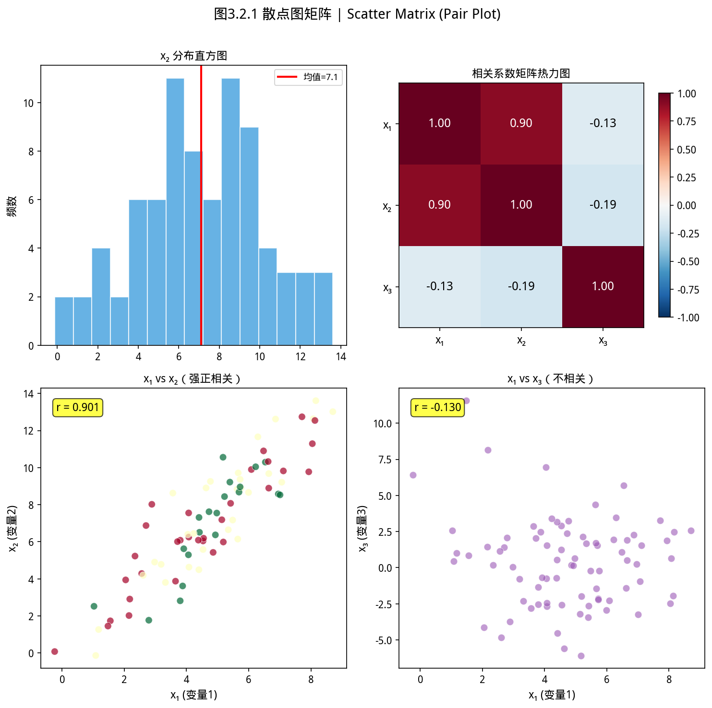

# 3.2 高级统计图表


### 思考题：相关性 $r = 0.85$ 能告诉你这三件事吗？


> **📌 学习目标**
> - 理解「视觉通道」的数学映射：位置、颜色、大小、形状、面积
> - 掌握如何根据数据类型（类别/有序/数值）选择合适的美学通道
> - 能用 `Plots` API 绑定数据维度到视觉维度

你算出两个变量的相关系数 $r = 0.85$，兴奋地汇报：「高度相关！」

但只看 $r = 0.85$，你其实不知道三件事：

1. **关系的形态**：是线性的，还是曲线的？$r$ 只描述线性关系
2. **异常点的影响**：一个极端异常值可能把 $r$ 从 0.3 拉高到 0.85
3. **因果还是相关**：即使 $r = 0.99$，也只能说「这两个变量一起变化」，不能证明A导致B

**散点图能让你一眼看出这三个问题——这就是为什么「先画图，后算统计量」。**

---

## 开场：老板问「三组数据分布有什么不同」

你分析了三组用户的消费金额：
- A组均值 500 元，B组均值 520 元，C组均值 510 元

老板问：「三组数据分布的差异在哪里？是集中度不同，还是有异常值？」

均值几乎一样，但如果你画出箱线图，会发现：
- A组：所有用户都集中在 400~600 元，分布均匀
- B组：中位数靠近上四分位数，有少数高消费者把均值拉高了
- C组：存在几个消费上万元的大户（异常值）

**箱线图回答的就是这个问题——不只是均值，而是分布的形状。**

---

## 3.2.1 箱线图——五个数字说清分布


> 📝 **历史故事**：箱线图（Box Plot）由 **John Tukey（1977）** 发明——这位统计全才在 AT&T Bell Labs 工作时，用一个简单图形同时展示了位置、散布和偏度。Tukey 说：「一张好图勝过千言万语，坏图比没图更糟——因为它误导你。」
如图所示，散点图矩阵：

*图3.2.1 散点图矩阵。散点图矩阵展示所有变量对的两两关系，对角线为各变量的边际分布*

**什么时候用**：比较多个组的分布；快速发现异常值；看数据是否对称、偏斜。

**箱线图在画什么**：把数据分成四等份——25%、50%、75%三个切点：

| 元素 | 含义 | 类比 |
|------|------|------|
| 箱体下边 | Q1（25%分位数）| 排在你前面 25% 的人 |
| 中位线 | Q2（50%分位数）| 正好一半在你前面 |
| 箱体上边 | Q3（75%分位数）| 排在你前面 75% 的人 |
| 须线 | Q1-1.5×IQR 到 Q3+1.5×IQR | 正常范围的上/下边界 |
| 圆点 | 异常值（在须线之外）| 超出正常范围的「异类」|

```java
import com.yishape.lab.math.linalg.IVector;
import com.yishape.lab.math.linalg.Linalg;
import com.yishape.lab.math.plot.Plots;
import java.util.Arrays;
import java.util.ArrayList;
import java.util.List;

// 三个班级的考试成绩分布
IVector<?> scores = Linalg.vector(new double[]{
    // 班级A：成绩集中，均衡
    72, 75, 78, 80, 82, 85, 88, 90, 92, 95,
    // 班级B：有两个低分，整体偏高
    78, 80, 82, 85, 88, 90, 92, 94, 96, 98,
    // 班级C：有一个极端低分
    45, 75, 78, 80, 82, 85, 88, 90, 92, 95
});
List<String> labels = Arrays.asList(
    "A","A","A","A","A","A","A","A","A","A",
    "B","B","B","B","B","B","B","B","B","B",
    "C","C","C","C","C","C","C","C","C","C"
);

Plots.of(700, 400)
    .boxplot(scores, labels)
    .title("三个班级考试成绩分布对比")
    .xlabel("班级")
    .ylabel("分数")
    .saveAsHtml("boxplot_classes.html");
```

**单组箱线图**：

```java
IVector<?> salary = Linalg.vector(/* 1000 个薪资数据 */);
Plots.of(600, 400)
    .boxplot(salary)
    .title("员工薪资分布")
    .xlabel("全体员工")
    .ylabel("薪资（元）")
    .saveAsHtml("boxplot_salary.html");
```

---

## 3.2.2 小提琴图——箱线图 + 密度

**什么时候用**：箱线图只能告诉你 Q1、Q2、Q3，但你不知道数据在每个区间里有多密——比如两个分布 Q1/Q2/Q3 完全一样，但一个是均匀分布，一个是中间集中两端稀疏。

**小提琴图**在箱线图两边各加了一层「密度镜像」——像一把小提琴，中间的胖细两端细，表示这里数据最密集。

```java
IVector<?> groupA = Linalg.vector(new double[]{62, 65, 68, 70, 72, 75, 78, 80, 82, 85, 88, 90, 92});
IVector<?> groupB = Linalg.vector(new double[]{60, 62, 63, 65, 72, 80, 88, 95, 96, 97, 98, 99, 100});

// 使用 IVector#concat 拼接两组数据；标签等长且与之对齐
IVector<?> allData = ((IVector<Double>) groupA).concat((IVector<Double>) groupB);
List<String> allLabels = new ArrayList<>();
for (int i = 0; i < groupA.length(); i++) allLabels.add("A组");
for (int i = 0; i < groupB.length(); i++) allLabels.add("B组");

Plots.of(700, 400)
    .violinplot(allData, allLabels)
    .title("两组用户活跃度分布（小提琴图）")
    .xlabel("用户组")
    .ylabel("月活跃天数")
    .saveAsHtml("violin_users.html");
```

**箱线图 vs 小提琴图怎么选**：
- 样本量小（< 30）→ 箱线图（更稳健）
- 样本量大，想看分布细节 → 小提琴图
- 做学术论文 → 两者叠加：连续调用 `Plots.of(...).violinplot(data, labels).boxplot(data, labels)` 让箱线浮在小提琴上方

---

## 3.2.3 K线图——金融数据专用

**什么时候用**：股票、期货、外汇等金融资产的 OHLC（开/高/低/收）分析。

K线图是技术分析的基础——一根 K 线包含四个信息：开盘价、收盘价、最高价、最低价。

```java
import com.yishape.lab.math.linalg.IMatrix;

// 10 个交易日的 K 线，每行 [开盘, 收盘, 最低, 最高]
IMatrix<?> ohlc = Linalg.matrix(new double[][]{
    {100, 102, 99,  103},
    {102, 104, 101, 106},
    {105, 103, 102, 108},
    {103, 107, 102, 110},
    {107, 110, 106, 112},
    {110, 108, 107, 113},
    {108, 112, 107, 115},
    {112, 115, 111, 117},
    {115, 113, 112, 120},
    {113, 118, 112, 122}
});
List<String> dates = Arrays.asList(
    "2024-01-02","2024-01-03","2024-01-04","2024-01-05","2024-01-08",
    "2024-01-09","2024-01-10","2024-01-11","2024-01-12","2024-01-15"
);

Plots.of(800, 400)
    .candlestick(ohlc, dates)
    .title("股票日K线图", "2024 年某股票价格走势")
    .xlabel("交易日")
    .ylabel("价格（元）")
    .saveAsHtml("candlestick_demo.html");
```

> ⚠️ **列序**：`candlestick` 输入矩阵每行为 `[open, close, low, high]`（开盘/收盘/最低/最高），**不是** `[open, high, low, close]`。如果颜色或上下影线异常，先核对列序。

---


## 3.2.4 图表选择：直方图 vs 箱线图 vs 小提琴图

| 图表 | 适合看什么 | 不适合 |
|------|-----------|--------|
| **直方图**（3.1节） | 连续变量的分布形状（有几个峰、偏左还是偏右） | 多组同时对比 |
| **箱线图** | 多组同时比较；快速发现异常值 | 分布的精细形状（均匀分布和正态分布可能画出来一样） |
| **小提琴图** | 多组比较 + 想看分布精细形状 | 样本量太小（< 20）时图形不可靠 |

---

## 3.2.5 本节 API 速查

| 图表 | API | 参数 |
|------|-----|------|
| 箱线图 | `Plots.of(w,h).boxplot(data)` 或 `.boxplot(data, labels)` | data：所有样本拼接的 `IVector`；labels：每点对应的组名 |
| 小提琴图 | `Plots.of(w,h).violinplot(data)` 或 `.violinplot(data, labels)` | 同上 |
| K线图 | `Plots.of(w,h).candlestick(matrix, dates)` | `IMatrix` 每行 `[open, close, low, high]`；`dates` 为日期/期标签列表 |

> ⚠️ **不存在的 API**：`.candlestick(open, high, low, close)` 四向量重载、`.annotate(...)`/`.addOverlay(...)` 等 K 线标注函数都未提供。如需均线叠加，请在外层用 `Plots.of(...).line(...)` 与 K 线图分别绘制后合并展示。


## 本节小结

箱线图用 5 个数（最小值、Q1、中位数、Q3、最大值）概括分布，适合比较多个组；小提琴图结合了箱线图和密度估计，能展示分布形状；K 线图专用于金融时序（开盘、收盘、最高、最低）。

**核心要点**：箱线图比较分布；小提琴图展示密度；K 线图展示金融时序的四个价格点。