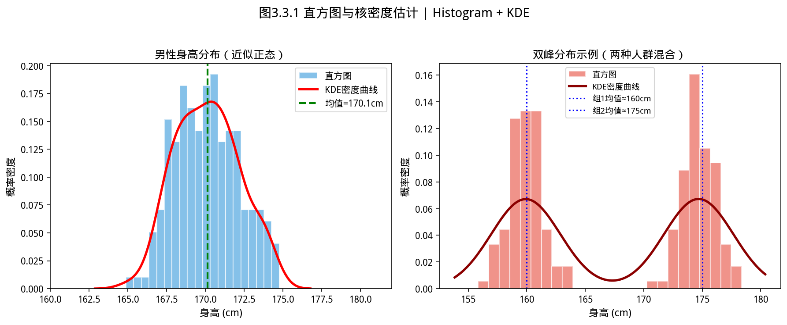
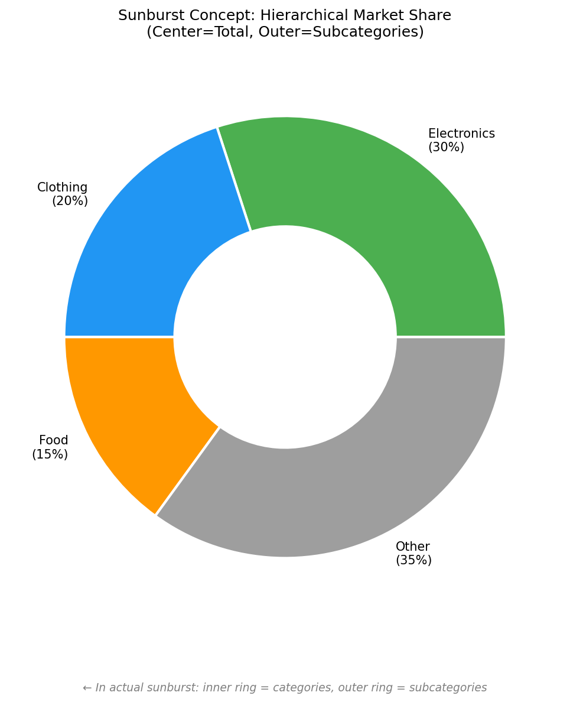
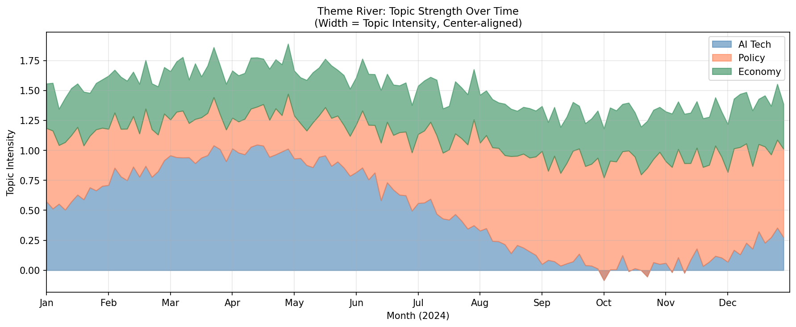

# 3.3 特殊图表——当普通图表不够用时


### 历史故事：极坐标的发明——为什么指南针用圆形？


> **📌 学习目标**
> - 掌握面域切分（facet）实现分组可视化
> - 能用 `.subplot()` 和 `Plots.facetGrid()` 布局多面板图表
> - 理解何时用 facet（分组对比）vs 叠加（趋势叠加）

我们习惯用直角坐标系（x, y）来表示数据。但有些数据天生有「方向性」——用直角坐标反而丢失了关键信息。

**极坐标**（半径 + 角度）最早出现在 18 世纪的天文学中——天文学家需要描述天体在天球上的位置和方位，"方位角"（direction angle）是最自然的坐标。

后来，统计学家发现：**风向、月份周期、昼夜分布**这些数据，用极坐标比直角坐标更容易揭示规律。

这就是为什么气象站在用**风向玫瑰图**（wind rose）报告全年风向分布——它把 12 个月的风向数据叠加在同一个圆上，「某方向风多」这个规律一目了然。

---

## 开场：普通图表画不了的那些数据

有些数据天然有方向性或流程性，普通柱状图画出来不好看，或者根本不适合：

- **风向分布**：360°的方向，用普通柱状图说不清楚
- **转化漏斗**：访问 → 注册 → 浏览 → 支付，每步都在流失——用柱状图只能看到数字，用漏斗图才能看到「哪一步掉得最多」
- **流量流向**：从 A 到 B 到 C 的用户流动，普通图根本画不出来

本节讲三类「特殊武器」：**极坐标图、漏斗图、桑基图**。

---

## 3.3.1 极坐标图——有方向的数据

如图所示，直方图与核密度估计：

*图3.3.1 直方图与核密度估计。直方图用分箱近似分布；核密度估计（KDE）用平滑核函数拟合连续密度曲线*

**什么时候用**：数据有角度或方向属性——风向、年/月/小时分布、季节性强度。

**直觉**：把普通柱状图「卷起来」，首尾相接变成一个圆。方向越集中，某个扇形就越突出。

**和普通柱状图的区别**：普通柱状图 X 轴是类别（产品A、B、C），极坐标图 X 轴是方向（北、东北、东……），Y 轴是半径（强度）。

### 风向玫瑰图——最典型的极坐标应用

```java
// 24小时内的风向计数（每45度一个方向）
IVector windData = Linalg.vector(new double[]{12, 28, 45, 18, 8, 5, 3, 10});
List<String> directions = Arrays.asList("北","东北","东","东南","南","西南","西","西北");

Plots.of(500, 500)
    .polarBar(windData, directions)
    .title("24小时风向分布", "某城市气象站数据")
    .saveAsHtml("wind_rose.html");
```

### 极坐标线图——周期性数据

```java
// 24小时内每2小时的气温（周期性数据）
IVector tempData = Linalg.vector(new double[]{18, 17, 16, 15, 16, 19, 22, 26, 29, 30, 29, 27});
List<String> timeLabels = Arrays.asList(
    "02:00","04:00","06:00","08:00","10:00","12:00",
    "14:00","16:00","18:00","20:00","22:00","24:00"
);

Plots.of(500, 500)
    .polarLine(tempData, timeLabels)
    .title("日气温变化（极坐标）")
    .saveAsHtml("temp_polar.html");
```

### 极坐标散点图

```java
IVector angleData = Linalg.vector(new double[]{0, 45, 90, 135, 180, 225, 270, 315});
IVector rData = Linalg.vector(new double[]{10, 20, 15, 30, 25, 18, 22, 12});

Plots.of(500, 500)
    .polarScatter(angleData, rData)
    .title("传感器空间分布")
    .saveAsHtml("polar_scatter.html");
```

---

## 3.3.2 漏斗图——每一步流失了多少人

**什么时候用**：分析转化路径，找出「哪一步」流失最严重。

最典型的两个场景：

1. **电商转化**：访问 → 注册 → 浏览 → 加购 → 支付 → 成交
2. **用户激活**：打开 App → 完成注册 → 首次下单 → 复购

**直觉**：漏斗越「胖」，流失越均匀；漏斗在某一步突然变窄，说明这步有问题——值得重点优化。

```java
// 电商转化漏斗
IVector funnelData = Linalg.vector(new double[]{10000, 6500, 4200, 2800, 1800, 1200});
List<String> stages = Arrays.asList(
    "页面访问", "注册账号", "浏览商品", "加入购物车", "提交订单", "完成支付"
);

Plots.of(700, 500)
    .funnel(funnelData, stages)
    .title("电商用户转化漏斗", "2024年Q4数据")
    .saveAsHtml("ecommerce_funnel.html");

// 销售漏斗
IVector salesFunnel = Linalg.vector(new double[]{5000, 2000, 800, 300, 120});
List<String> salesStages = Arrays.asList(
    "潜在客户", "初次接触", "需求确认", "方案报价", "签约成交"
);

Plots.of(700, 500)
    .funnel(salesFunnel, salesStages)
    .title("销售漏斗", "从线索到现金的转化")
    .saveAsHtml("sales_funnel.html");
```

**漏斗图解读**：

| 观察 | 意味着什么 |
|------|-----------|
| 某一步特别窄 | 这是瓶颈，重点优化这一步 |
| 每一步均匀减少 | 流失均匀分布在全流程，产品整体需要改进 |
| 某一步比上一步还宽 | 数据异常（应该是单向递减）|

---

## 3.3.3 桑基图——钱/物流/用户的流向

**什么时候用**：数据从 A 流向 B，B 又流向 C 和 D——普通的柱状图或折线图都无法表达「分流」的概念。

**典型场景**：
- 营销预算：从总预算 → 各渠道 → 各渠道的效果
- 用户路径：从 App 首页 → 各功能模块 → 各页面的停留时长
- 供应链：从原材料 → 各工厂 → 各仓库 → 各门店

**漏斗图 vs 桑基图**：漏斗图是「一路筛下去」（每步都在减少）；桑基图是「分叉流」（一路分出去，流向多个方向）。

```java
// 营销预算流向图
IVector budgetData = Linalg.vector(new double[]{1000000, 400000, 300000, 200000, 100000, 50000, 50000, 50000});
List<String> flowLabels = Arrays.asList(
    "总预算",
    "搜索引擎", "社交媒体",
    "SEO", "SEM", "抖音", "微信", "B站"
);

Plots.of(900, 500)
    .sankey(budgetData, flowLabels)
    .title("营销预算流向图", "2024年度各渠道预算分配")
    .saveAsHtml("budget_sankey.html");
```

---

## 3.3.4 本节 API 速查

| 图表 | API | 数据要求 |
|------|-----|---------|
| 极坐标柱状图 | `Plots.of(w,h).polarBar(data, labels)` | data：每方向数值；labels：方向名 |
| 极坐标线图 | `Plots.of(w,h).polarLine(data, labels)` | 周期性数据（时间/角度） |
| 极坐标散点图 | `Plots.of(w,h).polarScatter(angle, r)` | angle：角度向量；r：半径向量 |
| 漏斗图 | `Plots.of(w,h).funnel(data, stages)` | data：每阶段数值（应递减）；stages：阶段名称 |
| 桑基图 | `Plots.of(w,h).sankey(data, labels)` | data：各节点值；labels：节点名称 |


## 本节小结

极坐标图用角度和半径表示数据，适合方向数据和周期数据；漏斗图适合展示流程各阶段的转化率；桑基图描述流的流向（如用户路径、资金流向）。

**核心要点**：极坐标天然适合周期数据（角度=周期位置）；漏斗图展示转化流失；桑基图描述从起点到终点的流量分布。

---

### 3.3.7 旭日图与主题河流图 / Sunburst and Theme River

#### 3.3.7.1 旭日图 (Sunburst Chart)

旭日图是**多层级饼图**——中心是根节点，外环是子节点，层层展开。适合展示**层级占比关系**（如文件目录大小、市场份额层级）。


*图 new.fig_sunburst_concept 旭日图用同心圆环表示层级结构，内环为父类，外环为子类，扇形面积代表数值大小。*


*图 new.fig_theme_river 主题河流图的宽度变化反映主题强度随时间的演变，居中对齐便于比较相邻主题的相对强弱。*

```java
// 旭日图：电商类目销售额层级
// 数据格式：父节点, 子节点, 数值
String[][] sunburstData = {
    {"全部", "电子产品", "5000"},
    {"全部", "服装", "3000"},
    {"全部", "食品", "2000"},
    {"电子产品", "手机", "2000"},
    {"电子产品", "电脑", "2500"},
    {"电子产品", "配件", "500"},
    {"服装", "男装", "1500"},
    {"服装", "女装", "1500"},
    {"食品", "生鲜", "1000"},
    {"食品", "零食", "1000"},
};

var plot = Plots.of(800, 600);
plot.sunburst(sunburstData)
    .title("电商销售额层级")
    .colorScheme("category10")
    .save("output/sunburst.html");
```

**适用场景**：
- 公司组织架构（各层级人数）
- 文件系统（各目录大小）
- 全国→省→市 GDP 层级

#### 3.3.7.2 主题河流图 (Theme River)

主题河流图用**河流的宽度变化**表示某个主题在时间维度上的强弱——宽=强，窄=弱。适合展示**主题演变的节奏**（如新闻主题随时间的热度变化）。

```java
// 主题河流：新闻主题6个月的热度变化
String[] dates = {"2024-01", "2024-02", "2024-03", "2024-04", "2024-05", "2024-06"};
double[] aiTopic = {10, 25, 45, 60, 55, 80};     // AI热度
double[] chipTopic = {30, 35, 20, 15, 40, 50};   // 芯片热度
double[] policyTopic = {50, 40, 35, 45, 30, 25}; // 政策热度

var plot = Plots.of(900, 400);
plot.themeRiver(dates, 
    new String[]{"AI", "芯片", "政策"},
    new double[][]{aiTopic, chipTopic, policyTopic})
    .title("2024上半年科技主题热度演变")
    .xlabel("月份")
    .save("output/theme_river.html");
```

**与堆叠面积图的区别**：
- 堆叠面积图：绝对值堆叠，总面积 = 各分量之和
- 主题河流图：**居中对齐**，宽度变化反映主题自身强弱，而非绝对值

> 📝 **历史故事**  
> 主题河流图由 **S. Wattenberg（2001）** 在 IBM Watson 研究中心发明，最初用于展示文本语料库中主题随时间的变化。"Theme River" 这个名字来自其视觉外观——河流的宽度代表主题的"流量"（重要性）。

