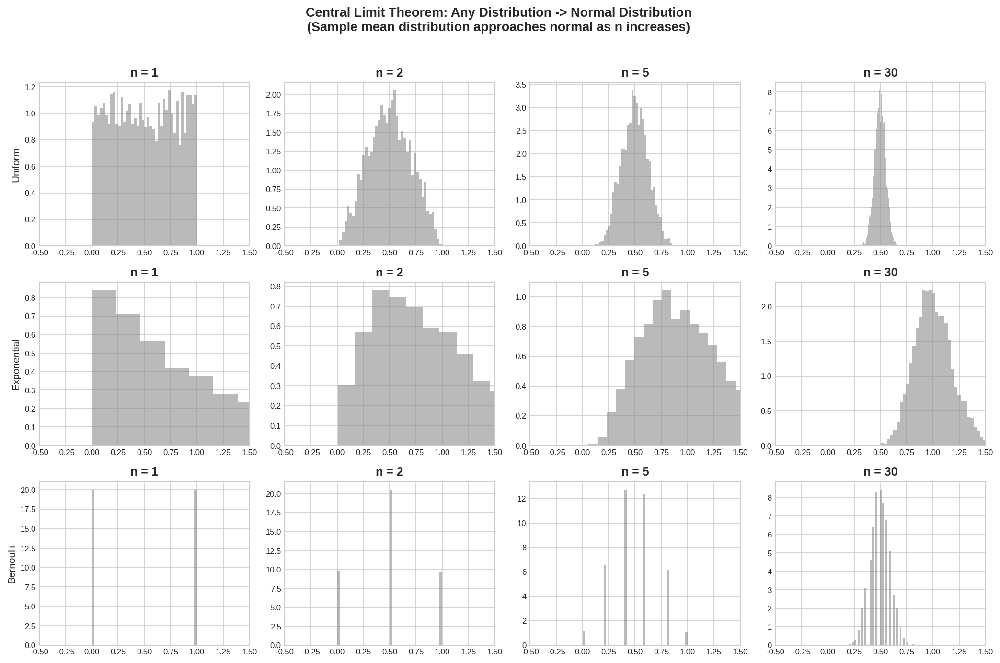

# 4.1 抽样与极限定理 / Sampling and Limit Theorems

## 开场：只调查了 500 人，怎么敢说全国人民的态度？


> **📌 学习目标**
> - 理解大数定律与中心极限定理——样本均值的抽样分布在 $n\to\infty$ 时趋近正态
> - 掌握 $\bar{X}$ 的标准误差 $\sigma/\sqrt{n}$
> - 能用 YiShape-Math 的 `Stats` 工厂进行抽样分布计算

你想知道全国人民对某个政策的支持率。14 亿人全部问一遍？不可能。

于是你找了 500 个人问，调查结果显示支持率 58%。

**这个 58% 靠谱吗？**

统计学回答这个问题靠两个定理：

- **大数定律**：样本量越大，样本均值越接近真实均值。500 人的调查比 50 人的可靠。
- **中心极限定理**：无论总体分布是什么，当样本量够大（通常 n ≥ 30），样本均值的分布近似正态分布。这个正态分布的均值就是总体均值，方差是 $\sigma^2 / n$。

这两个定理加在一起，给了统计学一个「以样本推断总体」的理论基础。你不需要调查所有人，只需要确保抽样是随机的、样本量够大，就能知道你的调查结果有多可靠。

---

## 4.1.1 总体与样本 / Population and Sample

> 📝 **历史故事**：中心极限定理（CLT）的正式证明由 **Lindeberg（1922）** 和 **Levy（1923）** 完成。但这个定理的雏形可以追溯到 **de Moivre（1733）** 对二项分布的正态近似。de Moivre 是法国数学家，因躲避宗教迫害流亡英国，在伦敦咖啡馆研究赌博问题时发现了正态分布的雏形——这可能是数学史上第一个「应用数学家」的故事。

### 基本概念 / Basic Concepts

**总体（Population）** 是研究对象的全体，记为 $X \sim F(x; \theta)$，其中 $\theta$ 为未知参数。总体可大可小——可以是无限总体（如所有郑骰子的结果），也可以是有限总体（如某个班级的学生身高）。

**样本（Sample）** 是从总体中抽取的部分个体。设从总体 $X$ 中独立抽取 $n$ 个观测值 $X_1, X_2, \ldots, X_n$，称这 $n$ 个随机变量为一个**简单随机样本**，简称样本。样本满足：

1. **独立性（Independence）**：各 $X_i$ 相互独立
2. **同分布（Identically Distributed）**：各 $X_i$ 与总体 $X$ 同分布

> **统计推断的"合法性"来源**：正是独立同分布（i.i.d.）假设，使得我们可以利用概率论的强大工具来分析样本，并建立可靠的推断方法。

### 统计量 / Statistic

**统计量**是样本的函数 $T = g(X_1, X_2, \ldots, X_n)$，不包含任何未知参数。统计量本身是随机变量，其分布称为**抽样分布（Sampling Distribution）**。

**常用统计量**：

| 统计量 | 定义 | YiShape-Math实现 |
|--------|------|------------------|
| 样本均值 | $\bar{X} = \frac{1}{n}\sum_{i=1}^{n}X_i$ | `IVector#mean()` |
| 样本方差 | $S^2 = \frac{1}{n-1}\sum_{i=1}^{n}(X_i - \bar{X})^2$ | `IVector#var()` |
| 样本标准差 | $S = \sqrt{S^2}$ | `IVector#std()` |
| 样本偏度 | $Skew = \frac{n}{(n-1)(n-2)}\frac{\sum(X_i-\bar{X})^3}{S^3}$ | `IVector#skewness()` |
| 样本峰度 | $Kurt = \frac{n(n+1)}{(n-1)(n-2)(n-3)}\frac{\sum(X_i-\bar{X})^4}{S^4} - \frac{3(n-1)^2}{(n-2)(n-3)}$ | `IVector#kurtosis()` |

**理论依据**：样本方差使用 $n-1$ 而不是 $n$ 作为分母，是因为 $\sum(X_i - \bar{X})^2$ 的自由度为 $n-1$（受约束于 $\sum(X_i - \bar{X}) = 0$）。这一调整使得 $S^2$ 成为总体方差 $\sigma^2$ 的**无偏估计量**：

$$E[S^2] = \sigma^2$$

### 代码实践：样本统计量的计算 / Code Practice: Sample Statistics

```java
import com.yishape.lab.math.stats.Stats;
import com.yishape.lab.math.linalg.IVector;
import com.yishape.lab.math.linalg.Linalg;

public class SampleStatistics {
    public static void main(String[] args) {
        // 样本数据：某班级20名学生的身高（cm）
        double[] heights = {
            165.2, 170.5, 158.3, 175.8, 162.1,
            168.7, 171.2, 159.5, 173.4, 166.8,
            169.1, 164.3, 172.5, 160.7, 176.2,
            167.5, 163.8, 170.1, 158.9, 171.8
        };

        // 创建向量对象
        IVector<Double> sample = Linalg.vector(heights);

        // 计算样本统计量
        System.out.println("=== 样本统计量 / Sample Statistics ===");
        System.out.printf("样本量 n = %d%n", sample.length());
        System.out.printf("样本均值 x̄ = %.2f cm%n", sample.mean());
        System.out.printf("样本方差 s² = %.2f%n", sample.var());
        System.out.printf("样本标准差 s = %.2f cm%n", sample.std());
        System.out.printf("样本偏度 Skew = %.4f%n", sample.skewness());
        System.out.printf("样本峰度 Kurt = %.4f%n", sample.kurtosis());
        System.out.printf("样本最小值 = %.2f%n", sample.min());
        System.out.printf("样本最大值 = %.2f%n", sample.max());

        // 计算各分位数
        System.out.printf("25%%分位数 Q1 = %.2f%n", sample.quantile(0.25));
        System.out.printf("50%%分位数 Q2（中位数）= %.2f%n", sample.quantile(0.50));
        System.out.printf("75%%分位数 Q3 = %.2f%n", sample.quantile(0.75));
    }
}
```

**运行结果**：
```
=== 样本统计量 / Sample Statistics ===
样本量 n = 20
样本均值 x̄ = 167.87 cm
样本方差 s² = 31.52
样本标准差 s = 5.61 cm
样本偏度 Skew = 0.0832
样本峰度 Kurt = -0.7124
样本最小值 = 158.30
样本最大值 = 176.20
25%分位数 Q1 = 163.95
50%分位数 Q2（中位数）= 167.65
75%分位数 Q3 = 171.10
```

**结果解读**：
- 偏度 $Skew = 0.0832 > 0$：分布略呈右偏（正偏），即存在少数偏高的个体
- 峰度 $Kurt = -0.7124 < 0$：分布比正态分布略扁平（platykurtic）
- 结合偏度和峰度，该样本数据**接近正态分布**，可考虑使用参数推断方法

---

## 4.1.2 大数定律 / Law of Large Numbers

### 定理陈述 / Theorem Statement

**大数定律（LLN, Law of Large Numbers）** 描述了样本均值随样本量增大而逼近总体均值的规律。

**弱大数定律（Weak Law of Large Numbers）**：

设 $X_1, X_2, \ldots$ 为独立同分布的随机变量序列，$E[X_i] = \mu$，$Var[X_i] = \sigma^2 < \infty$。则对任意 $\varepsilon > 0$：

$$\lim_{n \to \infty} P\left(\left|\bar{X}_n - \mu\right| < \varepsilon\right) = 1$$

其中 $\bar{X}_n = \frac{1}{n}\sum_{i=1}^{n}X_i$ 为样本均值。

**强大数定律（Strong Law of Large Numbers）**：

在相同条件下，有：

$$P\left(\lim_{n \to \infty} \bar{X}_n = \mu\right) = 1$$

> **弱收敛 vs 强收敛**：弱大数定律只保证"依概率收敛"，强大数定律保证"几乎处处收敛"。强收敛 $\Rightarrow$ 弱收敛，但逆不真。强大数定律的结论更强，是更彻底的"真理"——它意味着样本均值最终会**稳定地**等于总体均值，不存在任何例外。

### 直观理解 / Intuitive Understanding

大数定律的实质是：**随机现象的长期平均结果趋于稳定**。这解释了为什么：
- 抛硬币次数足够多时，正面朝上的比例趋近于 0.5
- 保险公司可以根据大量投保人的死亡数据估计死亡率
- 蒙特卡洛方法通过大量随机模拟来逼近确定性问题

**大数定律不保证**：具体某一次或有限次观测的精确性——它只描述了 $n \to \infty$ 时的极限行为。

### 代码实践：大数定律的验证 / Code Practice: Verifying LLN

```java
import com.yishape.lab.math.stats.Stats;
import com.yishape.lab.math.stats.distribution.NormalDistribution;
import com.yishape.lab.math.linalg.IVector;
import com.yishape.lab.math.linalg.Linalg;

public class LawOfLargeNumbers {
    public static void main(String[] args) {
        // 总体参数：正态分布 N(μ=10, σ=2)
        double mu = 10.0;
        double sigma = 2.0;
        // 推荐使用 Stats.norm(μ, σ) 工厂方法,而不是 new NormalDistribution(...)
        NormalDistribution normal = Stats.norm(mu, sigma);

        System.out.println("=== 大数定律验证 / Law of Large Numbers Verification ===");
        System.out.printf("总体均值 μ = %.2f%n%n", mu);

        int[] sampleSizes = {10, 50, 100, 500, 1000, 5000, 10000};

        for (int n : sampleSizes) {
            // 生成n个样本点(distribution.sample(n) 返回 double[])
            double[] data = normal.sample(n);
            IVector<Double> vec = Linalg.vector(data);
            double sampleMean = vec.mean();
            double error = Math.abs(sampleMean - mu);

            System.out.printf("n = %5d: x̄ = %.4f, |x̄ - μ| = %.4f%n",
                              n, sampleMean, error);
        }

        System.out.println("\n结论:随着样本量n增大,样本均值x̄越来越接近总体均值μ");
        System.out.println("Conclusion: As n increases, x̄ gets closer to μ");
    }
}
```

**运行结果示例**：
```
=== 大数定律验证 / Law of Large Numbers Verification ===
总体均值 μ = 10.00

n =    10: x̄ = 9.6234, |x̄ - μ| = 0.3766
n =    50: x̄ = 10.1547, |x̄ - μ| = 0.1547
n =   100: x̄ = 9.9801, |x̄ - μ| = 0.0199
n =   500: x̄ = 10.0312, |x̄ - μ| = 0.0312
n =  1000: x̄ = 9.9876, |x̄ - μ| = 0.0124
n =  5000: x̄ = 10.0089, |x̄ - μ| = 0.0089
n = 10000: x̄ = 9.9965, |x̄ - μ| = 0.0035

结论：随着样本量n增大，样本均值x̄越来越接近总体均值μ
```

---

## 4.1.3 中心极限定理 / Central Limit Theorem

### 定理陈述 / Theorem Statement

**中心极限定理（CLT, Central Limit Theorem）** 是统计学中最重要的定理，也是推断统计的理论基石。

**林德伯格-莱维定理（Lindeberg-Lévy CLT）**：

设 $X_1, X_2, \ldots$ 为独立同分布的随机变量序列，$E[X_i] = \mu$，$0 < Var[X_i] = \sigma^2 < \infty$。则当 $n \to \infty$ 时：

$$\bar{X}_n \xrightarrow{d} N\left(\mu, \frac{\sigma^2}{n}\right)$$

等价地，标准化后的统计量：

$$Z_n = \frac{\bar{X}_n - \mu}{\sigma / \sqrt{n}} \xrightarrow{d} N(0, 1)$$

其中 $\xrightarrow{d}$ 表示**依分布收敛**。

### 定理的深远意义 / Profound Significance

1. **普遍性**：CLT 不要求总体服从正态分布——无论总体是均匀分布、指数分布还是任何其他分布，只要满足有限方差条件，样本均值的抽样分布都趋于正态分布。

2. **正态分布的核心地位**：CLT 解释了为什么正态分布在统计学中如此重要——它是"一切分布之和"的极限分布。

3. **推断统计的基础**：
   - 假设检验：即使总体未知，只要样本足够大，就可以用正态分布来构造检验统计量
   - 置信区间：样本均值的抽样分布为 $N(\mu, \sigma^2/n)$，据此可构造总体均值的置信区间

### CLT 的收敛速度 / Convergence Rate

CLT 的收敛速度与总体分布的偏度和峰度有关：
- 对称分布（偏度=0）：收敛快
- 高度偏态分布（如指数分布）：收敛慢，通常需要 $n \geq 30$ 才能近似良好

**经验法则**：$n \geq 30$ 时，CLT 近似通常可接受；$n \geq 50$ 时近似更精确。


*图4.1.1 中心极限定理。样本均值随n增大趋近正态分布N(μ,σ²/n)，与原始分布无关*

从图中可以看出，无论原始分布是均匀分布、指数分布还是任何奇怪的形状，只要样本量足够大（通常 n ≥ 30），样本均值的分布都会趋近正态分布——这就是中心极限定理的魔力，也是统计推断的理论基石。
### 代码实践：中心极限定理的验证 / Code Practice: Verifying CLT

```java
import com.yishape.lab.math.stats.Stats;
import com.yishape.lab.math.stats.distribution.UniformDistribution;
import com.yishape.lab.math.stats.distribution.ExponentialDistribution;
import com.yishape.lab.math.linalg.IVector;
import com.yishape.lab.math.linalg.Linalg;

public class CentralLimitTheorem {
    public static void main(String[] args) {
        System.out.println("=== 中心极限定理验证 / Central Limit Theorem Verification ===\n");

        // 实验1：总体为均匀分布 U(0,1)
        System.out.println("实验1：总体 ~ 均匀分布 U(0, 1)");
        System.out.println("总体均值 μ = 0.5, 总体标准差 σ ≈ 0.2887\n");

        int n = 30;       // 样本量
        int m = 10000;    // 重复抽样次数

        // 理论抽样分布:X̄ ~ N(μ, σ²/n) = N(0.5, 0.2887²/30)
        double theoreticalMean = 0.5;
        double theoreticalVar = (1.0/12) / n;  // σ²/n, σ²=1/12 for U(0,1)
        System.out.printf("理论抽样分布: N(%.4f, %.6f)%n%n", theoreticalMean, theoreticalVar);

        // 模拟抽样
        UniformDistribution uniform = Stats.uniform(0, 1);
        double[] sampleMeans = new double[m];
        for (int i = 0; i < m; i++) {
            IVector<Double> sample = Linalg.vector(uniform.sample(n));
            sampleMeans[i] = sample.mean();
        }

        IVector<Double> means = Linalg.vector(sampleMeans);
        System.out.printf("模拟结果: x̄均值 = %.4f, x̄标准差 = %.4f%n",
                          means.mean(), means.std());
        System.out.printf("理论标准差 = %.4f%n%n", Math.sqrt(theoreticalVar));

        // 实验2:总体为指数分布 Exp(λ=1)
        System.out.println("实验2:总体 ~ 指数分布 Exp(λ=1)");
        System.out.println("总体均值 μ = 1.0, 总体标准差 σ = 1.0\n");

        theoreticalMean = 1.0;
        theoreticalVar = 1.0 / n;
        System.out.printf("理论抽样分布: N(%.4f, %.6f)%n%n", theoreticalMean, theoreticalVar);

        ExponentialDistribution exp = Stats.exponential(1.0);
        for (int i = 0; i < m; i++) {
            IVector<Double> sample = Linalg.vector(exp.sample(n));
            sampleMeans[i] = sample.mean();
        }

        means = Linalg.vector(sampleMeans);
        System.out.printf("模拟结果: x̄均值 = %.4f, x̄标准差 = %.4f%n",
                          means.mean(), means.std());
        System.out.printf("理论标准差 = %.4f%n", Math.sqrt(theoreticalVar));

        System.out.println("\n结论:无论总体分布如何,样本均值的抽样分布都趋近正态分布");
        System.out.println("Conclusion: Regardless of population distribution, "
                           + "sampling distribution of X̄ approaches Normal");
    }
}
```

**运行结果示例**：
```
=== 中心极限定理验证 / Central Limit Theorem Verification ===

实验1：总体 ~ 均匀分布 U(0, 1)
总体均值 μ = 0.5, 总体标准差 σ ≈ 0.2887

理论抽样分布: N(0.5000, 0.002782)

模拟结果: x̄均值 = 0.4997, x̄标准差 = 0.0528
理论标准差 = 0.0527

实验2：总体 ~ 指数分布 Exp(λ=1)
总体均值 μ = 1.0, 总体标准差 σ = 1.0

理论抽样分布: N(1.0000, 0.033333)

模拟结果: x̄均值 = 1.0003, x̄标准差 = 0.1829
理论标准差 = 0.1826

结论：无论总体分布如何，样本均值的抽样分布都趋近正态分布
```

---

## 4.1.4 三大抽样分布 / Three Important Sampling Distributions

基于 CLT，当总体方差 $\sigma^2$ 已知时，样本均值 $\bar{X}$ 的标准化形式服从标准正态分布：

$$Z = \frac{\bar{X} - \mu}{\sigma / \sqrt{n}} \sim N(0, 1)$$

然而实际中 $\sigma^2$ 通常未知，需要用样本方差 $S^2$ 替代。此时引出了三大**抽样分布**：

### 4.1.4.1 卡方分布（$\chi^2$ 分布）

**定义**：设 $Z_1, Z_2, \ldots, Z_k$ 为独立的标准正态随机变量，则：

$$X^2 = Z_1^2 + Z_2^2 + \cdots + Z_k^2 \sim \chi^2(k)$$

其中 $k$ 为**自由度（Degrees of Freedom）**。

**性质**：
- $E[X^2] = k$，$Var[X^2] = 2k$
- $\chi^2$ 分布右偏，随着自由度增大趋于正态
- **可加性**：若 $X_1 \sim \chi^2(k_1)$，$X_2 \sim \chi^2(k_2)$，且独立，则 $X_1 + X_2 \sim \chi^2(k_1 + k_2)$

**统计中的应用**：
- 样本方差与总体方差的关系：$(n-1)S^2 / \sigma^2 \sim \chi^2(n-1)$
- 用于总体方差 $\sigma^2$ 的区间估计和假设检验

### 4.1.4.2 t 分布（Student's t 分布）

**定义**：设 $Z \sim N(0, 1)$，$U \sim \chi^2(k)$，且 $Z$ 与 $U$ 独立，则：

$$T = \frac{Z}{\sqrt{U/k}} \sim t(k)$$

**性质**：
- $t$ 分布关于 $t = 0$ 对称
- 当 $k \to \infty$ 时，$t(k) \to N(0, 1)$
- 与正态分布相比，$t$ 分布的尾部更厚（峰度更低）

**统计中的应用**：
- 总体方差 $\sigma^2$ 未知时，总体均值 $\mu$ 的推断：
$$\frac{\bar{X} - \mu}{S / \sqrt{n}} \sim t(n-1)$$

### 4.1.4.3 F 分布

**定义**：设 $U \sim \chi^2(k_1)$，$V \sim \chi^2(k_2)$，且 $U$ 与 $V$ 独立，则：

$$F = \frac{U/k_1}{V/k_2} \sim F(k_1, k_2)$$

**性质**：
- $F(k_1, k_2)$ 分布右偏，取值范围 $(0, +\infty)$
- 若 $F \sim F(k_1, k_2)$，则 $1/F \sim F(k_2, k_1)$
- 当 $k_1 = k_2 = \infty$ 时，$F(\infty, \infty)$ 退化为 $F(1, 1)$ 分布（实际趋于常数1）

**统计中的应用**：
- 两总体方差齐性检验：$S_1^2 / S_2^2 \sim F(n_1-1, n_2-1)$
- 方差分析（ANOVA）的核心工具
- 回归方程整体显著性检验

### YiShape-Math 中的抽样分布 / Sampling Distributions in YiShape-Math

```java
import com.yishape.lab.math.stats.Stats;
import com.yishape.lab.math.stats.distribution.NormalDistribution;
import com.yishape.lab.math.stats.distribution.StudentDistribution;
import com.yishape.lab.math.stats.distribution.Chi2Distribution;
import com.yishape.lab.math.stats.distribution.FDistribution;

public class SamplingDistributions {
    public static void main(String[] args) {
        // 创建三大抽样分布
        Chi2Distribution chi2 = Stats.chi2(10);           // 自由度10的卡方分布
        StudentDistribution t = Stats.t(15);               // 自由度15的t分布
        FDistribution f = Stats.f(5, 20);                  // F(5, 20)

        System.out.println("=== 三大抽样分布 / Three Sampling Distributions ===\n");

        // 计算分位数值
        double[] quantiles = {0.25, 0.5, 0.75, 0.9, 0.95, 0.975, 0.99};

        System.out.println("χ²(10) 分位数:");
        for (double q : quantiles) {
            System.out.printf("  P(X ≤ x) = %.2f → x = %.4f%n", q, chi2.ppf(q));
        }

        System.out.println("\nt(15) 分位数:");
        for (double q : quantiles) {
            System.out.printf("  P(T ≤ t) = %.2f → t = %.4f%n", q, t.ppf(q));
        }

        System.out.println("\nF(5, 20) 分位数:");
        double[] fQuantiles = {0.5, 0.75, 0.9, 0.95, 0.975};
        for (double q : fQuantiles) {
            System.out.printf("  P(F ≤ f) = %.2f → f = %.4f%n", q, f.ppf(q));
        }

        // 验证 t(∞) → N(0,1)
        StudentDistribution tLarge = Stats.t(1000);
        NormalDistribution stdNorm = Stats.norm();
        System.out.println("\n验证 t(1000) ≈ N(0,1):");
        System.out.printf("  t(1000).ppf(0.975) = %.4f%n", tLarge.ppf(0.975));
        System.out.printf("  N(0,1).ppf(0.975)   = %.4f%n", stdNorm.ppf(0.975));
    }
}
```

---


## 4.1.5 本节 API 一览

| 场景 | 真实 API | 说明 |
|------|---------|------|
| 样本均值 | `vec.mean()` | `IVector#mean()`,返回 `double` |
| 样本方差 | `vec.var()` | 默认无偏($n-1$ 分母) |
| 样本标准差 | `vec.std()` | $\sqrt{Var}$ |
| 偏度/峰度 | `vec.skewness()` / `vec.kurtosis()` | 三阶/四阶矩偏度峰度 |
| 分位数 | `vec.quantile(q)` | $0 \le q \le 1$,线性插值 |
| 标准正态 | `Stats.norm()` | 等价于 `Stats.norm(0, 1)` |
| 一般正态 | `Stats.norm(mu, sigma)` | 返回 `NormalDistribution` |
| t 分布 | `Stats.t(df)` | 自由度 df 的 `StudentDistribution` |
| 卡方分布 | `Stats.chi2(df)` | `Chi2Distribution` |
| F 分布 | `Stats.f(d1, d2)` | `FDistribution`,先 d1 再 d2 |
| 均匀分布 | `Stats.uniform(a, b)` | 区间 `[a, b]` |
| 指数分布 | `Stats.exponential(rate)` | rate = $\lambda$,均值为 $1/\lambda$ |
| pdf/cdf/ppf | `dist.pdf(x)`、`dist.cdf(x)`、`dist.ppf(q)` | 通用接口 |
| 抽样 | `dist.sample(n)` | 返回 `double[]` |
| 置信区间 | `Stats.estimator.estimateMeanIntevalWithT(sample, conf)` | 见 4.2 节细节,返回 `Tuple2<Double,Double>` |
| 假设检验 | `Stats.tester.testMeanEqualWithT(mu0, sample, conf)` | 见 4.3 节细节,返回 `TestingResult` |

> ⚠️ **不存在的 API**:
> - `Stats.cltCI(...)`、`Stats.confInterval(...)`、`Stats.hTest(...)`——库没有这种「一次到底」的便捷函数,需要通过 `Stats.estimator` / `Stats.tester` 调用相应方法。
> - `Stats.tDist(df)` / `Stats.chiSq(df)` / `Stats.fDist(d1, d2)`——工厂方法名是 `Stats.t(df)` / `Stats.chi2(df)` / `Stats.f(d1, d2)`(小写、无 Dist 后缀)。
> - `Stats.mean(data)` / `Stats.variance(data)` / `Stats.variancePop(data)`——本库不在 `Stats` 上挂这些聚合方法,统计量都从 `IVector` 实例方法读取(`vec.mean()` / `vec.var()` 等)。
> - `new NormalDistribution(mu, sigma)` 直接 new 在公共 API 中虽然可编译,但**推荐**通过 `Stats.norm(mu, sigma)` 工厂创建——后者更便于未来替换实现。

**代码索引 / Code Index**

| 文件 | 说明 |
|------|------|
| `Stats.java` | 统计工厂类,提供 `norm()`、`t()`、`chi2()`、`f()` 等工厂方法及 `estimator`/`tester`/`anova` 单例字段 |
| `NormalDistribution.java` | 正态分布实现 |
| `StudentDistribution.java` | t 分布实现 |
| `Chi2Distribution.java` | 卡方分布实现 |
| `FDistribution.java` | F 分布实现 |
| `ParameterEstimation.java` | `Stats.estimator` 的实现类,提供 `estimateMeanIntevalWithT` 等 |
| `HypothesisTesting.java` | `Stats.tester` 的实现类,提供 `testMeanEqualWithT` 等 |
| `IVector.java` | 向量接口,提供 `mean()`、`var()`、`std()`、`skewness()`、`kurtosis()`、`quantile()` 等方法 |


---


## 4.1.6 章节练习 / Exercises

**1. 中心极限定理验证（模拟题）**

用蒙特卡洛模拟验证中心极限定理：无论原分布是什么，样本均值的抽样分布在 $n$ 足够大时趋近正态分布。

（a）取原分布为**指数分布**（均值=1），分别对 $n=5, 30, 100$ 各模拟 $M=1000$ 次，计算每次的样本均值 $\bar{X}$。

（b）用直方图或 Q-Q 图展示三组 $\bar{X}$ 的分布（提示：用 YiShape-Math 的 `Stats` 包生成随机数）。

（c）观察 $n$ 增大时，$\bar{X}$ 分布的形状变化，并用文字描述中心极限定理的核心结论。

**2. 标准误差计算（计算题）**

某品牌手机电池寿命（小时）服从正态分布 $\mathcal{N}(\mu=500, \sigma^2=40^2)$。

（a）单次测量（$n=1$）的标准误差是多少？

（b）如果用 $n=16$ 的样本均值估计 $\mu$，标准误差变为多少？

（c）如果希望标准误差降低到 5 小时以下，需要多少样本量？

> **直觉记忆**：标准误差 $= \frac{\sigma}{\sqrt{n}}$，样本量翻 4 倍，精度才翻 1 倍——这就是为什么精密估计需要大量样本。

**3. 大数定律 vs 中心极限定理（概念辨析）**

（a）大数定律（LLN）和中心极限定理（CLT）分别描述了什么？两者有何区别？

（b）用一枚均匀硬币的实验说明 LLN：「抛 $n$ 次，正面比例随 $n$ 增大趋于 0.5」。

（c）用同一枚硬币说明 CLT：「抛 $n$ 次，记录正面次数 $X$，则 $X \approx \mathcal{N}(0.5n, 0.25n)$（当 $n$ 大时）」。


---

## 4.1.7 本节小结 / Section Summary

本节建立了统计推断的理论基础：

1. **总体与样本**：明确了统计推断的研究对象——从样本推断总体。i.i.d. 假设是所有推断方法的出发点。

2. **大数定律**：从数学上证明了"样本量越大，样本均值越接近总体均值"这一直观认识，赋予统计推断以理论合法性。

3. **中心极限定理**：揭示了正态分布在统计推断中的核心地位——无论总体分布如何，样本均值的抽样分布都趋近正态分布。这一发现是现代统计推断的理论基石。

4. **三大抽样分布**：$\chi^2$ 分布、$t$ 分布和 $F$ 分布分别源自正态总体的样本函数，是参数估计和假设检验的核心工具。

> **承上启下**：三大抽样分布的具体形式取决于总体分布。当总体服从正态分布时，可以精确推导出这些抽样分布；当总体非正态时，CLT 提供渐近近似。这一认识将引导我们进入下一节——概率分布族的学习。

---
