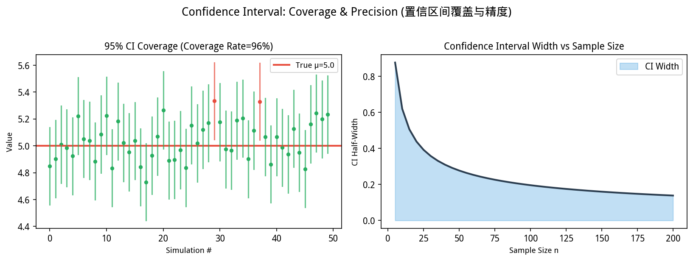
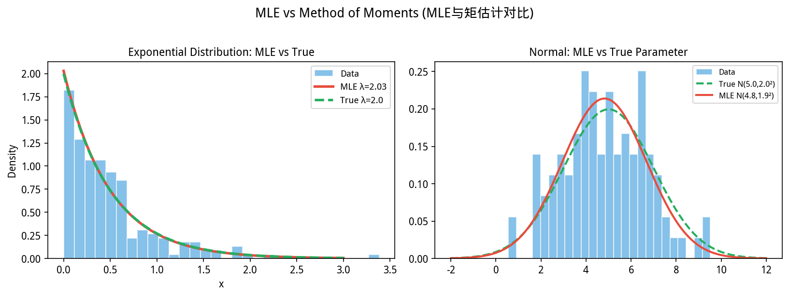
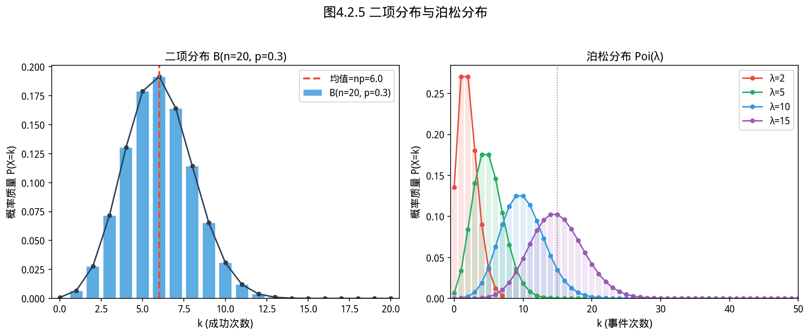
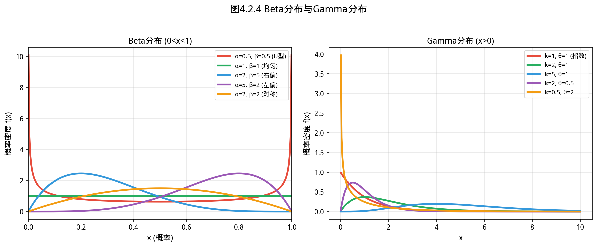
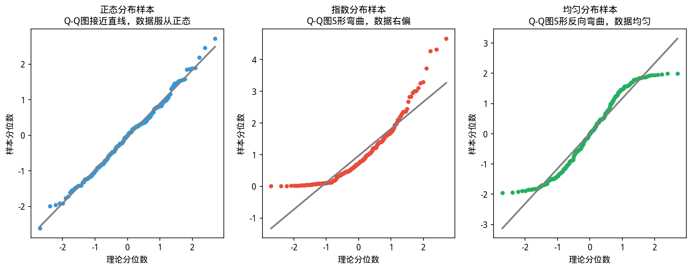
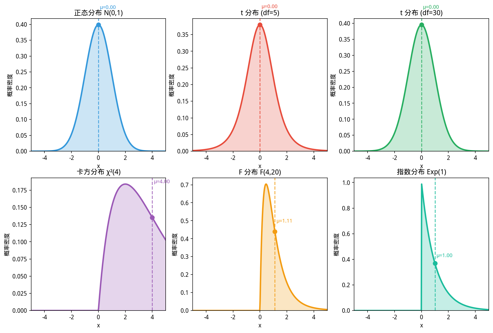
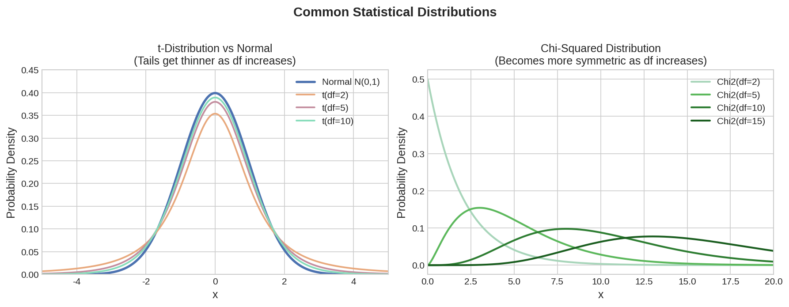
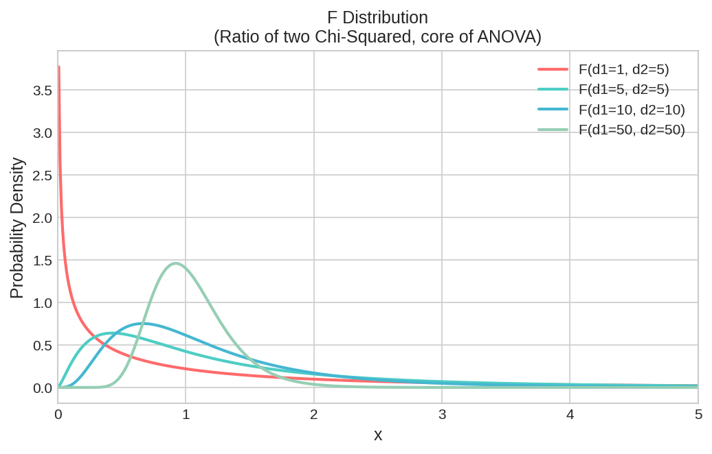
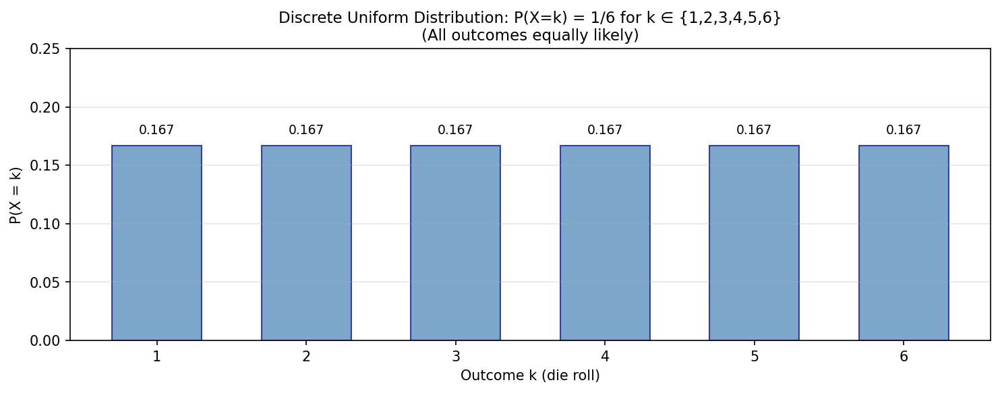

# 4.2 概率分布族 / Probability Distribution Families

如图所示，置信区间覆盖率演示：

*图 new.confidence_interval 置信区间覆盖率演示。重复抽样95%置信区间中约95%包含真实参数(绿色)；不包含的标记红色；右侧显示样本量越大CI越窄、精度越高*

从图中可以看出，置信区间覆盖率演示，95%CI覆盖真实参数。

*图 new.mle_vs_mme MLE vs 矩估计对比。指数分布：λ_mle=1/X̄；正态分布：μ_mle=μ_mme，σ²_mle≠σ²_mme(有偏vs无偏)；两者在分布形式已知时通常首选MLE*

从图中可以看出，MLE与矩估计在指数分布下的差异。
## 开场：面试官问你「这堆数据服从什么分布？」


> **📌 学习目标**
> - 理解点估计（矩估计、最大似然估计）的思想与区别
> - 掌握置信区间的含义——重复抽样的频率解释，不是概率
> - 能用 `Stats.confInterval()` 计算置信区间

你做了一份用户调研报告，交给领导过目。领导翻了翻，问：

> 「这数据是什么分布？正态分布吗？」

你愣了一下：「……应该差不多吧？」

**这个问题的潜台词是：你的数据有什么规律？** 不同分布描述了数据不同的「形状」——是对称的还是偏斜的？有没有厚尾？集中在哪里？

知道数据服从什么分布，才能选对统计方法：
- 数据接近正态分布 → 可以用 t 检验
- 数据是计数（次数） → 通常用泊松分布
- 数据是比例（0~1之间） → 通常用 Beta 分布

本章介绍常见分布的「长相」和「脾气」，让你下次能理直气壮地回答领导的问题。

---

## 4.2.1 连续型分布 / Continuous Distributions

如图所示，二项分布与泊松分布：

*图4.2.1 二项分布与泊松分布。二项B(n,p)描述n次试验成功次数；泊松Poi(λ)是n大p小极限*

从图中可以看出，二项分布与泊松分布。

*图4.2.2 Beta分布与Gamma分布。Beta(α,β)描述0~1之间的概率；Gamma(k,θ)描述正值计数和持续时间*

从图中可以看出，Beta分布与Gamma分布。

*图4.2.3 Q-Q图正态性检验。Q-Q图：如果点在对角线附近，则数据近似正态分布*

从图中可以看出，Q-Q图正态性检验。

*图4.2.4 六种常用分布对比。正态、t、卡方、指数、均匀、泊松等常用分布的形态对比*

连续型随机变量 $X$ 的取值充满某个或某几个区间，其统计规律由**概率密度函数（PDF）** $f(x)$ 描述。

**怎么理解密度函数？** 把 $f(x)$ 想象成一条曲线，曲线越高的地方，数据越容易落在这里。曲线下方的总面积永远等于 1（因为所有结果加起来的概率是 100%）。

$$P(a \leq X \leq b) = \int_a^b f(x)\,dx$$

### 4.2.1.1 正态分布 / Normal Distribution

如图所示，分布对比：正态、t、卡方、F：

*图4.2.5 分布对比：正态、t、卡方、F。正态分布vs t分布（尾部更厚）vs卡方（右偏）vs F分布*

**历史故事：Gauss 为什么选择了正态分布**

高斯（Carl Friedrich Gauss，1777—1855），德国数学家，被认为是有史以来最重要的数学家之一。

1801 年，天文学家发现了一颗新小行星 **谷神星（Ceres）**。但它很快消失在了太阳的光芒里，全世界天文学家都在争论：它下次会出现在天空的哪个位置？

Gauss 用他自己发明的最小二乘法，根据有限的观测数据，预测出了谷神星的位置——而且他预测得相当准确。天文学界为之震动。

为什么最小二乘法有效？Gauss 进一步证明：如果每次观测的误差都服从**同一个正态分布**（即高斯分布），那么最小二乘估计恰好等于**最大似然估计**——这是正态分布在统计推断中地位的数学基础。

实际上，正态分布在自然界如此普遍，一个重要原因是**中心极限定理**（4.1 节）：大量独立小因素叠加的结果，无论每个因素本身是什么分布，叠加后都接近正态分布。现实世界的数据，往往就是无数微小独立因素叠加的产物——所以正态分布无处不在。

正态分布是统计学里名气最大的 distributions——原因不是数学家偏爱它，而是自然界和人类社会里太多数据确实长这样：**身高、测量误差、血压、考试成绩**，都接近正态分布。

**它长什么样？** 就是那个经典的「钟形曲线」——中间最高，两边对称下降，尾巴永远不会碰到零但越来越接近。

**为什么这么常见？** 中心极限定理（4.1 节）告诉我们：大量独立小因素叠加的结果，无论每个因素本身是什么分布，最后都接近正态分布。现实世界里的数据往往是无数小因素叠加的产物——所以正态分布无处不在。

**定义**：若连续型随机变量 $X$ 的概率密度函数为：

$$f(x) = \frac{1}{\sigma\sqrt{2\pi}} \exp\left(-\frac{(x-\mu)^2}{2\sigma^2}\right), \quad -\infty < x < +\infty$$

则称 $X$ 服从**参数为 $(\mu, \sigma^2)$ 的正态分布**，记作 $X \sim N(\mu, \sigma^2)$。

**参数含义**：
- $\mu$：总体均值（位置参数），决定了分布曲线的中心位置
- $\sigma^2$：总体方差（尺度参数），决定了分布曲线的陡峭程度

**数学性质**：
- $E[X] = \mu$，$Var[X] = \sigma^2$
- **线性变换封闭性**：若 $X \sim N(\mu, \sigma^2)$，则 $aX + b \sim N(a\mu + b, a^2\sigma^2)$
- **可加性**：若 $X_1 \sim N(\mu_1, \sigma_1^2)$，$X_2 \sim N(\mu_2, \sigma_2^2)$，且独立，则 $X_1 + X_2 \sim N(\mu_1 + \mu_2, \sigma_1^2 + \sigma_2^2)$

**标准正态分布**：当 $\mu = 0$，$\sigma = 1$ 时，称 $Z \sim N(0, 1)$ 为**标准正态分布**。其密度函数为：

$$\phi(z) = \frac{1}{\sqrt{2\pi}} e^{-z^2/2}$$

任意正态变量 $X \sim N(\mu, \sigma^2)$ 可通过**标准化变换** $Z = (X - \mu) / \sigma$ 转化为标准正态变量。

**应用场景**：
- 自然科学和社会科学中大量连续变量的建模
- CLT 表明大量独立小因素之和近似正态分布
- 测量误差建模
- 质量控制中的过程监控

**YiShape-Math 实现**：

```java
import com.yishape.lab.math.stats.Stats;
import com.yishape.lab.math.stats.distribution.NormalDistribution;

public class NormalDistributionDemo {
    public static void main(String[] args) {
        // 创建正态分布 N(μ=170, σ²=100)
        double mu = 170.0;    // cm（成年人身高）
        double sigma = 10.0;  // cm
        NormalDistribution heightDist = Stats.norm(mu, sigma);

        System.out.println("=== 正态分布示例：成年人身高建模 ===");
        System.out.printf("分布: N(μ=%.1f, σ²=%.1f)%n%n", mu, sigma * sigma);

        // 计算概率 P(160 < X < 180)
        double p = heightDist.cdf(180) - heightDist.cdf(160);
        System.out.printf("P(160 < X < 180) = %.4f%n", p);

        // 计算身高对应的百分位数
        double[] percentiles = {0.1, 0.25, 0.5, 0.75, 0.9};
        System.out.println("\n百分位数（身高 cm）:");
        for (double q : percentiles) {
            System.out.printf("  P(X ≤ x) = %.0f%% → x = %.2f cm%n", q * 100, heightDist.ppf(q));
        }

        // 随机采样(distribution.sample(n) 返回 double[])
        System.out.println("\n随机采样（10个样本）:");
        double[] samples = heightDist.sample(10);
        for (int i = 0; i < samples.length; i++) {
            System.out.printf("  样本%d: %.2f cm%n", i + 1, samples[i]);
        }
    }
}
```

**运行结果**：
```
=== 正态分布示例：成年人身高建模 ===
分布: N(μ=170.0, σ²=100.0)

P(160 < X < 180) = 0.6827
百分位数（身高 cm）:
  P(X ≤ x) = 10% → x = 157.15 cm
  P(X ≤ x) = 25% → x = 163.26 cm
  P(X ≤ x) = 50% → x = 170.00 cm
  P(X ≤ x) = 75% → x = 176.74 cm
  P(X ≤ x) = 90% → x = 182.85 cm

随机采样（10个样本）:
  样本1: 172.34 cm
  样本2: 165.21 cm
  ...
```

### 4.2.1.2 t 分布 / Student's t Distribution

**历史故事：酿酒师的意外发明**

你知道「Student's t 分布」里的「Student」是谁吗？

他叫 **William Gosset**（1876—1937），是英国伦敦 Guinness 啤酒厂的化学技师。

1906 年，Guinness 面临一个现实问题：啤酒质量检验不能用太多原料——每次只能抽 **3 到 4 瓶** 做实验。样本量这么小，用正态分布算出来的置信区间根本不可靠。

Gosset 没有把这当成理论问题抛给数学家——他自己在实验室里推公式，发现了一个新的分布：**在样本量小时，这个分布比正态分布的尾巴更厚，反映了小样本的额外不确定性。**

他把这个结果写成论文，想发表。但 Guinness 禁止员工对外发表商业研究——Gosset 只好用「Student」这个笔名偷偷发表。**这就是统计学历史上最著名的匿名发表。**

Fisher 后来重新发现了这个分布的数学性质，并把它命名为「t 分布」。今天，t 检验是 small sample 统计推断的标准工具——它的诞生，来自一个酿酒厂化学技师为了省原料的真实需求。

**直观理解**：当你知道了样本均值 $\bar{X}$，但不知道总体标准差 $\sigma$，只能用样本标准差 $S$ 代替时，「$\frac{\bar{X} - \mu}{S/\sqrt{n}}$」这个统计量不再精确服从正态分布，而是服从 **t 分布**——它比正态分布有更厚的尾巴（不确定性更大），样本量越小，尾巴越厚。

随着样本量增大，t 分布越来越接近正态分布（$n \geq 30$ 时，二者几乎无法区分）。这就是为什么 4.3 节的假设检验里，样本量小的时候要用 t 分布而不是正态分布。

**定义**：若连续型随机变量 $T$ 的概率密度函数为：

$$f(t) = \frac{\Gamma\left(\frac{\nu+1}{2}\right)}{\sqrt{\nu\pi}\,\Gamma\left(\frac{\nu}{2}\right)} \left(1 + \frac{t^2}{\nu}\right)^{-\frac{\nu+1}{2}}, \quad -\infty < t < +\infty$$

则称 $T$ 服从**自由度为 $\nu$ 的 t 分布**，记作 $T \sim t(\nu)$。

**数学性质**：
- $E[T] = 0$（当 $\nu > 1$ 时）
- $Var[T] = \frac{\nu}{\nu - 2}$（当 $\nu > 2$ 时）
- 随着 $\nu \to \infty$，$t(\nu) \to N(0, 1)$

**与正态分布的关系**：t 分布可以理解为"正态分布 + 随机噪声"——当用样本标准差 $S$ 替代总体标准差 $\sigma$ 时，统计量 $\frac{\bar{X} - \mu}{S/\sqrt{n}}$ 不再精确服从 $N(0,1)$，而服从 $t(n-1)$。自由度越小，t 分布的尾部越厚。

**应用场景**：
- 总体方差未知时的小样本均值推断（$n < 30$）
- 回归系数的显著性检验
- 配对样本的差异检验

```java
// t 分布在参数估计中的应用
StudentDistribution tDist = Stats.t(19);  // n=20, df=n-1=19
double criticalValue = tDist.ppf(0.975);  // 双侧95%置信水平的临界值
System.out.printf("t(19).ppf(0.975) = %.4f%n", criticalValue);
// 输出: t(19).ppf(0.975) = 2.0930
// 相比 N(0,1).ppf(0.975) = 1.9600，t分布的临界值更大
```

### 4.2.1.3 卡方分布 / Chi-Squared Distribution

**历史故事：Karl Pearson 的双面遗产**

Karl Pearson（1857—1936）被公认为现代统计学的奠基人之一。他提出了相关系数、卡方检验，创立了《Biometrika》杂志——这些贡献至今仍是统计学的核心工具。

但 Pearson 同时是一个狂热的优生学倡导者。他收集了大量数据，试图用统计学证明某些人群「天生优于」其他人群。这些研究在今天被彻底否定，统计学工具被滥用于种族歧视的目的。

这段历史提醒我们：**统计方法是中性的，但研究者有价值观。工具的强大不等于目的的正确。** 了解这段背景，有助于我们在看到统计数据时多问一句「谁在统计，为什么统计」。

卡方分布作为统计工具本身是客观的——它用来检验观测频数与期望频数之间的差异。

**直观理解**：卡方分布描述的是「多个标准正态随机变量平方和」的分布。$Z_1^2 + Z_2^2 + \cdots + Z_k^2 \sim \chi^2(k)$——$k$ 个独立的标准正态（均值 0，标准差 1）随机变量，各自平方后加起来。

**为什么有用？** 样本方差 $S^2$ 的分子 $\sum (X_i - \bar{X})^2$ 除以总体方差 $\sigma^2$ 就服从卡方分布——所以卡方分布是「用样本推断总体方差」的理论基础。自由度 $k$ 就是 $n-1$（因为受均值约束丢掉了一个自由度）。

**定义**：若连续型随机变量 $X^2$ 的概率密度函数为：

$$f(x) = \frac{1}{2^{k/2}\Gamma(k/2)} x^{k/2-1} e^{-x/2}, \quad x > 0$$

则称 $X^2$ 服从**自由度为 $k$ 的卡方分布**，记作 $X^2 \sim \chi^2(k)$。

**数学性质**：
- $E[X^2] = k$，$Var[X^2] = 2k$
- **可加性**：若独立，$\chi^2(k_1) + \chi^2(k_2) \sim \chi^2(k_1 + k_2)$
- 卡方分布是**右偏**的，随着自由度增大，分布渐近对称

**应用场景**：
- 总体方差的区间估计和假设检验
- 分类数据的拟合优度检验
- 独立性检验（列联表分析）
- 方差分析（ANOVA）

```java
// 卡方分布在方差推断中的应用
Chi2Distribution chi2 = Stats.chi2(19);  // df = n - 1 = 19
double[] ci = {
    chi2.ppf(0.025),   // χ²(19).ppf(0.025) ≈ 8.91
    chi2.ppf(0.975)    // χ²(19).ppf(0.975) ≈ 32.85
};
System.out.printf("95%%置信区间临界值: [%.2f, %.2f]%n", ci[0], ci[1]);
```

### 4.2.1.4 F 分布 / F Distribution

**历史故事：Fisher 与 Rothamsted 庄园的麦子**

Ronald Fisher（1890—1962），英国统计学家和遗传学家。1920 年代，他在伦敦北部的 Rothamsted 实验站工作，面对的问题是：同样的肥料、同样的土地，为什么每年产量不一样？哪些差异是真实有效的，哪些只是随机波动？

他在分析这些农业数据时发明了 ANOVA（方差分析），核心思想是把「组间差异」和「组内随机差异」分开，看前者是否大到不能被后者解释。ANOVA 的检验统计量服从 F 分布——由两个卡方分布的比值构成。

**直观理解**：F 分布是「两个卡方分布之比」：
$$\frac{\chi^2_1 / d_1}{\chi^2_2 / d_2} \sim F(d_1, d_2)$$


*图4.2.6 F分布的概率密度函数。F分布是两个卡方变量的比值；用于方差分析*

**为什么有用？** 4.4 节的 ANOVA 要比较三组的方差有没有显著差异——F 分布就是干这个的：组间方差除以组内方差，比值服从 F 分布。如果比值太大，说明组间差异大于随机波动，应该显著。

**定义**：若连续型随机变量 $F$ 的概率密度函数为：

$$f(f) = \frac{\Gamma\left(\frac{d_1+d_2}{2}\right)}{\Gamma(d_1/2)\Gamma(d_2/2)} \left(\frac{d_1}{d_2}\right)^{d_1/2} f^{d_1/2-1} \left(1 + \frac{d_1 f}{d_2}\right)^{-\frac{d_1+d_2}{2}}, \quad f > 0$$

则称 $F$ 服从**分子自由度为 $d_1$，分母自由度为 $d_2$ 的 F 分布**，记作 $F \sim F(d_1, d_2)$。

**数学性质**：
- $E[F] = \frac{d_2}{d_2 - 2}$（当 $d_2 > 2$ 时）
- 若 $F \sim F(d_1, d_2)$，则 $1/F \sim F(d_2, d_1)$
- F 分布是**右偏**的，取值范围 $(0, +\infty)$

**应用场景**：
- 两总体方差齐性检验
- 方差分析（ANOVA）
- 回归方程整体显著性检验
- 多元统计分析中的 Wilks' Lambda

### 4.2.1.5 其他连续型分布 / Other Continuous Distributions

**均匀分布 $U(a, b)$**：等概率地取值为 $[a, b]$ 区间内任意值。用于蒙特卡洛模拟、随机数生成器的基础。

**指数分布 $Exp(\lambda)$**：描述泊松过程中事件间隔的分布，具有**无记忆性**：$P(X > s + t \mid X > s) = P(X > t)$。用于可靠性分析、排队论。

**Gamma 分布 $Gamma(\alpha, \beta)$**：包含指数分布（$\alpha=1$）和卡方分布（$\alpha=\nu/2, \beta=1/2$）作为特例。用于等待时间建模、可靠性分析。

**Beta 分布 $Beta(\alpha, \beta)$**：定义在 $[0,1]$ 区间上的分布，常用作二项比例的先验分布。贝叶斯统计中作为共轭先验广泛应用。

---

## 4.2.2 离散型分布 / Discrete Distributions

离散型随机变量 $X$ 的取值是可数个点，其统计规律由**概率质量函数（PMF）** $P(X = x)$ 描述：

$$P(X = x_k) = p_k, \quad \sum_{k} p_k = 1$$

### 4.2.2.1 伯努利分布 / Bernoulli Distribution

**定义**：若离散型随机变量 $X$ 只取两个值 $0$（失败）和 $1$（成功），且：

$$P(X = 1) = p, \quad P(X = 0) = 1 - p$$

则称 $X$ 服从**成功概率为 $p$ 的伯努利分布**，记作 $X \sim Ber(p)$。

**数学性质**：
- $E[X] = p$
- $Var[X] = p(1-p)$

**应用场景**：最基础的离散分布，描述单次二分类试验的结果。

```java
// 伯努利分布在质量检测中的应用
BernoulliDistribution defect = Stats.bernoulli(0.02);  // 2%次品率
double probNoDefect = defect.cdf(0);  // P(X ≤ 0) = P(无缺陷) = 0.98
System.out.printf("检测到0个缺陷的概率: %.4f%n", probNoDefect);
```

### 4.2.2.2 二项分布 / Binomial Distribution

**定义**：若离散型随机变量 $X$ 表示 $n$ 次独立伯努利试验中成功的次数，且：

$$P(X = k) = \binom{n}{k} p^k (1-p)^{n-k}, \quad k = 0, 1, 2, \ldots, n$$

则称 $X$ 服从**参数为 $(n, p)$ 的二项分布**，记作 $X \sim B(n, p)$。

**数学性质**：
- $E[X] = np$
- $Var[X] = np(1-p)$
- **可加性**：若 $X_1 \sim B(n_1, p)$，$X_2 \sim B(n_2, p)$，且独立，则 $X_1 + X_2 \sim B(n_1 + n_2, p)$
- 当 $n$ 很大、$p$ 很小时，二项分布可用泊松分布近似

**应用场景**：
- 质量控制：检测一批产品中的缺陷数
- 市场调研：调查中的支持人数
- 医学试验：治疗组中的有效人数

```java
// 二项分布在质量控制中的应用
BinomialDistribution defects = Stats.binomial(100, 0.02);  // n=100, p=2%
System.out.println("=== 二项分布示例：批量质检 ===");
System.out.printf("分布: B(n=100, p=0.02)%n%n");

// 计算不同缺陷数的概率
System.out.println("缺陷数 k 的概率分布:");
for (int k = 0; k <= 6; k++) {
    System.out.printf("  P(X = %d) = %.4f%n", k, defects.pmf(k));
}

// 计算至少发现3个缺陷的概率
double pAtLeast3 = 1.0 - defects.cdf(2);
System.out.printf("%nP(X ≥ 3) = %.4f%n", pAtLeast3);
```

### 4.2.2.3 泊松分布 / Poisson Distribution

**定义**：若离散型随机变量 $X$ 的取值为非负整数，且：

$$P(X = k) = \frac{\lambda^k e^{-\lambda}}{k!}, \quad k = 0, 1, 2, \ldots$$

则称 $X$ 服从**参数为 $\lambda$ 的泊松分布**，记作 $X \sim P(\lambda)$。

**数学性质**：
- $E[X] = \lambda$
- $Var[X] = \lambda$（方差等于均值）
- 泊松分布描述**稀有事件**在固定时间/空间内的发生次数

**与二项分布的关系**：
- 二项分布 $B(n, p)$ 当 $n \to \infty$，$p \to 0$，$np = \lambda$ 固定时，趋近于 $P(\lambda)$
- 这一关系称为**泊松近似**，在实际中用于简化计算

**应用场景**：
- 单位时间内电话呼叫次数
- 单位面积内随机分布的细菌数
- 放射性衰变计数
- 交通流量分析

```java
// 泊松分布在事件计数中的应用
PoissonDistribution calls = Stats.poisson(5.0);  // 平均每小时5次呼叫
System.out.println("=== 泊松分布示例：呼叫中心 ===");
System.out.printf("分布: P(λ=%.1f) - 平均每小时5次呼叫%n%n", 5.0);

// 计算概率
System.out.println("呼叫次数 k 的概率分布:");
for (int k = 0; k <= 10; k++) {
    System.out.printf("  P(X = %2d) = %.4f%n", k, calls.pmf(k));
}

// 计算"电话占线"概率（1小时内超过10次呼叫）
double pOverload = 1.0 - calls.cdf(10);
System.out.printf("%nP(X > 10) = %.4f (需要增加接线员的概率)%n", pOverload);
```

### 4.2.2.4 其他离散型分布 / Other Discrete Distributions

**几何分布 $Geometric(p)$**：首次成功所需的试验次数。应用：可靠性分析、排队论。

**负二项分布 $NB(r, p)$**：第 $r$ 次成功所需的试验次数。应用：过度分散计数数据建模。

**离散均匀分布 $DU(a, b)$**：在整数集合 $\{a, a+1, \ldots, b\}$ 上等概率取值。应用：随机数生成、游戏设计。



*图 new.fig_discrete_uniform 离散均匀分布DU(a,b)：整数集合{a,...,b}上等概率取值。*

---

## 4.2.3 统一接口设计 / Unified Interface Design

YiShape-Math 的概率分布采用**接口 + 实现**的面向对象设计，确保 API 一致性：

```java
// 连续型分布接口(实际使用 double,不是 float)
public interface IContinuousDistribution {
    double pdf(double x);          // 概率密度函数
    double cdf(double x);          // 累积分布函数
    double ppf(double p);          // 百分点函数(逆CDF)
    double mean();                 // 期望值
    double var();                  // 方差
    double[] sample(int n);        // 随机采样
}

// 离散型分布接口
public interface IDiscreteDistribution {
    double pmf(int k);             // 概率质量函数
    double cdf(int k);             // 累积分布函数
    int ppf(double p);             // 百分点函数(离散分位数返回 int)
    double mean();                 // 期望值
    double var();                  // 方差
    int[] sample(int n);           // 随机采样
}
```

**工厂模式**：通过 `Stats` 工厂类统一创建分布对象：

```java
// 创建各种分布的简洁方式
NormalDistribution norm = Stats.norm(0, 1);           // N(0,1)
StudentDistribution t = Stats.t(10);                   // t(10)
Chi2Distribution chi2 = Stats.chi2(5);               // χ²(5)
FDistribution f = Stats.f(3, 20);                    // F(3,20)
PoissonDistribution poisson = Stats.poisson(3.5);   // P(λ=3.5)
```

---

## 4.2.4 分布选择指南 / Distribution Selection Guide

### 连续型变量建模

| 数据特征 | 推荐分布 | 参数说明 |
|----------|----------|----------|
| 对称、钟形，大量独立因素叠加 | 正态分布 $N(\mu, \sigma^2)$ | $\mu$: 均值，$\sigma^2$: 方差 |
| 非负、有恒定风险率 | 指数分布 $Exp(\lambda)$ | $\lambda$: 速率 |
| 非负、右偏、可变形状 | Gamma $Gamma(\alpha, \beta)$ | $\alpha$: 形状，$\beta$: 尺度 |
| 取值在 [0,1] 区间内 | Beta $Beta(\alpha, \beta)$ | $\alpha,\beta$: 形状 |
| 等概率在区间内取值 | 均匀分布 $U(a, b)$ | $a,b$: 上下界 |

### 离散型变量建模

| 数据特征 | 推荐分布 | 参数说明 |
|----------|----------|----------|
| 单次二分类结果 | 伯努利 $Ber(p)$ | $p$: 成功概率 |
| 固定次数试验中的成功数 | 二项分布 $B(n, p)$ | $n$: 试验次数，$p$: 单次成功概率 |
| 稀有事件计数 | 泊松分布 $P(\lambda)$ | $\lambda$: 平均发生率 |
| 首次成功所需的试验次数 | 几何分布 $Geometric(p)$ | $p$: 成功概率 |
| 第 r 次成功所需的试验次数 | 负二项分布 $NB(r, p)$ | $r$: 成功次数，$p$: 单次成功概率 |

---

## 4.2.5 本节 API 一览

| 分布 | 工厂方法 | PDF/CDF/PPF | 抽样 |
|------|---------|------------|------|
| 正态 $N(\mu,\sigma^2)$ | `Stats.norm()` / `Stats.norm(mu, sigma)` | `dist.pdf(x)` / `dist.cdf(x)` / `dist.ppf(q)` | `dist.sample(n)` |
| t 分布 | `Stats.t(df)` / `Stats.t(df, loc, scale)` | 同上 | 同上 |
| 卡方 $\chi^2(k)$ | `Stats.chi2(df)` | 同上 | 同上 |
| F 分布 | `Stats.f(d1, d2)` | 同上 | 同上 |
| 均匀 $U(a,b)$ | `Stats.uniform(a, b)` | 同上 | 同上 |
| 指数 $Exp(\lambda)$ | `Stats.exponential(rate)` | 同上 | 同上 |
| Beta $Beta(\alpha,\beta)$ | `Stats.beta(alpha, beta)` | 同上 | 同上 |
| Gamma $Gamma(\alpha,\beta)$ | `Stats.gamma(alpha, beta)` | 同上 | 同上 |
| 伯努利 $Ber(p)$ | `Stats.bernoulli(p)` | `dist.pmf(k)` / `dist.cdf(k)` | `dist.sample(n)` 返回 `int[]` |
| 二项 $B(n,p)$ | `Stats.binomial(n, p)` | 同上 | 同上 |
| 泊松 $Poi(\lambda)$ | `Stats.poisson(lambda)` | 同上 | 同上 |
| 几何 $Geo(p)$ | `Stats.geometric(p)` | 同上 | 同上 |
| 负二项 $NB(r,p)$ | `Stats.negativeBinomial(r, p)` | 同上 | 同上 |
| 离散均匀 | `Stats.discreteUniform(a, b)` / `Stats.discreteUniform(n)` | 同上 | 同上 |
| 参数估计 | `Stats.estimator.estimateMeanIntevalWithT(sample, conf)` | 见 4.2.6 节 | — |

> ⚠️ **不存在的 API**:
> - `Stats.normPdf(x, mu, sigma)` / `Stats.normCdf(x, mu, sigma)` / `Stats.normSample(mu, sigma, n)`——本库没有这种「打平的」全局函数,所有分布运算都走 `dist.pdf(x)` 等**实例方法**。
> - `Stats.tDistPdf(...)` / `Stats.chiSqPdf(...)` / `Stats.fDistPdf(...)`——工厂方法名为 `Stats.t(df)` / `Stats.chi2(df)` / `Stats.f(d1, d2)`,不是 `tDist` / `chiSq` / `fDist`。
> - `Stats.normMle(data)` / `Stats.expMle(data)`——库未提供专门的 MLE 接口;正态分布的 MLE 等于矩估计 $(\bar x, s^2)$,可直接用 `vec.mean()` 和 `vec.var()`;指数 MLE $\hat\lambda = 1/\bar x$ 也是一行表达式。
> - `Stats.variancePop(data)`——本库的 `vec.var()` 默认使用 $n-1$ 自由度(无偏),没有「总体方差」版本;若确需 $\frac{1}{n}\sum(x-\bar x)^2$,自行 `vec.var() * (n-1) / n`。

> **分布选择**:数据近似正态+小样本 → t 分布;计数数据 → 卡方;方差比 → F 分布。

## 4.2.6 章节练习 / Exercises

**1. 置信区间的频率学派解释（概念题）**

某调查公司报告：「我们有 95% 的把握，中国网民中支持某政策的比例在 61.2% 到 64.8% 之间（基于 $n=2000$ 的随机抽样调查）。」

（a）上述说法在频率学派和贝叶斯学派中分别应如何解读？

（b）如果重复抽样调查 100 次，每次用相同方法构建 95% 置信区间，大约有多少个区间会包含真实的支持率？

（c）以下哪种说法是**错误的**？
> A. 「有 95% 的概率真实支持率落在 61.2%-64.8% 之间」  
> B. 「置信区间是随机区间，不是固定区间」  
> C. 「置信水平 95% 意味着如果大量重复实验，约 95% 的置信区间会覆盖真实参数」

**2. MLE 推导：指数分布参数（推导题）**

设 $n$ 个样本 $x_1, \ldots, x_n$ 来自参数为 $\lambda$ 的指数分布 $f(x;\lambda) = \lambda e^{-\lambda x}$（$x \geq 0$）。

（a）写出对数似然函数 $\ell(\lambda) = \log L(\lambda)$。

（b）对 $\ell(\lambda)$ 求导并令其为零，求 $\lambda$ 的最大似然估计（MLE）$\hat{\lambda}$。

（c）验证二阶导数 $\frac{\partial^2 \ell}{\partial \lambda^2} < 0$（即确认是极大值而非极小值）。

**3. 矩估计 vs MLE 对比（计算题）**

设 $n=100$ 的样本来自均匀分布 $U(0, \theta)$，样本值为：$\{x_1, x_2, \ldots, x_n\}$。

（a）用矩估计法求 $\hat{\theta}_{\text{mom}}$（提示：$E[X] = \theta/2$）。

（b）用最大似然估计法求 $\hat{\theta}_{\text{MLE}}$（提示：MLE 倾向于选择能覆盖所有样本的最小上界）。

（c）如果样本最大值 $\max(x_i) = 87.3$，分别计算两种估计量的具体数值。


---

> **⚠️ 常见误区**
> - **置信区间不是「参数有 95% 概率落在这个范围内」**：置信区间是频率学派概念——如果重复抽样 100 次，构建 100 个置信区间，大约有 95 个会包含真实参数值。但对于当前这一个区间，它要么包含了，要么没有，不能说「有 95% 概率包含」。
> - **大样本时不检查正态性**：中心极限定理说样本均值渐近正态，但样本中位数、样本分位数等不一定。置信区间的可靠性仍需检验。（相关：第 4 章假设检验依赖分布函数；第 5 章分类模型的概率输出依赖 Logistic 分布。）

---
## 4.2.7 本节小结 / Section Summary

本节系统介绍了 YiShape-Math 中实现的概率分布体系：

1. **连续型分布**：正态分布是核心，$t$、$\chi^2$、$F$ 三大抽样分布在统计推断中各有其不可替代的作用。

2. **离散型分布**：伯努利分布是基础，二项分布和泊松分布分别适用于不同类型的计数数据建模。

3. **统一接口设计**：通过 `IContinuousDistribution` 和 `IDiscreteDistribution` 接口，实现了 API 的一致性，降低了学习成本。

> **承上启下**：掌握各分布的数学性质是正确选择模型的前提。下一节将利用这些分布进行**参数估计**——如何用样本数据推断总体参数。


