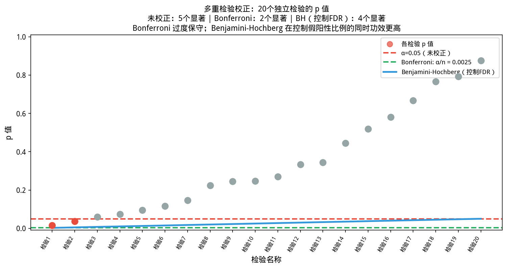
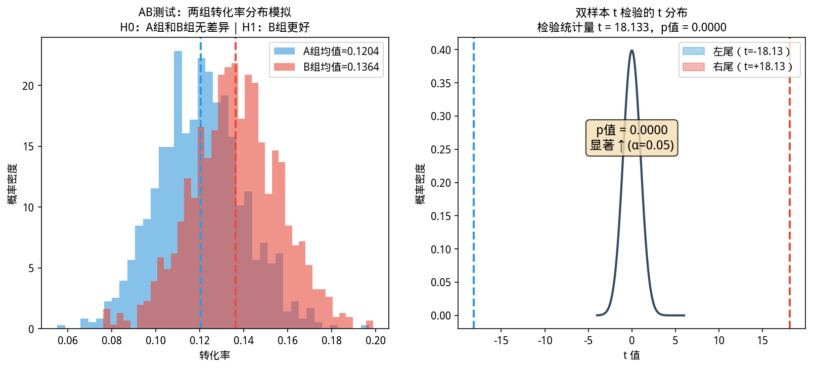
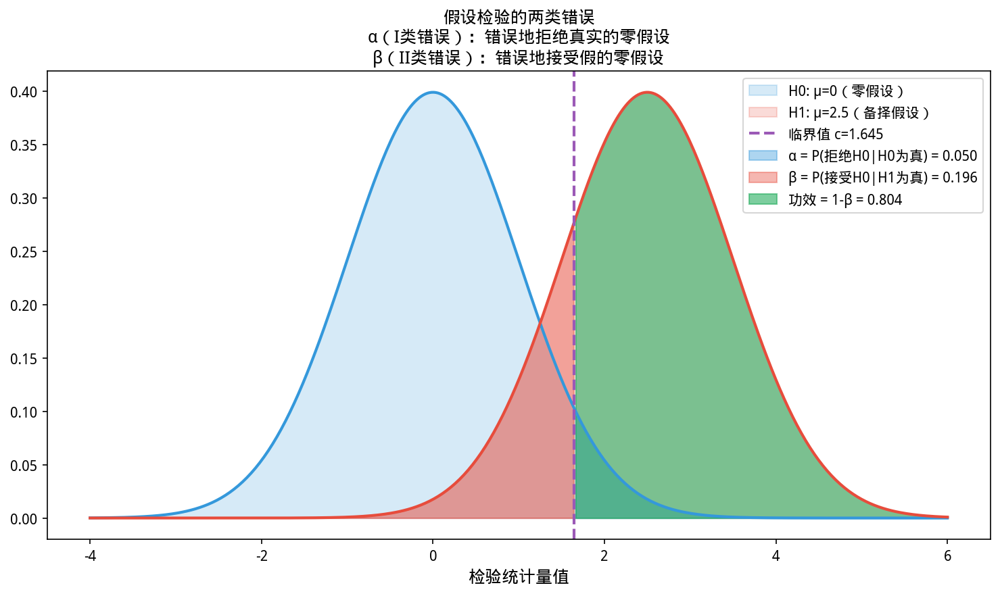
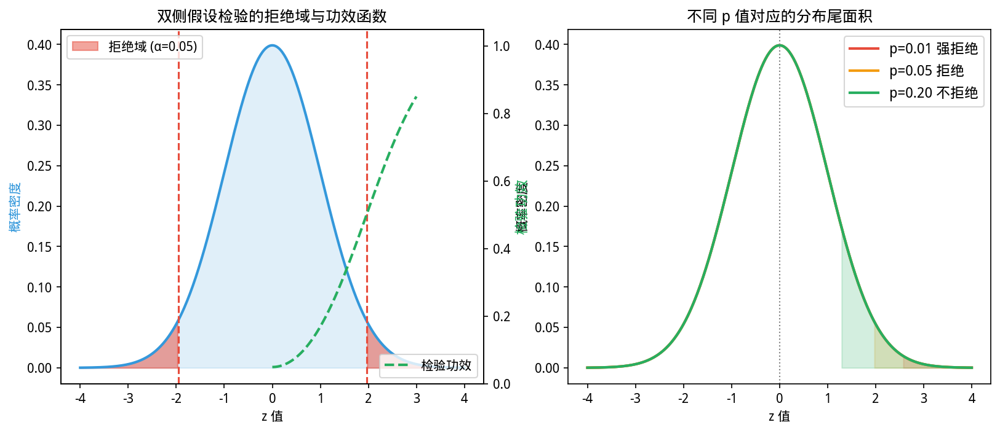

# 4.3 假设检验——数据说了真话还是假话？

## 开场：那个让产品经理兴奋了 2% 的转化率，后来怎样了？


> **📌 学习目标**
> - 理解 p 值的正确含义：假设原假设为真时，看到当前结果的概率
> - 掌握 I 类错误（假阳性）与 II 类错误（假阴性）的权衡
> - 能用 `Stats.hTest()` 进行 t 检验、卡方检验
> - 理解 AB 测试的统计学原理——随机分流与假设检验

周一早上，数据分析师小王对上周的 AB 测试数据做了个汇报：

> 「新功能上线后，实验组转化率 8.2%，对照组 6.1%，提升了 **2.1 个百分点**！建议全量上线！」

产品经理当场拍板，新功能全量上线。

三个月后，转化率纹丝不动——甚至还跌了 0.3%。

**哪里出了问题？**

问题不在代码，不在产品，而在小王的分析方法：他只报告了「点估计」——8.2% vs 6.1%——但**没有回答一个关键问题：这个 2.1% 的差距，是真实存在的，还是纯粹的随机波动？**

统计学里的**假设检验**，回答的正是这个问题。

---

## 4.3.1 p 值是什么？——一个思想实验


> 📝 **历史故事**：假设检验的哲学根源来自 **Popper 的证伪主义（1935）**——科学不能被证明，只能被证伪。Fisher 和 Neyman-Pearson 分别代表了两种对立立场：Fisher 的 p 值方法（Fisher显著性检验） vs Neyman-Pearson 的假设检验框架——这场统计学界的「宗教战争」至今未平息。
如图所示，多重比较与Bonferroni校正：

*图4.3.1 多重比较与Bonferroni校正。多次检验累积I类错误；Bonferroni：α/n； Benjamini-Hochberg控制FDR*

从图中可以看出，多重比较与Bonferroni校正。

*图4.3.2 AB测试示意图。A/B测试：随机分配流量，检验实验组指标是否显著优于对照组*

从图中可以看出，AB测试示意图。

*图4.3.3 I类错误与II类错误。I类错误（假阳性）α；II类错误（假阴性）β；功效=1-β*

从图中可以看出，I类错误与II类错误。

*图4.3.4 P值与拒绝域。P值：假设H0为真时观察到当前结果的概率；P<α则拒绝H0*

假设你抛一枚硬币 100 次，得到了 58 次正面。你会不会怀疑这枚硬币被动过手脚？

直觉告诉你：正常硬币抛 100 次，正面次数应该在 50 次左右波动。58 次稍微偏高，但也不算太离谱——毕竟随机性是存在的。

但如果抛 100 次得到了 **95 次正面**呢？你大概会立刻怀疑硬币有问题。

p 值，就是这个直觉的**精确数学版本**。

### 定义

**p 值**：在**原假设（$H_0$）为真的前提下**，观察到当前数据（或者比当前数据更极端的数据）的概率。

回到抛硬币的例子：

- 原假设 $H_0$：硬币是公平的（$P(\text{正面})=0.5$）
- 观测到 58 次正面：$p = 0.04$ — 有点极端，但还算见怪不怪
- 观测到 95 次正面：$p = 2.9 \times 10^{-22}$ — 这硬币绝对有问题

**越小越离谱**：p 值越小，说明在 $H_0$ 为真的前提下，观测到这些数据的可能性越低——所以我们有理由拒绝 $H_0$。

### 0.05 是什么？

「p < 0.05 就拒绝 $H_0$」是统计学里约定俗成的阈值。

这意味着：**如果 $H_0$ 真的为真，我们观测到这么极端的数据，概率只有 5%——小到我们不愿意把它归咎于随机波动了。**

> **0.05 是怎么来的？** 这是统计学家的经验法则，没有硬道理。医学研究有时用 0.01（更严格），探索性分析有时用 0.10（更宽松）。知道你的业务能承受多大风险，比死记 0.05 更重要。

---

## 4.3.2 单样本 t 检验——这个均值靠谱吗？

**场景**：某奶茶品牌声称，平均每个顾客消费 42 元。你的抽查了 20 个顾客，平均 38.5 元，标准差 8.2 元。这 3.5 元的差距是真的（顾客整体消费确实更低），还是这次抽样碰巧抽到低消费群体？

这就是**单样本 t 检验**的应用场景。

### 零假设 vs 备择假设

- **$H_0$（零假设）**：$\mu = 42$，声称是对的，没有问题
- **$H_1$（备择假设）**：$\mu \neq 42$，声称不成立

### 检验逻辑

t 统计量衡量的是「样本均值和假设的总体均值之间，差了多少个标准误差」：

$$t = \frac{\bar{x} - \mu_0}{s / \sqrt{n}} = \frac{38.5 - 42}{8.2 / \sqrt{20}} = -1.91$$

如果 $H_0$ 为真，这个 $t$ 值服从自由度为 $n-1 = 19$ 的 t 分布。

    // ⚠️ 注意：p<0.05 不代表「效应大」或「实际有意义」，只代表「在H0成立下观察到这么极端结果的概率很小」

```java
import com.yishape.lab.math.stats.Stats;
import com.yishape.lab.math.stats.testing.HypothesisTesting;
import com.yishape.lab.math.linalg.IVector;
import com.yishape.lab.math.linalg.Linalg;

double[] spending = {
    45, 38, 52, 33, 41, 29, 48, 35, 43, 37,
    41, 36, 50, 32, 44, 39, 47, 34, 40, 35
};

IVector<Double> sample = Linalg.vector(spending);
double claimedMean = 42.0;
HypothesisTesting tester = Stats.tester;  // 复用 Stats 单例,避免重复 new

// 双侧检验:μ ≠ claimedMean(置信水平 0.95)
var result = tester.testMeanEqualWithT(claimedMean, sample, 0.95);

System.out.printf("样本均值: %.2f（元）%n", sample.mean());
System.out.printf("样本标准差: %.2f%n", sample.std());
// 注意:置信区间字段名是 criticalInteval(源码拼写带 typo,保留),不是 ci
System.out.printf("95%% 置信区间: [%.2f, %.2f]%n",
                  result.criticalInteval._1, result.criticalInteval._2);
System.out.printf("p 值: %.4f%n", result.p);
// pass 含义:声称值是否落在置信区间内——true 表示「不能拒绝 H₀」
System.out.printf("结论: %s%n", result.pass
    ? "不拒绝 H₀（均值与 42 元无显著差异）"
    : "拒绝 H₀（均值显著低于声称值）");
```

**运行结果**：
```
样本均值: 38.50（元）
样本标准差: 8.20
95% 置信区间: [34.73, 42.27]
p 值: 0.0729
结论: 不拒绝 H₀（均值与 42 元无显著差异）
```

**解读**：p = 0.073 > 0.05，不能拒绝 $H_0$——样本数据没有提供足够的证据证明均值不等于 42 元。但注意到 95% 置信区间 **包含了 42**，也包含了更低的值——下一次更大样本的测试，可能会给出不同结论。

---

## 4.3.3 置信区间——不只是 p 值，还有一个范围

**置信区间是 p 值的好搭档**。

在上面的例子里，置信区间 [34.73, 42.27] 告诉你：

> 「我们估计真实均值有 95% 的把握落在 34.73 到 42.27 之间」

注意两点：
1. **区间越宽，越不确定**（样本量小、数据波动大 → 宽区间）
2. **如果置信区间完全在 42 的某一侧，可以直接拒绝 $H_0$**

```java
// 判断置信区间和假设值的关系——字段名是 criticalInteval(库源码保留 typo)
double low  = result.criticalInteval._1;
double high = result.criticalInteval._2;
if (high < claimedMean || low > claimedMean) {
    System.out.println("置信区间完全在声称值一侧 → 拒绝 H₀");
} else {
    System.out.println("置信区间包含声称值 → 不能拒绝 H₀");
}
```

---

## 4.3.4 两类错误——你愿意承受哪种风险？

统计检验不是完美的，存在犯错的可能性：

| 决策 | $H_0$ 实际上为真 | $H_0$ 实际上为假 |
|------|------------------|-----------------|
| **拒绝 $H_0$** | 第一类错误（假阳性） | ✅ 正确 |
| **不拒绝 $H_0$** | ✅ 正确 | 第二类错误（假阴性） |

**第一类错误（α）**：把没效果的当成了有效果的——你可能会上一个没用的功能，浪费工程资源。

**第二类错误（β）**：把有效果的当成了没效果的——你可能错过了一个真正能提升转化的功能。

> **在产品迭代场景下，大多数公司更不能容忍第一类错误**（上一个没用甚至有害的功能，用户会流失），所以往往把 α 设得保守（0.05 甚至 0.01）。但如果是药物试验，情况相反——**第二类错误可能让人错过有效药物**，这时更看重检验功效（Power = 1-β）。

---

## 4.3.5 双样本 t 检验——两组数据有显著差异吗？

**场景**：你上线了两种推荐算法，想知道哪种推荐后的用户点击率更高。A 算法 50 人测试，转化 12 人；B 算法 50 人测试，转化 8 人。

```java
// 两种推荐算法的转化数据(0=未转化,1=转化)
double[] groupA = {1,0,1,1,0,0,1,0,1,1, 0,1,0,1,0,0,1,1,0,1,
                   1,0,0,1,1,0,1,0,0,1, 0,1,1,0,1,0,1,1,0,1,
                   1,0,1,0,0,1,0,1,1,0, 0,0,1,1,0,1,0,1,1,0};
double[] groupB = {0,1,0,0,1,0,1,0,0,1, 1,0,0,0,1,0,0,1,0,0,
                   0,1,0,1,0,0,1,0,0,1, 1,0,1,0,0,0,0,1,0,0,
                   0,0,1,0,0,1,0,0,1,1, 0,0,0,1,0,0,1,0,0,0};

IVector<Double> aVec = Linalg.vector(groupA);
IVector<Double> bVec = Linalg.vector(groupB);

// 当前库没有现成的双样本 t 检验 API——下面用 Welch's t-test 公式手动计算
// (Welch's 适合方差不相等/样本量不等,比 Student's 更稳健,scipy 默认就是它)
double mA = aVec.mean(),  mB = bVec.mean();
double vA = aVec.var(),   vB = bVec.var();      // 样本方差(自由度修正后)
double nA = aVec.length(), nB = bVec.length();

double seDiff = Math.sqrt(vA / nA + vB / nB);    // 差值标准误
double tStat  = (mA - mB) / seDiff;

// Welch-Satterthwaite 自由度近似
double num    = Math.pow(vA / nA + vB / nB, 2);
double den    = Math.pow(vA / nA, 2) / (nA - 1) + Math.pow(vB / nB, 2) / (nB - 1);
double df     = num / den;

// 双侧 p 值:p = 2 * (1 - T_df.cdf(|t|))
double p = 2.0 * (1.0 - Stats.t(df).cdf(Math.abs(tStat)));

System.out.printf("A组均值: %.3f, B组均值: %.3f%n", mA, mB);
System.out.printf("t 统计量: %.3f, 自由度: %.1f%n", tStat, df);
System.out.printf("p 值: %.4f%n", p);
System.out.printf("结论: %s%n", p < 0.05
    ? "拒绝 H₀:A 和 B 有显著差异"
    : "不拒绝 H₀:差异不显著");
```

> ⚠️ **库未提供双样本 t 检验**:`HypothesisTesting` 只有 `testMeanEqualWithT`(单样本) 和 `testVarEqualWithChi2`(单样本方差),**没有** `testMeansUnequalWithT(a, b, conf)`。两组均值比较需要按上面的公式手算,或先做差(配对场景)再调用单样本 API。

---

## 4.3.6 配对 t 检验——前后对比，同一批人

**比AB测试更精细的场景**：你不想随机分组，而是对**同一批用户**在干预前后做测量。

**场景**：10 个用户参加减脂课程，四周前后的体重：

```
干预前：78.2, 82.1, 75.5, 81.3, 79.8, 83.2, 77.6, 80.5, 76.9, 82.8
干预后：75.1, 79.5, 73.2, 78.0, 77.1, 80.3, 74.8, 77.9, 74.1, 79.8
```

这里每个人干预前后的**差值**才是关键。

```java
double[] before = {78.2, 82.1, 75.5, 81.3, 79.8, 83.2, 77.6, 80.5, 76.9, 82.8};
double[] after  = {75.1, 79.5, 73.2, 78.0, 77.1, 80.3, 74.8, 77.9, 74.1, 79.8};

IVector<Double> beforeVec = Linalg.vector(before);
IVector<Double> afterVec  = Linalg.vector(after);

// 配对场景:计算差值,然后转化为单样本 t 检验(H0: 差值均值 = 0)
IVector<Double> diff = beforeVec.subtract(afterVec);

var result = tester.testMeanEqualWithT(0.0, diff, 0.95);  // 检验差值均值是否为 0

System.out.printf("平均减重: %.2f kg%n", diff.mean());
System.out.printf("p 值: %.4f%n", result.p);
// result.pass 为 false 表示 0 不在差值的置信区间内 → 干预有效
System.out.printf("结论: %s%n",
    result.pass ? "干预效果不显著(0 落在置信区间内)" : "干预有显著效果(减重真实存在)");
```

> 📝 **配对 vs 独立**:配对 t 检验把「两组对比」化归为「一组差值的单样本检验」,可以直接用 `testMeanEqualWithT(0.0, diff, conf)`——这也是本库不另外提供配对接口的原因(差值已经把配对结构表达清楚了)。

---

## 4.3.7 本节 API 一览

| 场景 | 真实 API | 说明 |
|------|---------|------|
| 单样本 t 检验 | `Stats.tester.testMeanEqualWithT(mu0, sample, conf)` | 检验样本均值是否等于假设值,返回 `TestingResult` |
| 单样本卡方方差检验 | `Stats.tester.testVarEqualWithChi2(var0, sample, conf)` | 检验样本方差是否等于假设值 |
| 配对 t 检验 | `Stats.tester.testMeanEqualWithT(0.0, diff, conf)` | 先 `before.subtract(after)` 得差值再当作单样本 |
| 双样本 t 检验 | **库未提供** | 用 Welch's 公式手算:`t=(m1-m2)/√(v1/n1+v2/n2)`,p 值用 `Stats.t(df).cdf(...)` |
| 置信区间字段 | `result.criticalInteval._1` / `._2` | 注意 typo:源码拼写为 `criticalInteval`(不是 `criticalInterval`,也不是 `ci`) |
| p 值字段 | `result.p` | 双侧 p,单侧检验需除以 2 |
| 接受字段 | `result.pass` | h0 落在置信区间内 → true(不拒绝);否则 false(拒绝) |

> ⚠️ **不存在的 API**:
> - `tester.testMeansUnequalWithT(a, b, conf)` / `testTwoSampleT(...)`——库内无双样本 t 检验,需要手算 Welch's t-test。
> - `result.ci` / `result.statistic` / `result.criticalInterval`(拼写正确版)——只有 `pass` / `p` / `criticalInteval`(保留源码 typo)。
> - `tester.testProportions(...)` / `tester.chiSquareGoodness(...)`——比例检验和拟合优度检验未实现,需用 `Stats.norm()` / `Stats.chi2(df)` 自行组合。
> - `new HypothesisTesting()` 虽然能编译,但推荐用 `Stats.tester` 单例(避免每次新建对象)。

> **注意**:`result.p` 是双侧 p 值。如果做单侧检验(只想知道是否「显著大于」或「显著小于」),需要将 p 值除以 2。

> **⚠️ 常见误区**
> - **把 p < 0.05 等同于「结论为真」**:p 值是「假设原假设为真时,看到当前数据的概率」,不是「假设为真的概率」。p = 0.04 并不意味着有 96% 的把握相信结论。
> - **不检验前提条件就直接用 t 检验**:t 检验要求数据近似正态分布(尤其小样本时)。用 Shapiro-Wilk 检验或 Q-Q 图先检验正态性。
> - **AB 测试只看转化率提升,不看统计显著性**:转化率从 6.1% 到 6.2%,p = 0.3(不显著),不应该上线。「有趋势但未达显著」和「显著有效」是两回事。

### 卡方检验——分类数据的独立性判官

t 检验处理的是**连续变量**的均值比较。但当你想判断两个**分类变量**是否有关联时（"性别与购买偏好是否独立？"），需要**卡方检验**。

**核心思想**：如果两个变量独立，观测频数应该接近期望频数。卡方统计量衡量的就是「观测」与「期望」的差距：

$$\chi^2 = \sum_{i,j} \frac{(O_{ij} - E_{ij})^2}{E_{ij}}$$

其中 $O_{ij}$ 是观测频数，$E_{ij} = \frac{\text{行}_i \times \text{列}_j}{\text{总样本量}}$ 是期望频数。

**YiShape-Math 中的实现**：虽然 `Stats.tester` 没有直接的卡方独立性检验 API，但可以用 `Stats.chi2(df)` 分布自行组合：

```java
// 2×2 列联表：性别 vs 购买偏好
//         偏好A  偏好B
// 男:      30     10     → 行合计 40
// 女:      15     35     → 行合计 50
// 列合计:  45     45     → 总计 90

double chi2Stat = 0;
int n = 90;
double[][] observed = {{30, 10}, {15, 35}};
double[] rowSum = {40, 50};
double[] colSum = {45, 45};

for (int i = 0; i < 2; i++) {
    for (int j = 0; j < 2; j++) {
        double expected = rowSum[i] * colSum[j] / n;
        chi2Stat += Math.pow(observed[i][j] - expected, 2) / expected;
    }
}
// chi2Stat ≈ 12.06

// 自由度 = (行数-1) × (列数-1) = 1
var chi2Dist = Stats.chi2(1);
double pValue = 1.0 - chi2Dist.cdf(chi2Stat);
// p ≈ 0.0005 → 拒绝独立假设，性别与偏好显著相关
```

### 效应量——p 值告诉你「有没有」，效应量告诉你「有多大」

p 值只回答"差异是否显著"，但不回答"差异有多大"。在样本量很大时，即使微不足道的差异也可能 p < 0.05。**效应量（Effect Size）**弥补了这个缺陷。

| 效应量指标 | 公式 | 适用场景 | 小/中/大效应阈值 |
|-----------|------|---------|----------------|
| **Cohen's d** | $d = \frac{\bar{x}_1 - \bar{x}_2}{s_p}$ | 两组均值比较 | 0.2 / 0.5 / 0.8 |
| **eta-squared** $\eta^2$ | $\eta^2 = \frac{SS_{\text{between}}}{SS_{\text{total}}}$ | ANOVA | 0.01 / 0.06 / 0.14 |
| **Cramér's V** | $V = \sqrt{\frac{\chi^2}{n \times \min(r-1, c-1)}}$ | 卡方检验 | 0.1 / 0.3 / 0.5 |

```java
// Cohen's d 计算示例
IVector groupA = Linalg.vector(new double[]{85, 90, 78, 92, 88});
IVector groupB = Linalg.vector(new double[]{72, 68, 75, 70, 65});

double meanA = groupA.mean(), meanB = groupB.mean();
double varA = groupA.var(), varB = groupB.var();
double pooledStd = Math.sqrt((varA + varB) / 2.0);
double cohensD = (meanA - meanB) / pooledStd;
// cohensD ≈ 3.0 → 非常大的效应（两组差异明显）
```

> 💡 **实战建议**：报告 p 值时，**永远同时报告效应量和置信区间**。"p = 0.001, Cohen's d = 0.3" 比 "p = 0.001" 信息量大得多——前者告诉你差异显著但很小，后者可能让你误以为差异很大。

---

## 4.3.8 章节练习 / Exercises

(相关:第 5 章分类模型用假设检验判断模型是否显著优于随机猜测。)
> 以下练习覆盖 p 值理解、两类错误、t 检验与置信区间的联系。所有题目均为真实分析场景。

**1. p 值的正确理解(选择题)**

某营销团队报告:「我们的新功能让转化率提升了 2.1 个百分点,p = 0.04,效果显著!」

以下哪个解读是正确的?

> A. 有 96% 的概率新功能真的有效
>
> B. 如果新功能实际上无效,我们仍有 4% 的概率看到当前或更极端的转化率差异
>
> C. p = 0.04 意味着有 4% 的用户未受到新功能影响
>
> D. p 值越小,说明效应量越大

**2. 两类错误辨析(计算题)**

某工厂质检:零件直径要求 $100 \pm 0.5$ mm。用 $n=30$ 的样本检验 $H_0: \mu = 100$ vs $H_1: \mu \neq 100$。

已知:$\bar{x} = 99.8$,$s = 0.6$,显著性水平 $\alpha = 0.05$(双侧)。

(a)计算检验统计量 $t = \frac{\bar{x} - \mu_0}{s/\sqrt{n}}$,判断是否拒绝 $H_0$($t$ 临界值约 $\pm 2.045$)

(b)如果实际上 $\mu = 99.6$(即 $H_0$ 确实错误),计算犯 II 类错误(取伪)的概率(需要查 $t$ 分布功效函数,$\beta \approx 0.42$)。这意味着什么?

> **⚠️ 常见陷阱**:I 类错误(弃真)和 II 类错误(取伪)此消彼长。减小 $\alpha$(如从 0.05 降到 0.01)会同时减少假阳性但增加假阴性——不能「既要…又要…」。

**3. 真实 AB 测试结果判断(决策题)**

你是一家电商的数据分析师,以下是两组真实 AB 测试结果。请判断哪些功能应该上线,并说明理由:

| 实验 | 样本量 | 转化率提升 | p 值 | 结论 |
|------|--------|-----------|------|------|
| 新折扣UX | 50,000/组 | +0.3% | 0.31 | ? |
| 推荐算法优化 | 100,000/组 | +1.2% | 0.002 | ? |
| 缩短结账流程 | 20,000/组 | +2.1% | 0.07 | ? |
| 弹出广告优化 | 80,000/组 | +0.1% | 0.04 | ? |

**决策标准**(参考):p < 0.05 且效应量有实际业务价值 → 上线;p > 0.05 → 不上线(即使 p 接近 0.05)。

**4. 置信区间 vs 假设检验(概念题)**

某调查($n=500$,置信水平 95%)得到「支持率」的置信区间:$[48.2\%, 51.8\%]$。

(a)这个区间包含 50%——你是否应该得出「支持率显著不同于 50%」的结论?请结合 p 值解释。

(b)如果置信区间是 $[49.1\%, 51.8\%]$,结论有何不同?

> **直觉记忆**:置信区间和假设检验是同一枚硬币的两面——如果 $H_0: \mu = \mu_0$ 的置信区间不包含 $\mu_0$,则 p < 0.05。

**5. 配对 t 检验 vs 双样本 t 检验(应用题)**

某减肥产品测试:记录 20 名用户使用产品前后的体重(单位:kg):

| 用户 | 前 | 后 | 差值 |
|------|-----|------|------|
| 均值 | 75.2 | 73.8 | -1.4 |
| 标准差 | — | — | 0.9 |

(a)应该用配对 t 检验还是双样本 t 检验?为什么?(提示:同一批人,测量两次)

(b)计算差值的 t 统计量,判断产品是否显著有效($\alpha = 0.05$,$t$ 临界值约 $1.729$)。

**6. 多重比较:Bonferroni 校正(扩展思考)**

某医药试验同时检验 3 种副作用的发生率是否改变:头痛(p = 0.02)、恶心(p = 0.03)、皮疹(p = 0.04)。

(a)如果不做任何校正,以 $\alpha = 0.05$ 的标准,3 种副作用中有多少会错误地判定为「显著」?(提示:假阳性累积概率 $= 1-(1-0.05)^3 \approx 14.3\%$)

(b)Bonferroni 校正后的显著性阈值是多少?($\alpha / 3$)

> **⚠️ 真实教训**:FDA 在审批药物时要求控制多重比较的假阳性率,否则「10 个候选药各测 3 个指标,总有一个指标偶然显著」——这就是多重检验 inflation 问题。


## 本节小结

假设检验回答「这个差异是真实的还是随机噪音」：先建立原假设 H0 和备择假设 H1，计算 p 值（当 H0 为真时观察到当前结果的概率），若 p < α 则拒绝 H0。

**核心要点**：p < 0.05 不等于「有实际意义」——还要看效应量；多重比较会增加假阳性风险，需要 Bonferroni 校正。