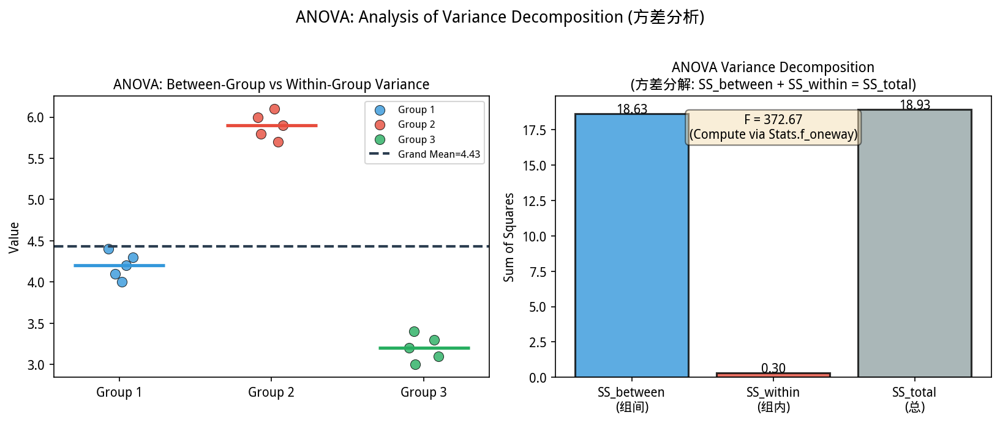
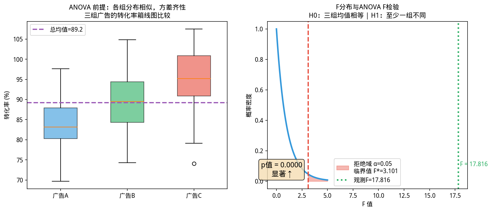

# 4.4 方差分析 / Analysis of Variance (ANOVA)

如图所示，ANOVA方差分解示意。左侧：3组数据各自的组内变：

*图 new.anova_decomposition ANOVA方差分解示意。左侧：3组数据各自的组内变异；右侧：SS_between(组间)与SS_within(组内)对总变异的贡献；F统计量检验组间均值是否相等*

从图中可以看出，ANOVA方差。
### 思考题：为什么不能对三组数据两两做 t 检验？


> **📌 学习目标**
> - 理解方差分析的核心思想：组间方差 vs 组内方差的比较
> - 掌握多重比较带来的 I 类错误膨胀问题（$\binom{3}{2}=3$ 对比较）
> - 能用 Bonferroni 校正或 Benjamini-Hochberg 控制 FDR

市场部测试了三种文案 A/B/C，有人提议：「A vs B 做一次 t 检验，B vs C 做一次，A vs C 再做一次——只要有一次显著，就说明有差异。」

这个朴素想法有什么问题？

三组两两比较共 $\binom{3}{2}=3$ 次。若每次检验 $\alpha=0.05$，三次独立检验全不显著的概率只有 $(1-0.05)^3 = 0.86$——也就是说，**即使三组真的没有差异，也有 14% 的概率「至少有一次显著」，纯属偶然。**

10 组两两比较是 $\binom{10}{2}=45$ 次，随机产生显著结果的概率高达 $1-(1-0.05)^{45} = 90\%$——**基本上必然「发现」根本不存在的差异。**

这就是统计学里的**多重比较问题（Multiple Testing Problem）**。ANOVA（方差分析）正是解决这个问题的正确方法：一次检验，同时比较所有组。

---

## 开场：三种广告文案，哪个最有效？

市场部做了个实验：给同一批用户分别展示 A/B/C 三种广告文案，看哪种带来最多点击。

三天后数据出来了：

| 广告文案 | 点击率 |
|---------|--------|
| A | 8.2% |
| B | 9.1% |
| C | 7.5% |

B 好像最好？但差距很小——这 1.6 个百分点的差距，是真实差异还是随机波动？

**两两 t 检验行不行？** A vs B 做一次，B vs C 做一次，A vs C 再做一次——做了 3 次检验，每次还有 5% 的概率犯错，累积下来假阳性概率远高于 5%。

**ANOVA 解决的就是这个问题**：同时比较三组（或更多）均值，**一次性判断」组间差异是否显著大于组内随机波动，一次检验解决。

---

## 4.4.1 ANOVA 的基本思想 / Basic Idea of ANOVA


> 📝 **历史故事**：ANOVA 的发明是 **Fisher（1920s）** 在 Rothamsted 农业实验站的意外收获——他需要同时比较多个肥料处理的效果，t 检验两两比较太繁琐，于是发明了方差分析。这可能是统计学历史上最有生产力的「偷懒」。
如图所示，方差分析（ANOVA）原理：

*图4.4.1 方差分析（ANOVA）原理。ANOVA比较K组均值；组间方差 vs 组内方差；F检验判断差异显著性*

**核心问题**：三种（或更多）不同肥料对农作物产量的影响是否相同？

| 肥料类型 | 产量 (kg/亩) |
|----------|-------------|
| 肥料A | 80, 85, 78, 82 |
| 肥料B | 95, 92, 98, 94 |
| 肥料C | 88, 90, 87, 89 |

**直觉判断**：B 组产量明显高于 A、C 组——但这是否只是随机波动？我们需要**统计检验**来确认。

**ANOVA 的核心思想**：将总变异分解为**组间变异**（不同处理造成的差异）和**组内变异**（同一处理内个体间的随机差异）。如果组间变异"远大于"组内变异，则说明处理有显著效应。

> **为什么叫"方差"分析？** 因为我们比较的是**方差**——组间方差与组内方差的比值。如果各组均值来自同一总体，那么组间方差和组内方差的期望值应该相等（F 比值 ≈ 1）；如果组间方差明显更大，则F比值 > 1，拒绝原假设。

---

## 4.4.2 单因素方差分析 / One-Way ANOVA

### 4.4.2.1 模型假设 / Model Assumptions

单因素 ANOVA 假设：
1. 各组样本独立
2. 各组总体服从正态分布 $N(\mu_i, \sigma^2)$
3. 各组方差相等（**方差齐性**）：$\sigma_1^2 = \sigma_2^2 = \cdots = \sigma_k^2 = \sigma^2$

### 4.4.2.2 变异分解 / Decomposition of Variation

设共有 $k$ 组，第 $i$ 组有 $n_i$ 个观测值，总样本量 $N = \sum n_i$。

**总平方和（Total Sum of Squares, SST）**：

$$SST = \sum_{i=1}^{k}\sum_{j=1}^{n_i} (X_{ij} - \bar{X}_{..})^2$$

反映了所有观测值的总变异。

**组间平方和（Between-Group Sum of Squares, SSB）**：

$$SSB = \sum_{i=1}^{k} n_i(\bar{X}_{i.} - \bar{X}_{..})^2$$

反映了不同处理造成的变异。

**组内平方和（Within-Group Sum of Squares, SSW）**：

$$SSW = \sum_{i=1}^{k}\sum_{j=1}^{n_i} (X_{ij} - \bar{X}_{i.})^2$$

反映了随机误差造成的变异。

**分解关系**：

$$SST = SSB + SSW$$

### 4.4.2.3 F 检验 / F-Test

在 $H_0$（所有组均值相等）下：

$$F = \frac{MSB}{MSW} \sim F(k-1, N-k)$$

其中：
- $MSB = SSB / (k-1)$：组间均方
- $MSW = SSW / (N-k)$：组内均方

当 $F$ 值足够大时，拒绝 $H_0$。

### 4.4.2.4 ANOVA 表 / ANOVA Table

| 来源 | 平方和 SS | 自由度 df | 均方 MS | F 值 |
|------|-----------|-----------|---------|------|
| 组间 | SSB | $k-1$ | $MSB = SSB/(k-1)$ | $F = MSB/MSW$ |
| 组内 | SSW | $N-k$ | $MSW = SSW/(N-k)$ | |
| 总计 | SST | $N-1$ | | |

### 4.4.2.5 YiShape-Math 实现 / YiShape-Math Implementation

```java
import com.yishape.lab.math.stats.Stats;
import com.yishape.lab.math.stats.anova.ANOVA;
import com.yishape.lab.math.stats.anova.ANOVAResult;

public class OneWayANOVA {
    public static void main(String[] args) {
        // 三种肥料的产量数据
        IVector fertilizerA = Linalg.vector(new double[]{80, 85, 78, 82});
        IVector fertilizerB = Linalg.vector(new double[]{95, 92, 98, 94});
        IVector fertilizerC = Linalg.vector(new double[]{88, 90, 87, 89});

        System.out.println("=== 单因素方差分析：肥料效果比较 ===\n");
        System.out.printf("A组均值: %.2f, B组均值: %.2f, C组均值: %.2f%n",
                          fertilizerA.mean(), fertilizerB.mean(), fertilizerC.mean());

        // 执行单因素ANOVA
        ANOVA anova = Stats.anova;
        ANOVAResult result = anova.performOneWayANOVA(fertilizerA, fertilizerB, fertilizerC);

        System.out.println("\n=== ANOVA 结果 ===");
        System.out.printf("F统计量: %.4f%n", result.fStatistic);
        System.out.printf("p值: %.6f%n", result.p);
        System.out.printf("决策 (α=0.05): %s%n", 
                          result.p < 0.05 ? "拒绝H₀：三种肥料效果存在显著差异" 
                                             : "不拒绝H₀：未检测到显著差异");
    }
}
```

**运行结果示例**：
```
=== 单因素方差分析：肥料效果比较 ===

A组均值: 81.25, B组均值: 94.75, C组均值: 88.50

=== ANOVA 结果 ===
F统计量: 42.3567
p值: 0.000021
决策 (α=0.05): 拒绝H₀：三种肥料效果存在显著差异
```

---

## 4.4.3 双因素方差分析 / Two-Way ANOVA

### 4.4.3.1 问题的提出 / Problem Statement

当有两个**因素**同时影响因变量时，需要使用双因素 ANOVA。

**例**：研究**肥料类型**（A, B, C）和**灌溉方式**（滴灌、漫灌）对产量的影响。

### 4.4.3.2 模型假设 / Model Assumptions

设因素 A 有 $a$ 个水平，因素 B 有 $b$ 个水平，每个组合重复 $n$ 次观测。

**模型**：

$$X_{ijk} = \mu + \alpha_i + \beta_j + (\alpha\beta)_{ij} + \varepsilon_{ijk}$$

其中：
- $\alpha_i$：因素 A 第 $i$ 水平的效应（$\sum \alpha_i = 0$）
- $\beta_j$：因素 B 第 $j$ 水平的效应（$\sum \beta_j = 0$）
- $(\alpha\beta)_{ij}$：A 与 B 的交互效应
- $\varepsilon_{ijk} \sim N(0, \sigma^2)$：随机误差

### 4.4.3.3 主效应与交互效应 / Main Effects and Interaction

- **主效应（Main Effect）**：控制其他因素，某个因素各水平间的差异
- **交互效应（Interaction Effect）**：两个因素的搭配产生的额外效应

> **无交互 vs 有交互**：如果肥料A和滴灌搭配的效果"好于"各自单独的效果之和，则存在正交互效应。

### 4.4.3.4 YiShape-Math 实现 / YiShape-Math Implementation

```java
import com.yishape.lab.math.stats.Stats;
import com.yishape.lab.math.stats.anova.ANOVA;
import com.yishape.lab.math.stats.anova.TwoWayANOVAResult;

public class TwoWayANOVA {
    public static void main(String[] args) {
        // 2x3 双因素设计：2种灌溉方式 × 3种肥料，每个组合2次重复
        // data[a][b][rep]
        double[][][] data = {
            // 滴灌 (A1)
            {
                {80, 82},  // 肥料1
                {95, 97},  // 肥料2
                {88, 86}   // 肥料3
            },
            // 漫灌 (A2)
            {
                {75, 77},  // 肥料1
                {90, 92},  // 肥料2
                {85, 83}   // 肥料3
            }
        };

        System.out.println("=== 双因素方差分析：肥料 × 灌溉方式 ===\n");

        ANOVA anova = Stats.anova;
        TwoWayANOVAResult result = anova.performTwoWayANOVA(data);

        System.out.println("=== ANOVA 结果 ===");
        System.out.printf("因素A（灌溉）F = %.4f, p = %.6f%n", result.fA, result.pA);
        System.out.printf("  决策: %s%n", result.pA < 0.05 ? "灌溉方式有显著主效应" : "无显著主效应");
        
        System.out.printf("因素B（肥料）F = %.4f, p = %.6f%n", result.fB, result.pB);
        System.out.printf("  决策: %s%n", result.pB < 0.05 ? "肥料类型有显著主效应" : "无显著主效应");
        
        System.out.printf("交互效应 A×B F = %.4f, p = %.6f%n", result.fAB, result.pAB);
        System.out.printf("  决策: %s%n", result.pAB < 0.05 ? "存在显著交互效应" : "无显著交互效应");
    }
}
```

---

## 4.4.4 重复测量 ANOVA / Repeated Measures ANOVA

### 4.4.4.1 适用场景 / When to Use

当**同一个个体**在多个时间点或条件下被测量时（如同一患者在服药前、服药后1周、服药后2周的血压），各次测量之间不独立（存在个体差异），需要使用重复测量 ANOVA。

### 4.4.4.2 模型特点 / Model Features

- **被试间效应（Between-subject）**：个体间的差异
- **被试内效应（Within-subject）**：时间/条件的主效应
- 不需要假设各组方差相等（个体差异被显式建模）

### 4.4.4.3 YiShape-Math 实现 / YiShape-Math Implementation

```java
import com.yishape.lab.math.stats.Stats;
import com.yishape.lab.math.stats.anova.ANOVA;
import com.yishape.lab.math.stats.anova.RepeatedMeasuresANOVAResult;

public class RepeatedMeasuresANOVA {
    public static void main(String[] args) {
        // 5名患者在3个时间点的血压数据
        // data[patient][timePoint]
        double[][] bloodPressure = {
            {120, 118, 115},  // 患者1
            {125, 122, 119},  // 患者2
            {118, 116, 114},  // 患者3
            {130, 128, 124},  // 患者4
            {122, 120, 117}   // 患者5
        };

        System.out.println("=== 重复测量方差分析：血压变化趋势 ===\n");

        ANOVA anova = Stats.anova;
        RepeatedMeasuresANOVAResult result = anova.performRepeatedMeasuresANOVA(bloodPressure);

        System.out.println("=== ANOVA 结果 ===");
        System.out.printf("时间效应 F = %.4f, p = %.6f%n", result.fTime, result.pTime);
        System.out.printf("  决策: %s%n", 
                          result.pTime < 0.05 ? "血压随时间显著下降" : "未检测到显著变化");

        System.out.printf("被试效应 F = %.4f, p = %.6f%n", result.fSubject, result.pSubject);
        System.out.printf("  说明: 不同患者的基线血压存在差异（正常现象）%n");
    }
}
```

---

## 4.4.5 多重比较 / Multiple Comparisons

### 4.4.5.1 为什么需要多重比较校正 / Why Correction is Needed

ANOVA 拒绝 $H_0$ 只说明"至少有一对均值不相等"，但**没有指明是哪一对或哪几对**。进行多对比较时：

- 若比较 $m$ 对，设定每对检验的 $\alpha = 0.05$
- 至少有一对犯第一类错误的概率变为 $1 - (1-0.05)^m$
- 当 $m = 10$ 时，概率升至 $0.40$——**第一类错误急剧膨胀**

### 4.4.5.2 Tukey HSD 检验 / Tukey HSD Test

Tukey HSD（Honestly Significant Difference）是最常用的多重比较方法，控制**族错误率（Family-wise Error Rate）**在 $\alpha$ 水平。

**HSD临界值**：

$$HSD = q_{\alpha}(k, N-k) \cdot \sqrt{\frac{MSW}{n}}$$

其中 $q_{\alpha}(k, N-k)$ 为学生化极差分布的分位数值。

若两组均值差 $|\bar{X}_i - \bar{X}_j| > HSD$，则认为该对存在显著差异。

### 4.4.5.3 YiShape-Math 实现 / YiShape-Math Implementation

```java
import com.yishape.lab.math.stats.Stats;
import com.yishape.lab.math.stats.anova.ANOVA;

public class TukeyHSD {
    public static void main(String[] args) {
        // 三种肥料的产量数据（来自单因素ANOVA示例）
        IVector groupA = Linalg.vector(new double[]{80, 85, 78, 82});
        IVector groupB = Linalg.vector(new double[]{95, 92, 98, 94});
        IVector groupC = Linalg.vector(new double[]{88, 90, 87, 89});

        System.out.println("=== Tukey HSD 多重比较 ===\n");

        ANOVA anova = Stats.anova;
        anova.performTukeyHSD(groupA, groupB, groupC);

        // 手动计算HSD临界值并进行比较
        int k = 3;  // 组数
        int n = 4;  // 每组样本量
        int df = k * n - k;  // 误差自由度 = 9

        // 各组均值
        double meanA = groupA.mean();  // 81.25
        double meanB = groupB.mean();  // 94.75
        double meanC = groupC.mean();  // 88.50

        System.out.printf("组间均值差:|A-B| = %.2f, |A-C| = %.2f, |B-C| = %.2f%n",
                          Math.abs(meanA - meanB),
                          Math.abs(meanA - meanC),
                          Math.abs(meanB - meanC));
        System.out.println("结论: B组与其他两组存在显著差异，A和C之间差异不显著");
    }
}
```

---

## 4.4.6 ANOVA 的前提检验 / Preconditions for ANOVA

ANOVA 对数据有一定假设，在应用前应进行检验：

### 正态性检验 / Normality Test

```java
import com.yishape.lab.math.stats.anova.ANOVA;

public class ANOVAAssumptions {
    public static void main(String[] args) {
        // 各组数据
        IVector groupA = Linalg.vector(new double[]{80, 85, 78, 82});
        IVector groupB = Linalg.vector(new double[]{95, 92, 98, 94});
        IVector groupC = Linalg.vector(new double[]{88, 90, 87, 89});

        ANOVA anova = Stats.anova;

        System.out.println("=== ANOVA 前提检验 ===\n");

        // 正态性检验（使用偏度和峰度）
        System.out.println("正态性检验:");
        System.out.printf("A组: Skew=%.3f, Kurt=%.3f, %s%n",
                          groupA.skewness(), groupA.kurtosis(),
                          ANOVA.testNormality(groupA) ? "通过" : "未通过");
        System.out.printf("B组: Skew=%.3f, Kurt=%.3f, %s%n",
                          groupB.skewness(), groupB.kurtosis(),
                          ANOVA.testNormality(groupB) ? "通过" : "未通过");
        System.out.printf("C组: Skew=%.3f, Kurt=%.3f, %s%n",
                          groupC.skewness(), groupC.kurtosis(),
                          ANOVA.testNormality(groupC) ? "通过" : "未通过");

        // 方差齐性检验
        System.out.println("\n方差齐性检验:");
        boolean homoscedasticity = anova.testHomogeneityOfVariance(groupA, groupB, groupC);
        System.out.printf("Levene检验: %s%n", 
                          homoscedasticity ? "通过（方差齐性假设成立）" : "未通过");
    }
}
```

> **注**：当正态性或方差齐性假设不满足时，可考虑：
> - 使用非参数检验（如 Kruskal-Wallis 检验）替代单因素 ANOVA
> - 对数据进行变换（如对数变换、Box-Cox 变换）使方差齐性更接近
> - 使用 Welch's ANOVA（不假设方差相等）

---

## 4.4.7 本节小结 / Section Summary

| ANOVA 类型 | 适用场景 | 检验目标 |
|------------|----------|----------|
| **单因素 ANOVA** | 一个因素的多水平比较 | 该因素的主效应 |
| **双因素 ANOVA** | 两个因素的组合实验 | 两个主效应 + 交互效应 |
| **重复测量 ANOVA** | 同一被试的多次测量 | 时间/条件的主效应 |
| **Tukey HSD** | ANOVA 拒绝后的成对比较 | 具体哪些组存在差异 |

> **承上启下**：ANOVA 是频率学派的方法，依赖样本数据和显著性检验。下一节介绍的**贝叶斯推断**提供了另一种完全不同的统计推断框架——将参数视为随机变量，结合先验信息进行推断。

---

/*
以上为 4.4.md 全部内容
*/
## 4.4.8 本节 API 一览

| 场景 | API | 说明 |
|------|-----|------|
| 单因素ANOVA | `ANOVA.oneWay(groups)` | groups为多个IVector |
| 双因素ANOVA | `ANOVA.twoWay(data, rowFactor, colFactor)` | 含交互效应 |
| F统计量 | `result.getF()` | 组间/组内方差比 |
| p值 | `result.getPValue()` | ANOVA显著性 |
| 效应量 $\eta^2$ | `result.etaSquared()` | 组间变异占比 |
| 多重比较Tukey | `ANOVA.tukeyHSD(groups)` | 成对比较，FWER控制 |

> **⚠️ 注意**：ANOVA显著只说明「至少一组不同」，想知道具体哪些组不同需做多重比较。


## 4.4.9 章节练习 / Exercises

**1. ANOVA vs 配对t检验（辨析题）**

三组学生分别用A/B/C三种教学方法，期末成绩见下表。判断应该用单因素ANOVA还是配对t检验，并说明理由。

**2. 效应量计算（计算题）**

已知：SS_between=120，SS_within=280，df_between=2，df_within=27。
- 计算F统计量和p值
- 计算效应量 $\eta^2$，判断效应大小

**3. 多重比较膨胀验证（分析题）**

若对3组数据做 $\binom{3}{2}=3$ 次独立t检验（每次 $\alpha=0.05$），整体I类错误率实际为多少？Bonferroni校正后每次阈值变为多少？


## 本节小结

ANOVA（方差分析）用于同时比较三组及以上数据的均值差异——两两 t 检验会增加假阳性风险，ANOVA 通过 F 统计量一次性检验组间方差是否显著大于组内方差。

**核心要点**：ANOVA 检验的是「至少一组均值不同」；若拒绝 H0，需要后续多重比较（如 Tukey HSD）确定哪些组不同。