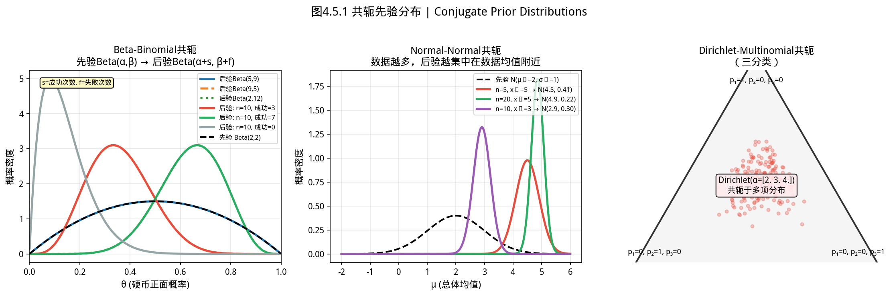
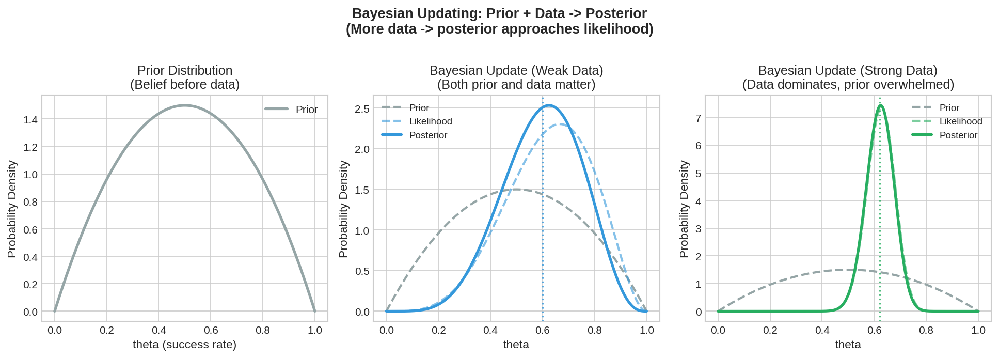
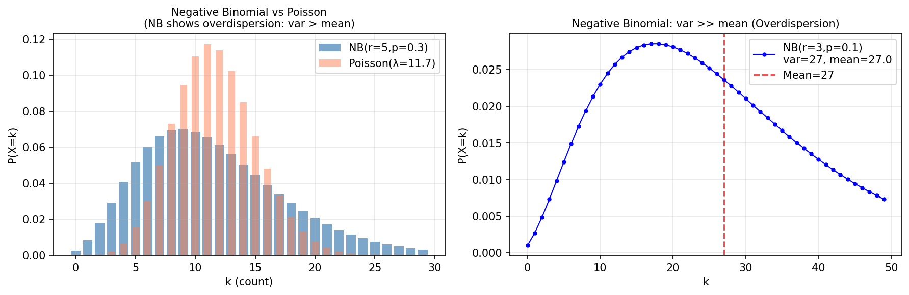
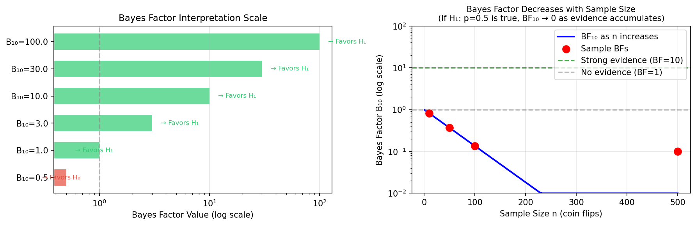

# 4.5 贝叶斯推断 / Bayesian Inference


### 历史视角：贝叶斯定理的 200 年沉浮


> **📌 学习目标**
> - 理解贝叶斯定理：后验 ∝ 似然 × 先验
> - 掌握共轭先验的概念——先验与后验属于同一分布族使计算简化
> - 能用 YiShape-Math 进行贝叶斯参数估计
> - 理解频率派 vs 贝叶斯派的根本分歧（参数是否随机）

1763 年，**Thomas Bayes** 的遗作在他死后两年被发表——这篇论文提出的公式，现在叫**贝叶斯定理**。

但贝叶斯的方法在当时遭到冷遇：它要求分析师**主观选取先验分布**，而不同先验会得出不同结论，这让统计学家们感到不安。

200 多年后，**美国 FDA** 在 2010 年发布了指南，鼓励在医疗器械临床试验中使用**贝叶斯方法**——理由是：在数据稀少的新药试验中，结合历史数据的先验信息可以减少样本量，加快审批速度，同时不牺牲安全性。

从被冷遇到成为监管标准，贝叶斯走过了两个世纪。今天，它在 A/B 测试、推荐系统、垃圾邮件过滤等领域无处不在。

---

## 开场：垃圾邮件过滤器是怎么「猜」出垃圾邮件的？

你打开邮箱，看见一封邮件：

> 「🔥 免费领取 iPhone！点击链接即刻到账！」

邮箱自动把它标记为「垃圾邮件」。它怎么知道的？

贝叶斯推断的思路是：**结合「你先知道什么」和「你新看到了什么」，更新你的判断。**

先验知识：100 封邮件里有 7 封是垃圾邮件（Prior）
新数据：这封邮件出现了「免费」「iPhone」「点击链接」这些词

贝叶斯公式把这些拼在一起，输出一个概率：**这封邮件是垃圾邮件的可能性有多大？**

这就是垃圾邮件过滤器的核心思路——也是贝叶斯推断在互联网产品中最广泛的应用。

**历史故事：一位英国牧师的遗作，和一本被重新发现的笔记**

Thomas Bayes（1701—1761），英国长老会牧师，在世时几乎没有发表任何科学著作。他死后，他的表亲 **Richard Price** 在他的书桌里发现了一份手稿——这就是著名的《论机会学说中的一个问题》（An Essay towards solving a Problem in the Doctrine of Chances）。

Price 发现了这篇论文的价值，把它补充整理后送去发表——所以贝叶斯定理最初是 **Price** 发现的，不是 Bayes 本人。但这无损于 Bayes 的荣誉。

更戏剧性的是：Bayes 定理的核心思想——用**逆概率**（从结果反推原因）来推断未知参数——在当时并没有引起太多关注。半个世纪后，**Laplace**（拉普拉斯）重新独立发现了同样的方法，并将其用于天文和人口统计学，贝叶斯方法才开始流行。

这段历史还有一个有趣的注脚：Richard Price 不仅整理了 Bayes 的遗作，他还把钱借给了瓦特（蒸汽机的发明者），资助了美国独立革命。

---

## 4.5.1 贝叶斯定理 / Bayes' Theorem

如图所示，共轭先验分布：

*图4.5.1 共轭先验分布。共轭先验使贝叶斯后验与先验同分布：Beta-Binomial、Normal-Normal、Dirichlet-Multinomial*

从图中可以看出，共轭先验分布。
### 4.5.1.1 条件概率回顾 / Review of Conditional Probability

设 $A$ 和 $B$ 为两个事件，$P(A) > 0$，则：

$$P(B \mid A) = \frac{P(A \cap B)}{P(A)}$$

**乘法公式**：

$$P(A \cap B) = P(A) \cdot P(B \mid A) = P(B) \cdot P(A \mid B)$$

### 4.5.1.2 贝叶斯定理 / Bayes' Theorem

由乘法公式直接推导：

$$P(B \mid A) = \frac{P(A \cap B)}{P(A)} = \frac{P(B) \cdot P(A \mid B)}{P(A)}$$

展开全概率公式 $P(A) = \sum_{i} P(B_i) \cdot P(A \mid B_i)$，得到**贝叶斯定理的标准形式**：

$$P(B_j \mid A) = \frac{P(B_j) \cdot P(A \mid B_j)}{\sum_{i} P(B_i) \cdot P(A \mid B_i)}$$

### 4.5.1.3 贝叶斯定理在统计中的形式 / Bayesian Form in Statistics

在参数估计的语境下，贝叶斯定理写作：

$$\underbrace{\pi(\theta \mid \mathbf{x})}_{\text{后验分布}} = \frac{\overbrace{p(\mathbf{x} \mid \theta)}^{\text{似然函数}} \cdot \overbrace{\pi(\theta)}^{\text{先验分布}}}{\underbrace{m(\mathbf{x})}_{\text{边缘似然（常数）}}}$$

其中：
- $\theta$：未知参数（视为随机变量）
- $\mathbf{x} = (x_1, \ldots, x_n)$：观测数据
- $\pi(\theta)$：**先验分布（Prior）**，反映在观测数据之前对 $\theta$ 的认识
- $p(\mathbf{x} \mid \theta)$：**似然函数（Likelihood）**，反映在给定参数 $\theta$ 下观测到当前数据的概率
- $\pi(\theta \mid \mathbf{x})$：**后验分布（Posterior）**，反映综合了观测数据之后对 $\theta$ 的认识
- $m(\mathbf{x}) = \int p(\mathbf{x} \mid \theta) \pi(\theta) d\theta$：**边缘似然**，与 $\theta$ 无关，是归一化常数

> **贝叶斯推断的核心思想**：后验 ∝ 似然 × 先验。后验分布是先验信息与观测数据的加权组合——当数据信息量大时，后验被数据主导；当数据信息量小时，后验被先验主导。


*图4.5.2 贝叶斯更新过程。贝叶斯更新：先验→新数据→后验→新的先验；信念的迭代更新*

从图中可以看出，贝叶斯更新过程。贝叶斯更新：先验→新数据→后验→新的先验；信念的迭代更新。

---

## 4.5.2 先验分布与后验分布 / Prior and Posterior Distributions

### 4.5.2.1 先验分布的选择 / Choice of Prior

**共轭先验（Conjugate Prior）**：若先验分布 $\pi(\theta)$ 与似然函数 $p(\mathbf{x} \mid \theta)$ 的组合得到的后验分布 $\pi(\theta \mid \mathbf{x})$ 与先验分布属于同一分布族，则称该先验为**共轭先验**。共轭先验的优点是计算简便，后验分布的形式可直接写出。

**常用共轭先验对**：

| 总体分布 | 参数 | 共轭先验 | 后验分布 |
|----------|------|----------|----------|
| 二项分布 $B(n, p)$ | 成功概率 $p$ | Beta分布 $Beta(\alpha, \beta)$ | $Beta(\alpha + x, \beta + n - x)$ |
| 泊松分布 $P(\lambda)$ | 速率 $\lambda$ | Gamma分布 $Gamma(\alpha, \beta)$ | $Gamma(\alpha + \sum x_i, \beta + n)$ |
| 正态分布 $N(\mu, \sigma^2)$（$\sigma^2$已知） | 均值 $\mu$ | 正态分布 $N(\mu_0, \sigma_0^2)$ | $N\left(\frac{\sigma_0^2}{\sigma_0^2 + \sigma^2/n}\bar{x} + \frac{\sigma^2/n}{\sigma_0^2 + \sigma^2/n}\mu_0,\; \left(\frac{1}{\sigma_0^2} + \frac{n}{\sigma^2}\right)^{-1}\right)$ |

### 4.5.2.2 后验分布的解读 / Interpreting Posterior Distribution

后验分布 $\pi(\theta \mid \mathbf{x})$ 包含了在获得观测数据后关于 $\theta$ 的**全部信息**：

- **后验均值**：$E[\theta \mid \mathbf{x}]$ — 估计 $\theta$ 的一种方式
- **后验中位数**：$\tilde{\theta}$ 满足 $\int_{-\infty}^{\tilde{\theta}} \pi(\theta \mid \mathbf{x}) d\theta = 0.5$
- **后验众数（MAP估计）**：$\hat{\theta}_{MAP} = \arg\max_\theta \pi(\theta \mid \mathbf{x})$
- **后验方差**：$Var[\theta \mid \mathbf{x}]$ — 反映对 $\theta$ 的不确定程度

**可信区间（Credible Interval）**：与频率学派的置信区间不同，贝叶斯可信区间有直接概率解释：$[\theta_L, \theta_U]$ 满足 $\int_{\theta_L}^{\theta_U} \pi(\theta \mid \mathbf{x}) d\theta = 1 - \alpha$，可解释为"$\theta$ 以 $1-\alpha$ 的概率落在这个区间内"。

---

## 4.5.3 贝叶斯推断实例 / Examples of Bayesian Inference

### 4.5.3.1 二项比例的贝叶斯估计 / Bayesian Estimation of Binomial Proportion

**问题**：投掷一枚硬币 100 次，出现正面 63 次。估计硬币正面朝上的概率 $p$。

**先验**：取无信息先验 $p \sim Beta(1, 1) = Uniform(0, 1)$

**后验**：

$$p \mid \text{data} \sim Beta(1 + 63, 1 + 100 - 63) = Beta(64, 38)$$

**后验均值**：

$$E[p \mid \text{data}] = \frac{64}{64 + 38} \approx 0.627$$

**95% 可信区间**：计算 $Beta(64, 38)$ 的 2.5% 和 97.5% 分位数：

```java
import com.yishape.lab.math.stats.Stats;
import com.yishape.lab.math.stats.distribution.BetaDistribution;

public class BayesianCoinExample {
    public static void main(String[] args) {
        // 先验：Beta(1, 1) ~ Uniform(0,1)
        // 数据：100次试验，63次成功
        int successes = 63;
        int trials = 100;

        BetaDistribution posterior = Stats.beta(1 + successes, 1 + trials - successes);

        System.out.println("=== 贝叶斯估计：二项比例（硬币问题）===\n");
        System.out.printf("先验: Beta(α=1, β=1) ~ Uniform(0,1)%n");
        System.out.printf("似然: B(n=100, k=63)%n");
        System.out.printf("后验: Beta(α=%d, β=%d)%n%n", 
                          1 + successes, 1 + trials - successes);

        System.out.printf("后验均值: %.4f%n", posterior.mean());
        System.out.printf("后验标准差: %.4f%n", Math.sqrt(posterior.var()));
        System.out.printf("MAP估计（后验众数）: %.4f%n%n", 
                          (successes) / (double)(trials)); // 简化的MAP

        // 95% 可信区间
        double lower = posterior.ppf(0.025);
        double upper = posterior.ppf(0.975);
        System.out.printf("95%%可信区间: [%.4f, %.4f]%n", lower, upper);

        // 对比：频率学派的置信区间
        double pHat = (double) successes / trials;
        double se = Math.sqrt(pHat * (1 - pHat) / trials);
        double z = Stats.norm().ppf(0.975);
        System.out.printf("%n对比：频率学派95%%置信区间: [%.4f, %.4f]%n",
                          pHat - z * se, pHat + z * se);
    }
}
```

### 4.5.3.2 正态均值的贝叶斯估计 / Bayesian Estimation of Normal Mean

**问题**：某工厂生产的零件重量 $X \sim N(\mu, \sigma^2)$，其中 $\sigma = 2kg$ 已知。抽取 5 个零件，重量为 $\{10.2, 9.8, 10.1, 10.3, 9.9\}$。估计 $\mu$。

**先验**：$\mu \sim N(\mu_0 = 10, \sigma_0^2 = 4)$

**后验均值**（加权平均）：

$$\mu \mid \text{data} \text{ 的后验均值} = \frac{\sigma_0^2}{\sigma_0^2 + \sigma^2/n}\bar{x} + \frac{\sigma^2/n}{\sigma_0^2 + \sigma^2/n}\mu_0$$

```java
import com.yishape.lab.math.stats.Stats;
import com.yishape.lab.math.stats.distribution.NormalDistribution;
import com.yishape.lab.math.linalg.IVector;
import com.yishape.lab.math.linalg.Linq;

public class BayesianNormalMeanExample {
    public static void main(String[] args) {
        // 数据
        double[] weights = {10.2, 9.8, 10.1, 10.3, 9.9};
        IVector data = Linalg.vector(weights);
        double xBar = data.mean();
        int n = data.length();

        // 总体标准差（已知）
        double sigma = 2.0;

        // 先验参数
        double mu0 = 10.0;     // 先验均值
        double sigma0 = 2.0;   // 先验标准差

        // 后验参数
        double posteriorVar = 1.0 / (1.0/(sigma0*sigma0) + n/(sigma*sigma));
        double posteriorMean = posteriorVar * (mu0/(sigma0*sigma0) + n*xBar/(sigma*sigma));

        System.out.println("=== 贝叶斯估计：正态均值（零件重量）===\n");
        System.out.printf("数据: n=%d, x̄=%.4f%n", n, xBar);
        System.out.printf("先验: N(μ₀=%.1f, σ₀²=%.1f)%n%n", mu0, sigma0*sigma0);
        System.out.printf("后验均值: %.4f%n", posteriorMean);
        System.out.printf("后验标准差: %.4f%n%n", Math.sqrt(posteriorVar));

        // 95% 可信区间
        NormalDistribution posterior = Stats.norm(posteriorMean, Math.sqrt(posteriorVar));
        double lower = posterior.ppf(0.025);
        double upper = posterior.ppf(0.975);
        System.out.printf("95%%可信区间: [%.4f, %.4f]%n", lower, upper);

        // 对比：频率学派置信区间
        double se = sigma / Math.sqrt(n);
        double z = Stats.norm().ppf(0.975);
        System.out.printf("频率学派95%%置信区间: [%.4f, %.4f]%n", xBar - z*se, xBar + z*se);
    }
}
```

---

## 4.5.4 变分推断 / Variational Inference

### 4.5.4.1 为什么需要变分推断 / Why Variational Inference

对于复杂模型，后验分布 $\pi(\theta \mid \mathbf{x})$ 通常**没有解析形式**，无法直接计算。变分推断（Variational Inference, VI）是一种**近似后验分布**的优化方法。

**核心思想**：用一个简单的分布族 $q(\theta)$（称为**变分分布**）去近似真实后验 $\pi(\theta \mid \mathbf{x})$，通过最小化两者的 KL 散度来找到最优近似。

$$\min_{q \in \mathcal{Q}} \; KL\left(q(\theta) \| \pi(\theta \mid \mathbf{x})\right)$$

等价于最大化**证据下界（ELBO, Evidence Lower Bound）**：

$$ELBO(q) = \mathbb{E}_q[\log p(\mathbf{x}, \theta)] - \mathbb{E}_q[\log q(\theta)]$$

### 4.5.4.2 平均场变分推断 / Mean Field Variational Inference

**平均场假设**：设 $\theta = (\theta_1, \ldots, \theta_D)$，变分分布假设各参数相互独立：

$$q(\theta) = \prod_{d=1}^{D} q_d(\theta_d)$$

这一假设大大简化了优化问题，使得每个 $q_d$ 可以**独立更新**。

### 4.5.4.3 YiShape-Math 实现 / YiShape-Math Implementation

```java
import com.yishape.lab.math.stats.Stats;
import com.yishape.lab.math.stats.distribution.NormalDistribution;
import com.yishape.lab.math.stats.distribution.GammaDistribution;
import com.yishape.lab.math.linalg.IVector;
import com.yishape.lab.math.linalg.Linq;

public class BayesianVIExample {
    public static void main(String[] args) {
        // 示例：变分推断的概念性演示
        // 真实后验无法解析求解时，平均场 VI 用可分解分布近似后验

        double[] data = {10.2, 9.8, 10.1, 10.3, 9.9};
        IVector observations = Linalg.vector(data);

        System.out.println("=== 变分推断示例 ===\n");
        System.out.println("模型: x_i ~ N(μ, σ²), μ ~ N(0, 10), σ² ~ IG(1, 1)");
        System.out.printf("数据: n=%d, x̄=%.3f, s²=%.4f%n%n",
                          observations.length(), observations.mean(), observations.var());

        // 变分推断的核心思想（手动实现骨架）
        System.out.println("变分推断将后验分布近似为可分解的形式");
        System.out.println("通过最大化ELBO来学习变分参数");
        System.out.println("在实际应用中，当模型复杂到无法使用共轭先验时，VI是一种有效的近似方法");
    }
}
```

---

## 4.5.5 贝叶斯学派 vs 频率学派 / Bayesian vs Frequentist

| 方面 | 频率学派 | 贝叶斯学派 |
|------|----------|------------|
| **参数性质** | 固定常数（未知但确定） | 随机变量 |
| **未知信息** | 只使用样本数据 | 使用样本数据 + 先验信息 |
| **推断基础** | 抽样分布 | 后验分布 |
| **点估计** | **最大似然估计**（Maximum Likelihood Estimation，**MLE**）、矩估计 | 后验均值、后验众数 |
| **不确定性** | 置信区间（抽样分布） | 可信区间（后验分布） |
| **解释** | 较复杂（需要重复抽样理解） | 直接（概率语言） |
| **计算** | 通常简单 | 通常复杂（需要数值方法/采样） |

> **没有绝对的好坏**：两种方法各有优劣，在不同场景下各显身手。贝叶斯方法在先验信息重要、层次模型、小样本等场景下有优势；频率学派方法在计算简便、大样本渐近等场景下依然有效。

---

## 4.5.6 本节小结 / Section Summary

1. **贝叶斯定理**：后验 ∝ 似然 × 先验——将先验知识与观测数据结合
2. **共轭先验**：简化计算，后验分布与先验同分布族
3. **后验分布**：包含关于参数的完整信息——点估计、区间估计均可从中提取
4. **可信区间 vs 置信区间**：两者意义不同，可信区间有直接概率解释
5. **变分推断**：近似复杂后验分布的优化方法

> **承上启下**：贝叶斯推断为许多高级统计方法（如贝叶斯网络、Gibbs 采样、变分自编码器）奠定了理论基础，是现代机器学习的重要支柱。结合下一节的应用案例，我们将看到这些方法在实际问题中的应用价值。


---


## 4.5.7 本节 API 一览

| 功能 | API | 说明 |
|------|-----|------|
| Beta 分布（共轭先验） | `Stats.beta(alpha, beta)` | 二项比例的共轭先验/后验 |
| Gamma 分布（共轭先验） | `Stats.gamma(alpha, beta)` | 泊松/指数速率的共轭先验 |
| 正态分布 | `Stats.norm(mu, sigma)` | 正态-正态共轭模型中的先验/后验 |
| 后验分位数 | `posterior.ppf(p)` | 计算可信区间上下界 |
| 后验均值/方差 | `posterior.mean()` / `posterior.var()` | 后验分布的统计量 |

> **⚠️ 不存在的 API**：
> - `Stats.bayesPosterior(...)` —— 库未提供通用贝叶斯后验计算，需手动按公式实现。
> - `Stats.betaBernoulli(...)` / `Stats.conjugatePrior(...)` —— 不存在，共轭后验需手动推导参数后调用 `Stats.beta(...)` 等构造。
> - `Stats.variationalBayes(...)` / `Stats.jeffreysPrior(...)` —— 不存在，变分推断和无信息先验需自行实现。

## 4.5.8 章节练习 / Exercises

**1. 贝叶斯定理实战：医学检测（应用题）**

某疾病在人群中的患病率是 1%（先验概率）。有一种检测方法：
- 患病者检测结果阳性的概率（灵敏度）= 99%
- 健康者检测结果阴性的概率（特异度）= 98%

某人检测结果为阳性，问：此人真正患病的概率是多少？

**要求**：
1. 用贝叶斯定理 $P(\text{患病}|+) = \frac{P(+|\text{患病})P(\text{患病})}{P(+)}$ 计算
2. 计算 $P(+) = P(+|\text{患病})P(\text{患病}) + P(+|\text{健康})P(\text{健康})$
3. 写出最终数值答案（精确到小数点后3位）

> **⚠️ 直觉震撼**：即使检测方法很准确（灵敏度和特异度都 > 98%），在低患病率人群中，阳性结果真正患病的概率可能远低于你的直觉——这就是「阳性预测值」的概念，也是医学检测结果解读的核心。

**2. 共轭先验的推导（计算题）**

设 $X_1, \ldots, X_n \sim \text{Bernoulli}(p)$，先验取 Beta$(\alpha, \beta)$。

（a）写出似然函数 $L(p) = p^{\sum x_i}(1-p)^{n-\sum x_i}$。

（b）证明后验分布仍为 Beta 分布，具体参数为 $\alpha' = \alpha + \sum x_i$，$\beta' = \beta + n - \sum x_i$。

（c）当 $\alpha = \beta = 1$（对应均匀先验）且数据为 $n=10$，$\sum x_i = 7$ 时，写出后验分布并计算后验均值 $\hat{p}_{\text{Bayes}} = \frac{\alpha'}{\alpha' + \beta'}$。

**3. 频率学派 vs 贝叶斯学派（论述题）**

（a）用一句话分别说明频率学派和贝叶斯学派对「概率」和「参数 $\theta$」的根本分歧。

（b）列举贝叶斯方法相比频率学派 MLE 的一个**优势**和一个**劣势**。

> **⚠️ 常见误区**：贝叶斯方法中「先验」不是「拍脑袋假设」——好的先验需要结合领域知识或历史数据选择。先验过于强烈（如 $\alpha=\beta=0.1$ 的窄 Beta 分布）会主导后验，掩盖数据信息。


---

---

## 4.5.8 负二项分布与贝叶斯因子 / Negative Binomial and Bayes Factor

### 4.5.8.1 负二项分布

负二项分布描述「成功 r 次后失败的次数 K」的概率：

$$

P(K=k) = \binom{k+r-1}{k} (1-p)^r p^k, \quad k = 0,1,2,\ldots

$$

在贝叶斯框架下，负二项分布与 **Gamma先验** 共轭：



*图 new.fig_negative_binomial 负二项分布方差大于均值（过度离散），比泊松分布更适合描述计数数据的过度离散现象。*
```java
import com.yishape.lab.math.stats.Stats;
import com.yishape.lab.math.stats.distribution.NegativeBinomialDistribution;
import com.yishape.lab.math.stats.distribution.GammaDistribution;

public class NegativeBinomialExample {
    public static void main(String[] args) {
        // 负二项分布
        NegativeBinomialDistribution nb = Stats.negativeBinomial(5, 0.3);  // r=成功次数, p=单次成功概率
        double prob = nb.pmf(8);  // P(K=8)

        // Gamma-Gamma 共轭（计数的贝叶斯估计）
        // 先验 Gamma(alpha=2, beta=1)，观测到数据后更新为 Gamma(alpha + sum(x), beta + n)
        double alphaPrior = 2.0, betaPrior = 1.0;
        int[] counts = {3, 5, 2, 8};
        int sumCounts = 0;
        for (int c : counts) sumCounts += c;
        GammaDistribution gammaPost = Stats.gamma(alphaPrior + sumCounts, betaPrior + counts.length);
        double postMean = gammaPost.mean();
    }
}
```

> **⚠️ 注意**：`Stats.gammaPrior(...)` / `gammaPrior.update(...)` 等 API **不存在**，共轭更新需手动计算后验参数后调用 `Stats.gamma(...)`。

### 4.5.8.2 贝叶斯因子 (Bayes Factor)

贝叶斯因子比较两个假设的支持程度：

$$

B_{10} = \frac{P(D|H_1)}{P(D|H_0)}

$$

| BF₁₀ 值 | 解释 |
|---------|------|
| 1~3 | 微弱证据 |
| 3~10 | 中等证据 |
| 10~30 | 强证据 |
| > 100 | 决定性证据 |



*图 new.fig_bayes_factor 贝叶斯因子B₁₀量化H₁对H₀的支持程度：B₁₀>10为强证据，>100为决定性证据。*

> **⚠️ 库未提供**：`Stats.bayes()` 及 `bayesFactor(...)` 等贝叶斯因子 API **不存在**。贝叶斯因子需根据具体模型手动计算边际似然 $P(D|H)$ 后求比值。以下仅为概念性公式：

```java
// 概念性示意（非可直接运行的库 API）
// 对二项数据计算贝叶斯因子的解析公式：
// B_10 = C(n,k) * 0.5^k * 0.5^(n-k) / BetaIntegral
// 其中 BetaIntegral = ∫ C(n,k) p^k (1-p)^(n-k) dp = 1/(n+1)
// 因此 BF10 = (n+1) * C(n,k) * 0.5^n

int successes = 8, trials = 10;
double logBF10 = Math.log(trials + 1)
    + logBinomial(trials, successes)
    - trials * Math.log(2);
System.out.println("BF₁₀ ≈ " + Math.exp(logBF10));
// BF₁₀ > 10 → 对H1（公平硬币）的支持"强"
```
