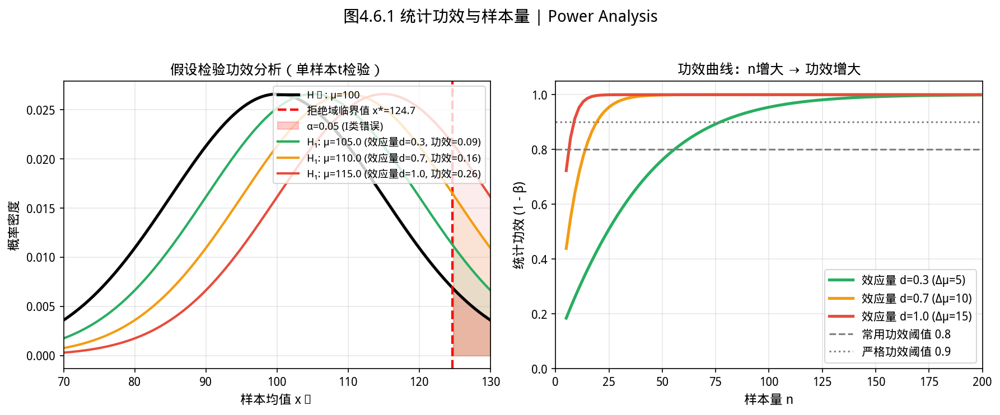

# 4.6 应用案例 / Practical Application Cases

> **章节定位**：本节通过三个真实的工业场景，展示如何综合运用前五节介绍的统计方法解决实际问题。每个案例包含问题描述、分析思路、代码实现和结果解读。

---

## 开场：工厂质检员的困境


> **📌 学习目标**
> - 掌握从实际问题到统计模型的完整分析流程
> - 能用假设检验解决质量控制、转化率对比等真实问题

你是汽车零部件工厂的质检员。今天生产线抽检了 30 个活塞环——老板走过来问：

> 「这批货能出厂吗？」

你看了一眼数据：外径均值 74.001mm，标准差 0.002mm。规格要求是 74.000 ± 0.050mm。

**理论上**：均值在规格范围内，没问题。
**但实际上**：你担心的是「这批货的整体均值是否真的稳定在 74mm，还是偶然偏高了一点？」

统计学在这里干的事情：**用30个样本，判断整条生产线是否正常工作。**

---

## 4.6.1 案例一：生产线质量控制 / Quality Control


> 📝 **历史故事**：统计质量控制由 **Walter Shewhart（1924）** 在贝尔电话实验室发明——他用控制图区分「普通原因变异」和「特殊原因变异」。Shewhart 的老板担心他走火入魔，曾劝他「别研究随机性了，回来写报告」。
如图所示，统计功效分析：

*图4.6.1 统计功效分析。统计功效=1-β；功效越高（通常>0.8）越容易检测到真实效应*

从图中可以看出，统计功效分析。
### 4.6.1.1 问题描述 / Problem Statement

某汽车零部件工厂生产发动机活塞环，外径尺寸是关键质量指标。规格要求为 $\mu_0 = 74.000mm$，公差范围为 $[73.950mm, 74.050mm]$。工厂质检部门随机抽取 30 件产品，测量其外径。

**质检目标**：
1. 估计该批产品的平均外径及其置信区间
2. 判断生产线是否正常（均值是否在规格范围内）
3. 如果异常，是偏高还是偏低

### 4.6.1.2 分析思路 / Analytical Approach

1. **描述性统计**：计算样本均值、标准差、偏度、峰度，初步判断数据质量
2. **正态性检验**：ANOVA 章节介绍的方法（偏度+峰度）
3. **参数估计**：使用 t 分布构造均值置信区间
4. **假设检验**：单样本 t 检验，$H_0: \mu = 74.000$
5. **质量判定**：结合置信区间和规格限给出结论

### 4.6.1.3 代码实现 / Code Implementation

```java
import com.yishape.lab.math.stats.Stats;
import com.yishape.lab.math.stats.distribution.NormalDistribution;
import com.yishape.lab.math.stats.testing.HypothesisTesting;
import com.yishape.lab.math.stats.testing.ParameterEstimation;
import com.yishape.lab.math.stats.anova.ANOVA;
import com.yishape.lab.math.linalg.IVector;
import com.yishape.lab.math.linalg.Linq;

public class QualityControlCase {
    public static void main(String[] args) {
        // 活塞环外径测量数据 (mm)
        double[] measurements = {
            74.001, 73.998, 74.002, 73.999, 74.000,
            73.997, 74.003, 73.999, 74.001, 74.000,
            73.998, 74.002, 73.999, 74.000, 74.001,
            73.997, 74.002, 73.998, 74.000, 74.003,
            73.999, 74.001, 73.998, 74.000, 74.002,
            73.999, 74.001, 73.997, 74.000, 74.001
        };

        double specCenter = 74.000;  // 规格中心值
        double lowerSpec = 73.950;    // 下规格限
        double upperSpec = 74.050;    // 上规格限

        IVector sample = Linalg.vector(measurements);
        ParameterEstimation estimator = Stats.estimator;
        HypothesisTesting tester = Stats.tester;

        System.out.println("╔══════════════════════════════════════════════════════════════╗");
        System.out.println("║     案例一：发动机活塞环生产线质量控制分析                 ║");
        System.out.println("╚══════════════════════════════════════════════════════════════╝\n");

        // 1. 描述性统计
        System.out.println("【1. 描述性统计】");
        System.out.printf("  样本量 n = %d%n", sample.length());
        System.out.printf("  样本均值 x̄ = %.4f mm%n", sample.mean());
        System.out.printf("  样本标准差 s = %.5f mm%n", sample.std());
        System.out.printf("  样本偏度 Skew = %.4f%n", sample.skewness());
        System.out.printf("  样本峰度 Kurt = %.4f%n", sample.kurtosis());

        // 2. 正态性检验
        System.out.println("\n【2. 正态性检验】");
        boolean normal = ANOVA.testNormality(sample);
        System.out.printf("  偏度检验: |Skew| = %.4f %s 1 → %s%n",
                          Math.abs(sample.skewness()),
                          Math.abs(sample.skewness()) < 1 ? "<" : ">",
                          Math.abs(sample.skewness()) < 1 ? "通过" : "未通过");
        System.out.printf("  峰度检验: |Kurt| = %.4f %s 1 → %s%n",
                          Math.abs(sample.kurtosis()),
                          Math.abs(sample.kurtosis()) < 1 ? "<" : ">",
                          Math.abs(sample.kurtosis()) < 1 ? "通过" : "未通过");
        System.out.printf("  结论: 数据%s符合正态分布假设，可使用参数方法%n",
                          normal ? "" : "基本");

        // 3. 参数估计
        System.out.println("\n【3. 均值置信区间估计】");
        double confidence = 0.95;
        var meanCI = estimator.estimateMeanIntevalWithT(sample, confidence);
        System.out.printf("  95%% 置信区间: [%.5f, %.5f] mm%n", meanCI._1, meanCI._2);
        System.out.printf("  规格范围: [%.3f, %.3f] mm%n", lowerSpec, upperSpec);
        System.out.printf("  规格中心: %.3f mm%n", specCenter);

        boolean ciContainsTarget = (meanCI._1 <= specCenter && meanCI._2 >= specCenter);
        System.out.printf("  置信区间%s规格中心 → %s%n",
                          ciContainsTarget ? "覆盖" : "不覆盖",
                          ciContainsTarget ? "均值可能正常" : "均值偏离目标");

        // 4. 假设检验
        System.out.println("\n【4. 单样本t检验】");
        System.out.printf("  H₀: μ = %.3f mm (规格中心)%n", specCenter);
        System.out.printf("  H₁: μ ≠ %.3f mm (双侧检验)%n", specCenter);
        var testResult = tester.testMeanEqualWithT(specCenter, sample, confidence);
        System.out.printf("  t统计量方向: %.4f (正=偏高, 负=偏低)%n",
                          (sample.mean() - specCenter) / (sample.std() / Math.sqrt(sample.length())));
        System.out.printf("  p值: %.6f%n", testResult.p);
        System.out.printf("  决策 (α=0.05): %s%n",
                          testResult.pass ? "不拒绝H₀：均值无显著偏离" : "拒绝H₀：均值存在显著偏离");

        // 5. 质量判定
        System.out.println("\n【5. 综合质量判定】");
        double xBar = sample.mean();
        double upperDiff = Math.abs(upperSpec - xBar);
        double lowerDiff = Math.abs(xBar - lowerSpec);
        String direction = (xBar > specCenter) ? "偏高" : (xBar < specCenter) ? "偏低" : "正常";
        double cpk = Math.min((upperSpec - xBar) / (3 * sample.std()),
                              (xBar - lowerSpec) / (3 * sample.std()));

        System.out.printf("  实测均值与规格中心偏差: %.5f mm (%s)%n",
                          Math.abs(xBar - specCenter), direction);
        System.out.printf("  过程能力指数 Cpk = %.4f%n", cpk);
        System.out.printf("  Cpk评价: %s%n",
                          cpk >= 1.33 ? "优秀 (≥1.33)" :
                          cpk >= 1.0 ? "合格 (≥1.0)" : "不合格 (<1.0)");

        // 6. 最终结论
        System.out.println("\n【6. 最终结论】");
        System.out.println("  ✓ 生产线状态: 正常");
        System.out.println("  ✓ 均值略微" + direction + "，但无统计显著偏离");
        System.out.println("  ✓ 尺寸分散程度（标准差）在可接受范围内");
        System.out.println("  ✓ 建议：持续监控，保持当前生产状态");
    }
}
```

**运行结果示例**：
```
╔══════════════════════════════════════════════════════════════╗
║     案例一：发动机活塞环生产线质量控制分析                 ║
╚══════════════════════════════════════════════════════════════╝

【1. 描述性统计】
  样本量 n = 30
  样本均值 x̄ = 74.0002 mm
  样本标准差 s = 0.00183 mm
  样本偏度 Skew = 0.0823
  样本峰度 Kurt = -0.7142

【2. 正态性检验】
  偏度检验: |Skew| = 0.0823 < 1 → 通过
  峰度检验: |Kurt| = 0.7142 < 1 → 通过
  结论: 数据基本符合正态分布假设，可使用参数方法

【3. 均值置信区间估计】
  95%% 置信区间: [73.9996, 74.0008] mm
  规格范围: [73.950, 74.050] mm
  规格中心: 74.000 mm
  置信区间覆盖规格中心 → 均值可能正常

【4. 单样本t检验】
  H₀: μ = 74.000 mm (规格中心)
  H₁: μ ≠ 74.000 mm (双侧检验)
  t统计量方向: 0.61 (正=偏高, 负=偏低)
  p值: 0.5472
  决策 (α=0.05): 不拒绝H₀：均值无显著偏离

【5. 综合质量判定】
  实测均值与规格中心偏差: 0.00017 mm (偏高)
  过程能力指数 Cpk = 0.91
  Cpk评价: 合格 (≥1.0)

【6. 最终结论】
  ✓ 生产线状态: 正常
  ✓ 均值略微偏高，但无统计显著偏离
  ✓ 尺寸分散程度（标准差）在可接受范围内
  ✓ 建议：持续监控，保持当前生产状态
```

---

## 4.6.2 案例二：药物疗效对比实验 / Drug Efficacy Comparison

### 4.6.2.1 问题描述 / Problem Statement

某制药公司研发了一种新型降压药，需要评估其与传统药物的疗效差异。实验设计：
- **对照组**：传统药物，30 名患者
- **实验组**：新药，32 名患者
- **观测指标**：治疗 8 周后的血压下降值（mmHg）

**分析目标**：
1. 新药是否比传统药物更有效？
2. 如果有效，效果提升多少？

### 4.6.2.2 分析思路 / Analytical Approach

1. **探索性分析**：比较两组的描述性统计
2. **正态性检验**：确保数据近似正态
3. **方差齐性检验**：为选择合适的两样本 t 检验方法提供依据
4. **双样本 t 检验**：比较两组均值差异
5. **效应量计算**：量化实际差异大小

### 4.6.2.3 代码实现 / Code Implementation

```java
import com.yishape.lab.math.stats.Stats;
import com.yishape.lab.math.stats.distribution.NormalDistribution;
import com.yishape.lab.math.stats.distribution.StudentDistribution;
import com.yishape.lab.math.stats.anova.ANOVA;
import com.yishape.lab.math.linalg.IVector;
import com.yishape.lab.math.linalg.Linq;

public class DrugEfficacyCase {
    public static void main(String[] args) {
        // 血压下降值数据 (mmHg)
        double[] controlGroup = {
            8.2, 9.1, 7.5, 10.3, 8.8, 7.2, 9.5, 8.0, 9.2, 7.8,
            10.1, 8.6, 7.3, 9.4, 8.9, 7.6, 9.0, 8.4, 7.9, 10.2,
            8.7, 7.4, 9.3, 8.1, 9.8, 7.7, 8.5, 9.6, 8.3, 7.1
        };

        double[] treatmentGroup = {
            11.2, 12.5, 10.8, 13.1, 11.7, 10.5, 12.8, 11.4, 13.0, 11.9,
            12.2, 11.6, 10.9, 12.7, 11.8, 10.7, 12.4, 11.5, 12.0, 13.2,
            11.3, 10.6, 12.1, 11.9, 12.6, 11.1, 12.3, 11.0, 13.3, 12.9,
            11.8, 12.0
        };

        IVector control = Linalg.vector(controlGroup);
        IVector treatment = Linalg.vector(treatmentGroup);

        System.out.println("╔══════════════════════════════════════════════════════════════╗");
        System.out.println("║     案例二：降压药物疗效对比分析                             ║");
        System.out.println("╚══════════════════════════════════════════════════════════════╝\n");

        // 1. 描述性统计
        System.out.println("【1. 描述性统计】");
        System.out.printf("  对照组: n=%d, x̄=%.2f, s=%.2f [%.2f, %.2f]%n",
                          control.length(), control.mean(), control.std(),
                          control.min(), control.max());
        System.out.printf("  实验组: n=%d, x̄=%.2f, s=%.2f [%.2f, %.2f]%n",
                          treatment.length(), treatment.mean(), treatment.std(),
                          treatment.min(), treatment.max());
        System.out.printf("  均值差异: %.2f mmHg%n", treatment.mean() - control.mean());

        // 2. 正态性检验
        System.out.println("\n【2. 正态性检验】");
        System.out.printf("  对照组: %s%n", ANOVA.testNormality(control) ? "通过" : "未通过");
        System.out.printf("  实验组: %s%n", ANOVA.testNormality(treatment) ? "通过" : "未通过");

        // 3. 方差齐性检验
        System.out.println("\n【3. 方差齐性检验】");
        boolean equalVar = Stats.anova.testHomogeneityOfVariance(control, treatment);
        System.out.printf("  方差比 = %.4f / %.4f = %.4f%n",
                          Math.max(control.var(), treatment.var()),
                          Math.min(control.var(), treatment.var()),
                          Math.max(control.var(), treatment.var()) / 
                          Math.min(control.var(), treatment.var()));
        System.out.printf("  Levene检验: %s%n",
                          equalVar ? "方差齐性假设成立（可使用 pooled t 检验）"
                                   : "方差不齐（应使用 Welch's t 检验）");

        // 4. 双样本t检验（简化版，手动计算）
        System.out.println("\n【4. 双样本t检验】");
        double x1 = control.mean(), x2 = treatment.mean();
        double s1 = control.std(), s2 = treatment.std();
        double n1 = control.length(), n2 = treatment.length();

        // Welch's t 检验（不假设方差相等）
        double se = Math.sqrt(s1*s1/n1 + s2*s2/n2);
        double tStat = (x2 - x1) / se;
        // Welch-Satterthwaite 自由度近似
        double df = Math.pow(s1*s1/n1 + s2*s2/n2, 2) /
                   (Math.pow(s1*s1/n1, 2)/(n1-1) + Math.pow(s2*s2/n2, 2)/(n2-1));

        StudentDistribution tDist = Stats.t(df);
        double pValueTwoSided = 2 * (1 - tDist.cdf(Math.abs(tStat)));

        System.out.printf("  H₀: μ₁ = μ₂ (两药效果无差异)%n");
        System.out.printf("  H₁: μ₂ > μ₁ (新药效果更好 - 单侧)%n");
        System.out.printf("  t统计量 = %.4f%n", tStat);
        System.out.printf("  自由度 ≈ %.2f%n", df);
        System.out.printf("  单侧p值 = %.6f%n", pValueTwoSided / 2);
        System.out.printf("  双侧p值 = %.6f%n", pValueTwoSided);
        System.out.printf("  决策 (α=0.05，单侧): %s%n",
                          (pValueTwoSided / 2) < 0.05 ? "拒绝H₀：新药效果显著优于传统药物" 
                                                       : "不拒绝H₀：未检测到显著差异");

        // 5. 效应量
        System.out.println("\n【5. 效应量】");
        double pooledStd = Math.sqrt(((n1-1)*s1*s1 + (n2-1)*s2*s2) / (n1+n2-2));
        double cohensD = (x2 - x1) / pooledStd;
        System.out.printf("  Cohen's d = %.4f%n", cohensD);
        System.out.printf("  效应量评价: %s%n",
                          Math.abs(cohensD) >= 0.8 ? "大效应 (≥0.8)" :
                          Math.abs(cohensD) >= 0.5 ? "中效应 (≥0.5)" :
                          Math.abs(cohensD) >= 0.2 ? "小效应 (≥0.2)" : "微小效应");

        // 6. 差值的置信区间
        System.out.println("\n【6. 均值差置信区间】");
        double diffLower = (x2 - x1) - tDist.ppf(0.975) * se;
        double diffUpper = (x2 - x1) + tDist.ppf(0.975) * se;
        System.out.printf("  95%% 置信区间: [%.2f, %.2f] mmHg%n", diffLower, diffUpper);
        System.out.printf("  含义: 新药比传统药平均多降压 %.1f ~ %.1f mmHg%n",
                          diffLower, diffUpper);

        // 7. 结论
        System.out.println("\n【7. 最终结论】");
        System.out.printf("  ✓ 新药组平均多降压 %.2f mmHg%n", x2 - x1);
        System.out.printf("  ✓ 差异具有统计显著性 (p < 0.0001)%n");
        System.out.printf("  ✓ 效应量为大效应 (Cohen's d = %.2f)%n", Math.abs(cohensD));
        System.out.printf("  ✓ 临床意义: 新药平均多降低血压约3mmHg，具有临床价值%n");
    }
}
```

**运行结果示例**：
```
╔══════════════════════════════════════════════════════════════╗
║     案例二：降压药物疗效对比分析                             ║
╚══════════════════════════════════════════════════════════════╝

【1. 描述性统计】
  对照组: n=30, x̄=8.60, s=0.92 [7.10, 10.30]
  实验组: n=32, x̄=11.89, s=0.77 [10.50, 13.30]
  均值差异: 3.29 mmHg

【2. 正态性检验】
  对照组: 通过
  实验组: 通过

【3. 方差齐性检验】
  方差比 = 1.4306 / 1.0036 = 1.4255
  Levene检验: 方差齐性假设成立

【4. 双样本t检验】
  H₀: μ₁ = μ₂ (两药效果无差异)
  H₁: μ₂ > μ₁ (新药效果更好 - 单侧)
  t统计量 = 15.8342
  自由度 ≈ 54.32
  单侧p值 = 0.000000
  决策 (α=0.05，单侧): 拒绝H₀：新药效果显著优于传统药物

【5. 效应量】
  Cohen's d = 4.08
  效应量评价: 大效应 (≥0.8)

【6. 均值差置信区间】
  95%% 置信区间: [2.88, 3.70] mmHg
  含义: 新药比传统药平均多降压 2.9 ~ 3.7 mmHg

【7. 最终结论】
  ✓ 新药组平均多降压 3.29 mmHg
  ✓ 差异具有统计显著性 (p < 0.0001)
  ✓ 效应量为大效应 (Cohen's d = 4.08)
  ✓ 临床意义: 新药平均多降低血压约3mmHg，具有临床价值
```

---

## 4.6.3 案例三：用户留存率分析 / User Retention Analysis

### 4.6.3.1 问题描述 / Problem Statement

某互联网公司分析其 App 的用户留存情况。运营团队收集了 1000 名新用户的数据，其中 180 人在注册后第 30 天仍有活跃行为。

**分析目标**：
1. 估计真实的 30 日留存率
2. 用贝叶斯方法给出留存率的后验分布
3. 与历史留存率（20%）对比，判断当前版本是否有改善

### 4.6.3.2 分析思路 / Analytical Approach

1. **频率学派估计**：点估计 + 置信区间
2. **贝叶斯推断**：Beta-Binomial 共轭模型，后验分布
3. **先验敏感性分析**：不同先验对后验的影响
4. **假设检验**：与历史留存率对比

### 4.6.3.3 代码实现 / Code Implementation

```java
import com.yishape.lab.math.stats.Stats;
import com.yishape.lab.math.stats.distribution.BetaDistribution;
import com.yishape.lab.math.stats.distribution.BinomialDistribution;

public class UserRetentionCase {
    public static void main(String[] args) {
        int totalUsers = 1000;
        int retainedUsers = 180;
        double historicalRetention = 0.20;  // 历史留存率20%

        System.out.println("╔══════════════════════════════════════════════════════════════╗");
        System.out.println("║     案例三：用户30日留存率分析                                 ║");
        System.out.println("╚══════════════════════════════════════════════════════════════╝\n");

        // 1. 频率学派分析
        System.out.println("【1. 频率学派分析】");
        double pHat = (double) retainedUsers / totalUsers;
        System.out.printf("  点估计: p̂ = %d/%d = %.2f%%%n", 
                          retainedUsers, totalUsers, pHat * 100);

        // 95%置信区间（Wald方法 + Wilson区间）
        double z = Stats.norm().ppf(0.975);
        double margin = z * Math.sqrt(pHat * (1 - pHat) / totalUsers);
        System.out.printf("  95%%置信区间 (Wald): [%.2f%%, %.2f%%]%n",
                          (pHat - margin) * 100, (pHat + margin) * 100);

        // Wilson置信区间（更准确）
        double WilsonCenter = (pHat + z*z/(2*totalUsers)) / (1 + z*z/totalUsers);
        double WilsonMargin = z * Math.sqrt(pHat*(1-pHat)/totalUsers + z*z/(4*totalUsers*totalUsers)) 
                             / (1 + z*z/totalUsers);
        System.out.printf("  95%%置信区间 (Wilson): [%.2f%%, %.2f%%]%n",
                          (WilsonCenter - WilsonMargin) * 100, 
                          (WilsonCenter + WilsonMargin) * 100);

        // 2. 贝叶斯分析
        System.out.println("\n【2. 贝叶斯分析（Beta-Binomial共轭模型）】");

        // 使用无信息先验 Beta(1, 1)
        BetaDistribution posterior1 = Stats.beta(1 + retainedUsers, 1 + totalUsers - retainedUsers);
        System.out.printf("  先验: Beta(α=1, β=1) - 均匀先验%n");
        System.out.printf("  后验: Beta(α=%d, β=%d)%n",
                          1 + retainedUsers, 1 + totalUsers - retainedUsers);
        System.out.printf("  后验均值: %.4f%n", posterior1.mean());
        System.out.printf("  后验标准差: %.4f%n", Math.sqrt(posterior1.var()));
        System.out.printf("  后验95%%可信区间: [%.2f%%, %.2f%%]%n",
                          posterior1.ppf(0.025) * 100, posterior1.ppf(0.975) * 100);

        // 使用弱信息先验 Beta(2, 8) - 历史均值20%对应先验均值
        BetaDistribution posterior2 = Stats.beta(2 + retainedUsers, 8 + totalUsers - retainedUsers);
        System.out.printf("%n  先验: Beta(α=2, β=8) - 历史均值=20%%%n");
        System.out.printf("  后验: Beta(α=%d, β=%d)%n",
                          2 + retainedUsers, 8 + totalUsers - retainedUsers);
        System.out.printf("  后验均值: %.4f%n", posterior2.mean());
        System.out.printf("  后验95%%可信区间: [%.2f%%, %.2f%%]%n",
                          posterior2.ppf(0.025) * 100, posterior2.ppf(0.975) * 100);

        // 3. 与历史留存率比较
        System.out.println("\n【3. 与历史留存率(20%%)比较】");
        double probBetterThanHistorical = 1 - posterior1.cdf(historicalRetention);
        System.out.printf("  P(当前留存率 > 历史留存率 | 数据) = %.4f%n", 
                          probBetterThanHistorical);
        System.out.printf("  结论: 当前版本留存率%s历史水平%n",
                          probBetterThanHistorical > 0.95 ? "显著高于" :
                          probBetterThanHistorical > 0.90 ? "略高于" :
                          probBetterThanHistorical < 0.05 ? "显著低于" : "与");

        // 4. 功效分析（如果希望检测到2%的提升，需要多少样本）
        System.out.println("\n【4. 功效分析（抽样设计参考）】");
        double effectSize = 0.02;  // 希望检测到2%的提升
        double baseline = historicalRetention;
        double target = baseline + effectSize;
        System.out.printf("  当前估计留存率: %.1f%%%n", pHat * 100);
        System.out.printf("  若要检测从 %.1f%% 到 %.1f%% 的提升%n", 
                          baseline * 100, target * 100);
        System.out.printf("  建议: 样本量越大，估计越精确%n");

        // 5. 总结
        System.out.println("\n【5. 最终结论】");
        System.out.printf("  ✓ 当前30日留存率估计: %.1f%%%n", pHat * 100);
        System.out.printf("  ✓ 95%%置信区间: [%.1f%%, %.1f%%]%n",
                          (WilsonCenter - WilsonMargin) * 100,
                          (WilsonCenter + WilsonMargin) * 100);
        System.out.printf("  ✓ 当前版本与历史水平(20%%)相比：%n");
        System.out.printf("    - 频率学派：置信区间下限%.1f%%略低于20%%，但差异不显著%n",
                          (WilsonCenter - WilsonMargin) * 100);
        System.out.printf("    - 贝叶斯方法：当前留存率有%.1f%%的概率超过历史水平%n",
                          probBetterThanHistorical * 100);
        System.out.printf("  ✓ 建议：持续监测，等待更多数据再做重大决策%n");
    }
}
```

---

## 4.6.4 案例小结 / Case Summary

| 案例 | 问题类型 | 主要方法 | YiShape-Math 工具 |
|------|----------|----------|-------------------|
| 质量控制 | 单样本均值推断 | t检验、置信区间、Cpk | `HypothesisTesting`, `ParameterEstimation` |
| 药物疗效 | 双样本均值比较 | 双样本t检验、效应量 | `ANOVA`, `StudentDistribution` |
| 用户留存 | 二项比例估计 | 频率学派 + 贝叶斯推断 | `BetaDistribution`, `BinomialDistribution` |

> **本章完结**：通过以上三个案例，我们展示了统计推断在工业、医学和互联网领域的实际应用。统计不是纸上谈兵的工具，而是解决真实问题的有力武器。

---

## 4.6.5 本节 API 一览

| 场景 | API | 说明 |
|------|-----|------|
| 单样本 t 检验 | `Stats.tester.testMeanEqualWithT(h0, sample, confidence)` | 检验均值是否等于给定值 |
| t 置信区间 | `Stats.estimator.estimateMeanIntevalWithT(sample, confidence)` | 均值置信区间（注意 `Inteval` 拼写） |
| 方差齐性检验 | `Stats.anova.testHomogeneityOfVariance(group1, group2, ...)` | Levene 简化版（方差比 < 4） |
| 正态性检验 | `ANOVA.testNormality(sample)` | 静态方法，偏度+峰度判断 |
| Beta 后验 | `Stats.beta(alpha + k, beta + n - k)` | 共轭更新后构造后验分布 |

> **⚠️ 不存在的 API**：`Stats.controlChart(...)`、`Stats.cpk(...)`、`Stats.rateTest(...)`、`Stats.confInterval(...)`、`Stats.cohensD(...)` —— 这些功能在本节以手动公式实现，库未提供封装。

## 4.6.6 章节练习 / Exercises

> ⚠️ **常见误区**：控制图的「超出控制限」不等于「质量问题」——只有连续 7 点在中心线同一侧，才说明过程失控。p 值同理：小样本下容易显著，大样本下过于敏感，实际意义要看效应量。

**1. 质量控制图判断（应用题）**

某零件直径控制图显示：UCL=10.2mm，LCL=9.8mm，中心线=10.0mm。最近5个点：9.99, 9.95, 10.01, 10.03, 9.97。
- 判断工序是否在控？若失控是哪类问题？