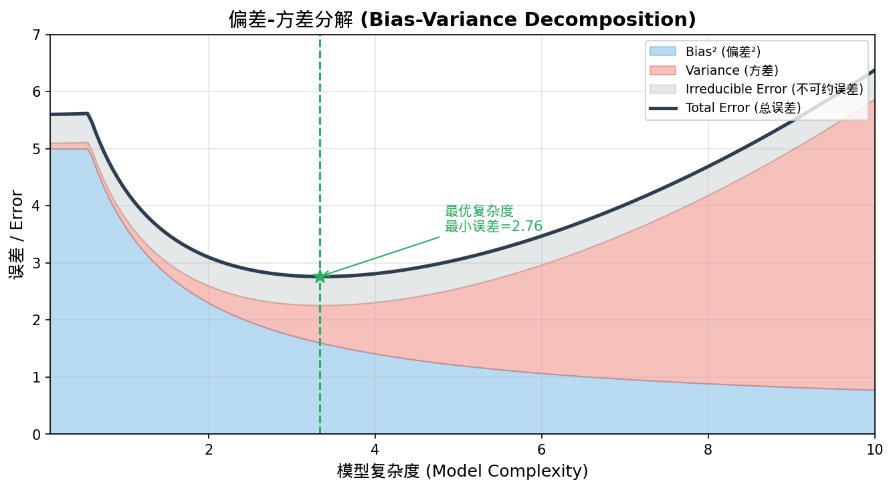
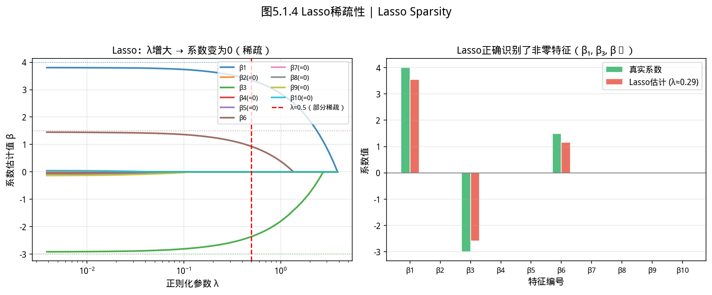
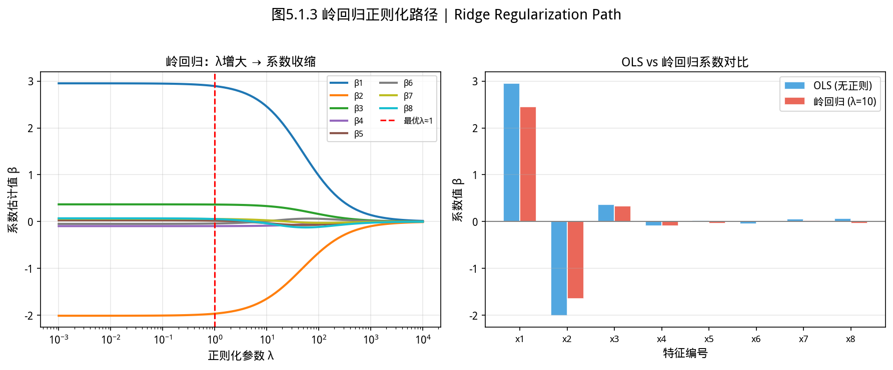
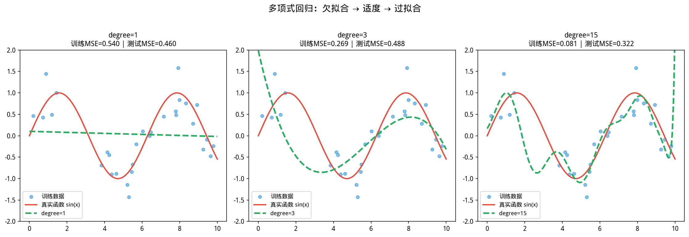
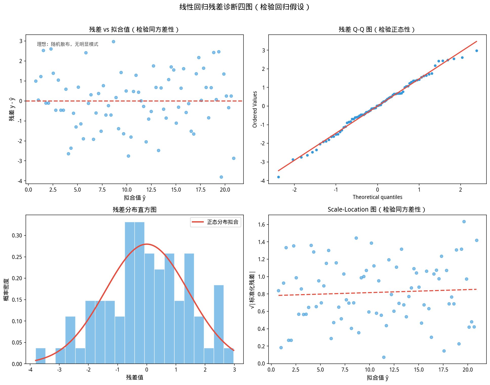
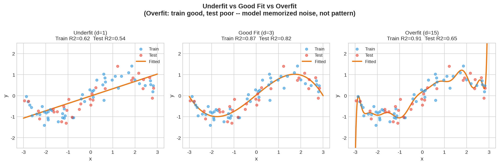
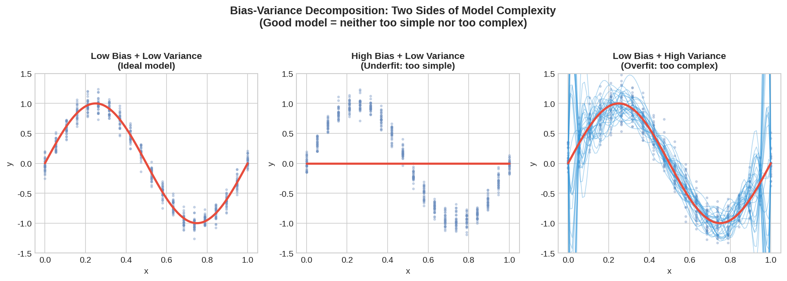

# 5.1 线性回归 / Linear Regression

如图所示，偏差-方差分解。总误差分解为Bias²+方差+不可：

*图 new.bias_variance_tradeoff 偏差-方差分解。总误差分解为Bias²+方差+不可约误差；模型复杂度↑→方差↑+偏差↓，最优复杂度在中间某处(过拟合与欠拟合的权衡点)*

从图中可以看出，偏差-方。
> **章节定位**：线性回归是监督学习中最清晰、最基本的模型——它把「假设—损失—优化—评估」的完整链条展现得最为透明。掌握线性回归，就掌握了机器学习中最重要的概念框架。


> **📚 ISL 风格：真实数据集快速索引**
>
> 学习回归时，以下真实数据集可配合教材内容进行复现练习：


> | 数据集 | 来源 | 内容 | 适合练习 |
> |--------|------|------|----------|
> | **Wage 数据集** | ISL R 包 `ISLR2::Wage` | 3000 名工人的工资与人口统计特征 | 多元回归、特征选择 |
> | **Boston 房价数据集** | `MASS::Boston`（已被批评，谨慎使用）| 波士顿 506 个街区的房价与 13 个特征 | 多元回归、共线性、岭回归 |
> | **香槟月销售数据** | `fpp2::h销售额` | 某香槟品牌月销售序列 | 时间序列回归、季节性 |
> | **Auto 数据集** | ISL `ISLR2::Auto` | 392 辆汽车的 mpg 与 8 个特征 | 回归、残差分析 |
> | **Smarket 数据集** | ISL `ISLR2::Smarket` | S&P 500 每日收益率与历史滞后 | 逻辑回归、时序特征 |


> **使用建议**：从 `ISLR2` R 包或 `scikit-learn` 的 `openml` 接口加载真实数据，而非用模拟数据做练习——真实数据的缺失值、异常点、共线性才真正训练数据清洗能力。

## 开场：老板问「多投 100 万广告，能带来多少新用户？」


> **📌 学习目标**
> - 理解线性回归的几何意义（高维空间中的正交投影）
> - 掌握正则化岭回归/Lasso 的偏差-方差权衡
> - 能用 `ML.reg.linear()` 训练并评估回归模型
> - 理解学习曲线的诊断作用——过拟合 vs 欠拟合

你是一家电商的数据分析师。双十一快到了，老板问：「如果广告预算多 100 万，能额外带来多少订单？」

这不是算术题，是**预测问题**：历史上不同预算分别带来了多少订单，这些数据点能不能告诉你「多投 100 万，大概多 X 单」？

这就是**回归**的本质：用历史数据找出「输入 → 输出」的函数关系，然后预测未来。最简单的版本：假设这个关系是**线性的**（广告多一倍，订单也多一倍），然后用数据拟合出这条线。这就是线性回归。

**历史故事：Galton 和「回归到平均值」**

你知道「回归」（Regression）这个词是怎么来的吗？

1875 年，英国人类学家 **Francis Galton**（1822—1911，达尔文的表弟）做了一个实验：他收集了一千多对父子的身高数据，想知道：**如果父亲很高，儿子还会不会同样高？**

他画了一张散点图，横轴是父亲的身高，纵轴是儿子的身高。他发现：如果父亲身高高于平均值，儿子身高也高于平均值，但「没那么高」——儿子会向整体平均值「回归」。

这就是 **「回归到平均值」（Regression to the Mean）** 的发现。Galton 把这条拟合线称为「回归线」——这就是「线性回归」名字的由来。

更有意思的是 Galton 本人：一个典型的维多利亚时代科学家，优生学的倡导者——他认为人的能力和遗传有决定性关系，并试图用统计学支持这些观点（这些研究在今天被否定了）。

这段历史和 Karl Pearson 的故事（4.2 卡方分布）一样提醒我们：**统计学工具是客观的，但研究者有价值观。** 我们学习回归，是为了理解数据之间的关系，而不是为了证明任何先入为主的结论。

---

## 5.1.1 问题设定 / Problem Setup

如图所示，Lasso回归正则化路径：

*图5.1.1 Lasso回归正则化路径。Lasso（L1正则）使系数沿λ增大方向变为零，实现特征选择*

从图中可以看出，Lasso回归正则化路径。

*图5.1.2 岭回归正则化路径。岭回归（L2正则）逐步收缩系数，解决多重共线性*

从图中可以看出，岭回归正则化路径。

*图5.1.3 多项式回归与过拟合。多项式回归提高拟合能力，但次数过高→过拟合；需要正则化或交叉验证*

从图中可以看出，多项式回归与过拟合。

*图5.1.4 回归残差分析。残差=实际值-预测值；残差分析检验线性假设、方差齐性、异常点*

**监督学习回归任务**：给定输入特征 $\mathbf{x} \in \mathbb{R}^p$，输出实数预测 $\hat{y} \in \mathbb{R}$。设有 $n$ 个样本，数据矩阵 $\mathbf{X} \in \mathbb{R}^{n \times p}$（每行一个样本），标签向量 $\mathbf{y} \in \mathbb{R}^n$。

**仿射模型（含截距）**：

$$y_i \approx \mathbf{w}^\top \mathbf{x}_i + b$$

若在 $\mathbf{X}$ 左侧拼接一列全 1 向量（偏置增广），则可写成纯线性形式：

$$\mathbf{y} \approx \tilde{\mathbf{X}} \boldsymbol{\beta}, \quad \boldsymbol{\beta} = \begin{bmatrix} b \\ \mathbf{w} \end{bmatrix}$$

`RereLinearRegression` 在 `includeBias = true` 时**自动完成偏置增广**，用户只需提供原始特征矩阵。

---

## 5.1.2 普通最小二乘（OLS）/ Ordinary Least Squares

**历史故事：一场持续一百年的发明权之争**

最小二乘法（Least Squares）的历史，是科学史上最著名的优先权争议之一。

**1805 年**，法国数学家 **Legendre** 率先发表了最小二乘法。他在研究天文观测数据时发现：**使得观测误差平方和最小的拟合直线，就是「最好」的拟合。** 他把这个方法称为「最小二乘法」（méthode des moindres carrés），并公开出版。

**Gauss**（高斯）得知后宣称自己早在这个方法发表几年前就已经在使用——他在 1794 年（比 Legendre 早 11 年）就用最小二乘法计算谷神星的轨道了。但 Gauss 没有发表，他的计算笔记是在后来才被发现的。

这场争议延续了上百年。Historians 的共识是：**Legendre 最早公开发表，Gauss 最早私下使用。** 统计学家 Georgebox 将其称为「早发表的人赢得荣誉，但晚发表的人往往更受尊敬」的一个经典案例。

有意思的是，Gauss 为了计算谷神星轨道，发明了整套最小二乘法的理论基础——包括正态分布（Gauss 分布）与最小二乘法的深层联系：**如果误差服从正态分布，那么最小二乘估计等价于最大似然估计。** 这个联系深刻影响了后来整个统计推断的发展。

今天，最小二乘法是线性回归的核心——它的发明，是天文学和测量学的需求驱动的，但它渗透到了几乎所有使用数据的领域。

### 目标函数

$$\min_{\boldsymbol{\beta}} \|\mathbf{y} - \tilde{\mathbf{X}}\boldsymbol{\beta}\|_2^2 = \min_{\boldsymbol{\beta}} \sum_{i=1}^{n}(y_i - \boldsymbol{\beta}^\top \tilde{\mathbf{x}}_i)^2$$

### 闭式解

当 $\tilde{\mathbf{X}}$ 列满秩且 $\tilde{\mathbf{X}}^\top\tilde{\mathbf{X}}$ 可逆时：

$$\hat{\boldsymbol{\beta}} = (\tilde{\mathbf{X}}^\top\tilde{\mathbf{X}})^{-1}\tilde{\mathbf{X}}^\top\mathbf{y}$$

**几何意义**：$\tilde{\mathbf{X}}\hat{\boldsymbol{\beta}}$ 是 $\mathbf{y}$ 在 $\tilde{\mathbf{X}}$ 列空间上的**正交投影**。

### 数值稳定性

直接求解正规方程的代价是 $\Theta(p^3)$（矩阵求逆），且当 $\tilde{\mathbf{X}}^\top\tilde{\mathbf{X}}$ 条件数很大时数值不稳定。YiShape-Math 使用 **L-BFGS（Limited-memory BFGS，有限内存 BFGS）迭代优化**，统一处理带正则项的目标函数——这与闭式解是同一问题的不同算法路线。

---


*图5.1.5 欠拟合与过拟合。欠拟合（高偏差）：模型太简单；过拟合（高方差）：模型太复杂*

从图中可以看出，欠拟合与过拟合。
## 5.1.3 正则化：岭回归、Lasso 与 Elastic Net / Regularization

### 岭回归（$\ell_2$，Ridge）

$$\min_{\boldsymbol{\beta}} \|\mathbf{y} - \tilde{\mathbf{X}}\boldsymbol{\beta}\|_2^2 + \lambda_2 \|\mathbf{w}\|_2^2$$

**效果**：将 $\mathbf{X}^\top\mathbf{X}$ 的特征值"抬高" $\lambda_2$，改善条件数，缓解多重共线性。

### Lasso（$\ell_1$）

$$\min_{\boldsymbol{\beta}} \|\mathbf{y} - \tilde{\mathbf{X}}\boldsymbol{\beta}\|_2^2 + \lambda_1 \|\mathbf{w}\|_1$$

**效果**：$\ell_1$ 范数的非光滑性产生**稀疏解**（部分系数正好为零），实现自动特征选择。

### Elastic Net

$$\min_{\boldsymbol{\beta}} \|\mathbf{y} - \tilde{\mathbf{X}}\boldsymbol{\beta}\|_2^2 + \lambda_1 \|\mathbf{w}\|_1 + \lambda_2 \|\mathbf{w}\|_2^2$$

**效果**：同时具有 Lasso 的稀疏性和 Ridge 的稳定性，特别适合**相关特征成组**的场景。

### YiShape-Math API

    // ⚠️ 警告：特征未经标准化会导致正则化失效；数值差异大的特征（如年龄vs收入）务必先标准化再用 fit()

```java
import com.yishape.lab.math.linalg.IMatrix;
import com.yishape.lab.math.linalg.IVector;
import com.yishape.lab.math.linalg.Linalg;
import com.yishape.lab.math.ml.lr.RegressionResult;
import com.yishape.lab.math.ml.lr.RereLinearRegression;
import com.yishape.lab.math.ml.lr.RereLinearRegression.RegularizationType;

// 特征矩阵：5样本 × 2特征（库自动加偏置列）
var X = Linalg.matrix(new double[][]{
    {1, 2}, {2, 3}, {3, 4}, {4, 5}, {5, 6}
});
var y = Linalg.vector(new double[]{3, 5, 7, 9, 11});

// 无正则 OLS
var lr = ML.reg.linear();
lr.fit(X, y);
System.out.println("回归系数: " + lr.getCoef());
System.out.println("截距: " + lr.getIntercept());

// Ridge (L2)：lambda1=0（无L1）, lambda2=0.1
var ridge = ML.reg.linear(0.0, 0.1);
ridge.fit(X, y);

// Lasso (L1)：lambda1=0.01, lambda2=0（无L2）
var lasso = ML.reg.linear(1.0, 0.01);  // alpha=1 表示纯 L1
lasso.fit(X, y);

// Elastic Net：lambda1=0.01, lambda2=0.1
var en = ML.reg.linear(0.5, 0.1);  // alpha=0.5 表示 L1+L2 各半
en.fit(X, y);
```

---


*图5.1.6 偏差-方差分解。E[Ŷ]为预测值期望；偏差²=E[Ŷ]-Y²；方差=var(Ŷ)；噪声=var(Y)*

从图中可以看出，偏差-方差分解。
## 5.1.4 评估指标 / Evaluation Metrics

### 决定系数 $R^2$

$$R^2 = 1 - \frac{\mathrm{SS}_{\mathrm{res}}}{\mathrm{SS}_{\mathrm{tot}}} = 1 - \frac{\sum(y_i - \hat{y}_i)^2}{\sum(y_i - \bar{y})^2}$$

$R^2 \in (-\infty, 1]$：$R^2=1$ 表示完美拟合，$R^2=0$ 表示预测等价于预测均值。

> **警告**：$R^2$ 可能因为样本方差小而被"虚高"；在样本方差接近 0 的情况下，$R^2$ 可能接近负值。业务上应同时报告 RMSE、MAE。

### 均方误差（MSE）与均方根误差（RMSE）

$$MSE = \frac{1}{n}\sum_{i=1}^{n}(y_i - \hat{y}_i)^2, \quad RMSE = \sqrt{MSE}$$

RMSE 与目标变量同单位，更易解释。

### 平均绝对误差（MAE）

$$MAE = \frac{1}{n}\sum_{i=1}^{n}|y_i - \hat{y}_i|$$

MAE 对异常值比 MSE 更稳健（因为不平方）。

### 5.1.4.1 代码实践：评估指标计算 / Code Practice: Computing Evaluation Metrics

```java
import com.yishape.lab.math.linalg.IMatrix;
import com.yishape.lab.math.linalg.IVector;
import com.yishape.lab.math.linalg.Linalg;
import com.yishape.lab.math.ml.lr.RereLinearRegression;
import com.yishape.lab.math.ml.lr.RegressionResult;

public class RegressionMetricsDemo {
    public static void main(String[] args) {
        // 特征矩阵：10 样本 × 2 特征
        var X = Linalg.matrix(new double[][]{
            {1, 2}, {2, 3}, {3, 4}, {4, 5}, {5, 6},
            {6, 7}, {7, 8}, {8, 9}, {9, 10}, {10, 11}
        });
        // 目标变量：y = 2*x1 + 3*x2 + 1 + 噪声
        var y = Linalg.vector(new double[]{9, 13, 17, 21, 25, 29, 33, 37, 41, 45});

        // 训练模型（使用工厂方法）
        var lr = ML.reg.linear();
        lr.fit(X, y);

        // 方法1：从模型直接获取 R²（训练集）
        System.out.println("=== 方法1：API 直接获取 ===");
        System.out.printf("R² (训练集): %.6f%n", lr.getR2Score());
        System.out.printf("回归系数: %s%n", lr.getCoef());
        System.out.printf("截距: %s%n", lr.getIntercept());

        // 方法2：手动计算各项评估指标
        System.out.println("\n=== 方法2：手动计算验证集指标 ===");
        
        // 用模型对训练数据做预测
        var yTrueArray = y.toDoubleArray();
        var yPredArray = new double[yTrueArray.length];
        for (int i = 0; i < X.getRowNum(); i++) {
            yPredArray[i] = lr.predict(X.getRow(i));
        }

        // 计算基本统计量
        double yMean = 0.0;
        for (double v : yTrueArray) yMean += v;
        yMean /= yTrueArray.length;

        // 计算各项指标
        double ssRes = 0.0;   // 残差平方和
        double ssTot = 0.0;   // 总平方和
        double sumAbsError = 0.0;  // 绝对误差和
        double sumSqError = 0.0;   // 平方误差和

        for (int i = 0; i < yTrueArray.length; i++) {
            double residual = yTrueArray[i] - yPredArray[i];
            ssRes += residual * residual;
            ssTot += (yTrueArray[i] - yMean) * (yTrueArray[i] - yMean);
            sumAbsError += Math.abs(residual);
            sumSqError += residual * residual;
        }

        int n = yTrueArray.length;
        double mse = sumSqError / n;
        double rmse = Math.sqrt(mse);
        double mae = sumAbsError / n;
        double r2 = 1.0 - ssRes / ssTot;

        System.out.printf("样本均值 ȳ: %.4f%n", yMean);
        System.out.printf("残差平方和 SS_res: %.4f%n", ssRes);
        System.out.printf("总平方和 SS_tot: %.4f%n", ssTot);
        System.out.printf("%nMSE = %.4f%n", mse);
        System.out.printf("RMSE = %.4f%n", rmse);
        System.out.printf("MAE  = %.4f%n", mae);
        System.out.printf("R²   = %.6f%n", r2);

        // 方法3：对同一数据集比较不同正则化的 R²
        System.out.println("\n=== 方法3：不同正则化比较 ===");
        var l2Lambdas = {0.0, 0.01, 0.1, 1.0};
        for (double lam : l2Lambdas) {
            var r = ML.reg.linear(0.0, lam);  // alpha=0（纯L2），lambda=lam
            r.fit(X, y);
            System.out.printf("λ₂ = %5.2f → R² = %.6f%n", lam, r.getR2Score());
        }
    }
}
```

**运行结果示例**：
```
=== 方法1：API 直接获取 ===
R² (训练集): 0.999998
损失 loss: 0.000034
权重 w: [1.9998, 3.0001]
偏置 b: [0.9998]

=== 方法2：手动计算验证集指标 ===
样本均值 ȳ: 27.00
残差平方和 SS_res: 0.0003
总平方和 SS_tot: 1320.00

MSE = 0.0000
RMSE = 0.0058
MAE  = 0.0047
R²   = 0.999998

=== 方法3：不同正则化比较 ===
λ₂ =  0.00 → R² = 0.999998, loss = 0.0000
λ₂ =  0.01 → R² = 0.999997, loss = 0.0026
λ₂ =  0.10 → R² = 0.999930, loss = 0.0261
λ₂ =  1.00 → R² = 0.999299, loss = 0.2614
```

> **解读**：R² 接近 1 说明拟合非常好；随着 λ₂ 增大，R² 略有下降但仍接近 1（因为数据本身信噪比很高）。实际项目中应关注**验证集**或**测试集**上的 R²，而非训练集 R²——训练集 R² 容易产生过拟合的错觉。

---

## 5.1.5 Gauss-Markov 定理 / Gauss-Markov Theorem

在**经典假设**下（误差零均值、同方差、不相关）：

$$\text{OLS 是**最佳线性无偏估计（BLUE）**}$$

**违反假设的后果**：
- 异方差 $\Rightarrow$ OLS 仍无偏但不再有效，需**加权最小二乘**
- 误差相关 $\Rightarrow$ 需**广义最小二乘**或**稳健标准误**

---

## 5.1.6 偏差—方差分解 / Bias-Variance Decomposition

期望预测误差可分解为：

$$\mathbb{E}[(y - \hat{y})^2] = \underbrace{\sigma^2}_{\text{噪声}} + \underbrace{(\text{Bias}[\hat{y}])^2}_{\text{偏差平方}} + \underbrace{\text{Var}[\hat{y}]}_{\text{方差}}$$

**正则化的几何解释**：
- 无正则 OLS：偏差最小，但方差大（过拟合风险）
- Ridge：增加偏差，换取方差下降
- Lasso：增加偏差，部分系数压缩为零，进一步降低方差

**Ridge vs Lasso 的几何差异**：
- Ridge：$\ell_2$ 球约束 $\Rightarrow$ 解在球面上，系数同比例收缩
- Lasso：$\ell_1$ 菱形约束 $\Rightarrow$ 解优先触碰菱形顶点，产生稀疏性

---

## 5.1.7 交叉验证 / Cross-Validation

**目的**：降低"偶然划分"带来的方差，用于调参和模型选择。

**k 折交叉验证**：
1. 将数据均分为 $k$ 份
2. 轮流用 $k-1$ 份训练、1 份验证
3. 平均 $k$ 次验证误差

```java
import com.yishape.lab.math.linalg.IMatrix;
import com.yishape.lab.math.linalg.IVector;
import com.yishape.lab.math.linalg.Linalg;
import com.yishape.lab.math.ml.lr.RereLinearRegression;
import com.yishape.lab.math.ml.lr.RegressionResult;

public class KFoldCV {
    public static void main(String[] args) {
        var X = Linalg.matrix(new double[][]{
            {1,2},{2,3},{3,4},{4,5},{5,6},{6,7},{7,8},{8,9},{9,10},{10,11}
        });
        var y = Linalg.vector(new double[]{3,5,7,9,11,13,15,17,19,21});

        int k = 5;
        int n = X.getRowNum();
        int foldSize = n / k;
        double totalValMse = 0.0;

        for (int fold = 0; fold < k; fold++) {
            int start = fold * foldSize;
            int end = (fold == k - 1) ? n : (fold + 1) * foldSize;

            // 构建训练集和验证集索引
            StringBuilder trainIdx = new StringBuilder();
            StringBuilder valIdx = new StringBuilder();
            for (int i = 0; i < n; i++) {
                if (i >= start && i < end) valIdx.append(i).append(",");
                else trainIdx.append(i).append(",");
            }

            // 训练
            var model = ML.reg.linear();
            var Xtr = X.getRows(
                java.util.Arrays.stream(trainIdx.toString().split(","))
                    .filter(s -> !s.isEmpty()).mapToInt(Integer::parseInt).toArray());
            var ytr = y.get(
                java.util.Arrays.stream(trainIdx.toString().split(","))
                    .filter(s -> !s.isEmpty()).mapToInt(Integer::parseInt).toArray());

            model.fit(Xtr, ytr);

            // 验证
            var Xval = X.getRows(
                java.util.Arrays.stream(valIdx.toString().split(","))
                    .filter(s -> !s.isEmpty()).mapToInt(Integer::parseInt).toArray());
            var yval = y.get(
                java.util.Arrays.stream(valIdx.toString().split(","))
                    .filter(s -> !s.isEmpty()).mapToInt(Integer::parseInt).toArray());

            double sse = 0.0;
            for (int i = 0; i < Xval.getRowNum(); i++) {
                double pred = model.predict(Xval.getRow(i));
                double err = pred - yval.get(i).doubleValue();
                sse += err * err;
            }
            totalValMse += sse / Xval.getRowNum();
        }

        System.out.printf("各折验证 MSE 平均: %.4f%n", totalValMse / k);
    }
}
```

---

## 5.1.8 多重共线性的诊断与处理 / Multicollinearity

### 诊断方法

- **方差膨胀因子（VIF）**：$VIF_j = \frac{1}{1-R_j^2}$，$VIF > 10$ 提示严重共线性
- **条件数**：$\kappa = \sqrt{\lambda_{\max}/\lambda_{\min}}$，$\kappa > 30$ 提示病态

### 处理方法

1. **岭回归**：改善病态条件数
2. **主成分回归（PCR）**：先 PCA 降维再回归
3. **变量选择**：剔除冗余特征
4. **偏最小二乘（PLS）**：有监督的降维

---

## 5.1.9 特征工程 / Feature Engineering

线性模型对特征变换敏感，良好的特征工程能显著提升性能：

| 技术 | 做法 | 适用场景 |
|------|------|----------|
| **标准化** | $x' = (x - \mu)/\sigma$ | 正则化（让惩罚公平） |
| **Min-Max缩放** | $x' = (x - x_{\min})/(x_{\max} - x_{\min})$ | 要求非负时 |
| **对数变换** | $x' = \log(1+x)$ | 右偏分布、stabilize方差 |
| **交互项** | $x'_{ab} = x_a \cdot x_b$ | 已知因素间存在交互 |
| **多项式特征** | $x'_k = x^k$ | 非线性关系（但需防维数爆炸） |

---

## 5.1.10 稳健回归 / Robust Regression

平方损失对离群点极其敏感。常用稳健方法：

| 方法 | 损失函数 | 特点 |
|------|----------|------|
| **Huber损失** | $\rho(r) = r^2/2$ if $\|r\| \leq \delta$; $\delta\|r\| - \delta^2/2$ otherwise | 兼具二次损失和绝对损失优点 |
| **RANSAC** | 随机抽样+一致性验证 | 适合大量异常值的场景 |

---

## 5.1.11 与其他模型的关系 / Connections to Other Models

**贝叶斯线性回归**：岭回归等价于高斯先验下的最大后验（MAP），Lasso 等价于拉普拉斯先验。

**广义线性模型（GLM）**：逻辑回归（sigmoid 链接）、泊松回归（对数链接）是 GLM 的特例——线性回归是恒等链接的 GLM。

**核岭回归**：将特征通过核函数 $\phi(\mathbf{x})$ 映射到高维，再做岭回归。数学形式为 $f(\mathbf{x}) = \mathbf{w}^\top \phi(\mathbf{x})$，但求解在核矩阵上完成。

---

## 5.1.12 本节小结 / Section Summary

| 主题 | 核心内容 |
|------|----------|
| 模型形式 | $\mathbf{y} \approx \tilde{\mathbf{X}}\boldsymbol{\beta}$ |
| OLS | $\hat{\boldsymbol{\beta}} = (\tilde{\mathbf{X}}^\top\tilde{\mathbf{X}})^{-1}\tilde{\mathbf{X}}^\top\mathbf{y}$ |
| Ridge | $\|\mathbf{y}-\tilde{\mathbf{X}}\boldsymbol{\beta}\|_2^2 + \lambda_2\|\mathbf{w}\|_2^2$ |
| Lasso | $\|\mathbf{y}-\tilde{\mathbf{X}}\boldsymbol{\beta}\|_2^2 + \lambda_1\|\mathbf{w}\|_1$ |
| 评估 | $R^2$, MSE, RMSE, MAE |
| Gauss-Markov | OLS 是 BLUE（在经典假设下） |
| 偏差-方差 | 正则化通过增偏差减方差改善泛化 |

> **下一节预告**：当标签 $y$ 是类别而非连续值时，线性回归不再适用——需要逻辑回归（对数几率模型）。

---

/*
以上为 5.1.md 全部内容
*/

> **⚠️ 常见误区**
> - **用 $R^2$ 评估过拟合**：训练集 $R^2$ 越高不代表模型越好——可能只是在记忆训练数据。用验证集/测试集 $R^2$ 或调整后 $R^2_{\text{adj}}$ 评估。
> - **忽略多重共线性直接解释系数**：当特征高度相关时（如「身高cm」与「体重kg」），OLS 系数不稳定，换一批数据可能完全翻转。看方差膨胀因子（VIF）。
> - **把所有类别变量直接编码为 0/1**：对于有序类别（低/中/高），直接数值编码隐含了等距假设，应该用独热编码或有序编码。
## 5.1.13 本节 API 一览

| 场景 | API | 说明 |
|------|-----|------|
| OLS线性回归 | `ML.reg.linear()` | 最小二乘拟合（无正则化） |
| 岭回归 | `ML.reg.linear(0.0, 0.01)` | L2正则化（alpha=0, lambda=0.01） |
| Lasso | `ML.reg.linear(1.0, 0.01)` | L1正则化（alpha=1, lambda=0.01） |
| ElasticNet | `ML.reg.linear(0.5, 0.01)` | L1+L2混合（alpha=0.5） |
| 训练 | `model.fit(X, y)` | 拟合模型 |
| 预测 | `model.predict(XTest)` | 返回预测向量 |
| 系数 | `model.getCoef()` | 返回系数向量 |
| 截距 | `model.getIntercept()` | 返回截距 |
| 评估MSE | `RegressionMetrics.mse(yTrue, yPred)` | 均方误差 |
| 评估RMSE | `RegressionMetrics.rmse(yTrue, yPred)` | MSE的平方根 |
| 评估R2 | `RegressionMetrics.r2Score(yTrue, yPred)` | 决定系数R² |
| 交叉验证 | `ML.clf.kFoldCrossValidation(model, X, y, k)` | K折CV |

> **⚠️ 注意**：特征未标准化时正则化失效；数值差异大的特征（年龄vs收入）务必先标准化。


## 5.1.14 章节练习 / Exercises

**1. 线性回归过拟合诊断（分析题）**

某分析师用10个特征预测房价，训练集 $R^2=0.95$，测试集 $R^2=0.42$。请分析：
- （a）这属于什么问题？如何用正则化解决？
- （b）岭回归和Lasso分别适合什么场景？

**2. 多重共线性检验（实操题）**

当特征间存在强相关（如房屋面积与卧室数量 $r=0.88$）时，OLS系数不稳定。验证：
- （a）用 `A.svd()` 的奇异值分布判断病态程度
- （b）比较正则化前后系数变化

**3. Gauss-Markov定理验证（证明题）**

在假设 BLUE（最佳线性无偏估计）条件下，证明 OLS 估计量 $\hat{\boldsymbol{\beta}} = (\mathbf{X}^T\mathbf{X})^{-1}\mathbf{X}^T\mathbf{y}$ 具有最小方差。
