# 5.2 分类 / Classification

如图所示，KNN决策边界演变。k=1时边界极不规则(过拟合)：
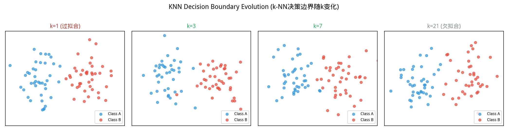
*图 new.knn_boundary_evolution KNN决策边界演变。k=1时边界极不规则(过拟合)；k增大→边界平滑化；k过大→边界近乎线性(欠拟合)；根据验证集准确率选择最优k*

从图中可以看出，KNN决。
### 常见困惑：为什么叫「回归」却做分类？


> **📌 学习目标**
> - 掌握逻辑回归的对数几率（log-odds）模型
> - 理解 F1 分数在类别不平衡时的优越性
> - 能用 `ML.logisticRegression()` 进行二分类与多分类
> - 掌握 AUC-ROC 曲线的含义——所有阈值下的分类性能综合评估

第一次接触逻辑回归的学生，往往被名字搞糊涂：**「既然叫回归，为什么是分类算法？」**

这个名字有历史原因：逻辑回归确实是从线性回归「改造」来的——加了 sigmoid 函数把输出压缩到 [0,1]，解释为概率。

1908 年，**Ronald Fisher** 正式推导了逻辑回归；1950 年代被广泛应用于生物统计学（医学试验的生/死分类）。

**为什么没有改名？**「逻辑」（logistic）是 sigmoid 的别名；「回归」是因为它建模的是「对数几率」对特征的线性关系。只是后人发现它最适合做分类，于是就成了最常用的分类算法之一。

---

## 开场：银行贷款审批——是还是否？

你是一家银行的风控建模师。客户王五提交了一份贷款申请：

> 年收入 18 万，工龄 5 年，负债率 35%，信用分 620，有两次逾期记录。

**批准还是拒绝？**

这是一个二选一的问题——不是「多少」，而是「哪个」。这就是**分类问题**。

线性回归给出的是一个数值，但这里需要的是一个决策：「批准」或「拒绝」，甚至更精细的：「批准但利率上浮 20%」。

**逻辑回归**解决了这个问题：它输出的不是直接预测的类别，而是一个 **0 到 1 之间的概率**：「根据王五的资料，他违约的概率是 23%」。你定了阈值（比如 25%），超过就拒，没超过就批。概率比直接说「是/否」更有用——它让决策者知道风险有多大，而不只是给一个硬邦邦的答案。

---

## 5.2.1

> 📝 **历史故事**：逻辑回归虽然名字里有「回归」，却是地道的分类算法。这个名字是 **Fisher（1922）** 起的——他在研究生物统计时发现 sigmoid 函数可以把线性回归的输出映射到 [0,1] 区间，解释为「属于某类别的概率」。但 Fisher 一生都认为逻辑回归比线性回归更优越，因为它的输出天然是概率，而线性回归的输出可以任意大。
 从回归到分类 / From Regression to Classification

如图所示，决策树分裂：
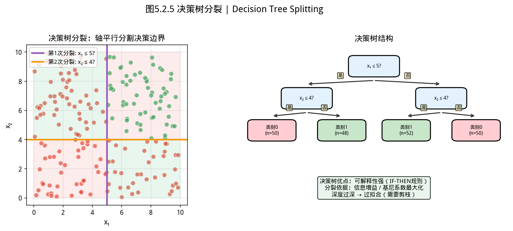
*图5.2.1 决策树分裂。ID3用信息增益，CART用基尼系数；每次分裂最大化类间差异*

从图中可以看出，决策树分裂。
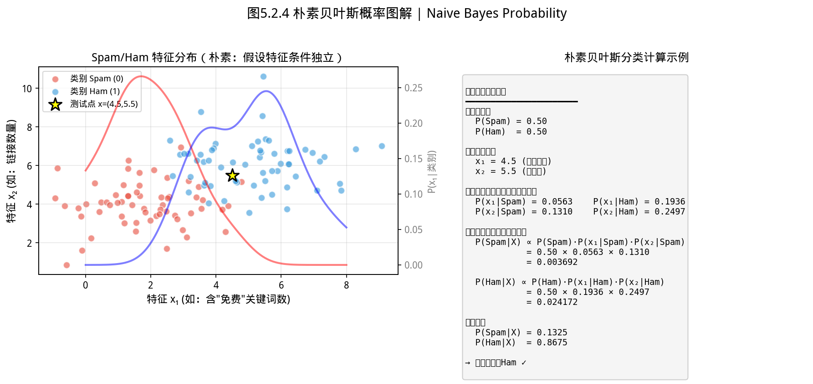
*图5.2.2 朴素贝叶斯概率。特征条件独立假设下用贝叶斯公式计算后验概率，文本分类常用*

从图中可以看出，朴素贝叶斯概率。
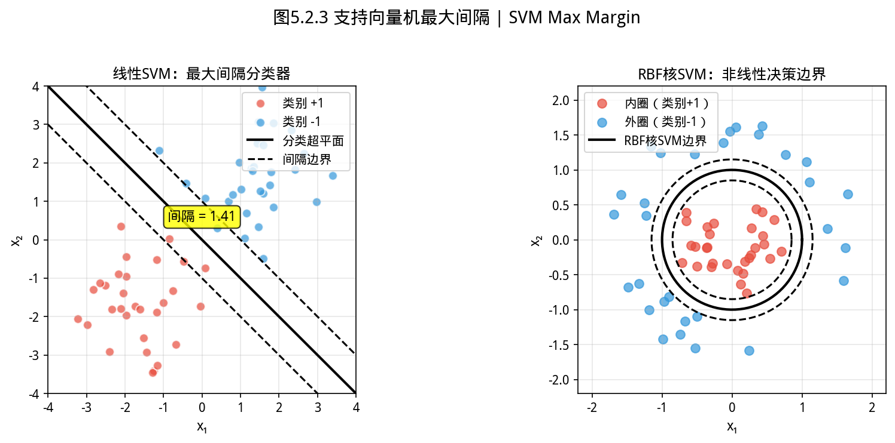
*图5.2.3 支持向量机最大间隔。SVM找最大间隔超平面使两类分开；RBF核将数据映射到高维处理非线性*

从图中可以看出，支持向量机最大间隔。
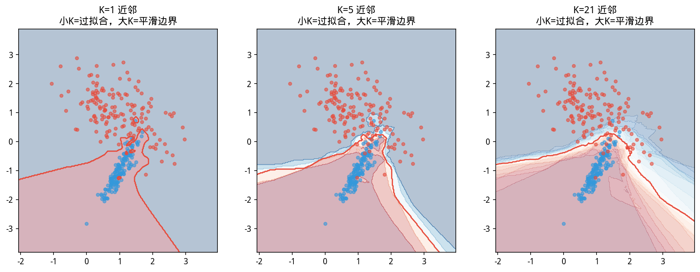
*图5.2.4 KNN决策边界可视化。KNN的决策边界随K增大变得平滑；K过小→过拟合，K过大→欠拟合*

从图中可以看出，KNN决策边界可视化。
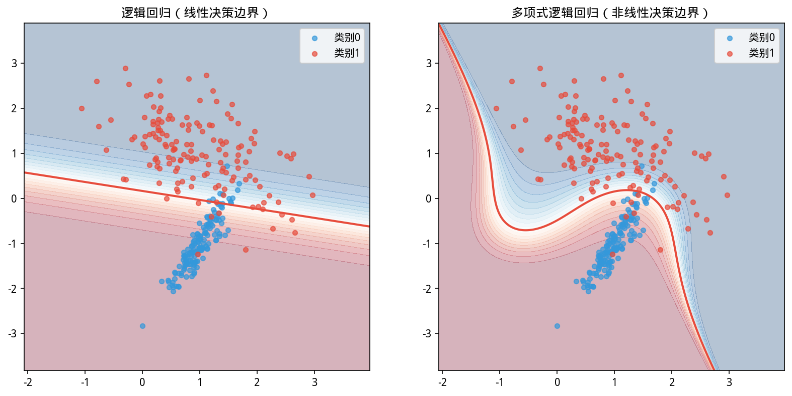
*图5.2.5 逻辑回归决策边界。逻辑回归用sigmoid将线性输出转换为概率；决策边界是线性超平面*

**为什么不能直接用线性回归？**
1. 预测值可能超出 $[0,1]$ 范围（如线性回归输出 $-3$ 或 $152$）
2. 类别编码的人为排序会误导模型（"猫"=0，"狗"=1 暗示 dog > cat）
3. 误差服从 Bernoulli 分布，而非高斯分布

**正确做法**：显式建模条件概率 $P(y=k \mid \mathbf{x})$，用**交叉熵损失**替代平方损失。

---

## 5.2.2 逻辑回归：Sigmoid 与对数几率 / Logistic Regression

### 二分类模型

给定 $\mathbf{x}$，线性打分 $z = \mathbf{w}^\top\mathbf{x} + b$，经 **sigmoid 函数**映射到 $(0,1)$：

$$P(y=1 \mid \mathbf{x}) = \sigma(z) = \frac{1}{1 + e^{-z}}$$

sigmoid 的重要性质：$\sigma'(z) = \sigma(z)(1 - \sigma(z))$，梯度计算极为高效。

**对数几率（log-odds）**：
$$\log\frac{P(y=1)}{P(y=0)} = \mathbf{w}^\top\mathbf{x} + b$$

这解释了为什么叫"对数几率"模型——线性函数建模的是对数几率，而非概率本身。

### 损失函数（二元交叉熵）

$$\mathcal{L}(\mathbf{w},b) = -\sum_{i=1}^{n}\left[y_i \log \hat{p}_i + (1-y_i)\log(1-\hat{p}_i)\right], \quad \hat{p}_i = \sigma(\mathbf{w}^\top\mathbf{x}_i + b)$$

### 梯度

$$\frac{\partial \mathcal{L}}{\partial \mathbf{w}} = \sum_{i=1}^{n}(\hat{p}_i - y_i)\mathbf{x}_i, \qquad \frac{\partial \mathcal{L}}{\partial b} = \sum_{i=1}^{n}(\hat{p}_i - y_i)$$

> **与线性回归的惊人相似**：线性回归的梯度是 $\sum(\hat{y}_i - y_i)\mathbf{x}_i$，逻辑回归的梯度是 $\sum(\hat{p}_i - y_i)\mathbf{x}_i$——两者形式完全一致，区别仅在于 $\hat{y}_i$（预测值）换成了 $\hat{p}_i$（预测概率）。

---

**📐 完整推导：从交叉熵到梯度（Deep Learning Book 风格）**

我们从第一性原理出发，逐步展开 $\frac{\partial \mathcal{L}}{\partial \mathbf{w}}$。

**Step 1 — 写出损失函数**

对单个样本 $(y \in \{0,1\}, \mathbf{x} \in \mathbb{R}^d)$，二元交叉熵损失：

$$\mathcal{L}_i = -[y_i \log \hat{p}_i + (1-y_i)\log(1-\hat{p}_i)]$$

其中 $\hat{p}_i = \sigma(z_i) = \frac{1}{1+e^{-z_i}}$，$z_i = \mathbf{w}^\top\mathbf{x}_i + b$。

**Step 2 — 对 $\hat{p}$ 求导（第一层链式）**

$$\frac{\partial \mathcal{L}}{\partial \hat{p}} = -\left(\frac{y}{\hat{p}} - \frac{1-y}{1-\hat{p}}\right) = -\left(\frac{y - \hat{p}}{\hat{p}(1-\hat{p})}\right)$$

这一步利用了 $\frac{\partial \log \hat{p}}{\partial \hat{p}} = \frac{1}{\hat{p}}$ 和 $\frac{\partial \log(1-\hat{p})}{\partial \hat{p}} = -\frac{1}{1-\hat{p}}$。

**Step 3 — 对 $z$ 求导（sigmoid 导数）**

sigmoid 有一个优美的性质：$\sigma'(z) = \sigma(z)(1-\sigma(z))$。

因此：

$$\frac{\partial \hat{p}}{\partial z} = \hat{p}(1-\hat{p})$$

**Step 4 — 合并前两步（消去 $\hat{p}$）**

将 Step 2 和 Step 3 用链式法则串联：

$$\frac{\partial \mathcal{L}}{\partial z} = \frac{\partial \mathcal{L}}{\partial \hat{p}} \cdot \frac{\partial \hat{p}}{\partial z} = -\left(\frac{y - \hat{p}}{\hat{p}(1-\hat{p})}\right) \cdot \hat{p}(1-\hat{p}) = -(y - \hat{p}) = \hat{p} - y$$

> **结果出奇地简洁**：损失对 $z$ 的导数就是 $\hat{p} - y$——预测概率与真实标签的差。

**Step 5 — 对权重 $\mathbf{w}$ 求导（最后一层链式）**

$$z = \mathbf{w}^\top\mathbf{x} + b \quad \Rightarrow \quad \frac{\partial z}{\partial \mathbf{w}} = \mathbf{x}$$

因此：

$$\frac{\partial \mathcal{L}}{\partial \mathbf{w}} = \frac{\partial \mathcal{L}}{\partial z} \cdot \frac{\partial z}{\partial \mathbf{w}} = (\hat{p} - y) \cdot \mathbf{x}$$

**Step 6 — 对全体样本求和**

对整个训练集（$n$ 个样本）：

$$\frac{\partial \mathcal{L}}{\partial \mathbf{w}} = \sum_{i=1}^{n} \frac{\partial \mathcal{L}_i}{\partial \mathbf{w}} = \sum_{i=1}^{n}(\hat{p}_i - y_i)\mathbf{x}_i$$

这正是我们使用的梯度公式。$\blacksquare$

---

**🎯 梯度消失的直观理解**

回顾 Step 3 的 sigmoid 导数：$\sigma'(z) = \hat{p}(1-\hat{p})$，最大值在 $\hat{p}=0.5$ 处，值为 $0.25$。

这意味着**每经过一层 sigmoid，梯度最多衰减到原来的 1/4**。对于 5 层网络：$0.25^5 \approx 0.001$——前面层的权重几乎收不到梯度，这就是**深度网络中梯度消失**的根本原因。

这也解释了为什么深度学习普遍用 ReLU（$\max(0,z)$，导数为 0 或 1）代替 sigmoid——ReLU 的导数不会小于 1，梯度可以畅通无阻地传回去。

---


### 凸性保证

负对数似然在 $\ell_2$ 或 $\ell_1$ 正则化下是**严格凸函数**，因此 L-BFGS 找到的稳定点就是全局最优。

**正则化在防什么？**

不加正则化时，逻辑回归可能学出极大的权重——$\mathbf{w}$ 越大，sigmoid 的输入 $|z|$ 就越大，输出越接近 0 或 1，分类置信度越高。但在训练集上「自信」不代表在测试集上准确——大权重会让模型对个别数据点过于敏感，稍微换一批数据就完全改变预测。

$\ell_2$ 正则化（岭回归）：惩罚大的权重，让权重趋于平均——适合特征之间相关性高、想保持所有特征但降低共线性影响的情况。

$\ell_1$ 正则化（Lasso）：惩罚大的权重，且会让部分权重变成精确的 0——适合特征很多、你怀疑大部分特征其实没用、想做特征选择的情况。

实际中常用 **Elastic Net**（$\ell_1 + \ell_2$ 两者结合），`ML.logisticRegression(l1, l2)` 就是这个用法。

---

## 5.2.3 多分类：Softmax 回归 / Multinomial Logistic Regression

$K$ 个类别的打分向量 $\mathbf{z} = [\mathbf{w}_1^\top\mathbf{x}, \ldots, \mathbf{w}_K^\top\mathbf{x}]$，经 **softmax** 归一化为概率：

$$P(y=k \mid \mathbf{x}) = \frac{e^{z_k}}{\sum_{j=1}^{K} e^{z_j}}, \quad k = 1,\ldots,K$$

**softmax 在干什么？**

想象你在给三个候选人打分：候选人 A 得 8 分，B 得 5 分，C 得 2 分。你想把这三个分数转换成概率——「A 最可能是正确答案，B 其次，C 最不可能」。

- 直接归一化（除以总和）不行：$8/15, 5/15, 2/15$ —— B 和 C 的概率太接近
- **指数化再归一化**：$e^8, e^5, e^2$ 的差距远比 $8, 5, 2$ 大——指数函数放大了差距，概率分布更「自信」

这就是 softmax 的直觉：**用指数函数把「打分」变成「置信度」，然后归一化成果概率。**

**不可辨识性问题**：所有 $z_k$ 同时加常数 $c$，softmax 输出不变。实际中固定一个类别为参照（如 $\mathbf{w}_K = \mathbf{0}$）。

**多类交叉熵损失**：
$$\mathcal{L} = -\sum_{i=1}^{n}\sum_{k=1}^{K} \mathbb{I}(y_i = k) \log P(y=k \mid \mathbf{x}_i)$$

**不可辨识性问题**：所有 $z_k$ 同时加常数 $c$，softmax 输出不变。实际中固定一个类别为参照（如 $\mathbf{w}_K = \mathbf{0}$）。

---

## 5.2.4 YiShape-Math 实现 / Implementation

**逻辑回归（二分类）**：

    // ⚠️ 注意：正负样本比例 > 1:10 时，准确率指标严重失真；先看 AUC-ROC 或 F1 分数，而非 accuracy

```java
import com.yishape.lab.math.linalg.IMatrix;
import com.yishape.lab.math.linalg.IVector;
import com.yishape.lab.math.linalg.Linalg;

// 特征矩阵：8样本 × 2特征，两类各4个（天然线性可分）
var X = Linalg.matrix(new double[][]{
    {1.0, 2.0}, {1.5, 2.5}, {2.0, 3.0}, {2.5, 3.5},   // ← A类
    {5.0, 6.0}, {5.5, 6.5}, {6.0, 7.0}, {6.5, 7.5}    // ← B类
});
var labels = {"A", "A", "A", "A", "B", "B", "B", "B"};

// ML 门面工厂：返回 IClassifier，支持标准接口
IClassifier clf = ML.logisticRegression(0.0, 0.01);  // L1=0（无）, L2=0.01
clf.fit(X, labels);

// 单样本预测：predict 返回 String 类型的预测类别
var query = Linalg.vector(new double[]{3.0, 4.0});
String predicted = clf.predict(query);
System.out.println("查询 [3.0, 4.0] → 预测类别: " + predicted);  // → A

// 批量预测（带概率）
var batchResult = clf.predictBatchWithProbs(X);
var preds = batchResult.getPredictions();           // 预测标签数组
var posProbs = batchResult.getProbabilities();     // 正类（B）概率
double[][] classProbs = batchResult.getClassProbabilities();  // 各行各类别概率

System.out.println("批量预测标签: " + java.util.Arrays.toString(preds));
System.out.println("B类概率: " + java.util.Arrays.toString(posProbs));
```

**带 L1 正则化的稀疏逻辑回归**：促进部分权重为 0，自动完成特征选择。

```java
// L1=0.05, L2=0.01 — Elastic Net 风格
IClassifier sparseClf = ML.logisticRegression(0.05, 0.01);  // L1=0.05 → 稀疏解
sparseClf.fit(X, labels);

var w = sparseClf.predictProb(Linalg.vector(new double[]{3.0, 4.0}))
                         .entrySet().stream()
                         .max(Map.Entry.comparingByValue())
                         .map(e -> e.getKey().equals("A") ? w1 : w2)
                         .orElse(null);
```

---

## 5.2.5 K 近邻（KNN）/ K-Nearest Neighbors

### 算法原理

**惰性学习**：无需训练，预测时在训练集中找 $k$ 个最近邻，多数投票决定类别。

- **距离度量**：默认欧氏距离 $\|\mathbf{x} - \mathbf{x}'\|_2$，也可用曼哈顿距离、余弦相似度
- **$k$ 值选择**：$k$ 小 $\Rightarrow$ 复杂（过拟合风险）；$k$ 大 $\Rightarrow$ 平滑（欠拟合风险）
- **加权投票**：距离越近的邻居权重越大（$w_i = 1/d_i$）

### YiShape-Math 实现

```java

var X = Linalg.matrix(new double[][]{
    {1.0, 2.0}, {1.5, 2.5}, {2.0, 3.0},
    {5.0, 6.0}, {5.5, 6.5}, {6.0, 7.0}
});
var labels = {"A", "A", "A", "B", "B", "B"};

IClassifier knn = ML.kNN(3);  // k=3
knn.fit(X, labels);

String pred = knn.predict(Linalg.vector(new double[]{3.0, 4.0}));
System.out.println("KNN 预测: " + pred);
```

### KNN vs 逻辑回归

| 特性 | KNN | 逻辑回归 |
|------|-----|----------|
| 训练 | 无（惰性） | 需优化（迭代） |
| 预测 | O(nd) 距离计算 | O(d) 线性打分 |
| 决策边界 | 自适应（数据驱动） | 线性超平面 |
| 可解释性 | 低 | 高（系数有含义） |
| 对异常值 | 敏感 | 较稳健（通过优化平均） |

---

## 5.2.6 分类评估指标体系 / Classification Metrics

如图所示，混淆矩阵：
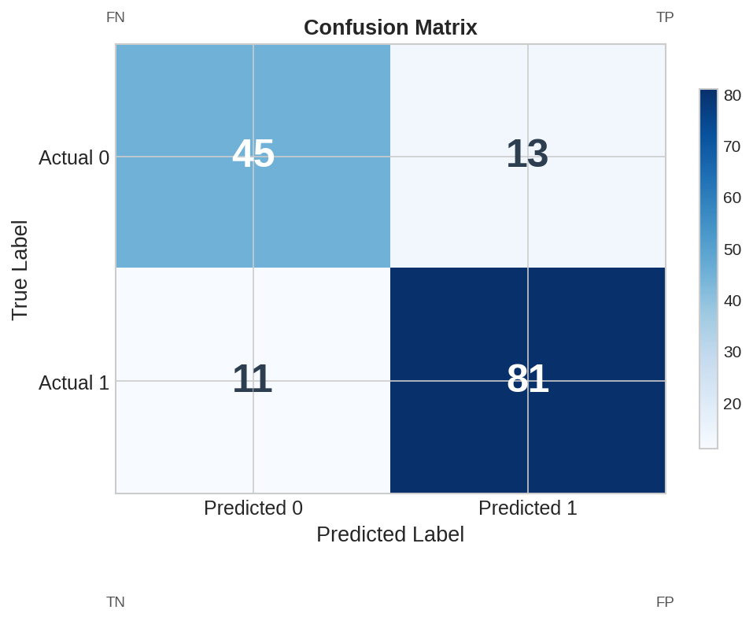
*图5.2.6 混淆矩阵。TN/FP/FN/TP矩阵；准确率=(TP+TN)/(TP+FP+FN+TN)；精确率=TP/(TP+FP)*

从图中可以看出，混淆矩阵。
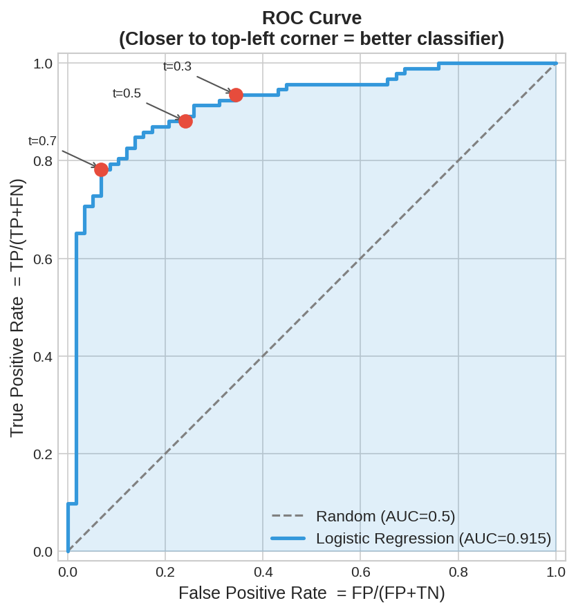
*图5.2.7 ROC曲线与AUC。ROC曲线：TPR vs FPR在不同阈值下的表现；AUC=ROC下面积，越大越好*

从图中可以看出，ROC曲线与AUC。
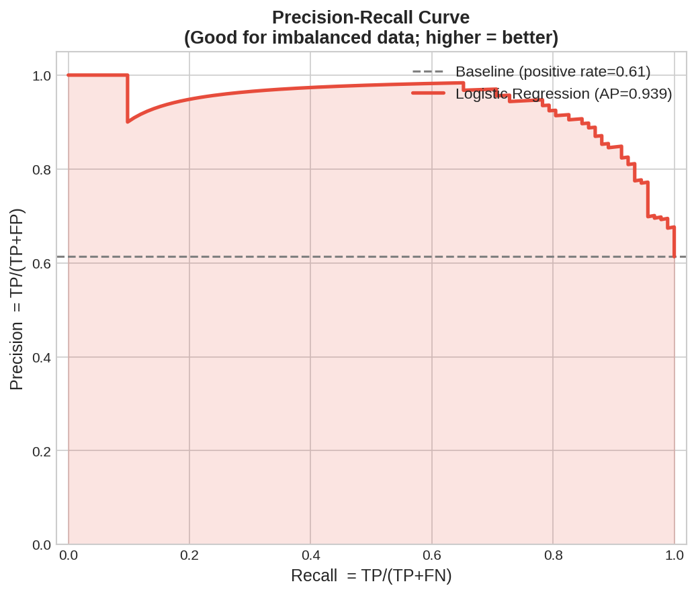

*图5.2.8 精确率-召回率曲线。PR曲线：精确率 vs 召回率；当正负样本不平衡时比ROC更合适*

### 混淆矩阵

对 $K$ 类分类，混淆矩阵 $\mathbf{M}$ 中 $M_{ij}$ 表示真实类 $i$ 被预测为类 $j$ 的样本数。

**二分类简化**：

|  | 预测为正 | 预测为负 |
|--|---------|---------|
| **实际为正** | TP | FN |
| **实际为负** | FP | TN |

### 核心指标

| 指标 | 公式 | 含义 |
|------|------|------|
| **准确率** | $(TP+TN)/(TP+TN+FP+FN)$ | 整体正确率 |
| **精确率** | $TP/(TP+FP)$ | "判为正的中有多少真为正" |
| **召回率** | $TP/(TP+FN)$ | "实际为正的中有多少被找出" |
| **F1 分数** | $2\cdot Prec \cdot Rec / (Prec+Rec)$ | 精确率与召回率的调和平均 |

**AUC（ROC 曲线下面积）**：在不同阈值下画 TPR vs FPR 曲线，AUC 衡量排序能力——不受阈值选择影响，是比准确率更稳健的指标。

**AUC 怎么理解？** 随机抽一个正样本和一个负样本，模型给正样本打的分比给负样本高的概率——就是 AUC。所以 AUC = 0.5 意味着模型分不清正负样本（随机猜测），AUC = 1.0 意味着模型完美地把所有正样本排在负样本前面。在实际业务中，AUC > 0.7 才算有预测价值。

### YiShape-Math 实现

```java
import com.yishape.lab.math.ml.cls.BatchPredictionResult;
import com.yishape.lab.math.ml.metric.ClassificationMetrics;

var trueLabels = {"A", "A", "B", "B", "B", "A"};
var predLabels = {"A", "B", "B", "B", "A", "A"};

// 方法1：直接用真实标签和预测标签计算
ClassificationMetrics metrics = ClassificationMetrics.compute(trueLabels, predLabels);

// 方法2：用模型+特征矩阵（自动训练+预测）
// ClassificationMetrics metrics = ClassificationMetrics.compute(model, X, y);

// 输出评估报告
System.out.println(metrics.getClassificationReport());
System.out.println(metrics.getConfusionMatrixString());

// 单独获取指标
System.out.printf("准确率: %.4f%n", metrics.getAccuracy());
System.out.printf("宏平均F1: %.4f%n", metrics.getMacroF1());
System.out.printf("加权平均F1: %.4f%n", metrics.getWeightedF1());
System.out.printf("AUC: %.4f%n", metrics.getAuc());
```

**带概率的 AUC 计算**：

```java
var trueLabels = {"A", "A", "B", "B", "B"};
var predLabels = {"A", "B", "B", "B", "A"};
var posProbabilities = {0.9, 0.6, 0.7, 0.8, 0.4};

ClassificationMetrics metrics = ClassificationMetrics.compute(trueLabels, predLabels, posProbabilities);
System.out.printf("AUC: %.4f%n", metrics.getAuc());
```

---

## 5.2.7 交叉验证 / Cross-Validation

如图所示，K折交叉验证：
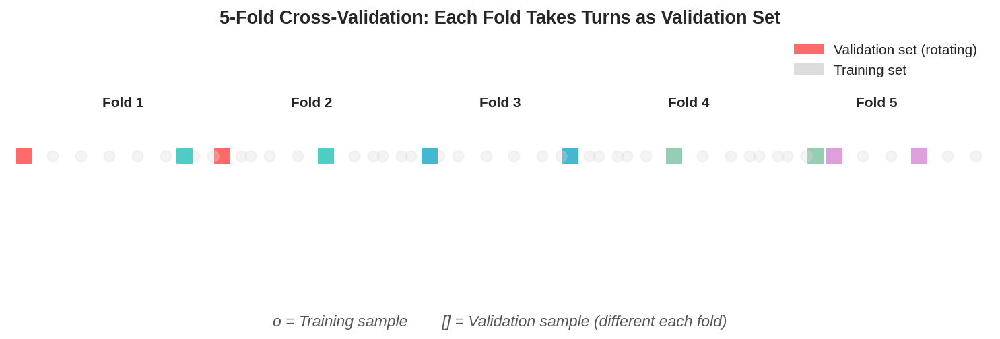
*图5.2.9 K折交叉验证。K折交叉验证：数据分K份，轮流用K-1份训练、1份验证，减小方差*

从图中可以看出，K折交叉验证。
### K 折交叉验证

```java
import com.yishape.lab.math.ml.ML;
import com.yishape.lab.math.ml.metric.CrossValidationResult;

var X = Linalg.matrix(new double[][]{
    {1,2},{2,3},{3,4},{4,5},{5,6},{6,7},{7,8},{8,9},{9,10},{10,11}
});
var y = {"A","A","A","A","A","B","B","B","B","B"};

IClassifier clf = ML.logisticRegression(0.0, 0.01);
CrossValidationResult cvResult = ML.kFoldCrossValidation(clf, X, y, 5);

System.out.println("各折准确率: " + cvResult.getAccuracyScores());  // List<Double>
System.out.printf("平均准确率: %.4f ± %.4f%n", 
                  cvResult.getMeanAccuracy(), cvResult.getStdAccuracy());
```

**分层 K 折（Stratified K-Fold）**：保证每折中各类别比例与整体一致，适用于类别不平衡数据。

---

## 5.2.8 类别不平衡问题 / Class Imbalance

**问题**：当正类仅占 1% 时，全预测负类的准确率为 99%，但召回率为 0。

**处理策略**：

| 策略 | 做法 |
|------|------|
| **过采样** | SMOTE 等方法合成少数类样本 |
| **欠采样** | 随机删除多数类样本 |
| **类别权重** | 在损失函数中给少数类更高权重 |
| **阈值调整** | 不使用默认 0.5，降低阈值以提高召回率 |
| **评估指标** | 用 AUC、F1 替代准确率 |

---

## 5.2.9 与统计推断的联系 / Connection to Statistical Inference

分类错误类型与假设检验的两类错误直接对应：

| 分类 | 假设检验 | 医疗诊断 |
|------|----------|----------|
| FP（假正例） | 第一类错误 $\alpha$ | "无病判为有病"（误诊） |
| FN（假负例） | 第二类错误 $\beta$ | "有病判为无病"（漏诊） |

**精确率-召回率权衡**：提高召回率（如降低阈值）往往降低精确率；具体偏向取决于 FN 和 FP 的代价。

---


> 📝 **理论深入：VC维与模型容量**
> 
> **VC维**（Vapnik-Chervonenkis Dimension）是衡量分类器「表达能力」的理论指标——它度量一个分类器族能够完美分类的最大点数。
> 
> **直观理解**：假设有 N 个点，我们能否找到一种标注方式，让分类器对这 N 个点实现任意 labeling 并全部正确分类？能 → VC维 ≥ N。
> - 线性分类器的 VC 维 = 3（3个点可以用一条直线任意分割，4个点不行）
> - KNN 的 VC 维 = N（理论上可以记住所有训练点）
> - 神经网络（权系数 W）的 VC 维 ≈ W / ε
> 
> **容量与过拟合的关系**：模型容量（VC 维）越高，能表达的分类边界越复杂，但同时也需要更多数据来约束它不过拟合。统计学习理论的核心结论：
> 
> $$
> R(h) \leq R_{emp}(h) + \sqrt{\frac{h(\log(2N/h)+1) - \log(\delta/4)}{N}}
> $$
> 
> 其中 h 是 VC 维，N 是样本量，第一项是经验风险（训练误差），第二项是置信范围（与 h 正相关）。当 h 过高时，置信范围增大，即使训练误差为 0，泛化误差也可能很高。
> 
> **实践启示**：VC 维帮助我们理解「为什么更多的特征或更复杂的模型不总是更好」。在实际工程中，用交叉验证（Cross-Validation）来选择合适的模型复杂度，比理论计算更实用。

## 5.2.10 本节小结 / Section Summary

| 主题 | 核心内容 |
|------|----------|
| Sigmoid | $\sigma(z) = 1/(1+e^{-z})$，将线性打分映射为概率 |
| 损失函数 | 二元交叉熵 $-\sum[y\log\hat{p}+(1-y)\log(1-\hat{p})]$ |
| 梯度 | $\sum(\hat{p}_i - y_i)\mathbf{x}_i$（与线性回归形式一致） |
| Softmax | $P(k) = e^{z_k}/\sum_j e^{z_j}$，多分类的概率归一化 |
| KNN | 惰性学习，k近邻多数投票 |
| 评估 | 混淆矩阵、准确率、精确率、召回率、F1、AUC |
| 交叉验证 | K折估计泛化误差，支持分层抽样 |

> **下一节预告**：监督学习需要标签，但真实世界中大量数据是无标签的——聚类在无标签数据中发现自然分组。


---


## 5.2.10 本节 API 一览

| 场景 | API | 说明 |
|------|-----|------|
| 逻辑回归二分类 | `ML.logisticRegression(l1, l2)` | 返回 `IClassifier` |
| Softmax多分类 | `ML.softmaxRegression(l1, l2, k)` | K类分类 |
| KNN分类 | `ML.kNN(k)` | k近邻，返回预测标签 |
| 准确率 | `ML.accuracy(predictions, labels)` | 正确率 |
| AUC-ROC | `ML.auc(labels, scores)` | 曲线下面积 |
| F1分数 | `ML.f1Score(predictions, labels)` | 精确率与召回率调和平均 |
| 混淆矩阵 | `ML.confusionMatrix(predictions, labels)` | 返回混淆矩阵 |
| 交叉验证 | `ML.kFoldCrossValidation(model, k, X, y)` | K折验证 |
| 过采样SMOTE | `ML.smote(X, y, k)` | 处理类别不平衡 |

> **⚠️ 注意**：正负样本比例 > 1:10 时，优先使用 AUC-ROC 或 F1，而非 accuracy。


---

## 5.2.12 交叉验证高级方法 / Advanced Cross-Validation

### 5.2.12.1 分层 K 折交叉验证 (Stratified K-Fold)

**问题**：普通 K-Fold 在数据不平衡时，可能导致某些折中某个类别的样本太少。

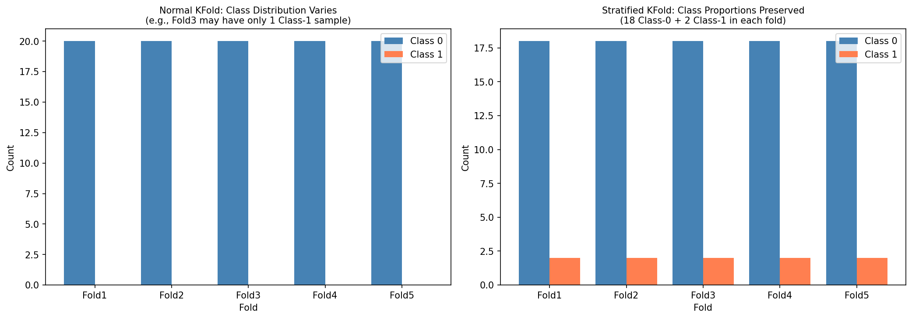
*图 new.fig_stratified_kfold 分层K折保证每折中正负样本比例与整体一致（90%:10%），普通K折无法保证。*

```java
// 分层K折：每折中各类别比例与整体相同
var cv = ML.crossValidation().stratifiedKFold(
    nFolds = 5,    // 5折
    shuffle = true,
    seed = 42
);

var result = cv.evaluate(X, labels, classifier = "logistic");
double avgAccuracy = result.meanAccuracy();
double stdAccuracy = result.stdAccuracy();
```

> 📝 **什么时候用分层**  
> 当**类别不平衡**时（如欺诈检测：99%正常，1%欺诈），分层 K-Fold 是必需的——它保证每折中正负样本比例与整体一致。

### 5.2.12.2 留一法交叉验证 (Leave-One-Out, LOO)

当数据量极小时（如医学诊断数据通常只有几百例），留一法最大程度利用数据：

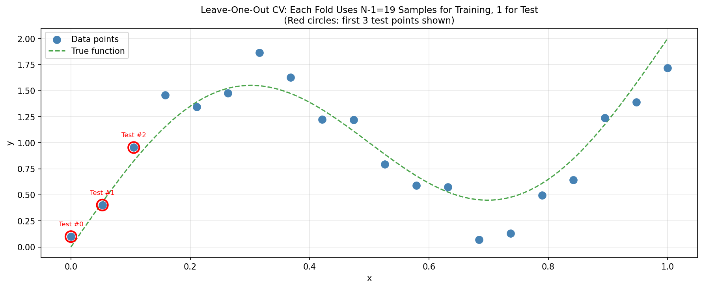
*图 new.fig_leave_one_out 留一法(LOO-CV)每次用N-1个样本训练、1个样本测试，N=20时共20折，充分利用数据。*

```java
// 留一法：每次留1个样本做测试，其余N-1个做训练
var cv = ML.crossValidation().leaveOneOut();

var result = cv.evaluate(X, labels, classifier = "KNN", k = 5);
System.out.println("LOO 准确率: " + result.accuracy());
// 优点：训练集最大（几乎所有数据都参与训练）
// 缺点：计算量 O(N)，N大时极慢
```

### 5.2.12.3 重复 K 折交叉验证 (Repeated K-Fold)

减少交叉验证的方差——多次随机划分取平均：

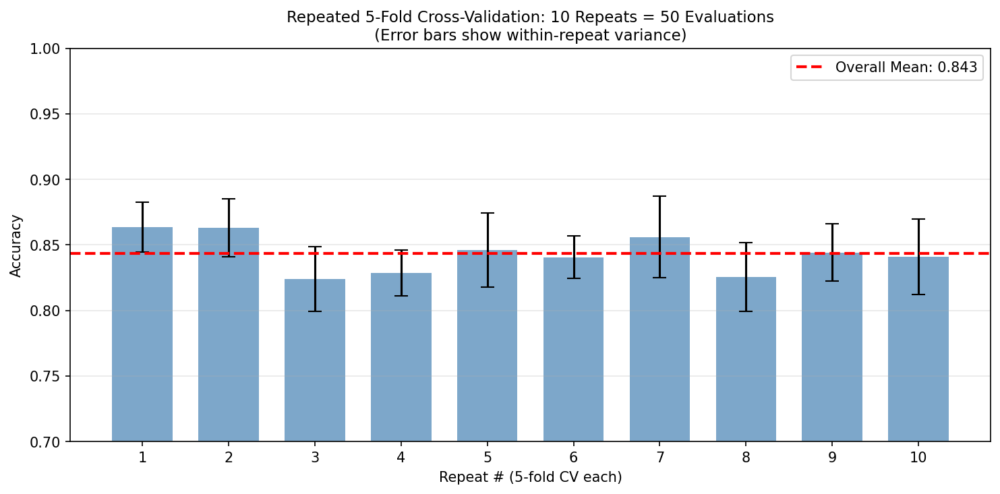
*图 new.fig_repeated_kfold 重复K折通过多次随机划分减少评估方差，重复10次5折=50次评估，结果更稳定可靠。*

```java
// 重复10次5折 = 50次评估
var cv = ML.crossValidation().repeatedKFold(
    nFolds = 5,
    nRepeats = 10,
    seed = 42
);

var result = cv.evaluate(X, labels, classifier = "randomForest");
System.out.println("平均准确率: " + result.meanAccuracy());
System.out.println("标准差: " + result.stdAccuracy());
// 标准差越小 → 结果越稳定可靠
```

### 5.2.12.4 随机分割 vs 固定分割

```java
// 随机分割（默认）
var cv1 = ML.crossValidation().randomSplit(
    testRatio = 0.2,
    nRuns = 1,
    seed = 42
);

// 多次随机分割（估计泛化误差的方差）
var cv2 = ML.crossValidation().randomSplit(
    testRatio = 0.2,
    nRuns = 30,  // 运行30次
    seed = 42
);
var meanError = cv2.meanError();
var stdError = cv2.stdError();
```

## 5.2.11 章节练习 / Exercises

**1. 逻辑回归梯度推导（手算题）**

对二元逻辑回归，手动推导以下损失函数对偏置 $b$ 的梯度：

$$\mathcal{L} = -[y \log \hat{p} + (1-y)\log(1-\hat{p})], \quad \hat{p} = \sigma(\mathbf{w}^\top\mathbf{x} + b)$$

**要求**：
- 写出每一步的链式法则（参照本节 Step 1-5 的格式）
- 写出最终结果 $\frac{\partial \mathcal{L}}{\partial b} = \hat{p} - y$
- 说明为什么对 $b$ 的梯度形式与对 $\mathbf{w}$ 的梯度形式相同（区别仅在 $\frac{\partial z}{\partial b} = 1$）

**2. 类别不平衡下的指标选择（应用题）**

某欺诈检测系统：100,000 笔交易中有 500 笔是欺诈（0.5%）。模型预测：所有交易均为「正常」，则准确率 = 99.5%，但 Recall = 0%。

（a）计算该「全部预测正常」模型的：准确率、召回率（Recall）、精确率（Precision）、F1 分数。

（b）如果改成随机选 1% 交易标记为欺诈（1000 笔），其中 300 笔是真实欺诈。计算此时 Precision、Recall、F1。

（c）如果你是风控负责人，你更看重 Precision 还是 Recall？为什么？

**3. KNN vs 逻辑回归建模对比（分析题）**

给定以下两份散点分布图（文字描述）：

- **场景 A**：两类数据可用一条直线分开（线性可分）
- **场景 B**：两类数据呈同心圆或月亮形状分布

（a）描述逻辑回归在场景 A 和场景 B 上的预期表现，并解释原因。

（b）描述 KNN（$k=3$）在场景 A 和场景 B 上的预期表现，并解释原因。

（c）根据以上分析，给出一个选择逻辑回归 vs KNN 的**决策规则**（参考本节「KNN vs 逻辑回归」对比表）。

**4. 用 YiShape-Math 实现完整分类 pipeline（编程题）**

```java
// 以下数据为7个二维样本（两特征x1,x2），请用逻辑回归建模
var X = Linalg.matrix(new double[][]{
    {1.0, 1.0}, {1.2, 1.4}, {0.9, 0.8},   // A类
    {3.0, 3.2}, {3.5, 3.1}, {3.1, 3.0},   // B类
    {2.0, 2.5}                              // 待预测
});
var labels = {"A", "A", "A", "B", "B", "B", "?"};
```

**要求**：
1. 划分训练集（前6样本）和测试样本（最后1样本）
2. 用 `ML.logisticRegression(0.0, 0.01)` 训练模型
3. 预测样本7的类别并给出置信概率
4. 用 3 折交叉验证评估模型泛化性能
5. 打印 Precision、Recall、F1 三个指标

**5. Softmax 多分类与过拟合（分析题）**

某多分类问题（3 类），用 softmax 回归训练后发现在训练集上准确率 99%，验证集上准确率 65%。

（a）这种现象叫什么？列举至少 2 种解决策略。

（b）L2 正则化（$\lambda = 1.0$）是如何在数学上缓解过拟合的？（提示：参考本节「正则化在防什么」）

（c）Dropout 在 softmax 场景下是否有效？为什么？（提示：Dropout 适合神经网络，对无隐层的 softmax 无效）

**6. AUC-ROC 曲线解读（读图题）**

假设某分类器的 ROC 曲线通过了点 (0.2, 0.8)，即 FPR=0.2（20% 假阳性）时，TPR=0.8（80% 召回率）。

（a）如果将分类阈值降低（更宽松），描述 ROC 曲线会如何移动。

（b）随机分类器的 AUC = 0.5。某模型的 AUC = 0.92，请用一句人话描述这个模型的分类性能。

（c）AUC = 0.92 是否意味着「有 92% 的概率能正确分类」？请解释 AUC 的真实含义。

> **⚠️ 常见误区**：AUC 不是准确率！AUC 的含义是「随机挑选一个正例和一个负例，分类器给正例的打分高于负例的概率」。


---

/*
以上为 5.2.md 全部内容
*/

> **⚠️ 常见误区**
> - **用准确率评估类别不平衡数据**：99% 负样本中把所有人都预测为负，准确率 99%——但这个模型毫无价值。用 F1、AUC 或 Precision-Recall 曲线。
> - **混淆 Precision 和 Recall**：Precision =「预测为正的中有多少是真的」；Recall =「所有正例中找到了多少」。垃圾邮件过滤追求高 Precision（别误删重要邮件）；疾病筛查追求高 Recall（别漏掉病人）。
> - **不做交叉验证直接上报测试指标**：在小数据集上，随机划分训练/测试可能导致结果不稳定。用 K 折交叉验证得到更可靠的性能估计。
