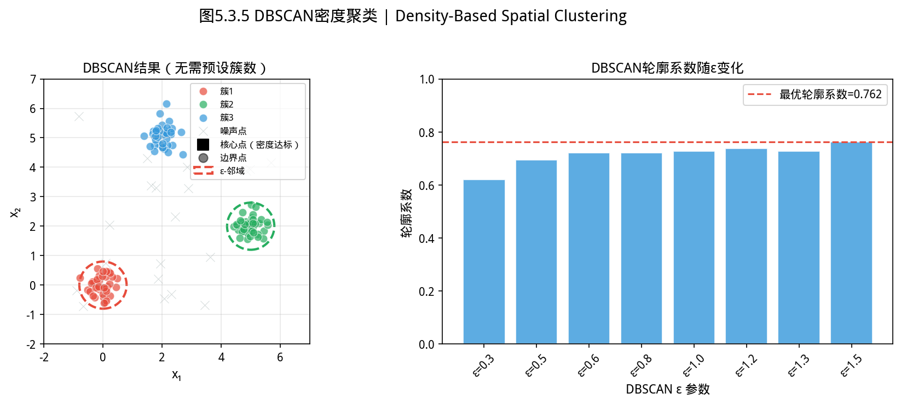
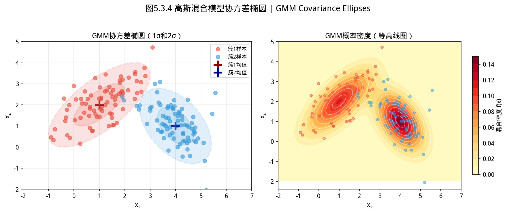
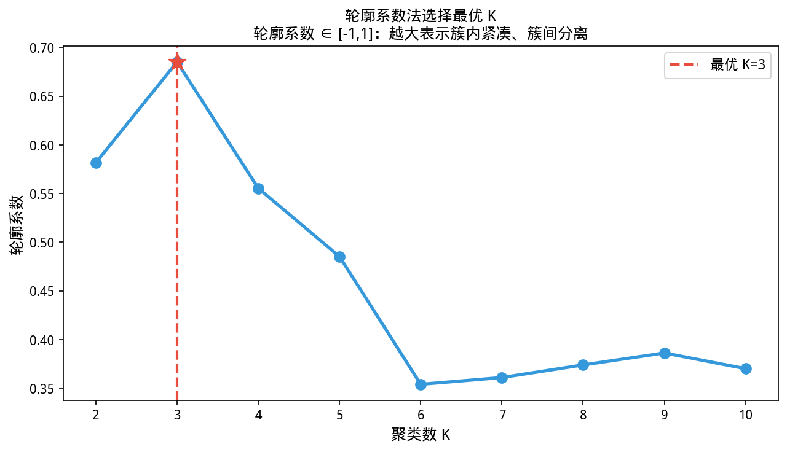
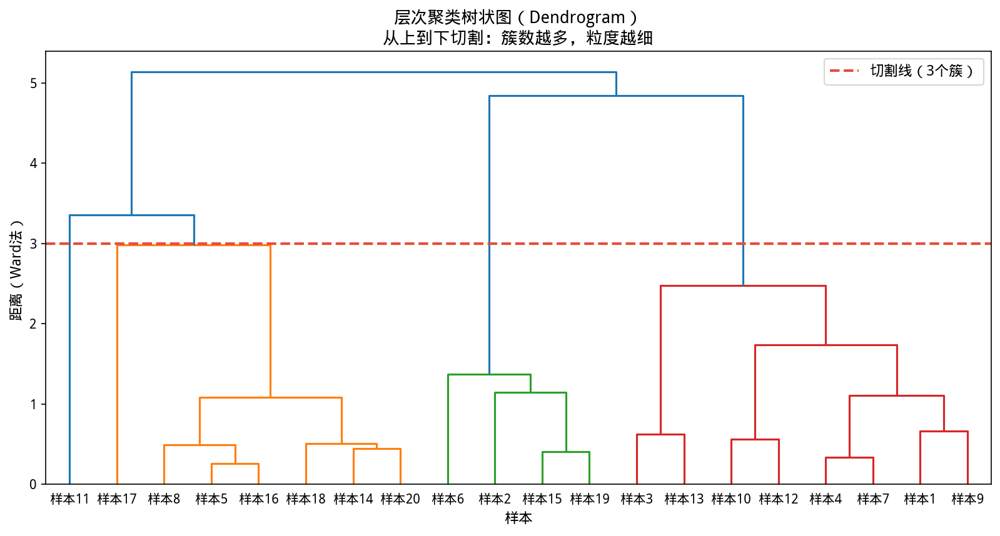
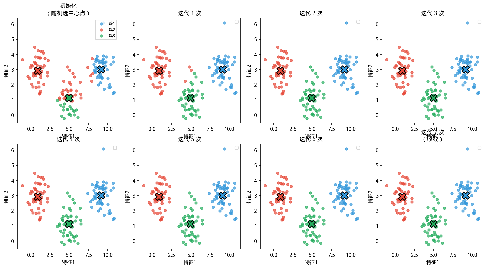
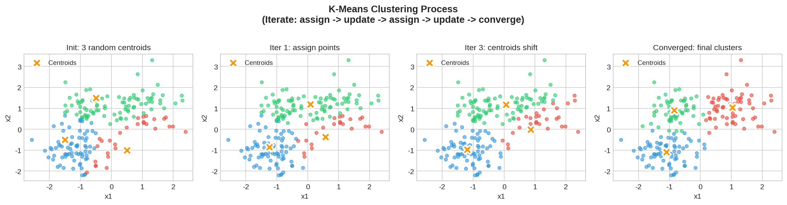

# 5.3 聚类 / Clustering

## 开场：电商平台是怎么给用户「打标签」的？


> **📌 学习目标**
> - 理解 EM 算法的 E 步（猜隐藏状态）与 M 步（更新参数）迭代机制
> - 能用双硬币实验理解 EM 的「观测不完整 → 迭代估计」核心思想
> - 掌握 K-Means（硬聚类）与 GMM（软聚类，椭圆簇）的适用场景
> - 能用轮廓系数确定合理的簇数 $K$

你打开一个电商 App，首页显示的模块不一样：
- 给你推荐「婴儿奶粉、纸尿裤」的模块
- 给他推荐「机械键盘、游戏鼠标」的模块
- 给另一个用户推荐「露营帐篷、登山鞋」

**但平台并不知道用户的真实年龄和职业——它只知道每个用户的浏览、点击、购买记录。**

平台把这两亿用户的数据全部丢进一个算法，让算法自己「看看这堆数据里有没有什么规律」。算法跑完之后，输出了几个组：「第一组用户特征：频繁购买母婴用品、晚上浏览多」「第二组用户特征：买过电竞装备、客单价高」——这就是**聚类**。

聚类不需要标签（无监督学习）：你不用提前告诉算法「谁是母婴用户」，它自己从数据里发现：「哦，这批人行为模式很像，他们大概是一类人吧」。

---

## 5.3.1

> 📝 **历史故事**：K-Means 由 **Stuart Lloyd（1957）** 在贝尔实验室发明，但直到 1982 年才正式发表。Lloyd 当时在研究数字电话信号的编码问题——他发现把信号空间划分为 K 个聚类可以大幅压缩数据。这个算法在工业界被使用了 25 年才进入学术文献，成为今天最广泛使用的聚类算法。
 聚类的问题与典型应用 / Problems and Applications

如图所示，DBSCAN密度聚类：

*图5.3.1 DBSCAN密度聚类。基于密度的聚类：核心点、边界点、噪声点，无需预设簇数，可发现任意形状*

从图中可以看出，DBSCAN密度聚类。

*图5.3.2 高斯混合模型协方差椭圆。GMM用多个高斯混合拟合数据分布，协方差椭圆刻画各簇的形状和方向*

从图中可以看出，高斯混合模型协方差椭圆。

*图5.3.3 轮廓系数确定最优K。轮廓系数s=(b-a)/max(a,b)；a=簇内距离，b=最近簇距离；s越大越好*

从图中可以看出，轮廓系数确定最优K。

*图5.3.4 层次聚类树状图。层次聚类树状图：纵轴是距离/相似度；不同切割得不同簇数*

从图中可以看出，层次聚类树状图。

*图5.3.5 K-means迭代细节。K-means：①随机初始化中心②分配样本到最近中心③更新中心④迭代收敛*

从图中可以看出，K-means迭代细节。

*图5.3.6 K-means聚类迭代过程。K-means迭代过程：中心移动→簇重新分配→直至收敛或达到最大迭代次数*

**核心目标**：将数据集划分为 $K$ 个簇，使簇内紧密度最大化、簇间分离度最大化。

**典型应用场景**：
- **客户分群**：电商根据购买行为将用户分为不同群体，制定差异化营销策略
- **图像分割**：将像素按颜色/纹理聚类，识别前景与背景
- **异常检测**：离群簇中的样本可能表示欺诈、故障或罕见事件
- **文档主题发现**：将文本向量聚类，发现隐含主题结构
- **生物信息学**：基因表达数据聚类，发现功能相关的基因群

---

## 5.3.2 K-Means 算法 / K-Means Algorithm

### 目标函数

给定簇数 $K$，最小化**簇内平方和（inertia / within-cluster sum of squares）**：

$$J = \sum_{k=1}^{K}\sum_{\mathbf{x}_i \in C_k} \|\mathbf{x}_i - \boldsymbol{\mu}_k\|_2^2$$

其中 $\boldsymbol{\mu}_k = \frac{1}{|C_k|}\sum_{\mathbf{x}_i \in C_k}\mathbf{x}_i$ 是第 $k$ 簇的中心。

### Lloyd 算法（交替优化）

1. **分配步（E步）**：将每个样本分配到最近的簇中心
   $$C_k = \{\mathbf{x}_i \mid \|\mathbf{x}_i - \boldsymbol{\mu}_k\|_2 \leq \|\mathbf{x}_i - \boldsymbol{\mu}_j\|_2,\ \forall j\}$$

2. **更新步（M步）**：重新计算每个簇的中心
   $$\boldsymbol{\mu}_k = \frac{1}{|C_k|}\sum_{\mathbf{x}_i \in C_k}\mathbf{x}_i$$

每步 $J$ 不增，算法必然收敛。但 $J$ 非凸，收敛到**局部极小**，初始中心的选择对结果影响很大。

**计算复杂度**：每轮 $O(nKd)$（$n$ 样本、$K$ 簇、$d$ 维度），通常几到几十轮收敛。

### K-Means++ 初始化 / K-Means++ Initialization

标准随机初始化的问题是多个中心可能落在同一密集区域。**K-Means++** 依次选择中心：

1. 第一个中心从所有样本中均匀随机选取
2. 第 $k$ 个中心以概率 $p_i \propto D(\mathbf{x}_i)^2$ 选取，$D(\mathbf{x}_i)$ 是 $\mathbf{x}_i$ 到已选中心的最近距离

**理论保证**（Arthur & Vassilvitskii, 2007）：K-Means++ 初始化的期望代价不超过最优解的 $8(\ln K + 2)$ 倍。

### YiShape-Math 实现

```java
import com.yishape.lab.math.linalg.IMatrix;
import com.yishape.lab.math.linalg.Linalg;
import com.yishape.lab.math.ml.ML;
import java.util.*;

var data = Linalg.matrix(new double[][]{
    {0.0, 0.0}, {0.5, 0.2}, {0.2, 0.6},   // 簇1
    {5.0, 5.0}, {5.2, 5.1}, {4.8, 5.3}    // 簇2
});

// 使用工厂方法创建 K-Means（k=2，固定种子保证可复现性）
var km = ML.clu.kMeans(2, 42L);
km.fit(data);

var labels = km.getLabels();
System.out.println("inertia = " + km.getInertia());
System.out.println("收敛 = " + km.isConverged());
System.out.println("迭代次数 = " + km.getIterations());

for (int i = 0; i < labels.length; i++) {
    System.out.println("样本 " + i + " → 簇 " + labels[i]);
}
// 预期：前3个样本→簇0，后3个样本→簇1
    // ⚠️ 注意：K-Means 对初始中心敏感；建议运行 5-10 次取最优结果，或用 K-Means++ 初始化

```

---

## 5.3.3 选择簇数 $K$ / Choosing the Number of Clusters

### 肘部法则 / Elbow Method

画不同 $K$ 下的 inertia 曲线，拐点（"肘部"）对应的 $K$ 通常较合理：

```java
// 肘部法则
for (int k = 2; k <= 6; k++) {
    var km = ML.clu.kMeans(k, 42L);
    km.fit(data);
    System.out.printf("K=%d: inertia=%.4f%n", k, km.getInertia());
}
```

### 轮廓系数 / Silhouette Coefficient

对单个样本 $i$：

$$s(i) = \frac{b(i) - a(i)}{\max\{a(i), b(i)\}}$$

- $a(i)$：$i$ 到同簇其他样本的平均距离（簇内不相似度）
- $b(i)$：$i$ 到最近其他簇的平均距离（簇间不相似度）

$s(i) \in [-1, 1]$，越接近 1 说明聚类越好。实战中：整体轮廓系数 > 0.5 说明聚类结构合理，< 0.25 说明结构很弱，需要重新考虑簇数或换算法。

**直观理解**：想象样本 $i$ 是你，$a(i)$ 是你和同事的平均距离，$b(i)$ 是你和最近邻公司同事的平均距离。$b(i) \gg a(i)$ → 分对了；$a(i) \approx b(i)$ → 站在两簇边界，很模糊；$a(i) > b(i)$ → 分到错误簇了。

YiShape-Math 提供 `ClusteringMetrics.compute()` 自动计算：

```java
// 评估聚类质量
var dataList = ...;  // 数据向量列表
var metrics = km.evaluateQuality(dataList);
System.out.printf("轮廓系数: %.4f%n", metrics.getSilhouetteScore());
System.out.printf("Calinski-Harabasz指数: %.4f%n", metrics.getCalinskiHarabaszIndex());
System.out.printf("Davies-Bouldin指数: %.4f%n", metrics.getDaviesBouldinIndex());
```

---

## 5.3.4 高斯混合模型（GMM）/ Gaussian Mixture Model

### K-Means 的局限性

- 假设簇是**球形**且**大小相似**
- 每个样本**硬指派**到唯一簇

**实战中 K-Means 容易出问题的场景**：
- 电商用户分群——高频用户和低频用户簇的大小往往差几倍，K-Means 会把大数据簇强行压缩
- 金融数据——正常交易和异常交易的分布通常不对称
- 文本主题——主题簇的大小分布往往高度不均

**什么时候升级到 GMM**：边界模糊 → GMM 软聚类；簇大小差异悬殊 → GMM 各高斯分量有各自协方差；需要概率输出 → GMM 直接给 $P(\text{属于哪个簇})$

**一句话策略**：先跑 K-Means 出结果，根据轮廓系数和业务判断是否升级 GMM。

### GMM 模型

假设数据来自 $K$ 个高斯分布的混合：

$$p(\mathbf{x}) = \sum_{k=1}^{K}\pi_k\,\mathcal{N}(\mathbf{x}; \boldsymbol{\mu}_k, \boldsymbol{\Sigma}_k)$$

其中 $\pi_k \geq 0$、$\sum\pi_k = 1$ 是混合权重，$\boldsymbol{\Sigma}_k$ 是协方差矩阵（允许椭圆形状）。

### EM 算法

### EM 算法：从「猜硬币」开始理解

**EM（Expectation-Maximization）** 是「观测数据不完整时」估计参数的利器。但它的名字听起来很吓人——让我们用一个所有人都能理解的例子：**双硬币投掷实验**。

---

**🌰 双硬币实验（Eaton, 1992）**

假设有两枚不公平硬币 A 和 B：
- 硬币 A：正面概率 $\pi_A = 0.3$（偏向反面）
- 硬币 B：正面概率 $\pi_B = 0.6$（偏向正面）

实验者每次随机选一枚硬币，连续投 10 次，记录正面次数。但**实验者不告诉你每次选了哪枚硬币**——你只看到 5 次实验的结果：

| 实验 | 观测到正面次数 |
|------|--------------|
| 1    | 5 / 10        |
| 2    | 9 / 10        |
| 3    | 8 / 10        |
| 4    | 4 / 10        |
| 5    | 7 / 10        |

**问题**：能否根据这 5 个数字，推断出 $\pi_A$ 和 $\pi_B$？

这正是 EM 算法要解决的问题：**观测数据不完整（你不知道每次选了哪枚硬币），但参数可以迭代估计。**

---

**E步（Expectation）——猜每次选了哪枚硬币**

用当前的 $\pi_A、\pi_B$ 猜测每次实验选了哪枚硬币。

假设初始猜测：$\pi_A = 0.5、\pi_B = 0.5$。

实验1：正面 5 次 → 用二项分布计算「如果选了 A」看到 5/10 的概率，以及「如果选了 B」的概率。概率大的那个，就是 E 步对该实验的「责任度」$\gamma_{1A}、\gamma_{1B}$。

**E步的输出**：每个样本属于每个分量的「软责任」——不是硬邦邦地说「一定选了 A」，而是说「70% 可能是 A，30% 可能是 B」。

**M步（Maximization）——用这些猜测重新估计硬币参数**

用所有实验的加权责任重新估计 $\pi_A$ 和 $\pi_B$：$$\hat{\pi}_A = \frac{\sum \gamma_{iA} \times \text{正面数}_i}{\sum \gamma_{iA} \times 10}$$

然后回到 E 步，用新的 $\hat{\pi}_A、\hat{\pi}_B$ 重新计算责任度……

**迭代，直到参数不再明显变化。**

---

**EM 在 GMM 中**：GMM 的参数是 $(\pi_k, \boldsymbol{\mu}_k, \boldsymbol{\Sigma}_k)$，「硬币」变成了「高斯分量」，「选了哪枚硬币」变成了「这个样本由哪个高斯分量生成」。

---


**E步**：计算每个样本属于分量 $k$ 的**责任度（responsibility）**：

$$\gamma_{ik} = \frac{\pi_k\,\mathcal{N}(\mathbf{x}_i; \boldsymbol{\mu}_k, \boldsymbol{\Sigma}_k)}{\sum_{j=1}^{K}\pi_j\,\mathcal{N}(\mathbf{x}_i; \boldsymbol{\mu}_j, \boldsymbol{\Sigma}_j)}$$

**M步**：用责任度加权更新参数：

$$\boldsymbol{\mu}_k = \frac{\sum_i \gamma_{ik}\mathbf{x}_i}{\sum_i \gamma_{ik}}, \quad \boldsymbol{\Sigma}_k = \frac{\sum_i \gamma_{ik}(\mathbf{x}_i - \boldsymbol{\mu}_k)(\mathbf{x}_i - \boldsymbol{\mu}_k)^\top}{\sum_i \gamma_{ik}}, \quad \pi_k = \frac{\sum_i \gamma_{ik}}{n}$$

### K-Means 是 GMM 的特例

当所有 $\boldsymbol{\Sigma}_k = \sigma^2\mathbf{I}$ 且 $\sigma \to 0$ 时，GMM 退化为 K-Means——硬指派、球形簇。

### YiShape-Math 实现

```java
import com.yishape.lab.math.linalg.IMatrix;
import com.yishape.lab.math.linalg.Linalg;
import com.yishape.lab.math.ml.clustering.GMMClustering;

var data = Linalg.matrix(new double[][]{
    {0.0, 0.1}, {0.2, 0.0}, {0.1, 0.2},   // 簇1（紧凑）
    {5.0, 5.1}, {5.2, 4.9}, {4.9, 5.0}    // 簇2（紧凑）
});

GMMClustering gmm = new GMMClustering();
gmm.setParameters(Map.of(
    "numClusters", 2,
    "maxIterations", 100
));
gmm.fit(data);

var labels = gmm.getLabels();
System.out.println("GMM 指派: " + java.util.Arrays.toString(labels));
System.out.println("惯性: " + gmm.getInertia());
```

---

## 5.3.5 聚类评估指标 / Clustering Evaluation Metrics

### 内部指标（不需要外部标签）

| 指标 | 公式/说明 | 最优方向 |
|------|-----------|----------|
| **惯性** | $J = \sum_k \sum_{i \in C_k} \|\mathbf{x}_i - \boldsymbol{\mu}_k\|_2^2$ | 越小越好（但需结合 $K$ 权衡） |
| **轮廓系数** | $s(i) = (b-a)/\max(a,b)$ | 越大越好（$\to 1$） |
| **Calinski-Harabasz** | $\frac{\text{组间方差}/(K-1)}{\text{组内方差}/(n-K)}$ | 越大越好 |
| **Davies-Bouldin** | $\frac{\text{簇间相似度}}{\text{簇内相似度}}$ | 越小越好 |

### 外部指标（有参考标签时）

| 指标 | 说明 |
|------|------|
| **调整兰德指数（ARI）** | 校正随机性的兰德指数，$[-1, 1]$，1=完美 |
| **归一化互信息（NMI）** | 信息论视角，$[0, 1]$，1=完美 |

---

## 5.3.6 K-Means vs GMM 对比 / Comparison

| 特性 | K-Means | GMM |
|------|---------|-----|
| 簇形状 | 球形 | 椭圆（一般协方差） |
| 指派方式 | 硬指派 | 软指派（概率） |
| 参数数量 | $K \times d$ | $K \times (d + d(d+1)/2)$ |
| 计算开销 | 低 | 较高（协方差估计） |
| 适用场景 | 大样本、简单结构 | 重叠簇、需要概率输出 |

---

## 5.3.7 本节小结 / Section Summary

| 主题 | 核心内容 |
|------|----------|
| K-Means | 最小化 inertia $J = \sum_k\sum_{i \in C_k}\|\mathbf{x}_i-\boldsymbol{\mu}_k\|^2$ |
| K-Means++ | 概率加权初始化，$O(\ln K)$ 近似比保证 |
| 簇数选择 | 肘部法则 + 轮廓系数辅助判断 |
| GMM | $p(\mathbf{x})=\sum_k \pi_k\mathcal{N}(\boldsymbol{\mu}_k,\boldsymbol{\Sigma}_k)$，EM 算法 |
| EM算法 | E步更新责任度 $\gamma_{ik}$，M步更新参数 |

> **下一节预告**：高维数据不仅难以可视化，维数灾难还使得距离度量失效——**降维**通过寻找数据的低维表示来解决这一问题。

---

/*
以上为 5.3.md 全部内容
*/

> **⚠️ 常见误区**
> - **K-Means 不等于「自动找簇」**：K-Means 需要你预先指定 $K$。如果数据没有明显的球形簇结构，K-Means 会强行把数据切成 K 份，效果很差。先画肘部曲线或轮廓系数。
> - **EM 算法可能收敛到局部最优**：与 K-Means 一样，EM 对初始值敏感。用 K-Means 结果作为 GMM 初始值（sklearn 的默认做法），或多随机种子重复实验。
> - **聚类结果不是「真理」**：聚类算法给的是数学上的最优划分，不等于业务上合理的分群。始终用业务知识检验聚类结果。
## 5.3.8 本节 API 一览

| 场景 | API | 说明 |
|------|-----|------|
| K-Means | `KMeansPlusPlus.fit(data, k, nInit)` | K-Means++初始化 |
| GMM | `GMMClustering.fit(data, k)` | 高斯混合软聚类 |
| 轮廓系数 | `ClusteringMetrics.silhouette(data, labels)` | 聚类质量评估 |
| DBSCAN | `DBSCAN.fit(data, eps, minPts)` | 密度聚类，无需预设K |
| 标签获取 | `kmeans.labels()` | 各样本簇归属 |
| 中心获取 | `gmm.means()` | 各簇中心/均值 |

> **K选择**：轮廓系数>0.5说明聚类结构合理；<0.25说明结构很弱，考虑换算法。


## 5.3.9 章节练习 / Exercises

**1. K-Means vs GMM 实战选择（应用题）**

某电商用户分群场景：
- 用户购买金额分布呈明显的双峰（高频低额 + 低频高额）
- 用K-Means和GMM分别聚3类，哪种更合理？为什么？

**2. 轮廓系数量化分析（计算题）**

手动计算以下情形的轮廓系数：
- 某样本到同簇其他样本平均距离 $a=2.1$，到最近邻簇平均距离 $b=5.3$
- 求该样本轮廓系数并判断聚类质量

**3. EM算法推导验证（编程题）**

用YiShape-Math实现双硬币EM算法，验证：
- 在不同隐状态先验下的收敛性
- 迭代多少次后参数稳定？
