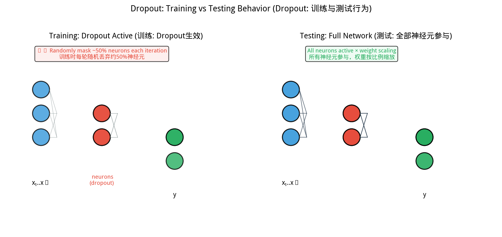
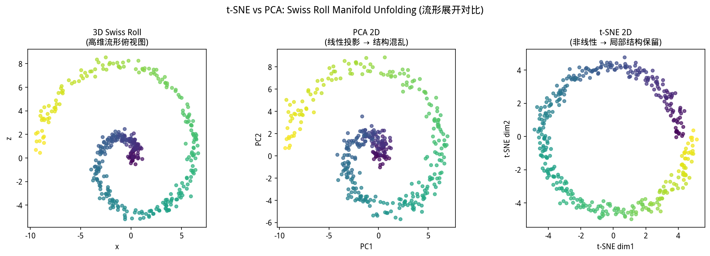
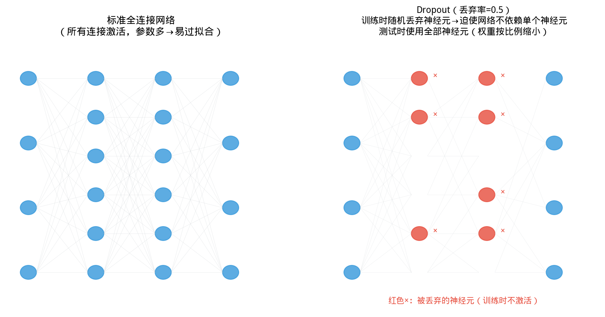
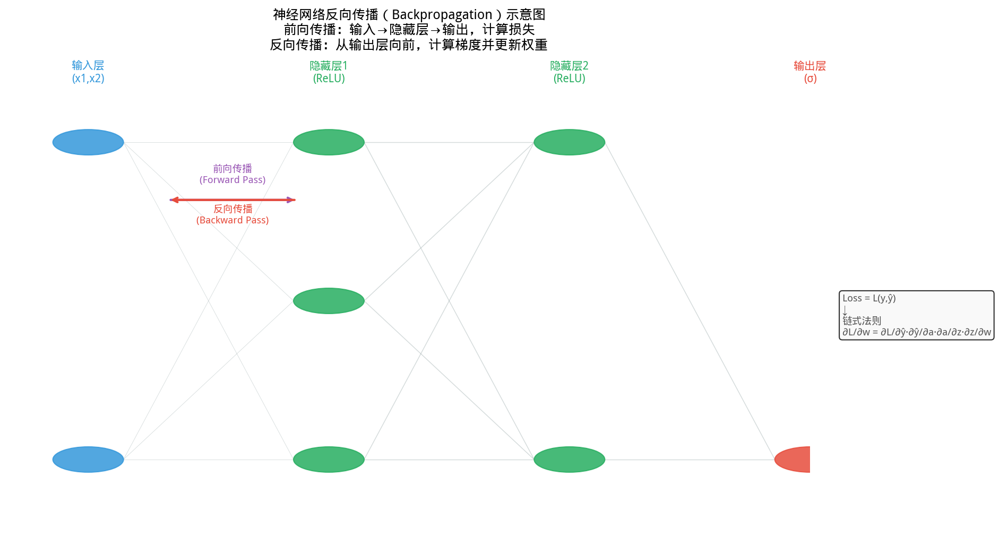
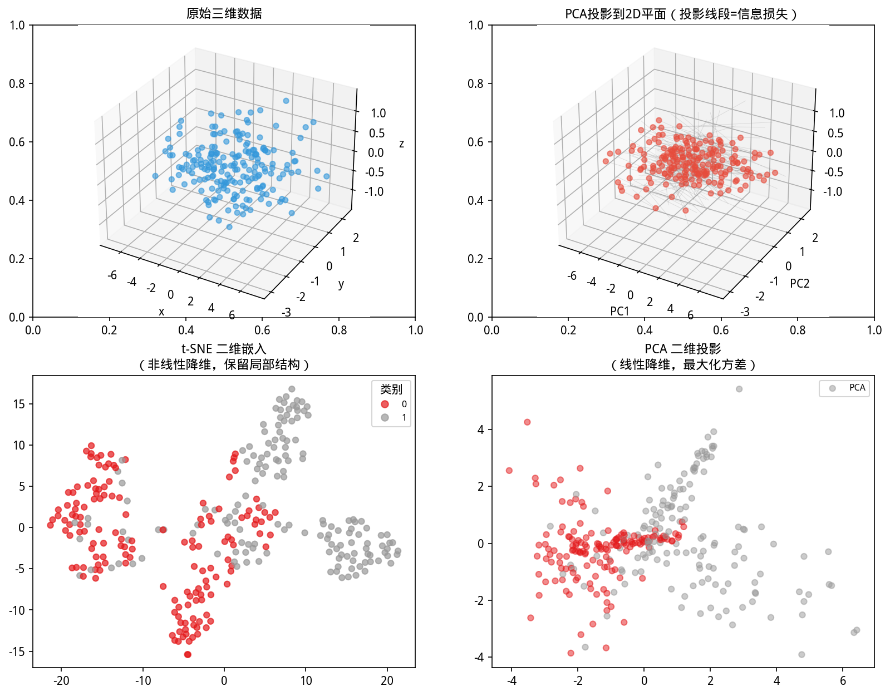
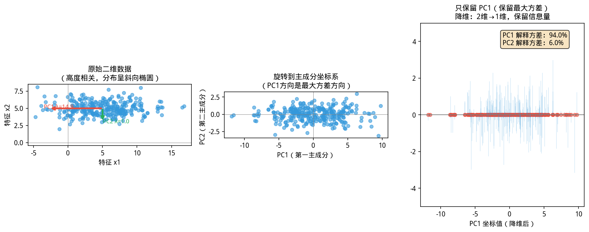
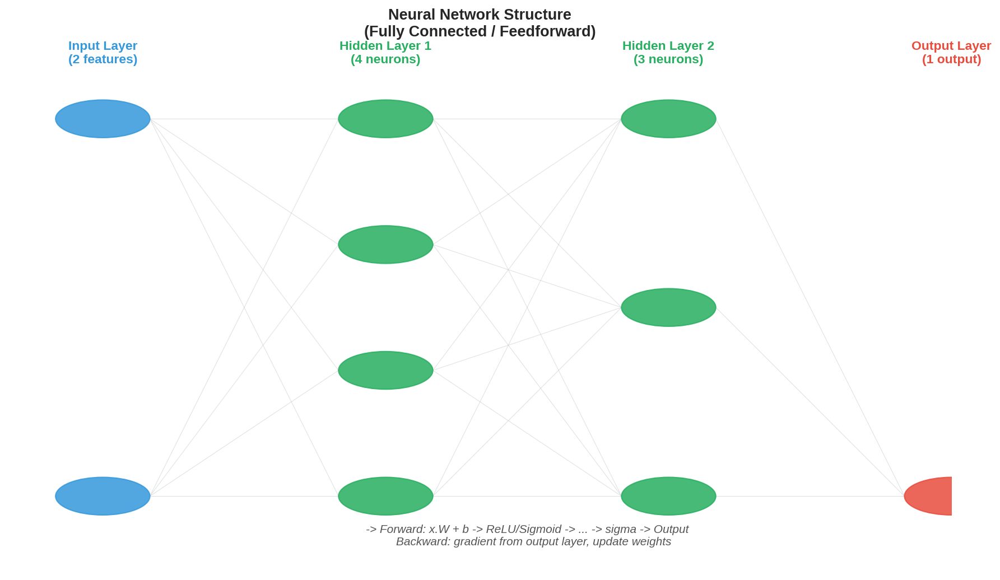

# 5.4 降维 / Dimensionality Reduction

如图所示，Dropout工作原理。训练时随机丢弃约50%神经：

*图 new.dropout_原理 Dropout工作原理。训练时随机丢弃约50%神经元，强迫网络不依赖特定神经元；测试时全部神经元参与、权重按p(保留概率)比例缩放，实现正则化*

从图中可以看出，图 new.dropout_原理 Dropout工作原理。

*图 new.tsne_vs_pca t-SNE vs PCA流形展开。Swiss Roll从3D展开到2D：PCA(线性投影)结构混乱；t-SNE(非线性)保留局部邻域结构，适用于高维数据可视化*

从图中可以看出，图 new.tsne_vs_pca t-SNE vs PCA流形展开。
### 一个令人不安的现象：「维度灾难」


> **📌 学习目标**
> - 理解 PCA 的几何意义：找方差最大的正交方向
> - 掌握 PCA 与 SVD 的等价关系——右奇异向量即主成分
> - 能用 PCA 对高维数据降维并保留 95%+ 方差
> - 理解 t-SNE 的局部结构保持特性与局限性

你有 2000 个病人、500 个基因表达量数据——医学研究中非常常见。

理论上，用 2000 个样本训练一个模型预测疾病——但输入特征有 500 个。

**会发生什么？**

模型会「记住」每个样本，而不是学到规律——训练集上准确率 100%，新病人上可能只有 50%（和随机猜测差不多）。这叫**过拟合**，深层原因是样本量相对于特征维度太少了。

降维回答的是：**能不能把这 500 个基因压缩成 20 个「综合指标」，同时保留 95% 的判别信息？** 这就是降维在生物信息学、医学诊断等领域成为核心工具的原因。

---

## 开场：你的模型有 500 个特征，但只有 2000 个样本

你高兴地拿到了数据：用户行为、交易记录、人口统计……一口气整了 500 个特征。

然后你开始建模，发现：
- 模型跑了 10 分钟还没收敛
- 交叉验证准确率出奇地低
- 换了 Random Forest 也没有明显改善

**问题出在哪里？**

你的特征太多了，样本不够用——这叫「维数灾难」。500 个特征在空间里张成了一个 500 维的空间，你的 2000 个样本在里面像撒胡椒面一样稀疏，大多数特征之间实际上没有足够的数据来建立可靠的统计关系。

降维就是解决这个问题的：**把 500 个特征压缩成 20 个——这 20 个特征保留了原来 500 个特征 95% 的信息。**

---

## 5.4.1 维数灾难与降维动机 / Curse of Dimensionality

如图所示，Dropout正则化原理：

*图5.4.1 Dropout正则化原理。训练时随机丢弃神经元（概率p）；测试时用完整网络；防止协同适应*

从图中可以看出，Dropout正则化原理。

*图5.4.2 反向传播梯度计算。反向传播：损失函数对每层权重求偏导；链式法则从输出层向输入层反向计算*

从图中可以看出，反向传播梯度计算。

*图5.4.3 PCA与SVD对比。PCA的基向量=数据矩阵的右奇异向量；SVD是PCA的推广*

从图中可以看出，PCA与SVD对比。

*图5.4.4 PCA完整流程。PCA流程：标准化→求协方差矩阵→求特征值特征向量→按方差贡献率排序→投影*

用最简单例子手算一遍梯度是怎么反向传的。

设有一个单隐层网络（3 → 4 → 2 拓扑）：
- 输入层 $\mathbf{x} \in \mathbb{R}^3$ → 隐层 $\mathbf{h} \in \mathbb{R}^4$ → 输出层 $\mathbf{y} \in \mathbb{R}^2$
- 隐层激活函数：ReLU，输出层：softmax，损失函数：交叉熵 $\mathcal{L}$

**前向传播**：
$$\mathbf{z}^{(1)} = \mathbf{W}^{(1)}\mathbf{x} + \mathbf{b}^{(1)}, \quad \mathb \quad \text{（具体计算时按分量展开）}f{h} = \text{ReLU}(\mathbf{z}^{(1)})$$
$$\mathbf{z}^{(2)} = \mathbf{W}^{(2)}\mathbf{h} + \mathbf{b}^{(2)}, \quad \hat{y} = \text{softmax}(\mathbf{z}^{(2)})$$

**反向传播（从后向前）**：

*Step 1 — 输出层误差*：对每个输出节点 $j$，计算 $\delta_j^{(2)} = \hat{y}_j - y_j$（这是 softmax + 交叉熵的导数，结果出奇地简洁）。

*Step 2 — 传播到隐层*：
$$\delta_i^{(1)} = \text{ReLU}'(z_i^{(1)}) \cdot \sum_{j=1}^{2} \delta_j^{(2)} W_{ji}^{(2)}$$

ReLU 的导数 $\text{ReLU}'(z) = 1$（$z>0$）或 $0$（$z \leq 0$）。

*Step 3 — 计算权重梯度*：
$$\frac{\partial \mathcal{L}}{\partial W_{ji}^{(2)}} = \delta_j^{(2)} \cdot h_i, \quad \frac{\partial \mathcal{L}}{\partial W_{ik}^{(1)}} = \delta_i^{(1)} \cdot x_k$$

**梯度消失的直观理解**：Sigmoid 的导数 $\sigma'(z) \leq 0.25$。如果网络有 5 层，每层误差传递都乘以 $\leq 0.25$，连乘 5 次后 $\delta \approx 0.001953 \times \delta_\text{输出}$——前面层的权重几乎收不到梯度，这就是 **梯度消失**，导致深层网络前面层「学不到东西」。ReLU 的导数是 0 或 1，部分解决了这个问题，但 $z \leq 0$ 时的「死神经元」问题由 ResNet 的跳跃连接（skip connection）缓解。

**代码实现要点**：
```java
// 伪代码：三层网络前向+反向
// 前向
var z1 = add(matMul(W1, x), b1);    // 隐层输入
var h = relu(z1);                  // 隐层激活
var z2 = add(matMul(W2, h), b2);    // 输出层输入
var y = softmax(z2);               // 输出概率

// 反向（输出→隐层）
var delta2 = sub(y, yTrue);         // softmax导数 = y - yTrue
var delta1 = hadamard(reluDeriv(z1), matMulTranspose(W2, delta2));

// 梯度
double[][] gradW2 = outer(delta2, h);     // ∂L/∂W2 = δ2 ⊗ h
var gradb2 = delta2;
double[][] gradW1 = outer(delta1, x);     // ∂L/∂W1 = δ1 ⊗ x
var gradb1 = delta1;
// 用梯度更新 W1,W2,b1,b2（通常用 Adam 或 SGD）
```


**历史故事：从「感知机」到深度学习**

你知道神经网络（Neural Network）是怎么诞生的吗？

1943 年，神经外科医生 **Warren McCulloch** 和数学家 **Walter Pitts** 发表了一篇论文《神经活动中内在思想的逻辑演算》——他们用数学描述了单个神经元的工作方式：输入信号加权求和，超过阈值就「激活」。这就是 **MP 神经元模型**——神经网络的最基本单元。

1958 年，**Frank Rosenblatt** 在康奈尔大学发明了**感知机（Perceptron）**——一个能「学习」权重的 MP 神经元。Rosenblatt 演示了感知机可以学会分辨猫和狗的图片——在当时这是轰动性的，被《纽约时报》大肆报道。

**但感知机有一个致命缺陷**：它无法学会「异或（XOR）」——这是 1969 年 MIT 的 **Marvin Minsky**（后来共谋犯）和 **Seymour Papert** 在一本书里证明的。这个缺陷直接导致了神经网络研究的**第一次寒冬**： Funding 停止，学者转行，整个领域停滞了十几年。

直到 **1986 年**，Hinton 和 Rumelhart 等人发表了**反向传播（Backpropagation）**算法，解决了多层神经网络的学习问题。深层神经网络（深度学习）才重新崛起。

**这段历史给我们的教训**：一个数学上优美的模型（感知机），如果在表达能力上有根本缺陷（无法学习 XOR），再多的工程努力也无法弥补。这正是为什么降维、特征选择如此重要：**在输入维度本身就有问题时，哪怕最强大的算法也束手无策。**


*图5.4.5 神经网络结构图。多层感知机：输入层→隐藏层（可多层）→输出层；激活函数引入非线性*

从图中可以看出，神经网络结构图。多层感知机：输入层→隐藏层（可多层）→输出层；激活函数引入非线性。

---

高维数据带来三个核心问题：

1. **样本稀疏化**：$d$ 维单位球体积随 $d$ 增大而急剧缩小，样本变得极度稀疏
2. **距离度量失效**：在高维空间中，所有点对之间的距离几乎相等（距离集中现象）
3. **冗余与噪声**：特征之间往往高度相关，大量维度携带的是重复信息或主要是噪声

**降维的收益**：
- 可视化（降至 2-3 维）
- 去除冗余和噪声
- 加速下游算法
- 缓解过拟合（正则化效果）

---

## 5.4.2 PCA：最大方差视角 / Principal Component Analysis

### 问题设定

数据矩阵 $\mathbf{X} \in \mathbb{R}^{n \times d}$（每行一个样本），列已**中心化**（每列均值为 0）。寻找单位向量 $\mathbf{v}$（$\|\mathbf{v}\|=1$），使投影后的**方差最大**：

$$\max_{\|\mathbf{v}\|=1} \frac{1}{n-1}\|\mathbf{X}\mathbf{v}\|_2^2 = \max_{\|\mathbf{v}\|=1} \mathbf{v}^\top\mathbf{S}\mathbf{v}$$

其中 $\mathbf{S} = \frac{1}{n-1}\mathbf{X}^\top\mathbf{X}$ 是样本协方差矩阵。

**解**：协方差矩阵 $\mathbf{S}$ 的**最大特征值对应的特征向量**即为第一主成分方向。第 $k$ 主成分 = 第 $k$ 大特征值对应的特征向量。

### 两种等价视角

| 视角 | 优化目标 | 解 |
|------|----------|-----|
| **最大方差** | $\max_{\mathbf{V}^\top\mathbf{V}=\mathbf{I}} \text{tr}(\mathbf{V}^\top\mathbf{S}\mathbf{V})$ | $\mathbf{S}$ 的特征向量 |
| **最小重构误差** | $\min_{\mathbf{V}^\top\mathbf{V}=\mathbf{I}} \|\mathbf{X} - \mathbf{X}\mathbf{V}\mathbf{V}^\top\|_F^2$ | 同上（相同解） |

### 与 SVD 的关系

对中心化后的 $\mathbf{X}$ 做奇异值分解：$\mathbf{X} = \mathbf{U}\Sigma\mathbf{V}^\top$

右奇异向量 $\mathbf{V}$ 的列即主成分方向，奇异值 $\sigma_j$ 与特征值的关系为 $\lambda_j = \sigma_j^2/(n-1)$。

> **数值稳定性**：SVD 路径避免了显式构造 $\mathbf{X}^\top\mathbf{X}$（条件数平方），在数值上更稳定。

### 方差解释比例

第 $j$ 主成分解释的方差比例为 $\lambda_j/\sum_k\lambda_k$。**累积方差比例**：

$$\text{CumVar}(m) = \frac{\sum_{j=1}^{m}\lambda_j}{\sum_{j=1}^{d}\lambda_j}$$

通常取 $m$ 使 CumVar $\geq 0.90$，或观察**碎石图（scree plot）**的肘部。

---

## 5.4.3 YiShape-Math 实现 / Implementation

```java
import com.yishape.lab.math.linalg.Linalg;
import com.yishape.lab.math.ml.ML;

// 9样本 × 3特征
var X = Linalg.matrix(new double[][]{
    {2.5, 2.4, 3.0}, {0.5, 0.7, 1.0}, {2.2, 2.9, 3.1},
    {1.9, 2.2, 2.8}, {3.1, 3.0, 3.5}, {2.3, 2.7, 3.0},
    {1.0, 1.6, 2.0}, {1.5, 1.6, 1.8}, {1.2, 1.0, 1.5}
});

// 使用工厂方法创建 PCA（保留 2 个主成分）
var pca = ML.dr.pca(2);

// 降到2维
var Z = pca.fitTransform(X);
System.out.println("降维后: " + Z.getRowNum() + " × " + Z.getColNum());

// 获取主成分方向（载荷向量）
var components = pca.getComponents();  // 每行是一个主成分方向
System.out.println("主成分方向: " + components);

// 获取各主成分解释的方差比例
var explainedVarRatio = pca.getExplainedVarianceRatio();
for (int i = 0; i < explainedVarRatio.length; i++) {
    System.out.printf("PC%d 方差解释比例: %.4f%n", i + 1, explainedVarRatio[i]);
}
```

**应用场景**：
- **降噪**：丢弃方差解释比例 < 1% 的成分
- **去相关**：主成分之间正交，消除多重共线性
- **预处理**：降维后用 K-Means 或分类器，往往更快更稳定

---

## 5.4.4 t-SNE：局部邻域保持 / t-SNE for Visualization

### 核心思想

t-SNE 不保留全局距离，而是**强烈保持局部邻域结构**：

1. 在高维空间，基于高斯核定义每对 $(i,j)$ 的邻居概率 $p_{ij}$
2. 在低维空间（通常 2D），基于 Student-t 核（自由度=1，重尾）定义 $q_{ij}$
3. 最小化 **KL 散度**：$\mathrm{KL}(P\|Q) = \sum_{i \neq j} p_{ij}\log\frac{p_{ij}}{q_{ij}}$

**为什么用重尾的 Student-t 核**：低维空间中重尾可以将高维中较远的簇"推开"，避免它们在低维嵌入中挤在一起（crowding problem）。

### 重要警告

- **簇间距离不可解释**：两个簇在 t-SNE 图上远，不意味着它们在高维空间也远
- **随机种子敏感**：不同种子产生不同嵌入
- **困惑度（perplexity）**：控制局部 vs 全局权衡，通常取 5-50

### YiShape-Math 实现

```java
import com.yishape.lab.math.ml.ML;

// 使用工厂方法创建 t-SNE（降至 2 维）
var tsne = ML.dr.tsne(2);
var Z = tsne.fitTransform(X);  // 降至2维
```

> **计算复杂度**：t-SNE 为 $O(n^2)$，适合 $n < 1000$ 的数据集。更大的数据集建议用 UMAP。

---

## 5.4.5 UMAP：统一流形近似 / Uniform Manifold Approximation

### 核心思想

UMAP 基于流形假设和模糊单纯集理论：

1. 假设数据采样自某个黎曼流形
2. 在高维空间构造模糊拓扑（加权 k-NN 图）
3. 在低维空间优化交叉熵损失，使低维拓扑与高维拓扑尽可能一致

### 与 t-SNE 对比

| 特性 | t-SNE | UMAP |
|------|-------|------|
| **速度** | $O(n^2)$ | $O(n\log n)$（更快） |
| **全局结构** | 差（簇间距离不可比） | 较好（距离有一定意义） |
| **新数据** | 不支持（只能嵌入已有数据） | 支持（变换新数据） |
| **超参数** | perplexity | nNeighbors, minDist |

### YiShape-Math 实现

```java
import com.yishape.lab.math.ml.ML;

// 使用工厂方法创建 UMAP（降至 2 维）
var umap = ML.dr.umap(2);
var Z = umap.fitTransform(X);
```

---

## 5.4.6 方法选择指南 / Method Selection Guide

| 需求 | 推荐 | 理由 |
|------|------|------|
| 保留方差、可解释 | **PCA** | 线性、有方差解释比例 |
| 探索性可视化（小数据） | **t-SNE** | 局部结构保持好 |
| 探索性可视化（大数据） | **UMAP** | 更快、全局结构更好 |
| 降维后做分类/聚类 | **PCA** | 线性变换可应用于新数据 |
| 去除多重共线性 | **PCA** | 正交主成分消除共线性 |

---

## 5.4.7 本节小结 / Section Summary

| 方法 | 核心思想 | 计算复杂度 | 新数据支持 |
|------|----------|-----------|-----------|
| **PCA** | 最大化投影方差 = 最小化重构误差 | $O(\min(nd^2, dn^2))$ | ✅ |
| **t-SNE** | 保持局部邻域（KL散度） | $O(n^2)$ | ❌ |
| **UMAP** | 模糊拓扑一致性 | $O(n\log n)$ | ✅ |

> **下一节预告**：线性模型（回归、分类）和无监督方法（聚类、降维）各有局限。**树集成方法**（随机森林、XGBoost）通过组合大量决策树，在保持可解释性的同时大幅提升预测精度。


---


## 5.4.7 本节 API 一览

| 场景 | API | 说明 |
|------|-----|------|
| PCA降维 | `ML.dr.pca(k).fitTransform(X)` | 返回k维投影矩阵 |
| 方差解释比例 | `pca.explainedVarianceRatio()` | 各主成分方差占比 |
| 累计方差 | `Arrays.stream(pca.explainedVarianceRatio()).sum()` | 前k主成分累计 |
| t-SNE | `ML.dr.tsne(k).fitTransform(X)` | 非线性降维，k=2或3用于可视化 |
| SVD→PCA等价 | `X.svd()` + 截断前k个奇异值 | 理论等价，实际用 `ML.dr.pca(k)` |
| 标准化 | `StandardScaler.fitTransform(X)` | PCA前必须标准化 |

> **PCA选择**：累计方差>80%~95%的主成分数；超过则可能过拟合。

## 5.4.6 章节练习 / Exercises

**1. PCA 主成分的几何直觉（画图题）**

已知二维数据集：$X = \{(1,1), (2,2), (3,3), (4,4), (1,3), (2,4), (3,1), (4,2)\}$。

（a）画出这 8 个点的分布（用坐标纸或 Python），说明它们分布在什么形状上。

（b）手工计算第一主成分方向（即数据方差最大的方向），说明你的计算过程。

（c）如果将数据投影到 PC1 方向，投影后方差是多少？投影后丢失了多少信息（用方差比例衡量）？

**2. SVD 与 PCA 的等价性证明（推导题）**

设数据矩阵 $\mathbf{X} \in \mathbb{R}^{n \times d}$ 已中心化（每列均值为 0）。

（a）写出协方差矩阵 $\mathbf{S} = \frac{1}{n-1}\mathbf{X}^\top\mathbf{X}$。

（b）对 $\mathbf{X}$ 做 SVD：$\mathbf{X} = \mathbf{U} \boldsymbol{\Sigma} \mathbf{V}^\top$。证明：$\mathbf{V}$ 的列（即右奇异向量）是 $\mathbf{S}$ 的特征向量，$\boldsymbol{\Sigma}^2/(n-1)$ 是对应的特征值。

（c）根据以上证明，说明为什么「PCA 的主成分 = SVD 的右奇异向量」。

> **工程意义**：由于 SVD 不需要显式计算 $\mathbf{X}^\top\mathbf{X}$（$O(nd^2)$），直接对 $\mathbf{X}$ 做 SVD 更数值稳定——这正是 `scikit-learn` 的 PCA 实现原理。

**3. 用 YiShape-Math 实现 PCA 降维 pipeline（编程题）**

```java
// 真实数据集（简化版）：8样本×4特征，5个A类+3个B类
var X = Linalg.matrix(new double[][]{
    {2.0, 3.0, 1.5, 4.0}, {1.8, 2.9, 1.6, 3.9},   // A类
    {2.5, 3.2, 1.8, 4.2}, {1.9, 3.1, 1.4, 3.8},
    {2.3, 2.8, 1.7, 4.1},
    {5.0, 1.2, 6.5, 2.3}, {5.2, 1.0, 6.3, 2.1},   // B类
    {4.8, 1.4, 6.6, 2.4}
});
var labels = {"A","A","A","A","A","B","B","B"};
```

**要求**：
1. 标准化数据（每特征减均值除标准差）
2. 用 SVD 分解提取前 2 个主成分
3. 计算前 2 个主成分的累计方差解释率
4. 将数据投影到 2D 并打印投影坐标
5. 判断：若保留 2 个 PC，是否达到 95% 方差保留标准？

**4. t-SNE vs PCA（对比分析题）**

（a）描述 t-SNE 和 PCA 在降维目标上的根本区别。

（b）在以下场景选择 PCA 或 t-SNE，并说明理由：
- 压缩 784 维 MNIST 手写数字数据用于可视化（→ ?）
- 将数据从 1000 维压缩到 50 维作为分类模型的输入（→ ?）
- 检验数据中是否存在异常离群点（→ ?）

（c）t-SNE 能用于新数据的降维吗？为什么？

**5. 维度灾难的直观理解（计算题）**

考虑 $d$ 维单位超立方体 $[0,1]^d$，随机采样 $n$ 个点。

（a）若 $d=10$，想保证最近邻点的距离均值 $< 0.1$，需要多少个样本？（提示：最近邻距离期望约 $0.95 \cdot n^{-1/d}$）

（b）随着 $d$ 增大，样本密度在任意固定体积区域内的变化趋势是什么？（「稀疏化」还是「不变」？）

（c）用一个具体的例子说明：为什么高维空间中的「距离」概念会失效。


---

/*
以上为 5.4.md 全部内容
*/

> **⚠️ 常见误区**
> - **把 PCA 当特征选择**：PCA 找的是方差最大方向，不一定是有意义的方向（如「是否违约」这个标签对应的方向）。PCA 后的人工特征（如 PC1=0.8×身高+0.6×体重）难以解释，不能直接说「PC1 代表体型」。
> - **盲目追求 95% 方差保留**：有时前几个主成分保留了 95% 方差，但恰好丢失了最重要的变异方向。根据下游任务（分类/聚类效果）选择成分数，比单纯看方差更合理。
