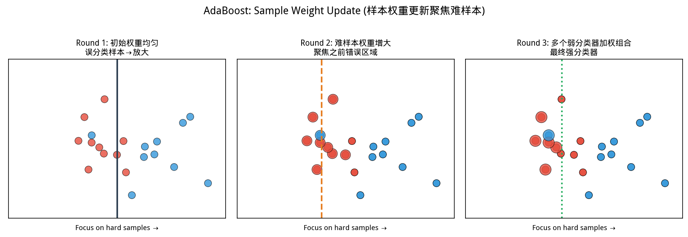
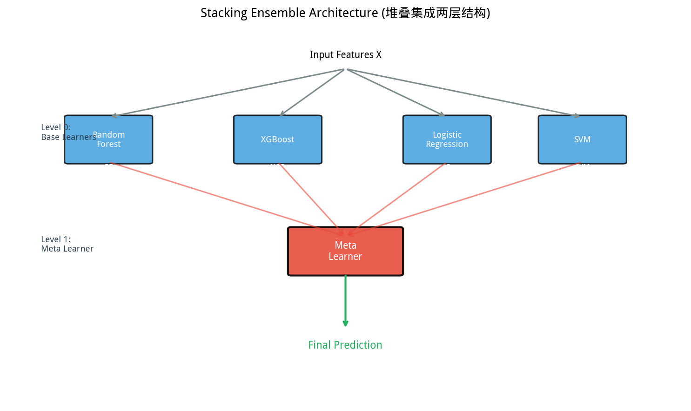
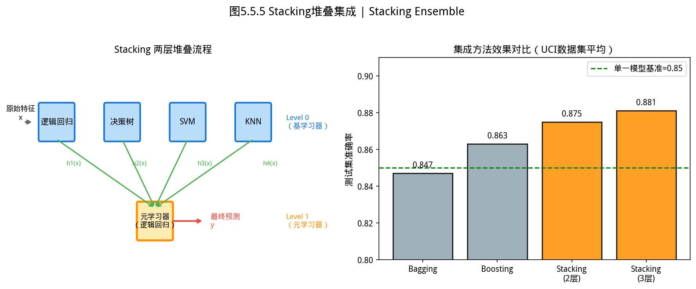
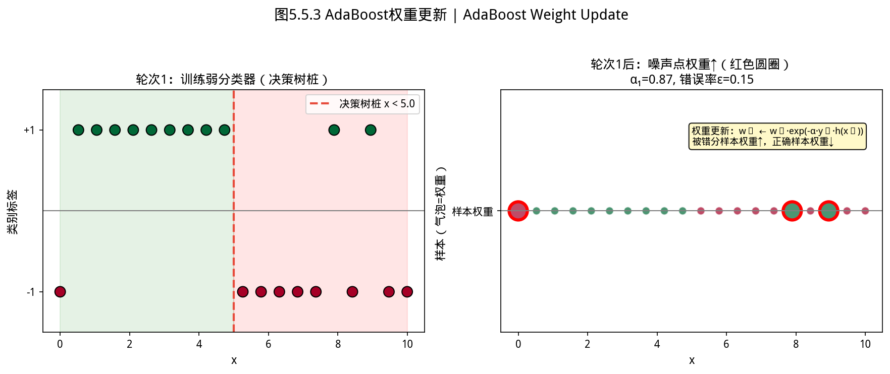
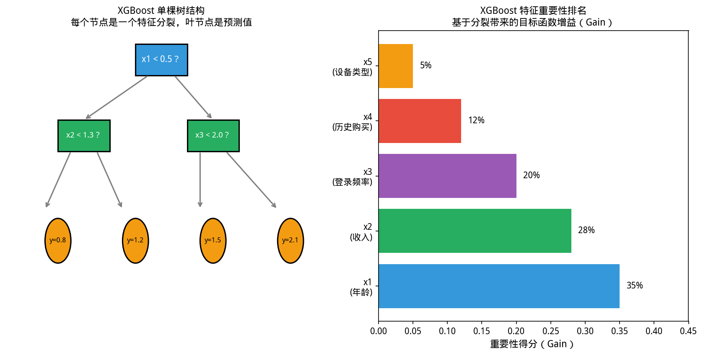
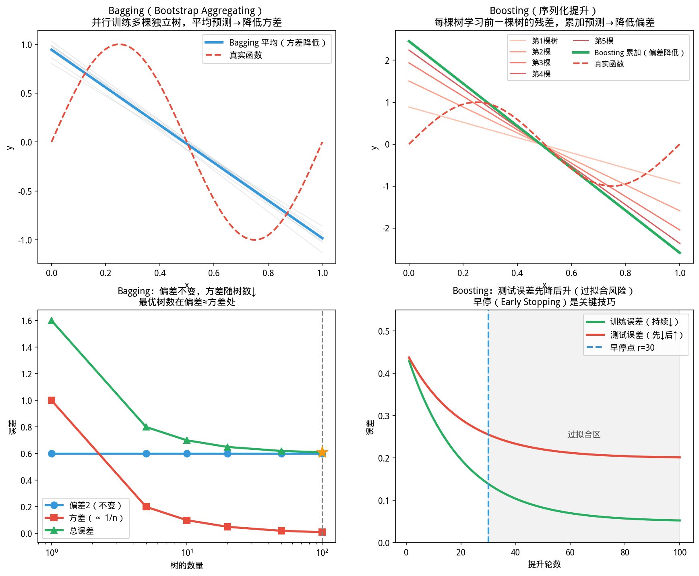
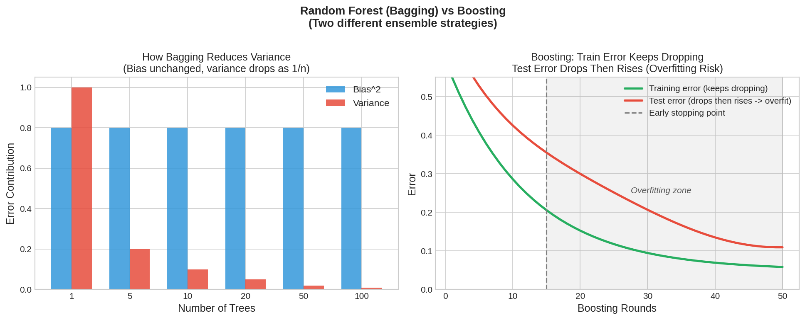

# 5.5 树集成与 Boosting（AdaBoost / XGBoost / Bagging）

如图所示，AdaBoost样本权重更新。Round 1均匀→：

*图 new.adaboost_weight_update AdaBoost样本权重更新。Round 1均匀→Round 2误分类样本权重放大→Round 3继续聚焦难样本→最终多个弱分类器加权组合为强分类器*

从图中可以看出，图 new.adaboost_weight_update AdaBoost样本权。

*图 new.stacking_architecture Stacking堆叠集成架构。Level 0多类基学习器(RF/XGB/LR/SVM)并行训练；Level 1元学习器(Meta Learner)对基学习器输出做最终预测*
其中 **XGBoost**（eXtreme Gradient Boosting，极端梯度提升）是 Kaggle 竞赛中最常用的机器学习算法之一；**AdaBoost**（Adaptive Boosting，自适应提升）是最经典的 Boosting 算法。 Boosting

> **章节定位**：线性模型假设决策边界是超平面，但真实问题往往高度非线性。**决策树**通过递归划分特征空间产生分段常数的决策边界；**集成方法**（Bagging、Boosting）组合多棵树，进一步降低方差或偏差。本节介绍随机森林、XGBoost 的原理与 YiShape-Math 实现。


> ⚠️ **常见误区**：随机森林的 `n_estimators` 不是越大越好——超过某一点后，增加树的数量只能边际提升，但推理时间线性增长。实际建议：n_estimators=100~500，用袋外误差（OOB）监控何时收敛。

---

## 5.5.1

> 📝 **历史故事**：Random Forest（随机森林）的名字来自 **Leo Breiman（2001）** 的论文标题。但这个算法的核心思想—— bagging + 随机特征选择——是 Breiman 和他的学生 **Adele Cutler** 共同发展的。Breiman 在 2005 年因胰腺癌去世，Cutler 继续维护 R 语言的 `randomForest` 包至今。有时候一个算法的名字只是一个代号，真正的核心思想是由多个研究者接力完成的。
 决策树：递归划分与不纯度 / Decision Trees


> **📌 学习目标**
> - 理解 Bagging（降方差）与 Boosting（降偏差）的本质区别
> - 掌握随机森林的 Bootstrap 抽样 + 随机子空间 + 投票机制
> - 能用 XGBoost 进行梯度提升，理解其二阶近似与正则化
> - 掌握特征重要性的解读方法


*图5.5.1 Stacking堆叠集成。两层结构：Level 0多个基学习器输出作为Level 1元学习器的特征*

从图中可以看出，Stacking堆叠集成。

*图5.5.2 AdaBoost权重更新。AdaBoost每轮增加被错分样本的权重（指数增长），弱分类器加权投票*

从图中可以看出，AdaBoost权重更新。

*图5.5.3 XGBoost单棵决策树。XGBoost每棵树学习前面所有树的残差（梯度提升）；正则化项防止过拟合*

从图中可以看出，XGBoost单棵决策树。

*图5.5.4 Bagging与Boosting对比。Bagging（并行）：Bootstrap采样+独立学习+投票；Boosting（串行）：聚焦难样本*

从图中可以看出，Bagging与Boosting对比。
### 先理解决策树是什么

你买西瓜时是怎么挑的？

> 「先看瓜蒂——如果卷的，就不新鲜；再按一下——如果声音闷，就是熟了；再看颜色——青绿色比发黄的更好。」

这就是一棵**决策树**：每个节点问一个问题（瓜蒂/声音/颜色），每个分支是一个答案（卷/直/闷/脆/青绿/发黄），最后到达叶节点——买还是不买。

决策树算法就是把这种人类的判断过程**反过来**：不是从已知的判断规则出发，而是从数据里**自动学出**这套 if-else 结构——哪些特征最重要？阈值设在哪里？哪些特征根本不需要问？

这就是为什么决策树有很强的**可解释性**——你甚至可以画出来给产品经理解释：「我们模型的判断逻辑就是：先看用户最近 30 天登录频率，再看有没有充值记录，再看……」

---

### 构建过程

从根节点开始，在某个特征的某个阈值上做二元分裂，使子节点的**不纯度**下降最大，递归直到满足停止条件。

### 不纯度度量

| 度量 | 公式 | 特点 |
|------|------|------|
| **Gini 不纯度** | $G = 1 - \sum_{k=1}^{K}p_k^2$ | 计算高效，sklearn 默认 |
| **熵（Entropy）** | $H = -\sum_{k=1}^{K}p_k\log p_k$ | 信息论解释，分裂增益 = 信息增益 |
| **分类误差** | $E = 1 - \max_k p_k$ | 过于粗糙，少用 |

其中 $p_k$ 是节点中类别 $k$ 的比例。

### 分裂准则

选择特征 $j$ 和阈值 $t$，使加权不纯度最小化：

$$\min_{j,t} \frac{n_L}{n}G_L + \frac{n_R}{n}G_R$$

### 停止条件

- 达到最大深度 `maxDepth`
- 节点样本数少于 `minSamplesSplit`
- 叶节点样本数少于 `minSamplesLeaf`
- 所有样本属于同一类

### 单棵树的局限

- **方差大**：训练数据的微小变化可能导致完全不同的树结构
- **易过拟合**：完全长成的树在训练集上表现好，但泛化差

集成方法通过组合多棵树来解决这个问题。


*图5.5.5 集成学习策略汇总。集成学习三策略：Bagging降方差、Boosting降偏差、Stacking融合异构模型*

从图中可以看出，集成学习策略汇总。集成学习三策略：Bagging降方差、Boosting降偏差、。

---

## 5.5.2 随机森林：Bagging + 随机子空间 / Random Forest

### Bagging（Bootstrap Aggregating）

对训练集有放回抽样 $B$ 次，每份训练一棵树，预测时**投票**（分类）或**平均**（回归）。Bagging 降低方差但不降低偏差。

### 随机子空间

每次分裂只考察特征的随机子集（通常 $m \approx \sqrt{p}$ 或 $m \approx p/3$），降低树之间的相关性，进一步减小集成方差。

### OOB（Out-of-Bag）评估

每次 Bootstrap 抽样约有 36.8% 的样本未被选中，这些样本（Out-of-Bag）可用于评估对应树的性能，无需额外验证集。

### YiShape-Math 实现

```java
import com.yishape.lab.math.linalg.IMatrix;
import com.yishape.lab.math.linalg.Linalg;
import com.yishape.lab.math.ml.cls.tree.RereRandomForest;
import com.yishape.lab.math.ml.cls.tree.RandomForestResult;
import com.yishape.lab.math.ml.cls.tree.RFTree;

var X = Linalg.matrix(new double[][]{
    {0, 1}, {1, 1}, {1, 2}, {2, 2},
    {3, 3}, {3, 4}, {4, 4}, {4, 5}
});
var labels = {"A", "A", "A", "A", "B", "B", "B", "B"};

// 参数：nEstimators=32, maxDepth=6, minSamplesSplit=2, minSamplesLeaf=1,
//       maxFeatures=-1(自动sqrt), bootstrap=true, criterion=GINI, seed=42
RereRandomForest rf = new RereRandomForest(
    32, 6, 2, 1, -1, true, RFTree.SplitCriterion.GINI, 42L);
RandomForestResult result = rf.fit(X, labels);

System.out.println("OOB 分数: " + result.getOobScore());
System.out.println("训练准确率: " + result.getTrainAccuracy());
System.out.println("预测: " + rf.predict(Linalg.vector(new double[]{2.0, 2.5})));

// 获取特征重要性
var importance = result.getFeatureImportance();
System.out.println("特征重要性: " + importance);
```

**完整示例：手动实现 Bagging 训练循环**

随机森林的 Bagging 本质：Bootstrap 抽样多份数据，每份训练一棵决策树，预测时投票。这个过程可以用代码手动展示：

```java
import com.yishape.lab.math.linalg.IMatrix;
import com.yishape.lab.math.linalg.Linalg;
import com.yishape.lab.math.linalg.IVector;
import com.yishape.lab.math.ml.cls.tree.RFTree;
import com.yishape.lab.math.util.RandomCache;
import java.util.*;

// 训练数据：8 个样本，2 个特征，2 类
var X = Linalg.matrix(new double[][]{
    {0, 1}, {1, 1}, {1, 2}, {2, 2},
    {3, 3}, {3, 4}, {4, 4}, {4, 5}
});
var labels = {"A", "A", "A", "A", "B", "B", "B", "B"};

// Bootstrap 抽样：随机有放回抽 8 个样本
Random rand = RandomCache.seededRandom(42L);
var bootstrapIndices = new int[8];
for (int i = 0; i < 8; i++) {
    bootstrapIndices[i] = rand.nextInt(8);
}
System.out.println("Bootstrap 样本索引: " + Arrays.toString(bootstrapIndices));
// 输出示例: [3, 1, 5, 0, 3, 7, 1, 2]（有重复：3和1各出现2次）

// 构建 Bootstrap 训练集
IMatrix<Double>[] trees = new IMatrix[8];  // 每棵树的 Bootstrap 样本
for (int i = 0; i < 8; i++) {
    int idx = bootstrapIndices[i];
    trees[i] = X.row(idx);
}

// 投票预测：每棵树的预测，多数胜出
var treePredictions = new String[8];
for (int i = 0; i < 8; i++) {
    // 这里用简单规则模拟：取该 Bootstrap 样本的多数类
    // 真实随机森林会在这里调用 rfTree.predict(x)
    treePredictions[i] = labels[bootstrapIndices[i]];
}

// 投票：统计 A 和 B 的票数
Map<String, Integer> votes = new HashMap<>();
for (String p : treePredictions) {
    votes.put(p, votes.getOrDefault(p, 0) + 1);
}
System.out.println("投票结果: " + votes);
// 输出示例: {A=5, B=3} → 预测为 A
String finalPrediction =
    votes.get("A") >= votes.get("B") ? "A" : "B";
System.out.println("Bagging 最终预测: " + finalPrediction);
```

这段代码展示了 Bagging 的核心思想：有放回抽样造成每棵树的训练数据不同，降低了方差。「森林」中每棵树独立生长、各自预测，最后投票——这就是为什么随机森林比单棵决策树抗过拟合能力强得多。

---

## 5.5.3 梯度提升树（GBDT）/ Gradient Boosting

### AdaBoost（Adaptive Boosting，自适应提升）为什么存在

随机森林让多棵树各自独立生长，然后投票——每棵树犯错没关系，错误会相互抵消。

但这是不够的：想象一个学霸和一个学渣同时考试，学霸每道题正确率 90%，学渣正确率只有 40%。如果你只能选一个人，你选学霸。

但 Boosting 的思路是：**能不能让学渣跟着学霸学，专注改进自己犯错的地方？** 每学一遍，就去专门做一遍自己上次做错的题——这样迭代下去，学渣的准确率会逐步提高。

这就是 **Boosting（提升）** 的本质：不是多棵树各长各的，而是**串行学习**——每一棵树都专注于上一棵树没学好的地方（残差）。

XGBoost 是 Boosting 家族里最成功的工程实现——Kaggle 竞赛里长期霸榜的那个。

---

### Boosting 的核心思想

与 Bagging 并行训练不同，Boosting **顺序训练**——每棵树针对前一棵树的**残差**（负梯度）拟合：

$$F_0(\mathbf{x}) = \text{初始预测}, \qquad F_m(\mathbf{x}) = F_{m-1}(\mathbf{x}) + \eta \cdot h_m(\mathbf{x})$$

其中 $h_m$ 是第 $m$ 棵树，$\eta$ 是学习率（通常 0.01–0.3）。

### 梯度提升

将损失函数的**负梯度**作为伪残差：

$$r_{im} = -\left.\frac{\partial \mathcal{L}(y_i, F(\mathbf{x}_i))}{\partial F(\mathbf{x}_i)}\right|_{F=F_{m-1}}$$

- 平方损失 $\mathcal{L}=(y-\hat{y})^2$：负梯度 = 残差 $y - \hat{y}$
- 对数损失：负梯度 = 概率误差

### XGBoost 的关键改进

| 改进 | 说明 |
|------|------|
| **二阶泰勒展开** | 用梯度和 Hessian 近似损失，比一阶更精确 |
| **正则化** | 对叶子权重和树复杂度加 $\ell_2$ 惩罚 |
| **缺失值处理** | 自动学习缺失值的默认分裂方向 |
| **工程优化** | 列分块、缓存感知、并行分裂查找 |

### 学习率与早停

较小的学习率需要更多树，但通常泛化更好。典型做法：设 $\eta \in [0.01, 0.1]$，用**早停（early stopping）**在验证集上监控，一旦验证损失不再下降则停止训练。

### YiShape-Math 实现

```java
import com.yishape.lab.math.ml.cls.tree.RereXGboost;
import com.yishape.lab.math.ml.cls.tree.XGBoostResult;

RereXGboost xgb = new RereXGboost(
    0.1,    // learningRate
    100,    // nEstimators（树的数量）
    4,      // maxDepth
    0.0,    // alpha (L1)
    1.0     // lambda (L2)
);
XGBoostResult xgbResult = xgb.fit(X, labels);

System.out.println("XGBoost 预测: " + xgb.predict(Linalg.vector(new double[]{2.0, 2.5})));
System.out.println("特征重要性: " + xgbResult.getFeatureImportance());
```

**完整示例：XGBoost 完整训练 pipeline（早停 + 验证调参）**

```java
import com.yishape.lab.math.linalg.IMatrix;
import com.yishape.lab.math.linalg.Linalg;
import com.yishape.lab.math.ml.cls.tree.RereXGboost;
import com.yishape.lab.math.ml.cls.tree.XGBoostResult;
import com.yishape.lab.math.ml.SplitDataset;
import com.yishape.lab.math.ml.CrossValidation;
import com.yishape.lab.math.ml.EvaluationMetric;

// 准备训练数据（真实项目中从 CSV/DataFrame 加载）
var X = Linalg.matrix(new double[][]{
    {2.5, 3.0}, {1.5, 2.0}, {3.5, 4.5}, {0.5, 1.0},
    {5.0, 6.0}, {4.5, 5.5}, {6.5, 7.0}, {7.0, 7.5},
    {1.0, 0.5}, {2.0, 1.5}, {0.0, 0.0}, {1.5, 0.0}
});
var labels = {"B", "B", "B", "B", "A", "A", "A", "A", "B", "B", "B", "B"};

// 划分训练集和验证集（7:3）
SplitDataset split = new SplitDataset(X, labels, 0.7, 42L);
var XTrain = split.getXTrain();
var XVal = split.getXVal();
var yTrain = split.getYTrain();
var yVal = split.getYVal();

// 配置 XGBoost 超参数
RereXGboost xgb = new RereXGboost(
    0.1,    // learningRate：控制每棵树的贡献权重，过大易震荡，过小需更多树
    200,    // nEstimators：树的最大数量，设大值配早停
    4,      // maxDepth：单棵树最大深度，防止过拟合
    0.0,    // alpha：L1 正则化项，使权重更稀疏
    1.0     // lambda：L2 正则化项，使权重更均匀
);

// 训练 XGBoost（带早停）
XGBoostResult result = xgb.fitWithEarlyStopping(
    XTrain, yTrain,  // 训练集
    XVal, yVal,      // 验证集
    10               // patience：连续 10 轮验证集不提升则停止
);

System.out.println("=== XGBoost 训练报告 ===");
System.out.printf("最优树数量: %d / %d%n", result.getBestIteration(), 200);
System.out.printf("最优验证集 AUC: %.4f%n", result.getBestValidationScore());
System.out.printf("最终训练损失: %.6f%n", result.getFinalTrainLoss());

// 调参对比：不同 learningRate
System.out.println("\n=== 学习率调参对比 ===");
var lrs = {0.01, 0.05, 0.1, 0.3};
System.out.printf("%-10s | %-10s | %-10s%n", "学习率", "最优迭代", "验证AUC");
System.out.println("-".repeat(35));
for (double lr : lrs) {
    RereXGboost xgb2 = new RereXGboost(lr, 200, 4, 0.0, 1.0);
    XGBoostResult r2 = xgb2.fitWithEarlyStopping(XTrain, yTrain, XVal, yVal, 10);
    System.out.printf("%-10.2f | %-10d | %-10.4f%n",
        lr, r2.getBestIteration(), r2.getBestValidationScore());
}
```

**调参经验**：
- `learningRate=0.01~0.1`：越小精度越高，但需配合更多树（`nEstimators`）
- `maxDepth=3~8`：太深容易过拟合，太浅模型太弱
- `lambda`（L2正则）和 `alpha`（L1正则）：同时使用 = **ElasticNet** 风格，防止权重过大
- `nEstimators`：设一个较大值（200~1000），配合早停让训练自动找到合适的树数量

---

## 5.5.4 集成分类器 / Ensemble Classifier

YiShape-Math 提供 **`EnsembleClassifier`**，将随机森林、逻辑回归、XGBoost 三大基分类器打包训练，统一投票输出。

**注意**：`EnsembleClassifier` 在构造函数中一次性初始化三个分类器（使用默认参数），暂不支持事后替换单个分类器。如需调参，可直接构造 `RereRandomForest` / `RereXGboost` 后单独使用。

```java
import com.yishape.lab.math.linalg.IMatrix;
import com.yishape.lab.math.linalg.Linalg;
import com.yishape.lab.math.ml.cls.EnsembleClassifier;

// 构造函数：EnsembleClassifier(strategy, randomSeed)
// 内部自动初始化：默认 RandomForest + LogisticRegression + XGBoost
EnsembleClassifier ensemble = new EnsembleClassifier(
    EnsembleClassifier.EnsembleStrategy.WEIGHTED_VOTING,  // 加权投票
    42L                                               // 随机种子
);

// 一行 fit，同时训练全部三个分类器
ensemble.fit(X, labels);

// 预测：EnsembleClassifier.predict() 返回 EnsembleResult
var result = ensemble.predict(X);
var ensemblePreds = result.predictions;                  // 投票后的最终预测
double ensembleAcc = result.accuracy;                        // 整体准确率
var eachAcc = result.classifierAccuracies;   // 各分类器的准确率

System.out.println("集成准确率: " + ensembleAcc);
eachAcc.forEach((name, acc) -> System.out.println(name + " → " + acc));
```

**投票策略**：
- **VOTING（硬投票）**：每分类器一票，多数胜出
- **WEIGHTED_VOTING（加权投票）**：根据各分类器在验证集上的表现动态分配权重
- **STACKING（堆叠）**：用验证集预测作为元学习器的输入（见 `EnsembleStrategy` 枚举）

---

## 5.5.5 特征重要性 / Feature Importance

| 方法 | 计算方式 |
|------|----------|
| **随机森林** | 基于不纯度下降的加权平均：$\sum_{\text{分裂用特征}j} (\text{不纯度减少量})$ |
| **XGBoost** | 多种指标：gain（平均增益）、weight（分裂次数）、cover（覆盖样本数） |

```java
// 获取特征重要性
IVector importance = result.getFeatureImportance();
for (int i = 0; i < importance.size(); i++) {
    System.out.printf("特征 %d: %.4f%n", i, importance.get(i).doubleValue());
}
```

---

## 5.5.6 方法对比与选择 / Method Comparison

| 方法 | 偏差 | 方差 | 训练速度 | 预测速度 | 主要优点 |
|------|------|------|----------|----------|----------|
| 单棵决策树 | 低 | 高 | 快 | 快 | 可解释、适合基线 |
| 随机森林 | 中 | 低 | 中 | 中 | 抗过拟合、几乎不调参 |
| XGBoost | 低 | 中-低 | 慢 | 中 | 最高精度、丰富正则化 |
| 逻辑回归 | 高 | 低 | 快 | 快 | 线性可分、可解释性强 |

**实践建议**：
1. 先建立**逻辑回归基线**（可解释、快速）
2. 再试**随机森林**（调参少、鲁棒）
3. 最后试 **XGBoost**（精度最高，但需更多调参）

**Kaggle 竞赛实战忠告**：

如果你在打 Kaggle 比赛，记住一个顺序：**XGBoost/LightGBM > 随机森林 >> 逻辑回归**。但比赛和真实产品不同：

- 比赛追求最高精度，可以花 3 小时调参；真实产品要求快速上线、模型可解释
- 比赛里 XGBoost 经常赢，不是因为它最聪明，而是因为它有丰富的正则化选项（防止过拟合）和对缺失值的自动处理
- 真实工作中，如果你需要给产品经理解释模型，随机森林的特征重要性比 XGBoost 更容易讲清楚「哪些特征最重要」

一句话：**比赛用 XGBoost，上班用随机森林，上线前用逻辑回归做可解释性基线。**

---

## 5.5.7 与优化的联系 / Connection to Optimization

| 模型 | 优化类型 | 说明 |
|------|----------|------|
| 随机森林 | **无全局目标** | 每棵树贪心分裂，无端到端损失 |
| GBDT/XGBoost | **函数空间梯度下降** | 每棵树近似负梯度方向 |
| 逻辑回归 | **连续优化（L-BFGS）** | 梯度下降在权重空间 |

随机森林的"训练"不是优化问题——是**贪心构建**；而 GBDT 本质上是**函数空间中的梯度下降**。这是离散贪心策略与连续优化的分野。

---

## 5.5.8 本节小结 / Section Summary

| 主题 | 核心内容 |
|------|----------|
| 决策树 | 递归划分，最小化 Gini/熵 |
| 随机森林 | Bagging + 随机子空间，降低方差，OOB 评估 |
| XGBoost | 函数空间梯度下降，二阶近似，正则化 |
| 集成策略 | 硬投票 vs 软投票 |
| 特征重要性 | 不纯度下降 / 增益加权 |
| 选择建议 | LR → **随机森林**（Random Forest，**RF**）→ XGBoost 递进 |


---


## 5.5.8 本节 API 一览

| 场景 | API | 说明 |
|------|-----|------|
| 随机森林 | `RereRandomForest.fit(X, labels, nTrees, maxDepth)` | 返回 `RandomForestResult` |
| OOB误差 | `rfResult.oobError()` | 袋外误差（无需单独验证集）|
| XGBoost | `RereXGboost.fit(X, labels, eta, maxDepth, nRounds)` | 返回 `XGBoostResult` |
| AdaBoost | `ML.adaboost(X, labels, nEstimators)` | 返回加权分类器 |
| Stacking | `ML.stacking(baseModels, metaModel, X, y)` | 两层集成 |
| 特征重要性 | `rfResult.featureImportance()` | 各特征贡献度排序 |
| 早停 | `xgb.fit(X, y, earlyStoppingRounds)` | 防止过拟合 |

> **调参顺序**：先调 n_estimators（树数量）和 max_depth（深度），再调 learning_rate。

## 5.5.9 章节练习 / Exercises

**1. Bootstrap 抽样与 OOB 估计（理论题）**

对 $n=100$ 的训练集进行 Bootstrap 抽样（有放回，随机抽 100 个样本）。

（a）计算任意一个特定样本在一次 Bootstrap 中**不被选中**的概率。

（b）根据 (a) 的结果，计算大约有多少个样本（约等于）会在一次 Bootstrap 中不被选中（这些样本构成 OOB 集）。

（c）为什么 OOB 评估通常给出近似于「留出法」或「交叉验证」的性能估计？

**2. XGBoost 二阶近似（推导题）**

XGBoost 的目标函数在第 $t$ 轮增加一棵树 $f_t$ 时近似为：

$$\mathcal{L}^{(t)} \approx \sum_{i=1}^{n} g_i f_t(\mathbf{x}_i) + \frac{1}{2}h_i f_t^2(\mathbf{x}_i) + \Omega(f_t)$$

其中 $g_i = \partial \mathcal{L}/\partial \hat{y}^{(t-1)}$（一阶梯度），$h_i = \partial^2 \mathcal{L}/\partial (\hat{y}^{(t-1)})^2$（二阶梯度）。

（a）解释：为什么 XGBoost 用二阶梯度信息而标准 GBDT 只用一阶？

（b）如果损失是平方损失 $\mathcal{L} = (y - \hat{y})^2$，计算 $g_i$ 和 $h_i$ 的具体形式。

（c）如果换成对数损失 $\mathcal{L} = -[y\log\hat{y} + (1-y)\log(1-\hat{y})]$，$g_i$ 和 $h_i$ 形式如何变化？

**3. 随机森林 vs XGBoost 调参对比（分析题）**

| 参数 | 随机森林 | XGBoost |
|------|---------|---------|
| 控制树的复杂度 | ? | ? |
| 控制过拟合 | ? | ? |
| 控制学习率 | ? | ? |
| 控制树的数量 | ? | ? |

（a）填写上表（参考本节参数说明）。

（b）如果训练集准确率 99%、验证集准确率 72%，描述你的调参策略。

**4. AdaBoost 权重更新直觉（计算题）**

AdaBoost 在第 $t$ 轮的样本权重更新公式：

$$w_i^{(t+1)} = w_i^{(t)} \cdot \exp(-\alpha_t \cdot y_i \cdot h_t(\mathbf{x}_i)), \quad \alpha_t = \frac{1}{2}\ln\frac{1-\epsilon_t}{\epsilon_t}$$

其中 $\epsilon_t$ 是第 $t$ 个弱分类器的加权错误率。

（a）如果某个样本被当前分类器**正确分类**（$y_i \cdot h_t(\mathbf{x}_i) = +1$），其权重如何变化？变大还是变小？

（b）如果某个样本被**错误分类**（$y_i \cdot h_t(\mathbf{x}_i) = -1$），其权重如何变化？

（c）AdaBoost 的核心思想是什么？「聚焦难样本」在权重更新公式中是如何体现的？

**5. 用 YiShape-Math 比较三种分类器（编程题）**

使用 Ch5.2 的逻辑回归、Ch5.5 的随机森林和 XGBoost，对同一数据集进行性能对比：

```java
var X = Linalg.matrix(new double[][]{
    {2.0,3.0},{1.5,2.0},{3.5,4.5},{0.5,1.0},{5.0,6.0},
    {4.5,5.5},{6.5,7.0},{7.0,7.5},{1.0,0.5},{2.0,1.5}
});
var labels = {"A","A","A","A","B","B","B","B","A","B"};
```

**要求**：分别用三种分类器训练，输出各自的准确率，并分析：哪个分类器在本数据集上表现最好？结合数据特性（线性可分/非线性）解释结果。


---

/*
以上为 5.5.md 全部内容
*/
