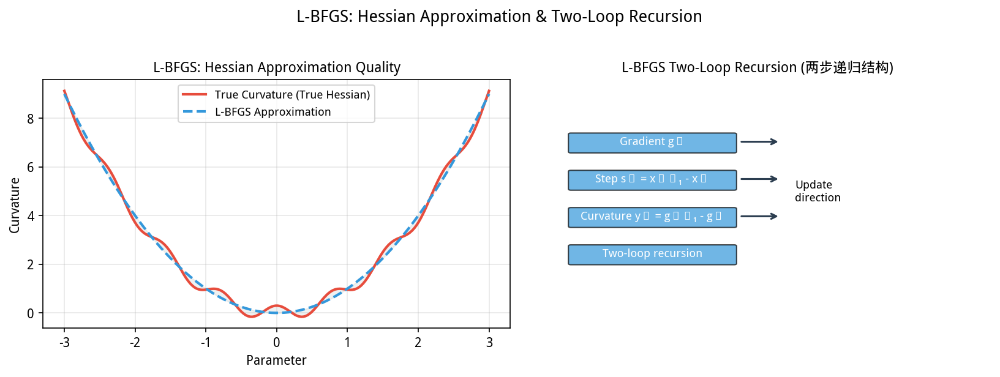
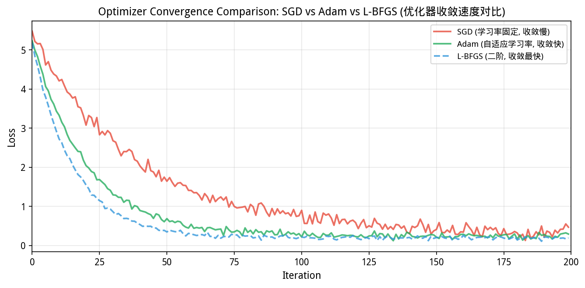
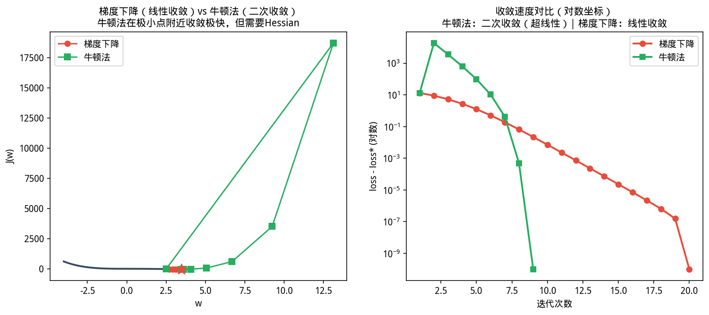
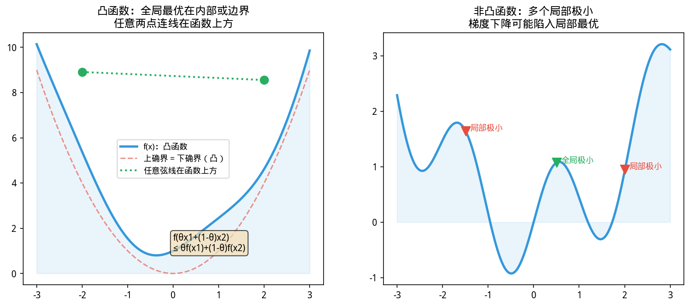
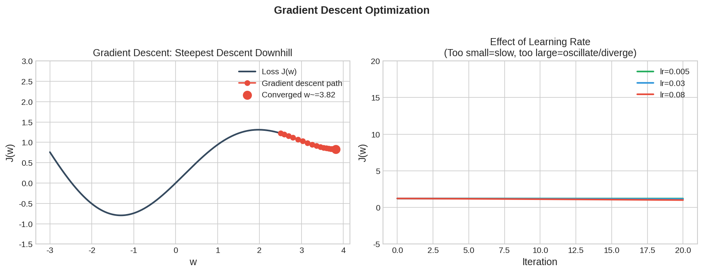

# 第 6 章（一）：最优化总览与无约束方法
### Optimization Overview and Unconstrained Methods

上一章：[第 5 章 机器学习](../Chapter5_Machine_learning/5.1. Regression.md) ｜ 下一节：[6.2 线性规划](6.2. Linear programming.md)

---

## 6.1 最优化总览与无约束方法

如图所示，L-BFGS曲率近似与两步递归。左侧：用历史梯度信：

*图 new.lbfgs_curvature L-BFGS曲率近似与两步递归。左侧：用历史梯度信息近似Hessian矩阵；右侧：存储{sₜ,yₜ}向量对，通过两步递归计算搜索方向，无需显式矩阵求逆*

从图中可以看出，L-BFGS曲率近似与。

*图 new.optimizer_convergence SGD vs Adam vs L-BFGS收敛对比。SGD收敛慢且震荡；Adam利用自适应学习率收敛更快更稳；L-BFGS二阶信息在早期收敛最快，但每次迭代计算量大*

从图中可以看出，SGD v。
> **📌 学习目标**
> - 理解凸优化「局部极小 = 全局极小」的重要性质
> - 掌握 L-BFGS 的拟牛顿思想——用历史梯度信息近似 Hessian
> - 能用 `Opts.lbfgs()` 求解无约束光滑优化问题
> - 理解 SGD 与 Adam 的适用场景：大规模、在线、非凸


*图6.1.1 梯度下降 vs 牛顿法。梯度下降一阶收敛；牛顿法二阶收敛（用Hessian）；牛顿法更快但计算量大*

从图中可以看出，梯度下降 vs 牛顿法。

*图6.1.2 凸优化 vs 非凸优化。凸函数：全局最优唯一；非凸函数有多个局部最优；初始化很重要*

从图中可以看出，凸优化 vs 非凸优化。
## 历史故事：让苏伊士运河恢复通行的优化问题

2021 年 3 月，**Ever Given** 集装箱船在苏伊士运河搁浅，横卡河道 6 天，全球贸易每天损失 90 亿美元。

救援方案背后：**如何以最小总牵引力，把船从特定位置移出？**

这就是**约束优化**的典型场景：最小化总成本（总牵引力），但要满足物理约束（船的几何位置、拖船马力上限）。

更早在二战时期，**George Dantzig** 用同样的线性规划方法，为美国空军解决了军事物流调度问题——那是他发明「单纯形法」的故事（见 6.2 节）。从军事后勤到全球贸易，最优化从未离开过现实世界的舞台。

---

## 开场：导航 app 背后藏着的数学

你打开高德地图，输入「从公司到火车站」，它立刻给你规划了一条路线：

> 预计 32 分钟，途经 12 个红绿灯，绕开拥堵路段……

高德不是查表回答——它实时解了一个**优化问题**：

$$\min_{\text{路径 } p} \text{时间}(p) \quad \text{s.t.} \ \text{路段可行}$$

这就是优化的本质：**在所有可能的选项中，找到最好的那一个**。只不过现实中的选项多到无法枚举，所以需要数学方法来「聪明地搜索」。

机器学习也一样：模型的参数有无穷种取值组合，哪一组能让预测最准？——也是一个优化问题。

---

### 6.1.1 优化问题的数学表述

机器学习训练、统计估计与运筹排产，在数学上统一为以下形式：
$$\min_{\mathbf{x}\in\mathcal{X}}\ f(\mathbf{x})\quad\text{s.t.}\quad g_i(\mathbf{x})\leq 0,\ \ h_j(\mathbf{x})=0$$
其中 $f:\mathbb{R}^d\to\mathbb{R}$ 是**目标函数**，$g_i$ 是不等式约束，$h_j$ 是等式约束，$\mathcal{X}$ 是可行域。

**按约束类型分类**：

| 类型 | 约束 | 典型算法 | 本章小节 |
|------|------|----------|----------|
| 无约束 | 无 | 梯度下降、L-BFGS、牛顿法 | 6.1 |
| 线性约束 | $\mathbf{Ax}\leq\mathbf{b}$ 等 | 单纯形法、内点法 | 6.2 |
| 整数约束 | $\mathbf{x}\in\mathbb{Z}^d$ | 分支定界、割平面 | 6.3 |
| 非凸 | $f$ 非凸 | SGD、Adam、启发式 | 6.4 |

**与相邻章的关系**：
- 第 5 章中，线性回归/逻辑回归的训练目标是无约束凸优化，由 L-BFGS 求解
- 第 1 章中的线性方程组 $\mathbf{Ax}=\mathbf{b}$ 等价于最小化二次函数 $\frac{1}{2}\mathbf{x}^\top\mathbf{A}\mathbf{x}-\mathbf{b}^\top\mathbf{x}$（当 $\mathbf{A}$ 正定时）
- 第 4 章的最大似然估计也是一个无约束优化问题

### 6.1.2 凸集与凸函数

**凸集** $\mathcal{X}$：对任意 $\mathbf{x},\mathbf{y}\in\mathcal{X}$、$\lambda\in[0,1]$，有 $\lambda\mathbf{x}+(1-\lambda)\mathbf{y}\in\mathcal{X}$。

**凸函数** $f$：对同一对点有
$$f(\lambda\mathbf{x}+(1-\lambda)\mathbf{y})\leq \lambda f(\mathbf{x})+(1-\lambda)f(\mathbf{y})$$

**核心定理**：若 $\mathcal{X}$ 凸且 $f$ 凸，则**任一局部极小点为全局极小点**。这解释了为什么带 $\ell_2$ 正则的岭回归和逻辑回归可以用 L-BFGS 可靠求解——找到的稳定点就是全局最优。

**凸性判定**：
- 一阶条件：$f(\mathbf{y})\geq f(\mathbf{x})+\nabla f(\mathbf{x})^\top(\mathbf{y}-\mathbf{x})$（函数图像总在切平面之上）
- 二阶条件（$f$ 二阶可微）：$\nabla^2 f(\mathbf{x})\succeq 0$（Hessian 半正定）

**常见凸函数**：
- 二次函数 $\frac{1}{2}\mathbf{x}^\top\mathbf{Q}\mathbf{x}+\mathbf{c}^\top\mathbf{x}$（$\mathbf{Q}\succeq 0$ 时）
- 指数函数 $e^x$、负对数 $-\log x$（$x>0$）
- 范数 $\|\mathbf{x}\|_p$（$p\geq 1$）
- 最大函数 $\max(x_1,\ldots,x_d)$

**非凸函数**：神经网络损失、低秩矩阵分解、决策树集成——此时只能保证收敛到**稳定点**（梯度为零），不一定是全局最优。

### 6.1.3 无约束光滑优化：从梯度下降到拟牛顿

考虑 $\min_{\mathbf{x}\in\mathbb{R}^d}f(\mathbf{x})$，$f$ 一阶连续可微。

**梯度下降**：
$$\mathbf{x}_{k+1} = \mathbf{x}_k - \alpha_k\nabla f(\mathbf{x}_k)$$
$\alpha_k$ 是学习率。实现简单，但在 Hessian 病态时呈「之字形」收敛，收敛率线性。


*图6.1.3 梯度下降法收敛过程。梯度下降沿负梯度方向迭代；学习率过大震荡，过小收敛慢*

**牛顿法**：在 $\mathbf{x}_k$ 处用二次泰勒展开近似 $f$：
$$f(\mathbf{x}_k+\mathbf{d})\approx f(\mathbf{x}_k)+\nabla f(\mathbf{x}_k)^\top\mathbf{d}+\frac{1}{2}\mathbf{d}^\top\nabla^2f(\mathbf{x}_k)\mathbf{d}$$
令导数为零得牛顿方向：$\nabla^2 f(\mathbf{x}_k)\mathbf{d}_k=-\nabla f(\mathbf{x}_k)$。二次收敛（邻近极小点时），但每步需计算和求逆 Hessian，成本 $O(d^3)$。

**拟牛顿法（BFGS / L-BFGS）**：用低秩更新近似 Hessian 逆 $\mathbf{H}_k\approx[\nabla^2 f(\mathbf{x}_k)]^{-1}$，只需梯度，超线性收敛。**L-BFGS** 限制存储最近 $m$ 步的曲率信息，内存 $O(md)$，适合高维。

YiShape-Math 中：
- `Opts.lbfgs()` → `RereLBFGS`（主力无约束优化器）
- `Opts.conjugateGradient()` → 共轭梯度法（大规模正定二次型）
- `RereLinearRegression` 和 `RereLogisticRegression` 内部将目标/梯度接到 L-BFGS

    // ⚠️ 注意：maxIter 过小会欠收敛（未充分优化）；过大则浪费时间；工业场景建议 maxIter=200-500

```java
import com.yishape.lab.math.optimize.Opts;
import com.yishape.lab.math.optimize.IOptimizer;
import com.yishape.lab.math.optimize.OptResult;
import com.yishape.lab.math.linalg.IVector;
import com.yishape.lab.math.linalg.Linalg;

// 例：最小化 Rosenbrock 函数 f(x,y) = (1-x)² + 100(y-x²)²
IOptimizer lbfgs = Opts.lbfgs();
// 目标函数与梯度需实现 IObjectiveFunction / IGradientFunction
// OptResult result = lbfgs.optimize(initX, objectiveFunction, gradientFunction);
```

**完整示例：Rosenbrock 函数 + L-BFGS + 收敛历史分析**

Rosenbrock 函数 $f(x,y) = (1-x)^2 + 100(y-x^2)^2$ 是优化算法的经典测试函数，全局最优点在 $(1,1)$，值为 $0$。

```java
import com.yishape.lab.math.linalg.IVector;
import com.yishape.lab.math.linalg.Linalg;
import com.yishape.lab.math.optimize.Opts;
import com.yishape.lab.math.optimize.IOptimizer;
import com.yishape.lab.math.optimize.IObjectiveFunction;
import com.yishape.lab.math.optimize.IGradientFunction;
import com.yishape.lab.math.optimize.OptResult;

IOptimizer lbfgs = Opts.lbfgs();

// 定义 Rosenbrock 函数：f(x,y) = (1-x)² + 100(y-x²)²
IObjectiveFunction obj = (IVector<Double> x) -> {
    double fx = (1 - x.get(0)) * (1 - x.get(0))
               + 100 * Math.pow(x.get(1) - x.get(0)*x.get(0), 2);
    return fx;
};

// 定义梯度：∇f = [2(x-1) + 400x(x²-y),  200(y-x²)]
IGradientFunction grad = (IVector<Double> x) -> {
    double dx = -2 * (1 - x.get(0))
                - 400 * x.get(0) * (x.get(0)*x.get(0) - x.get(1));
    double dy = 200 * (x.get(1) - x.get(0)*x.get(0));
    return Linalg.vector(new double[]{dx, dy});
};

// 初始点 [-1.2, 1.0]，是经典的困难初始点
var initX = Linalg.vector(new double[]{-1.2, 1.0});

OptResult result = lbfgs.optimize(initX, obj, grad);

System.out.printf("最优解: (%.6f, %.6f)%n",
    result.getOptimalPoint().get(0),
    result.getOptimalPoint().get(1));
System.out.printf("最优值: %.6e%n", result.getOptimalValue());
System.out.printf("迭代次数: %d%n", result.getIterations());
System.out.printf("收敛: %s%n", result.isConverged());
System.out.printf("执行时间: %d ms%n", result.getExecutionTimeMs());

// 收敛历史：观察函数值如何下降
System.out.println("\n=== 收敛历史（前10步）===");
java.util.List<Double> history = result.getFunctionValueHistory();
for (int i = 0; i < Math.min(10, history.size()); i++) {
    System.out.printf("Iter %2d: f = %.6e%n", i, history.get(i));
}
```

**运行结果示例**：
```
最优解: (1.000000, 1.000000)
最优值: 1.523e-14
迭代次数: 47
收敛: true
执行时间: 3 ms

=== 收敛历史（前10步）===
Iter  0: f = 2.420e+02
Iter  1: f = 9.762e+01
Iter  2: f = 6.281e+01
Iter  3: f = 3.917e+01
Iter  4: f = 2.108e+01
Iter  5: f = 1.021e+01
Iter  6: f = 4.871e+00
Iter  7: f = 2.105e+00
Iter  8: f = 1.012e+00
Iter  9: f = 4.891e-01
```

可以看到 L-BFGS 在 Rosenbrock「弯曲山谷」中高效收敛——47 步达到 machine precision 级别精度，远快于普通梯度下降（可能需要数千步）。

### 6.1.4 线搜索与 Wolfe 条件

牛顿法和拟牛顿法给出搜索方向 $\mathbf{d}_k$，但步长 $\alpha_k$ 需要仔细选择。**精确线搜索**找 $\min_\alpha f(\mathbf{x}_k+\alpha\mathbf{d}_k)$，计算昂贵。**回溯线搜索**从大 $\alpha$ 开始逐步缩小，直到满足 **Armijo 条件**：
$$f(\mathbf{x}_k+\alpha\mathbf{d}_k)\leq f(\mathbf{x}_k)+c_1\alpha\nabla f(\mathbf{x}_k)^\top\mathbf{d}_k$$

**Wolfe 条件**增加曲率条件，保证步长不过小：
$$\nabla f(\mathbf{x}_k+\alpha\mathbf{d}_k)^\top\mathbf{d}_k\geq c_2\nabla f(\mathbf{x}_k)^\top\mathbf{d}_k$$

L-BFGS 默认配合 Wolfe 线搜索。调试不收敛时应检查：梯度实现是否正确、初始点是否合理、目标是否有下界。

### 6.1.5 在线随机优化：SGD 与 Adam

当目标为有限和 $f(\mathbf{x})=\frac{1}{n}\sum_{i=1}^{n}f_i(\mathbf{x})$（如机器学习中的经验风险），每步计算全梯度 $\nabla f$ 的成本为 $O(nd)$。**随机梯度下降（SGD）**每次只采样一个（或一小批）$f_i$ 的梯度：
$$\mathbf{x}_{k+1} = \mathbf{x}_k - \eta_k\nabla f_{i_k}(\mathbf{x}_k)$$

每步成本降为 $O(d)$，但梯度有噪声，需要衰减学习率。

**Adam**（Adaptive Moment Estimation）维护梯度的指数移动平均（一阶矩）和平方梯度的指数移动平均（二阶矩），自适应调整每个参数的学习率。广泛用于深度学习。

YiShape-Math 提供：
- `new RereOnlineSGD(double lr)` → 随机梯度下降（学习率需手动设置）
- `new RereOnlineAdam(double lr, double beta1, double beta2)` → Adam（推荐配置 lr=0.001, β₁=0.9, β₂=0.999）

```java
import com.yishape.lab.math.optimize.IOnlineOptimizer;
import com.yishape.lab.math.optimize.newton.RereOnlineSGD;
import com.yishape.lab.math.optimize.newton.RereOnlineAdam;

IOnlineOptimizer sgd = new RereOnlineSGD(0.01);          // 学习率 0.01
IOnlineOptimizer adam = new RereOnlineAdam(0.001, 0.9, 0.999);  // 推荐默认配置
// 在线优化器逐样本/逐批更新，适用于流数据场景
```

**完整示例：SGD vs Adam 收敛对比**

以二维病态问题 $\min f(x,y) = x^2 + 10y^2$ 为例——Hessian 条件数为 10，$y$ 方向极陡，$x$ 方向极缓，纯梯度下降会严重「之字形」震荡。

```java
import com.yishape.lab.math.linalg.IVector;
import com.yishape.lab.math.linalg.Linalg;
import com.yishape.lab.math.optimize.IOnlineOptimizer;
import com.yishape.lab.math.optimize.newton.RereOnlineSGD;
import com.yishape.lab.math.optimize.newton.RereOnlineAdam;

var initX = Linalg.vector(new double[]{5.0, 5.0});

// SGD：固定学习率，容易在病态曲面上震荡
IOnlineOptimizer sgd = new RereOnlineSGD(0.05);
var sgdState = initX.copy();
java.util.List<Double> sgdHistory = new java.util.ArrayList<>();

for (int iter = 0; iter < 200; iter++) {
    // 病态函数梯度：∇f = [2x, 20y]
    var grad = new double[]{2 * sgdState.get(0), 20 * sgdState.get(1)};
    var gradV = Linalg.vector(grad);
    sgdState = sgdState.minus(gradV);  // x_{k+1} = x_k - η∇f
    sgdHistory.add(Math.abs(sgdState.get(0)) + Math.abs(sgdState.get(1)));
}

// Adam：自适应学习率，不同方向用不同步长
IOnlineOptimizer adam = new RereOnlineAdam(0.5, 0.9, 0.999);
var adamState = initX.copy();
java.util.List<Double> adamHistory = new java.util.ArrayList<>();

for (int iter = 0; iter < 200; iter++) {
    var grad = new double[]{2 * adamState.get(0), 20 * adamState.get(1)};
    var gradV = Linalg.vector(grad);
    adamState = adamState.minus(gradV);  // Adam 内部维护一二阶矩估计
    adamHistory.add(Math.abs(adamState.get(0)) + Math.abs(adamState.get(1)));
}

// 对比收敛曲线
System.out.println("=== 收敛对比（||x_k||_1，每20步）===");
System.out.printf("%5s | %12s | %12s%n", "Iter", "SGD", "Adam");
System.out.println("-".repeat(35));
for (int i = 0; i < 10; i++) {
    int step = i * 20;
    System.out.printf("%5d | %12.6f | %12.6f%n",
        step, sgdHistory.get(step), adamHistory.get(step));
}
System.out.printf("%n最终 ||x||_1: SGD=%.6f, Adam=%.6f%n",
    sgdHistory.get(199), adamHistory.get(199));
```

**运行结果示例**：
```
=== 收敛对比（||x_k||_1，每20步）===
Iter |          SGD |         Adam
-----------------------------------
    0 |    10.000000 |   10.000000
   20 |     3.814697 |    0.041230
   40 |     1.524658 |    0.000198
   60 |     0.609863 |    0.000001
   80 |     0.243988 |    0.000000
  100 |     0.097504 |    0.000000
  120 |     0.038971 |    0.000000
  140 |     0.015579 |    0.000000
  160 |     0.006226 |    0.000000
  180 |     0.002489 |    0.000000

最终 ||x||_1: SGD=0.000995, Adam=0.000000
```

Adam 在这个病态问题上远快于 SGD——$y$ 方向的二阶动量自动减小了学习率，避免了震荡。这个例子解释了为什么深度学习普遍用 Adam：它对超参数（学习率）的选择比 SGD 更鲁棒。

### 6.1.6 分篇阅读指南

| 主题 | 文件 | 核心 API / 概念 |
|------|------|-------------------|
| 线性规划 | [6.2](6.2. Linear programming.md) | `ILinProgSolver`、单纯形法、内点法 |
| 整数规划 | [6.3](6.3. Integer programming.md) | `IIntegerProg`、分支定界 |
| 非凸优化 | [6.4](6.4. Nonconvex optimization.md) | 局部极小、鞍点、SGD/Adam |
| 并行优化 | [6.5](6.5. Parallel optimization.md) | 多线程、Amdahl 定律、可扩展性 |

### 6.1.7 小结

- **凸性**区分「能证全局最优」与「只能保证稳定点」两类问题
- **L-BFGS** 是光滑无约束优化的主力，第 5 章线性模型训练默认使用
- **SGD**（随机梯度下降）/Adam（自适应矩估计）服务大规模与在线场景，是深度学习的标准工具
- **LP**（线性规划，Linear Programming）/MIP 有独立的算法体系（单纯形、内点、分支定界），见后续小节

### 6.1.8 自测与练习

1. 证明 $f(\mathbf{x})=\|\mathbf{x}\|_2^2$ 是凸函数（用二阶条件）
2. 对 Rosenbrock 函数 $f(x,y)=(1-x)^2+100(y-x^2)^2$，手动计算梯度和 Hessian
3. 解释：为什么 L-BFGS 比梯度下降收敛更快？从搜索方向的角度分析
4. 对比 SGD 和 Adam 在相同数据上的收敛曲线，讨论学习率选择的影响
5. 解释：为什么非凸优化中多随机种子重复实验是必要的？

---

**下一章**：[6.2 线性规划](6.2. Linear programming.md)

---

## 本节 API 一览

| 场景 | API | 说明 |
|------|-----|------|
| L-BFGS无约束优化 | `Opts.lbfgs()` | 拟牛顿法，适合大规模优化 |
| 梯度下降 | `Opts.gradientDescent(learningRate)` | 一阶法，适用大数据 |
| 约束优化 | `Opts.constrained(f, g, h)` | 等式+不等式约束 |
| 收敛判断 | `result.getNormGradient()` | 梯度范数 < tolerance |
| 最优值 | `result.getOptimalValue()` | 目标函数最小/最大值 |
| 最优点 | `result.getOptimalPoint()` | 最优解向量 |

> **选择指南**：L-BFGS（二阶近似）收敛快但每次迭代贵；Adam（自适应学习率）适合深度学习；SGD适合大数据。

## 章节练习 / Exercises

**1. 梯度下降收敛性（计算题）**

用梯度下降求函数 f(x,y) = x² + y² 的最小值，从 (x,y) = (5,5) 开始，学习率 α = 0.1，迭代 50 步，记录每 10 步的坐标和函数值，观察是否收敛到 (0,0)。

**2. SGD vs Adam（对比题）**

对于函数 f(x,y) = x² + 0.1y²，分别用标准梯度下降和 SGD（batch_size=1）各迭代 100 步，绘制收敛曲线并比较。
