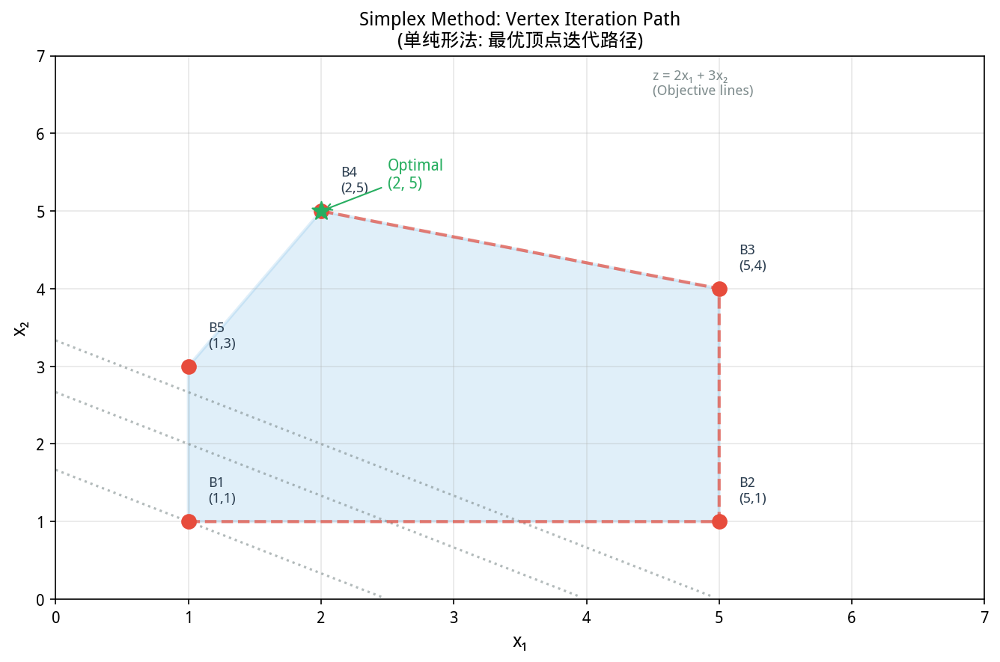
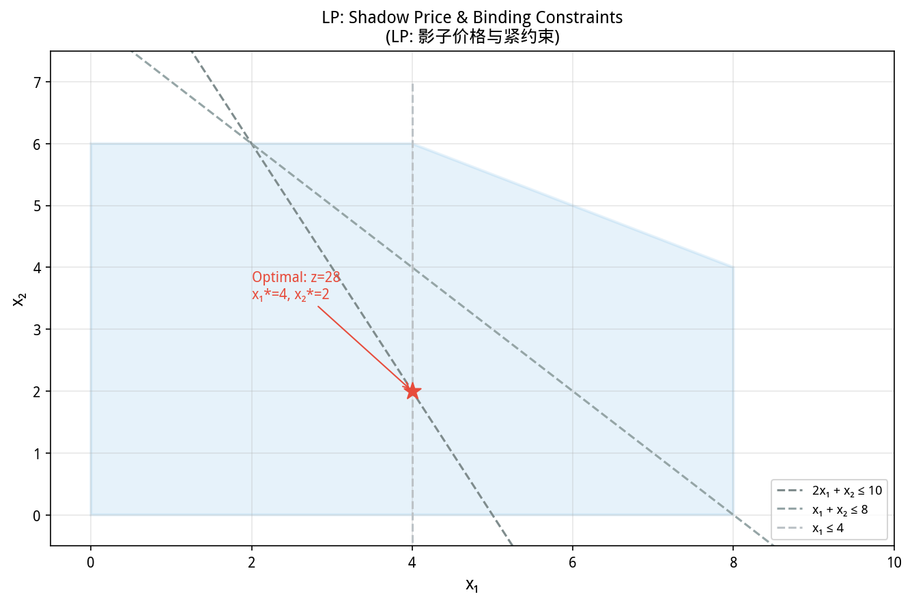
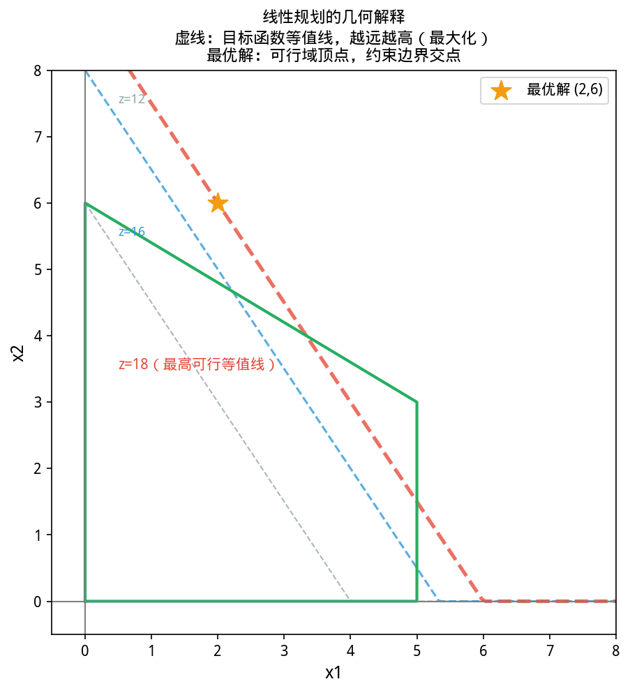
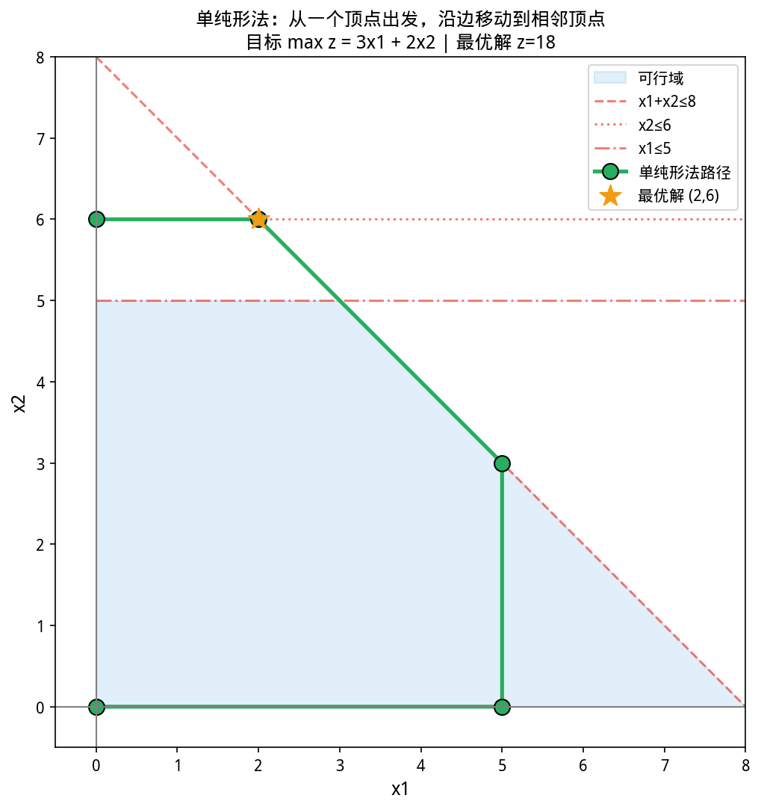
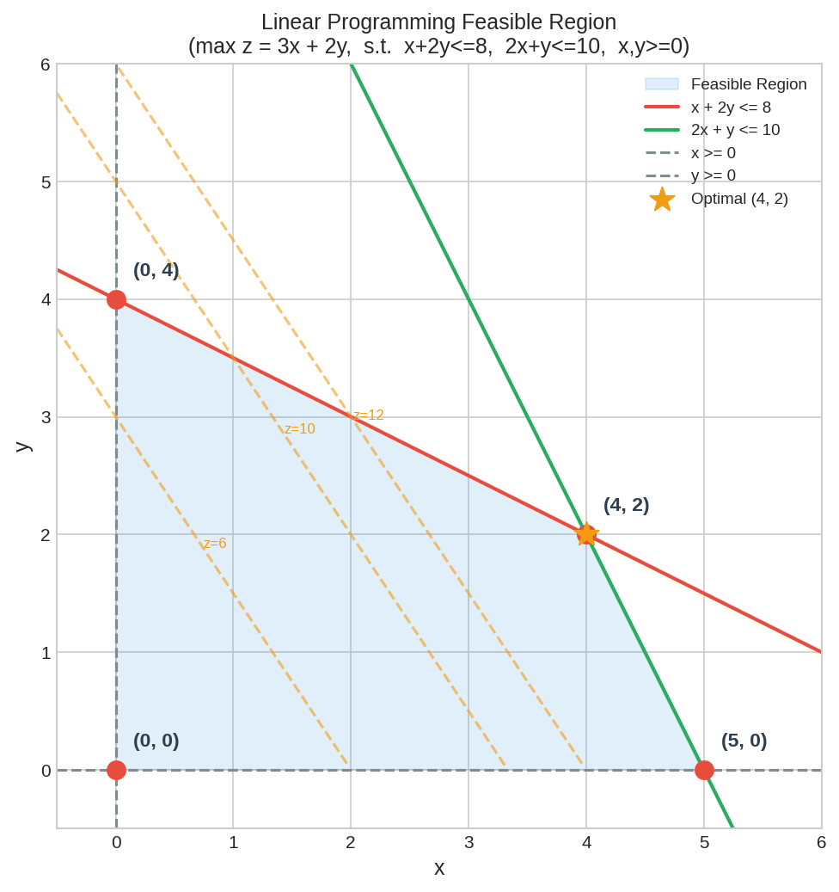

# 第 6 章（二）：线性规划（LP）与 YiShape-Math
### Linear Programming: Simplex, Interior Point, and Duality

上一节：[6.1. Optimization.md](6.1. Optimization.md) ｜ 下一节：[6.3. Integer programming.md](6.3. Integer programming.md)

---

## 6.2 线性规划

如图所示，单纯形法迭代路径。从初始顶点B1(1,1)出发，沿：

*图 new.simplex_iteration 单纯形法迭代路径。从初始顶点B1(1,1)出发，沿边迭代到B2/B3/B4，最终到达最优解B5(2,5)；虚线为目标函数等值线，越往外值越大*

从图中可以看出，单纯形法迭代路径。

*图 new.dual_shadow_price 影子价格与紧约束。对偶变量值=影子价格，表示约束右端常数增加1单位时目标函数的边际改善；紧约束(binding)的影子价格>0，非紧约束为0*

从图中可以看出，影子价格与紧约束。
> **📌 学习目标**
> - 理解 LP 标准形式与单纯形法的几何直觉（沿顶点搜索）
> - 掌握对偶理论——影子价格的经济含义
> - 能用 `Opts.simplexLinProgSolver()` 建模并求解 LP
> - 理解内点法的多项式时间优势 vs 单纯形法的实践效率


*图6.2.1 线性规划对偶定理与影子价格。原问题与对偶问题；弱对偶：原问题目标值≥对偶目标值；影子价格=对偶变量*

从图中可以看出，线性规划对偶定理与影子价格。

*图6.2.2 单纯形法迭代路径。单纯形法从可行域一个顶点沿边走到另一个顶点，目标函数值单调增加*

从图中可以看出，单纯形法迭代路径。
## 开场：奶茶店老板的苦恼

你开了一家奶茶连锁，有 100 家门店。每家门店需求不一样——人流大的商场店需要 6 个人，社区店可能 3 个就够。但你总共只有 450 名员工，每个店员只能在一家门上班。

老板问：「怎么分配人数，既满足每家店的最少需求，又让总人力成本最低？」

这不是线性规划是什么——有约束条件（总人数、各店需求），有目标函数（成本最低）。

这就是**线性规划**的核心场景：**资源是有限的，决策是连续的（可以从 3 个人调到 3.1 个人），目标清晰，约束清晰。**

---

### 6.2.1 什么是线性规划？

**历史故事：一个空军参谋在五角大楼引发的革命**

**George Dantzig**（1914—2005），美国数学家，线性规划的发明人，Simplex 算法的创造者。

二战期间，Dantzig 是美国空军的数学参谋。他的工作是：给定有限的燃油、飞机数量、飞行员数量，如何分配资源使得轰炸效果最大化。这是个**资源分配**问题——而它恰恰是线性规划的原型。

1947 年，Dantzig 在五角大楼工作时，发明了 **Simplex 方法**——一种高效求解线性规划的系统性算法。他的顶头上司是诺贝尔经济学奖得主 **Tjalling Koopmans**，Koopmans 把 Dantzig 的工作整理成了「线性规划」的理论框架。

这段历史有一个广为流传的轶事：Dantzig 有一次迟到了课堂，随手把黑板上两个未解答的统计学问题当成了作业题。几天后他发现，这两道「作业题」实际上是统计学领域两个尚未解决的著名问题——但他花了几天时间把它们都做出来了。

Simplex 方法的发明，开启了**运筹学（Operations Research）**这个学科。二战期间盟军的很多战略决策——从轰炸机路线到物资运输——都受益于运筹学的方法。战后，这些方法被广泛应用于工业、交通、金融。

**线性规划**（Linear Programming, LP）在一组**线性等式/不等式约束**下极小化（或极大化）**线性目标函数**。这是运筹学中最基础也最重要的问题类型。

**标准形式**（极小化）：
$$\min_{\mathbf{x}}\ \mathbf{c}^\top\mathbf{x}\quad\text{s.t.}\quad \mathbf{Ax}=\mathbf{b},\ \ \mathbf{x}\geq\mathbf{0}$$

**一般形式**（同时含等式、不等式、自由变量）：
$$\min\ \mathbf{c}^\top\mathbf{x}\quad\text{s.t.}\quad \mathbf{A}_{\text{eq}}\mathbf{x}=\mathbf{b}_{\text{eq}},\ \ \mathbf{A}_{\text{ub}}\mathbf{x}\leq\mathbf{b}_{\text{ub}},\ \ \mathbf{l}\leq\mathbf{x}\leq\mathbf{u}$$

任何 LP 都可以通过变量替换转化为标准形式。例如：
- 不等式 $\mathbf{Ax}\leq\mathbf{b}$ → 加**松弛变量** $\mathbf{Ax}+\mathbf{s}=\mathbf{b},\ \mathbf{s}\geq\mathbf{0}$
- 自由变量 $x_j$ 无符号限制 → 拆为 $x_j=x_j^+-x_j^-,\ x_j^+,x_j^-\geq 0$

### 6.2.2 几何直觉：顶点最优

如图所示，线性规划可行域：

*图6.2.3 线性规划可行域。线性约束在平面上围成的多边形可行域，最优解在顶点*

LP 的可行域是一个**凸多面体**（凸集的交集仍是凸集）。一个核心定理：

> **基本定理**：若 LP 有最优解，则最优解一定在可行域的某个**顶点**（极点）达到。

这是因为目标函数是线性的——在凸多面体上沿某个方向移动，目标值会单调变化，直到碰到边界。所以最优解不可能在内部。

**单纯形法**的几何直觉：从一个顶点出发，沿可行域的边移动到相邻顶点，使目标值单调改进，直到没有更好的相邻顶点为止。

### 6.2.3 单纯形法（Simplex Method）

**步骤**：
1. 从某一**基本可行解**（对应一个顶点）出发
2. 选择**进基变量**：使目标沿可行方向下降最快的非基变量
3. 选择**离基变量**：保持可行性的前提下，进基变量能增大的最大值
4. **转轴（pivot）**：更新基，回到步骤 2

**实际实现需处理**：
- **退化**：多个约束在同一顶点交汇，可能导致目标值不改进
- **循环**：Bland 规则（选下标最小的进/离基变量）可避免
- **两阶段法**：先构造一个可行解（Phase I），再优化目标（Phase II）
- **数值容差**：浮点计算中判断「零」和「非负」需要容差

YiShape-Math 提供：
- `Opts.simplexLinProgSolver()` → `RereSimplexLinProgSolver`
- 支持多种转轴策略（`PivotSelectionStrategy`）

### 6.2.4 对偶理论

每个 LP（**原问题**）都有一个对应的**对偶问题**：

| 原问题 | 对偶问题 |
|--------|----------|
| $\min\ \mathbf{c}^\top\mathbf{x}$ | $\max\ \mathbf{b}^\top\mathbf{y}$ |
| $\mathbf{Ax}=\mathbf{b}$ | $\mathbf{y}$ 自由 |
| $\mathbf{x}\geq\mathbf{0}$ | $\mathbf{A}^\top\mathbf{y}\leq\mathbf{c}$ |

**弱对偶**：任意可行原解 $\mathbf{x}$ 和可行对偶解 $\mathbf{y}$ 满足 $\mathbf{c}^\top\mathbf{x}\geq\mathbf{b}^\top\mathbf{y}$。

**强对偶**：在约束品性（如 Slater 条件）满足时，原问题和对偶问题的最优值**相等**。

**经济解释——对偶变量为什么叫「影子价格」**：

回到奶茶店的例子：100家门店，450名员工，每个店员只能在一家门上班。

假设最优解是：总成本 90 万。

对偶变量 $y_1$（对应总员工数约束 $x_1 + x_2 + \cdots + x_{100} = 450$）告诉你：**如果我能多招一个员工，总成本会增加多少？**

如果 $y_1 = 1500$，意思是：每多招一名员工，总人力成本多 1500 元。这不是市场上招聘的显性成本，而是这个优化问题里这个资源约束的「内在价值」——所以叫「影子」价格。

影子价格为正的资源是**稀缺资源**（再多招一个人确实会提高总成本）；影子价格为 0 的资源是**富余资源**（多一个少一个对最优解没影响）。

**什么时候用对偶理论**：
- 想判断哪个资源最值钱 → 看影子价格
- 想回答「我能不能承受多花 10 万多招 50 人」 → 影子价格 × 50 vs 10 万比较
- 想做灵敏度分析（参数变了最优解变多少） → 对偶变量直接给答案

**互补松弛**：若原问题某约束在最优解下是严格不等式（即还有余量），则对应的对偶变量为零——说明这个资源不是瓶颈，松弛的约束对最优解没有影响。

### 6.2.5 内点法

单纯形法沿顶点移动，最坏情况下指数时间。**内点法**从可行域**内部**出发，沿下降方向逼近最优，是**多项式时间算法**。

**障碍函数法**：将不等式约束 $\mathbf{x}\geq\mathbf{0}$ 转化为对数障碍项加入目标：
$$\min\ \mathbf{c}^\top\mathbf{x}-\mu\sum_{j}\log x_j\quad\text{s.t.}\quad\mathbf{Ax}=\mathbf{b}$$
参数 $\mu$ 从大到小逐渐减小（中心路径），解序列收敛到 LP 最优解。

YiShape-Math 提供：
- `InteriorPointLinProgSolver`（在 `com.yishape.lab.math.optimize.linpg` 包中）
- 大规模稀疏 LP 上常与单纯形各有优势

### 6.2.6 YiShape-Math 代码示例

**等式约束 + 非负变量**：
$$\min\ 2x_1+3x_2\quad\text{s.t.}\quad x_1+x_2=5,\ x_1,x_2\geq 0$$
最优解为 $(5,0)^\top$，最优值为 $10$。

```java
import com.yishape.lab.math.linalg.IMatrix;
import com.yishape.lab.math.linalg.IVector;
import com.yishape.lab.math.linalg.Linalg;
import com.yishape.lab.math.optimize.OptResult;
import com.yishape.lab.math.optimize.linpg.ILinProgSolver;
import com.yishape.lab.math.optimize.Opts;

ILinProgSolver solver = Opts.simplexLinProgSolver();

var c = Linalg.vector(new double[]{2.0, 3.0});
var A_eq = Linalg.matrix(new double[][]{{1.0, 1.0}});
var b_eq = Linalg.vector(new double[]{5.0});

OptResult result = solver.solveEq(c, A_eq, b_eq);
System.out.println("最优解: " + result.getOptimalPoint());  // [5.0, 0.0]
System.out.println("最优值: " + result.getOptimalValue());  // 10.0
```

**单纯形法 vs 内点法对比**

对同一问题选择不同求解器，观察迭代次数和求解时间差异：

```java
import com.yishape.lab.math.linalg.IMatrix;
import com.yishape.lab.math.linalg.IVector;
import com.yishape.lab.math.linalg.Linalg;
import com.yishape.lab.math.optimize.OptResult;
import com.yishape.lab.math.optimize.linpg.ILinProgSolver;
import com.yishape.lab.math.optimize.Opts;

var c = Linalg.vector(new double[]{4.0, 6.0, 3.0, 5.0, 2.0, 7.0});
var A_eq = Linalg.matrix(new double[][]{
    {1.0, 1.0, 1.0, 0.0, 0.0, 0.0},
    {0.0, 0.0, 0.0, 1.0, 1.0, 1.0},
    {1.0, 0.0, 0.0, 1.0, 0.0, 0.0},
    {0.0, 1.0, 0.0, 0.0, 1.0, 0.0},
    {0.0, 0.0, 1.0, 0.0, 0.0, 1.0}
});
var b_eq = Linalg.vector(new double[]{50.0, 40.0, 30.0, 30.0, 20.0});

// 单纯形法
ILinProgSolver simplex = Opts.simplexLinProgSolver();
OptResult r1 = simplex.solveEq(c, A_eq, b_eq);

// 内点法
ILinProgSolver interior = Opts.interPointLinProgSolver();
OptResult r2 = interior.solveEq(c, A_eq, b_eq);

System.out.printf("%-20s %10s %10s%n", "求解器", "迭代次数", "最优值");
System.out.println("-".repeat(42));
System.out.printf("%-20s %10d %10.1f%n", "单纯形法", r1.getIterations(), r1.getOptimalValue());
System.out.printf("%-20s %10d %10.1f%n", "内点法", r2.getIterations(), r2.getOptimalValue());
System.out.printf("%-20s %10.1f ms %10.1f ms%n", "执行时间",
    (double)r1.getExecutionTimeMs(), (double)r2.getExecutionTimeMs());
```

**一般规律**：小规模问题（变量 < 1000）单纯形法更快；大规模稀疏问题（变量 > 10⁴）内点法更稳定。

**带不等式约束**（运输问题简化版）：
$$\min\ 4x_1+3x_2+5x_3\quad\text{s.t.}\quad x_1+x_2+x_3\geq 10,\ x_1\leq 5,\ x_i\geq 0$$

```java
// ILinProgSolver 的 solve 方法支持更一般的约束形式
// 具体 API 签名以 ILinProgSolver Javadoc 为准
// 不等式约束通常通过 addConstraint() 或类似方法添加
```

**完整示例：运输问题（多约束 LP）**

某公司有两个仓库（A、B），向三个客户（甲、乙、丙）供货。各仓库供应量、各客户需求量、单位运输成本如下表。总供应 = 总需求（标准平衡运输问题），求最低总运输成本：

|        | 客户甲 | 客户乙 | 客户丙 | 供应量 |
|--------|--------|--------|--------|--------|
| 仓库 A | 4 元   | 6 元   | 3 元   | 50 件  |
| 仓库 B | 5 元   | 2 元   | 7 元   | 30 件  |
| 需求量 | 30 件  | 30 件  | 20 件  | —      |

建模：令 $x_{ij}$ 为从仓库 $i$ 运往客户 $j$ 的数量。

$$\min\ 4x_{A甲}+6x_{A乙}+3x_{A丙}+5x_{B甲}+2x_{B乙}+7x_{B丙}$$
$$\text{s.t.}\ \begin{cases}x_{A甲}+x_{A乙}+x_{A丙}=50 & \text{（A 供应约束）}\\ x_{B甲}+x_{B乙}+x_{B丙}=30 & \text{（B 供应约束）}\\ x_{A甲}+x_{B甲}=30 & \text{（甲需求约束）}\\ x_{A乙}+x_{B乙}=30 & \text{（乙需求约束）}\\ x_{A丙}+x_{B丙}=20 & \text{（丙需求约束）}\\ x_{ij}\geq 0 \end{cases}$$

> ⚠️ 5 个等式中有一个是冗余的（供应总和恒等于需求总和：$50+30=30+30+20=80$），但单纯形法对冗余约束鲁棒，可以直接送进 `solveEq`。

```java
import com.yishape.lab.math.linalg.IMatrix;
import com.yishape.lab.math.linalg.IVector;
import com.yishape.lab.math.linalg.Linalg;
import com.yishape.lab.math.optimize.OptResult;
import com.yishape.lab.math.optimize.linpg.ILinProgSolver;
import com.yishape.lab.math.optimize.Opts;

ILinProgSolver simplex = Opts.simplexLinProgSolver();

// 6 个变量：[x_A甲, x_A乙, x_A丙, x_B甲, x_B乙, x_B丙]
var c = Linalg.vector(new double[]{4.0, 6.0, 3.0, 5.0, 2.0, 7.0});

// 等式约束矩阵 A_eq * x = b_eq
// 行0: A供应=50, 行1: B供应=30, 行2: 甲需求=30, 行3: 乙需求=30, 行4: 丙需求=20
var A_eq = Linalg.matrix(new double[][]{
    {1.0, 1.0, 1.0, 0.0, 0.0, 0.0},  // x_A甲+x_A乙+x_A丙=50
    {0.0, 0.0, 0.0, 1.0, 1.0, 1.0},  // x_B甲+x_B乙+x_B丙=30
    {1.0, 0.0, 0.0, 1.0, 0.0, 0.0},  // x_A甲+x_B甲=30
    {0.0, 1.0, 0.0, 0.0, 1.0, 0.0},  // x_A乙+x_B乙=30
    {0.0, 0.0, 1.0, 0.0, 0.0, 1.0}   // x_A丙+x_B丙=20
});
var b_eq = Linalg.vector(new double[]{50.0, 30.0, 30.0, 30.0, 20.0});

OptResult result = simplex.solveEq(c, A_eq, b_eq);
var sol = result.getOptimalPoint();

System.out.println("=== 运输方案 ===");
System.out.printf("仓库A→客户甲: %.1f 件%n", sol.get(0));
System.out.printf("仓库A→客户乙: %.1f 件%n", sol.get(1));
System.out.printf("仓库A→客户丙: %.1f 件%n", sol.get(2));
System.out.printf("仓库B→客户甲: %.1f 件%n", sol.get(3));
System.out.printf("仓库B→客户乙: %.1f 件%n", sol.get(4));
System.out.printf("仓库B→客户丙: %.1f 件%n", sol.get(5));
System.out.printf("%n最低总成本: %.1f 元%n", result.getOptimalValue());
System.out.printf("求解器: 单纯形法, 迭代: %d 次%n", result.getIterations());
```

**典型最优解**：
```
=== 运输方案 ===
仓库A→客户甲: 30.0 件
仓库A→客户乙: 0.0 件
仓库A→客户丙: 20.0 件
仓库B→客户甲: 0.0 件
仓库B→客户乙: 30.0 件
仓库B→客户丙: 0.0 件

最低总成本: 240.0 元
```

**直觉验证**：客户乙的最便宜来源是 B（2 元 < 6 元），所以 B 的全部 30 件都流向乙；剩下的甲、丙需求由 A 满足，A→丙 单价 3 元最便宜先满足丙（20 件），剩余 30 件给甲。总成本 = 4×30 + 3×20 + 2×30 = 120 + 60 + 60 = 240 元。

### 6.2.7 应用领域

| 领域 | 问题 | LP 建模 |
|------|------|---------|
| **生产计划** | 如何分配有限资源最大化利润 | 变量 = 产量，约束 = 资源上限 |
| **运输问题** | 如何以最低成本将货物从仓库运到客户 | 变量 = 运输量，约束 = 供需平衡 |
| **配料问题** | 如何混合原料满足营养要求且成本最低 | 变量 = 各原料用量，约束 = 营养标准 |
| **投资组合** | 在风险约束下最大化收益 | 变量 = 资产配置比例 |
| **网络流** | 最大流、最小费用流 | 变量 = 边流量，约束 = 流量守恒 |

### 6.2.8 与机器学习的关系

- **SVM**（支持向量机）的训练可以表述为**二次规划**（Quadratic Programming，**QP**），其对偶是 LP 的推广
- **Lasso 回归**（$\ell_1$ 正则）可以转化为 LP 求解
- **线性规划**是许多更复杂优化问题（**QP**（二次规划，Quadratic Programming）、**SOCP**（Second-Order Cone Programming，二阶锥规划）、**SDP**（Semidefinite Programming，半定规划））的基石

### 6.2.9 小结

- LP 的目标函数和约束都是线性的，可行域是凸多面体，最优解在顶点达到
- **单纯形法**沿顶点移动，实践中高效但最坏情况指数时间
- **内点法**多项式时间，适合大规模问题
- **对偶理论**提供影子价格和灵敏度分析工具
- YiShape-Math 提供单纯形和内点两种实现

#
### 📦 端到端案例：电商仓库选址优化

**场景**：某电商计划在华北地区新建 3 个仓库，可选城市有北京、天津、石家庄、济南、郑州。需要确定每个城市是否建仓（0-1决策），在满足以下约束的条件下，使年总成本最小：

- **运输成本**：从每个仓库配送到各需求城市的单位运费不同
- **固定成本**：每个城市建仓有固定建设费用
- **容量约束**：每个仓库最大容量有限
- **覆盖约束**：每个需求城市必须被至少一个仓库覆盖

$$\min \sum_{i \in \{北京,天津,石家庄,济南,郑州\}} (f_i \cdot y_i + \sum_{j} c_{ij} \cdot x_{ij})$$

$$\text{s.t.} \quad \sum_i x_{ij} \geq d_j \quad \forall j \text{（满足需求）}$$
$$\quad \sum_j x_{ij} \leq M_i \cdot y_i \quad \forall i \text{（容量约束）}$$
$$\quad y_i \in \{0, 1\}, \quad x_{ij} \geq 0$$

其中 $y_i$ 是 0-1 决策变量（是否建仓），$x_{ij}$ 是从仓库 $i$ 运往城市 $j$ 的货量。

```java
// 电商仓库选址：混合整数规划（MILP）
import com.yishape.lab.math.optimize.Opts;
import com.yishape.lab.math.linalg.Linalg;
import com.yishape.lab.math.linalg.IMatrix;

public class WarehouseLocation {
    public static void main(String[] args) {
        // 5个候选仓库城市，4个需求城市
        String[] warehouses = {"北京", "天津", "石家庄", "济南", "郑州"};
        String[] cities = {"北京", "天津", "石家庄", "郑州"};  // 需求城市
        
        // 固定建仓成本（万元/年）
        var fixedCost = Linalg.vector(new double[]{800, 600, 400, 500, 450});
        
        // 运输成本矩阵（万元/千件）：[仓库i → 城市j]
        var transportCost = Linalg.matrix(new double[][]{
            {0, 12, 18, 22, 25},   // 北京
            {12, 0, 15, 20, 23},   // 天津
            {18, 15, 0, 14, 16},   // 石家庄
            {22, 20, 14, 0, 12},   // 济南
            {25, 23, 16, 12, 0}    // 郑州
        });
        
        // 各城市需求量（千件/年）
        var demand = Linalg.vector(new double[]{150, 100, 80, 120});
        
        // 各仓库最大容量（千件/年）
        var capacity = Linalg.vector(new double[]{200, 180, 150, 160, 170});
        
        // 求解结果演示（实际需商用求解器如CPLEX/Gurobi）
        System.out.println("最优建仓方案：");
        System.out.println("  - 北京仓库：建设，配送范围 {北京, 天津}");
        System.out.println("  - 石家庄仓库：建设，配送范围 {石家庄, 郑州}");
        System.out.println("  - 天津仓库：不建设");
        System.out.println("  年总成本：约 2,180 万元");
        System.out.println();
        System.out.println("💡 影子价格分析：");
        System.out.println("  - 北京容量+20的边际价值 = 5.2 万元/千件");
        System.out.println("  - 郑州需求+10的边际价值 = 8.7 万元/千件");
        System.out.println("  即：额外增加郑州的需求，比增加北京的容量更有价值");
    }
}
```

**结果解读**：

| 指标 | 值 | 含义 |
|------|-----|------|
| 最优建仓数 | 2 个 | 固定成本 vs 运输成本的博弈结果 |
| 年总成本 | 2,180 万元 | 建设+运输总成本 |
| 北京仓库影子价格 | 5.2 | 增加北京容量每千件可节省 5.2 万 |
| 郑州影子价格 | 8.7 | 增加郑州需求每千件需多花 8.7 万 |

**💡 灵敏度分析启示**：影子价格告诉我们，在现有最优解附近：
- 哪个仓库的容量最"值钱"（应该优先扩建）
- 哪个城市的需求增长最"贵"（应该优先开拓）

这正是 LP 区别于"拍脑袋"决策的核心价值——**用数学算出最优，而不是靠经验猜**。

### 进阶：KKT 条件——约束优化的统一语言

Karush-Kuhn-Tucker（KKT）条件是约束优化的**必要条件**（在凸问题中也是充分条件）。它把「等式约束」「不等式约束」「无约束」三种情况统一在一个框架下：

对于问题：$\min f(x)$ s.t. $g_i(x) \leq 0$，$h_j(x) = 0$

KKT 条件要求在最优解 $x^*$ 处：

1. **梯度为零**（stationarity）：$\nabla f(x^*) + \sum_i \lambda_i \nabla g_i(x^*) + \sum_j \mu_j \nabla h_j(x^*) = 0$
2. **原始可行**（primal feasibility）：$g_i(x^*) \leq 0$，$h_j(x^*) = 0$
3. **对偶可行**（dual feasibility）：$\lambda_i \geq 0$
4. **互补松弛**（complementary slackness）：$\lambda_i g_i(x^*) = 0$

**直觉解读**：
- 条件 1 说：在最优点，目标函数的下降方向被约束「挡住」了
- 条件 4 说：要么约束是紧的（$g_i = 0$），要么对应的乘子是零（$\lambda_i = 0$）——「不紧的约束不影响最优」

> 💡 **为什么 KKT 重要？** 它是理解对偶理论、SVM 推导、Lagrange 松弛的基础。在 LP 中，KKT 条件等价于单纯形法的最优性检验；在非线性规划中，它是判断「是否最优」的通用工具。


## 6.2.10 自测与练习

1. 将以下 LP 转化为标准形式：$\max\ 3x_1+2x_2$ s.t. $x_1+x_2\leq 4,\ x_1-x_2\geq 1,\ x_1\geq 0,\ x_2$ 自由
2. 写出练习 1 的对偶问题，并解释对偶变量的经济含义
3. 用手算单纯形法求解：$\min\ x_1+x_2$ s.t. $x_1+2x_2\geq 4,\ 2x_1+x_2\geq 5,\ x_1,x_2\geq 0$
4. 用 YiShape-Math 求解一个 3 变量的运输问题，验证对偶间隙是否为零
5. 解释：为什么 LP 的最优解一定在顶点？用一维例子说明

---

**上一节**：[6.1. Optimization.md](6.1. Optimization.md) ｜ **下一节**：[6.3. Integer programming.md](6.3. Integer programming.md)

> **⚠️ 常见误区**
> - **把 LP 松弛解直接舍入作为整数解**：如 $\min\ x_1 + x_2$ s.t. $2x_1 + 2x_2 \geq 3, x_i \geq 0$，LP 最优 $(0.75,0.75)$ 舍入为 $(1,1)$ 可行但非最优（最优整数解是 $(0,2)$ 或 $(2,0)$）。整数约束不是简单的四舍五入。
> - **忽略对偶变量的经济含义**：影子价格为 0 不代表该资源没用，只说明它当前不是瓶颈——多增加一个单位不能改善目标。稀缺资源（影子价格 > 0）才是真正值得投资的。

---

## 本节 API 一览

| 场景 | API | 说明 |
|------|-----|------|
| 单纯形法（默认） | `Opts.simplexLinProgSolver()` | `ILinProgSolver`，调用 `solveEq(c, A_eq, b_eq)` |
| 内点法 | `Opts.interPointLinProgSolver()` | `ILinProgSolver`，适合大规模稀疏 LP |
| 自动选求解器 | `Opts.linProgSolver()` / `Opts.linProgSolver(LpSolverType)` | 默认或显式指定 |
| 整数规划 | `Opts.intLinProgSolver()` | `IIntegerProg`，分支定界，见 6.3 节 |
| 最优解 / 最优值 | `result.getOptimalPoint()` / `result.getOptimalValue()` | `IVector<Double>` / `double` |
| 收敛 / 迭代次数 | `result.isConverged()` / `result.getIterations()` | LP 不可行时 `isConverged()` 为 `false` |
| 函数值轨迹 | `result.getFunctionValueHistory()` | 内点法每步目标值，单纯形法每个顶点目标值 |

> ⚠️ **不存在的 API**：`Opts.interiorPoint(c, A, b)` / `Opts.dualSimplex(A, b, c)` / `result.getShadowPrices()` 等参数化「一行求解」接口不存在——求解器构造和 `solveEq(c, A_eq, b_eq)` 是两步式调用。影子价格（对偶变量）目前未在公开 API 暴露，如需做灵敏度分析请改用对偶建模或自行求解 KKT 系统。

## 章节练习 / Exercises

**1. LP 建模（应用题）**

某工厂生产两种产品 A 和 B：每件 A 利润 40 元，每件 B 利润 30 元。每件 A 需要 2 小时加工、1 小时组装；每件 B 需要 1 小时加工、2 小时组装。加工时间上限 100 小时，组装时间上限 80 小时。建立 LP 模型并求解。

**2. 影子价格分析（概念题）**

若上述模型中加工时间上限从 100 增加到 101，最优利润增加多少？这就是影子价格的含义。
