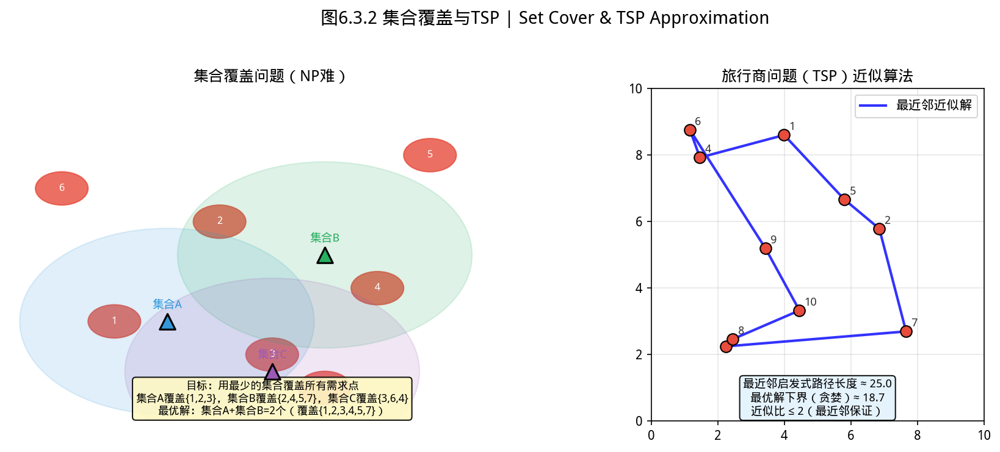
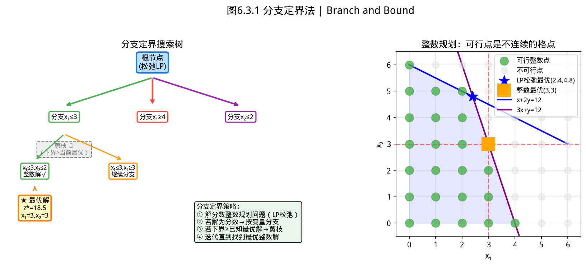

## 开场：这些「必须选整数」的问题，线性规划解不出来

线性规划的解可以是分数——但现实中有大量问题，答案必须是整数：

- **选址问题**：在全国开 10 家店，石家庄和秦皇岛各算 1 家，不能开 0.7 家
- **投资组合**：你有 100 万，「是否投 A」必须是 0 或 1，不能含糊
- **排班问题**：每个班次需要几名护士，不能派 0.5 个人

这类问题叫**整数规划（Integer Programming）**——比线性规划难得多，因为最优解不再在凸多面体的顶点，而在离散的格点上。


> ⚠️ **常见误区**：分支定界在节点太多时会退化为暴力枚举——变量多且松弛 LP 解离整数很远时，优先考虑割平面或启发式算法（0-1 背包问题用贪心有时更实用）。

---

# 第 6 章（三）：整数规划与 YiShape-Math
### Integer Programming: Branch-and-Bound, Modeling, and Applications

上一节：[6.2. Linear programming.md](6.2. Linear programming.md) ｜ 下一节：[6.4. Nonconvex optimization.md](6.4. Nonconvex optimization.md)

---

## 6.3 整数规划


> 📝 **历史故事**：分支定界法（Branch and Bound）由 **Ailsa Land 和 Alison Doig（1960）** 在伦敦政治经济学院（LSE）发表的论文《An Automatic Method of Solving Discrete Programming Problems》中提出。但这个方法的商业价值被忽视了 20 年，直到 1980 年代个人电脑普及后，才成为组合优化的事实标准。如今每个物流公司用的路径优化软件，背后都是分支定界的变体。


> **📌 学习目标**
> - 理解 LP 松弛下界与分支定界剪枝如何避免暴力枚举
> - 掌握 0-1 变量的建模方法——选址、背包、指派
> - 能用 `Opts.intLinProgSolver()` 求解整数规划
> - 理解最优性间隙（optimality gap）在实际业务中的意义


*图6.3.1 集合覆盖与TSP近似。集合覆盖用贪心近似（1.58倍近似比）；TSP用最近邻/Christofides启发式*

从图中可以看出，集合覆盖与TSP近似。

*图6.3.2 分支定界法。分支定界通过LP松弛下界和变量分支剪枝，避免枚举所有整数组合*

从图中可以看出，分支定界法。
## 开场：开不开这家店？

你是一家连锁便利店的选址分析师。现在有三个候选地址：A、B、C。公司打算选其中两个建新店，预算只能支撑建两家。

A 店预计年利润 80 万， B 店 65 万， C 店 70 万。

这个问题看起来简单：「选利润最高的两个不就行了？」——B+C = 135 万，A+B = 145 万，A+C = 150 万。选 A 和 C。

**但现实更复杂**：这三家店有重叠的覆盖区域，选 A 和 C 之后，部分区域的配送成本反而更高。每个选址决策之间不是独立的。

更糟糕的是：**你不能开半家店——要么开，要么不开。** 变量从「连续」变成了「0-1 整数」，问题性质彻底变了。

这就是**整数规划**的战场——当决策是「是/否」类型时，线性规划不够用了。

---

### 6.3.1 从连续到离散：为什么需要整数变量？

线性规划假设变量可以取任意实数值。但在许多实际问题中，决策变量**必须是整数**：

- **0-1 决策**：是否建工厂、是否选择某项目、开关状态
- **数量决策**：生产几台机器、派几辆车——不能生产 2.5 台
- **组合选择**：从 $n$ 个选项中选 $k$ 个

当线性规划中加入整数约束后，可行域从凸多面体变成**离散格点**，问题复杂度从 P 跃升到 **NP-hard**。

### 6.3.2 LP 松弛与最优性间隙

**LP 松弛**：去掉整数约束，将 $\mathbf{x}\in\mathbb{Z}^d$ 放松为 $\mathbf{x}\in\mathbb{R}^d$。

**为什么松弛有用？**

回到选址问题：你有 10 个候选地址，最多选 3 个建店。去掉「最多选 3 个」这个整数约束，解 LP 松弛——可能得到「在 1.3 号地址各建 0.8 个店」（不是物理上可能的，但数学上合法）。

这个 LP 松弛解给出一个**下界**：无论你怎么选整数解，最优成本不可能低于这个下界（如果下界已经很高，说明这个问题不值得花精力去精确求解）。

同时，任意一个可行的整数解（比如「选 1、4、7 号地址」）给出一个**上界**——你已经找到了一个解，成本为 X，任何比 X 更差的整数解都可以直接放弃。

二者之差就是 **optimality gap**：
$$\text{gap} = \frac{\text{上界} - \text{下界}}{|\text{上界}|}$$

**gap 缩小到 5% 以下，在实际业务中通常就可以接受了**——你花再多时间去找更优的解，节省的成本可能抵不上工程师的时间。

分支定界算法通过不断分支（分割可行域）和剪枝（用界排除不可能更优的分支），逐步缩小 gap，直至找到最优解或 gap 小于容差。

### 6.3.3 经典模型

**0-1 背包问题**：
$$\max\ \sum_{j=1}^{n}v_jx_j\quad\text{s.t.}\quad\sum_{j=1}^{n}w_jx_j\leq W,\ x_j\in\{0,1\}$$
$v_j$ 为价值，$w_j$ 为重量，$W$ 为容量。

**指派问题**：将 $n$ 项工作分配给 $n$ 个人，每人做一项工作，最小化总成本：
$$\min\ \sum_{i,j}c_{ij}x_{ij}\quad\text{s.t.}\quad\sum_j x_{ij}=1,\ \sum_i x_{ij}=1,\ x_{ij}\in\{0,1\}$$

**设施选址问题**：决定在哪些候选位置建厂，以及如何将客户分配给工厂：
$$\min\ \sum_j f_jy_j + \sum_{i,j}c_{ij}x_{ij}\quad\text{s.t.}\quad\sum_j x_{ij}=1,\ x_{ij}\leq y_j,\ x_{ij},y_j\in\{0,1\}$$
$y_j=1$ 表示在位置 $j$ 建厂（固定成本 $f_j$），$x_{ij}=1$ 表示客户 $i$ 由工厂 $j$ 服务。

### 6.3.4 YiShape-Math 代码示例

**全整数变量 + 等式约束**：
$$\min\ x_1+x_2\quad\text{s.t.}\quad x_1+x_2=3,\ x_1,x_2\in\mathbb{Z}_{\geq 0}$$
最优值为 3（如 $(1,2),(2,1),(3,0),(0,3)$）。

```java
import com.yishape.lab.math.linalg.IMatrix;
import com.yishape.lab.math.linalg.IVector;
import com.yishape.lab.math.linalg.Linalg;
import com.yishape.lab.math.optimize.OptResult;
import com.yishape.lab.math.optimize.Opts;
import com.yishape.lab.math.optimize.linpg.IIntegerProg;

IIntegerProg solver = Opts.intLinProgSolver();
solver.addIntegerVariables(0, 1);  // 变量 0 和 1 为整数

var c = Linalg.vector(new double[]{1.0, 1.0});
var A_eq = Linalg.matrix(new double[][]{{1.0, 1.0}});
var b_eq = Linalg.vector(new double[]{3.0});

OptResult result = solver.solveEq(c, A_eq, b_eq);
System.out.println("整数最优解: " + result.getOptimalPoint());
System.out.println("最优值: " + result.getOptimalValue());
```

**完整示例：0-1 背包问题**

有 5 件物品，背包容量 10。每件物品的价值和重量如下，求最大总价值：

| 物品 | 价值 | 重量 |
|------|------|------|
| 物品 1 | 8    | 4    |
| 物品 2 | 10   | 5    |
| 物品 3 | 15   | 6    |
| 物品 4 | 4    | 2    |
| 物品 5 | 7    | 3    |

$$\max\ 8x_1+10x_2+15x_3+4x_4+7x_5 \quad \text{s.t.}\ 4x_1+5x_2+6x_3+2x_4+3x_5\leq 10,\ x_j\in\{0,1\}$$

```java
import com.yishape.lab.math.linalg.IMatrix;
import com.yishape.lab.math.linalg.IVector;
import com.yishape.lab.math.linalg.Linalg;
import com.yishape.lab.math.optimize.OptResult;
import com.yishape.lab.math.optimize.Opts;
import com.yishape.lab.math.optimize.linpg.IIntegerProg;

IIntegerProg solver = Opts.intLinProgSolver();
solver.addBinaryVariables(0, 1, 2, 3, 4);   // 5 个变量都设为 0-1

// 目标函数系数（intLinProgSolver 极小化，故价值取负）
var c = Linalg.vector(new double[]{-8.0, -10.0, -15.0, -4.0, -7.0});

// 不等式约束：4x1+5x2+6x3+2x4+3x5 <= 10
var A_ub = Linalg.matrix(new double[][]{{4.0, 5.0, 6.0, 2.0, 3.0}});
var b_ub = Linalg.vector(new double[]{10.0});

OptResult result = solver.solve(c, A_ub, b_ub);
var sol = result.getOptimalPoint();

String[] items = {
    "物品1(价值8,重量4)", "物品2(价值10,重量5)",
    "物品3(价值15,重量6)", "物品4(价值4,重量2)", "物品5(价值7,重量3)"
};
double[] weights = {4, 5, 6, 2, 3};

System.out.println("=== 背包选择方案 ===");
double totalWeight = 0.0;
for (int i = 0; i < 5; i++) {
    boolean picked = sol.get(i) > 0.5;
    System.out.printf("  %s: %s%n", items[i], picked ? "✓ 选中" : "✗ 未选");
    if (picked) totalWeight += weights[i];
}

double totalValue = -result.getOptimalValue();  // 原目标取负之后还原
System.out.printf("%n最大总价值: %.0f 元%n", totalValue);
System.out.printf("实际总重量: %.0f / 10%n", totalWeight);
System.out.printf("分支定界迭代: %d 次%n", result.getIterations());
```

**典型最优解**：
```
=== 背包选择方案 ===
  物品1(价值8,重量4): ✗ 未选
  物品2(价值10,重量5): ✓ 选中
  物品3(价值15,重量6): ✗ 未选
  物品4(价值4,重量2): ✓ 选中
  物品5(价值7,重量3): ✓ 选中

最大总价值: 21 元
实际总重量: 10 / 10
```

选了物品 2+4+5，总价值 21，恰好用满 10 单位容量。如果用贪心（按价值/重量比选），可能漏掉这个组合——这就是整数规划相对启发式的价值。

**0-1 变量**：

```java
IIntegerProg solver = Opts.intLinProgSolver();
solver.addBinaryVariables(0, 1, 2);  // 变量 0,1,2 为 0-1 变量

// 例：背包问题，3 件物品，重量 [3,4,5]，价值 [4,5,6]，容量 7
var values = Linalg.vector(new double[]{-4.0, -5.0, -6.0});  // 转为极小化
var weights = Linalg.matrix(new double[][]{{3.0, 4.0, 5.0}});
var capacity = Linalg.vector(new double[]{7.0});

OptResult res = solver.solve(values, weights, capacity);
System.out.println("选中: " + res.getOptimalPoint());  // 0/1 向量
System.out.println("最大价值: " + (-res.getOptimalValue()));
```

**完整示例：分支定界手算示意**

下面的示意展示分支定界**应该**如何工作（并非 `intLinProgSolver` 的真实日志输出——求解器内部没有暴露每个子节点）。

```
3 变量 0-1 背包：容量=2，重量=[2,2,2]，价值=[3,4,5]
原问题: max 3x1 + 4x2 + 5x3 s.t. 2x1+2x2+2x3 ≤ 2, x_i ∈ {0,1}

根节点 (LP 松弛)
  解: x = [0.67, 0.67, 0.67]   目标 = 8.0   (上界, 极大化下解 LP 松弛得最大可能值)
  └─ x1 = 0 (分支 1)
       LP 解: x = [0, 1, 0]  → 容量超限不可行；再分支 x2=1, x3=0 → x=[0,1,0] 目标=4
       记录可行解, 当前最优 = 4
  └─ x1 = 1 (分支 2)
       LP 解: x = [1, 0, 0]  → 目标 = 3 < 当前最优 4 → 剪枝
最优整数解: x = [0, 1, 0], 目标 = 4 (选物品 2)
```

> ⚠️ 上面是教学示意，**不要**把它当成 `intLinProgSolver` 的真实跟踪。`OptResult.getIterations()` 给的是顶层迭代计数，不是搜索树节点数；想要节点级日志需要自己实现或加日志钩子。

### 6.3.5 分支定界算法直觉

**用一个具体例子走一遍**：

目标：从 3 个候选地址选 1 个（或 0 个），最小化成本。

| 决策 | 建店固定成本 | 运营成本（如果建）| 收益 |
|------|------------|----------------|------|
| 选地址 A | 5 万 | 2 万 | 10 万 |
| 选地址 B | 3 万 | 4 万 | 8 万 |
| 选地址 C | 4 万 | 1 万 | 7 万 |

目标是最大化净利润（收益 - 固定成本 - 运营成本）。

**第一步：解 LP 松弛**（去掉「只能选 0 或 1」约束）：

LP 松弛最优解：A=0.8, B=0.5, C=0，净利润 = 2.4 万（这是一个下界——整数解不可能比这更好）

**第二步：分支**（选 A=0.8 这个非整数变量）：
- 子问题 1：加约束 A ≤ 0 → 解得：B=0.8, C=0，净利润 = 2.0 万
- 子问题 2：加约束 A ≥ 1 → 解得：A=1, B=0.3, C=0，净利润 = 2.6 万

**第三步：剪枝**（子问题 1 的净利润 2.0 万 < 已知最优 2.6 万，丢弃）

**第四步：继续分支子问题 2**（B=0.3 还是非整数）：
- 子问题 2a：B ≤ 0 → A=1, B=0, C=0.5，净利润 = 2.5 万
- 子问题 2b：B ≥ 1 → A=1, B=1, C=0，净利润 = 1 万

**最优整数解**：子问题 2a → A=1, C=0.5 → 取整后 A=1, C=1（选 A 和 C），净利润 = 3 万

**关键洞察**：分支定界避免了解空间的穷举搜索——如果暴力枚举，3 个变量有 $2^3=8$ 种组合；分支定界在第 3 步就剪掉了 4 个分支，只搜索了 5 个子问题。变量越多，节省越多。

### 6.3.6 与连续优化的关系

| 特性 | LP（连续） | ILP/MIP（整数） |
|------|-----------|-----------------|
| 可行域 | 凸多面体 | 离散格点 |
| 复杂度 | P（多项式时间） | NP-hard |
| 舍入 LP 解 | — | 一般不保证最优甚至可行 |
| 求解器 | 单纯形、内点法 | 分支定界 + LP 求解器 |

**关键警告**：对 LP 松弛解**直接舍入**到最近整数，既不保证最优，甚至不保证可行。例如：$\min\ x_1+x_2$ s.t. $2x_1+2x_2\geq 3,\ x_1,x_2\geq 0$。LP 最优为 $(0.75,0.75)$，舍入为 $(1,1)$ 可行但不是整数最优 $(0,2)$ 或 $(2,0)$。

### 6.3.7 小结

- 整数变量使线性问题变为 NP-hard，需分支定界等专门算法
- `IIntegerProg` 扩展 `ILinProgSolver`，支持整数和 0-1 变量声明
- LP 松弛给出下界，整数可行解给出上界
- 直接舍入 LP 解不可靠——整数性是关键难点

### 6.3.8 自测与练习

1. 求解：$\max\ 5x_1+8x_2$ s.t. $x_1+x_2\leq 6,\ 5x_1+9x_2\leq 45,\ x_1,x_2\in\mathbb{Z}_{\geq 0}$（先解 LP 松弛，再分支）
2. 用 YiShape-Math 求解 0-1 背包问题（5 件物品），验证贪心解与最优解的差异
3. 解释：为什么 LP 松弛的界对分支定界至关重要？
4. 构造一个 LP 松弛最优解舍入后不可行的例子

---

**上一节**：[6.2. Linear programming.md](6.2. Linear programming.md) ｜ **下一节**：[6.4. Nonconvex optimization.md](6.4. Nonconvex optimization.md)

---

## 本节 API 一览

整数规划在 YiShape-Math 中通过 `IIntegerProg` 暴露——它继承自 `ILinProgSolver`，使用前**必须显式声明**哪些变量是整数或 0-1。

| 场景 | API | 说明 |
|------|-----|------|
| 获取求解器 | `Opts.intLinProgSolver()` | 无参工厂方法返回 `IIntegerProg` 实例 |
| 声明整数变量 | `solver.addIntegerVariables(int... idx)` | 指定变量下标（从 0 开始），可取任意整数 |
| 声明 0-1 变量 | `solver.addBinaryVariables(int... idx)` | 指定变量下标，限制为 {0,1} |
| 求解（不等式） | `solver.solve(c, A_ub, b_ub)` | $\min c^\top x$ s.t. $A_{ub}x\leq b_{ub}$ |
| 求解（含等式） | `solver.solve(c, A_ub, b_ub, A_eq, b_eq)` | 同上 + $A_{eq}x = b_{eq}$ |
| 仅等式约束 | `solver.solveEq(c, A_eq, b_eq)` | $\min c^\top x$ s.t. $A_{eq}x = b_{eq}$ |
| 最优值/解 | `result.getOptimalValue()` / `result.getOptimalPoint()` | 返回 `double` / `IVector`(0-1 向量取 >0.5 判定选中) |
| 顶层迭代计数 | `result.getIterations()` | 注意：**不是分支搜索树节点数** |

> ⚠️ **不存在的 API**：`Opts.knapSack(...)`、`Opts.assignment(...)`、`Opts.cutPlane(...)`、`solver.setAllVariablesBinary()`、`result.getStatus()`、`result.getOptimalityGap()` 都未在公共 API 中提供。背包、指派、设施选址等都按一般 IP 建模并用 `intLinProgSolver()` 求解；最优性间隙需要自己根据 LP 松弛上下界计算。
>
> **实战技巧**：大规模 IP 先用 `Opts.simplexLinProgSolver()` 解 LP 松弛获得下界，再调 `intLinProgSolver()` 收紧——LP 解为整数即跳过分支。

## 章节练习 / Exercises

**1. 整数规划建模（应用题）**

某公司有 5 个可选仓库地址，选址费用分别为 [10, 15, 8, 20, 12]（万元），每个仓库容量分别为 [50, 40, 60, 35, 45]（万件）。公司需要覆盖 100 万件的需求量，选址费用最低。建立并求解这个 IP 问题。

**2. LP 松弛分析（概念题）**

对上述问题，若去掉「只能选 0 或 1」的整数约束，求 LP 松弛解，比较 LP 松弛解与 IP 最优解的差异。
