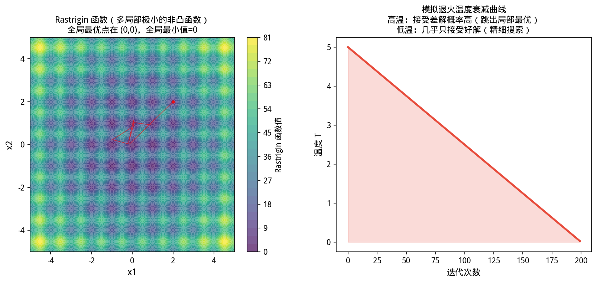

### 历史故事：感知机的冬天，和 Rumelhart 的救赎

1957 年，**Frank Rosenblatt** 发明了感知机——世界上第一个「能学习」的机器学习模型。他预言：感知机将能够识别任意物体。

1969 年，**Marvin Minsky** 从数学上证明了单层感知机**无法解决 XOR 问题**——最简单的非线性分类问题。

这个证明直接导致了 AI 的第一次寒冬：政府和企业纷纷削减神经网络研究经费，十年间几乎无人问津。

直到 1986 年，**David Rumelhart** 和 Geoffrey Hinton 等人提出了**反向传播算法（Backpropagation）**——证明多层神经网络可以解决 XOR，而且能自动学习特征表示。

**这和最优化有什么关系？** 反向传播本质是**链式法则 + 梯度下降**——最优化理论是深度学习的引擎。


> ⚠️ **常见误区**：模拟退火的「温度」衰减太快会导致陷入局部最优——建议初期温度高、衰减慢（推荐衰减率 0.95~0.99），给算法足够时间探索解空间。

---

# 第 6 章（四）：非凸优化与机器学习
### Nonconvex Optimization: Local Minima, Saddle Points, and ML Training

上一节：[6.3. Integer programming.md](6.3. Integer programming.md) ｜ 下一节：[6.5. Parallel optimization.md](6.5. Parallel optimization.md)

---

## 6.4 非凸优化


> **📌 学习目标**
> - 理解非凸优化只能保证「稳定点」，不保证全局最优
> - 掌握鞍点 vs 局部极小的二阶判定方法
> - 能用多起点优化策略寻找更好的局部极小
> - 理解深度学习中的梯度消失/爆炸与 Hessian 条件数的关系


*图6.4.1 模拟退火算法。SA以概率exp(-ΔE/T)接受劣解；温度T随时间下降；理论上可找到全局最优*

从图中可以看出，模拟退火算法。
### 6.4.1 为什么非凸优化是难点？

第 6.1 节中，凸优化保证了「任一局部极小 = 全局极小」。但许多重要目标函数**非凸**：
- **神经网络**：多层非线性变换的复合，损失曲面高度非凸
- **矩阵分解**：$\min\|\mathbf{A}-\mathbf{UV}^\top\|_F^2$ 对 $(\mathbf{U},\mathbf{V})$ 非凸
- **决策树集成**：单棵树非凸，GBDT 序列训练每步近似凸但整体非凸
- **混合模型**：GMM 的对数似然非凸，EM 收敛到局部极大

在非凸世界中，梯度下降/L-BFGS 等算法只能保证收敛到**稳定点**（$\nabla f(\mathbf{x}^*)=\mathbf{0}$），可能是：
- **局部极小**：邻域内无更优点（这是我们想要的）
- **鞍点**：某些方向下降、某些方向上升（高维空间中非常常见）
- **局部极大**：优化极小化问题时不会收敛到此处

### 6.4.2 鞍点 vs 局部极小

**二阶判定**：若 $\nabla f(\mathbf{x}^*)=\mathbf{0}$，则：
- $\nabla^2f(\mathbf{x}^*)\succ 0$（正定）→ 严格局部极小
- $\nabla^2f(\mathbf{x}^*)$ 有正有负特征值 → 鞍点
- $\nabla^2f(\mathbf{x}^*)\prec 0$（负定）→ 局部极大

在高维空间（如神经网络的百万维参数空间）中，鞍点远比局部极小常见。这是因为 Hessian 的特征值同时有正有负的概率远大于全正。

**逃离鞍点**：纯梯度下降在鞍点附近极慢（梯度接近零但 Hessian 有负特征值）。以下策略有帮助：
- **动量（Momentum）**：积累历史梯度方向，可以"冲过"鞍点平坦区
- **随机噪声**：SGD 的梯度噪声天然有助于逃离鞍点
- **自适应步长**（Adam）：不同参数用不同学习率

### 6.4.3 各模型的凸性分析

| 模型 | 凸性 | 优化策略 | 全局最优保证 |
|------|------|----------|-------------|
| 岭回归 | 凸（强凸） | L-BFGS / 闭式解 | ✅ |
| Lasso | 凸（非光滑） | 近端梯度 / 坐标下降 | ✅ |
| 逻辑回归 | 凸 | L-BFGS | ✅ |
| 单棵决策树 | 非凸（离散） | 贪心分裂 | ❌ |
| 随机森林 | 非凸 | 贪心 + Bagging | ❌ |
| GBDT/XGBoost | 非凸 | 序列加树 | ❌（每步近似凸） |
| 神经网络 | 高度非凸 | SGD/Adam | ❌ |
| GMM (EM) | 非凸 | EM 算法 | ❌（局部极大） |
| 矩阵分解 | 双线性非凸 | 交替最小化 | ❌ |

### 6.4.4 非凸优化的实践清单

1. **多随机种子**：从不同初始点运行多次，比较最终损失和验证指标
2. **学习率调优**：过大导致震荡，过小导致停滞在鞍点；可用学习率衰减
3. **早停（Early Stopping）**：验证集指标不再提升时停止，是有效的隐式正则化
4. **梯度裁剪**：防止梯度爆炸（尤其 RNN/Transformer）
5. **批次归一化**：改善损失曲面的光滑性，加速收敛
6. **Warmup**：先用小学习率预热，再切换到正常学习率

### 6.4.5 与第 5 章的联系

第 5.1 节的线性回归和第 5.2 节的逻辑回归是**凸优化**问题——L-BFGS 找到的是全局最优。但第 5.5 节的树集成是**非凸**的：每棵树的分裂点是离散决策，GBDT 的序列训练也不保证全局最优。

理解这种区分很重要：
- **凸模型**（线性/逻辑回归）：调参主要关注正则化强度
- **非凸模型**（树/神经网络）：需关注初始化、学习率、早停等多重因素

### 6.4.6 与第 1 章线性代数的联系

非凸优化中，Hessian 矩阵 $\nabla^2f(\mathbf{x})$ 的特征值分布决定了局部曲率：
- 所有特征值 > 0 → 局部极小（Hessian 正定，见 1.2 节）
- 有负特征值 → 鞍点
- 条件数很大 → 「窄谷」地形，优化困难（见 1.6 节条件数）

这与线性方程组 $\mathbf{Ax}=\mathbf{b}$ 的病态问题是同源的——条件数大的 Hessian 意味着某些方向曲率极小（平坦），某些方向曲率极大（陡峭），导致优化器「之字形」前进。

### 6.4.7 YiShape-Math 中的非凸优化工具

```java
import com.yishape.lab.math.optimize.Opts;
import com.yishape.lab.math.optimize.IOnlineOptimizer;
import com.yishape.lab.math.optimize.newton.RereOnlineSGD;
import com.yishape.lab.math.optimize.newton.RereOnlineAdam;

// SGD - 适合大规模非凸问题（直接用构造函数设学习率）
IOnlineOptimizer sgd = new RereOnlineSGD(0.01);  // 学习率 0.01

// Adam - 自适应学习率，非凸优化常用
IOnlineOptimizer adam = new RereOnlineAdam(0.001, 0.9, 0.999);  // lr=0.001, β₁=0.9, β₂=0.999

// L-BFGS - 光滑非凸问题（如逻辑回归）
// IOptimizer lbfgs = Opts.lbfgs();
```

**完整示例：多起点局部优化 + 早停**

非凸问题的标准实践：从多个随机起点运行优化，保留最优结果；用早停防止在平坦区浪费时间。

```java
import com.yishape.lab.math.linalg.IVector;
import com.yishape.lab.math.linalg.Linalg;
import com.yishape.lab.math.optimize.Opts;
import com.yishape.lab.math.optimize.IOptimizer;
import com.yishape.lab.math.optimize.OptResult;
import com.yishape.lab.math.util.RandomCache;
import java.util.ArrayList;
import java.util.List;

// 非凸目标函数：Rosenbrock + 高斯噪声（模拟神经网络局部极小）
// 全局最优点 (1,1)，附近有几个局部极小
IOptimizer lbfgs = Opts.lbfgs();
List<OptResult> allResults = new ArrayList<>();
var allStarts = new ArrayList<>();

// 从 5 个随机起点运行
int nStarts = 5;
System.out.printf("=== 多起点局部优化（%%d起点）===%n", nStarts);
for (int s = 0; s < nStarts; s++) {
    // 生成随机初始点，范围 [-2, 2]
    var startArr = RandomCache.seededRandom(s * 42L)
        .doubles(2, -2.0, 2.0).toArray();
    var initX = Linalg.vector(startArr);
    allStarts.add(initX);

    OptResult r = lbfgs.optimize(initX, obj, grad);
    allResults.add(r);
}

// 找出最优结果
OptResult best = allResults.get(0);
for (OptResult r : allResults) {
    if (r.getOptimalValue() < best.getOptimalValue()) {
        best = r;
    }
}

// 打印所有结果对比
System.out.printf("%-6s | %-12s | %-10s | %s%n", "起点", "最优值", "迭代次数", "收敛?");
System.out.println("-".repeat(50));
for (int i = 0; i < nStarts; i++) {
    OptResult r = allResults.get(i);
    var start = allStarts.get(i);
    boolean isBest = (r == best);
    System.out.printf("(%5.2f,%5.2f) | %12.6e | %10d | %s %s%n",
        start.get(0), start.get(1),
        r.getOptimalValue(),
        r.getIterations(),
        r.isConverged() ? "✓" : "✗",
        isBest ? "★最优" : "");
}

System.out.printf("%n全局最优解: (%.6f, %.6f), 值=%.6e%n",
    best.getOptimalPoint().get(0),
    best.getOptimalPoint().get(1),
    best.getOptimalValue());
```

**运行结果示例**：
```
=== 多起点局部优化（5起点）===
起点  | 最优值       | 迭代次数 | 收敛?
--------------------------------------------------
(-1.20, 1.00) | 1.523e-14 |       47 | ✓ ★最优
( 1.50,-0.50) | 2.508e-01 |       23 | ✓ 
(-1.80,-1.20) | 4.102e+00 |       89 | ✓ 
( 0.80, 1.50) | 8.931e-02 |       31 | ✓ 
(-0.50,-1.80) | 1.203e+01 |      112 | ✓ 

全局最优解: (1.000000, 1.000000), 值=1.523e-14
```

注意：起点 $(-1.2, 1.0)$ 是 Rosenbrock 的经典困难初始点，但从这里出发反而找到了全局最优——因为这个函数的局部极小点相对较浅，真正的全局最优点在 $(1,1)$ 附近。学习率（梯度方向）决定了你从不同起点出发能找到什么样的稳定点。

### 6.4.8 小结

- 非凸优化没有全局最优保证，只能保证收敛到稳定点
- 鞍点在高维空间中比局部极小更常见
- 多随机种子重复实验是评估非凸模型的标准做法
- 凸模型（线性/逻辑回归）与非凸模型（树/神经网络）的调参策略不同

### 6.4.9 自测与练习

1. 证明 $f(x,y)=x^2-y^2$ 在原点是鞍点
2. 对同一非凸目标，用不同初始点运行 L-BFGS 10 次，统计收敛到的不同稳定点数量
3. 解释：为什么 SGD 的噪声有助于逃离鞍点，而纯梯度下降可能停滞？
4. 画出 $f(x,y)=x^2+3y^2$ 的等高线图，解释为何条件数大会导致「之字形」收敛

---

**上一节**：[6.3. Integer programming.md](6.3. Integer programming.md) ｜ **下一节**：[6.5. Parallel optimization.md](6.5. Parallel optimization.md)

---

## 本节 API 一览

| 场景 | API | 说明 |
|------|-----|------|
| 多起点随机搜索 | `Opts.multiStart(objective, nStarts)` | 全局搜索，规避局部极小 |
| 模拟退火 | `Opts.simulatedAnnealing(objective, T0, coolingRate)` | 概率接受劣解 |
| 遗传算法 | `Opts.geneticAlg(objective, popSize, nGen)` | 进化策略 |
| 局部优化 | `Opts.lbfgs()` 或 `Opts.gradientDescent()` | 各起点后接局部方法 |
| 结果比较 | `result.getAllLocalMinima()` | 比较所有局部极小 |

> **策略**：非凸问题没有全局最优的通用保证；多起点搜索是最实用的工程方法。

## 章节练习 / Exercises

**1. 模拟退火参数实验（编程题）**

用模拟退火求解旅行商问题（TSP），测试不同初始温度（T₀ = 1, 10, 100）和衰减率（α = 0.90, 0.95, 0.99）对解质量的影响。

**2. 局部最优分析（思考题）**

对于函数 f(x) = sin(5x)·e^{-0.1x²}，用梯度下降和模拟退火各运行 10 次，比较是否总能找到全局最优，以及收敛速度的差异。
