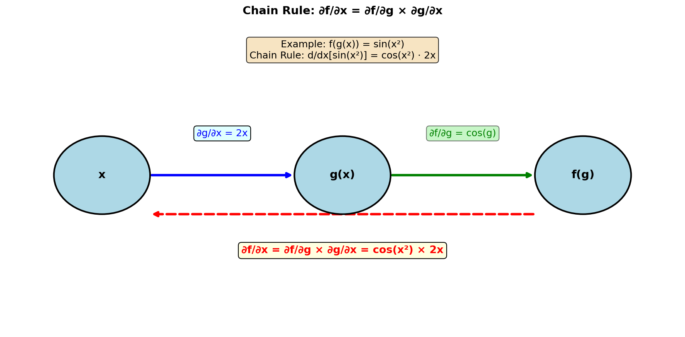
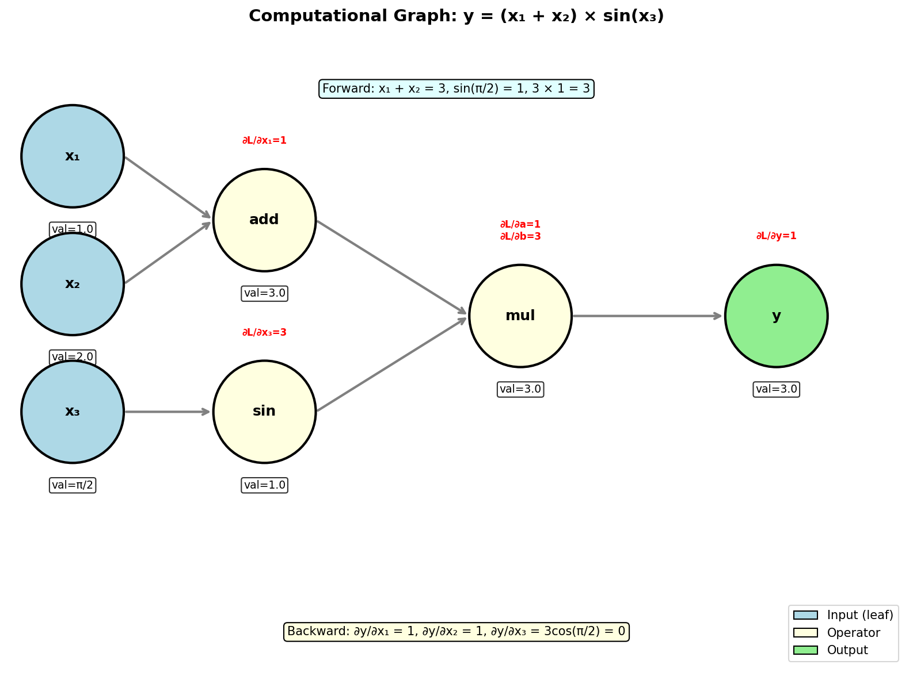
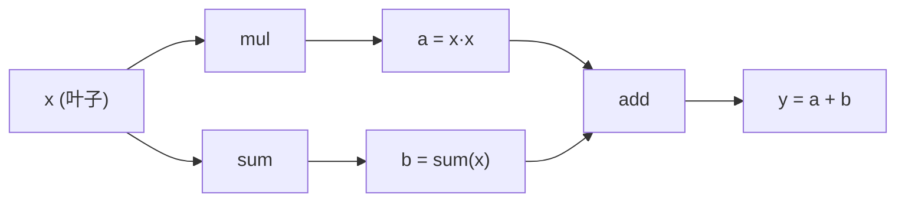
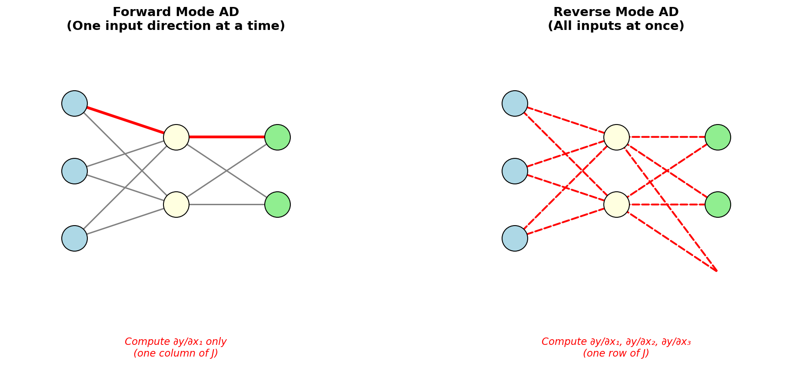

# 7.1 基础概念：计算图与微分模式

> **本节目标**：理解自动微分的数学原理——为什么它比手写导数更可靠，比数值差分更精确。

**直觉理解**：想象你在教一个学生求导。你不会直接告诉他答案，而是教他：
1. 把复杂函数拆成简单的小块
2. 对每个小块分别求导
3. 用链式法则把它们串起来

这就是自动微分的核心思想——**分而治之**。


## 1. 什么是自动微分

自动微分不是数值微分，也不是符号微分——它是**基于链式法则的精确求导**。

### 1.1 三种求导方法的对比

| 方法 | 原理 | 优点 | 缺点 |
|------|------|------|------|
| **符号微分** | 把函数转成数学表达式再求导 | 精确的解析解 | 表达式爆炸（"恶性增长"） |
| **数值差分** | $f'(x) \approx \frac{f(x+h) - f(x)}{h}$ | 实现简单 | 舍入误差、截断误差 |
| **自动微分** | 将函数分解为基本运算，用链式法则逐步求导 | 精确到机器精度、高效 | 需要构建计算图 |

自动微分的核心洞察：**任何可微函数都可以分解为一系列基本运算**（加减乘除、指数对数、三角函数等），链式法则可以逐级应用。

### 1.2 链式法则：自动微分的数学基础

**直觉理解**：链式法则就像"传话游戏"——每个人只负责把消息传给下一个人，最后每个人都知道自己该做什么。

链式法则是微积分中最重要的求导规则。如果 $y = f(g(x))$，则：

$$\frac{dy}{dx} = \frac{dy}{dg} \cdot \frac{dg}{dx}$$

更一般地，对于复合函数 $f(g_1(x), g_2(x), ...)$：

$$\frac{\partial f}{\partial x} = \sum_i \frac{\partial f}{\partial g_i} \cdot \frac{\partial g_i}{\partial x}$$



**例子**：求 $f(x) = \sin(x^2)$ 的导数。

1. 分解：令 $g(x) = x^2$，则 $f(g) = \sin(g)$
2. 分别求导：$\frac{\partial f}{\partial g} = \cos(g)$，$\frac{\partial g}{\partial x} = 2x$
3. 链式组合：$\frac{df}{dx} = \cos(x^2) \cdot 2x$

这就是自动微分的核心思想——**把复杂函数拆成简单运算，逐个求导，再用链式法则组合**。


## 2. 计算图：函数的骨架

**直觉理解**：计算图就像函数的"X光片"——它让你看清函数的内部结构，知道每个部分是怎么连接的。

**计算图**（Computational Graph）是自动微分的核心数据结构。它将复杂函数分解为基本运算节点，每个节点执行一次简单操作（加减乘除、激活函数等），边表示数据流。



上图展示了 $y = (x_1 + x_2) \times \sin(x_3)$ 的计算图。每个圆圈是一个运算节点，箭头表示数据流动方向。

在 YiShape-Math 中，每个可微节点（`IDiffVector` / `IDiffMatrix`）都是计算图中的一个节点。当你写：

```java
IDiffVector x = AD.vector(1.0, 2.0);
IDiffVector y = x.mul(x).add(x.sum());
```

系统会构建如下计算图：




## 3. 前向传播 vs 反向传播

**直觉理解**：
- **前向传播**：从原料到产品——把原材料加工成最终产品
- **反向传播**：从结果追溯原因——产品出问题了，倒着查是哪个环节出的错

### 3.1 前向传播（Forward Pass）

从叶子节点（输入）出发，逐层计算每个节点的值，直到根节点（输出）。这就是「把 x 代入函数，算出 y」。

```java
IDiffVector x = AD.vector(1.0, 2.0, 3.0);
IDiffVector y = x.mul(x).sum();   // 前向：y = 1² + 2² + 3² = 14
System.out.println(y.getValue()); // 输出：14.0
```

### 3.2 反向传播（Backward Pass）

**直觉理解**：反向传播就像"多米诺骨牌"——从最后一个开始，一个接一个地倒下，每个骨牌都知道自己应该倒向哪个方向。

从根节点出发，沿计算图逆向遍历，用链式法则逐级计算梯度，直到叶子节点。

$$\frac{\partial f}{\partial x_i} = \sum_{j} \frac{\partial f}{\partial n_j} \cdot \frac{\partial n_j}{\partial x_i}$$

```java
y.backward();  // 反向传播
// x.getGradient() = [2.0, 4.0, 6.0]  (即 2x)
```

### 3.3 前向 vs 反向对比



| 特性 | 前向模式（Forward） | 反向模式（Reverse） |
|------|---------------------|---------------------|
| **传播方向** | 输入 → 输出 | 输出 → 输入 |
| **一次计算** | 一个输入方向的导数 | 所有输入的导数 |
| **时间复杂度** | O(输入维度) × 前向 | O(输出维度) × 前向 |
| **空间复杂度** | O(1) 额外空间 | O(节点数) 存储图 |
| **适用场景** | 输入少、输出多（Jacobian 按列） | 输出少、输入多（Jacobian 按行） |

**关键结论**：深度学习中，损失函数输出一个标量（输出维度=1），但参数可能有数百万个（输入维度极大）。因此**反向模式 AD 是神经网络训练的唯一选择**——一次反向传播就能得到所有参数的梯度。


## 4. 自动微分的历史

自动微分的发展历程：


- **1964年**：Seinnhausen 首次提出自动微分的概念
- **1970年**：Wengert 实现了简单的正向模式 AD
- **1980年**：Speelpenning 发表了快速 Jacobian 计算方法
- **1986年**：Rumelhart 等人将反向传播应用于神经网络训练，奠定了深度学习基础
- **2015年**：PyTorch/TensorFlow 将 AD 集成到深度学习框架
- **2018年**：JAX 提出了可组合的 AD 变换


## 5. YiShape-Math 的计算图实现

YiShape-Math 使用**隐式计算图**——不维护显式的 Tape/TapeNode 类，而是通过对象引用网络自然形成 DAG：

```java
// RereDiffVector 的核心字段
class RereDiffVector {
    IDoubleVector value;              // 前向传播值
    IDoubleVector gradient;           // 反向传播后累积梯度
    List<RereDiffVector> inputs;      // 父节点列表
    Consumer<IDoubleVector> backwardFn; // 闭包形式的反向函数
    boolean isLeaf;                   // 是否为叶子节点
    String opTag;                     // 算子标签（调试用）
}
```

**拓扑排序**是反向传播的基础：`RereDiffVector.buildTopo()` 从输出节点出发，逆向遍历所有依赖，确保梯度按正确顺序累积。


## 6. 叶子节点 vs 算子节点

计算图中有两类节点：

| 节点类型 | 特征 | 梯度含义 |
|---------|------|---------|
| **叶子节点** | `isLeaf = true`，用户通过 `AD.vector()` 创建 | 需要计算的导数目标 |
| **算子节点** | `isLeaf = false`，由 `add()`/`mul()` 等操作产生 | 中间变量，梯度用于链式传递 |

```java
IDiffVector x = AD.vector(1.0, 2.0);  // 叶子节点
IDiffVector y = x.mul(x);              // 算子节点（x*x）
IDiffVector z = y.sum();               // 算子节点（求和）

z.backward();
// x.getGradient() → [2.0, 4.0]  ← 叶子节点有梯度
// y.getGradient() → [1.0, 1.0]  ← 算子节点也有梯度（但通常不关心）
```


## 7. 为什么不用数值差分

数值差分（中心差分）的公式：

$$f'(x) \approx \frac{f(x + h) - f(x - h)}{2h}$$

看起来简单，但有三个致命问题：

1. **舍入误差**：$h$ 太小，浮点精度不够；$h$ 太大，截断误差太大
2. **效率**：$n$ 维输入需要 $2n$ 次前向传播，而反向模式只需 1 次
3. **不精确**：结果是近似值，不是机器精度的精确解

YiShape-Math 提供了 `AD.checkGradient()` 用于对比验证——它用数值差分作为参考，验证自动微分的正确性：

```java
Function<IDiffVector, IDiffVector> lossFn = x -> x.mul(x).sum();
IDiffVector x = AD.vector(1.0, 2.0, 3.0);
boolean ok = AD.checkGradient(lossFn, x, 1e-5);  // 通过 ✓
```


## 8. 本节小结

| 概念 | 一句话说明 |
|------|-----------|
| 计算图 | 函数分解为基本运算节点的有向无环图 |
| 前向传播 | 输入 → 输出，计算函数值 |
| 反向传播 | 输出 → 输入，计算梯度 |
| 前向模式 | 一次计算一个输入方向的导数 |
| 反向模式 | 一次计算所有输入的导数（标量输出场景） |
| 叶子节点 | 用户创建的可微变量，是梯度的目标 |


## 练习

1. **手动推导**：对 $f(x,y) = (x+y)^2$，画出计算图，分别用前向模式和反向模式推导 $\frac{\partial f}{\partial x}$ 和 $\frac{\partial f}{\partial y}$。

2. **数值对比**：对 $f(x) = e^{\sin(x)}$，分别用中心差分（$h=10^{-5}$）和自动微分计算 $f'(\pi/4)$，比较结果差异。

3. **思考题**：如果一个函数有 3 个输入、100 个输出，前向模式和反向模式哪个更高效？为什么？

---

**下一节预告**：我们将学习反向模式AD的核心API——`backward()`。你将亲手实现梯度计算，感受"让计算机帮你求导"的快感！

[← 导航](introduction.md) ｜ [下一节：反向模式 AD →](7.2.%20Reverse%20mode%20AD.md)
