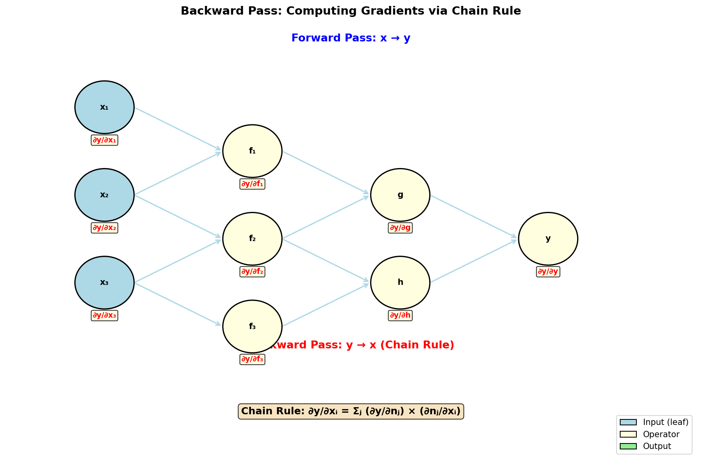
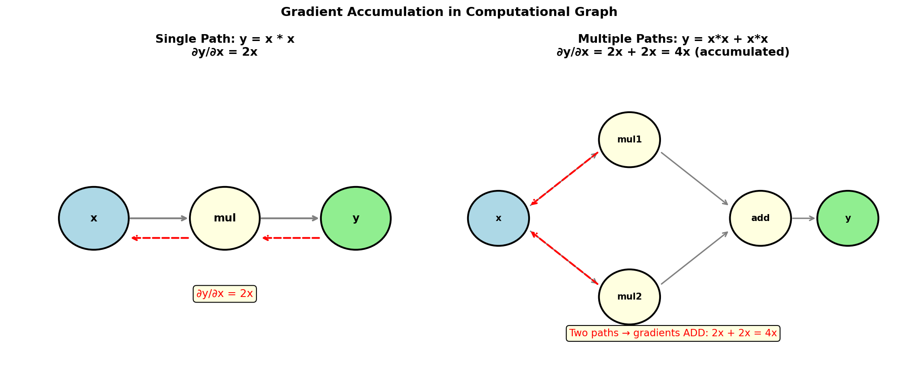
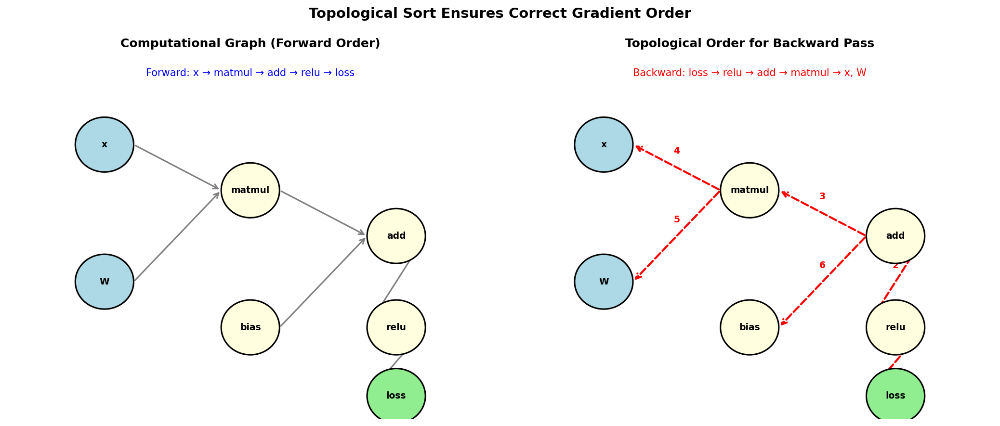

# 7.2 反向模式 AD：backward() 的魔法

> **本节目标**：掌握反向模式 AD 的完整用法——从创建可微变量到获取梯度，理解梯度累积机制。


## 0. 5分钟上手：你的第一个自动微分程序

在深入理论之前，先跑一个最简单的例子，感受一下AD的魔力：

```java
import com.yishape.lab.math.autodiff.*;
import com.yishape.lab.math.linalg.*;

public class QuickStart {
    public static void main(String[] args) {
        // 1. 创建可微变量
        IDiffVector x = AD.vector(3.0, 4.0);

        // 2. 构建计算图：y = x₁² + x₂²
        IDiffVector y = x.pow(2).sum();

        // 3. 打印前向值
        System.out.println("y = " + y.getValue());  // 25.0

        // 4. 反向传播
        y.backward();

        // 5. 获取梯度
        System.out.println("dy/dx = " + x.getGradient());  // [6.0, 8.0]

        // 6. 验证：∂y/∂x₁ = 2x₁ = 6, ∂y/∂x₂ = 2x₂ = 8
    }
}
```

运行结果：
```
y = 25.0
dy/dx = [6.0, 8.0]
```

**就这么简单！** 3行代码搞定梯度计算。

现在你已经知道AD怎么用了，接下来我们深入理解它的工作原理。


## 1. 创建可微变量

所有自动微分的起点是 `AD` 工厂类。它提供多种创建可微变量的方法：

### 向量

```java
// 从原始数组创建
IDiffVector x = AD.vector(1.0, 2.0, 3.0);

// 从已有向量创建（复制数据）
IVector v = Linalg.vector(1.0, 2.0, 3.0);
IDiffVector x = AD.vector(v);

// 标量（单元素向量）
IDiffVector s = AD.vector(3.14);

// 快捷工厂
IDiffVector zeros = AD.zeros(5);    // 全零
IDiffVector ones  = AD.ones(5);     // 全一
```

### 矩阵

```java
// 从二维数组创建
IDiffMatrix W = AD.matrix(new double[][]{
    {0.1, 0.2, 0.3},
    {0.4, 0.5, 0.6}
});

// 从已有矩阵创建
IDoubleMatrix M = Linalg.matrix(new double[][]{{1,2},{3,4}});
IDiffMatrix W = AD.matrix(M);

// 快捷工厂
IDiffMatrix zeros = AD.matrixZeros(3, 3);
IDiffMatrix ones  = AD.matrixOnes(3, 3);
```

### 混合精度

```java
// FP32 前向值 + FP64 梯度累加（节省显存，保持梯度精度）
float[] data = {1.0f, 2.0f, 3.0f};
IDiffVector x = AD.diffFloat(data);
```


## 2. 构建计算图

可微变量支持所有数学运算，每次运算都会在计算图中添加一个新节点：

```java
IDiffVector x = AD.vector(1.0, 2.0, 3.0);
IDiffVector y = AD.vector(4.0, 5.0, 6.0);

// 逐元素运算
IDiffVector z = x.add(y);           // z = [5, 7, 9]
IDiffVector w = x.mul(y);           // w = [4, 10, 18]

// 标量运算
IDiffVector a = x.mul(2.0);         // a = [2, 4, 6]
IDiffVector b = x.add(1.0);         // b = [2, 3, 4]

// 归约运算
IDiffVector s = x.sum();            // s = 6（标量）
IDiffVector m = x.mean();           // m = 2

// 点积
IDiffVector d = x.dot(y);           // d = 32
```

### 完整的运算符列表

**双变量运算**：`add`、`sub`、`mul`、`div`

**标量运算**：`add(s)`、`sub(s)`、`mul(s)`、`div(s)`、`rsub(s)`、`rdiv(s)`

**一元运算**：`neg()`、`pow(n)`、`exp()`、`log()`、`sin()`、`cos()`、`tan()`、`sqrt()`、`abs()`、`square()`

**激活函数**：`sigmoid()`、`tanh()`、`relu()`、`softmax()`、`logSoftmax()`、`gelu()`、`leakyRelu(alpha)`、`elu(alpha)`、`selu()`、`silu()`、`mish()`、`softplus(beta)`、`hardtanh(min,max)`、`clamp(min,max)`

**归约**：`sum()`、`mean()`

**向量操作**：`dot(other)`、`broadcast(n)`、`slice(start,end)`


## 3. 反向传播

构建完计算图后，调用 `backward()` 启动反向传播：



```java
IDiffVector x = AD.vector(1.0, 2.0, 3.0);

// 计算 y = x^2 的和
IDiffVector y = x.pow(2).sum();    // y = 1² + 2² + 3² = 14

// 反向传播
y.backward();

// 获取梯度：dy/dx = 2x = [2, 4, 6]
IVector grad = x.getGradient();
System.out.println(grad);  // [2.0, 4.0, 6.0]
```

### 自定义上游梯度

默认情况下，`backward()` 使用单位梯度（$\frac{\partial L}{\partial y} = 1$）。有时你需要指定上游梯度：

```java
IDiffVector x = AD.vector(1.0, 2.0, 3.0);
IDiffVector y = x.pow(2).sum();

// 指定上游梯度为 2（相当于计算 2·∂y/∂x）
IDoubleVector upstreamGradient = Linalg.vector(2.0, 2.0, 2.0);
y.backward(upstreamGradient);

// x.getGradient() = [4.0, 8.0, 12.0]  （= 2 × 2x）
```


## 4. 梯度累积机制

反向传播使用**累加**而非覆盖——如果多个路径共享同一个叶子节点，梯度会自动求和：



```java
IDiffVector x = AD.vector(2.0);

// y = x*x + x*x  （两条路径都经过 x）
IDiffVector a = x.mul(x);   // a = x²
IDiffVector b = x.mul(x);   // b = x²
IDiffVector y = a.add(b);   // y = 2x²

y.backward();
// x.getGradient() = [8.0]  （∂(x²)/∂x + ∂(x²)/∂x = 2x + 2x = 4x = 8）
```

**为什么梯度是累加的？**

根据多元微积分的链式法则，如果一个变量 $x$ 通过多条路径影响输出 $y$，则总梯度是各路径梯度之和：

$$\frac{\partial y}{\partial x} = \sum_{\text{paths}} \frac{\partial y}{\partial x}\bigg|_{\text{path}}$$

### zeroGradient()：清除累积梯度

在重新计算前，需要清除旧梯度：

```java
IDiffVector x = AD.vector(1.0, 2.0);
IDiffVector y = x.pow(2).sum();
y.backward();
System.out.println(x.getGradient());  // [2.0, 4.0]

// 清除梯度
x.zeroGradient();
y.zeroGradient();
System.out.println(x.getGradient());  // null
```


## 5. 拓扑排序：反向传播的基础

反向传播必须按照正确的顺序计算梯度——这就是**拓扑排序**的作用。



**为什么需要拓扑排序？**

考虑计算图：$x \rightarrow \text{matmul}(W) \rightarrow \text{add}(b) \rightarrow \text{relu} \rightarrow \text{loss}$

反向传播必须从 loss 开始，依次计算：
1. $\frac{\partial \text{loss}}{\partial \text{relu}}$
2. $\frac{\partial \text{loss}}{\partial \text{add}} = \frac{\partial \text{loss}}{\partial \text{relu}} \cdot \frac{\partial \text{relu}}{\partial \text{add}}$
3. $\frac{\partial \text{loss}}{\partial \text{matmul}} = \frac{\partial \text{loss}}{\partial \text{add}} \cdot \frac{\partial \text{add}}{\partial \text{matmul}}$
4. $\frac{\partial \text{loss}}{\partial x} = \frac{\partial \text{loss}}{\partial \text{matmul}} \cdot \frac{\partial \text{matmul}}{\partial x}$

如果顺序错了（比如先算 $\frac{\partial \text{loss}}{\partial x}$），中间结果还没算出来，就会出错。


## 6. 矩阵的自动微分

矩阵运算同样支持自动微分：

```java
IDiffMatrix X = AD.matrix(new double[][]{{1, 2}, {3, 4}});
IDiffMatrix W = AD.matrix(new double[][]{{0.1, 0.2}, {0.3, 0.4}});

// 矩阵乘法
IDiffMatrix Y = X.matmul(W);       // Y = XW

// 逐元素运算
IDiffMatrix Z = X.add(W);          // Z = X + W
IDiffMatrix S = X.mul(2.0);        // S = 2X

// 归约
IDiffVector total = Y.sum();        // 所有元素之和
IDiffVector rowSum = Y.sum(0);      // 按列求和（axis=0）
IDiffVector colMean = Y.mean(1);    // 按行求均值（axis=1）

// Softmax 交叉熵融合
IDiffMatrix labels = AD.matrix(new double[][]{{1,0},{0,1}});
IDiffVector ce = Y.softmaxCrossEntropy(labels);

ce.backward();
IVector gradW = W.getGradient();
System.out.println(gradW);  // W 的梯度
```


## 7. 多输出场景

如果函数有多个输出（向量值函数），需要用自定义上游梯度：

```java
IDiffVector x = AD.vector(1.0, 2.0, 3.0);

// y = [x₁², x₂², x₃²]
IDiffVector y = x.pow(2);

// 指定上游梯度（例如 [1, 0, 0] 只关注第一个分量）
IDoubleVector upstream = Linalg.vector(1.0, 0.0, 0.0);
y.backward(upstream);

// x.getGradient() = [2.0, 0.0, 0.0]
```


## 8. 实战：线性回归的梯度

用自动微分实现线性回归的损失函数和梯度计算：

```java
// 模型参数（叶子节点，需要训练）
IDiffVector w = AD.zeros(2);
IDiffVector b = AD.vector(0.0);

// 训练数据
double[][] X = {{1, 2}, {3, 4}, {5, 6}};
double[] yTrue = {3, 7, 11};  // y = 2x₁ + x₂

// 损失函数
Function<IDiffVector, IDiffVector> lossFn = params -> {
    IDiffVector wCur = params.slice(0, 2);
    IDiffVector bCur = params.slice(2, 3);

    IDiffVector loss = AD.vector(0.0);
    for (int i = 0; i < X.length; i++) {
        IDiffVector xi = AD.vector(X[i]);
        IDiffVector pred = xi.dot(wCur).add(bCur);
        IDiffVector err = pred.sub(AD.vector(yTrue[i]));
        loss = loss.add(err.mul(err));
    }
    return loss.div(AD.vector(X.length));
};

// 组合参数
IDiffVector params = AD.concat(w, b);

// 计算损失和梯度
IDiffVector loss = lossFn.apply(params);
loss.backward();
IVector gradW = w.getGradient();  // ∂loss/∂w
IVector gradB = b.getGradient();  // ∂loss/∂b

System.out.println("w 梯度: " + gradW);
System.out.println("b 梯度: " + gradB);
```


## 9. 常见陷阱与调试技巧

### 陷阱 1：忘记 backward()

```java
IDiffVector x = AD.vector(1.0, 2.0);
IDiffVector y = x.pow(2).sum();
// y.backward();  ← 忘记调用！
System.out.println(x.getGradient());  // null，不是 [2, 4]
```

**症状**：`getGradient()` 返回 `null`

**解决方案**：确保在获取梯度前调用 `backward()`

### 陷阱 2：重复使用计算图

```java
IDiffVector x = AD.vector(1.0, 2.0);
IDiffVector y1 = x.mul(2.0);
y1.backward();
System.out.println(x.getGradient());  // [2, 2]

// 错误：在同一个图上再次 backward
IDiffVector y2 = x.mul(3.0);
y2.backward();
// x.getGradient() 现在是 [5, 5]（2+3），不是 [6, 6]
// 因为梯度是累加的！
```

**症状**：梯度比预期大（累加了旧梯度）

**解决方案**：
```java
// 方案1：清除梯度
x.zeroGradient();
y1.zeroGradient();

// 方案2：重新构建计算图（推荐用于训练循环）
IDiffVector x_new = AD.vector(1.0, 2.0);
IDiffVector y2 = x_new.mul(3.0);
```

### 陷阱 3：梯度为零

```java
IDiffVector x = AD.vector(1.0, 2.0);
IDiffVector y = x.relu();  // ReLU：max(0, x)
y.backward();
System.out.println(x.getGradient());  // [1.0, 1.0]
// 但如果 x = [-1, 2]，梯度是 [0, 1]
```

**症状**：某些分量的梯度为0

**原因**：ReLU在负区间梯度为0（死亡神经元问题）

**解决方案**：使用LeakyReLU或ELU代替ReLU

### 陷阱 4：梯度消失/爆炸

```java
IDiffVector x = AD.vector(1.0);
IDiffVector y = x;
for (int i = 0; i < 20; i++) {
    y = y.sigmoid();  // sigmoid将值压缩到(0,1)
}
y.backward();
System.out.println(x.getGradient());  // 接近0（梯度消失）
```

**症状**：深层网络梯度接近0或非常大

**解决方案**：
- 使用ReLU代替sigmoid/tanh
- 使用残差连接（ResNet）
- 使用梯度裁剪（gradient clipping）

### 调试技巧

**技巧1：打印计算图**
```java
IDiffVector x = AD.vector(1.0, 2.0);
IDiffVector y = x.pow(2).sum();
String dot = AD.render(y);
System.out.println(dot);  // 输出Graphviz格式，可以可视化
```

**技巧2：数值梯度校验**
```java
// 比较自动微分和数值差分的结果
boolean ok = AD.checkGradient(lossFn, x, 1e-5);
if (!ok) {
    System.out.println("梯度校验失败！检查计算图构建");
}
```

**技巧3：检查梯度值**
```java
IDiffVector loss = ...;
loss.backward();
IVector grad = x.getGradient();

// 检查梯度是否合理
if (grad == null) {
    System.out.println("错误：梯度为null");
} else if (grad.anyMatch(Double::isNaN)) {
    System.out.println("错误：梯度包含NaN");
} else if (grad.anyMatch(g -> Math.abs(g) > 1e6)) {
    System.out.println("警告：梯度可能爆炸");
}
```


## 10. 本节小结

| API | 用途 |
|-----|------|
| `AD.vector()` / `AD.matrix()` | 创建可微叶子节点 |
| `AD.zeros()` / `AD.ones()` | 快捷工厂 |
| `.backward()` | 反向传播，计算所有叶子的梯度 |
| `.getGradient()` | 获取累积梯度 |
| `.zeroGradient()` | 清除旧梯度 |
| `.getValue()` | 获取前向传播值 |


## 练习

1. **基础练习**：创建可微向量 $x = [1, 2, 3]$，计算 $y = \sin(x) \cdot x^2$，求 $\frac{\partial y}{\partial x}$，手动验证结果。

2. **矩阵练习**：创建 $2 \times 2$ 可微矩阵 $X$ 和 $W$，计算 $L = \|XW - Y\|_F^2$（Frobenius 范数），求 $\frac{\partial L}{\partial W}$。

3. **思考题**：如果 $y = x_1 \cdot x_2$，$x_1 = x_2 = 2$，手动推导 $\frac{\partial y}{\partial x_1}$。然后用代码验证，解释为什么梯度是累加的。

---
[← 基础概念](7.1.%20Basic%20concepts.md) ｜ [下一节：正向模式 AD →](7.3.%20Forward%20mode%20AD.md)
