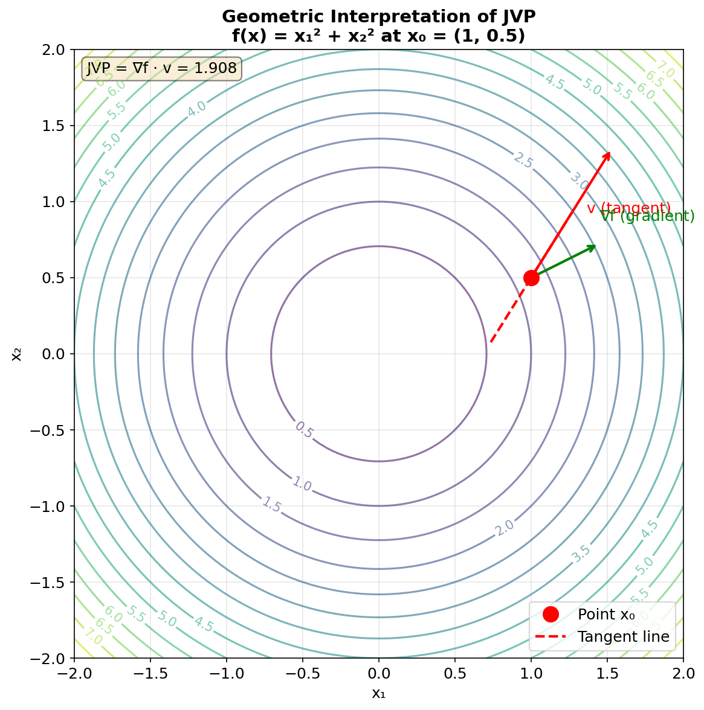
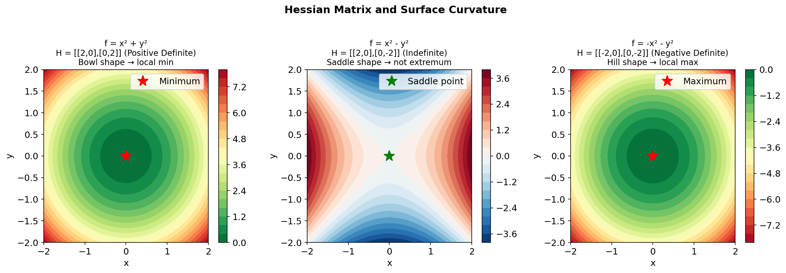

# 7.3 正向模式 AD：tangent() 与 jacobian()

> **本节目标**：理解正向模式 AD 的原理和用法——什么时候它比反向模式更合适。


## 1. 正向模式的原理

反向模式 AD 从输出反向传播梯度。正向模式 AD 则相反：**从输入正向传播「切向量」（tangent vector）**，同时计算函数值和方向导数。

数学上，正向模式计算的是**Jacobian-向量积**（JVP）：

$$J \cdot v = \frac{d}{dt} f(x + t \cdot v) \Big|_{t=0}$$

其中 $J$ 是 Jacobian 矩阵，$v$ 是方向向量。

### 1.1 JVP 的几何意义

JVP 有一个直观的几何解释：**它告诉你沿着某个方向移动时，函数值变化有多快**。



- **蓝色等高线**：函数 $f(x) = x_1^2 + x_2^2$ 的等高线（圆形）
- **红色箭头**：方向向量 $v$（我们想探测的方向）
- **绿色箭头**：梯度 $\nabla f$（函数增长最快的方向）
- **JVP**：$\nabla f \cdot v$，即梯度在方向 $v$ 上的投影

**直观理解**：如果你站在山上（点 $x_0$），想往某个方向 $v$ 走，JVP 告诉你坡度是多陡。


## 2. tangent()：播种正向模式

`AD.tangent()` 将一个原始变量和一个切向量「播种」在一起，创建正向模式 AD 包装器：

```java
IDiffVector x = AD.vector(1.0, 2.0, 3.0);
IDiffVector tangent = AD.vector(1.0, 0.0, 0.0);  // 沿 x₁ 方向

// 播种正向模式
IDiffVector tx = AD.tangent(x, tangent);

// 正常运算——同时传播原始值和切向量
IDiffVector y = tx.mul(tx).sum();  // y = x₁² + x₂² + x₃²

// 获取结果
System.out.println(y.getValue());   // 14.0 （原始值：1²+2²+3²）
// tangent 是 ∂y/∂x₁ = 2x₁ = 2
```

### JVP 的含义

切向量 $v = [1, 0, 0]$ 表示「沿 $x_1$ 方向的微小扰动」。JVP 返回的就是这个方向的方向导数：

$$J \cdot [1, 0, 0]^T = \frac{\partial y}{\partial x_1}$$

如果想同时求所有方向的导数，需要逐列计算——这就是 `jacobian()` 的工作。


## 3. jacobian()：完整 Jacobian 矩阵

`AD.jacobian()` 对每个输入维度分别做正向模式 AD，拼接出完整的 Jacobian 矩阵：

```java
// 向量值函数：R² → R²
Function<IDiffVector, IDiffVector> fn = x -> {
    IDiffVector x1 = x.slice(0, 1);
    IDiffVector x2 = x.slice(1, 2);
    IDiffVector y1 = x1.mul(x1).add(x2.mul(x2));  // y₁ = x₁² + x₂²
    IDiffVector y2 = x1.mul(x2);                    // y₂ = x₁·x₂
    return Linalg.vector(y1, y2).flatten();
};

IDiffVector x = AD.vector(1.0, 2.0);
IDoubleMatrix J = AD.jacobian(fn, x);

// J = [[2x₁, 2x₂],    =  [[2, 4],
//      [x₂,   x₁ ]]       [2, 1]]
System.out.println(J);
```

### 复杂度

对 $n$ 维输入，`jacobian()` 需要 $n$ 次正向传播——当 $n$ 很大时，这比反向模式（1 次反向传播）慢得多。因此：

| 场景 | 推荐模式 |
|------|---------|
| 标量输出（损失函数） | 反向模式 |
| 少量输入、多输出 | 正向模式 |
| 完整 Jacobian（$n < 100$） | `AD.jacobian()` |
| 完整 Hessian（$n < 100$） | `MixedMode.hessian()` |


## 4. MixedMode：Forward-over-Reverse

`MixedMode` 类结合正向和反向模式，用于高效计算**向量-Jacobian 积**和**Hessian-向量积**：

### JVP（Jacobian-向量积）

```java
// 标量损失函数
Function<IDiffVector, IDiffVector> fn = x -> x.pow(3).sum();

IDiffVector x = AD.vector(1.0, 2.0, 3.0);
IDoubleVector v = Linalg.vector(1.0, 1.0, 1.0);

// JVP = J @ v
double[] jvp = MixedMode.jvp(fn, x, v);
System.out.println(Linalg.vector(jvp));
// [3, 12, 27]  （∂(x³)/∂x = 3x²，乘以 v=[1,1,1]）
```

### VJP（Vector-Jacobian 积）

```java
// VJP = J^T @ g（反向模式的推广）
IDoubleVector upstreamGradient = Linalg.vector(1.0, 1.0, 1.0);
double[] vjp = MixedMode.vjp(fn, x, upstreamGradient);
// 同样得到 [3, 12, 27]（标量函数时 JVP = VJP）
```

### HVP（Hessian-向量积）

HVP 是二阶导数的核心工具——无需构造完整 Hessian 矩阵，就能计算 $H \cdot v$：

```java
// 损失函数
Function<IDiffVector, IDiffVector> lossFn = x -> x.pow(4).sum();

IDiffVector x = AD.vector(1.0, 2.0, 3.0);
IDoubleVector v = Linalg.vector(1.0, 1.0, 1.0);

// HVP = H @ v
double[] hvp = MixedMode.hvp(lossFn, x, v);
// [12, 48, 108]  （∂²(x⁴)/∂x² = 12x²）
```


## 5. 完整 Hessian 矩阵

`MixedMode.hessian()` 通过 $n$ 次 HVP 调用构造完整 Hessian：

```java
Function<IDiffVector, IDiffVector> lossFn = x -> {
    IDiffVector x1 = x.slice(0, 1);
    IDiffVector x2 = x.slice(1, 2);
    return x1.mul(x1).add(x2.mul(x2.mul(2.0)));  // f = x₁² + 2x₂²
};

IDiffVector x = AD.vector(1.0, 1.0);
IDoubleMatrix H = MixedMode.hessian(lossFn, x);

// H = [[2, 0],
//      [0, 4]]
System.out.println(H);
```



> **性能警告**：`hessian()` 需要 $n$ 次 HVP 调用，每次 HVP 内部又需要一次完整的反向传播。因此**仅适用于 $n < 100$ 的小规模问题**。大规模 Hessian 近似请使用 L-BFGS 或有限内存方法。


## 6. 正向模式 vs 反向模式：选择指南

| 维度 | 反向模式（`backward()`） | 正向模式（`tangent()`） |
|------|------------------------|------------------------|
| **输入维度** | 大（数百万参数） | 小（< 100） |
| **输出维度** | 1（标量损失） | 大（向量值函数） |
| **空间** | O(节点数) 存储图 | O(1) 额外空间 |
| **时间** | O(前向) × 1 | O(前向) × 输入维度 |
| **典型场景** | 神经网络训练 | 小规模 Jacobian、JVP/HVP |


## 7. 实战：用 JVP 计算方向导数

```java
// 验证正向模式计算的方向导数
Function<IDiffVector, IDiffVector> fn = x -> {
    IDiffVector x1 = x.slice(0, 1);
    IDiffVector x2 = x.slice(1, 2);
    return x1.sin().mul(x2.cos());
};

IDiffVector x = AD.vector(1.0, 1.0);
IDoubleVector v = Linalg.vector(1.0, 0.0);  // 沿 x₁ 方向

double[] jvp = MixedMode.jvp(fn, x, v);

// 手动验证：∂(sin(x₁)cos(x₂))/∂x₁ = cos(x₁)cos(x₂) = cos(1)cos(1) ≈ 0.2919
System.out.println("JVP: " + jvp[0]);
System.out.println("cos(1)cos(1) = " + (Math.cos(1) * Math.cos(1)));
```


## 8. 本节小结

| API | 用途 |
|-----|------|
| `AD.tangent(primal, tangent)` | 播种正向模式 AD，计算 JVP |
| `AD.jacobian(fn, x)` | 完整 Jacobian 矩阵（n 次正向） |
| `MixedMode.jvp(fn, x, v)` | Jacobian-向量积（一次正向） |
| `MixedMode.vjp(fn, x, g)` | Vector-Jacobian 积（一次反向） |
| `MixedMode.hvp(fn, x, v)` | Hessian-向量积（tape-of-tape） |
| `MixedMode.hessian(fn, x)` | 完整 Hessian（n 次 HVP） |
| `MixedMode.jacobianFull(fn, x)` | 完整 Jacobian（n 次 JVP） |


## 练习

1. **JVP 练习**：对 $f(x_1, x_2) = x_1 \cdot e^{x_2}$，用 `MixedMode.jvp()` 计算沿 $v = [1, 1]$ 方向的方向导数，手动验证。

2. **HVP 练习**：对 $f(x) = x^T x$（$x \in \mathbb{R}^3$），用 `MixedMode.hvp()` 计算 $H \cdot [1, 0, 0]^T$，手动验证结果应该是 $[2, 0, 0]^T$。

3. **思考题**：为什么 HVP 比直接计算完整 Hessian 更高效？在什么情况下你需要完整 Hessian？

---
[← 反向模式 AD](7.2.%20Reverse%20mode%20AD.md) ｜ [下一节：高阶导数与混合模式 →](7.4.%20Higher%20order%20derivatives.md)
