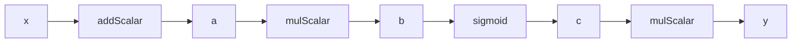
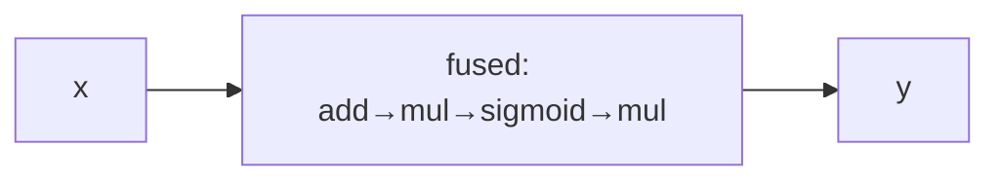

# 7.6 算子融合与图优化

> **本节目标**：掌握算子融合和图优化技术——减少中间节点、加速逐元素运算链。


## 1. 为什么需要算子融合

考虑一个典型的激活函数链：

```java
IDiffVector x = AD.vector(1.0, 2.0, 3.0);
IDiffVector y = x.add(1.0).mul(2.0).sigmoid().mul(3.0);
```

不融合时，计算图有 4 个中间节点：



每个节点都需要：
- 分配内存存储前向值
- 分配内存存储梯度
- 反向传播时遍历一次

融合后，只有一个节点：



**收益**：
- 内存分配减少 75%
- 缓存命中率提升（连续访问同一数组）
- 反向传播遍历减少 75%


## 2. AD.fuse()：手动算子融合

`AD.fuse()` 返回一个 Builder，支持链式调用构建融合算子链：

```java
IDiffVector x = AD.vector(-1.0, 0.0, 1.0, 2.0);

// 不融合：4 个中间节点
IDiffVector y1 = x.add(1.0).mul(2.0).sigmoid().mul(3.0);

// 融合：1 个节点
IDiffVector y2 = AD.fuse(x)
    .add(1.0)
    .mul(2.0)
    .sigmoid()
    .mul(3.0)
    .compute();  // 必须以 .compute() 结尾

// 结果相同
System.out.println(y1.getValue());  // [2.142, 1.5, 2.689, 2.891]
System.out.println(y2.getValue());  // [2.142, 1.5, 2.689, 2.891]
```

### 支持的融合运算

**一元**：`exp()`、`log()`、`sqrt()`、`square()`、`sigmoid()`、`tanh()`、`relu()`、`abs()`、`neg()`、`pow(n)`、`selu()`、`silu()`、`mish()`

**标量**：`add(s)`、`sub(s)`、`mul(s)`、`div(s)`、`rsub(s)`、`rdiv(s)`、`clamp(min,max)`、`leakyRelu(alpha)`、`elu(alpha)`、`softplus(beta)`、`hardtanh(min,max)`

**双变量**：`add(v)`、`sub(v)`、`mul(v)`、`div(v)`

### 矩阵融合

```java
IDiffMatrix X = AD.matrix(new double[][]{{1, 2}, {3, 4}});
IDiffMatrix Y = AD.fuseMatrix(X)
    .add(1.0)
    .mul(2.0)
    .sigmoid()
    .compute();
```


## 3. AD.elementwise()：自动融合

`AD.elementwise()` 自动尝试融合传入的 lambda 中的逐元素运算：

```java
IDiffVector x = AD.vector(1.0, 2.0, 3.0);

// 自动融合：系统检测到 add→mul→sigmoid 链可融合
IDiffVector y = AD.elementwise(x, v -> v.add(1.0).mul(2.0).sigmoid());

// 如果 lambda 包含不可融合的运算（如 sum），自动回退
IDiffVector z = AD.elementwise(x, v -> v.add(1.0).sum());
// 回退为逐算子求值
```

### 不可融合的运算

以下运算会触发自动回退（它们改变了向量的形状或需要全局信息）：

`sum()`、`dot()`、`softmax()`、`sin()`、`cos()`、`tan()`、`gelu()`、`layerNorm()`、`dropout()`、`slice()`


## 4. 图优化：常量折叠

`AD.optimize()` 对计算图进行常量折叠优化：

```java
IDiffVector x = AD.vector(1.0, 2.0, 3.0);

// 冗余运算：加 0、乘 1、pow(1)
IDiffVector y = x.add(0.0).mul(AD.vector(1.0, 1.0, 1.0)).pow(1.0);

// 图统计（优化前）
GraphOptimizer.GraphStats before = AD.graphStats(y);
System.out.println("优化前: " + before.totalNodes() + " 个节点");

// 优化
IDiffVector optimized = AD.optimize(y);

// 图统计（优化后）
GraphOptimizer.GraphStats after = AD.graphStats(optimized);
System.out.println("优化后: " + after.totalNodes() + " 个节点");
```

### 支持的优化规则

| 模式 | 优化结果 |
|------|---------|
| `x + 0` | `x` |
| `x - 0` | `x` |
| `x * 1` | `x` |
| `x / 1` | `x` |
| `x * 0` | `zeros` |
| `x ^ 1` | `x` |


## 5. 计算图可视化

`AD.render()` 生成 Graphviz DOT 格式的可视化：

```java
IDiffVector x = AD.vector(1.0, 2.0);
IDiffVector y = x.mul(x).add(x.sum());
String dot = AD.render(y);
System.out.println(dot);

// 输出：
// digraph G {
//   node0 [label="leaf\n[2]"] [shape=ellipse] [fillcolor=lightblue];
//   node1 [label="mul\n[2]"] [shape=box] [fillcolor=lightyellow];
//   node2 [label="sum\n[3]"] [shape=box] [fillcolor=lightyellow];
//   node3 [label="add\n[5]"] [shape=box] [fillcolor=lightyellow];
//   node0 -> node1;
//   node0 -> node2;
//   node1 -> node3;
//   node2 -> node3;
// }
```

将输出保存为 `.dot` 文件，用 Graphviz 渲染：

```bash
dot -Tpng graph.dot -o graph.png
```

节点颜色约定：
- **浅蓝色**：叶子节点（可训练参数）
- **浅黄色**：算子节点（中间计算）


## 6. 图统计

`AD.graphStats()` 返回计算图的统计信息：

```java
IDiffVector x = AD.vector(1.0, 2.0, 3.0);
IDiffVector y = AD.fuse(x).add(1.0).mul(2.0).sigmoid().compute();

GraphOptimizer.GraphStats stats = AD.graphStats(y);
System.out.println("总节点数: " + stats.totalNodes());
System.out.println("叶子节点: " + stats.leafNodes());
System.out.println("算子节点: " + stats.nonLeafNodes());
System.out.println("可融合链: " + stats.fusibleChains());
```

**用途**：
- 诊断模型复杂度
- 评估融合效果
- 识别性能瓶颈


## 7. 实战：融合前后的性能对比

```java
int n = 1_000_000;
double[] data = new double[n];
for (int i = 0; i < n; i++) data[i] = i * 0.001;

IDiffVector x = AD.vector(data);

// 不融合
long t1 = System.nanoTime();
for (int iter = 0; iter < 100; iter++) {
    x.zeroGradient();
    IDiffVector y = x.add(1.0).mul(2.0).sigmoid();
    y.backward();
}
long naive = System.nanoTime() - t1;

// 融合
x.zeroGradient();
long t2 = System.nanoTime();
for (int iter = 0; iter < 100; iter++) {
    x.zeroGradient();
    IDiffVector y = AD.fuse(x).add(1.0).mul(2.0).sigmoid().compute();
    y.backward();
}
long fused = System.nanoTime() - t2;

System.out.printf("不融合: %.2f ms%n", naive / 1e6);
System.out.printf("融合:   %.2f ms%n", fused / 1e6);
System.out.printf("加速比: %.2fx%n", (double) naive / fused);
```


## 8. 本节小结

| API | 用途 |
|-----|------|
| `AD.fuse(x)` | 手动算子融合（Builder 模式） |
| `AD.fuseMatrix(X)` | 矩阵版手动融合 |
| `AD.elementwise(x, fn)` | 自动融合（回退安全） |
| `AD.optimize(x)` | 常量折叠优化 |
| `AD.graphStats(x)` | 图统计信息 |
| `AD.render(x)` | Graphviz DOT 可视化 |


## 练习

1. **融合练习**：用 `AD.fuse()` 构建一个 `x → relu → sigmoid → mul(2)` 的融合链，对比 `AD.graphStats()` 优化前后的节点数。

2. **可视化练习**：对 $y = \sin(x) + \cos(x^2)$，用 `AD.render()` 生成计算图，用 Graphviz 渲染。

3. **思考题**：为什么 `sum()` 不能被融合？从计算图的角度解释。

---
[← 自定义算子](7.5.%20Custom%20operations.md) ｜ [下一节：高级功能 →](7.7.%20Advanced%20features.md)
