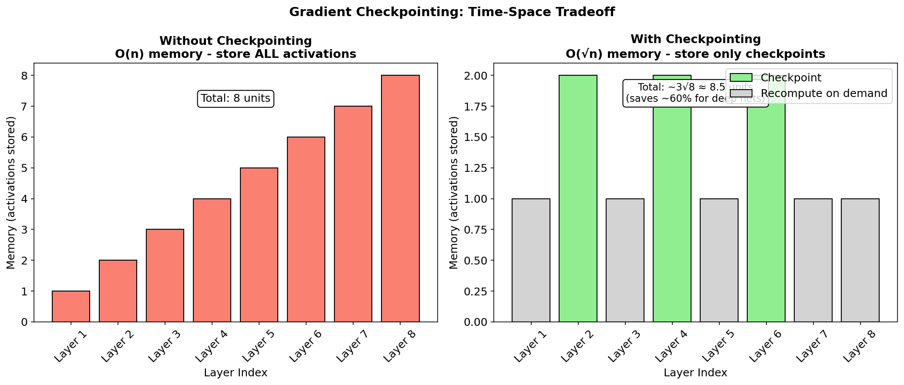
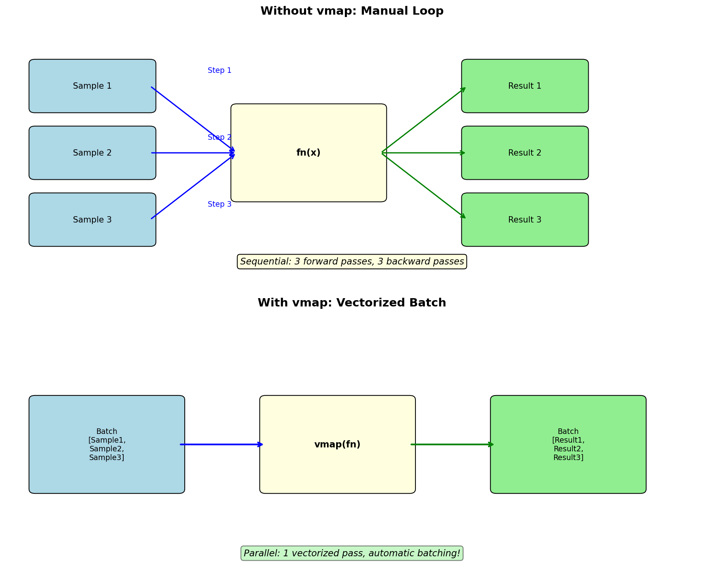

# 7.7 高级功能：检查点、Neural ODE、vmap

> **本节目标**：掌握自动微分的高级工具——梯度检查点节省显存、Neural ODE 求解微分方程、vmap 自动批处理。


## 1. 梯度检查点（Gradient Checkpointing）

深度网络训练中，反向传播需要保存所有中间激活值——显存消耗与网络深度成正比。**梯度检查点**用「时间换空间」：前向只保存关键节点的值，反向时从检查点重新计算中间激活。



### 1.1 为什么需要检查点

在训练深度神经网络时，反向传播需要保存每一层的激活值，以便计算梯度。对于一个有 $L$ 层的网络：

- **内存消耗**：$O(L \times B \times D)$，其中 $B$ 是 batch size，$D$ 是隐藏层维度
- **问题**：当 $L$ 很大时（如 Transformer 有 96 层），显存会耗尽

### 1.2 检查点原理

梯度检查点的核心思想是：**只保存部分层的激活值，其他层在反向传播时重新计算**。

```
前向传播：x → [A] → [B] → [C] → [D] → y
                     ↑              ↑
                   检查点          检查点

反向传播：从 y 出发
  → [D] 反向（从检查点重算 C→D 的前向）
  → [C] 反向（从检查点重算 B→C 的前向）
  → [B] 反向
  → [A] 反向
```

**显存节省**：从 O(n) 降为 O(√n)（每 √n 层设一个检查点）。

### 1.3 YiShape-Math 实现

```java
IDiffVector x = AD.vector(1.0, 2.0, 3.0);

// 不使用检查点：所有中间值保存在内存中
IDiffVector y1 = x.mul(x).add(x.sum()).mul(x);

// 使用检查点：只保存 x 和 y 的值，中间值反向时重算
IDiffVector y2 = AD.checkpoint(v -> v.mul(v).add(v.sum()).mul(v), x);

// 梯度相同
y1.backward();
IVector g1 = x.getGradient().copy();

x.zeroGradient();
y2.backward();
IVector g2 = x.getGradient().copy();

System.out.println("梯度一致: " + g1.equalsApprox(g2, 1e-10));  // true
```

### 1.4 何时使用

| 场景 | 是否需要检查点 |
|------|-------------|
| 小模型（< 1M 参数） | 不需要 |
| 大模型（> 10M 参数） | 推荐 |
| 长序列（Transformer > 1024 层） | 必须 |
| 显存受限 | 必须 |


## 2. Neural ODE

Neural ODE 将神经网络视为连续动力系统：

$$\frac{dz}{dt} = f_\theta(z, t)$$

给定初始状态 $z(0)$，积分到 $z(T)$，然后对 $\theta$ 求梯度。

### 2.1 为什么需要 Neural ODE

传统神经网络是离散的：$z_{t+1} = f(z_t)$。Neural ODE 将其推广为连续形式：

| 特性 | 离散残差网络 | Neural ODE |
|------|------------|-----------|
| **内存** | O(L) 存储 L 层激活 | O(1) 伴随法 |
| **深度** | 固定 L 层 | 连续，自适应步长 |
| **时间** | 固定计算量 | 自适应（简单区域少步） |
| **正规化** | 需要显式正则化 | 隐式正则化（平滑动力学） |

### 2.2 AD.odeint()

```java
// 定义动力学函数：dz/dt = -z + sin(t)
Function<IDiffVector, IDiffVector> dynamics = zt -> {
    IDiffVector z = zt.slice(0, 1);
    IDiffVector t = zt.slice(1, 2);
    // dz/dt = -z + sin(t)
    return Linalg.vector(z.neg().add(t.sin())).flatten();
};

// 初始状态 z(0) = 1.0，积分从 t=0 到 t=2π，步长 0.01
IDiffVector z0 = AD.vector(1.0);
IDiffVector tSpan = AD.vector(0.0, 2 * Math.PI);
IDiffVector zT = AD.odeint(dynamics, z0, 0.0, 2 * Math.PI, 0.01);

// 反向传播（伴随法）
zT.backward();
System.out.println("z(T) 的值: " + zT.getValue());
System.out.println("∂z(T)/∂z(0) 的梯度: " + z0.getGradient());
```


## 3. vmap：自动批处理

`vmap` 将一个处理单个样本的函数，自动向量化为处理批量数据的函数：



### 3.1 为什么需要 vmap

在深度学习中，我们经常需要对一批数据进行相同的操作。传统方法是用循环：

```java
// 不使用 vmap：手动循环
IDiffVector[] results = new IDiffVector[batch.size()];
for (int i = 0; i < batch.size(); i++) {
    results[i] = singleFn.apply(batch.get(i));
}
```

vmap 自动将这个循环向量化，利用 SIMD 或 GPU 并行加速。

### 3.2 YiShape-Math 实现

```java
// 单样本函数：计算 x² 的和
Function<IDiffVector, IDiffVector> singleFn = x -> x.pow(2).sum();

// 批量输入
List<IDiffVector> batch = List.of(
    AD.vector(1.0, 2.0),
    AD.vector(3.0, 4.0),
    AD.vector(5.0, 6.0)
);

// vmap：对每个样本独立应用
IDiffVector[] results = AD.vmap(singleFn, batch);
// results[0] = 5.0  (1²+2²)
// results[1] = 25.0 (3²+4²)
// results[2] = 61.0 (5²+6²)
```

### 3.3 vmap 变体

```java
// vmapSum：vmap + 求和（常见于损失函数）
IDiffVector totalLoss = AD.vmapSum(lossFn, batch);

// vmapMean：vmap + 均值
IDiffVector meanLoss = AD.vmapMean(lossFn, batch);
```

### 3.4 张量版 vmap

```java
// IDiffTensor 版本
Function<IDiffTensor, IDiffTensor> tensorFn = x -> x.pow(2).sum();
List<IDiffTensor> tensorBatch = List.of(
    IDiffTensor.fromDiffVector(AD.vector(1, 2), 2),
    IDiffTensor.fromDiffVector(AD.vector(3, 4), 2)
);

IDiffTensor[] tensorResults = AD.vmapT(tensorFn, tensorBatch);
IDiffTensor tensorSum = AD.vmapSumT(tensorFn, tensorBatch);
IDiffTensor tensorMean = AD.vmapMeanT(tensorFn, tensorBatch);
```


## 4. 数值梯度校验

自动微分的正确性至关重要。`AD.checkGradient()` 用中心差分验证梯度：

```java
Function<IDiffVector, IDiffVector> lossFn = x -> {
    IDiffVector x1 = x.slice(0, 1);
    IDiffVector x2 = x.slice(1, 2);
    return x1.mul(x1).add(x2.mul(x2.mul(2.0)));  // f = x₁² + 2x₂²
};

IDiffVector x = AD.vector(1.0, 1.0);

// 简单校验
boolean passed = AD.checkGradient(lossFn, x, 1e-5);
System.out.println("梯度校验: " + (passed ? "通过 ✓" : "失败 ✗"));

// 详细报告
GradientCheckResult result = AD.checkGradientDetailed(lossFn, x, 1e-5);
System.out.println("通过: " + result.passed());
System.out.println("最大绝对误差: " + result.maxAbsoluteError());
System.out.println("最大相对误差: " + result.maxRelativeError());
System.out.println("可疑下标: " + Arrays.toString(result.suspiciousIndices()));
System.out.println(result.detailedReport());
```

### GradientCheckResult 字段

| 字段 | 类型 | 说明 |
|------|------|------|
| `passed` | `boolean` | 最大相对误差是否在容差内 |
| `maxAbsoluteError` | `double` | 最大 $\|analytical - numerical\|$ |
| `maxRelativeError` | `double` | 最大相对误差 |
| `meanAbsoluteError` | `double` | 平均绝对误差 |
| `suspiciousIndices` | `int[]` | 超出容差的分量下标 |
| `analyticalGrad` | `double[]` | 自动微分梯度 |
| `numericalGrad` | `double[]` | 中心差分数值梯度 |


## 5. VJP：可复用的向量-Jacobian 积

`AD.vjp()` 返回前向输出和一个可复用的 VJP 算子：

```java
Function<IDiffVector, IDiffVector> fn = x -> x.pow(2).sum();

IDiffVector x = AD.vector(1.0, 2.0, 3.0);

// VJP 变换
VjpResult result = AD.vjp(fn, x);
IDiffVector y = result.y();           // 前向输出
VjpFunction vjpFn = result.vjpFn();   // VJP 算子

// 可复用：对不同上游梯度计算 VJP
IDoubleVector g1 = Linalg.vector(1.0, 0.0, 0.0);
IDoubleVector vjp1 = vjpFn.apply(g1);

IDoubleVector g2 = Linalg.vector(0.0, 1.0, 0.0);
IDoubleVector vjp2 = vjpFn.apply(g2);

// vjp1 = J^T @ [1,0,0]^T （第一个分量的梯度）
// vjp2 = J^T @ [0,1,0]^T （第二个分量的梯度）
```

### 批量 VJP

```java
List<IDiffVector> batch = List.of(
    AD.vector(1.0, 2.0),
    AD.vector(3.0, 4.0)
);

BatchVjpResult batchResult = AD.batchVjp(fn, batch);
IDiffVector[] ys = batchResult.ys();              // 所有输出
VjpFunction[] vjpFns = batchResult.vjpFns();     // 所有 VJP 算子

// 对所有样本计算 VJP 并累加
IDoubleVector totalGrad = batchResult.sumGradients(upstream);

// 或取均值
IDoubleVector meanGrad = batchResult.meanGradients(upstream);
```


## 6. reuseNode：就地更新叶子节点

在训练循环中，避免每次迭代都重建计算图：

```java
IDiffVector x = AD.vector(1.0, 2.0, 3.0);

for (int iter = 0; iter < 100; iter++) {
    // 就地更新叶子节点数据，不重建图
    AD.reuseNode(x, new double[]{iter * 0.01, iter * 0.02, iter * 0.03});

    IDiffVector loss = x.pow(2).sum();
    loss.backward();

    IVector grad = x.getGradient();
    // 用梯度更新参数...
}
```


## 7. 本节小结

| API | 用途 |
|-----|------|
| `AD.checkpoint(fn, x)` | 梯度检查点（节省显存） |
| `AD.odeint(dynamics, z0, t0, t1, dt)` | Neural ODE 积分 |
| `AD.vmap(fn, xs)` | 自动批处理（返回数组） |
| `AD.vmapSum(fn, xs)` | vmap + 求和 |
| `AD.vmapMean(fn, xs)` | vmap + 均值 |
| `AD.checkGradient(fn, x, tol)` | 数值梯度校验 |
| `AD.checkGradientDetailed(...)` | 详细梯度报告 |
| `AD.vjp(fn, x)` | 可复用 VJP 算子 |
| `AD.batchVjp(fn, xs)` | 批量 VJP |
| `AD.reuseNode(leaf, newData)` | 就地更新叶子节点 |


## 练习

1. **检查点练习**：构建一个 10 层网络，用 `AD.checkpoint()` 保存 3 个检查点，对比显存使用。

2. **vmap 练习**：用 `AD.vmapSum()` 计算一批数据的均方误差损失，验证结果与手动循环一致。

3. **Neural ODE 练习**：实现 $dz/dt = -z$（指数衰减），用 `AD.odeint()` 从 $t=0$ 积分到 $t=5$，验证 $z(5) = z(0) \cdot e^{-5}$。

---
[← 算子融合](7.6.%20Operator%20fusion.md) ｜ [下一节：HPC 与 GPU 加速 →](7.8.%20HPC%20and%20GPU.md)
