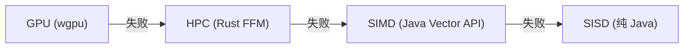
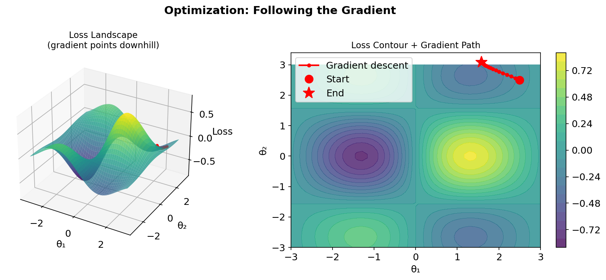

# 7.8 HPC 与 GPU 加速

> **本节目标**：理解自动微分如何桥接 Rust 原生加速和 GPU 计算——四级回退链的原理与使用。


## 1. 四级回退链

YiShape-Math 的自动微分支持四级执行回退：



每一级失败时自动降级到下一级，用户代码无需修改：

```java
// 以下代码自动使用可用的最快后端
IDiffVector x = AD.vector(data);
IDiffVector loss = x.pow(2).sum();
loss.backward();  // 自动：GPU → HPC → SIMD → SISD
```

### 1.1 为什么需要四级回退

| 层级 | 硬件要求 | 性能 | 适用场景 |
|------|---------|------|---------|
| **GPU** | 独立显卡 + wgpu | 极快（100x+） | 大规模矩阵运算 |
| **HPC** | Rust FFI 库 | 快（10-50x） | 中等规模计算 |
| **SIMD** | 支持 Vector API 的 CPU | 较快（2-8x） | 通用计算 |
| **SISD** | 任何 JVM | 基准 | 兜底 |


## 2. GPU 加速

### 2.1 前提条件

- 安装 `yishape-math-gpu` 依赖
- GPU 支持 wgpu（Vulkan/Metal/DX12）
- 系统属性 `-Dyishape.gpu=true`（默认启用）

### 2.2 自动 GPU 执行

```java
IDiffVector x = AD.vector(1.0, 2.0, 3.0);
IDiffVector y = AD.fuse(x).add(1.0).mul(2.0).sigmoid().compute();

// 尝试 GPU 执行（自动回退 CPU）
boolean gpuOk = AD.tryGpuExecute(y);
if (gpuOk) {
    System.out.println("GPU 执行成功");
} else {
    System.out.println("GPU 不可用，已回退到 CPU");
}
```

### 2.3 GPU 支持的算子

| 类别 | 算子 |
|------|------|
| **算术** | add, sub, mul, div, neg, addScalar, subScalar, mulScalar, divScalar |
| **数学** | exp, log, pow, sin, cos, tan, sqrt, abs, square |
| **激活** | sigmoid, tanh, relu, gelu, silu, mish, selu, elu, leakyRelu, softplus, hardtanh, clamp |
| **归约** | sum, mean, dot |
| **矩阵** | matmul, transpose, reshape, flatten, broadcast |
| **融合** | softmaxCrossEntropy, layerNorm, softmax, logSoftmax |
| **常量** | leaf, constant |


## 3. HPC 加速（Rust 原生）

### 3.1 前提条件

- 安装 `yishape-math-hpc` 依赖（Rust 编译的动态库）
- JVM 参数：`--enable-native-access=ALL-UNNAMED`

### 3.2 自动 HPC 执行

```java
IDiffVector x = AD.vector(data);
IDiffVector loss = x.pow(2).sum();

// 尝试 HPC 执行（自动回退 CPU）
boolean hpcOk = AD.tryHpcExecute(loss);
```

### 3.3 图导出（调试用）

`AD.dumpGraphJson()` 将计算图导出为人类可读的 JSON，供调试/检查使用。生产执行路径使用二进制 YSGP 协议。

```java
IDiffVector x = AD.vector(1.0, 2.0);
IDiffVector y = x.mul(x).add(x.sum());

String json = AD.dumpGraphJson(y);
// {"nodes":[
//   {"id":0,"shape":[2],"op":"leaf","data":[1.0,2.0]},
//   {"id":1,"shape":[2],"op":"mul","inputs":[0,0]},
//   {"id":2,"shape":[1],"op":"sum","inputs":[0]},
//   {"id":3,"shape":[2],"op":"add","inputs":[1,2]}
// ]}
```

### 3.4 JSON 格式

| 字段 | 类型 | 说明 |
|------|------|------|
| `id` | int | 节点唯一标识 |
| `shape` | int[] | 输出形状 |
| `op` | string | 算子标签 |
| `data` | double[] | 叶子节点数据 |
| `scalar` | double | 标量参数（如 addScalar 的常量） |
| `inputs` | int[] | 父节点 id 列表 |


## 4. 梯度执行的回退链

在 `AD.optimize()`、`AD.onlineLearn()`、`AD.autogradOptimizer()` 中，梯度计算自动使用最快的后端：

```java
// 自动回退链：GPU → HPC → CPU
IDiffVector x = AD.vector(initParams);
IDiffVector loss = lossBuilder.apply(x);
loss.backward();  // 内部自动尝试 GPU → HPC → CPU
```

### 回退机制

1. **GPU**：`GpuGraphExecutor.tryExecute(root)` → 检查 GPU 可用性 → 检查算子支持 → 执行
2. **HPC**：`HpcGraphExecutor.tryExecute(root)` → 检查算子支持 → 调用 Rust FFI → 执行
3. **CPU**：Java 原生执行（SIMD → SISD）

每级失败返回 `NaN`，触发下一级。


## 5. 优化器集成

`AD.optimize()` 将自动微分与优化器结合：



```java
// 批量优化
IVector initX = Linalg.vector(0.0, 0.0, 0.0);
Function<IDiffVector, IDiffVector> lossBuilder = x -> x.pow(2).sum();
IOptimizer optimizer = Opts.lbfgs();

OptResult result = AD.optimize(initX, lossBuilder, optimizer);
System.out.println("最优参数: " + result.getOptimalPoint());
System.out.println("最优值: " + result.getOptimalValue());
```

### 在线学习

```java
// 在线优化（逐样本）
IOnlineOptimizer adam = Opts.onlineAdam(0.01, 0.9, 0.999);
BiFunction<IDiffVector, double[], IDiffVector> lossFn = (params, sample) -> {
    IDiffVector pred = params.slice(0, 2).dot(AD.vector(sample));
    return pred.sub(AD.vector(sample[2])).square();
};

List<double[]> data = List.of(
    new double[]{1, 2, 5},
    new double[]{3, 4, 11}
);

IVector trained = AD.onlineLearn(
    Linalg.vector(0.0, 0.0),
    data, lossFn, adam, 100
);
System.out.println("训练后参数: " + trained);
```

### 自动微分优化器包装

```java
// 将在线优化器包装为自动微分版本
IOnlineOptimizer base = Opts.onlineSGD(0.01);
BiFunction<IDiffVector, double[], IDiffVector> lossFn = (params, sample) -> {
    IDiffVector x = AD.vector(sample);
    return params.dot(x).sub(AD.vector(sample[sample.length - 1])).square();
};

IOnlineOptimizer autogradOpt = AD.autogradOptimizer(base, lossFn);

// 现在 step() 方法自动计算梯度
for (double[] sample : data) {
    autogradOpt.step(sample, null);
}
```


## 6. 运行时控制

### GpuSwitch

```java
// 全局开关
GpuSwitch.enable();    // 启用 GPU
GpuSwitch.disable();   // 禁用 GPU

// 临时切换
GpuSwitch.runWith(() -> {
    // 这段代码内启用 GPU
    loss.backward();
});

// 系统属性
// -Dyishape.gpu=true   （默认）
// -Dyishape.gpu=false
```

### GpuConfig

```java
// 设置初始探测次数
GpuConfig.allowAttempts(3);
```


## 7. 性能调优建议

| 建议 | 原因 |
|------|------|
| 尽量使用融合算子 | 减少节点数，GPU/HPC 更高效 |
| 避免频繁的 GPU-CPU 数据传输 | 传输开销可能抵消加速 |
| 大矩阵用 `matmul()` 而非逐元素乘 | BLAS 级优化 |
| 梯度检查在小数据集上做 | 校验不需要全量数据 |
| 监控 `graphStats()` | 识别过于复杂的子图 |


## 8. 本节小结

| API | 用途 |
|-----|------|
| `AD.tryGpuExecute(root)` | 尝试 GPU 执行 |
| `AD.tryHpcExecute(root)` | 尝试 HPC 执行 |
| `AD.dumpGraphJson(root)` | 导出 JSON 计算图（调试用） |
| `AD.optimize(initX, loss, opt)` | 批量优化（自动回退链） |
| `AD.onlineLearn(...)` | 在线学习（自动回退链） |
| `AD.autogradOptimizer(base, loss)` | 包装在线优化器 |
| `GpuSwitch.enable()/disable()` | GPU 运行时开关 |


## 练习

1. **图导出练习**：构建一个简单的计算图，用 `AD.dumpGraphJson()` 导出 JSON，手动解析验证节点结构。

2. **回退链练习**：在没有 GPU 的环境下，用 `AD.tryGpuExecute()` 观察回退行为。

3. **思考题**：为什么 GPU 不支持 `squareSum`、`expSum` 等融合规约算子？从 GPU 线程模型的角度解释。

---
[← 高级功能](7.7.%20Advanced%20features.md) ｜ [章末总结 →](summary.md)
