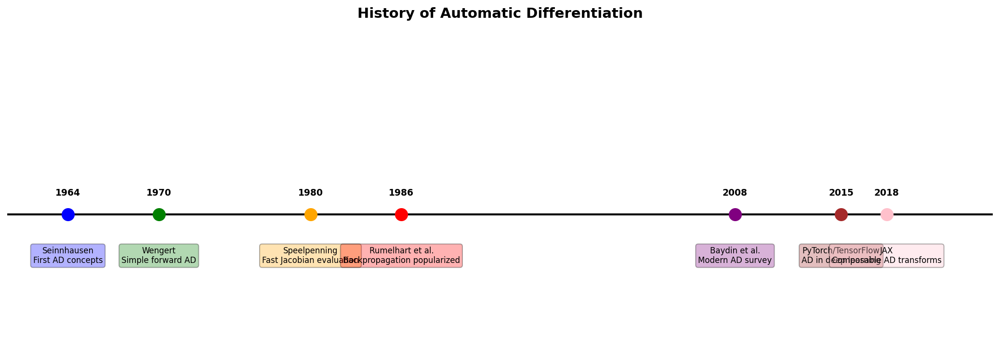

# 第 7 章：自动微分——让机器学会求导

> **💡 工厂模式约定**：本章大量使用 `AD.vector()`、`AD.matrix()`、`AD.grad()`、`MixedMode.hvp()` 等工厂入口。
> 不需要记住具体实现类名——所有可微变量通过统一的 `AD` 工厂创建，代码简洁且风格一致。


## 一个学生的故事

小明是计算机系大三学生，刚学完机器学习课。他想实现一个神经网络，但卡在了反向传播上。

> "老师，我推了两天的梯度公式，改了一个符号，训练就崩了。有没有办法让计算机自动帮我求导？"

老师说："有啊，用自动微分。PyTorch、TensorFlow都支持。"

小明试了试PyTorch，确实能自动求导。但他发现：
- PyTorch的API太复杂，`requires_grad`、`backward()`、`grad_fn`...
- 想做二阶导数？官方文档说"不推荐"
- 想和Java项目集成？没门

后来他发现了YiShape-Math的AD模块：

```java
// 3行代码，搞定梯度计算
IDiffVector x = AD.vector(1.0, 2.0, 3.0);
IDiffVector loss = x.pow(2).sum();
loss.backward();  // 梯度自动算好了！
```

小明惊了："就这么简单？"

**这就是本章要教你的**：用最简洁的API，让计算机自动帮你求导。


## 为什么要学自动微分？

### 1. 手写梯度太痛苦

假设你要实现一个简单的神经网络：

$$y = \sigma(W_2 \cdot \sigma(W_1 \cdot x + b_1) + b_2)$$

用**反向传播**训练它，你需要手动推导每一步的梯度：

$$\frac{\partial L}{\partial W_2} = \frac{\partial L}{\partial y} \cdot \frac{\partial y}{\partial W_2}$$

$$\frac{\partial L}{\partial W_1} = \frac{\partial L}{\partial y} \cdot \frac{\partial y}{\partial \sigma} \cdot \frac{\partial \sigma}{\partial z} \cdot \frac{\partial z}{\partial W_1}$$

两层网络还好——十层呢？注意力机制呢？自定义激活函数呢？

**每改一次网络结构，就要重推一遍梯度。写错一个符号，训练就崩。**

### 2. 数值差分不靠谱

有人可能会想："我用差分近似不行吗？"

$$f'(x) \approx \frac{f(x+h) - f(x)}{h}$$

看起来简单，但有三个致命问题：

| 问题 | 后果 |
|------|------|
| **舍入误差** | $h$ 太小，浮点精度不够；$h$ 太大，截断误差太大 |
| **效率低** | $n$ 维输入需要 $2n$ 次前向传播 |
| **不精确** | 结果是近似值，不是机器精度的精确解 |

### 3. YiShape-Math AD 的优势

| 对比项 | JAX | YiShape-Math AD |
|--------|-----|-----------------|
| **语言** | Python | Java（类型安全） |
| **API简洁度** | 需要理解pytree | 3行代码搞定 |
| **高阶导数** | 需要特殊技巧 | `AD.grad()` 直接支持 |
| **GPU加速** | 需要额外配置 | 自动回退链 |
| **与Java生态集成** | 无 | 原生支持 |


## 学完这章你能做什么

### 短期目标（学完本章）
- 理解**反向模式 AD**和**正向模式 AD**的区别
- 用 `AD.vector()` 创建可微变量，用 `backward()` 自动求梯度
- 用 `AD.grad()` 实现**高阶微分**
- 用 `AD.fuse()` 进行**算子融合**，加速逐元素运算
- 用 `AD.checkpoint()` 节省显存
- 用 `MixedMode.hvp()` 计算二阶导数

### 长期目标（应用到项目中）
- 用 AD 训练自定义神经网络
- 实现自定义 Loss 函数
- 用 Neural ODE 求解微分方程
- 用 GPU 加速大规模计算
- 在 Java 项目中集成自动微分


## 本章知识地图

```
自动微分
  ├── 7.1 基础概念
  │     计算图、前向传播、反向传播、前向模式 vs 反向模式
  ├── 7.2 反向模式 AD ⭐（重点！）
  │     IDiffVector、backward()、梯度累积、5分钟上手案例
  ├── 7.3 正向模式 AD
  │     tangent()、jacobian()、JVP、适用场景
  ├── 7.4 高阶导数与混合模式
  │     tape-of-tape、grad()、MixedMode、HVP
  ├── 7.5 自定义算子
  │     CustomOp、前向/反向函数
  ├── 7.6 算子融合与图优化
  │     fuse()、elementwise()、常量折叠
  ├── 7.7 高级功能
  │     梯度检查点、Neural ODE、vmap
  └── 7.8 HPC 与 GPU 加速
        计算图导出、Rust 原生执行、GPU 回退链
```

**学习建议**：
- **必读**：7.1（基础）→ 7.2（核心）→ 7.4（进阶）
- **选读**：7.3（正向模式）、7.5（自定义算子）
- **高级**：7.6（融合）、7.7（高级功能）、7.8（加速）


## 自动微分的历史



自动微分的发展历程：

- **1964年**：Seinnhausen 首次提出自动微分的概念
- **1970年**：Wengert 实现了简单的正向模式 AD
- **1980年**：Speelpenning 发表了快速 Jacobian 计算方法
- **1986年**：Rumelhart 等人将反向传播应用于神经网络训练，奠定了深度学习基础
- **2015年**：PyTorch/TensorFlow 将 AD 集成到深度学习框架
- **2018年**：JAX 提出了可组合的 AD 变换

**YiShape-Math 的 AD 模块**吸收了这些年的经验，用最简洁的 API 提供最强大的功能。


## 与其他章节的联系

| 前序知识 | 在本章的用处 |
|---------|-------------|
| 第 1 章线性代数 | 梯度是向量、Hessian 是矩阵、Jacobian 是矩阵微积分 |
| 第 6 章最优化 | 优化器需要梯度——AD 是梯度的生产者，优化器是梯度的消费者 |
| 第 5 章机器学习 | 神经网络训练的每一步都依赖 AD 计算损失函数的梯度 |


## YiShape-Math 自动微分模块一览

```java
// 1. 创建可微变量（叶子节点）
IDiffVector x = AD.vector(1.0, 2.0, 3.0);
IDiffMatrix W = AD.matrix(new double[][]{{0.1, 0.2}, {0.3, 0.4}});

// 2. 构建计算图（惰性）
IDiffVector y = x.mul(W).sum();   // 前向：记录计算图，不立即求值

// 3. 反向传播（自动求梯度）
y.backward();                     // 梯度回填到所有叶子节点
IVector gradX = x.getGradient();  // ∂y/∂x

// 4. 高阶导数
IDiffVector[] grads = AD.grad(loss, w);   // 符号梯度节点
IDiffVector d2L = grads[0].backward();     // 二阶导数

// 5. 算子融合
IDiffVector fused = AD.fuse(x).add(1.0).sigmoid().mul(2.0).compute();

// 6. 梯度校验
boolean ok = AD.checkGradient(lossFn, x, 1e-5);
```

> **API 注意**：`getGradient()` 在 `backward()` 调用前返回 `null`。必须先调用 `backward()` 才能获取梯度。

---

**准备好了吗？** 翻到下一节，开始你的自动微分之旅！

[← 第6章：返回上一章](../Chapter6_Optimization/introduction.md) ｜ [下一章：基础概念 →](7.1.%20Basic%20concepts.md)
