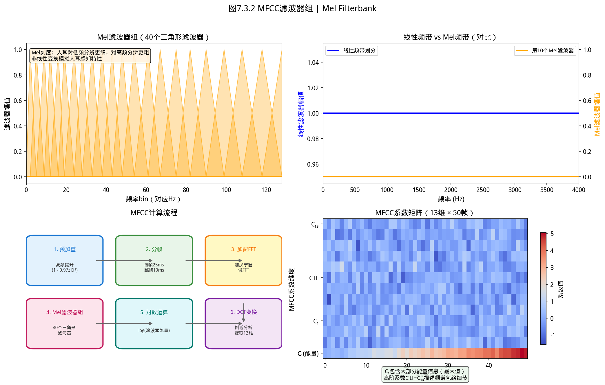
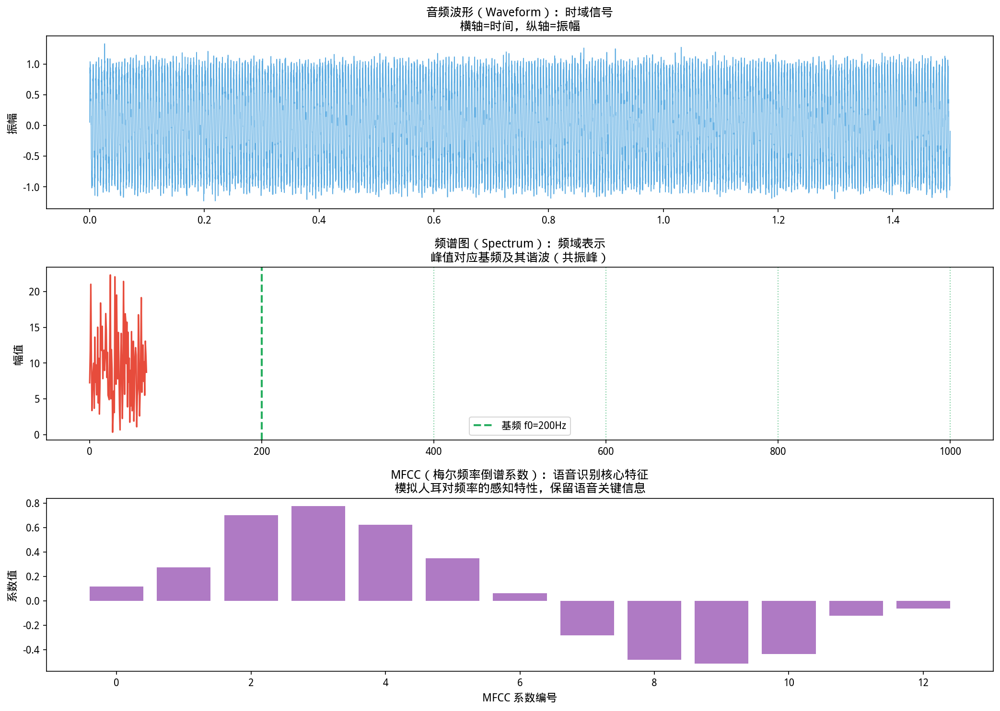

## 小谜题：为什么你认得出熟悉的歌，即使变了调？


> **📌 学习目标**
> - 理解 MFCC 的完整流程：预加重→分帧→加窗→FFT→Mel滤波器→DCT
> - 掌握人耳对频率感知的对数特性（Mel 刻度）
> - 能用 `AudioProcessing.extractMFCC()` 提取音频特征

听歌时，歌手感冒了音调变高 10%，你仍然能认出这首歌——但乐器的音高同样偏移，你就会觉得「跑调了」。

**为什么人的听觉有这个能力？**

答案在音乐认知科学里：**人类感知音高，感知的是频率比（Ratio），而不是绝对频率（Hz）。** 人耳对「比例」敏感，对「绝对值」不敏感。

这就是为什么 **MFCC（Mel-Frequency Cepstral Coefficients）** 要把 Hz 刻度转换成「接近人耳感知的 Mel 刻度」——它模拟了人耳对频率比敏感的听觉特性，因此比原始频谱更适合做语音识别。


> ⚠️ **常见误区**：MFCC 提取时梅尔滤波器组默认 26 个、FFT 点数 512 是经验值——对于 16kHz 采样的语音，这是经过验证的标准配置，改动前请先查文献。

---

# 第 7 章（三）：音频特征提取与 YiShape-Math
### Audio Feature Extraction: MFCC, Spectral Analysis, and Applications

上一节：[7.2. signal processing.md](7.2. signal processing.md) ｜ 下一节：[7.4. Music mining.md](7.4. Music mining.md)

---

## 7.3 音频特征提取

如图所示，MFCC滤波器组：

*图7.3.1 MFCC滤波器组。Mel滤波器组模拟人耳听觉非线性特性；DCT提取倒谱系数，保留语音识别关键信息*

从图中可以看出，MFCC滤波器组。

*图7.3.2 音频时域与频域特征。音频特征：过零率（清音/浊音）、频谱质心（音色亮暗）、MFCC（语音识别）*

从图中可以看出，音频时域与频域特征。
## 开场：微信语音转文字，背后是什么？

你发了一条语音微信，对方收到后点开就能看到文字。**这个「语音转文字」是怎么工作的？**

不是人听着打的——是机器学习模型自动转的。但模型不能直接吃 60 秒的音频波形（那是 264 万个采样点！）。

工程上把 60 秒音频变成几十个数值——叫**音频特征**。最常见的一种叫 **MFCC**（梅尔频率倒谱系数），大概思路是：

1. 把音频切成 20~40 毫秒的小段
2. 对每段做 FFT，看里面有哪些频率
3. 用 Mel 滤波器组把频率映射到人耳更敏感的范围
4. 最后输出十几个数字——这一段的「声纹」

整个 60 秒语音就变成了一个 **时间序列 × 特征矩阵**，喂给 RNN/Transformer 模型转成文字。

---

### 7.3.1 从波形到特征：音频分析管线

音频在计算机中表示为**采样序列** $x[n]$（可多声道）。原始波形维数极高（44.1 kHz 采样率下每秒 44100 个样本），直接用作机器学习特征既不现实也无意义。标准分析管线：

```
波形 x[n] → 预处理（预加重/分帧/加窗） → FFT → 功率谱 → Mel 滤波器组 → 对数 → DCT → MFCC
```

本库的音频功能位于 `com.yishape.lab.audio` 包，核心入口类为 **`Audios`** 工厂：

| 子包 | 功能 |
|------|------|
| `audio.core` | `AudioData`、`AudioFormat`、`AudioIO`（读写 WAV 等） |
| `audio.processing` | 预处理：归一化、声道处理、音量调整 |
| `audio.filter` | 滤波器：低通、高通、带通 |
| `audio.feature` | 特征提取：MFCC、谱质心、过零率等 |
| `audio.analysis` | 分析：FFT、STFT、音高检测 |
| `audio.embedding` | 嵌入：i-vector 等固定维表示 |

### 7.3.2 预处理：分帧与加窗

**分帧**：将长音频切为短帧（通常 20-40 ms，重叠 50%），假设每帧内信号**短时平稳**。

**加窗**：对每帧乘窗函数（常用 Hamming 窗）减少帧边界的频谱泄漏：
$$w[n] = 0.54 - 0.46\cos\left(\frac{2\pi n}{N-1}\right),\quad n=0,\ldots,N-1$$

**预加重**：高通滤波 $y[n]=x[n]-\alpha x[n-1]$（$\alpha\approx 0.97$），提升高频分量，平衡频谱。

### 7.3.3 MFCC：Mel 频率倒谱系数

**Mel 刻度**模拟人耳对频率的对数感知：
$$\text{Mel}(f) = 2595\log_{10}\left(1+\frac{f}{700}\right)$$

**MFCC 计算步骤**：

1. **FFT**：对每帧 $N$ 点 FFT 得频谱 $X[k]$
2. **功率谱**：$|X[k]|^2$
3. **Mel 滤波器组**：$M$ 个三角滤波器（通常 26-40 个），在 Mel 刻度上均匀分布
   $$E_m = \sum_{k}|X[k]|^2\cdot H_m[k]$$
4. **对数压缩**：$\log E_m$，模拟人耳对能量的对数响应
5. **DCT-II**：去相关，取前 $C$ 个系数（通常 12-13 个）
   $$c_n = \sum_{m=1}^{M}(\log E_m)\cos\left[\frac{\pi n}{M}\left(m-\frac{1}{2}\right)\right]$$

**为什么有效**：
- Mel 滤波器组模拟人耳的非均匀频率分辨率（低频密集、高频稀疏）
- 对数压缩匹配人耳 Weber-Fechner 定律
- DCT 去相关，使 MFCC 各维度近似独立，适合高斯假设的分类器

### 7.3.4 其他常用音频特征

| 特征 | 含义 | 应用 |
|------|------|------|
| **谱质心** | 频谱的"重心"频率 | 音色明亮度 |
| **谱带宽** | 频谱的 spread | 音色丰富度 |
| **谱平坦度** | 几何均值/算术均值 | 噪声 vs 乐音判断 |
| **过零率（ZCR）** | 信号穿越零点的频率 | 语音/音乐分类 |
| **RMS 能量** | 帧能量 | 语音端点检测 |
| **色度（Chroma）** | 12 音级能量分布 | 和弦识别、调性检测 |
| **谱对比度** | 频谱峰谷差异 | 音色区分 |

### 7.3.5 YiShape-Math 代码示例

**创建特征提取器**：

```java
import com.yishape.lab.audio.Audios;
import com.yishape.lab.audio.core.AudioData;
import com.yishape.lab.audio.core.AudioIO;
import com.yishape.lab.audio.feature.IAudioFeatureExtractor;
import com.yishape.lab.audio.feature.AudioFeatureResult;

// 读取音频文件
AudioData audio = AudioIO.readAudio("sample.wav");

// 创建标准特征提取器（默认参数：25ms 帧长、10ms 步长、40 个 Mel 滤波器、13 个 MFCC）
IAudioFeatureExtractor extractor = Audios.createStandardFeatureExtractor();

// 提取特征
AudioFeatureResult features = extractor.extractAudioFeatures(audio);

// 获取 MFCC 系数（13 维，每帧一个向量）
var mfcc = features.getMfcc();  // 返回 MFCC 均值向量

System.out.println("MFCC (13 维): " + java.util.Arrays.toString(mfcc));
```

**帧级特征**：

```java
// 获取每帧的 MFCC 序列（行数 = 帧数，列数 = MFCC 维数）
// double[][] mfccSequence = features.getMfccSequence();

// 获取其他特征
// var spectralCentroid = features.getSpectralCentroid();
// var zeroCrossingRate = features.getZeroCrossingRate();
// var rmsEnergy = features.getRmsEnergy();
```

**自定义参数**：

```java
// 指定类型的特征提取器：
// Audios.createFeatureExtractor("mfcc")
```

### 7.3.6 i-vector：固定维音频嵌入

音频片段长度可变，但机器学习需要**固定维特征向量**。**i-vector** 将可变长音频映射到固定维向量空间，便于：
- 说话人识别/验证
- 音频检索与聚类
- 与 YiShape VecDB 等向量数据库结合

本库在 `com.yishape.lab.audio.embedding` 包中提供 `IVectorEmbedding` 接口：

```java
import com.yishape.lab.audio.embedding.IAudioEmbedding;
import com.yishape.lab.audio.embedding.IVectorEmbedding;

// IAudioEmbedding embedding = Audios.createAudioEmbedding();
// var embeddingVector = embedding.embed(audio);
```

### 7.3.7 应用领域

| 应用 | 特征选择 | 后续模型 |
|------|----------|----------|
| **语音识别（ASR）** | MFCC + Delta + Delta-Delta | **隐马尔可夫模型**（Hidden Markov Model，**HMM**）-GMM / 深度网络 |
| **说话人识别** | MFCC + i-vector | PLDA / 余弦相似度 |
| **音乐流派分类** | MFCC + 色度 + 谱特征 | 随机森林 / SVM |
| **环境声分类** | 谱质心 + ZCR + RMS | **卷积神经网络**（Convolutional Neural Network，**CNN**）/ 逻辑回归 |
| **情感识别** | 音高 + 能量 + 语速 | SVM / 随机森林 |
| **语音端点检测** | 能量 + ZCR | 阈值法 / HMM |

### 7.3.8 与机器学习管线的衔接

MFCC 序列是**时间序列数据**，可直接：
- 用第 7.1 章的时间序列模型（ARIMA、状态空间）分析
- 取统计摘要（均值、方差、分位数）后用第 5 章的分类器
- 用深度学习（CNN、RNN）直接处理帧序列

### 7.3.9 小结

- MFCC 是音频特征提取的核心，联结 DSP（FFT、DCT）与感知声学（Mel 刻度）
- `Audios` 工厂统一创建处理器、滤波器与特征提取器
- i-vector 等嵌入将可变长音频映射到固定维向量
- 音频特征是时间序列，需考虑时序建模或统计摘要

### 7.3.10 自测与练习

1. 手动计算一帧 8 点 Hamming 窗的系数，并解释其频谱特性
2. 比较不同 Mel 滤波器组数量（20、40、80）对 MFCC 的影响
3. 用 YiShape-Math 提取两段不同语音的 MFCC，计算它们之间的余弦相似度
4. 解释：为什么 MFCC 用 DCT 而不是直接取对数 Mel 谱作为特征？
5. 设计一个语音/音乐二分类系统：列出特征选择、模型选择和评估指标

---

**上一节**：[7.2. signal processing.md](7.2. signal processing.md) ｜ **下一节**：[7.4. Music mining.md](7.4. Music mining.md)

---

## 本节 API 一览

| 场景 | API | 说明 |
|------|-----|------|
| 预加重 | `AudioProcessing.preEmphasize(signal, alpha)` | 高频增强，α≈0.97 |
| 分帧 | `AudioProcessing.frame(signal, frameSize, hop)` | 帧长25ms，步长10ms |
| 加窗 | `AudioProcessing.window(frames, "hann")` | 帧级别加窗 |
| FFT | `AudioProcessing.fft(frames)` | 每帧做FFT |
| Mel滤波器组 | `AudioProcessing.melFilterbank(nFFT, nMel)` | Mel频域滤波 |
| MFCC | `AudioProcessing.extractMFCC(audio)` | 完整MFCC流程 |
| 色度特征 | `AudioProcessing.chroma(audio)` | 12音高特征 |

> **标准参数**：采样率44.1kHz，帧长1024/2048点，Mel滤波器26个，MFCC系数12~13维。

## 本节小结

音频信号处理的核心是将时域信号转换到频域或倒谱域进行分析。MFCC（梅尔频率倒谱系数）通过梅尔滤波器组和 DCT 变换提取出模拟人耳听觉特性的特征，是语音识别的标准特征。

**核心要点**：
- MFCC 提取流程：预加重 -> 分帧 -> 加窗 -> FFT -> 梅尔滤波器 -> DCT -> 13-40维MFCC
- 频谱特征（centroid, bandwidth, rolloff）描述音频的音色
- 音高检测用自相关或倒谱方法

## 章节练习 / Exercises

**1. MFCC提取（编程题）**

用 librosa 读取一段音频（或用 Signals 生成测试信号），提取 13 维 MFCC 序列，绘制时间-频率热力图。

**2. 频谱特征计算（计算题）**

计算一段钢琴音的频谱质心（spectral centroid）和频谱滚降点（spectral rolloff），解释这两个指标与「音色明亮度」的关系。
