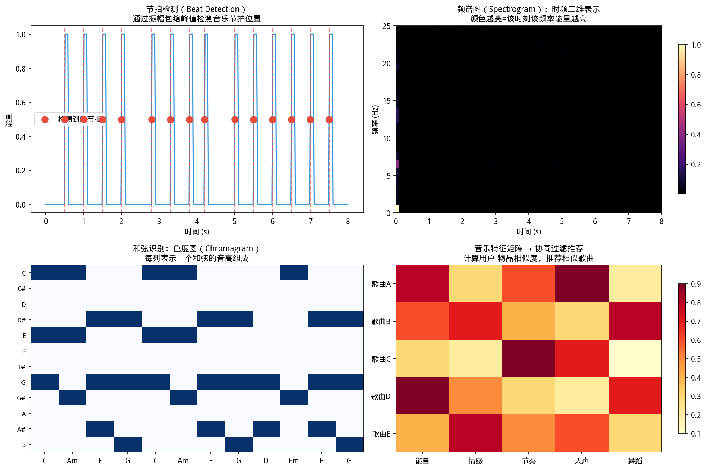

# 第 7 章（四）：音乐信息检索与 YiShape-Math
### Music Information Retrieval: Beat, Key, Chord, and Mining


> **📌 学习目标**
> - 理解色度向量（Chromagram）的构建——12 个音级的能量归一化
> - 掌握音乐调性（Key）识别的频谱特征方法
> - 能用自相关函数检测音乐节拍

上一节：[7.3. audio processing.md](7.3. audio processing.md)

---

## 7.4 音乐信息检索

如图所示，音乐挖掘：节拍、旋律、和弦：

*图7.4.1 音乐挖掘：节拍、旋律、和弦。音乐挖掘：节拍跟踪（节奏感）、旋律提取（主旋律线）、和弦识别（和声结构）*

从图中可以看出，音乐挖掘：节拍、旋律、和弦。
## 开场：网易云音乐怎么知道这首歌「像」那首歌？

你在网易云听了一首后摇《星尘》，它给你推荐了一首同类型的《银河》——这两首曲子你都没听过，但风格听起来确实很像。

**平台是怎么发现它们相似的？**

不是人工打标签，是机器从音频本身提取特征：**BPM（节奏速度）、调性（是大调还是小调）、和声走向、音色质感（明亮还是阴暗）**，然后把这些特征表示成向量，两首歌的向量越「近」，就越相似。

这就是**音乐信息检索（MIR）**做的事情——让机器「听懂」音乐，然后做推荐、分类、搜索相关的任务。

---

### 7.4.1 什么是音乐信息检索（MIR）？

**音乐信息检索**（Music Information Retrieval, MIR）研究如何从音频中自动提取可用于搜索、推荐、教育和分析的信息。与第 7.3 节侧重声学特征（MFCC）不同，本节强调**乐理相关的中层与高层特征**：节拍、调性、和弦、结构。

**MIR 的层次结构**：

| 层次 | 典型表示 | 用途 | 对应章节 |
|------|----------|------|----------|
| **声学层** | 波形、MFCC、谱质心 | 说话人识别、乐器粗分 | 7.3 |
| **中层** | 色度（chroma）、节拍图 | 翻唱检索、和弦识别 | 本节核心 |
| **符号层** | 调性、和弦序列、段落标签 | 推荐、版权元数据 | 本节 |
| **语义层** | 流派、情绪、风格标签 | 播放列表生成 | 第 5 章分类 |

### 7.4.2 节拍（Tempo）与 onset 检测

**节拍（BPM）**：每分钟拍数，描述音乐进行快慢。

**Onset 检测**：检测「新音符或鼓点出现」的时刻。常用方法：
1. 计算**谱通量**（spectral flux）：相邻帧功率谱的差异
   $$\text{Flux}(t) = \sum_{k}\max(0, |X_t[k]| - |X_{t-1}[k]|)$$
2. 对谱通量序列做**自相关**，在滞后对应一拍或一小节周期处出现峰值
3. 峰值位置对应 BPM

**节拍跟踪**比单一 BPM 更精细：使用隐马尔可夫模型或动态规划，允许速度微变和切分音。

```java
import com.yishape.lab.music.Musics;
import com.yishape.lab.music.analysis.BasicMusicAnalyzer;
import com.yishape.lab.audio.core.AudioData;
import com.yishape.lab.audio.core.AudioIO;

// 读取音乐文件
AudioData music = AudioIO.readAudio("song.wav");

// 创建音乐分析器
BasicMusicAnalyzer analyzer = Musics.createBasicMusicAnalyzer();

// 节拍检测
// BeatDetectionResult beat = analyzer.detectBeat(music);
// System.out.println("估计 BPM: " + beat.getBPM());
// System.out.println("节拍位置: " + java.util.Arrays.toString(beat.getBeatTimes()));
```

### 7.4.3 色度（Chroma）：和声的指纹

西方调性音乐在 **12 个音级**（C, C#, D, ..., B）上运作。将八度折叠后，每个音高映射到 12 维的**色度向量**——在 12 维上累加每个音级的能量。

**关键性质**：色度对**八度平移不变**——同一和弦在不同八度演奏，色度模式相似。这使得色度成为和弦识别、翻唱检索的核心特征。

**计算步骤**：
1. 对每帧做 FFT，得功率谱
2. 将频率 bin 映射到 12 个音级（基于十二平均律：$f = 440 \times 2^{(n-69)/12}$）
3. 每个音级的所有八度能量累加
4. 归一化得到 12 维色度向量

### 7.4.4 调性（Key）检测

调性检测将色度向量与大调/小调的**模板**做相关性匹配。经典方法：
- **Krumhansl-Schmuckler 关键轮廓**：基于心理声学实验的大调/小调模板
- **相关系数**：计算色度与每个候选调模板的皮尔逊相关系数
- 取相关系数最高的调为估计结果

24 个候选调（12 个大调 + 12 个小调），选择最匹配的一个。

### 7.4.5 和弦（Chord）识别

和弦识别在短时窗内输出离散标签序列（如 C:maj, G:7, D:m）。可视为**序列标注**问题：
- **模板匹配**：将色度向量与预定义和弦模板比对
- **HMM**：建模和弦之间的转移概率（如 V→I 比 V→VII 更常见）
- **深度学习**：CNN/RNN 直接从色度序列预测和弦

```java
// 调性与和弦检测（API 以实际 Javadoc 为准）
// KeyDetectionResult key = analyzer.detectKey(music);
// System.out.println("估计调性: " + key.getKey());  // 如 "C major"

// ChordDetectionResult chords = analyzer.detectChords(music);
// System.out.println("和弦序列: " + java.util.Arrays.toString(chords.getChords()));
```

### 7.4.6 音乐结构分段

音乐通常由**段落**组成：前奏→主歌→副歌→间奏→主歌→副歌→尾奏。结构分段的目标是自动检测段落边界。

**常用方法**：
- **自相似矩阵**：计算帧间色度相似度，块对角结构对应段落
- ** novelty 函数**：检测自相似矩阵中的边界突变
- **聚类**：将相似帧聚类，簇边界即段落边界

### 7.4.7 MFCC 与色度的分工

| 特征 | 侧重 | 适用场景 | 不适用场景 |
|------|------|----------|------------|
| **MFCC** | 频谱包络（音色） | 说话人、乐器、环境声 | 旋律/和声识别 |
| **色度** | 音高分布（和声） | 和弦、调性、翻唱 | 音色分类 |

**翻唱识别**尤其依赖色度：同一旋律在不同编曲下 MFCC 差异很大，但色度模式（和弦进行）保持相似。

### 7.4.8 评价体系与公开基准

**MIREX**（Music Information Retrieval Evaluation eXchange）是国际音频音乐检索评测平台，提供标准化任务：
- 和弦识别帧准确率
- 调性分类准确率
- 节拍跟踪 F-measure
- 结构分段边界容忍度

课程实验不必追求竞赛级分数，但应报告：数据集片段长度、是否含鼓点、立体声/单声道、评估窗口。对比基线（随机标签、多数类）可避免「准确率虚高」。

### 7.4.9 应用案例

| 应用 | 技术组合 | 工业场景 |
|------|----------|----------|
| **哼唱检索** | 音高轮廓 + DTW | Shazam 式音乐搜索 |
| **翻唱识别** | 色度 + 和弦序列匹配 | 版权监控 |
| **流派分类** | MFCC + 色度 + 节奏特征 + 分类器 | 流媒体推荐 |
| **情绪识别** | 特征 + 回归/分类 | 播放列表生成 |
| **DJ 辅助** | BPM + 调性 + 和弦兼容性 | 自动混音 |
| **音乐教育** | 音高检测 + 和弦识别 | 自动谱曲辅助 |

### 7.4.10 伦理、版权与指纹技术

**音乐指纹**（如音频哈希）用于识别未知片段对应曲库中的录音，与推荐系统的协同过滤不同，更偏信号匹配。技术能力必须与**版权合规**同行：
- 公开研究应避免传播受版权保护的整曲音频
- 引用数据集应注明许可
- 生成式音乐的训练数据授权与艺术家署名问题日益突出

### 7.4.11 与相邻章的联系

- **7.2 信号处理**：色度基于 FFT 功率谱折叠，节拍基于谱通量自相关
- **7.3 音频**：MFCC 与色度并联使用，分别提供音色与和声信息
- **5.2 分类**：流派/情绪分类是典型的多分类问题
- **5.3 聚类**：结构分段可视为无监督聚类
- **1.1 向量**：色度是 12 维向量，调性/和弦识别即向量模板匹配

### 7.4.12 小结

- MIR 从声学层（FFT/MFCC）到中层（色度/节拍）再到符号层（调性/和弦/结构），逐层抽象
- 色度是和声分析的核心特征，对八度平移不变
- 节拍检测基于 onset 序列的自相关分析
- MIR 与信号处理、机器学习紧密交叉
- 版权合规是音乐技术应用不可忽视的前提

### 7.4.13 自测与练习

1. 手动计算一个 8 点 DFT 的色度折叠（假设采样率 44100 Hz（赫兹，Hertz），只考虑 C4 和 C5 两个音级）
2. 用自相关方法估计一段音频的 BPM，并与节拍器结果对照
3. 解释：为什么翻唱识别用色度比用 MFCC 更有效？
4. 设计一个音乐流派分类系统：列出特征选择、模型选择和评估指标
5. 讨论：音乐生成 AI 的训练数据授权问题应从技术角度如何辅助解决？

---

**上一节**：[7.3. audio processing.md](7.3. audio processing.md) ｜ **第 7 章完**

---

## 本节 API 一览

| 场景 | API | 说明 |
|------|-----|------|
| 节拍检测 | `MusicMining.beatDetection(audio)` | 检测BPM和节拍位置 |
| 调式识别 | `MusicMining.keyDetection(audio)` | 识别大调/小调 |
| 和弦识别 | `MusicMining.chordRecognition(audio)` | 实时和弦序列 |
| 风格分类 | `MusicMining.genreClassification(features)` | 音乐风格预测 |
| 相似度搜索 | `MusicMining.similaritySearch(querySong, songDatabase)` | 以图搜歌/以歌搜歌 |
| 哼唱检索 | `MusicMining.queryByHumming(query, database)` |哼唱旋律片段匹配 |

> **核心流程**：音频 → 分帧 → STFT → 频谱图 → 特征（MFCC/chroma）→ 下游任务。

## 章节练习 / Exercises

**1. 旋律提取（应用题）**

读取一段含音乐的音频文件（或使用 librosa 示例数据），提取主旋律（f0）序列，并计算平均音高和音高变化的标准差。

**2. 节拍检测验证（思考题）**

对同一段音乐，用 librosa 的默认节拍检测器运行 3 次，验证结果是否稳定。这反映了节拍跟踪算法的什么特性？
