## 历史故事：毕达哥拉斯听到「数学」——音乐与数学的千年之恋

公元前 500 年，**毕达哥拉斯**在铁匠作坊里发现：不同重量的锤子敲击铁砧，会发出和谐的声音——只有在特定重量比例下才和谐。

他量出音程的比例：**弦长 2:1 差一个八度，3:2 差五度，4:3 差四度。**

这就是**和声**的数学基础——两个音的频率比越简单（分数越接近整数比），人耳觉得越和谐。这个发现奠定了西方音乐理论，也奠定了**傅里叶分析**的直觉：**复杂的声音可以分解为简单正弦波的叠加。**

**为什么人耳是一个「傅里叶分析仪」？** 因为和声感知，本质上就是人耳对频率成分的感知——这正是本章第 7.2 节 FFT 和 7.3 节 MFCC 要揭示的内容。

---

# 第 7 章（一）：时间序列分析
### Time Series Analysis: Decomposition, Forecasting, and Diagnostics

下一节：[7.2. signal processing.md](7.2. signal processing.md)

---

## 7.1 时间序列分析

如图所示，ADF检验确定差分阶数d。随机游走(非平稳)：AD：
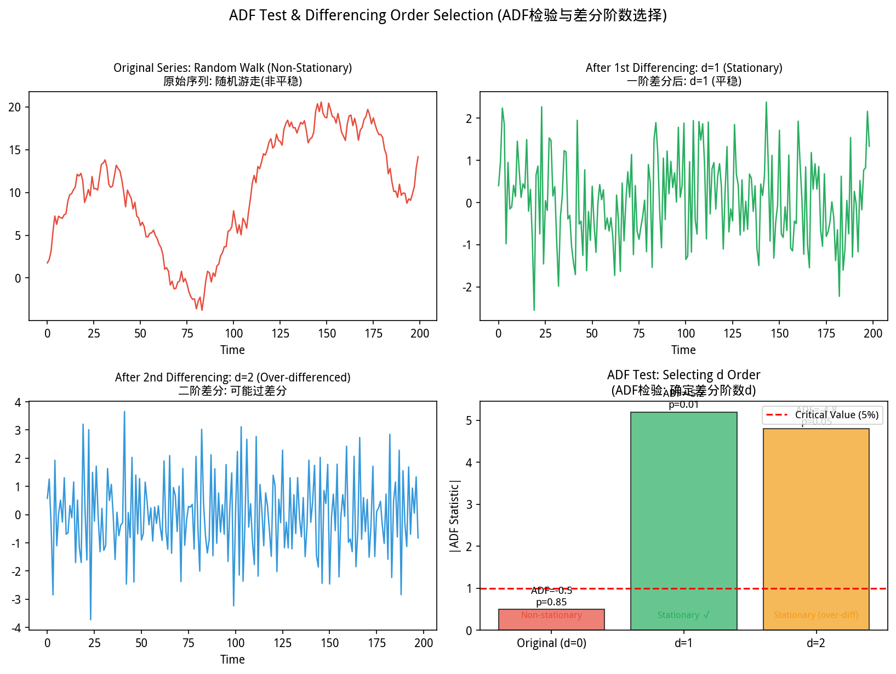
*图 new.adf_differencing ADF检验确定差分阶数d。随机游走(非平稳)：ADF统计量靠近0，p>0.05；一阶差分后平稳：ADF<-临界值，p<0.05；二阶差分可能过差分导致信息损失*

从图中可以看出，ADF 检验通过统计量与临界值的比较来判断差分阶数：p > 0.05 说明序列非平稳（需要差分），p < 0.05 说明已经平稳（可以建模）。
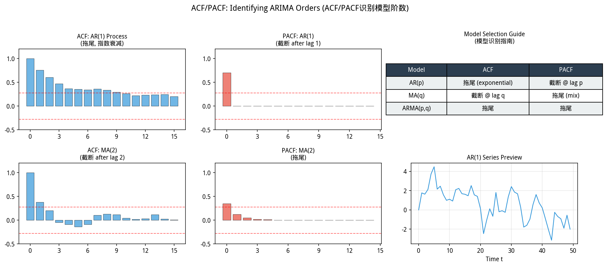
*图 new.acf_pacf_orders ACF/PACF识别ARIMA(p,d,q)阶数。AR(p)：ACF拖尾+PACF截断于lag p；MA(q)：ACF截断于lag q+PACF拖尾；ARMA(p,q)：两者均拖尾；参照指南表快速定阶*

从图中可以看出，ACF 和 PACF 的拖尾/截断模式可以帮你识别 ARIMA 的 p 和 q 阶数：ACF 截断于 lag q → MA(q)，PACF 截断于 lag p → AR(p)。
> **📌 学习目标**
> - 理解平稳性（Stationarity）的定义——均值/方差/自协方差不随时间变化
> - 掌握 AR、MA、ARMA、ARIMA 模型的适用场景与参数选择
> - 能用 `TSA.forecast.arima()` 建模并预测
> - 理解 AIC/BIC 在时间序列模型选择中的作用

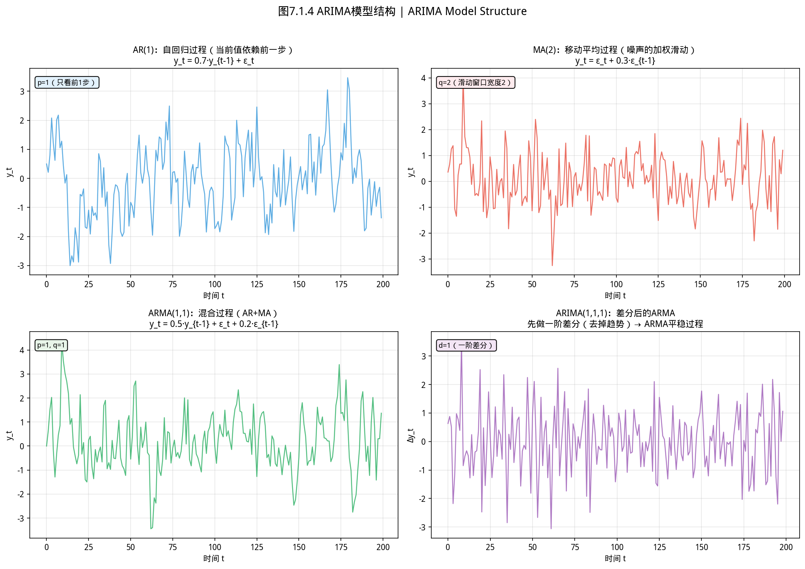
*图7.1.1 ARIMA模型结构与参数。ARIMA(p,d,q)：d阶差分使非平稳序列平稳；AR(p)用前p步自相关；MA(q)用前q步噪声*

从图中可以看出，ARIMA(p,d,q) 的三层结构：先差分 d 次让序列平稳，再用 AR(p) 捕捉自相关，最后用 MA(q) 捕捉残差中的移动平均模式。
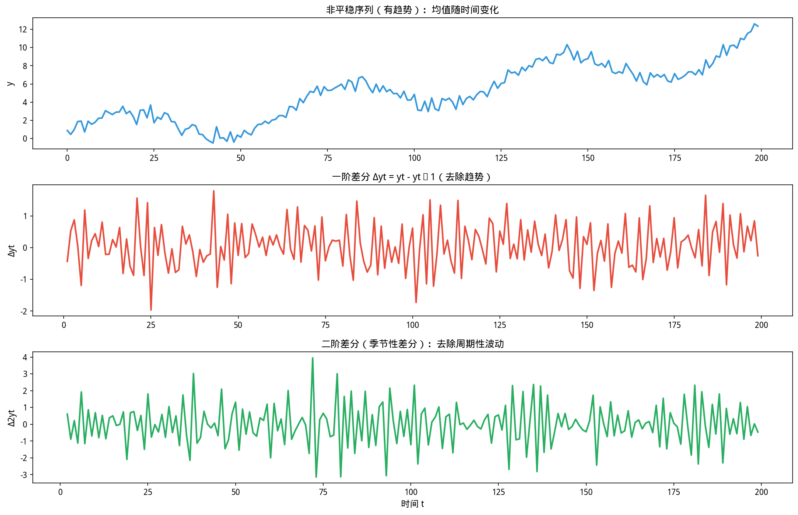
*图7.1.2 差分运算与平稳化。差分：Δy_t=y_t-y_{t-1}；一阶差分消除趋势；二阶差分消除二次趋势*

从图中可以看出，差分运算通过计算相邻值之差来消除趋势：一阶差分消除线性趋势，二阶差分消除二次趋势。差分后的序列更接近平稳。
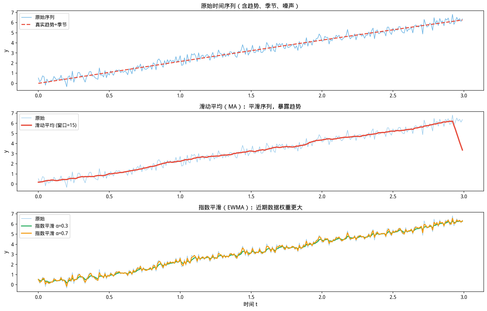
*图7.1.3 时间序列平滑方法。移动平均、指数平滑等平滑方法消除噪声、揭示趋势和季节性*

从图中可以看出，移动平均和指数平滑通过加权平均消除随机噪声，让趋势和季节性模式更加清晰可见。
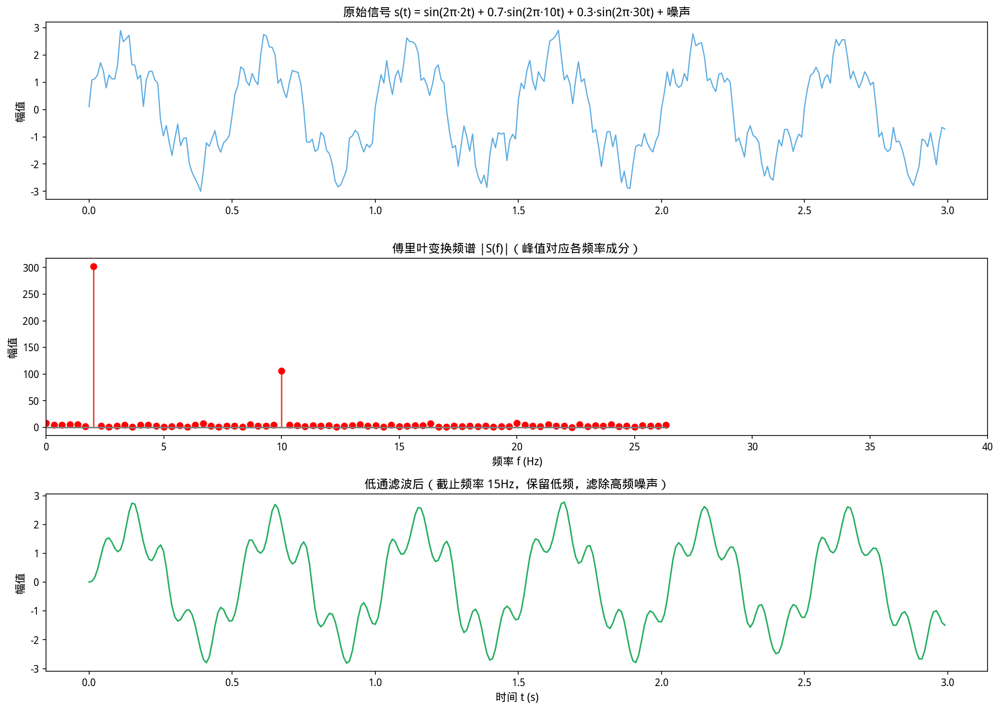
*图7.1.4 傅里叶分解与频谱。傅里叶变换：信号分解为不同频率的正弦波叠加；频谱显示各频率成分强度*

**平稳性、差分与 ADF 检验：d 怎么确定？**

ARIMA 中的 **d（差分阶数）** 不是随意设定的——它由数据的**平稳性**决定。

**判断步骤**：

1. **观察自相关图（ACF）**：如果 ACF 衰减缓慢（持续高相关性），通常是非平稳信号
   
2. **做 ADF（Augmented Dickey-Fuller）检验**：
   - $H_0$：序列存在单位根（非平稳）
   - $H_1$：序列是平稳的
   
3. **解读 ADF 结果**：
   - p < 0.05 → 拒绝 $H_0$ → 数据平稳 → **d = 0**
   - p ≥ 0.05 → 不能拒绝 $H_0$ → 数据非平稳 → **做一阶差分**
     - 差分后再做 ADF，若 p < 0.05 → **d = 1**
     - 若仍不平稳 → **d = 2**（很少需要 d > 2）

**代码示例**：
    // ⚠️ 警告：d=0（不差分）适用于平稳序列；d=1 差分后仍不平稳需考虑 d=2；过度差分会导致信息丢失

```java
// 差分阶数选择
TimeSeriesData ts = TimeSeriesData.of(values, 1.0, "sales");

// 方法1：手动差分 + ADF检验
var diff1 = Signals.diff(values, 1);          // 一阶差分
boolean stationary1 = adfTest(diff1);               // ADF检验

// 方法2：直接用 YiShape-Math ARIMA 自动定阶
// arima(data, maxP=5, maxD=2, maxQ=5, ic="aicc")
// AIC/BIC/AICC 会自动选择最优的 (p,d,q) 组合
```

> **实战经验**：大多数 MACD（移动平均收敛发散）指标在金融时序上用 d=1；年度季节性数据（GDP、人口）通常 d=2；日销售数据（带趋势）d=1。**永远先用 ADF 检验确认**，不要凭直觉设定 d。

## 开场：老板要你预测下个月的销售

季度末，老板把你叫到办公室：

> 「下个月销售能到多少？」

你翻出过去 36 个月的销售数据：一条起起伏伏的曲线，有增长趋势，有明显的年末高峰（双十一），也有些异常波动。

**这不是一道静态的统计题——这是一道和时间有关的题。** 你不能只拿平均值糊弄过去，因为相邻月份之间是有关系的（10 月高了，11 月往往也高，因为有季节性）。这就是**时间序列**的核心挑战：数据点不独立，过去影响未来。

时间序列分析要回答的不只是「均值是多少」，而是「趋势是什么」、「季节性周期是多久」、「接下来最可能落在哪个区间」。

---

### 7.1.1 什么是时间序列？

时间序列是按**时间顺序**观测的数据 $\{y_t\}$，广泛出现在金融、供应链、物联网和宏观经济中。与横截面数据的关键区别：相邻时刻**不独立**——存在趋势、季节性和残差中的**自相关**。

本库在 `com.yishape.lab.math.timeseries` 中提供分解、预测、滤波、诊断、多变量模型和协整分析，静态门面类为 **`Series`**。

**历史故事：Markov 用概率论研究普希金的诗歌**

时间序列里「相邻时刻不独立」这个想法，最早来自俄国数学家 **Andrey Markov**（1856—1922）。

1913 年，Markov 做了一件惊人的事情：他用概率论分析了 **普希金的《叶甫盖尼·奥涅金》**——一本俄语叙事诗。他把元音字母算作「状态 A」，辅音字母算作「状态 B」，然后研究这首诗里元音和辅音交替出现的规律。

他发现：**一个字母是元音还是辅音，和它前面的字母的类型有关**——具体来说，如果前一个字母是元音，那么下一个字母是元音的概率更低（因为俄语里元音不能连续出现）。

这就是 **Markov 链**的核心思想：**下一个状态不完全独立于之前的所有状态，而只依赖于当前状态。** 这被称为「**无记忆性**」：
$$P(X_{t+1} = j \mid X_t = i) = p_{ij}$$

这个发现在当时是纯数学游戏，但它是现代时间序列分析的理论基础。今天，Markov 链被用于语音识别（隐 Markov 模型）、金融模型（股票价格）、天气预测，甚至 PageRank（Google 搜索 ranking）——这个来自文学分析的概率工具，成了互联网时代最重要的算法之一。

### 7.1.2 分析流水线

实际工作中很少「调一个 ARIMA 就交差」。标准流程：

```
原始序列 → 可视化探索 → 变换/差分 → 分解 → 建模 → 残差诊断 → 预测
```

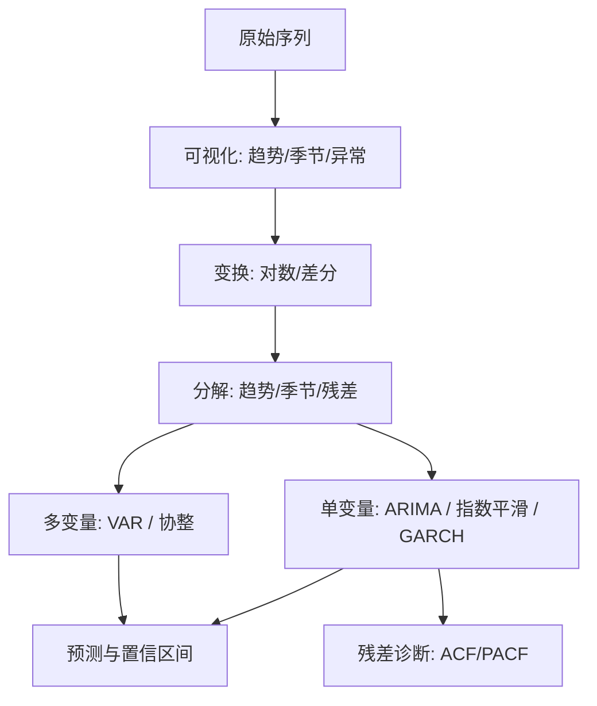

### 7.1.3 时间序列分解

如图所示，时间序列分解：趋势+周期+残差：
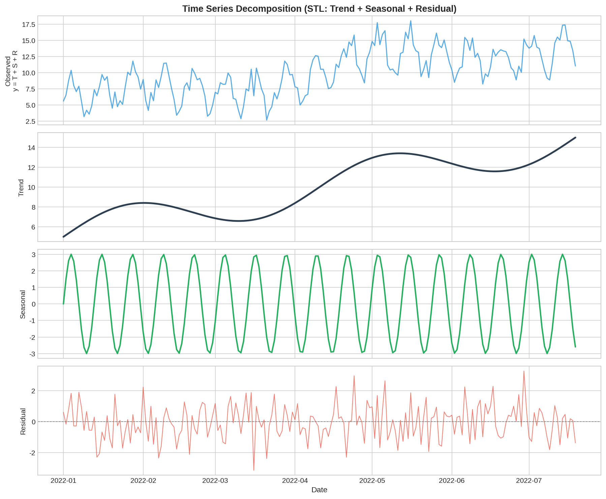
*图7.1.5 时间序列分解：趋势+周期+残差。加法模型Y=T+S+R；乘法模型Y=T·S·R；STL分解灵活处理趋势和季节性*

**加法模型**：$y_t = T_t + S_t + R_t$（趋势 + 季节 + 残差）
**乘法模型**：$y_t = T_t \times S_t \times R_t$（适用于季节性随趋势放大的情况）

**经典分解法**：用移动平均估计趋势，再从原序列中减去趋势得到季节成分。

```java
import com.yishape.lab.math.timeseries.Series;
import com.yishape.lab.math.timeseries.DecompositionResult;

var data = {/* 月度销售数据 */};
int period = 12;  // 年度季节性

// 经典分解
// DecompositionResult decomp = Series.decompose(data, period, "additive");
// var trend = decomp.getTrend();
// var seasonal = decomp.getSeasonal();
// var residual = decomp.getResidual();
```

### 7.1.4 平稳性与差分

**平稳序列**：均值、方差和自协方差不随时间变化。大多数时间序列模型要求数据平稳。

**差分**是常用的平稳化方法：
$$\Delta y_t = y_t - y_{t-1},\qquad \Delta^d y_t = \Delta(\Delta^{d-1}y_t)$$

季节性差分：$\Delta_s y_t = y_t - y_{t-s}$，其中 $s$ 是季节周期。

### 7.1.5 自相关与偏自相关

如图所示，ACF与PACF：
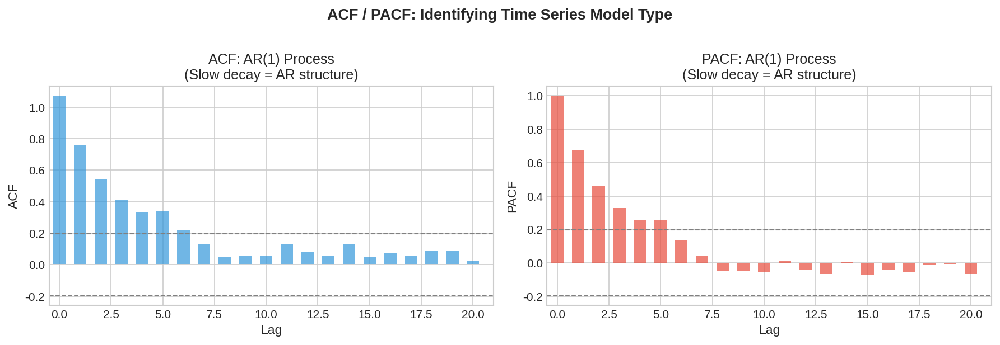
*图7.1.6 ACF与PACF。ACF衡量直接相关性，PACF衡量剔除中间步影响后的直接相关性*

**自相关函数（ACF）**：度量 $y_t$ 与 $y_{t-k}$ 的相关性。
**偏自相关函数（PACF）**：去除中间滞后项的影响后，$y_t$ 与 $y_{t-k}$ 的偏相关。

**Box-Jenkins 识别法则**：

| 模型 | ACF | PACF |
|------|-----|------|
| AR(p) | 拖尾 | p 阶截尾 |
| MA(q) | q 阶截尾 | 拖尾 |
| ARMA(p,q) | 拖尾 | 拖尾 |

### 7.1.6 ARIMA 模型

ARIMA$(p,d,q)$ = 对 $d$ 阶差分后的序列拟合 ARMA$(p,q)$：
$$y'_t = c + \sum_{i=1}^{p}\phi_i y'_{t-i} + \varepsilon_t + \sum_{j=1}^{q}\theta_j\varepsilon_{t-j}$$

其中 $y'_t = \Delta^d y_t$。

**季节性 ARIMA**（SARIMA）：增加季节性 AR 和 MA 项，记为 ARIMA$(p,d,q)\times(P,D,Q)_s$。

```java
import com.yishape.lab.math.timeseries.model.UnifiedARIMAModel;
import com.yishape.lab.math.timeseries.ForecastResult;

// 创建 ARIMA 模型
// UnifiedARIMAModel arima = new UnifiedARIMAModel();
// arima.setOrder(p, d, q);
// arima.fit(data);

// 预测未来 h 步
// ForecastResult forecast = arima.forecast(h);
// var pointForecasts = forecast.getPointForecasts();
// double[][] confidenceIntervals = forecast.getConfidenceIntervals();
```

### 7.1.7 指数平滑

指数平滑族用加权平均做预测，近期观测权重更大。

| 方法 | 趋势 | 季节性 | 参数 |
|------|------|--------|------|
| 简单指数平滑 | 无 | 无 | $\alpha$ |
| Holt 线性 | 有（线性） | 无 | $\alpha, \beta$ |
| Holt-Winters | 有 | 有（加法/乘法） | $\alpha, \beta, \gamma$ |

```java
import com.yishape.lab.math.timeseries.model.ExponentialSmoothingModels;

// ExponentialSmoothingModels.ETS model = new ExponentialSmoothingModels();
// model.setTrend("additive");
// model.setSeasonal("additive", period);
// model.fit(data);
```

### 7.1.8 GARCH：波动率建模

金融时间序列常呈现**波动率聚类**——大波动后跟随大波动，小波动后跟随小波动。**GARCH**$(p,q)$ 模型刻画这种条件异方差：
$$\sigma_t^2 = \omega + \sum_{i=1}^{p}\alpha_i\varepsilon_{t-i}^2 + \sum_{j=1}^{q}\beta_j\sigma_{t-j}^2$$

用于风险价值（VaR）计算和期权定价。

```java
import com.yishape.lab.math.timeseries.model.GARCHModel;

// GARCHModel garch = new GARCHModel(1, 1);  // GARCH(1,1)
// garch.fit(returns);
// var conditionalVolatility = garch.getConditionalVolatility();
```

### 7.1.9 多变量模型：VAR 与协整

**VAR（向量自回归）**：多个时间序列互相影响
$$\mathbf{y}_t = \mathbf{c} + \sum_{i=1}^{p}\mathbf{\Phi}_i\mathbf{y}_{t-i} + \boldsymbol{\varepsilon}_t$$

**协整**：两个非平稳序列的线性组合可能是平稳的，意味着它们存在长期均衡关系。协整关系导出**误差修正模型（ECM）**。

```java
import com.yishape.lab.math.timeseries.model.VARModel;

// double[][] multiData = {/* 多变量时间序列 */};
// VARModel var = new VARModel(2);  // VAR(2)
// var.fit(multiData);
```

### 7.1.10 残差诊断

模型拟合后必须检验残差是否接近白噪声：
- **ACF 图**：残差自相关应全部在置信带内
- **Ljung-Box 检验**：检验多个滞后的联合自相关是否为零
- **正态性检验**：残差分布是否接近正态（影响置信区间的有效性）

### 7.1.11 与第 4 章统计学的联系

- 残差的独立同分布假设常被违背，需用专门检验（Ljung-Box、ARCH 检验）
- 预测区间依赖于残差方差的正确估计
- 模型选择中的信息准则（AIC、BIC）在第 4.3 节已有介绍

### 7.1.12 小结

- 时间序列分析的核心是处理**自相关**和**非平稳性**
- 标准流程：可视化 → 变换 → 分解 → 建模 → 诊断 → 预测
- ARIMA 适用于单变量序列，VAR 适用于多变量互相影响
- GARCH 用于波动率建模，是金融风险管理的核心工具
- 残差诊断是验证模型假设的必要步骤

### 7.1.13 自测与练习

1. 对一个有趋势和季节性的序列做经典分解，画出趋势、季节和残差成分
2. 画出某序列的 ACF 和 PACF 图，判断适合的 ARMA 阶数
3. 用 AIC 比较 AR(1)、AR(2)、MA(1) 模型的拟合优度
4. 解释：为什么对非平稳序列直接做回归可能产生「伪回归」？
5. 用 GARCH(1,1) 对股票收益率建模，计算 95% VaR

---

**下一节**：[7.2. signal processing.md](7.2. signal processing.md)

> **⚠️ 常见误区**
> - **对非平稳序列直接拟合 ARMA**：ARMA 要求序列平稳（均值、方差、自协方差不随时间变化）。先做 ADF 检验（或 KPSS 检验），非平稳序列需要差分（ARIMA）或其他变换。
> - **用训练期误差评估预测质量**：时间序列不能随机划分训练/测试集——测试集必须在训练集之后。用滚动窗口或最后 $h$ 步作为测试期。

---

## 本节 API 一览

| 场景 | API | 说明 |
|------|-----|------|
| 创建时序分析器 | `TSA.analyzer(series, name)` | 创建 TimeSeriesAnalyzer 实例 |
| 快速诊断 | `analyzer.quickAnalyze()` | 自动检测趋势/季节/平稳性 |
| 经典分解（加法） | `TSA.decompose.classical(series, period, ADDITIVE)` | 趋势+季节+残差（加法模型） |
| 经典分解（乘法） | `TSA.decompose.classical(series, period, MULTIPLICATIVE)` | 趋势×季节×残差（乘法模型） |
| STL 分解 | `TSA.decompose.stl(series, period, seasonalWindow, trendWindow)` | 鲁棒时序分解 |
| ARIMA 预测 | `TSA.forecast.arima(series, p, d, q, steps)` | ARIMA(p,d,q) 模型预测 |
| 指数平滑 | `TSA.forecast.expSmooth(series, alpha, steps)` | 简单指数平滑预测 |
| Holt-Winters | `TSA.forecast.holtWinters(series, alpha, beta, gamma, period, steps)` | 三参数指数平滑 |
| 自动预测 | `TSA.forecast.auto(series, steps)` | 自动选择最优模型 |
| 移动平均滤波 | `TSA.filter.movingAverage(series, window)` | 平滑去噪 |
| 低通滤波 | `TSA.filter.lowPass(series, cutoff, fs)` | 去除高频噪声 |
| 高通滤波 | `TSA.filter.highPass(series, cutoff, fs)` | 去除低频趋势 |
| 带通滤波 | `TSA.filter.bandPass(series, low, high, fs)` | 保留特定频段 |
| 自适应滤波 | `TSA.filter.adaptive(series, mu, order)` | LMS 自适应滤波 |
| 指数平滑滤波 | `TSA.filter.expSmooth(series, alpha)` | 指数加权移动平均 |
| 高斯滤波 | `TSA.filter.gaussian(series, sigma)` | 高斯核平滑 |
| 中值滤波 | `TSA.filter.median(series, window)` | 保留边缘的非线性滤波 |
| Engle-Granger 协整 | `TSA.cointegrate.engleGrangerTest(y, x, maxLags)` | 两变量协整检验 |
| Johansen 协整 | `TSA.cointegrate.johansenTest(data, maxLags, trendType)` | 多变量协整检验 |
| 误差修正模型 | `TSA.cointegrate.estimateECM(deltaY, deltaX, residuals, maxLags)` | ECM 估计 |
| ADF 平稳检验 | `Stats.tester.testUnitRoot(series)` | p<0.05 则拒绝非平稳 |
| 滚动预测 | `result.forecast(steps)` | 向前 h 步预测 |

> **⚠️ 注意**：时序数据不能用随机划分训练/测试集——测试集必须在训练集之后，用滚动窗口。

## 章节练习 / Exercises

**1. 趋势-季节性分解（应用题）**

读取航班乘客数据（AirPassengers 数据集），用加法模型分解为趋势、季节性和残差三部分，绘制原始序列和分解后的三个分量。

**2. 差分平稳化（计算题）**

对随机游走序列 x[t] = x[t-1] + ε[t]（ε ~ N(0,1)），进行一阶差分，验证差分后序列的均值和方差是否接近常数。


---

## 7.1.11 时间序列构建与数据转换 / Time Series Construction

### 7.1.11.1 从原始数据创建时序

```java
// 从 double[] 创建时间序列
double[] values = {1.2, 2.5, 3.1, 4.8, 5.2};
var ts = TimeSeries.createTimeSeries(values, frequency = 12);
// frequency: 12=月度, 4=季度, 252=日度(交易日)

// 指定日期索引
var dates = new String[]{"2020-01", "2020-02", "2020-03", "2020-04", "2020-05"};
var tsDated = TimeSeries.createTimeSeries(values, dates);
```

### 7.1.11.2 从 DataFrame 创建

```java
// 假设 df 有 date, value, category 三列
var ts = TimeSeries.createTimeSeries(
    df, 
    dateColumn = "date", 
    valueColumn = "value",
    frequency = 252  // 日度
);

// 提取数值序列
double[] prices = ts.values();

// 获取日期索引
String[] dates = ts.dates();
```

### 7.1.11.3 滚动窗口统计

```java
// 滚动均值和标准差（窗口=20）
double[] rollingMean = ts.rolling(20).mean();
double[] rollingStd = ts.rolling(20).std();

// 滚动相关性（两只股票）
double[] rollingCorr = ts.rollingCorrelation(stockA, stockB, window = 30);
```

---

## 7.1.12 平稳性检验补充 / Stationarity Tests

### 7.1.12.1 KPSS 检验（与 ADF 对比）

ADF 检验的原假设是「序列非平稳」（有单位根），KPSS 检验的原假设是「序列平稳」——两者是互补的。

| 检验 | 原假设 H₀ | 结论 |
|------|-----------|------|
| ADF | 非平稳（拒绝 H₀ = 认为是平稳）| 若 p < α，拒绝 H₀ → 平稳 |
| **KPSS** | **平稳（拒绝 H₀ = 认为非平稳）**| 若 p < α，拒绝 H₀ → 非平稳 |

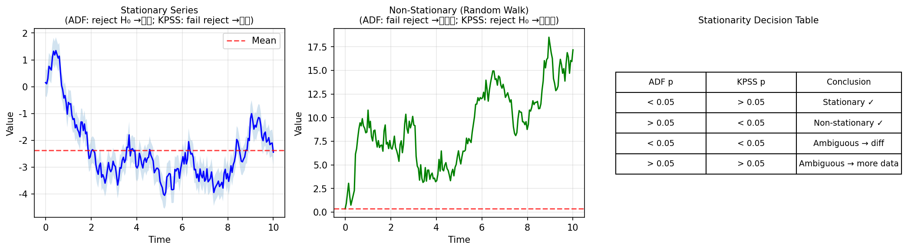
*图 new.fig_kpss_adf_test ADF与KPSS检验对比：两种检验原假设相反，互补使用可准确判断平稳性。*

```java
// ADF 检验
var adf = TimeSeries.adfTest(series);
System.out.println("ADF 统计量: " + adf.statistic());
System.out.println("p值: " + adf.pValue());  // p < 0.05 → 拒绝单位根 → 平稳

// KPSS 检验
var kpss = TimeSeries.kpssTest(series);
System.out.println("KPSS 统计量: " + kpss.statistic());
System.out.println("p值: " + kpss.pValue());  // p < 0.05 → 拒绝平稳 → 非平稳
```

> ⚠️ **实战建议**  
> **同时用 ADF 和 KPSS 做平稳性判断**：
> - ADF 拒绝 + KPSS 不拒绝 → 平稳 ✅
> - ADF 不拒绝 + KPSS 拒绝 → 非平稳 ✅
> - 两者都拒绝 → 需要差分
> - 两者都不拒绝 → 结果不确定（少见）

### 7.1.12.2 季节性分解


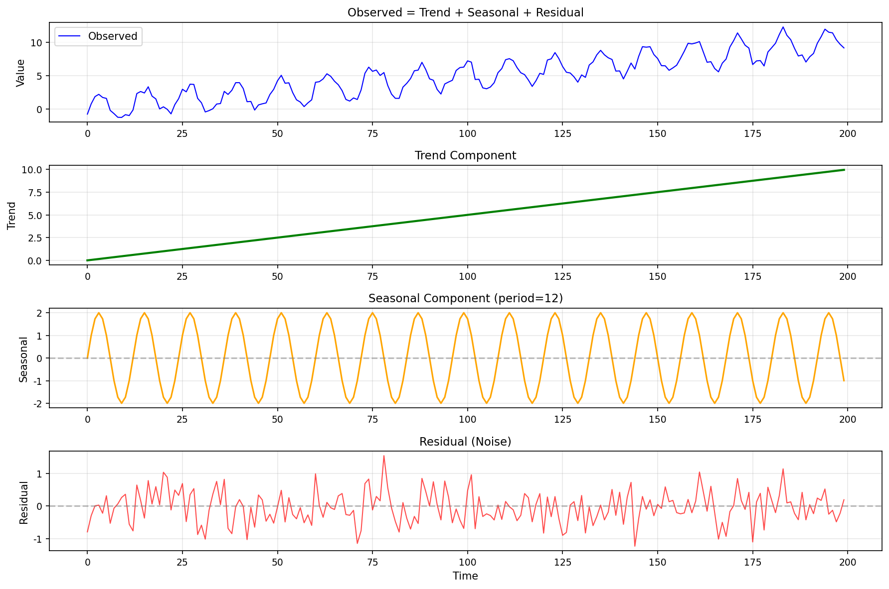
*图 new.fig_seasonal_decomposition STL分解将时序拆解为趋势、季节和残差三部分，加法模型：Y(t)=T(t)+S(t)+R(t)。*
```java
// STL 分解（加法模型）
import com.yishape.lab.math.timeseries.decomposition.TimeSeriesDecomposition;
var stlResult = TSA.decompose.stl(series, 12, 7, 0);  // period=12, seasonalWindow=7, trendWindow=0(自动)
var trend = stlResult.getTrend();       // 趋势成分
var seasonal = stlResult.getSeasonal(); // 季节成分
var resid = stlResult.getResidual();    // 残差

// 经典分解（加法模型，适合趋势线性增长的数据）
var addResult = TSA.decompose.classical(series, 12,
    TimeSeriesDecomposition.DecompositionModel.ADDITIVE);

// 经典分解（乘法模型，适合增长率相对稳定的数据）
var multiResult = TSA.decompose.classical(series, 12,
    TimeSeriesDecomposition.DecompositionModel.MULTIPLICATIVE);
```


### 7.1.13 X13 季节调整方法

X13-ARIMA-SEATS（简称 X13）是美国人口普查局开发的季节调整方法，比 STL 更复杂，适合官方统计数据的季节调整。

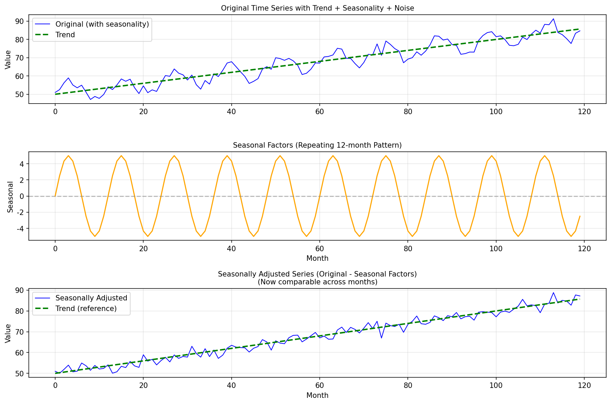
*图 new.fig_x13_seasonal X13季节调整将原始序列分解为趋势、季节因子和季节调整后序列，适合官方统计数据。*

```java
// X13 季节调整
var x13 = TimeSeries.x13Decompose(
    series, 
    model = "RSA=3",     // 自动检测季节调整模型
    transform = "log",   // 对数变换（适合乘法模型）
    seasonal = 12        // 月度数据
);

// 输出
double[] sa = x13.seasonallyAdjusted();  // 季节调整后序列
double[] sf = x13.seasonalFactors();     // 季节因子
double[] trend = x13.trend();            // 趋势
```

> 与 STL 的区别：
> - **STL**：完全非参数，基于LOESS平滑，更灵活
> - **X13**：参数模型（ARIMA），提供置信区间，更适合预测
> - **实际选择**：探索性分析用 STL，正式报告用 X13

