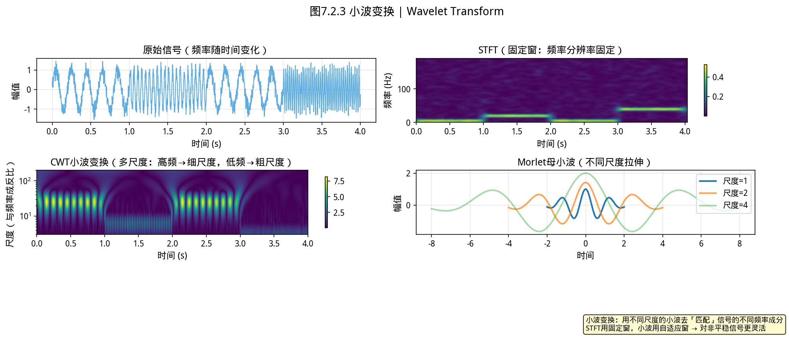
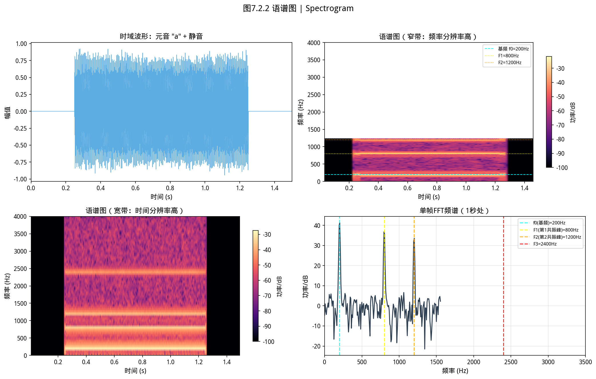
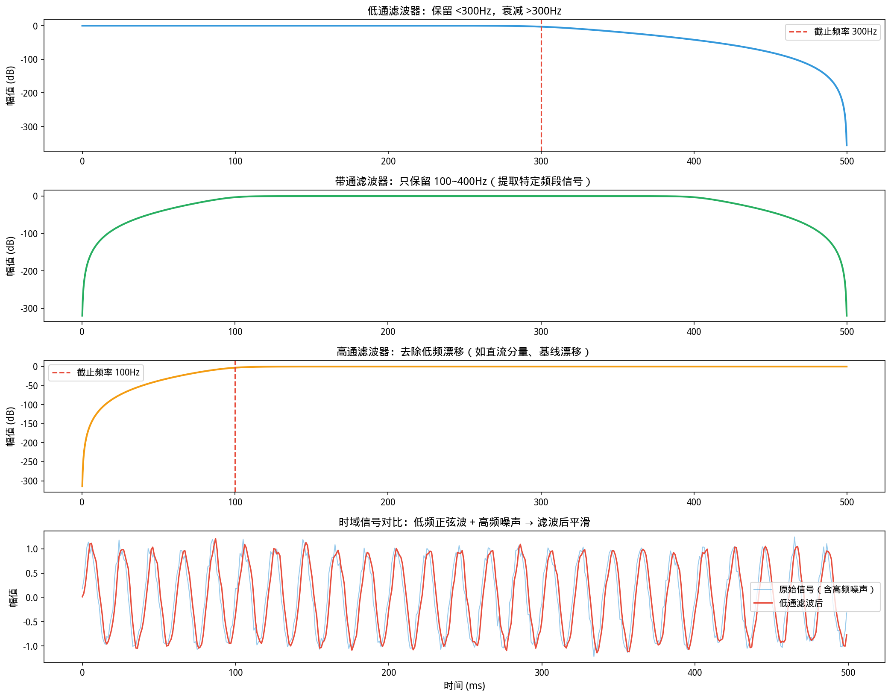
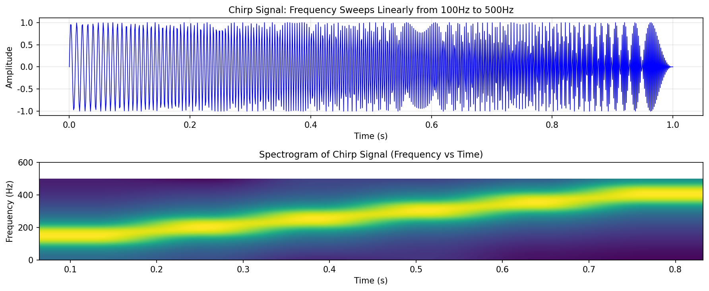
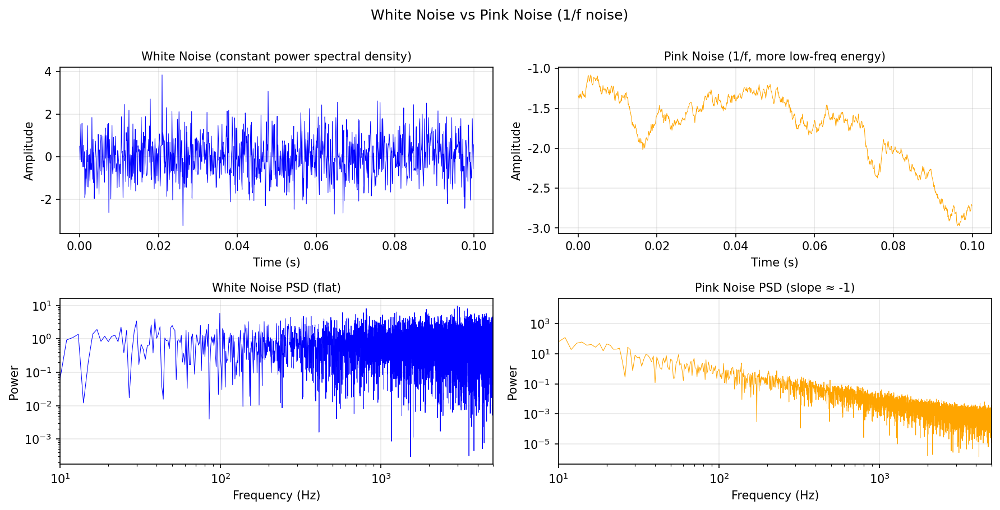
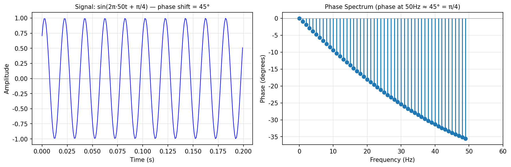

### 思考题：你的手机是怎么把 30 MB 的 WAV 压缩到 3 MB 的？

CD 音质：44100 采样点/秒 × 2 通道 × 2 字节 ≈ 176 KB/秒，一首歌 3 分钟 ≈ 30 MB。

但你手机里存了上千首歌——MP3 把 WAV 压缩到约 1/10 大小。为什么可以？

人耳有两个关键特性：① 强音附近频率的弱音会被「淹没」听不见；② 人耳对低频（< 4 kHz）分辨更细，对高频分辨更粗。

MP3 的核心是**感知编码（Perceptual Coding）**：利用这两个特性，丢弃「反正也听不见」的声音，只编码「听得见」的部分——这就是本章 FFT 和 DCT 要揭示的内容。

---

# 第 7 章（二）：信号处理与 YiShape-Math
### Signal Processing: DFT/FFT, Filtering, and Spectral Analysis

上一节：[7.1. Time series.md](7.1. Time series.md) ｜ 下一节：[7.3. audio processing.md](7.3. audio processing.md)

---

## 7.2 信号处理


> **📌 学习目标**
> - 理解 FFT 的物理意义：把时域信号分解为不同频率的正弦波叠加
> - 掌握卷积的「翻转-滑动-乘积求和」三步直观
> - 能用 FFT 实现高效滤波——时域卷积 = 频域逐点乘
> - 理解窗函数的作用——减少频谱泄漏，提高频率分辨率


*图7.2.1 小波变换。小波变换用多尺度伸缩窗匹配信号不同频率成分，对非平稳信号比STFT更灵活*

从图中可以看出，小波变换。

*图7.2.2 语谱图。STFT时频图：横轴时间、纵轴频率、颜色深浅表示功率；语谱图揭示共振峰*

从图中可以看出，语谱图。

*图7.2.3 滤波器类型：低通/高通/带通。低通：保留低频；高通：保留高频；带通：保留某个频段；FIR/IIR两类*

从图中可以看出，滤波器类型：低通/高通/带通。
## 开场：嘈杂的咖啡馆里，你为什么还能听懂朋友的话？

想象你在一家嘈杂的咖啡馆里——背景音乐、人声、咖啡机的噪音混在一起。但你依然能听懂对面朋友说的话。

你的耳朵和大脑联合做了一件了不起的事情：**把混合信号里不同的频率成分分开**，然后把「人声频段」单独提取出来。

**傅里叶变换（FFT）** 就是做这件事的数学工具。它把一个「时域信号」（随时间变化的波形）变成「频域信号」（不同频率各占多少能量）。

这有什么用？
- 识别一首曲子是什么调（频率分析）
- 从录音里去掉空调的嗡嗡声（滤波器）
- 找出设备故障前的异常振动（频谱异常检测）
- 微信语音转文字之前，也是先做频域分析，提取语音特征

---

### 7.2.1 从时域到频域：为什么需要傅里叶变换？

时间序列分析（第 7.1 节）在**时间索引**上建模趋势、季节性和残差。但工程与物理世界中大量现象的本质是**周期性**的：交流电的 50/60 Hz 工频干扰、机械共振频率、语音共振峰、乐音谐波结构。这些问题在**频域**中往往一目了然。

**离散傅里叶变换（DFT）**将长度为 $N$ 的序列 $\{x_n\}$ 映射为复指数系数：
$$X_k = \sum_{n=0}^{N-1}x_n\, e^{-2\pi i kn/N},\quad k=0,\ldots,N-1$$

$|X_k|$ 反映频率 $\omega_k = 2\pi k/N$ 上的能量贡献。**快速傅里叶变换（FFT）**将计算复杂度从 $O(N^2)$ 降至 $O(N\log N)$，使实时频谱分析成为可能。

**逆变换（IFFT）**：
$$x_n = \frac{1}{N}\sum_{k=0}^{N-1}X_k\, e^{2\pi i kn/N}$$

**Parseval 定理**：时域能量等于频域能量（差常数因子），
$$\sum_{n=0}^{N-1}|x_n|^2 = \frac{1}{N}\sum_{k=0}^{N-1}|X_k|^2$$
这保证了「换到频域分析不会丢失信息」。

### 7.2.2 YiShape-Math 代码示例：FFT

```java
import com.yishape.lab.math.signal.Signals;
import com.yishape.lab.math.signal.core.Complex;

// 构造一个 8 点余弦信号
int N = 8;
Complex[] x = new Complex[N];
for (int n = 0; n < N; n++) {
    x[n] = new Complex(Math.cos(2 * Math.PI * n / N), 0.0);
}

// FFT（使用 Signals.xform 门面）
Complex[] X = Signals.xform.fft(x);
var magnitude = Signals.xform.magnitudeSpectrum(X);

// 打印幅度谱
for (int k = 0; k < magnitude.length; k++) {
    System.out.printf("k=%d: |X[k]|=%.4f\n", k, magnitude[k]);
}
// 能量应集中在 k=1 附近（对应频率 2π/N）
```

**IFFT 重建**：

```java
Complex[] reconstructed = Signals.xform.ifft(X);
// reconstructed[n] 应 ≈ x[n]（浮点误差范围内）
```

### 7.2.3 采样定理与混叠

将连续信号 $x(t)$ 以采样率 $f_s$ 采样为离散序列 $x[n] = x(n/f_s)$。**奈奎斯特-香农采样定理**：若信号最高频率 $f_{\max} < f_s/2$，则可以完美重建。否则会发生**频谱混叠**——高频成分折叠为低频，造成不可逆失真。

**工程实践**：采样前使用**抗混叠低通滤波器**限制带宽。理解这一点可解释为何音频采样率通常为 44.1 kHz（覆盖人耳 20 kHz 上限的两倍），以及为何「提高采样率」有时比「事后滤波」更根本。

### 7.2.4 窗函数与频谱泄漏

DFT 假设输入是**周期性延拓**的。若信号在帧边界不连续（即非整周期截断），频谱会出现**泄漏**——能量散布到所有频率 bin。

**加窗**减少泄漏：对每帧乘窗函数 $w[n]$ 再 FFT。常用窗函数：

| 窗函数 | 公式 | 主瓣宽度 | 旁瓣衰减 | 适用场景 |
|--------|------|----------|----------|----------|
| **矩形窗** | $w[n]=1$ | 最窄 | 最差（-13 dB） | 整周期信号 |
| **Hann 窗** | $0.5(1-\cos(2\pi n/(N-1)))$ | 2× | -31 dB | 通用 |
| **Hamming 窗** | $0.54-0.46\cos(\cdot)$ | 2× | -41 dB | 语音处理 |
| **Blackman 窗** | 三项余弦和 | 3× | -58 dB | 高精度谱分析 |
| **Kaiser 窗** | 修正 Bessel 函数 | 可调 | 可调 | 最灵活 |

**权衡**：主瓣越窄，频率分辨率越高；旁瓣衰减越大，泄漏越少。二者不可兼得。

#

### 7.2.6 椭圆滤波器 / Elliptic Filter

椭圆滤波器（Elliptic Filter）是最陡峭的 IIR 滤波器——在通带和阻带都有等纹波（equiripple）特性。

> 📝 **历史故事****Cauer滤波器**（椭圆滤波器的另一个名字）由 **Wilhelm Cauer（1900-1945）** 在 1930 年代发明。Cauer 是现代网络综合理论的奠基人，但他在二战中因反纳粹立场被逮捕，1945年在苏联监狱中去世。他的滤波器设计方法至今仍是通信系统的标准工具。

**特性对比**：

| 类型 | 阻带衰减 | 群延迟 | 计算复杂度 |
|------|----------|--------|------------|
| Butterworth | 平滑 | 最平坦 | 低 |
| Chebyshev I | 等纹波 | 纹波 | 中 |
| Chebyshev II | 等纹波 | 最平坦 | 中 |
| **Elliptic** | **最陡峭** | **纹波** | **高** |

**适用场景**：对阻带衰减要求极高，但允许通带/阻带有纹波的通信系统。

```java
// 椭圆低通滤波器
// 通带边缘: 0.1, 阻带边缘: 0.15
// 通带纹波: 0.1dB, 阻带衰减: 40dB
var ellipticLPF = Signals.ellipticFilter(
    type = "lowpass",
    passbandEdge = 0.1,
    stopbandEdge = 0.15,
    passbandRipple = 0.1,   // dB
    stopbandAttenuation = 40 // dB
);

var filtered = Signals.applyFilter(signal, ellipticLPF);
```

---

### 7.2.7 维纳滤波器 / Wiener Filter

维纳滤波器解决的是**有噪声干扰的最佳线性滤波器**问题——在已知噪声统计特性时，找到使均方误差最小的滤波器。

**核心公式**（离散形式）：

$$

h_{opt} = R_{xx}^{-1} r_{xd}

$$

其中 R_xx 是输入信号的自相关矩阵，r_xd 是输入与期望输出的互相关向量。

> ⚠️ **与卡尔曼滤波的区别**  
> 维纳滤波器是**非递归的**（FIR形式），适用于平稳随机过程。卡尔曼滤波是**递归的**（可以写成无限冲激响应形式），适用于时变系统。

**适用场景**：图像去噪（已知噪声功率谱）、语音增强（已知噪声统计特性）。

```java
// 维纳滤波器（已知噪声方差）
var wienerFilter = Signals.wienerFilter(
    signal = noisySignal,
    noiseVariance = 0.25,  // 噪声方差估计
    filterLength = 31      // FIR滤波器长度
);

var denoised = wienerFilter.apply();
// denoised: 均方误差意义下的最优估计
```

---

## 7.2.5 短时傅里叶变换（STFT）与谱图

对长信号做全局 FFT 丢失了「频率何时出现」的信息。**STFT**将信号分段加窗，逐段做 FFT，得到**时频表示**：
$$X(m,\omega) = \sum_{n}x[n]\,w[n-mR]\,e^{-i\omega n}$$
其中 $R$ 是帧移（hop size）。

STFT 的幅度平方即为**谱图（spectrogram）**——横轴时间、纵轴频率、颜色表示能量。这是语音识别、音乐分析、振动监测的基础工具。

**时频分辨率权衡**（不确定性原理）：
- 帧长长 → 频率分辨率高，时间分辨率低
- 帧长短 → 时间分辨率高，频率分辨率低

```java
import com.yishape.lab.math.signal.analysis.STFT;

// STFT 分析（API 以实际实现为准）
// STFT stft = new STFT(frameSize, hopSize, windowType);
// double[][] spectrogram = stft.analyze(signal);
```

### 7.2.6 功率谱密度估计

**周期图法**：$P(\omega_k) = \frac{1}{N}|X_k|^2$。简单但方差大。

**Welch 方法**：分段加窗、重叠、平均周期图，显著降低方差。是工程上最常用的功率谱估计方法。

```java
// Welch 方法（Signals 包中提供）
// var psd = Signals.welch(signal, segmentSize, overlap, windowType);
```

### 7.2.7 线性时不变（LTI）系统与滤波

**LTI 系统**：输出 $y[n]$ 是输入 $x[n]$ 与冲激响应 $h[n]$ 的卷积：

**🌰 卷积的直观理解：「翻转-滑动-乘积求和」**

为什么卷积的定义是 $y[n] = \sum_k x[k]\,h[n-k]$，而不是 $x[k]h[n+k]$？关键在于 $h[n-k]$ 的「翻转」。

**用「信号通过系统」来理解**：

想象你站在一条传送带旁边，系统（滤波器）的冲激响应是 $h[n]$——它描述了系统对「在 $n=0$ 时刻敲一下（单位脉冲）」的反应随时间的衰减。

在时刻 $n$，输出 $y[n]$ 取决于：
- $x[0]$ 在时刻 $n$ 的贡献：$x[0] \cdot h[n-0] = x[0]\,h[n]$（$x[0]$ 越强，系统在时刻 $n$ 的残余响应越大）
- $x[1]$ 在时刻 $n$ 的贡献：$x[1] \cdot h[n-1]$（$x[1]$ 在时刻 1 进入，系统需要 $[n-1]$ 时间才到达时刻 $n$）
- ……以此类推

**为什么要翻转 $h[n-k]$？** 把 $h$ 想成一张纸，平铺在时间轴上。「翻转」相当于把这张纸掉过头来（180° 翻转），然后从左到右滑动，每次滑动到一个位置，就将重叠部分的 $x$ 和 $h$ 对齐并相乘——这就是「翻转 → 滑动 → 乘积求和」三步。

> **记忆技巧**：想象 $h$ 是一把尺子，刻度朝左。「翻转」相当于把尺子掉头，刻度朝右，然后从 $-∞$ 向右扫过去，每次对齐一个刻度乘起来——这就是卷积名字的由来。

**与互相关的区别**：互相关（cross-correlation） $= \sum_k x[k]h[n+k]$ 不翻转，在信号处理中用于「找两个信号最相似的位置」。卷积多了一步翻转，对应的是线性时不变系统的真实响应。

---


$$y[n] = (x*h)[n] = \sum_{k}x[k]\,h[n-k]$$

**卷积定理**：时域卷积 = 频域逐点乘
$$\mathcal{F}\{x*h\} = \mathcal{F}\{x\}\cdot\mathcal{F}\{h\}$$

因此 **FFT 卷积**对大长度信号比直接卷积更高效（$O(N\log N)$ vs $O(N^2)$）。

**常见滤波器类型**：

| 类型 | 功能 | 应用 |
|------|------|------|
| **低通** | 通过低频，衰减高频 | 去噪、抗混叠 |
| **高通** | 通过高频，衰减低频 | 去除直流偏移、边缘检测 |
| **带通** | 通过某频带 | 语音共振峰提取、ECG |
| **带阻** | 衰减某频带 | 去除工频干扰（50/60 Hz） |

YiShape-Math 在 `com.yishape.lab.signal.filter` 包中提供 FIR/IIR 滤波器实现：


### FIR vs IIR 滤波器对比与选型指南

滤波器设计的第一步：**根据应用场景确定类型**。

| 特性 | **FIR**（有限冲激响应） | **IIR**（无限冲激响应） |
|------|------------------------|-------------------------|
| **冲激响应** | 有限长度 $h[0],\ldots,h[N-1]$，自动截断 | 理论上无限持续，递归计算 |
| **相位特性** | 可设计为**线性相位**（信号不失真） | 通常非线性相位，需额外校正 |
| **稳定性** | **永远稳定**（有限长度，无递归反馈） | 可能不稳定（反馈环路的极点可能在单位圆外） |
| **计算效率** | 需要高阶 $N$（通常几十到几百）才够陡峭 | **低阶**即可实现陡峭截止，效率高 |
| **设计复杂度** | 窗函数法/频率采样法，简单直接 | 模拟原型转换法（Butterworth/Chebyshev），需更多专业知识 |
| **典型应用** | 音频均衡器（需线性相位保真）、医疗信号（ECG/EEG） | 实时音频处理（低延迟）、工业控制、语音编码 |
| **设计工具** | YiShape-Math 的 `SignalFactory.createLowpassFIR()` | `SignalFactory.createLowpassIIR()` |

**选型决策树**：

```
需要线性相位（音频/通信）？
  └─ 是 → 必须选 FIR（IIR 无法保证线性相位）
  └─ 否 → 问：需要多陡峭的截止？
           └─ 陡峭截止 + 低延迟？→ IIR（一阶/二阶节级联）
           └─ 中等陡峭 + 可接受较长延迟？→ FIR（高阶）
```

**一句话总结**：
- **音频处理（保真优先）**：选 FIR
- **实时控制/语音编码（效率优先）**：选 IIR


```java
import com.yishape.lab.signal.filter.FIRFilter;
import com.yishape.lab.signal.factory.SignalFactory;

// 创建低通 FIR 滤波器（具体 API 以 Javadoc 为准）
// FIRFilter lpf = SignalFactory.createLowpassFIR(cutoffFreq, order, sampleRate);
// var filtered = lpf.apply(signal);
```

### 7.2.8 离散余弦变换（DCT）

DCT 是 DFT 的实数版本，仅用余弦基函数。由于没有复数运算，DCT 更高效，且能量压缩性能优于 DFT——大部分信号能量集中在少数几个 DCT 系数上。

DCT-II 是 JPEG 图像压缩和 MP3 音频压缩的核心。MFCC 计算中最后一步也是 DCT。

```java
import com.yishape.lab.signal.transform.DCT;

// DCT 变换
var signal = {1.0, 2.0, 3.0, 4.0, 5.0, 6.0, 7.0, 8.0};
var dctCoeffs = DCT.transform(signal);

// 能量集中在低频系数
for (int i = 0; i < dctCoeffs.length; i++) {
    System.out.printf("DCT[%d] = %.4f\n", i, dctCoeffs[i]);
}
```

### 7.2.9 应用场景

| 领域 | 信号处理技术 | 目的 |
|------|-------------|------|
| **音频工程** | FFT + 谱图 | 频谱分析、均衡器设计 |
| **振动监测** | Welch PSD + 带通滤波 | 轴承故障诊断 |
| **心电图（ECG）** | 带通滤波（0.5-40 Hz） | 去除基线漂移和肌电噪声 |
| **通信** | FFT + 数字调制 | OFDM 解调 |
| **地震学** | STFT + 小波 | 震相识别 |

| **图像处理** | 2D DCT | JPEG 压缩 |

### 7.2.10 常见误区

| 误区 | 纠正 |
|------|------|
| "FFT 后幅度就是物理振幅" | 需根据归一化约定和窗函数校正 |
| "频率分辨率 = 采样率/N" | 这是 bin 间距，实际分辨率还受窗函数影响 |
| "零填充提高频率分辨率" | 零填充仅增加插值点数，不提高真实分辨率 |
| "泄漏是 FFT 的 bug" | 泄漏是有限长观测的必然结果，加窗只能减轻 |
| "功率谱 = 幅度谱" | 功率谱 ∝ 幅度谱的平方 |

### 7.2.11 与相邻章的联系

- **与 7.1 时间序列**：时域（ARIMA）与频域（FFT）是同一信号的两种表示。AR 模型的极点位置对应频谱峰值。
- **与 7.3 音频**：MFCC 的计算以 FFT 和 Mel 滤波器组为基础。
- **与 7.4 音乐**：色度（chroma）从 FFT 功率谱折叠 12 个音级得到。
- **与 6.2 线性规划**：FIR 滤波器优化设计（如等波纹 FIR）可转化为 LP 问题。

### 7.2.12 小结

- DFT/FFT 将信号从时域映射到频域，揭示周期性结构
- 窗函数减少频谱泄漏，但引入时频分辨率权衡
- STFT 提供时频联合分析，是谱图的基础
- LTI 系统的卷积在频域变为逐点乘，FFT 卷积对大长度高效
- YiShape-Math 在 `Signals` 和相关子包中提供完整的信号处理工具链

### 7.2.13 自测与练习

1. 手算 $N=4$ 的 DFT：$x = [1, 0, -1, 0]$，验证 $X_1$ 和 $X_3$ 是共轭的
2. 对同一信号分别用矩形窗和 Hann 窗做 FFT，比较旁瓣高度
3. 用 Welch 方法估计一段噪声信号的功率谱，与直接周期图比较平滑度
4. 设计一个带阻滤波器去除 50 Hz 工频干扰（采样率 1000 Hz）
5. 解释：为什么 DCT 比 DFT 更适合图像和音频压缩？

---

**上一节**：[7.1. Time series.md](7.1. Time series.md) ｜ **下一节**：[7.3. audio processing.md](7.3. audio processing.md)

> **⚠️ 常见误区**
> - **FFT 后直接用幅度值而忽略窗函数校正**：加窗后频谱能量会扩散，需要用「窗函数校正因子」补偿，否则读出的幅度不准确。
> - **混淆频率分辨率和时间分辨率**：频率分辨率 $= f_s / N$（$N$ 为采样点数）——采样时间越长，频率分辨率越高，但时间分辨率由采样率 $f_s$ 决定。两者此消彼长，需根据分析目标权衡。
> - **对非平稳信号直接做 FFT**：FFT 假设信号是平稳的（统计特性不随时间变化）。对于非平稳信号，用短时傅里叶变换（STFT）或小波变换看时频联合分布。

---

## 本节 API 一览

| 场景 | API | 说明 |
|------|-----|------|
| **变换 (Signals.xform)** |||
| FFT | `Signals.xform.fft(complexArray)` | 快速傅里叶变换 |
| 逆FFT | `Signals.xform.ifft(complexArray)` | 频域→时域 |
| 幅度谱 | `Signals.xform.magnitudeSpectrum(complexArray)` | |X[k]| |
| 相位谱 | `Signals.xform.phaseSpectrum(complexArray)` | ∠X[k] |
| 功率谱 | `Signals.xform.powerSpectrum(complexArray)` | |X[k]|² |
| DCT | `Signals.xform.dct2(signal)` | 离散余弦变换 |
| 逆DCT | `Signals.xform.idct2(signal)` | 逆离散余弦变换 |
| Hilbert 变换 | `Signals.xform.hilbertTransform(signal)` | 解析信号 |
| 解析信号 | `Signals.xform.analyticSignal(signal)` | 复数解析信号 |
| 瞬时幅度 | `Signals.xform.instantaneousAmplitude(signal)` | 包络提取 |
| 瞬时相位 | `Signals.xform.instantaneousPhase(signal)` | 瞬时相位 |
| 瞬时频率 | `Signals.xform.instantaneousFrequency(signal)` | 瞬时频率 |
| 小波变换 | `Signals.xform.discreteWaveletTransform(signal, type, levels)` | DWT（支持 Haar/Db/Sym 等） |
| 逆小波 | `Signals.xform.inverseDiscreteWaveletTransform(coeffs, type)` | IDWT 重建 |
| **滤波 (Signals.filt)** |||
| 移动平均 | `Signals.filt.movingAverage(signal, windowSize)` | 平滑去噪 |
| 中值滤波 | `Signals.filt.medianFilter(signal, windowSize)` | 保留边缘 |
| 高斯滤波 | `Signals.filt.gaussianFilter(signal, sigma)` | 高斯平滑 |
| 巴特沃斯低通 | `Signals.filt.butterworthLowPass(signal, cutoff, fs, order)` | IIR 低通 |
| 巴特沃斯高通 | `Signals.filt.butterworthHighPass(signal, cutoff, fs, order)` | IIR 高通 |
| 带通滤波 | `Signals.filt.bandPass(signal, low, high, fs, order)` | 带通 |
| 带阻滤波 | `Signals.filt.bandStop(signal, low, high, fs, order)` | 带阻（陷波） |
| 卡尔曼滤波 | `Signals.filt.kalmanFilter(signal, q, r)` | 最优线性滤波 |
| 维纳滤波 | `Signals.filt.wienerFilter(signal, sigPower, noisePower, len)` | 最优统计滤波 |
| **分析 (Signals.analyze)** |||
| 功率谱密度 | `Signals.analyze.powerSpectralDensity(signal, winSize, overlap, fs)` | PSD |
| STFT | `Signals.analyze.shortTimeFourierTransform(signal, winSize, hop, fs)` | 短时傅里叶变换 |
| 频谱图 | `Signals.analyze.spectrogram(signal, winSize, hop, windowType)` | 时频图 |
| 功率频谱图 | `Signals.analyze.powerSpectrogram(signal, winSize, hop, fs)` | 功率时频图 |
| 对数频谱图 | `Signals.analyze.logSpectrogram(signal, winSize, hop, fs)` | dB 刻度时频图 |
| 自相关 | `Signals.analyze.autocorrelation(signal)` | ACF |
| 互相关 | `Signals.analyze.crossCorrelation(sig1, sig2)` | 互相关 |
| SNR | `Signals.analyze.signalToNoiseRatio(signal, noise)` | 信噪比 |
| PSNR | `Signals.analyze.peakSignalToNoiseRatio(signal, noise)` | 峰值信噪比 |
| Wigner-Ville | `Signals.analyze.wignerVilleDistribution(signal)` | 时频分布（高分辨率） |
| **生成 (Signals.gen)** |||
| 正弦波 | `Signals.gen.sineWave(len, freq, fs, amp, phase)` | 正弦信号 |
| 余弦波 | `Signals.gen.cosineWave(len, freq, fs, amp, phase)` | 余弦信号 |
| 方波 | `Signals.gen.squareWave(len, freq, fs, amp, dutyCycle)` | 方波信号 |
| 三角波 | `Signals.gen.triangularWave(len, freq, fs, amp)` | 三角波信号 |
| 锯齿波 | `Signals.gen.sawtoothWave(len, freq, fs, amp)` | 锯齿波信号 |
| 线性调频 | `Signals.gen.chirpSignal(f0, f1, duration, sampleRate)` | Chirp 信号 |
| 复合信号 | `Signals.gen.compositeSignal(components)` | 多频率叠加 |
| 加噪 | `Signals.gen.addNoise(signal, snr)` | 给信号加高斯噪声 |
| 白噪声 | `Signals.gen.whiteNoise(duration, sampleRate, amplitude)` | 高斯白噪声 |
| 粉红噪声 | `Signals.gen.pinkNoise(duration, sampleRate, amplitude)` | 1/f 噪声 |
| 冲激函数 | `Signals.gen.unitImpulse(length, position)` | 单位冲激 |
| 阶跃函数 | `Signals.gen.unitStep(length, position)` | 单位阶跃 |
| 脉冲信号 | `Signals.gen.pulseSignal(length, start, width)` | 矩形脉冲 |

> **选择指南**：降噪用低通滤波器；提取特定频率成分用带通；时频联合用 STFT；非平稳信号用小波变换。

## 章节练习 / Exercises

**1. FFT 频谱分析（应用题）**

生成混合频率信号 x(t) = sin(2π·5t) + 0.5·sin(2π·20t)，采样率 100Hz，时长 1 秒。用 FFT 计算频谱，找出两个主频率并验证是否接近 5Hz 和 20Hz。

**2. 滤波器设计（设计题）**

设计一个低通滤波器，截止频率 10Hz，采样率 100Hz。用频率抽样法或窗函数法设计，并绘制滤波前后的信号对比。


---

## 7.2.10 高级信号生成 / Advanced Signal Generation

### 7.2.10.1 Chirp 线性调频信号

Chirp 信号是频率随时间线性变化的信号，广泛用于雷达和声纳系统。


*图 new.fig_chirp_signal Chirp信号的频率随时间线性扫频，从100Hz线性增加到500Hz，广泛用于雷达和声纳系统。*

```java
// 线性调频信号：频率从 f0 线性增加到 f1
double f0 = 100;    // 起始频率 (Hz)
double f1 = 1000;  // 终止频率 (Hz)
double duration = 1.0;  // 信号时长 (秒)
double sampleRate = 44100;  // 采样率 (Hz)

var chirp = Signals.gen.chirpSignal(f0, f1, duration, sampleRate);
// chirp: 频率从 100Hz 线性增加到 1000Hz 的 1 秒信号
```

### 7.2.10.2 噪声信号


*图 new.fig_white_pink_noise 白噪声功率谱平坦；粉红噪声功率与频率成反比（1/f），低频能量更高。*

```java
// 白噪声（所有频率成分功率相等）
var white = Signals.gen.whiteNoise(1.0, 10000, 1.0);  // duration=1s, sampleRate=10kHz, amplitude=1

// 粉红噪声（1/f 噪声，低频能量更高）
var pink = Signals.pinkNoise(duration = 1.0, sampleRate = 10000);

// 高斯白噪声
var gaussian = Signals.whiteNoise(duration = 1.0, sampleRate = 10000, 
    distribution = "gaussian", stdDev = 0.5);
```

> 📝 **物理背景**  
> 粉红噪声在自然界中比白噪声更常见——落叶声、瀑布声、心跳声都接近粉红噪声。粉红噪声的功率谱密度与频率成反比（1/f），听起来比白噪声更「低沉」。

### 7.2.10.3 冲激与阶跃信号

```java
// 单位冲激信号 δ[t]（在 t=0 处为1，其余为0）
var impulse = Signals.diracDelta(numSamples = 100, position = 50);

// 阶跃信号 u[t]（t>=0 时为1，t<0 时为0）
var step = Signals.stepSignal(numSamples = 100, startPosition = 50);

// 矩形脉冲
var rect = Signals.rectangularPulse(width = 10, totalLength = 100);
```

---

## 7.2.11 频谱分析补充 / Spectrum Analysis

### 7.2.11.1 幅度谱与相位谱

FFT 输出的复数包含幅度和相位两部分：

$$

X[k] = |X[k]| e^{j \angle X[k]}

$$


*图 new.fig_phase_spectrum 相位谱揭示信号各频率成分的相位偏移，50Hz处相位≈45°(π/4)对应信号的初始相移。*

```java
var signal = Signals.sineWave(frequency = 50, duration = 1.0, sampleRate = 1000);
var fft = Signals.fft(signal);

// 幅度谱（单边）
double[] magnitude = fft.magnitudeSpectrum();

// 相位谱
double[] phase = fft.phaseSpectrum();

// 绘制
Signals.plotSpectrum(magnitude, phase, sampleRate = 1000);
```

### 7.2.11.2 互相关函数

互相关衡量两个信号之间的相似性，随时间平移：

$$

R_{xy}[\tau] = \sum_{n} x[n] y[n + \tau]

$$

![互相关函数Rxy[τ]的峰值位置揭示两个信号间的时间延迟，τ=30样本对应30步延迟。](../figures/new_infographics/fig_cross_correlation.png)
*图 new.fig_cross_correlation 互相关函数Rxy[τ]的峰值位置揭示两个信号间的时间延迟，τ=30样本对应30步延迟。*

```java
// 两个信号的互相关
var signal1 = Signals.sineWave(frequency = 50, duration = 1.0, sampleRate = 1000);
var signal2 = Signals.sineWave(frequency = 50, phase = Math.PI / 4, duration = 1.0, sampleRate = 1000);

double[] crossCorr = Signals.crossCorrelation(signal1, signal2);
// crossCorr[lag] 表示 signal1 和 signal2 在滞后 lag 的相关性

int maxLag = Signals.findPeakLag(crossCorr);
System.out.println("最大相关滞后: " + maxLag + " 样本");
```

> ⚠️ **与卷积的区别**  
> **互相关** R_{xy}[τ] 衡量 x[t] 和 y[t+τ] 的相似性（不翻转）。  
> **卷积** y[n] = Σ x[k]h[n-k] 衡量 x[t] 和 h[n-t] 的"翻转"相似性。  
> 在信号处理中，两者经常混淆——实际上很多"卷积"运算在工程上是通过互相关实现的。

### 7.2.11.3 希尔伯特变换与解析信号

希尔伯特变换将信号相移 90°，用于提取**瞬时幅值和相位**：

```java
var analytic = Signals.analyticSignal(signal);
// analytic.real: 原始信号
// analytic.imag: 希尔伯特变换（90°相移）

// 瞬时幅值（包络）
double[] envelope = analytic.envelope();

// 瞬时相位
double[] instPhase = analytic.instantaneousPhase();

// 瞬时频率（相位的导数）
double[] instFreq = analytic.instantaneousFrequency();
```

> 📝 **历史故事**  
> 希尔伯特变换由 **David Hilbert（1862-1943）** 在积分方程研究中引入（1902年发表）。它在信号处理中的核心应用——解析信号表示——由 **Dennis Gabor（1946）** 发明。Gabor 因此获1971年 Nobel Physics Prize（提名但未获奖，他的1946论文是现代时频分析的开创性工作）。**V. A. Kotelnikov（1933）** 和 **H. Nyquist（1924）** 各自独立奠定了采样定理的基础，Kotelnikov 甚至比 Shannon 更早发表了完整的数学证明。

