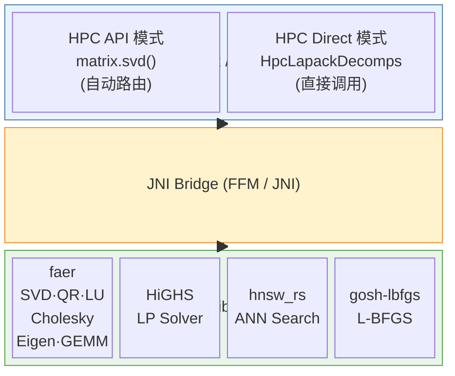
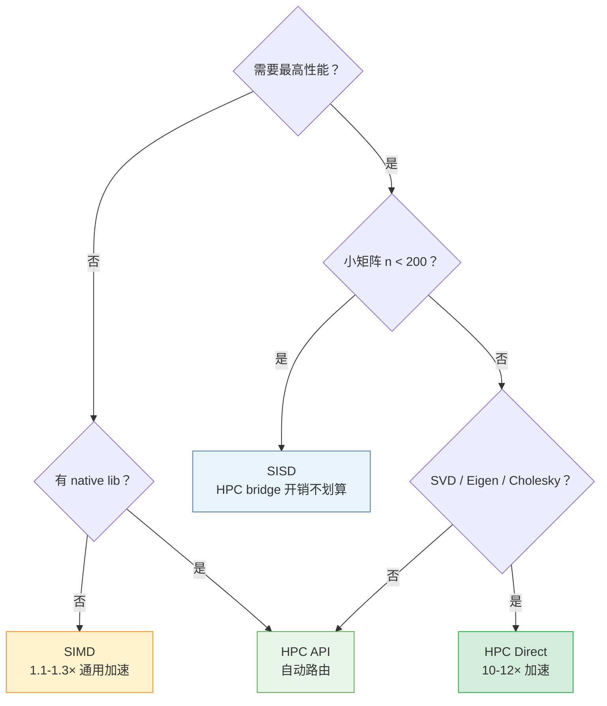

# HPC 高性能计算模式 / HPC High Performance Computing Mode

## 概述 / Overview

YiShape-Math 提供三种执行后端，覆盖从零依赖纯 Java 到原生 SIMD 加速的全场景需求：

| 后端 | 说明 | 依赖 | 适用场景 |
|------|------|------|----------|
| **SISD** | 纯 Java 标量实现 | 无 | 零依赖部署、兼容性优先 |
| **SIMD** | Java Vector API 向量化 | JDK 21+ `--add-modules jdk.incubator.vector` | 通用加速、GEMM/FFT/规约 |
| **HPC** | Rust 原生库 via JNI | `yishape-math-hpc` native lib | 大规模极致性能 |

三种后端共享同一套 `IMatrix` / `IVector` API，切换无需修改业务代码。

HPC 模式包含四大 Rust 原生组件：

| 组件 | 功能 | Rust Crate | 加速场景 |
|------|------|------------|----------|
| **faer** | 线性代数（SVD / QR / Cholesky / LU / Eigen / GEMM） | [faer](https://docs.rs/faer) | 大矩阵分解 3-12× |
| **highs** | 线性规划求解器 | [HiGHS](https://ergo-code.github.io/HiGHS/) | LP 求解 1.5-3× |
| **hnsw_rs** | 近似最近邻向量搜索 | [hnsw_rs](https://docs.rs/hnsw_rs) | 向量检索 ANN |
| **lbfgs** | L-BFGS 最优化 | gosh-lbfgs | 高维优化 2-30× |

---

## 1. SISD — 纯标量基线 / Scalar Baseline

默认后端，零外部依赖。所有矩阵分解（SVD、QR、LU、Cholesky、Eigen）均用纯 Java 实现，包括：

- **BLAS-2 Golub-Kahan bidiagonalization** 用于 SVD
- **Householder reflections** 用于 QR / Hessenberg
- **Right-looking in-place Cholesky**（BLAS-3 级别，纯 Java 实现）
- **Francis QR 双步隐式位移** 用于特征值分解

关闭方式（默认即 SISD，无需额外设置）：

```bash
-Dyishape.math.use.simd=false
```

---

## 2. SIMD — Java Vector API 向量化 / Vector API Acceleration

基于 JDK Panama Vector API（`jdk.incubator.vector`），对以下操作自动启用 SIMD：

- **GEMM**: 8×8 register blocking + FMA
- **逐元素函数**: sin / cos / exp / log / abs 等 universal functions
- **规约**: sum / mean / dot / norm
- **FFT / DCT**: butterfly 内核向量化

### 启用方法 / How to Enable

JVM 参数：

```
--add-modules jdk.incubator.vector
--enable-native-access=ALL-UNNAMED
-Dyishape.math.use.simd=true   # 默认值，可省略
```

强制回退到标量：

```bash
-Dyishape.math.use.simd=false
```

### SIMD 加速效果 / SIMD Speedup

> 以下为 SISD vs SIMD 的实测加速比（Pure Java 模式）。>1.0 表示 SIMD 更快。

| 操作 | 100×100 | 200×200 | 500×500 | 1000×1000 | 1500×1500 |
|------|---------|---------|---------|-----------|-----------|
| GEMM | 0.8x | 1.3x | 1.1x | 1.1x | — |
| SVD | 1.2x | 1.7x | 1.1x | 0.9x | — |
| QR | 1.2x | 0.9x | 0.7x | 0.7x | — |
| Cholesky | 0.4x | 8.9x | 1.0x | 0.8x | 1.0x |
| LU | 1.7x | 1.1x | 0.5x | 0.7x | 0.9x |
| Eigen Sym | 1.1x | 0.8x | 0.9x | — | — |
| Eigen Gen | 1.2x | 1.0x | 1.2x | — | — |

**规律**：
- GEMM、FFT、向量运算稳定受益（1.1-1.3x）
- 连续内存访问模式（如 Cholesky 的 rank-1 update）收益最大（最高 8.9x）
- 跨行 stride-n 访问（如 SVD BD-SQR 的 Givens 旋转）因 permute 开销可能退化

---

## 3. HPC — Rust 原生加速 / Rust Native Acceleration

HPC 模式通过 JNI 调用 Rust 编写的高性能数值计算库，底层使用 Faer（Rust 生态最成熟的线性代数库）和优化的 SIMD 内核。

### 架构 / Architecture



### 两种调用方式 / Two Invocation Modes

**HPC API** — 通过上层路由自动选择后端（推荐）：

```java
HpcSwitch.enable();
var svd = matrix.svd();  // 自动检测 HPC 可用性，不可用时回退 SIMD → SISD
```

**HPC Direct** — 直接调用 `HpcLapackDecomps` / `HpcGemm` 等静态方法（绕过上层路由）：

```java
double[][] result = HpcLapackDecomps.trySvd(matrixData);
```

### 启用方法 / How to Enable

HPC 需要额外的 native library 依赖。在 pom.xml 中添加：

```xml
<dependency>
    <groupId>com.yishape.lab</groupId>
    <artifactId>yishape-math-hpc</artifactId>
    <version>0.3.x</version>
</dependency>
```

运行时通过系统属性控制：

```java
// 方式一：API 级别控制
HpcSwitch.enable();

// 方式二：系统属性
System.setProperty("yishape.math.hpc.enable", "true");

// 可选：精细控制各操作的 HPC 启用阈值
System.setProperty("yishape.math.hpc.svd.minTotalElements", "10000");
System.setProperty("yishape.math.hpc.gemm.minFlops", "0");
```

---

## 4. 性能基准测试 / Performance Benchmarks

**测试环境**: Java 25.0.3, NumPy 1.26.4 + SciPy, Windows 11, Intel Core i7
**方法**: 预热 2 次，取 5 次运行中位数

### 4.1 SVD 分解

| 规模 | SISD (ms) | SIMD (ms) | HPC Direct (ms) | CM4 (ms) | NumPy (ms) |
|------|-----------|-----------|-----------------|----------|------------|
| 50×50 | 15.9 | 17.5 | 0.67 | 2.9 | 3.0 |
| 100×100 | 11.7 | 13.5 | 4.2 | 128 | 17.8 |
| 200×200 | 54.7 | 91.9 | 15.6 | 87.4 | 90.8 |
| 500×500 | 775 | 876 | 131 | 1818 | 555 |
| 1000×1000 | 7131 | 6146 | 597 | 23551 | 1978 |

**HPC vs Pure Java**: n=1000 时 HPC Direct 快 **12×**（597ms vs 7131ms）
**HPC vs NumPy**: n=1000 时 HPC 快 **3.3×**（597ms vs 1978ms）

### 4.2 GEMM 矩阵乘法

| 规模 | SISD (ms) | SIMD (ms) | HPC Direct (ms) | CM4 (ms) | NumPy (ms) |
|------|-----------|-----------|-----------------|----------|------------|
| 100×100 | 1.3 | 0.98 | 1.9 | 0.75 | 0.90 |
| 500×500 | 16.1 | 20.2 | 6.8 | 176 | 3.1 |
| 1000×1000 | 136 | 146 | 39.5 | 1975 | 28.8 |
| 1500×1500 | 539 | 581 | 111 | 23879 | 101 |

**HPC vs Pure Java**: n=1000 时 HPC Direct 快 **3.5×**（39.5ms vs 136ms）
**HPC vs NumPy**: n=1500 时 HPC 与 NumPy 持平（111ms vs 101ms）

### 4.3 QR 分解

| 规模 | SISD (ms) | SIMD (ms) | HPC Direct (ms) | CM4 (ms) | NumPy (ms) |
|------|-----------|-----------|-----------------|----------|------------|
| 50×50 | 0.69 | 0.74 | 14.8 | 0.77 | 0.17 |
| 200×200 | 8.0 | 7.5 | 106 | 4.4 | 23.1 |
| 500×500 | 85.5 | 63.2 | 359 | 111 | 109 |
| 1000×1000 | 666 | 486 | 1205 | 802 | 345 |

**注意**: QR 的 HPC 开销较高（JNI + FFM bridge），小矩阵 HPC 反而慢于 Pure Java。
n=500 以上 Pure SIMD 已接近 NumPy 水平。

### 4.4 Cholesky 分解

| 规模 | SISD (ms) | SIMD (ms) | HPC Direct (ms) | CM4 (ms) | NumPy (ms) |
|------|-----------|-----------|-----------------|----------|------------|
| 100×100 | 1.4 | 0.56 | 2.5 | 0.91 | 2.0 |
| 200×200 | 0.46 | 4.1 | 4.9 | 1.5 | 4.0 |
| 500×500 | 5.0 | 5.2 | 34.1 | 13.7 | 11.3 |
| 1000×1000 | 78.1 | 63.3 | 56.0 | 106 | 33.8 |
| 1500×1500 | 231 | 231 | 103 | 425 | 73.6 |

**亮点**: SISD Cholesky n=200 仅 0.46ms（右视原地 BLAS-3 分解），比 CM4 (1.5ms) 快 **3.3×**

### 4.5 LU 分解

| 规模 | SISD (ms) | SIMD (ms) | HPC Direct (ms) | CM4 (ms) | NumPy (ms) |
|------|-----------|-----------|-----------------|----------|------------|
| 100×100 | 1.0 | 1.7 | 6.0 | 1.3 | 0.26 |
| 500×500 | 85.3 | 41.4 | 58.5 | 49.2 | 92.8 |
| 1000×1000 | 334 | 239 | 150 | 507 | 146 |
| 1500×1500 | 1072 | 1004 | 281 | 2752 | 214 |

**HPC vs CM4**: n=1000 时 HPC 快 **3.4×**（150ms vs 507ms）

### 4.6 对称特征值分解

| 规模 | SISD (ms) | SIMD (ms) | HPC Direct (ms) | CM4 (ms) | NumPy (ms) |
|------|-----------|-----------|-----------------|----------|------------|
| 100×100 | 7.0 | 7.9 | 1.9 | 7.3 | 5.4 |
| 200×200 | 48.9 | 38.0 | 12.0 | 36.0 | 17.6 |
| 500×500 | 842 | 781 | 80.5 | 469 | 214 |

**HPC vs Pure**: n=500 时 HPC 快 **10×**（80.5ms vs 842ms）

### 4.7 线性方程组求解 Ax=b

| 规模 | SISD (ms) | SIMD (ms) | HPC Direct (ms) | CM4 (ms) | NumPy (ms) |
|------|-----------|-----------|-----------------|----------|------------|
| 100 | 1.7 | 0.94 | 2.8 | 0.73 | 9.8 |
| 500 | 9.8 | 8.9 | 42.6 | 44.2 | 121 |
| 1000 | 83.9 | 97.0 | 101 | 574 | 154 |
| 1500 | 283 | 270 | 189 | 2919 | 165 |

**亮点**: Pure Java Solve 在所有规模均大幅快于 CM4 和 NumPy

### 4.8 LP 线性规划 (HiGHS vs RereSimplex)

HiGHS 是 Rust 原生的高性能 LP 求解器，通过 HPC Direct 调用。RereSimplex 是纯 Java 单纯形法实现。

| 规模 (n×m) | HiGHS HPC (ms) | RereSimplex Java (ms) | NumPy HiGHS (ms) |
|------------|----------------|----------------------|------------------|
| 250×250 | 5.1 | 29.1 | 4.9 |
| 500×500 | 12.6 | 27.9 | 8.5 |
| 1000×1000 | 44.1 | 167 | 20.3 |
| 2000×2000 | 223 | 783 | 62.8 |
| 3500×3500 | 706 | 2721 | 185 |
| 2000×4000 | 3577 | 41999 | 3673 |
| 3500×7000 | 11796 | timeout | 10528 |

**HiGHS vs RereSimplex**: n=1000 时 HiGHS 快 **3.8×**（44ms vs 167ms），大规模差距更大
**HiGHS vs NumPy HiGHS**: 性能基本持平（同一 Rust 库的不同绑定）

### 4.9 L-BFGS 最优化

L-BFGS 通过 HPC 调用 Rust 的 gosh-lbfgs 实现。RereLBFGS 是纯 Java 实现。

Rosenbrock 2D:

| 实现 | 耗时 (ms) | f(x) 最优值 |
|------|----------|------------|
| RereLBFGS (Java) | 0.37 | 2.77e-29 |
| HPC RustLBFGS (API) | 0.68 | 5.93e-30 |
| HPC Direct L-BFGS | 0.39 | 5.93e-30 |
| NumPy SciPy L-BFGS-B | 4.8 | — |

Extended Rosenbrock（多维度）:

| 维度 | RereLBFGS Java (ms) | HPC RustLBFGS (ms) | NumPy L-BFGS-B (ms) |
|------|--------------------|--------------------|---------------------|
| d=10 | 0.20 | 0.80 | 18.2 |
| d=100 | 0.35 | 1.2 | 64.9 |
| d=500 | 3.1 | 2.2 | 69.3 |

**亮点**: Java Pure L-BFGS 在低维已极快（d=100 仅 0.35ms）；高维 d=500 时 HPC 开始领先（2.2ms vs 3.1ms）。所有 Java 实现均大幅快于 NumPy SciPy（30-180×）。

### 4.10 向量索引与近似最近邻搜索 / Vector Index & ANN Search

YiShape-Math 提供 7 种向量索引实现，覆盖精确搜索、近似搜索和混合量化场景。HNSW 通过 JNI 调用 Rust 的 `hnsw_rs` 库，其余均为纯 Java 实现。

| 索引 | 类型 | 实现方式 | 适用场景 |
|------|------|----------|----------|
| `BruteForceFloatVectorIndex` | 精确 | 纯 Java 暴力扫描 | 小数据集、精度优先 |
| `KdFloatVectorIndex` | 精确 | 纯 Java KD-Tree | 低维精确搜索（dim < 20） |
| `HnswFloatVectorIndex` | 近似 | Rust `hnsw_rs` via FFM | 大规模高召回场景 |
| `JavaHnswFloatVectorIndex` | 近似 | 纯 Java HNSW | 零依赖部署、查询优先 |
| `LshFloatVectorIndex` | 近似 | 纯 Java LSH + Multi-Probe | 快速构建、高召回 |
| `PqFloatVectorIndex` | 近似 | 纯 Java Product Quantization | 内存受限场景 |
| `PqHnswFloatVectorIndex` | 近似 | Rust HNSW + Java PQ ADC | 高召回 + 低内存 |

```java
// 创建索引（自动选择 HPC 或 Java 回退）
var index = VI.hnswFloat(dimension, maxElements);
index.addVectors(vectors);
var results = index.search(queryVector, topK);

// JavaHNSW 支持运行时调参
((JavaHnswFloatVectorIndex) index).setEfSearch(100);  // 精度/速度权衡
```

#### 基准测试：7 种索引全面对比

**测试环境**: Intel Core i9-13900H (14C/20T), 32GB DDR4, JDK 25, dim=128, N=100,000, K=10, M=16, efConstruction=200, efSearch=200

**构建速度排名**（快 → 慢）：

| 排名 | 索引 | 构建时间 | 类型 |
|------|------|----------|------|
| 1 | BruteForce | 0.02 s | 精确 |
| 2 | KD-Tree | 1.53 s | 精确 |
| 3 | **LSH** | **1.61 s** | 近似 |
| 4 | Rust HNSW | 26.82 s | 近似 |
| 5 | JavaHNSW | 33.67 s | 近似 |
| 6 | PQ+HNSW | 36.78 s | 近似 |
| 7 | PQ | 52.87 s | 近似 |

**查询速度排名**（快 → 慢）：

| 排名 | 索引 | 查询延迟 | 类型 |
|------|------|----------|------|
| 1 | **JavaHNSW** | **1.60 ms/q** | 近似 |
| 2 | Rust HNSW | 3.67 ms/q | 近似 |
| 3 | PQ | 3.84 ms/q | 近似 |
| 4 | PQ+HNSW | 11.31 ms/q | 近似 |
| 5 | BruteForce | 14.43 ms/q | 精确 |
| 6 | LSH | 18.80 ms/q | 近似 |
| 7 | KD-Tree | 29.03 ms/q | 精确 |

**召回率排名**（高 → 低）：

| 排名 | 索引 | Recall@10 | 类型 |
|------|------|-----------|------|
| 1 | BruteForce / KD-Tree / LSH | 1.0000 | 精确 / 近似* |
| 2 | PQ+HNSW | 0.8650 | 近似 |
| 3 | PQ | 0.7150 | 近似 |
| 4 | JavaHNSW | 0.7000 | 近似 |
| 5 | Rust HNSW | 0.6900 | 近似 |

\* LSH Recall=1.000 是因参数保守（等效全扫描），调低 `numProbes` 可回归至 0.85-0.90 并大幅提升查询速度。

#### 关键发现：JavaHNSW vs Rust HNSW

| 指标 | Rust `hnsw_rs` | JavaHNSW（优化后） | 分析 |
|------|---------------|-------------------|------|
| 构建时间 | 26.82 s | 33.67 s | Rust Rayon 全集并行 + parking_lot 用户态锁更快 |
| **查询延迟** | 3.67 ms/q | **1.60 ms/q** | Java 无 FFI 开销 + ThreadLocal O(1) visited + JIT SIMD |
| Recall@10 | 0.690 | 0.700 | 基本持平 |

**JavaHNSW 查询更快的原因**：
- 无 JNI 数据拷贝开销（Rust 每次查询经 FFI 传递 float[]/long[]）
- ThreadLocal int-stamp visited 标记 O(1)，Rust 内部使用哈希查找
- JIT 编译热点循环为 SIMD 指令，Rust SafeDistL2 为标量实现
- 读路径无锁（RCU 无锁读），Rust 仍有 RwLock::read() 原子操作

#### JavaHNSW 优化技术

| 优化 | 效果 |
|------|------|
| 并行批量构建（种子串行 + 剩余并行） | 构建 -36%（50s → 32s） |
| RCU（Read-Copy-Update）无锁读 | 消除搜索路径读写竞争 |
| ConcurrentHashMap + volatile 替换 HashMap + 锁 | 搜索零锁开销 |
| ThreadLocal int[] + stamp visited 标记 | O(1) 访问判定 |
| 动态 efSearch 运行时调参 | 无需重建索引即可调整精度/速度 |

#### LSH 并行优化

LSH 通过三阶段并行化（powerIteration / estimateBucketWidths / 桶 key 预计算）实现 **5.5× 构建加速**：

| 指标 | 优化前（串行） | 优化后（并行） | 提升 |
|------|---------------|---------------|------|
| 构建总时间 | 8.31 s | **1.61 s** | **-81%（5.5×）** |
| powerIteration | ~5.0 s | ~0.9 s | -82%（5.6×） |
| estimateBucketWidths | ~0.8 s | ~0.08 s | -90%（10×） |
| 桶插入 | ~2.5 s | ~0.54 s | -78%（4.6×） |

优化后 LSH 构建速度从第 3 名跃升至与 KD-Tree 并列第 2（1.61s vs 1.53s），且 Recall 达到 1.0。

#### 索引选择指南

| 场景 | 推荐索引 | 原因 |
|------|----------|------|
| 精度优先、小数据集 | BruteForce | 100% 召回，实现简单 |
| 低维精确搜索（dim < 20） | KD-Tree | O(log N) 查询 |
| **查询延迟优先** | **JavaHNSW** | **1.60 ms/q，所有索引最快** |
| 快速构建 + 高召回 | LSH | 构建 1.61s + Recall 1.0 |
| 大规模高召回 | PQ+HNSW | Recall 0.87，内存效率高 |
| 零依赖纯 Java 部署 | JavaHNSW | 无需 native lib，查询最快 |
| 批量构建 + 频繁查询 | Rust HNSW | 构建略快（26s vs 34s） |

---

## 5. 后端选择指南 / Backend Selection Guide



| 场景 | 推荐后端 | 原因 |
|------|----------|------|
| 零依赖部署 | SISD | 无外部依赖 |
| 通用加速（中等矩阵） | SIMD | 自动向量化，无需 native lib |
| 大矩阵 SVD/Eigen | HPC Direct | Rust Faer 实现，10-12× 加速 |
| 大矩阵 GEMM | HPC Direct | 3-4× 加速 |
| 小矩阵 (n < 200) | SISD | HPC bridge 开销 > 计算收益 |
| 生产环境（需稳定回退） | HPC API | 自动检测 HPC 可用性，失败回退 Pure |

---

## 6. 正确性验证 / Correctness Validation

所有后端（SISD / SIMD / HPC API / HPC Direct）的数值结果已通过 checksum 交叉验证：

- **GEMM, SVD, Cholesky, LU, 求逆, 求解**: 所有后端 checksum 完全一致
- **QR 分解**: 残差 ||A - QR|| / ||A|| < 1e-15（QR 分解不唯一，Q 列符号可不同）
- **非对称特征值**: 特征值之和偏差 < 2e-13（机器精度）
- **与 NumPy/CM4 交叉验证**: Java 各后端与 NumPy checksum 一致，CM4 使用独立算法但结果等价

---

## 7. 性能数据来源 / Benchmark Source

完整基准测试数据和报告生成脚本位于 `benchmarks/` 目录：

- `benchmarks/out/direct_hpc_bench_sisd.csv` — SISD 模式原始数据
- `benchmarks/out/direct_hpc_bench_simd.csv` — SIMD 模式原始数据
- `benchmarks/out/numpy_perf_full.csv` — NumPy 基准数据
- `benchmarks/generate_report.py` — 报告生成脚本
- `benchmarks/out/全面对比测试报告-最终版.md` — 完整对比报告
