# 数据可视化 (Data Visualization)

## 概述 / Overview

数据可视化包提供了强大的图表绘制功能，支持多种图表类型，包括基础图表、极坐标图表、统计图表和特殊图表。该包为数学计算和数据分析提供了直观的可视化支持，能够将复杂的数值数据转换为易于理解的图形表示。

The data visualization package provides powerful charting capabilities, supporting various chart types including basic charts, polar coordinate charts, statistical charts, and special charts. This package provides intuitive visualization support for mathematical calculations and data analysis, converting complex numerical data into easily understandable graphical representations.


#### 图表展示 / Chart Gallery

以下展示了YiShape-Math支持的各种图表类型，点击图片可查看详细的使用示例：

The following showcases various chart types supported by YiShape-Math. Click on the images to view detailed usage examples:

##### 基础图表 / Basic Charts

| 图表类型 / Chart Type | 示例图片 / Example | 描述 / Description |
|---------------------|------------------|-------------------|
| **线图 / Line Chart** | [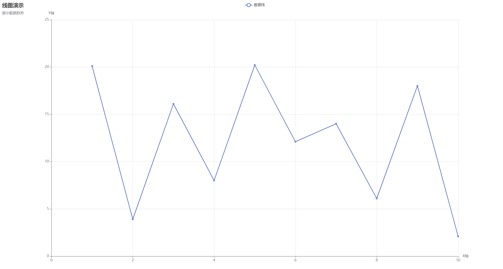](./Visualization-Plotting.md#单向量线图--single-vector-line-chart) | 展示数据随时间的变化趋势 / Display data trends over time |
| **多组线图 / Multi-group Line Chart** | [](./Visualization-Plotting.md#多组线图--multi-group-line-chart) | 比较不同组别的数据趋势 / Compare data trends across different groups |
| **散点图 / Scatter Chart** | [](./Visualization-Plotting.md#基础散点图--basic-scatter-chart) | 展示两个变量之间的关系 / Display relationships between two variables |
| **多组散点图 / Multi-group Scatter Chart** | [](./Visualization-Plotting.md#多组散点图--multi-group-scatter-chart) | 比较不同组别的数据分布 / Compare data distributions across different groups |
| **饼图 / Pie Chart** | [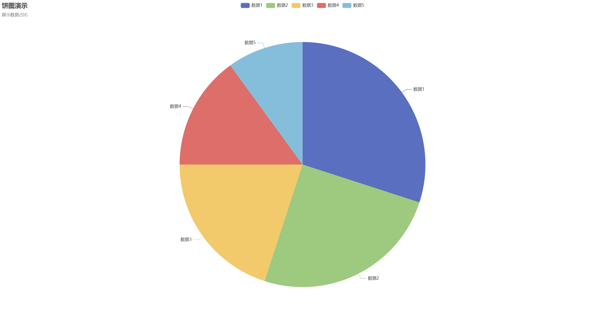](./Visualization-Plotting.md#饼图--pie-charts) | 展示各部分占整体的比例 / Display proportion of each part to the whole |
| **柱状图 / Bar Chart** | [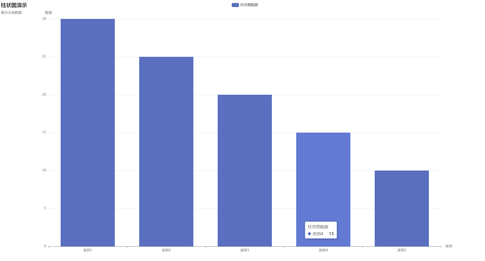](./Visualization-Plotting.md#基础柱状图--basic-bar-chart) | 比较不同类别的数值大小 / Compare numerical values across different categories |
| **分组柱状图 / Grouped Bar Chart** | [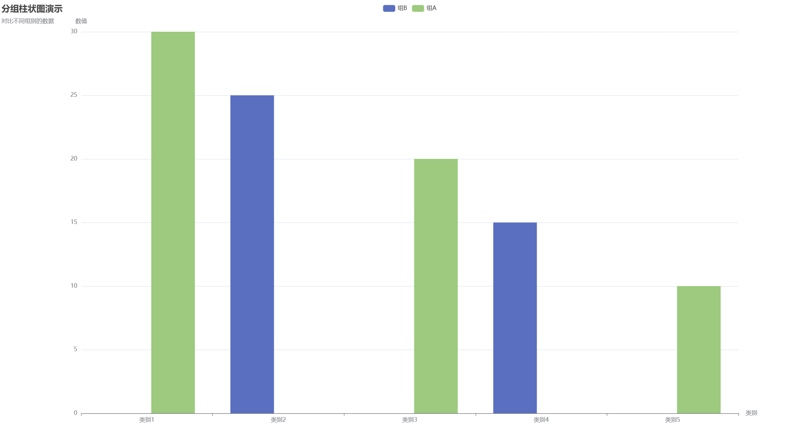](./Visualization-Plotting.md#分组柱状图--grouped-bar-chart) | 多维度比较分析 / Multi-dimensional comparative analysis |
| **直方图 / Histogram** | [](./Visualization-Plotting.md#直方图--histograms) | 展示数据的分布情况 / Display data distribution |

##### 极坐标图表 / Polar Coordinate Charts

| 图表类型 / Chart Type | 示例图片 / Example | 描述 / Description |
|---------------------|------------------|-------------------|
| **极坐标柱状图 / Polar Bar Chart** | [](./Visualization-Plotting.md#极坐标柱状图--polar-bar-chart) | 在极坐标系中展示柱状图 / Display bar charts in polar coordinate system |
| **极坐标线图 / Polar Line Chart** | [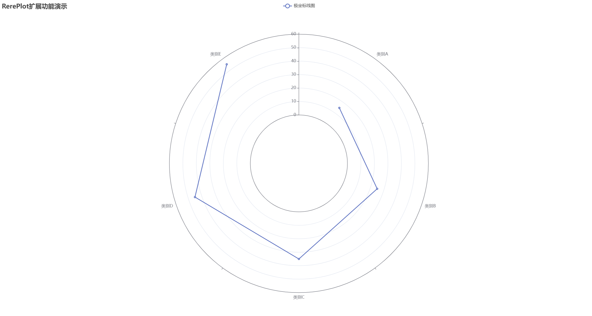](./Visualization-Plotting.md#极坐标线图--polar-line-chart) | 在极坐标系中展示线图 / Display line charts in polar coordinate system |
| **极坐标散点图 / Polar Scatter Chart** | [](./Visualization-Plotting.md#极坐标散点图--polar-scatter-chart) | 在极坐标系中展示散点图 / Display scatter charts in polar coordinate system |

##### 统计图表 / Statistical Charts

| 图表类型 / Chart Type | 示例图片 / Example | 描述 / Description |
|---------------------|------------------|-------------------|
| **单组箱线图 / Single Group Box Plot** | [](./Visualization-Plotting.md#单组箱线图--single-group-box-plot) | 展示单一数据集的分布特征和异常值 / Display distribution characteristics and outliers of a single dataset |
| **多组箱线图 / Multi-group Box Plot** | [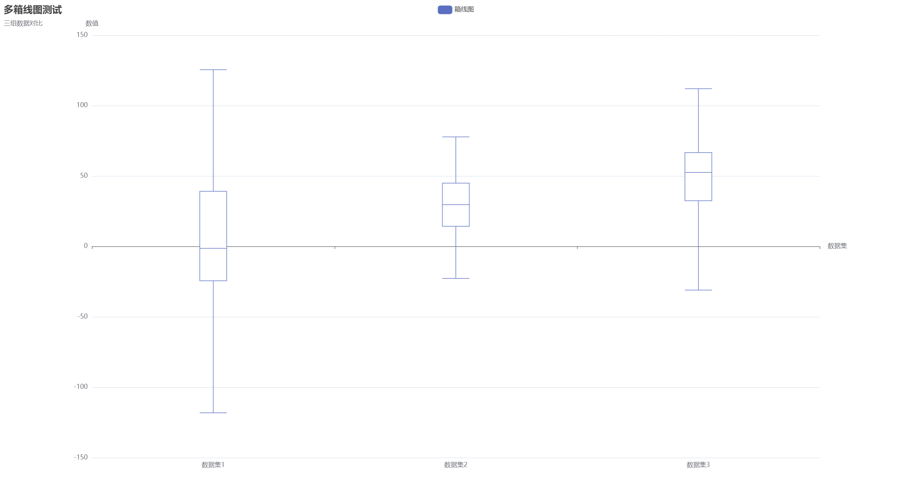](./Visualization-Plotting.md#多组箱线图--multi-group-box-plot) | 比较多个数据组的分布特征和异常值 / Compare distribution characteristics and outliers across multiple data groups |
| **单组小提琴图 / Single Group Violin Plot** | [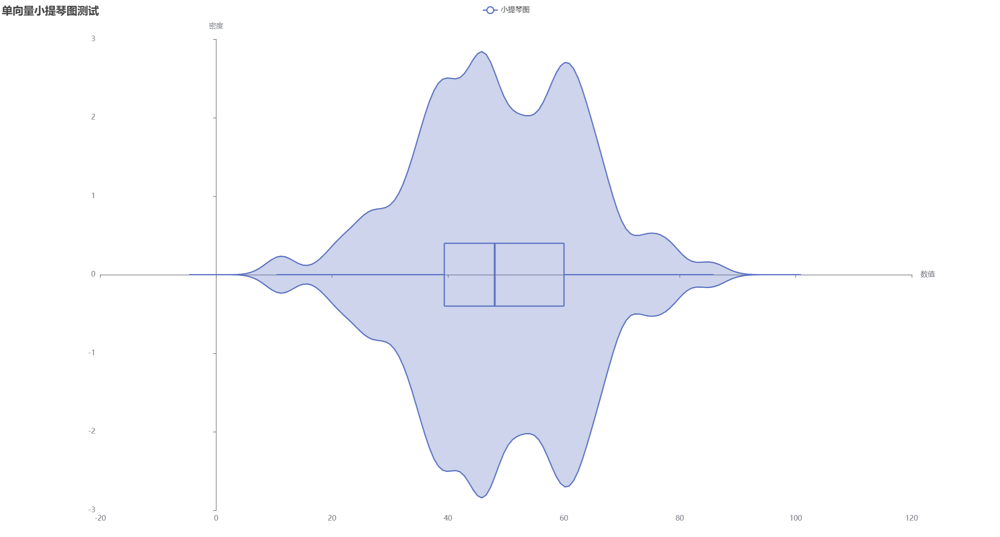](./Visualization-Plotting.md#单组小提琴图--single-group-violin-plot) | 展示单一数据集的分布形状和统计特征 / Display distribution shape and statistical features of a single dataset |
| **多组小提琴图 / Multi-group Violin Plot** | [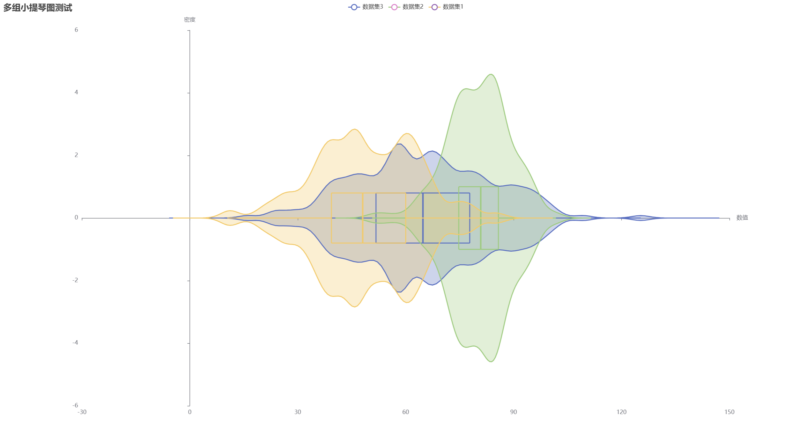](./Visualization-Plotting.md#多组小提琴图--multi-group-violin-plot) | 比较多个数据组的分布形状和统计特征 / Compare distribution shapes and statistical features across multiple data groups |
| **K线图 / Candlestick Chart** | [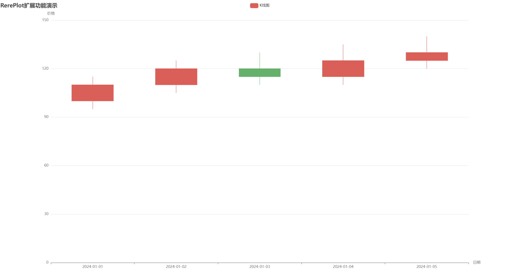](./Visualization-Plotting.md#k线图蜡烛图--candlestick-chart) | 展示金融数据的开盘价、收盘价等 / Display financial data including opening, closing prices |

##### 特殊图表 / Special Charts

| 图表类型 / Chart Type | 示例图片 / Example | 描述 / Description |
|---------------------|------------------|-------------------|
| **漏斗图 / Funnel Chart** | [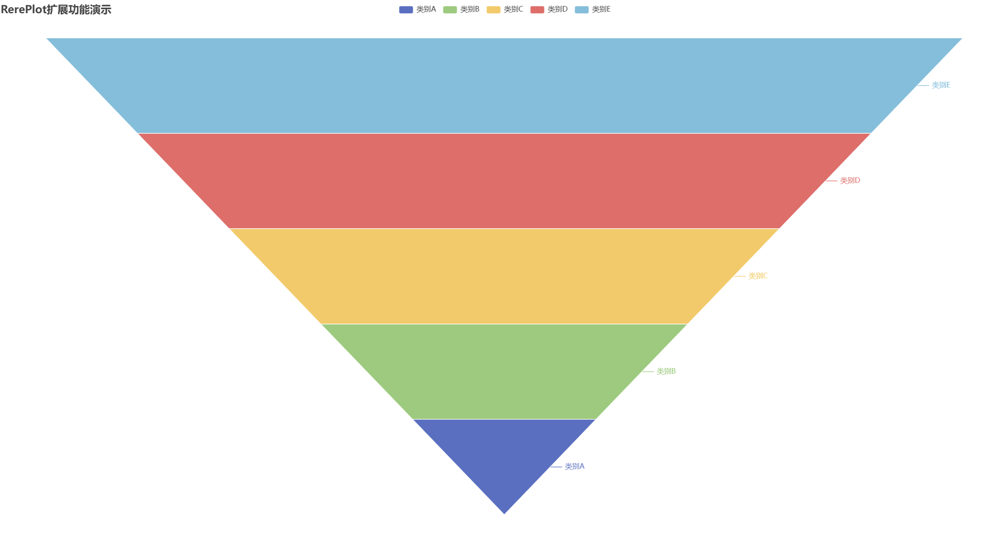](./Visualization-Plotting.md#漏斗图--funnel-chart) | 展示流程中各个阶段的转化情况 / Display conversion rates at each stage of a process |
| **桑基图 / Sankey Diagram** | [](./Visualization-Plotting.md#桑基图--sankey-diagram) | 展示数据在多个节点之间的流动 / Display data flow between multiple nodes |
| **旭日图 / Sunburst Chart** | [](./Visualization-Plotting.md#旭日图--sunburst-chart) | 展示层次数据的比例关系 / Display proportional relationships in hierarchical data |
| **主题河流图 / Theme River Chart** | [](./Visualization-Plotting.md#主题河流图--theme-river-chart) | 展示时间序列数据中不同主题的变化 / Display trends of different themes in time series data |
| **树图 / Tree Chart** | [](./Visualization-Plotting.md#树图--tree-chart) | 展示层次结构数据 / Display hierarchical structure data |
| **矩形树图 / Treemap Chart** | [](./Visualization-Plotting.md#矩形树图--treemap-chart) | 通过矩形面积大小表示数据量 / Represent data volumes through rectangle sizes |
| **关系图 / Graph Chart** | [](./Visualization-Plotting.md#关系图--graph-chart) | 展示节点之间的连接关系 / Display connections between nodes |
| **平行坐标图 / Parallel Coordinates Chart** | [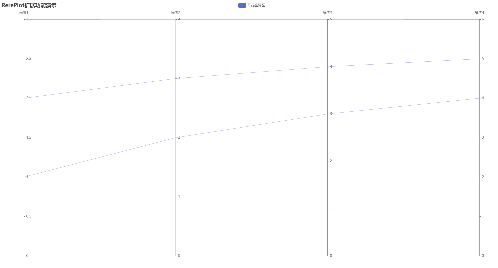](./Visualization-Plotting.md#平行坐标图--parallel-coordinates-chart) | 展示多维数据的分布和关系 / Display distribution and relationships of multi-dimensional data |

##### 扩展图表 / Enhanced Charts

| 图表类型 / Chart Type | 示例图片 / Example | 描述 / Description |
|---------------------|------------------|-------------------|
| **热力图 / Heatmap** | [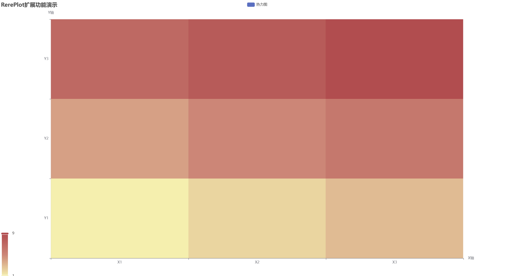](./Visualization-Plotting.md#热力图--heatmap) | 通过颜色深浅表示二维数据大小 / Represent two-dimensional data magnitude through color intensity |
| **雷达图 / Radar Chart** | [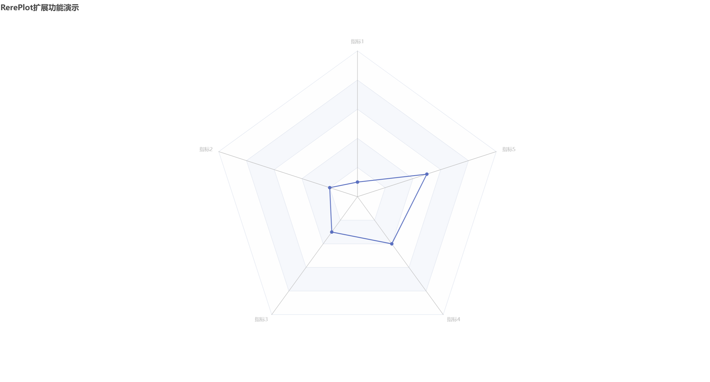](./Visualization-Plotting.md#雷达图--radar-chart) | 展示多维数据的分布情况 / Display distribution of multi-dimensional data |
| **仪表盘 / Gauge Chart** | [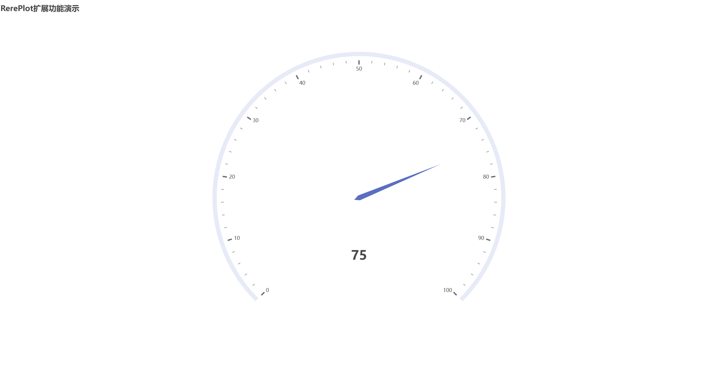](./Visualization-Plotting.md#仪表盘--gauge-chart) | 展示单一指标的当前值 / Display current values of single indicators |


## 核心类 / Core Classes

### 1. Plots - 绘图工厂类 / Plotting Factory Class

`Plots` 类提供了创建各种图表类型的静态工厂方法，是绘图功能的主要入口点。该类提供了简洁的API来快速创建和配置图表。

`Plots` class provides static factory methods for creating various chart types, serving as the main entry point for plotting functionality. This class provides a concise API for quickly creating and configuring charts.

#### 主要工厂方法 / Main Factory Methods

```java
// 基础工厂方法 / Basic factory methods
RerePlot of();                                      // 创建默认绘图对象
RerePlot of(int width, int height);                 // 创建指定尺寸的绘图对象
RerePlot of(int width, int height, String theme);   // 创建指定尺寸和主题的绘图对象

// 图表类型专用工厂方法 / Chart-specific factory methods
RerePlot line(IVector x, IVector y);                // 创建线图
RerePlot line(IVector x);                           // 创建单向量线图
RerePlot line(IVector x, IVector y, List<String> hue); // 创建多线图
RerePlot scatter(IVector x, IVector y);             // 创建散点图
RerePlot scatter(IVector x, IVector y, List<String> hue); // 创建多组散点图
RerePlot pie(IVector data);                         // 创建饼图
RerePlot bar(IVector data);                         // 创建柱状图
RerePlot bar(IVector data, List<String> hue);       // 创建分组柱状图
RerePlot hist(IVector data, boolean fittingLine);   // 创建直方图
RerePlot boxplot(IVector data);                     // 创建箱线图
RerePlot boxplot(IVector data, List<String> labels); // 创建带标签的箱线图
RerePlot violinplot(IVector data);                  // 创建小提琴图
RerePlot violinplot(IVector data, List<String> labels); // 创建带标签的小提琴图
RerePlot heatmap(IMatrix data, List<String> xLabels, List<String> yLabels); // 创建热力图
RerePlot radar(IVector data, List<String> indicators); // 创建雷达图
RerePlot gauge(float value, float max, float min);  // 创建仪表盘

// 带尺寸的工厂方法 / Factory methods with dimensions
RerePlot line(IVector x, IVector y, int width, int height);
RerePlot scatter(IVector x, IVector y, int width, int height);
RerePlot bar(IVector data, int width, int height);
RerePlot pie(IVector data, int width, int height);

// 带主题的工厂方法 / Factory methods with themes
RerePlot line(IVector x, IVector y, int width, int height, String theme);
RerePlot scatter(IVector x, IVector y, int width, int height, String theme);
RerePlot bar(IVector data, int width, int height, String theme);
RerePlot pie(IVector data, int width, int height, String theme);
```

#### 使用示例 / Usage Examples

```java
// 基础使用 / Basic usage
IPlot plot = Plots.of(800, 600);
plot.setTitle("我的图表");
plot.line(x, y);
plot.show();

// 链式调用 / Chained calls
Plots.of(800, 600)
    .title("线图演示")
    .xlabel("X轴")
    .ylabel("Y轴")
    .line(x, y)
    .show();

// 直接创建特定图表 / Direct creation of specific charts
Plots.line(x, y).saveAsHtml("line_chart.html");
Plots.scatter(x, y).saveAsHtml("scatter_chart.html");
Plots.pie(data).saveAsHtml("pie_chart.html");
Plots.boxplot(data).saveAsHtml("boxplot_chart.html");
Plots.violinplot(data).saveAsHtml("violin_chart.html");
```

### 2. IPlot 接口 / IPlot Interface

`IPlot` 是绘图功能的核心接口，定义了所有图表绘制方法的抽象规范。

`IPlot` is the core interface for plotting functionality, defining abstract specifications for all chart drawing methods.

```java
public interface IPlot {
    // ========== 基础图表方法 ==========
    
    /**
     * 绘制线图
     * @param x X轴数据
     * @param y Y轴数据
     * @return 当前实例，支持链式调用
     */
    IPlot line(IVector x, IVector y);
    
    /**
     * 绘制单向量线图
     * @param x 数据向量
     * @return 当前实例，支持链式调用
     */
    IPlot line(IVector x);
    
    /**
     * 绘制多线图
     * @param x X轴数据
     * @param y Y轴数据
     * @param hue 分组标签
     * @return 当前实例，支持链式调用
     */
    IPlot line(IVector x, IVector y, List<String> hue);
    
    /**
     * 绘制散点图
     * @param x X轴数据
     * @param y Y轴数据
     * @return 当前实例，支持链式调用
     */
    IPlot scatter(IVector x, IVector y);
    
    /**
     * 绘制多组散点图
     * @param x X轴数据
     * @param y Y轴数据
     * @param hue 分组标签
     * @return 当前实例，支持链式调用
     */
    IPlot scatter(IVector x, IVector y, List<String> hue);
    
    /**
     * 绘制饼图
     * @param x 数据向量
     * @return 当前实例，支持链式调用
     */
    IPlot pie(IVector x);
    
    /**
     * 绘制柱状图
     * @param x 数据向量
     * @return 当前实例，支持链式调用
     */
    IPlot bar(IVector x);
    
    /**
     * 绘制分组柱状图
     * @param x 数据向量
     * @param hue 分组标签
     * @return 当前实例，支持链式调用
     */
    IPlot bar(IVector x, List<String> hue);
    
    /**
     * 绘制直方图
     * @param x 数据向量
     * @param fittingLine 是否显示拟合线
     * @return 当前实例，支持链式调用
     */
    IPlot hist(IVector x, boolean fittingLine);
    
    // ========== 极坐标图表方法 ==========
    
    /**
     * 绘制极坐标柱状图
     * @param data 数据向量
     * @param categories 类别标签
     * @return 当前实例，支持链式调用
     */
    IPlot polarBar(IVector data, List<String> categories);
    
    /**
     * 绘制极坐标线图
     * @param data 数据向量
     * @param categories 类别标签
     * @return 当前实例，支持链式调用
     */
    IPlot polarLine(IVector data, List<String> categories);
    
    /**
     * 绘制极坐标散点图
     * @param data 数据向量
     * @param categories 类别标签
     * @return 当前实例，支持链式调用
     */
    IPlot polarScatter(IVector data, List<String> categories);
    
    // ========== 统计图表方法 ==========
    
    /**
     * 绘制箱线图
     * @param data 数据向量
     * @return 当前实例，支持链式调用
     */
    IPlot boxplot(IVector data);
    
    /**
     * 绘制箱线图
     * @param data 数据向量
     * @param labels 标签
     * @return 当前实例，支持链式调用
     */
    IPlot boxplot(IVector data, List<String> labels);
    
    /**
     * 绘制小提琴图
     * @param data 数据向量
     * @return 当前实例，支持链式调用
     */
    IPlot violinplot(IVector data);
    
    /**
     * 绘制小提琴图
     * @param data 数据向量
     * @param labels 标签
     * @return 当前实例，支持链式调用
     */
    IPlot violinplot(IVector data, List<String> labels);
    
    /**
     * 绘制K线图
     * @param data 数据矩阵，每行包含[开盘价, 收盘价, 最低价, 最高价]
     * @param dates 日期标签
     * @return 当前实例，支持链式调用
     */
    IPlot candlestick(IMatrix data, List<String> dates);
    
    // ========== 特殊图表方法 ==========
    
    /**
     * 绘制漏斗图
     * @param data 数据向量
     * @param labels 标签
     * @return 当前实例，支持链式调用
     */
    IPlot funnel(IVector data, List<String> labels);
    
    /**
     * 绘制桑基图
     * @param nodes 节点数据
     * @param links 连接数据
     * @return 当前实例，支持链式调用
     */
    IPlot sankey(List<Map<String, Object>> nodes, List<Map<String, Object>> links);
    
    /**
     * 绘制旭日图
     * @param data 层次数据
     * @return 当前实例，支持链式调用
     */
    IPlot sunburst(List<Map<String, Object>> data);
    
    /**
     * 绘制主题河流图
     * @param data 时间序列数据
     * @param categories 类别
     * @return 当前实例，支持链式调用
     */
    IPlot themeRiver(List<Map<String, Object>> data, List<String> categories);
    
    /**
     * 绘制树图
     * @param data 树形数据
     * @return 当前实例，支持链式调用
     */
    IPlot tree(List<Map<String, Object>> data);
    
    /**
     * 绘制矩形树图
     * @param data 层次数据
     * @return 当前实例，支持链式调用
     */
    IPlot treemap(List<Map<String, Object>> data);
    
    /**
     * 绘制关系图
     * @param nodes 节点数据
     * @param links 连接数据
     * @return 当前实例，支持链式调用
     */
    IPlot graph(List<Map<String, Object>> nodes, List<Map<String, Object>> links);
    
    /**
     * 绘制平行坐标图
     * @param data 数据矩阵
     * @param dimensions 维度名称
     * @return 当前实例，支持链式调用
     */
    IPlot parallel(IMatrix data, List<String> dimensions);
    
    // ========== 完善图表方法 ==========
    
    /**
     * 绘制热力图
     * @param data 二维数据矩阵
     * @param xLabels X轴标签
     * @param yLabels Y轴标签
     * @return 当前实例，支持链式调用
     */
    IPlot heatmap(IMatrix data, List<String> xLabels, List<String> yLabels);
    
    /**
     * 绘制雷达图
     * @param data 数据向量
     * @param indicators 指标名称
     * @return 当前实例，支持链式调用
     */
    IPlot radar(IVector data, List<String> indicators);
    
    /**
     * 绘制仪表盘
     * @param value 数值
     * @param max 最大值
     * @param min 最小值
     * @return 当前实例，支持链式调用
     */
    IPlot gauge(float value, float max, float min);
    
    // ========== 流式API方法 ==========
    
    /**
     * 设置图表标题（流式API）
     * @param titleText 标题文本
     * @return 当前实例，支持链式调用
     */
    IPlot title(String titleText);
    
    /**
     * 设置图表标题和副标题（流式API）
     * @param titleText 标题文本
     * @param subtitleText 副标题文本
     * @return 当前实例，支持链式调用
     */
    IPlot title(String titleText, String subtitleText);
    
    /**
     * 设置X轴标签（流式API）
     * @param name X轴标签名称
     * @return 当前实例，支持链式调用
     */
    IPlot xlabel(String name);
    
    /**
     * 设置Y轴标签（流式API）
     * @param name Y轴标签名称
     * @return 当前实例，支持链式调用
     */
    IPlot ylabel(String name);
    
    /**
     * 设置图表尺寸（流式API）
     * @param width 图表宽度
     * @param height 图表高度
     * @return 当前实例，支持链式调用
     */
    IPlot size(int width, int height);
    
    /**
     * 设置图表主题（流式API）
     * @param theme 主题名称
     * @return 当前实例，支持链式调用
     */
    IPlot theme(String theme);
    
    /**
     * 显示图表（流式API）
     * @return 当前实例，支持链式调用
     */
    IPlot show();
    
    /**
     * 保存图表为HTML文件（流式API）
     * @param filename 文件名
     * @return 当前实例，支持链式调用
     */
    IPlot saveAsHtml(String filename);
    
    // ========== 工具方法 ==========
    
    /**
     * 获取图表的HTML内容
     * @return HTML字符串
     */
    String toHtml();
    
    /**
     * 获取图表的JSON配置
     * @return JSON字符串
     */
    String toJson();
    
    // ========== 配置方法 ==========
    
    /**
     * 设置图表标题
     * @param titleText 标题文本
     */
    void setTitle(String titleText);
    
    /**
     * 设置图表标题和副标题
     * @param titleText 标题文本
     * @param subtitleText 副标题文本
     */
    void setTitle(String titleText, String subtitleText);
    
    /**
     * 设置X轴标签
     * @param name X轴标签名称
     */
    void setXlabel(String name);
    
    /**
     * 设置Y轴标签
     * @param name Y轴标签名称
     */
    void setYlabel(String name);
    
    /**
     * 设置X轴刻度
     * @param xticks X轴刻度配置
     */
    void setXticks(com.reremouse.lab.math.viz.AxisTicks xticks);
    
    /**
     * 设置Y轴刻度
     * @param yticks Y轴刻度配置
     */
    void setYticks(com.reremouse.lab.math.viz.AxisTicks yticks);
    
    /**
     * 获取图表宽度
     * @return 图表宽度
     */
    int getWidth();
    
    /**
     * 获取图表高度
     * @return 图表高度
     */
    int getHeight();
    
    /**
     * 获取图表主题
     * @return 主题名称
     */
    String getTheme();
}
```

### AxisTicks 类 / AxisTicks Class

`AxisTicks` 类用于配置坐标轴的刻度和标签，提供灵活的坐标轴定制功能。

`AxisTicks` class is used to configure axis ticks and labels, providing flexible axis customization functionality.

```java
public class AxisTicks {
    // 构造函数 / Constructors
    public AxisTicks();
    public AxisTicks(IVector tickValues);
    public AxisTicks(IVector tickValues, List<String> tickLabels);
    
    // 属性访问 / Property access
    public IVector getTickValues();
    public void setTickValues(IVector tickValues);
    public List<String> getTickLabels();
    public void setTickLabels(List<String> tickLabels);
    
    // 工具方法 / Utility methods
    public void addTickLabel(String label);
    public boolean hasTickValues();
    public boolean hasTickLabels();
}
```

### PlotException 类 / PlotException Class

`PlotException` 是绘图过程中使用的专用异常类，用于处理各种绘图错误和异常情况。

`PlotException` is a specialized exception class used in the plotting process to handle various plotting errors and exceptional situations.

```java
public class PlotException extends RuntimeException {
    // 构造函数 / Constructors
    public PlotException(String message);
    public PlotException(String message, Throwable cause);
    public PlotException(Throwable cause);
}
```

#### 异常类型 / Exception Types

- **数据验证异常** / **Data Validation Exceptions**: 当输入数据不符合要求时抛出
- **渲染异常** / **Rendering Exceptions**: 当图表渲染过程中出现错误时抛出
- **配置异常** / **Configuration Exceptions**: 当图表配置参数无效时抛出
- **文件操作异常** / **File Operation Exceptions**: 当保存或读取文件时出现错误时抛出

#### 使用示例 / Usage Example

```java
try {
    IPlot plot = Plots.of(800, 600);
    plot.line(x, y);
    plot.saveAsHtml("chart.html");
} catch (PlotException e) {
    System.err.println("绘图错误: " + e.getMessage());
    // 处理绘图异常
} catch (Exception e) {
    System.err.println("未知错误: " + e.getMessage());
    // 处理其他异常
}
```

## 主要实现类 / Main Implementation Classes

### RerePlot 类 / RerePlot Class

`RerePlot` 是 `IPlot` 接口的主要实现类，基于ECharts-Java提供完整的图表绘制功能。该类实现了所有图表类型的绘制方法，并提供了丰富的配置选项和流式API。

`RerePlot` is the main implementation class of the `IPlot` interface, providing complete charting capabilities based on ECharts-Java. This class implements all chart type drawing methods and provides rich configuration options and fluent API.

#### 核心特性 / Core Features

- **多图表类型支持** / **Multiple Chart Type Support**: 支持25+种图表类型，包括基础图表、极坐标图表、统计图表和特殊图表
- **ECharts集成** / **ECharts Integration**: 基于ECharts-Java，提供丰富的交互功能和动画效果
- **灵活配置** / **Flexible Configuration**: 支持标题、图例、工具提示、坐标轴等全面配置
- **多种输出格式** / **Multiple Output Formats**: 支持HTML、JSON等输出格式
- **主题支持** / **Theme Support**: 支持多种内置主题和自定义主题
- **流式API** / **Fluent API**: 支持链式调用，代码简洁易读
- **异常处理** / **Exception Handling**: 完善的异常处理机制

#### 构造函数 / Constructors

```java
// 默认构造函数 / Default constructor
public RerePlot();

// 带尺寸的构造函数 / Constructor with dimensions
public RerePlot(int width, int height);

// 带主题的构造函数 / Constructor with theme
public RerePlot(int width, int height, String theme);
```

#### 主要属性 / Main Properties

```java
// 图表配置 / Chart configuration
private Title title;                    // 标题配置
private Legend legend;                  // 图例配置
private Tooltip tooltip;                // 工具提示配置
private AxisTicks xticks;               // X轴刻度配置
private AxisTicks yticks;               // Y轴刻度配置
private String xlabel;                  // X轴标签
private String ylabel;                  // Y轴标签
private Engine engine;                  // ECharts渲染引擎
private Option option;                  // 图表选项
private int width;                      // 图表宽度
private int height;                     // 图表高度
private String theme;                   // 主题名称
```

#### 核心方法 / Core Methods

```java
// 基础图表方法 / Basic chart methods
public RerePlot line(IVector x, IVector y);
public RerePlot line(IVector x);
public RerePlot line(IVector x, IVector y, List<String> hue);
public RerePlot scatter(IVector x, IVector y);
public RerePlot scatter(IVector x, IVector y, List<String> hue);
public RerePlot pie(IVector x);
public RerePlot bar(IVector x);
public RerePlot bar(IVector x, List<String> hue);
public RerePlot hist(IVector x, boolean fittingLine);

// 极坐标图表方法 / Polar coordinate chart methods
public RerePlot polarBar(IVector data, List<String> categories);
public RerePlot polarLine(IVector data, List<String> categories);
public RerePlot polarScatter(IVector data, List<String> categories);

// 统计图表方法 / Statistical chart methods
public RerePlot boxplot(IVector data);
public RerePlot boxplot(IVector data, List<String> labels);
public RerePlot violinplot(IVector data);
public RerePlot violinplot(IVector data, List<String> labels);
public RerePlot candlestick(IMatrix data, List<String> dates);

// 特殊图表方法 / Special chart methods
public RerePlot funnel(IVector data, List<String> labels);
public RerePlot sankey(List<Map<String, Object>> nodes, List<Map<String, Object>> links);
public RerePlot sunburst(List<Map<String, Object>> data);
public RerePlot themeRiver(List<Map<String, Object>> data, List<String> categories);
public RerePlot tree(List<Map<String, Object>> data);
public RerePlot treemap(List<Map<String, Object>> data);
public RerePlot graph(List<Map<String, Object>> nodes, List<Map<String, Object>> links);
public RerePlot parallel(IMatrix data, List<String> dimensions);

// 完善图表方法 / Enhanced chart methods
public RerePlot heatmap(IMatrix data, List<String> xLabels, List<String> yLabels);
public RerePlot radar(IVector data, List<String> indicators);
public RerePlot gauge(float value, float max, float min);

// 流式API方法 / Fluent API methods
public RerePlot title(String titleText);
public RerePlot title(String titleText, String subtitleText);
public RerePlot xlabel(String name);
public RerePlot ylabel(String name);
public RerePlot size(int width, int height);
public RerePlot theme(String theme);
public RerePlot show();
public RerePlot saveAsHtml(String filename);

// 工具方法 / Utility methods
public String toHtml();
public String toJson();

// 配置方法 / Configuration methods
public void setTitle(String titleText);
public void setTitle(String titleText, String subtitleText);
public void setXlabel(String name);
public void setYlabel(String name);
public void setXticks(AxisTicks xticks);
public void setYticks(AxisTicks yticks);
public void setSize(int width, int height);
public void setWidth(int width);
public void setHeight(int height);
public void setTheme(String theme);

// 属性访问方法 / Property access methods
public Title getTitle();
public void setTitle(Title title);
public Legend getLegend();
public void setLegend(Legend legend);
public Tooltip getTooltip();
public void setTooltip(Tooltip tooltip);
public AxisTicks getXticks();
public void setXticks(AxisTicks xticks);
public AxisTicks getYticks();
public void setYticks(AxisTicks yticks);
public String getXlabel();
public void setXlabel(String xlabel);
public String getYlabel();
public void setYlabel(String ylabel);
public int getWidth();
public int getHeight();
public String getTheme();
```

## 基础图表 / Basic Charts

### 1. 线图 / Line Charts

线图用于展示数据随时间或其他连续变量的变化趋势，是数据可视化中最常用的图表类型之一。

Line charts are used to display data trends over time or other continuous variables, and are one of the most commonly used chart types in data visualization.

#### 单向量线图 / Single Vector Line Chart

使用索引作为X轴，适用于展示单一数据序列的变化趋势。

Using index as X-axis, suitable for displaying trends of a single data series.


```java
// 创建线图（使用索引作为X轴）/ Create line chart (using index as X-axis)
IPlot plot = Plots.of(800, 600);
IVector y = IVector.of(new float[]{10, 20, 15, 30, 25});
plot.line(y);
plot.setTitle("单向量线图");
plot.saveAsHtml("single_line_chart.html");
```

#### 双向量线图 / Two Vector Line Chart

指定X和Y轴数据，适用于展示两个变量之间的关系。

Specify X and Y axis data, suitable for displaying relationships between two variables.

```java
// 创建线图（指定X和Y轴数据）/ Create line chart (specify X and Y axis data)
IPlot plot = Plots.of(800, 600);
IVector x = IVector.of(new float[]{1, 2, 3, 4, 5});
IVector y = IVector.of(new float[]{10, 20, 15, 30, 25});
plot.line(x, y);
plot.setTitle("双向量线图");
plot.setXlabel("时间");
plot.setYlabel("数值");
plot.saveAsHtml("chart.html");
```

#### 多组线图 / Multi-group Line Chart

使用hue参数分组显示多条线，适用于比较不同组别的数据趋势。

Use hue parameter to group multiple lines, suitable for comparing data trends across different groups.


```java
// 创建多组线图 / Create multi-group line chart
IPlot plot = Plots.of(800, 600);
IVector x = IVector.of(new float[]{1, 2, 3, 4, 5, 1, 2, 3, 4, 5});
IVector y = IVector.of(new float[]{10, 20, 15, 30, 25, 15, 25, 20, 35, 30});
List<String> hue = Arrays.asList("组A", "组A", "组A", "组A", "组A", 
                                "组B", "组B", "组B", "组B", "组B");
plot.line(x, y, hue);
plot.setTitle("多组线图");
plot.saveAsHtml("chart.html");
```

#### 流式API示例 / Fluent API Example

```java
// 使用流式API创建线图 / Create line chart using fluent API
IPlot plot = Plots.of(800, 600, "dark")
    .title("销售趋势图", "2024年各月销售数据")
    .xlabel("月份")
    .ylabel("销售额（万元）")
    .line(x, y)
    .show();
```

### 2. 散点图 / Scatter Charts

散点图用于展示两个连续变量之间的关系，能够直观地显示数据的分布模式和相关性。

Scatter charts are used to display relationships between two continuous variables, providing intuitive visualization of data distribution patterns and correlations.

#### 基础散点图 / Basic Scatter Chart

展示两个变量之间的基本关系，适用于相关性分析。

Display basic relationships between two variables, suitable for correlation analysis.


```java
// 创建散点图 / Create scatter chart
IPlot plot = Plots.of(800, 600);
IVector x = IVector.of(new float[]{1, 2, 3, 4, 5});
IVector y = IVector.of(new float[]{10, 20, 15, 30, 25});
plot.scatter(x, y);
plot.setTitle("散点图");
plot.saveAsHtml("chart.html");
```

#### 多组散点图 / Multi-group Scatter Chart

使用不同颜色或形状区分不同组别的数据点，适用于比较分析。

Use different colors or shapes to distinguish data points from different groups, suitable for comparative analysis.


```java
// 创建多组散点图 / Create multi-group scatter chart
IPlot plot = Plots.of(800, 600);
IVector x = IVector.of(new float[]{1, 2, 3, 4, 5, 1, 2, 3, 4, 5});
IVector y = IVector.of(new float[]{10, 20, 15, 30, 25, 15, 25, 20, 35, 30});
List<String> hue = Arrays.asList("类别A", "类别A", "类别A", "类别A", "类别A",
                                "类别B", "类别B", "类别B", "类别B", "类别B");
plot.scatter(x, y, hue);
plot.setTitle("多组散点图");
plot.saveAsHtml("chart.html");
```

#### 流式API示例 / Fluent API Example

```java
// 使用流式API创建散点图 / Create scatter chart using fluent API
IPlot plot = Plots.of(800, 600)
    .title("身高体重关系图", "不同年龄段的身高体重分布")
    .xlabel("身高（cm）")
    .ylabel("体重（kg）")
    .scatter(height, weight)
    .show();
```

### 3. 饼图 / Pie Charts

饼图用于展示各部分占整体的比例，适用于分类数据的可视化。

Pie charts are used to display the proportion of each part to the whole, suitable for visualizing categorical data.


```java
// 创建饼图 / Create pie chart
IPlot plot = Plots.of(800, 600);
IVector data = IVector.of(new float[]{30, 25, 20, 15, 10});
plot.pie(data);
plot.setTitle("饼图");
plot.saveAsHtml("chart.html");
```

#### 流式API示例 / Fluent API Example

```java
// 使用流式API创建饼图 / Create pie chart using fluent API
IPlot plot = Plots.of(600, 600)
    .title("市场份额分布", "2024年各产品线市场份额")
    .pie(marketShare)
    .show();
```

### 4. 柱状图 / Bar Charts

柱状图用于比较不同类别的数值大小，是数据可视化中最常用的图表类型之一。

Bar charts are used to compare numerical values across different categories, and are one of the most commonly used chart types in data visualization.

#### 基础柱状图 / Basic Bar Chart

展示单一维度的数据比较，适用于类别数据的可视化。

Display single-dimensional data comparison, suitable for visualizing categorical data.


```java
// 创建柱状图 / Create bar chart
IPlot plot = Plots.of(800, 600);
IVector data = IVector.of(new float[]{10, 20, 15, 30, 25});
plot.bar(data);
plot.setTitle("柱状图");
plot.saveAsHtml("chart.html");
```

#### 分组柱状图 / Grouped Bar Chart

使用hue参数分组显示多个系列的数据，适用于多维度比较分析。

Use hue parameter to group multiple series of data, suitable for multi-dimensional comparative analysis.


```java
// 创建分组柱状图 / Create grouped bar chart
IPlot plot = Plots.of(800, 600);
IVector data = IVector.of(new float[]{10, 20, 15, 30, 25});
List<String> hue = Arrays.asList("组A", "组B", "组A", "组B", "组A");
plot.bar(data, hue);
plot.setTitle("分组柱状图");
plot.saveAsHtml("chart.html");
```

#### 流式API示例 / Fluent API Example

```java
// 使用流式API创建柱状图 / Create bar chart using fluent API
IPlot plot = Plots.of(800, 600)
    .title("销售业绩对比", "2024年各季度销售数据")
    .xlabel("季度")
    .ylabel("销售额（万元）")
    .bar(salesData)
    .show();
```

### 5. 直方图 / Histograms

直方图用于展示数据的分布情况，能够直观地显示数据的集中趋势和离散程度。

Histograms are used to display data distribution, providing intuitive visualization of data central tendency and dispersion.


```java
// 创建直方图（带拟合线）/ Create histogram (with fitting line)
IPlot plot = Plots.of(800, 600);
IVector data = IVector.of(new float[]{1.2, 2.3, 1.8, 3.1, 2.7, 1.5, 2.9, 3.2, 2.1, 2.8});
plot.hist(data, true); // true表示显示正态分布拟合线
plot.setTitle("直方图");
plot.setXlabel("数值区间");
plot.setYlabel("频次");
plot.saveAsHtml("chart.html");
```

#### 流式API示例 / Fluent API Example

```java
// 使用流式API创建直方图 / Create histogram using fluent API
IPlot plot = Plots.of(800, 600)
    .title("数据分布直方图", "样本数据的正态分布拟合")
    .xlabel("数值区间")
    .ylabel("频次")
    .hist(data, true)
    .show();
```

## 极坐标图表 / Polar Coordinate Charts

极坐标图表使用极坐标系展示数据，适用于周期性数据或需要从中心向外展示数据的场景。极坐标图表通过角度和半径来表示数据，特别适合展示具有周期性特征的数据。

Polar coordinate charts use polar coordinate system to display data, suitable for periodic data or scenarios where data needs to be displayed from center outward. Polar coordinate charts represent data through angles and radii, particularly suitable for displaying data with periodic characteristics.

### 极坐标图表特点 / Polar Chart Features

- **角度轴** / **Angle Axis**: 表示数据的分类或时间维度
- **半径轴** / **Radius Axis**: 表示数据的大小或数值
- **周期性展示** / **Periodic Display**: 适合展示具有周期性特征的数据
- **视觉冲击力** / **Visual Impact**: 提供独特的视觉效果，增强数据表现力

### 1. 极坐标柱状图 / Polar Bar Chart

在极坐标系中展示柱状图，适用于周期性数据的可视化。

Display bar charts in polar coordinate system, suitable for visualizing periodic data.


```java
// 创建极坐标柱状图 / Create polar bar chart
IPlot plot = Plots.of(800, 600);
IVector data = IVector.of(new float[]{10, 20, 15, 30, 25});
List<String> categories = Arrays.asList("类别A", "类别B", "类别C", "类别D", "类别E");
plot.polarBar(data, categories);
plot.setTitle("极坐标柱状图");
plot.saveAsHtml("chart.html");
```

#### 流式API示例 / Fluent API Example

```java
// 使用流式API创建极坐标柱状图 / Create polar bar chart using fluent API
IPlot plot = Plots.of(600, 600)
    .title("风向玫瑰图", "24小时风向分布")
    .polarBar(windData, directions)
    .show();
```

### 2. 极坐标线图 / Polar Line Chart

在极坐标系中展示线图，适用于周期性趋势数据的可视化。

Display line charts in polar coordinate system, suitable for visualizing periodic trend data.


```java
// 创建极坐标线图 / Create polar line chart
IPlot plot = Plots.of(800, 600);
IVector data = IVector.of(new float[]{10, 20, 15, 30, 25});
List<String> categories = Arrays.asList("类别A", "类别B", "类别C", "类别D", "类别E");
plot.polarLine(data, categories);
plot.setTitle("极坐标线图");
plot.saveAsHtml("chart.html");
```

### 3. 极坐标散点图 / Polar Scatter Chart

在极坐标系中展示散点图，适用于极坐标数据的分布可视化。

Display scatter charts in polar coordinate system, suitable for visualizing polar coordinate data distribution.


```java
// 创建极坐标散点图 / Create polar scatter chart
IPlot plot = Plots.of(800, 600);
IVector data = IVector.of(new float[]{10, 20, 15, 30, 25});
List<String> categories = Arrays.asList("类别A", "类别B", "类别C", "类别D", "类别E");
plot.polarScatter(data, categories);
plot.setTitle("极坐标散点图");
plot.saveAsHtml("chart.html");
```

## 统计图表 / Statistical Charts

统计图表用于展示数据的统计特征，包括分布、异常值、趋势等统计信息。这些图表帮助分析数据的统计性质，识别数据模式和异常情况。

Statistical charts are used to display statistical characteristics of data, including distribution, outliers, trends, and other statistical information. These charts help analyze statistical properties of data and identify data patterns and anomalies.

### 统计图表特点 / Statistical Chart Features

- **数据分布** / **Data Distribution**: 展示数据的分布特征和集中趋势
- **异常值检测** / **Outlier Detection**: 识别数据中的异常值和离群点
- **统计指标** / **Statistical Indicators**: 显示均值、中位数、四分位数等统计指标
- **比较分析** / **Comparative Analysis**: 支持多组数据的统计比较

### 1. 箱线图 / Box Plot

箱线图用于展示数据的分布特征，包括中位数、四分位数、异常值等统计信息。

Box plots are used to display data distribution characteristics, including median, quartiles, outliers, and other statistical information.

#### 单组箱线图 / Single Group Box Plot

展示单一数据集的分布情况，包含中位数、四分位数、异常值等关键统计信息。

Display distribution of a single dataset, including median, quartiles, outliers, and other key statistical information.


```java
// 创建单组箱线图 / Create single group box plot
IPlot plot = Plots.of(800, 600);
IVector data = IVector.of(new float[]{1, 2, 3, 4, 5, 6, 7, 8, 9, 10, 11, 12, 13, 14, 15});
plot.boxplot(data);
plot.setTitle("单组箱线图", "数据分布统计特征分析");
plot.setXlabel("数据集");
plot.setYlabel("数值");
plot.saveAsHtml("single_boxplot.html");
```

#### 多组箱线图 / Multi-group Box Plot

比较多个数据组的分布情况，适用于对比分析不同组别的统计特征。

Compare distributions of multiple data groups, suitable for comparative analysis of statistical characteristics across different groups.


```java
// 创建多组箱线图 / Create multi-group box plot
IPlot plot = Plots.of(800, 600);
IVector data = IVector.of(new float[]{1, 2, 3, 4, 5, 6, 7, 8, 9, 10, 11, 12, 13, 14, 15, 
                                     2, 3, 4, 5, 6, 7, 8, 9, 10, 11, 12, 13, 14, 15, 16});
List<String> labels = Arrays.asList("组A", "组A", "组A", "组A", "组A", "组A", "组A", "组A", "组A", "组A", "组A", "组A", "组A", "组A", "组A",
                                   "组B", "组B", "组B", "组B", "组B", "组B", "组B", "组B", "组B", "组B", "组B", "组B", "组B", "组B", "组B");
plot.boxplot(data, labels);
plot.setTitle("多组箱线图对比", "不同组别的数据分布对比分析");
plot.setXlabel("组别");
plot.setYlabel("数值");
plot.saveAsHtml("multi_boxplot.html");
```

#### 流式API示例 / Fluent API Example

```java
// 使用流式API创建单组箱线图 / Create single group box plot using fluent API
IPlot plot = Plots.of(800, 600)
    .title("数据分布箱线图", "各指标的数据分布情况")
    .xlabel("指标")
    .ylabel("数值")
    .boxplot(data)
    .show();

// 使用流式API创建多组箱线图 / Create multi-group box plot using fluent API
IPlot multiPlot = Plots.of(800, 600)
    .title("多组数据分布对比", "不同组别的统计特征对比")
    .xlabel("组别")
    .ylabel("数值")
    .boxplot(data, labels)
    .show();
```

### 2. 小提琴图 / Violin Plot

小提琴图结合了箱线图和密度图的特点，能够同时展示数据的分布形状和统计特征，适用于数据分布的可视化分析。

Violin plots combine the characteristics of box plots and density plots, displaying both data distribution shape and statistical features, suitable for data distribution visualization analysis.


#### 单组小提琴图 / Single Group Violin Plot

展示单一数据集的分布情况，包含密度曲线和箱线图信息。

Display distribution of a single dataset, including density curves and box plot information.


```java
// 创建小提琴图 / Create violin plot
IPlot plot = Plots.of(800, 600);
IVector data = IVector.of(new float[]{1, 2, 3, 4, 5, 6, 7, 8, 9, 10, 11, 12, 13, 14, 15});
plot.violinplot(data);
plot.setTitle("数据分布小提琴图", "展示数据的分布形状和统计特征");
plot.setXlabel("数值");
plot.setYlabel("密度");
plot.saveAsHtml("violin_plot.html");
```

#### 多组小提琴图 / Multi-group Violin Plot

比较多个数据组的分布情况，适用于对比分析。

Compare distributions of multiple data groups, suitable for comparative analysis.


```java
// 创建多组小提琴图 / Create multi-group violin plot
IPlot plot = Plots.of(800, 600);
IVector data = IVector.of(new float[]{1, 2, 3, 4, 5, 6, 7, 8, 9, 10, 11, 12, 13, 14, 15, 
                                     2, 3, 4, 5, 6, 7, 8, 9, 10, 11, 12, 13, 14, 15, 16});
List<String> labels = Arrays.asList("组A", "组A", "组A", "组A", "组A", "组A", "组A", "组A", "组A", "组A", "组A", "组A", "组A", "组A", "组A",
                                   "组B", "组B", "组B", "组B", "组B", "组B", "组B", "组B", "组B", "组B", "组B", "组B", "组B", "组B", "组B");
plot.violinplot(data, labels);
plot.setTitle("多组数据分布对比", "不同组别的数据分布对比分析");
plot.setXlabel("组别");
plot.setYlabel("密度");
plot.saveAsHtml("multi_violin_plot.html");
```

#### 流式API示例 / Fluent API Example

```java
// 使用流式API创建小提琴图 / Create violin plot using fluent API
IPlot plot = Plots.of(800, 600)
    .title("数据分布分析", "小提琴图展示数据分布特征")
    .xlabel("数值")
    .ylabel("密度")
    .violinplot(data)
    .show();
```

### 3. K线图（蜡烛图）/ Candlestick Chart

K线图用于展示金融数据的开盘价、收盘价、最高价、最低价，是金融分析中常用的图表类型。

Candlestick charts are used to display financial data including opening, closing, highest, and lowest prices, commonly used in financial analysis.


```java
// 创建K线图 / Create candlestick chart
IPlot plot = Plots.of(800, 600);
// 数据格式：[开盘价, 收盘价, 最低价, 最高价]
float[][] candlestickArray = {
    {100, 110, 95, 115},
    {110, 120, 105, 125},
    {120, 115, 110, 130},
    {115, 125, 110, 135},
    {125, 130, 120, 140}
};
IMatrix candlestickData = IMatrix.of(candlestickArray);
List<String> dates = Arrays.asList("2024-01-01", "2024-01-02", "2024-01-03", "2024-01-04", "2024-01-05");
plot.candlestick(candlestickData, dates);
plot.setTitle("K线图");
plot.saveAsHtml("chart.html");
```

#### 流式API示例 / Fluent API Example

```java
// 使用流式API创建K线图 / Create candlestick chart using fluent API
IPlot plot = Plots.of(1000, 600)
    .title("股票价格K线图", "2024年1月股价走势")
    .xlabel("日期")
    .ylabel("价格（元）")
    .candlestick(priceData, dates)
    .show();
```

## 特殊图表 / Special Charts

特殊图表用于展示复杂的数据关系和层次结构，包括流程、网络、层次等特殊数据可视化需求。这些图表能够处理复杂的数据结构，提供直观的可视化效果。

Special charts are used to display complex data relationships and hierarchical structures, including processes, networks, hierarchies, and other special data visualization needs. These charts can handle complex data structures and provide intuitive visualization effects.

### 特殊图表特点 / Special Chart Features

- **复杂关系** / **Complex Relationships**: 展示数据之间的复杂关联关系
- **层次结构** / **Hierarchical Structure**: 支持多层次的树形和嵌套结构
- **流程展示** / **Process Display**: 清晰展示数据流转和转换过程
- **交互性强** / **High Interactivity**: 提供丰富的交互功能和动态效果

### 1. 漏斗图 / Funnel Chart

漏斗图用于展示流程中各个阶段的转化情况，适用于分析用户行为路径。

Funnel charts are used to display conversion rates at each stage of a process, suitable for analyzing user behavior paths.


```java
// 创建漏斗图 / Create funnel chart
IPlot plot = Plots.of(800, 600);
IVector data = IVector.of(new float[]{100, 80, 60, 40, 20});
List<String> labels = Arrays.asList("访问", "注册", "购买", "支付", "完成");
plot.funnel(data, labels);
plot.setTitle("漏斗图");
plot.saveAsHtml("chart.html");
```

#### 流式API示例 / Fluent API Example

```java
// 使用流式API创建漏斗图 / Create funnel chart using fluent API
IPlot plot = Plots.of(800, 600)
    .title("用户转化漏斗", "从访问到购买的转化流程")
    .funnel(conversionData, stages)
    .show();
```

### 2. 桑基图 / Sankey Diagram

桑基图用于展示数据在多个节点之间的流动情况，适用于分析数据流向和转换关系。

Sankey diagrams are used to display data flow between multiple nodes, suitable for analyzing data flow and transformation relationships.


```java
// 创建桑基图 / Create Sankey diagram
IPlot plot = Plots.of(800, 600);

// 创建节点数据
List<Map<String, Object>> nodes = new ArrayList<>();
nodes.add(createNode("source1", "源1"));
nodes.add(createNode("source2", "源2"));
nodes.add(createNode("target1", "目标1"));
nodes.add(createNode("target2", "目标2"));

// 创建连接数据
List<Map<String, Object>> links = new ArrayList<>();
links.add(createLink("source1", "target1", 10));
links.add(createLink("source1", "target2", 20));
links.add(createLink("source2", "target1", 15));
links.add(createLink("source2", "target2", 25));

plot.sankey(nodes, links);
plot.setTitle("桑基图");
plot.saveAsHtml("chart.html");

// 辅助方法 / Helper methods
private static Map<String, Object> createNode(String id, String name) {
    Map<String, Object> node = new HashMap<>();
    node.put("id", id);
    node.put("name", name);
    return node;
}

private static Map<String, Object> createLink(String source, String target, int value) {
    Map<String, Object> link = new HashMap<>();
    link.put("source", source);
    link.put("target", target);
    link.put("value", value);
    return link;
}
```

#### 流式API示例 / Fluent API Example

```java
// 使用流式API创建桑基图 / Create Sankey diagram using fluent API
IPlot plot = Plots.of(1000, 600)
    .title("数据流向图", "各系统间的数据流转情况")
    .sankey(nodes, links)
    .show();
```

### 3. 旭日图 / Sunburst Chart

旭日图用于展示层次数据的比例关系，适用于展示树形结构数据的分布情况。

Sunburst charts are used to display proportional relationships in hierarchical data, suitable for showing distribution of tree-structured data.


```java
// 创建旭日图 / Create sunburst chart
IPlot plot = Plots.of(800, 600);

List<Map<String, Object>> sunburstData = new ArrayList<>();
sunburstData.add(createSunburstNode("root", "根节点", 100));
sunburstData.add(createSunburstNode("child1", "子节点1", 60, "root"));
sunburstData.add(createSunburstNode("child2", "子节点2", 40, "root"));
sunburstData.add(createSunburstNode("grandchild1", "孙节点1", 30, "child1"));
sunburstData.add(createSunburstNode("grandchild2", "孙节点2", 30, "child1"));

plot.sunburst(sunburstData);
plot.setTitle("旭日图");
plot.saveAsHtml("chart.html");

// 辅助方法 / Helper method
private static Map<String, Object> createSunburstNode(String id, String name, int value, String parent) {
    Map<String, Object> node = new HashMap<>();
    node.put("id", id);
    node.put("name", name);
    node.put("value", value);
    node.put("parent", parent);
    return node;
}
```

#### 流式API示例 / Fluent API Example

```java
// 使用流式API创建旭日图 / Create sunburst chart using fluent API
IPlot plot = Plots.of(800, 800)
    .title("组织架构图", "公司各部门人员分布")
    .sunburst(orgData)
    .show();
```

### 4. 主题河流图 / Theme River Chart

主题河流图用于展示时间序列数据中不同主题的变化趋势，适用于分析多维度时间数据。

Theme river charts are used to display trends of different themes in time series data, suitable for analyzing multi-dimensional time data.


```java
// 创建主题河流图 / Create theme river chart
IPlot plot = Plots.of(800, 600);

List<Map<String, Object>> themeRiverData = new ArrayList<>();
themeRiverData.add(createThemeRiverNode("2024-01-01", "类别A", 10));
themeRiverData.add(createThemeRiverNode("2024-01-01", "类别B", 20));
themeRiverData.add(createThemeRiverNode("2024-01-02", "类别A", 15));
themeRiverData.add(createThemeRiverNode("2024-01-02", "类别B", 25));

List<String> categories = Arrays.asList("类别A", "类别B");
plot.themeRiver(themeRiverData, categories);
plot.setTitle("主题河流图");
plot.saveAsHtml("chart.html");

// 辅助方法 / Helper method
private static Map<String, Object> createThemeRiverNode(String time, String category, int value) {
    Map<String, Object> node = new HashMap<>();
    node.put("time", time);
    node.put("category", category);
    node.put("value", value);
    return node;
}
```

#### 流式API示例 / Fluent API Example

```java
// 使用流式API创建主题河流图 / Create theme river chart using fluent API
IPlot plot = Plots.of(1200, 600)
    .title("新闻热度趋势", "各主题新闻的热度变化")
    .themeRiver(newsData, topics)
    .show();
```

### 5. 树图 / Tree Chart

树图用于展示层次结构数据，适用于展示组织结构、分类体系等树形数据。

Tree charts are used to display hierarchical structure data, suitable for showing organizational structures, classification systems, and other tree-structured data.


```java
// 创建树图 / Create tree chart
IPlot plot = Plots.of(800, 600);

List<Map<String, Object>> treeData = new ArrayList<>();
treeData.add(createTreeNode("root", "根节点", 100));
treeData.add(createTreeNode("child1", "子节点1", 60, "root"));
treeData.add(createTreeNode("child2", "子节点2", 40, "root"));
treeData.add(createTreeNode("grandchild1", "孙节点1", 30, "child1"));

plot.tree(treeData);
plot.setTitle("树图");
plot.saveAsHtml("chart.html");

// 辅助方法 / Helper method
private static Map<String, Object> createTreeNode(String id, String name, int value, String parent) {
    Map<String, Object> node = new HashMap<>();
    node.put("id", id);
    node.put("name", name);
    node.put("value", value);
    node.put("parent", parent);
    return node;
}
```

#### 流式API示例 / Fluent API Example

```java
// 使用流式API创建树图 / Create tree chart using fluent API
IPlot plot = Plots.of(1000, 800)
    .title("决策树", "机器学习决策树模型")
    .tree(decisionTreeData)
    .show();
```

### 6. 矩形树图 / Treemap Chart

矩形树图用于展示层次数据的比例关系，通过矩形面积大小表示数据量，适用于展示分类数据的分布。

Treemap charts are used to display proportional relationships in hierarchical data, with rectangle sizes representing data volumes, suitable for showing distribution of categorical data.


```java
// 创建矩形树图 / Create treemap chart
IPlot plot = Plots.of(800, 600);

List<Map<String, Object>> treemapData = new ArrayList<>();
treemapData.add(createTreemapNode("root", "根节点", 100));
treemapData.add(createTreemapNode("child1", "子节点1", 60, "root"));
treemapData.add(createTreemapNode("child2", "子节点2", 40, "root"));

plot.treemap(treemapData);
plot.setTitle("矩形树图");
plot.saveAsHtml("chart.html");

// 辅助方法 / Helper method
private static Map<String, Object> createTreemapNode(String id, String name, int value, String parent) {
    Map<String, Object> node = new HashMap<>();
    node.put("id", id);
    node.put("name", name);
    node.put("value", value);
    node.put("parent", parent);
    return node;
}
```

#### 流式API示例 / Fluent API Example

```java
// 使用流式API创建矩形树图 / Create treemap chart using fluent API
IPlot plot = Plots.of(800, 600)
    .title("市场份额分布", "各产品线市场份额对比")
    .treemap(marketShareData)
    .show();
```

### 7. 关系图 / Graph Chart

关系图用于展示节点之间的连接关系，适用于网络分析、社交网络等场景。

Graph charts are used to display connections between nodes, suitable for network analysis, social networks, and other scenarios.


```java
// 创建关系图 / Create graph chart
IPlot plot = Plots.of(800, 600);

// 创建节点数据
List<Map<String, Object>> nodes = new ArrayList<>();
nodes.add(createGraphNode("node1", "节点1"));
nodes.add(createGraphNode("node2", "节点2"));
nodes.add(createGraphNode("node3", "节点3"));

// 创建连接数据
List<Map<String, Object>> links = new ArrayList<>();
links.add(createGraphLink("node1", "node2", 10));
links.add(createGraphLink("node2", "node3", 15));
links.add(createGraphLink("node1", "node3", 20));

plot.graph(nodes, links);
plot.setTitle("关系图");
plot.saveAsHtml("chart.html");

// 辅助方法 / Helper methods
private static Map<String, Object> createGraphNode(String id, String name) {
    Map<String, Object> node = new HashMap<>();
    node.put("id", id);
    node.put("name", name);
    return node;
}

private static Map<String, Object> createGraphLink(String source, String target, int value) {
    Map<String, Object> link = new HashMap<>();
    link.put("source", source);
    link.put("target", target);
    link.put("value", value);
    return link;
}
```

#### 流式API示例 / Fluent API Example

```java
// 使用流式API创建关系图 / Create graph chart using fluent API
IPlot plot = Plots.of(1000, 800)
    .title("社交网络图", "用户关系网络分析")
    .graph(users, relationships)
    .show();
```

### 8. 平行坐标图 / Parallel Coordinates Chart

平行坐标图用于展示多维数据的分布和关系，适用于高维数据的可视化分析。

Parallel coordinates charts are used to display distribution and relationships of multi-dimensional data, suitable for visualization analysis of high-dimensional data.


```java
// 创建平行坐标图 / Create parallel coordinates chart
IPlot plot = Plots.of(800, 600);

// 创建数据矩阵
float[][] dataArray = {
    {1, 2, 3, 4},
    {2, 3, 4, 5},
    {3, 4, 5, 6},
    {4, 5, 6, 7}
};
IMatrix data = IMatrix.of(dataArray);
List<String> dimensions = Arrays.asList("维度1", "维度2", "维度3", "维度4");

plot.parallel(data, dimensions);
plot.setTitle("平行坐标图");
plot.saveAsHtml("chart.html");
```

#### 流式API示例 / Fluent API Example

```java
// 使用流式API创建平行坐标图 / Create parallel coordinates chart using fluent API
IPlot plot = Plots.of(1200, 600)
    .title("多维数据分布", "各维度数据的分布情况")
    .parallel(multiDimData, dimensionNames)
    .show();
```

## 完善图表 / Enhanced Charts

完善图表提供了更高级的可视化功能，包括热力图、雷达图、仪表盘等专业图表类型。这些图表适用于专业的数据分析和商业智能场景。

Enhanced charts provide more advanced visualization capabilities, including heatmaps, radar charts, gauges, and other professional chart types. These charts are suitable for professional data analysis and business intelligence scenarios.

### 完善图表特点 / Enhanced Chart Features

- **专业分析** / **Professional Analysis**: 提供专业级的数据分析功能
- **多维展示** / **Multi-dimensional Display**: 支持多维数据的可视化展示
- **实时监控** / **Real-time Monitoring**: 支持实时数据监控和KPI展示
- **交互丰富** / **Rich Interaction**: 提供丰富的交互功能和自定义选项

### 1. 热力图 / Heatmap

热力图用于展示二维数据的分布情况，通过颜色深浅表示数据大小，适用于相关性分析。

Heatmaps are used to display distribution of two-dimensional data, with color intensity representing data magnitude, suitable for correlation analysis.


```java
// 创建热力图 / Create heatmap
IPlot plot = Plots.of(800, 600);

// 创建二维数据矩阵
float[][] heatmapArray = {
    {1, 2, 3, 4},
    {2, 3, 4, 5},
    {3, 4, 5, 6},
    {4, 5, 6, 7}
};
IMatrix data = IMatrix.of(heatmapArray);
List<String> xLabels = Arrays.asList("X1", "X2", "X3", "X4");
List<String> yLabels = Arrays.asList("Y1", "Y2", "Y3", "Y4");

plot.heatmap(data, xLabels, yLabels);
plot.setTitle("热力图");
plot.saveAsHtml("chart.html");
```

#### 流式API示例 / Fluent API Example

```java
// 使用流式API创建热力图 / Create heatmap using fluent API
IPlot plot = Plots.of(800, 600)
    .title("相关性热力图", "各指标间的相关性分析")
    .heatmap(correlationMatrix, xLabels, yLabels)
    .show();
```

### 2. 雷达图 / Radar Chart

雷达图用于展示多维数据的分布情况，适用于多指标对比分析。

Radar charts are used to display distribution of multi-dimensional data, suitable for multi-indicator comparative analysis.


```java
// 创建雷达图 / Create radar chart
IPlot plot = Plots.of(800, 600);

IVector data = IVector.of(new float[]{80, 90, 70, 85, 95, 75});
List<String> indicators = Arrays.asList("指标1", "指标2", "指标3", "指标4", "指标5", "指标6");

plot.radar(data, indicators);
plot.setTitle("雷达图");
plot.saveAsHtml("chart.html");
```

#### 流式API示例 / Fluent API Example

```java
// 使用流式API创建雷达图 / Create radar chart using fluent API
IPlot plot = Plots.of(600, 600)
    .title("能力雷达图", "各项技能能力评估")
    .radar(skillScores, skillNames)
    .show();
```

### 3. 仪表盘 / Gauge Chart

仪表盘用于展示单一指标的当前值，适用于监控面板和KPI展示。

Gauge charts are used to display current values of single indicators, suitable for monitoring dashboards and KPI display.


```java
// 创建仪表盘 / Create gauge chart
IPlot plot = Plots.of(800, 600);

float value = 75.5f;
float max = 100.0f;
float min = 0.0f;

plot.gauge(value, max, min);
plot.setTitle("仪表盘");
plot.saveAsHtml("chart.html");
```

#### 流式API示例 / Fluent API Example

```java
// 使用流式API创建仪表盘 / Create gauge chart using fluent API
IPlot plot = Plots.of(400, 400)
    .title("系统性能监控", "CPU使用率实时监控")
    .gauge(cpuUsage, 100.0f, 0.0f)
    .show();
```

## 图表配置 / Chart Configuration

### 1. 基本配置 / Basic Configuration

```java
IPlot plot = Plots.of(800, 600, "dark"); // 设置尺寸和主题

// 设置标题
plot.setTitle("图表标题");
plot.setTitle("主标题", "副标题");

// 设置坐标轴标签
plot.setXlabel("X轴标签");
plot.setYlabel("Y轴标签");

// 设置坐标轴刻度
AxisTicks xTicks = new AxisTicks();
xTicks.setTickValues(IVector.of(new float[]{0, 1, 2, 3, 4, 5}));
xTicks.setTickLabels(Arrays.asList("0", "1", "2", "3", "4", "5"));
plot.setXticks(xTicks);

AxisTicks yTicks = new AxisTicks();
yTicks.setTickValues(IVector.of(new float[]{0, 10, 20, 30, 40, 50}));
plot.setYticks(yTicks);
```

### 2. 坐标轴刻度配置 / Axis Ticks Configuration

`AxisTicks` 类提供了灵活的坐标轴刻度配置功能：

```java
// 创建刻度配置
AxisTicks ticks = new AxisTicks();

// 设置刻度值
ticks.setTickValues(IVector.of(new float[]{0, 25, 50, 75, 100}));

// 设置刻度标签
ticks.setTickLabels(Arrays.asList("0%", "25%", "50%", "75%", "100%"));

// 添加单个标签
ticks.addTickLabel("自定义标签");

// 检查配置
if (ticks.hasTickValues()) {
    System.out.println("已设置刻度值");
}
if (ticks.hasTickLabels()) {
    System.out.println("已设置刻度标签");
}

// 应用到图表
plot.setXticks(ticks);
plot.setYticks(ticks);
```

### 3. 异常处理配置 / Exception Handling Configuration

```java
try {
    IPlot plot = Plots.of(800, 600);
    
    // 数据验证
    if (x == null || y == null) {
        throw new PlotException("数据不能为null");
    }
    if (x.length() != y.length()) {
        throw new PlotException("X和Y向量长度必须相等");
    }
    
    // 创建图表
    plot.line(x, y)
        .title("数据图表")
        .saveAsHtml("chart.html");
        
} catch (PlotException e) {
    System.err.println("绘图异常: " + e.getMessage());
    // 处理绘图相关异常
} catch (Exception e) {
    System.err.println("未知异常: " + e.getMessage());
    // 处理其他异常
}
```

### 4. 高级配置 / Advanced Configuration

```java
IPlot plot = Plots.of(800, 600);

// 获取并配置标题
Title title = plot.getTitle();
title.setText("自定义标题");
title.setSubtext("自定义副标题");
title.setLeft("center");
title.setTop("top");

// 获取并配置图例
Legend legend = plot.getLegend();
legend.setOrient("horizontal");
legend.setLeft("center");
legend.setTop("bottom");

// 获取并配置工具提示
Tooltip tooltip = plot.getTooltip();
tooltip.setTrigger("axis");
tooltip.setAxisPointer("cross");
```

## 输出和保存 / Output and Save

### 1. 显示图表 / Display Chart

```java
IPlot plot = Plots.of(800, 600);
// ... 配置图表数据 ...
plot.show(); // 在浏览器中打开图表
```

### 2. 保存为HTML / Save as HTML

```java
IPlot plot = Plots.of(800, 600);
// ... 配置图表数据 ...
plot.saveAsHtml("chart.html"); // 保存为HTML文件
```

### 3. 获取HTML内容 / Get HTML Content

```java
IPlot plot = Plots.of(800, 600);
// ... 配置图表数据 ...
String html = plot.toHtml(); // 获取HTML字符串
System.out.println(html);
```

### 4. 获取JSON配置 / Get JSON Configuration

```java
IPlot plot = Plots.of(800, 600);
// ... 配置图表数据 ...
String json = plot.toJson(); // 获取JSON配置
System.out.println(json);
```

## 性能特性 / Performance Features

### 数据处理能力 / Data Processing Capabilities
- **大规模数据支持** / **Large-scale Data Support**: 支持处理大量数据点
- **内存优化** / **Memory Optimization**: 高效的数据结构设计
- **渲染性能** / **Rendering Performance**: 基于ECharts的高性能渲染

### 交互功能 / Interactive Features
- **缩放和平移** / **Zoom and Pan**: 支持图表的缩放和平移操作
- **数据点悬停** / **Data Point Hover**: 鼠标悬停显示详细信息
- **图例交互** / **Legend Interaction**: 点击图例显示/隐藏数据系列
- **工具提示** / **Tooltip**: 丰富的工具提示信息

### 主题和样式 / Themes and Styles
- **内置主题** / **Built-in Themes**: 支持多种内置主题
- **自定义样式** / **Custom Styles**: 支持自定义颜色、字体等样式
- **响应式设计** / **Responsive Design**: 支持不同屏幕尺寸的适配

## 最佳实践 / Best Practices

### 1. 数据准备 / Data Preparation

```java
// 确保数据质量 / Ensure data quality
IVector data = IVector.of(new float[]{1, 2, 3, 4, 5});
if (data.length() == 0) {
    throw new IllegalArgumentException("数据不能为空");
}

// 处理缺失值 / Handle missing values
for (int i = 0; i < data.length(); i++) {
    if (Float.isNaN(data.get(i))) {
        data.set(i, 0.0f); // 用0替换NaN值
    }
}
```

### 2. 图表选择 / Chart Selection

```java
// 根据数据类型选择合适的图表 / Choose appropriate chart based on data type
if (isTimeSeriesData(data)) {
    plot.line(x, y); // 时间序列数据使用线图
} else if (isCategoricalData(data)) {
    plot.bar(data); // 分类数据使用柱状图
} else if (isDistributionData(data)) {
    plot.hist(data, true); // 分布数据使用直方图
}
```

### 3. 性能优化 / Performance Optimization

```java
// 对于大数据集，考虑数据采样 / For large datasets, consider data sampling
if (data.length() > 10000) {
    data = data.sample(1000); // 随机采样1000个数据点
}

// 使用合适的数据结构 / Use appropriate data structures
IVector optimizedData = data.copy(); // 避免不必要的数据复制
```

### 4. 错误处理 / Error Handling

```java
try {
    IPlot plot = Plots.of(800, 600);
    plot.line(x, y);
    plot.saveAsHtml("chart.html");
} catch (Exception e) {
    System.err.println("创建图表时出错: " + e.getMessage());
    // 处理错误情况
}
```

## 注意事项 / Notes

1. **ECharts依赖** / **ECharts Dependency**: 确保项目中包含ECharts-Java依赖
2. **浏览器兼容性** / **Browser Compatibility**: 生成的HTML文件需要现代浏览器支持
3. **数据格式** / **Data Format**: 确保输入数据格式正确，避免空值或无效值
4. **内存使用** / **Memory Usage**: 对于大数据集，注意内存使用情况
5. **文件权限** / **File Permissions**: 确保有足够的文件写入权限

## 扩展性 / Extensibility

可视化包设计支持扩展：
The visualization package is designed to support extensions:

- **新图表类型** / **New Chart Types**: 可以轻松添加新的图表类型
- **自定义主题** / **Custom Themes**: 支持自定义主题和样式
- **插件系统** / **Plugin System**: 支持插件扩展功能
- **导出格式** / **Export Formats**: 支持更多导出格式（PNG、SVG等）

## 应用场景 / Application Scenarios

### 数据分析 / Data Analysis
- 探索性数据分析 / Exploratory data analysis
- 统计图表生成 / Statistical chart generation
- 数据分布可视化 / Data distribution visualization
- 小提琴图分析 / Violin plot analysis
- 箱线图统计 / Box plot statistics

### 科学计算 / Scientific Computing
- 函数图像绘制 / Function plotting
- 实验结果可视化 / Experimental result visualization
- 数值计算展示 / Numerical computation display

### 商业智能 / Business Intelligence
- 仪表板创建 / Dashboard creation
- 业务指标监控 / Business metrics monitoring
- 报告图表生成 / Report chart generation

### 机器学习 / Machine Learning
- 模型性能可视化 / Model performance visualization
- 特征重要性展示 / Feature importance display
- 训练过程监控 / Training process monitoring
- 数据分布分析 / Data distribution analysis
- 模型对比评估 / Model comparison evaluation

---

**数据可视化** - 让数据说话，让洞察更清晰！

**Data Visualization** - Let data speak, make insights clearer!
