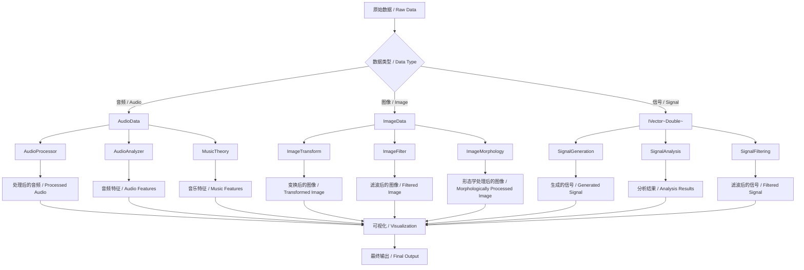
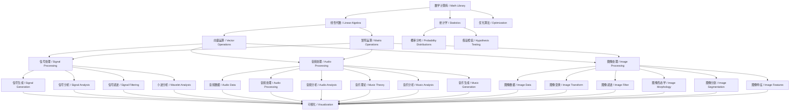
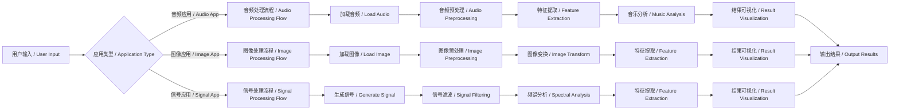
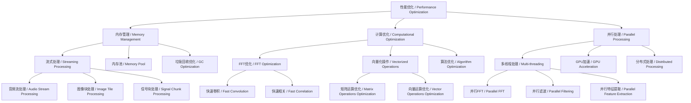

# 综合包关系图 / Comprehensive Package Relationships

## 包间关系概览 / Package Relationship Overview

```mermaid
graph TB
    subgraph "核心数学库 / Core Math Library"
        A[IVector] --> B[IMatrix]
        C[Linalg] --> A
        C --> B
        D[Stats] --> E[Probability Distributions]
    end
    
    subgraph "信号处理包 / Signal Processing Package"
        F[SignalGeneration] --> G[SignalAnalysis]
        F --> H[SignalFiltering]
        F --> I[SignalUtilities]
        J[RereFFT] --> G
        K[RereDCT] --> G
        L[Complex] --> J
        M[WaveletAnalysis] --> G
        N[WaveletFilters] --> M
    end
    
    subgraph "音频处理包 / Audio Processing Package"
        O[AudioData] --> P[AudioProcessor]
        O --> Q[AudioAnalyzer]
        O --> R[AudioVisualizer]
        O --> S[AudioStatistics]
        O --> T[AudioFeatures]
        U[MusicTheory] --> V[MusicAnalyzer]
        U --> W[MusicGenerator]
        U --> X[MusicVisualizer]
    end
    
    subgraph "图像处理包 / Image Processing Package"
        Y[ImageData] --> Z[ImageTransform]
        Y --> AA[ImageFilter]
        Y --> BB[ImageMorphology]
        Y --> CC[ImageSegmentation]
        Y --> DD[ImageFeatures]
        Y --> EE[ImageUtils]
    end
    
    subgraph "可视化包 / Visualization Package"
        FF[Plots] --> GG[IPlot]
        HH[ThemeManager] --> FF
        II[ColorPalette] --> FF
    end
    
    subgraph "机器学习包 / Machine Learning Package"
        JJ[Classification] --> KK[Regression]
        LL[Optimization] --> JJ
        LL --> KK
    end
    
    subgraph "数据包 / Data Package"
        MM[DataFrame] --> NN[Column]
        OO[ColumnType] --> NN
    end
    
    %% 跨包依赖关系 / Cross-package Dependencies
    A --> O
    B --> Q
    A --> Y
    B --> Z
    A --> F
    B --> G
    
    G --> Q
    H --> P
    I --> P
    
    FF --> R
    FF --> X
    FF --> Z
    
    D --> S
    E --> S
    
    JJ --> T
    KK --> T
    
    MM --> O
    MM --> Y
    MM --> F
```

## 详细类关系图 / Detailed Class Relationship Diagram

```mermaid
classDiagram
    class IVector {
        <<interface>>
        +length() int
        +get(int) Double
        +set(int, Double) IVector
        +add(IVector) IVector
        +multiply(IVector) IVector
        +mean() Double
        +std() Double
    }
    
    class IMatrix {
        <<interface>>
        +getRowNum() int
        +getColNum() int
        +get(int, int) Double
        +set(int, int, Double) IMatrix
        +multiply(IMatrix) IMatrix
        +transpose() IMatrix
    }
    
    class AudioData {
        -samples: IVector~Double~
        -sampleRate: double
        -channels: int
        -bitDepth: int
        -duration: double
        -format: AudioFormat
        +getSamples() IVector~Double~
        +getChannel(int) IVector~Double~
        +isMono() boolean
        +isStereo() boolean
    }
    
    class AudioAnalyzer {
        +calculateSpectrum(AudioData) Tuple2
        +calculateSTFT(AudioData, int, int) IMatrix~Double~
        +extractFeatures(AudioData) AudioFeatures
        +detectPitch(AudioData) double
    }
    
    class AudioProcessor {
        +adjustVolume(AudioData, double) AudioData
        +normalize(AudioData) AudioData
        +monoToStereo(AudioData) AudioData
        +stereoToMono(AudioData) AudioData
        +resample(AudioData, double) AudioData
        +filter(AudioData, FilterType, double) AudioData
    }
    
    class MusicTheory {
        +generateScale(int, ScaleType) int[]
        +generateChord(int, ChordType) int[]
        +detectKey(AudioData) Key
        +detectChord(AudioData) Chord
        +semitonesToFrequency(int) double
        +frequencyToSemitones(double) int
    }
    
    class MusicAnalyzer {
        +detectBeats(AudioData) BeatDetectionResult
        +extractMusicFeatures(AudioData) MusicFeatures
        +analyzeMusicStructure(AudioData) String
        +detectMusicGenre(AudioData) String
        +calculateMusicSimilarity(AudioData, AudioData) double
    }
    
    class MusicGenerator {
        +generateRandomMelody(int, ScaleType, int, int, double, int) Melody
        +generateChordProgression(Key, ChordType[], int, double, double) AudioData
        +generateScaleExercise(int, ScaleType, int, double, double) AudioData
        +generateMetronome(double, double, double, int) AudioData
    }
    
    class ImageData {
        -width: int
        -height: int
        -channels: int
        -data: IVector~Double~
        -format: ImageFormat
        +getPixel(int, int, int) double
        +setPixel(int, int, int, double) void
        +getChannel(int) IVector~Double~
        +separateChannels() ImageData[]
    }
    
    class ImageTransform {
        +translate(ImageData, int, int) ImageData
        +rotate(ImageData, double) ImageData
        +scale(ImageData, double, double) ImageData
        +fft2D(ImageData) IMatrix~Complex~
        +dct2D(ImageData) IMatrix~Double~
    }
    
    class ImageFilter {
        +gaussianFilter(ImageData, double) ImageData
        +laplacianFilter(ImageData) ImageData
        +sobelEdgeDetection(ImageData) ImageData
        +medianFilter(ImageData, int) ImageData
        +bilateralFilter(ImageData, double, double) ImageData
    }
    
    class ImageMorphology {
        +erode(ImageData, IMatrix~Double~) ImageData
        +dilate(ImageData, IMatrix~Double~) ImageData
        +opening(ImageData, IMatrix~Double~) ImageData
        +closing(ImageData, IMatrix~Double~) ImageData
    }
    
    class SignalGeneration {
        +sineWave(int, double, double, double, double) IVector~Double~
        +cosineWave(int, double, double, double, double) IVector~Double~
        +squareWave(int, double, double, double, double) IVector~Double~
        +whiteNoise(int, double) IVector~Double~
        +pinkNoise(int, double) IVector~Double~
    }
    
    class SignalAnalysis {
        +powerSpectralDensity(IVector~Double~, int, double, double) Tuple2
        +shortTimeFourierTransform(IVector~Double~, int, int) IMatrix~Double~
        +autocorrelation(IVector~Double~) IVector~Double~
        +crossCorrelation(IVector~Double~, IVector~Double~) IVector~Double~
        +signalToNoiseRatio(IVector~Double~, IVector~Double~) double
    }
    
    class SignalFiltering {
        +movingAverage(IVector~Double~, int) IVector~Double~
        +medianFilter(IVector~Double~, int) IVector~Double~
        +gaussianFilter(IVector~Double~, double) IVector~Double~
        +butterworthLowPass(IVector~Double~, double, double, int) IVector~Double~
        +butterworthHighPass(IVector~Double~, double, double, int) IVector~Double~
        +bandPass(IVector~Double~, double, double, double, int) IVector~Double~
    }
    
    class RereFFT {
        +fft(Complex[]) Complex[]
        +ifft(Complex[]) Complex[]
        +magnitudeSpectrum(Complex[]) IVector~Double~
        +phaseSpectrum(Complex[]) IVector~Double~
        +powerSpectrum(Complex[]) IVector~Double~
    }
    
    class WaveletAnalysis {
        +continuousWaveletTransform(IVector~Double~, double[], String) IMatrix~Double~
        +discreteWaveletTransform(IVector~Double~, String, int) Tuple2
        +softThresholding(IVector~Double~, double) IVector~Double~
        +hardThresholding(IVector~Double~, double) IVector~Double~
    }
    
    %% 关系定义 / Relationship Definitions
    AudioData --> IVector : uses
    AudioAnalyzer --> IMatrix : uses
    AudioProcessor --> SignalFiltering : uses
    MusicTheory --> SignalGeneration : uses
    MusicAnalyzer --> AudioAnalyzer : uses
    MusicGenerator --> MusicTheory : uses
    
    ImageData --> IVector : uses
    ImageTransform --> IMatrix : uses
    ImageFilter --> SignalFiltering : uses
    
    SignalAnalysis --> RereFFT : uses
    SignalFiltering --> SignalGeneration : uses
    WaveletAnalysis --> SignalAnalysis : uses
```

## 数据流图 / Data Flow Diagram

## 功能层次图 / Functionality Hierarchy

## 使用场景图 / Usage Scenarios

## 性能优化关系图 / Performance Optimization Relationships

这个综合关系图展示了三个包之间的复杂关系，包括：

1. **依赖关系**：哪些类依赖于其他类
2. **数据流**：数据如何在不同的处理阶段之间流动
3. **功能层次**：从基础数学库到高级应用功能的层次结构
4. **使用场景**：不同应用类型如何使用这些包
5. **性能优化**：如何优化整个系统的性能

这些关系图帮助理解整个系统的架构，以及如何有效地使用和扩展这些包。
