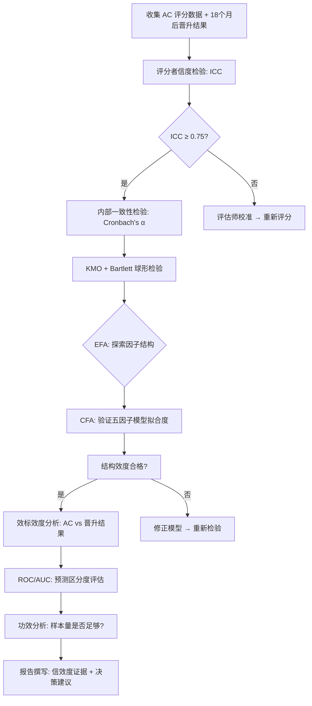

# 管理干部评估中心（AC）效度验证模型

## 📖 背景

评估中心（Assessment Center, AC）是现代企业人才选拔的核心工具之一，广泛应用于管理干部的晋升选拔。AC 通常包含公文筐处理、角色扮演、案例分析、商业模拟、360° 评估等多种情境模拟环节，由多名评估师对候选人在多个能力维度上的表现进行评分。

然而，AC 成本高昂（每次评估耗时 1-2 天，需要多名训练有素的评估师），且其评估结果是否真正能够预测候选人的未来绩效，是企业决策者最关心的问题。

**效度验证（Validity Verification）**回答的核心问题是：**AC 的评分结果到底准不准？它能否有效区分未来会成功的晋升者和失败者？**

```
信度（Reliability）：测量是否稳定一致？
效度（Validity）：测量是否真正在测想要测的东西？
功效（Power）：样本量是否足够发现真实的预测效应？
```

## 🧮 研究框架

### 信度分析（Reliability Analysis）

| 信度类型 | 测量内容 | 判定标准 |
|---------|---------|---------|
| 评分者信度（ICC）| 不同评估师对同一候选人的评分一致性 | ICC ≥ 0.75 |
| 内部一致性（α/ω）| 同一能力维度下各评分点的一致性 | α ≥ 0.70 |
| 重测信度 | 同一候选人间隔一段时间后的评分稳定性 | r ≥ 0.60 |
| 评估师一致性（Kendall's W）| 多名评估师排名的协调程度 | W ≥ 0.70 |

### 效度分析（Validity Analysis）

| 效度类型 | 测量内容 | 方法 |
|---------|---------|------|
| 内容效度 | 评估任务是否覆盖预设能力维度 | 专家评审 + CVR |
| 结构效度 | 评估数据的因子结构是否符合理论预设 | KMO + Bartlett → EFA → CFA |
| 效标效度 | AC 评分与未来实际绩效的相关程度 | 相关分析 + ROC/AUC |
| 收敛效度 | 同一维度的 AC 评分与其他测量工具的一致性 | 与 JSS/360° 结果相关 |
| 区分效度 | 不同能力维度之间是否有足够区分度 | AVE 平方根 vs 相关系数矩阵 |

### 功效分析（Power Analysis）

| 分析场景 | 效应量 | 所需样本（每组） |
|---------|-------|----------------|
| 相关系数检验（效标效度）| r = 0.30 | N = 124 |
| 独立 t 检验（高/低分组差异）| d = 0.40 | N = 99/组 |
| 逻辑回归（预测晋升成功）| OR = 2.5 | N ≈ 165 |
| 验证性因子分析（CFA）| — | N ≥ 250 |

## 📊 代码框架

### 流程图



### 核心代码逻辑

#### 1. 评分者信度（ICC）计算

```java
// ICC(2,1) 双向随机效应模型
// 输入: ratings[评估师数量][被试数量]

double msBetweenSubjects = computeMeanSquareBetween(ratings);
double msError = computeMeanSquareWithin(ratings);
double msRaters = computeMeanSquareRaters(ratings);

int k = nRaters;  // 评估师数量
int n = nSubjects; // 被试数量

double icc = (msBetweenSubjects - msError) / 
             (msBetweenSubjects + (k - 1) * msError + (k / n) * (msRaters - msError));

// 判定: ICC >= 0.75 → 信度良好
```

#### 2. Cronbach's α 内部一致性

```java
// α = (k / (k-1)) * (1 - Σθ_ii / Σλ_ii)
// 其中 θ_ii = 独特性, λ_ii = 因子载荷平方

double sumItemVariances = computeSumItemVariances(items);
double sumTotalVariance = computeTotalVariance(items);
double alpha = (nItems / (nItems - 1)) * 
               (1 - sumItemVariances / sumTotalVariance);
```

#### 3. 结构效度 EFA

```java
// KMO 检验
double kmo = computeKMO(data);

// Bartlett 球形检验
double chiSq = computeBartlettChiSquare(data);
double pValue = computeBartlettPValue(chiSq, df);

// 因子载荷计算（主成分 + Varimax 旋转）
FactorResult factors = extractFactors(data, nFactors, "varimax");
```

#### 4. 效标效度 ROC/AUC 分析

```java
// AC 评分预测 18 个月后晋升成功
double[] scores = acTotalScores;    // AC 综合评分
int[] labels = promotionSuccess;    // 0/1: 是否晋升成功

// 计算 ROC 曲线
ROCResult roc = computeROC(scores, labels);
double auc = roc.auc;  // AUC >= 0.70 → 区分度可接受
```

## 📈 期望输出

运行后应该看到：

```
>>> Step 1: 评分者信度分析...
   ICC(2,1) = 0.82 (95% CI: 0.71-0.89)
   判定: 信度良好 (ICC >= 0.75) ✓

>>> Step 2: 内部一致性检验...
   战略思维 α = 0.81 | 压力决策 α = 0.77
   沟通协调 α = 0.79 | 团队领导 α = 0.83
   商业敏锐 α = 0.76
   判定: 所有维度内部一致性可接受 ✓

>>> Step 3: 结构效度检验...
   KMO = 0.84 (优秀)
   Bartlett 检验: χ² = 892.3, p < 0.001
   CFA 拟合指标:
     - RMSEA = 0.062 (可接受)
     - CFI = 0.93 (可接受)
     - TLI = 0.91 (可接受)
     - SRMR = 0.058 (可接受)
   判定: 五因子结构拟合良好 ✓

>>> Step 4: 效标效度分析...
   AC 总分 vs 晋升成功相关系数: r = 0.34 (p < 0.001)
   AUC = 0.74 (区分度可接受)
   高分组(前25%)晋升成功率: 72%
   低分组(后25%)晋升成功率: 31%
   判定: 效标效度成立 ✓

>>> Step 5: 功效分析验证...
   当前样本 N = 218, 功效 = 0.83 (超过 0.80 标准) ✓
   结论: 样本量足够，统计结论可靠
```

## 🚀 运行方法

```bash
cd /home/reremouse/work/yishape-math
javac -encoding UTF-8 -cp "$(find . -name '*.jar' | tr '\n' ':'):." \
    model_zoo/assessment_center/AssessmentCenterValidity.java -d /tmp/ac_classes
java -cp "$(find . -name '*.jar' | tr '\n' ':'):/tmp/ac_classes" \
    model_zoo.assessment_center.AssessmentCenterValidity
```

## 💡 扩展思考

### 1. AC 效度验证的经典文献

| 研究 | 核心发现 |
|-----|---------|
| Schmidt & Hunter (1998) | AC 对管理者绩效的预测效度 r ≈ 0.38 |
| Howard & Howard (2009) | 五因子模型（战略/决策/沟通/领导/商业敏锐）在跨文化中稳健 |
| Thornton & Rupp (2006) | SECS 模型为 AC 提供了理论框架 |

### 2. AC 与其他选拔工具的比较

| 选拔工具 | 预测效度 r | 成本 | 适用场景 |
|---------|-----------|-----|---------|
| 认知能力测试 | 0.51 | 低 | 入门级岗位 |
| AC | 0.38 | 高 | 中高层管理岗位 |
| 结构化面试 | 0.31 | 中 | 所有层级 |
| 360° 评估 | 0.15 | 中 | 发展性评估（非选拔）|

### 3. 效度验证的常见陷阱

- **效标污染**：评估师知道候选人的背景信息，影响评分
- **范围限制**：样本中都是已晋升者，缺乏真正的"低绩效"对照组
- **时效性**：18个月后的绩效受太多混淆因素影响

### 4. 中国企业 AC 实践

- 央企/国企干部选拔：AC 逐渐成为标配，但效度验证较少被认真执行
- 互联网公司：更注重"潜力"而非"经验"，维度会有所不同
- 家族企业：AC 可提供相对客观的晋升依据，减少裙带争议

## 📚 涉及的 YiShape Math 模块

| 模块 | 核心类/方法 | 用途 |
|------|-----------|------|
| **stats.descriptive** | `DescriptiveStats.mean()`, `DescriptiveStats.variance()` | 描述性统计 |
| **stats.test** | `TTest`, `ChiSquareTest` | t 检验和卡方检验 |
| **stats.anova** | `ANOVA.oneWay()` | 方差分析 |
| **linalg** | `Linalg.matrix()`, `IMatrix.transpose()` | 矩阵运算 |
| **optimize** | `RereLBFGS` | 优化求解 |
| **viz** | `Plots.roc()`, `Plots.scatter()` | ROC 曲线和散点图 |
