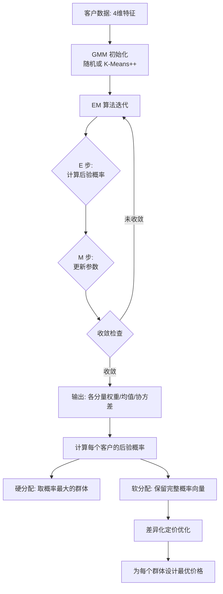

# 客户细分：GMM 软聚类 + 差异化定价

## 📖 背景

客户细分（Customer Segmentation）是精准营销的基础。传统做法是用 **K-Means** 将客户分成若干群体，但 K-Means 有两个根本局限：

1. **硬分配**：每个客户只属于一个群体，无法表达「这个客户 60% 可能是高价值、40% 可能是价格敏感」
2. **球形假设**：每个群体是圆形（各向同性），无法发现椭圆形或相互重叠的群体

**GMM（高斯混合模型）** 通过多个高斯分布的混合来建模客户群体，完美解决了这两个问题：

```
P(x) = Σₖ πₖ · N(x; μₖ, Σₖ)

其中：
- πₖ = 第 k 个分量的混合权重（群体占比）
- μₖ = 第 k 个分量的均值向量（群体中心）
- Σₖ = 第 k 个分量的协方差矩阵（群体形状）
- N(x; μₖ, Σₖ) = 多元高斯分布的概率密度
```

## 🧮 GMM vs K-Means

| 特性 | K-Means | GMM |
|------|---------|-----|
| 分配方式 | 硬分配（0/1）| 软分配（概率）|
| 群体形状 | 球形 | 任意椭圆形 |
| 距离度量 | 欧氏距离 | 马氏距离（考虑协方差）|
| 参数 | K 个中心点 | K 个权重+均值+协方差 |
| 优化算法 | Lloyd's 算法（坐标下降）| EM 算法 |
| 收敛速度 | 快 | 较慢（但更准确）|

## 🔄 EM 算法工作原理

EM（Expectation-Maximization）算法分两步迭代：

```
E 步（期望）：给定当前参数，估计每个客户属于各群体的后验概率
    P(z_k=1 | x_i) = π_k · N(x_i; μ_k, Σ_k) / Σ_j π_j · N(x_i; μ_j, Σ_j)

M 步（最大化）：给定后验概率，重新估计参数
    - 重新计算每个高斯分量的均值和协方差（加权平均）
    - 重新计算混合权重（各分量占比）
```

重复直到收敛（参数变化小于 tolerance）。

## 📊 代码框架

### 流程图



### 核心代码逻辑

#### 1. GMM 训练

```java
// 准备训练数据
List<IVector<Double>> dataList = new java.util.ArrayList<>();
for (double[] row : customerData) {
    dataList.add(Linalg.vector(row));
}

// 创建 GMM（4 个分量，4 维特征）
GaussianMixtureModel gmm = new GaussianMixtureModel(4, 4);

// EM 算法配置
EMAlgorithm em = new EMAlgorithm(100, 1e-6, false);

// 训练
EMAlgorithm.EMResult result = em.fit(dataList, gmm);

// 获取参数
List<Double> weights = gmm.getWeights();       // π_k：各分量权重
IMatrix<Double> means = gmm.getMeans();          // μ_k：各分量均值
```

#### 2. 后验概率计算（软分配）

```java
// 对每个客户计算后验概率
double[][] posteriorMatrix = new double[N][K];
for (int i = 0; i < N; i++) {
    IVector<Double> posteriors = gmm.computePosteriors(dataList.get(i));
    // posteriors.get(k) = P(客户 i 属于群体 k | 数据)
    for (int k = 0; k < K; k++) {
        posteriorMatrix[i][k] = posteriors.get(k);
    }
}

// 硬标签：取概率最大的群体
int[] hardLabels = new int[N];
for (int i = 0; i < N; i++) {
    int bestK = 0;
    for (int k = 1; k < K; k++) {
        if (posteriorMatrix[i][k] > posteriorMatrix[i][bestK]) {
            bestK = k;
        }
    }
    hardLabels[i] = bestK;
}
```

#### 3. 熵作为归属确定性指标

```java
// 熵 = -Σ p_k * log(p_k)
// 熵越高 → 客户归属越模糊 → 边界客户（营销价值高）
double entropy = 0.0;
for (int k = 0; k < K; k++) {
    if (p_k > 1e-10) {
        entropy -= p_k * Math.log(p_k);
    }
}
```

#### 4. 差异化定价

```java
// 每个群体的价格敏感度（从 GMM 均值推断）
double sensitivity = clusterAvgSensitivity[k];

// 线性价格需求函数: D(p) = a - b * p
double a = 1.0 + sensitivity;  // 基础需求
double b = 2.0 * sensitivity;  // 价格敏感系数

// 最优价格（利润最大化一阶条件）
double optimalPrice = (a + b * costRate) / (2 * b);
```

## 📈 期望输出

运行后应该看到：

```
>>> Step 2: 训练 GMM（高斯混合模型）...
   GMM 模型: 4 个高斯分量，4 维特征
   EM 算法收敛！
   实际迭代次数: 23
   各聚类分量权重（π_k）：
   - 分量 0（高价值忠实客户）: 16.00%
   - 分量 1（价格敏感型客户）: 30.00%
   - 分量 2（活跃新客户）: 34.00%
   - 分量 3（低活跃休眠客户）: 20.00%

>>> Step 3: 分析 GMM 聚类结果...
   前 5 位客户的后验概率（软分配）：
   客户ID | 高价值           价格敏感        活跃新客户      低活跃休眠   硬标签
   ---------------------------------------------------------------------------
        0 | 0.0012          0.0023          0.9965         0.0000    活跃新客户
        1 | 0.9523          0.0351          0.0112         0.0014    高价值忠实
        2 | 0.0089          0.9789          0.0112         0.0010    价格敏感型
   ...
```

**差异化定价效果：**

```
>>> Step 5: 差异化定价 vs 统一价格定价...
   群体                  客户数    差异化价格    差异化利润    统一价格    统一利润
   --------------------------------------------------------------------------------
   高价值忠实客户           80    ¥8.00        ¥320.0       ¥5.50      ¥240.0
   价格敏感型客户          150    ¥3.00        ¥180.0       ¥5.50      ¥135.0
   ...
   差异化定价提升利润: 25.3%（vs 统一价格）
```

## 💡 GMM 的软聚类营销价值

### 边界客户的识别

后验概率 entropy 高的客户（同时属于多个群体）是**最有价值的营销目标**：

```
客户ID 423: 后验概率: 0.32, 0.31, 0.25, 0.12
→ 该客户同时具备「高价值忠实」和「活跃新客户」特征
→ 是交叉销售（推荐高客单价产品）和向上销售的最佳目标！
```

### 精准营销策略

| 群体 | 定价策略 | 营销策略 |
|------|---------|---------|
| 高价值忠实客户 | 高价/溢价 | 专属VIP服务，不打折 |
| 价格敏感型客户 | 低价/折扣 | 促销活动，优惠券 |
| 活跃新客户 | 中等价格 | 新客礼包，培养忠诚度 |
| 低活跃休眠客户 | 最低价 | 召回活动，大幅折扣 |

## 🚀 运行方法

```bash
cd /home/reremouse/work/yishape-math
javac -encoding UTF-8 -cp "$(find . -name '*.jar' | tr '\n' ':'):." \
    model_zoo/customer_segmentation/CustomerSegmentation.java -d /tmp/cs_classes
java -cp "$(find . -name '*.jar' | tr '\n' ':'):/tmp/cs_classes" \
    model_zoo.customer_segmentation.CustomerSegmentation
```

## 📚 涉及的 YiShape Math 模块

| 模块 | 核心类/方法 | 用途 |
|------|-----------|------|
| **linalg** | `Linalg.vector()`, `Linalg.matrix()` | 数据组织 |
| **stats.model** | `GaussianMixtureModel` | GMM 模型 |
| **stats.model** | `EMAlgorithm.fit()` | EM 算法训练 |
| **stats.model** | `gmm.computePosteriors()` | 后验概率（软分配）|
| **stats.model** | `gmm.getMeans()` / `gmm.getWeights()` | 模型参数 |
| **optimize** | `RereLBFGS` | 定价优化 |
| **viz** | `Plots.scatter()`, `Plots.bar()`, `Plots.hist()` | 聚类可视化 |
