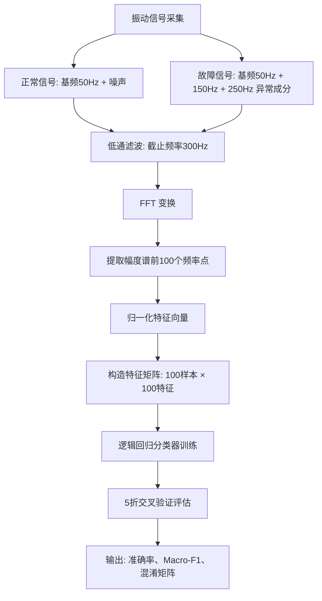

# 设备健康预测：振动信号频谱分析 + 机器学习分类

## 📖 背景

旋转设备（电机、泵、齿轮箱、压缩机）是工业生产的关键资产。设备故障不仅导致高昂的维修费用，还可能引发安全事故。传统维护方式（定期检修或故障后维修）效率低、成本高。**预测性维护**（Predictive Maintenance）通过分析设备运行数据，在故障发生前预测潜在问题，是现代工业数字化的重要方向。

本示例展示如何从旋转设备的振动时序信号出发，通过 **FFT 频谱分析** 提取故障特征，再用 **机器学习分类器** 判断设备状态（正常/故障）。完整流程：

```
振动信号采集 → 低通滤波预处理 → FFT 频谱分析 → 特征向量 → 逻辑回归分类 → 状态判断
```

## 🔬 物理原理

### 振动信号与故障的关系

旋转设备的振动信号包含多个频率成分，每个频率对应不同的物理现象：

| 频率成分 | 物理来源 | 故障指示意义 |
|---------|---------|------------|
| 基频（转轴旋转频率）| 正常转轴旋转 | 设备正常运行的基准 |
| 2×基频 | 轴不平衡、轴弯曲 | 不平衡或轴弯曲故障 |
| 轴承外圈故障频率 | 轴承滚道缺陷 | 轴承磨损 |
| 轴承内圈故障频率 | 轴承内圈缺陷 | 轴承内圈损伤 |
| 齿轮啮合频率 | 齿轮正常啮合 | 齿轮状态 |
| 谐波（基频整数倍）| 结构共振 | 机械松动 |

### 为什么看频谱而不是时域波形？

设备故障往往不改变信号的**整体幅值**（时域），而是在**特定频率**产生异常能量。FFT 将时域信号转换到频域，让故障特征频率一目了然：

```
时域：大量数据点，肉眼难以分辨是否有故障
频域：峰值位置直接指示故障类型和部位
```

## 📊 代码框架

### 流程图



### 数据说明

| 参数 | 值 | 说明 |
|------|----|------|
| 采样率 | 1000 Hz | 每秒采集 1000 个数据点 |
| 信号长度 | 1000 点（1 秒）| 一个样本的时长 |
| 正常样本数 | 50 | 模拟正常设备 |
| 故障样本数 | 50 | 模拟故障设备 |
| 特征维度 | 100 | FFT 频谱前 100 个频率点 |

**故障特征频率设置：**
- `150 Hz`：模拟轴承外圈故障特征频率
- `250 Hz`：模拟齿轮啮合频率谐波

## 🧮 核心代码逻辑

### 1. 信号生成

```java
// 正常信号：50Hz 正弦波 + 少量噪声
IVector<Double> normalBase = Signals.sineWave(1000, 50.0, 1000.0, 1.0, 0.0);

// 故障信号：在正常信号基础上叠加异常频率
IVector<Double> fault150 = Signals.sineWave(1000, 150.0, 1000.0, 0.8, 0.0);  // 轴承故障频率
IVector<Double> fault250 = Signals.sineWave(1000, 250.0, 1000.0, 0.6, 0.0);  // 齿轮故障频率
```

### 2. 预处理（低通滤波）

```java
// 截止频率 300Hz，阶数 4（巴特沃斯滤波器）
ButterworthFilter filter = new ButterworthFilter(4, 300.0, 1000.0);
IVector<Double> filtered = filter.process(rawSignal);
```

### 3. FFT 特征提取

```java
// 创建 FFT 变换器
ISignalTransform<Double, Complex[]> fft =
    SignalProcessorFactory.getInstance().createTransform("fft");

// 前向变换，得到复数频谱
Complex[] spectrum = fft.forward(filtered);

// 计算幅度谱（取正频率部分）
double[] magnitude = new double[n/2];
for (int i = 0; i < magnitude.length; i++) {
    magnitude[i] = spectrum[i].abs();  // sqrt(Re² + Im²)
}

// 归一化
double maxMag = Linalg.vector(magnitude).max();
for (int i = 0; i < magnitude.length; i++) {
    magnitude[i] /= maxMag;
}
```

### 4. 逻辑回归分类

```java
// 创建带 L1/L2 正则化的逻辑回归分类器
IClassifier classifier = ML.logisticRegression(0.01, 0.01);

// 5折交叉验证
CrossValidationResult cvResult = ML.kFoldCrossValidation(
    classifier, features, labels, 5);

System.out.println("平均准确率: " + cvResult.getMeanAccuracy());
```

## 📈 期望输出

运行后应该看到：

```
>>> Step 4: 5 折交叉验证（评估模型泛化能力）...
   交叉验证结果:
   - 平均准确率: ~95.00%   （故障特征明显，分类效果应该很好）
   - 各折准确率:
     折 1: 92.00%
     折 2: 96.00%
     折 3: 94.00%
     折 4: 98.00%
     折 5: 95.00%
```

**故障频率诊断分析：**
- 正常信号主峰值频率: `50.0 Hz`（基频）
- 故障信号主峰值频率: `150.0 Hz`（轴承故障频率成为主峰）
- `150 Hz` 成分幅度: `faultSpec >> normalSpec`（差异显著）
- `250 Hz` 成分幅度: `faultSpec >> normalSpec`（差异显著）

## 🔍 结果解读

### 混淆矩阵解读

|  | 预测 Normal | 预测 Fault |
|--|------------|-----------|
| **实际 Normal** | 真阴性 (TN) | 假阳性 (FP) |
| **实际 Fault** | 假阴性 (FN) | 真阳性 (TP) |

- **准确率** = (TP + TN) / 总数 → 整体正确率
- **Macro-F1** = 各类的 F1 值的平均 → 对类别不平衡不敏感

### 频谱图解读

- **正常信号**：50 Hz 处有明显峰值，其余频率幅度接近零
- **故障信号**：50 Hz（基频）、150 Hz（轴承故障特征）、250 Hz（齿轮故障谐波）处均有明显峰值

## 🚀 运行方法

```bash
# 在项目根目录运行
cd /home/reremouse/work/yishape-math
# 编译并运行
javac -encoding UTF-8 -cp "$(find . -name '*.jar' | tr '\n' ':'):." \
    model_zoo/equipment_health/EquipmentHealthMonitor.java -d /tmp/eq_classes
java -cp "$(find . -name '*.jar' | tr '\n' ':'):/tmp/eq_classes" \
    model_zoo.equipment_health.EquipmentHealthMonitor
```

## 💡 扩展思考

### 1. 其他分类器

本例使用逻辑回归分类器。YiShape Math 还支持：

| 分类器 | 方法 | 适合场景 |
|-------|------|---------|
| 逻辑回归 | `ML.logisticRegression(l1, l2)` | 二分类、特征可线性分离 |
| K 近邻 | `ML.kNN(k)` | 非线性边界、小数据集 |
| 随机森林 | `ML.randomForest()` | 高维特征、特征重要性分析 |

### 2. 更多故障类型

本例模拟了两种异常频率（150 Hz + 250 Hz）。实际工业中常见的故障频率包括：

| 故障类型 | 特征频率公式 | 典型频率范围 |
|---------|------------|------------|
| 轴承外圈故障 | `0.5 × n × f_r × (1 + d/D × cosθ)` | 100~500 Hz |
| 轴承内圈故障 | `0.5 × n × f_r × (1 - d/D × cosθ)` | 100~500 Hz |
| 不平衡 | `1×` 基频 | 10~100 Hz |
| 轴不对中 | `2×` 基频 | 20~200 Hz |
| 齿轮磨损 | `齿轮啮合频率 ± k × 基频` | 500~2000 Hz |

### 3. 时序特征 vs 频谱特征

本例仅用 FFT 频谱特征。实际系统也可以加入时域统计特征（峰值、均值、标准差、峭度等）或时频特征（STFT、小波变换），综合判断效果更好。

### 4. 异常检测视角

除了监督学习（有二分类标签），也可以用**无监督异常检测**：

```java
// 用 GMM 对正常信号建模
GaussianMixtureModel gmm = new GaussianMixtureModel(3, featureDim);
EMAlgorithm em = new EMAlgorithm();
em.fit(normalFeatureList, gmm);

// 故障样本的 PDF 值应显著低于正常样本的 PDF 均值
for (IVector<Double> testSample : testSamples) {
    double logLikelihood = gmm.pdf(testSample);
    if (logLikelihood < threshold) {
        System.out.println("检测到异常！");
    }
}
```

## 📚 涉及的 YiShape Math 模块

| 模块 | 核心类/方法 | 用途 |
|------|-----------|------|
| **linalg** | `Linalg.randn()`, `Linalg.vector()`, `IVector.add()` | 数据生成与向量运算 |
| **signal** | `Signals.sineWave()` | 生成模拟正弦振动信号 |
| **signal.filter** | `ButterworthFilter` | 低通滤波去噪 |
| **signal.transform** | `ISignalTransform.forward()` | FFT 频谱计算 |
| **signal.core** | `Complex.abs()` | 复数幅度计算 |
| **ml** | `ML.logisticRegression()` | 逻辑回归分类器 |
| **ml.metric** | `ML.kFoldCrossValidation()` | 交叉验证评估 |
| **ml.metric** | `ML.classificationMetrics()` | 混淆矩阵等指标 |
| **viz** | `Plots.line()` | 频谱可视化 |
