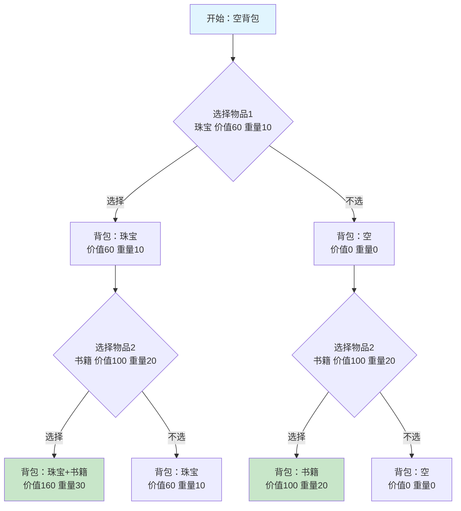
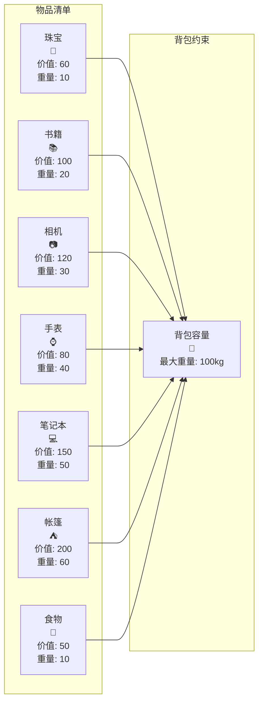
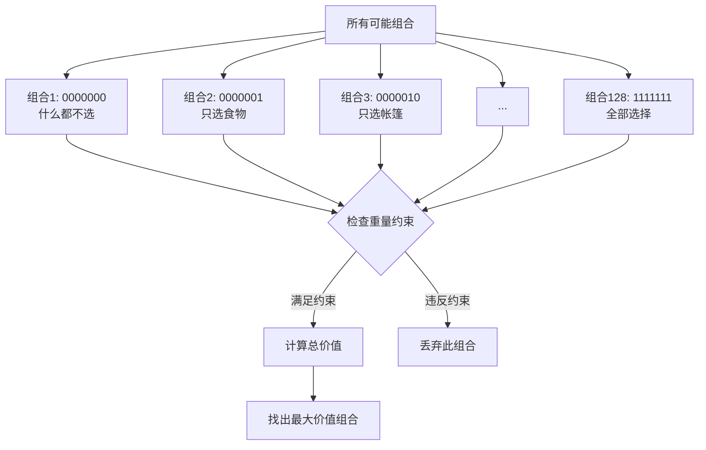
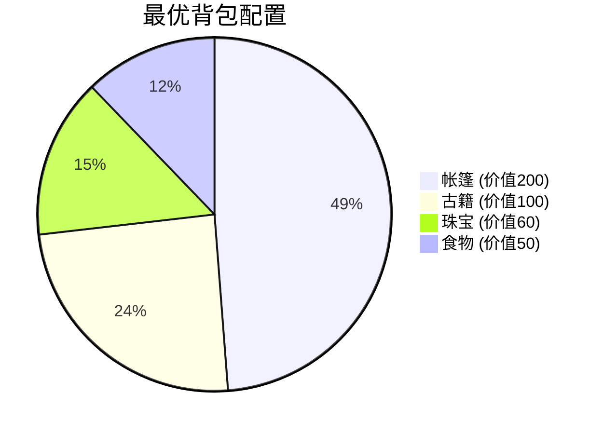
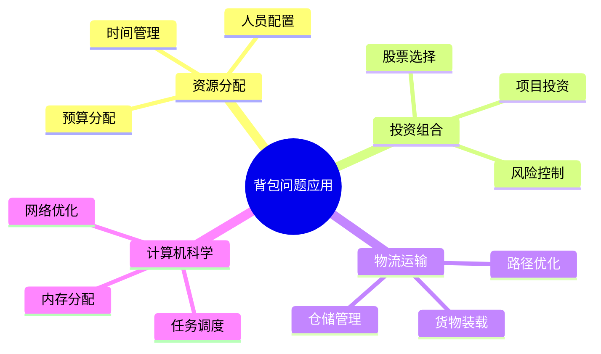

# 🎒 背包问题：一场智慧与选择的博弈

## 📖 故事的开始

想象一下，你是一位即将踏上冒险之旅的探险家。面前摆放着各种珍贵的物品：闪闪发光的珠宝、厚重的古籍、精密的相机、华丽的手表、强大的笔记本电脑、实用的帐篷，还有维持生命的食物。

但是，你的背包容量有限！你只能带走总重量不超过100公斤的物品。每件物品都有其独特的价值和重量，你需要做出明智的选择，让背包里的物品总价值最大化。

这就是经典的**0-1背包问题**——一个看似简单，却蕴含深刻数学智慧的优化问题。

## 🎯 问题的本质

### 什么是0-1背包问题？

0-1背包问题是这样定义的：
- 有一个容量为 `W` 的背包
- 有 `n` 个物品，每个物品有重量 `w[i]` 和价值 `v[i]`
- 每个物品要么完整地放入背包（选择1），要么不放入（选择0）
- 目标是在不超过背包容量的前提下，使背包中物品的总价值最大

### 数学表达

```
最大化：∑(v[i] * x[i])  其中 i = 1 到 n
约束条件：∑(w[i] * x[i]) ≤ W
变量约束：x[i] ∈ {0, 1}
```

其中 `x[i]` 是决策变量，表示第i个物品是否被选中。

## 🗺️ 问题的可视化

让我们通过图表来直观理解这个问题：



## 📊 我们的冒险物品清单

让我们看看探险家面临的具体选择：



## 🧮 解决方案的思路

### 1. 暴力枚举法
最直接的方法是尝试所有可能的组合。对于7个物品，我们有 2^7 = 128 种可能的选择。



### 2. 动态规划法
更聪明的方法是使用动态规划，避免重复计算。

### 3. 整数规划法
将问题建模为整数规划问题，使用专门的求解器求解（这正是我们的Java代码所采用的方法）。

## 🎯 最优解的发现

通过运行我们的Java程序 `KnapsackProblem.java`，我们可以得到精确的最优解！

让我们先分析一下各物品的价值密度，然后看看实际的最优解：

### 💡 价值密度分析

| 物品 | 价值 | 重量 | 价值密度 |
|------|------|------|----------|
| 珠宝💎 | 60 | 10 | 6.0 |
| 食物🍎 | 50 | 10 | 5.0 |
| 古籍📚 | 100 | 20 | 5.0 |
| 相机📷 | 120 | 30 | 4.0 |
| 帐篷⛺ | 200 | 60 | 3.33 |
| 笔记本💻 | 150 | 50 | 3.0 |
| 手表⌚ | 80 | 40 | 2.0 |

### 🏆 实际最优解

运行Java程序后，我们发现最优策略是：



**最优选择**：珠宝💎 + 古籍📚 + 帐篷⛺ + 食物🍎
- **总价值**：60 + 100 + 200 + 50 = 410
- **总重量**：10 + 20 + 60 + 10 = 100 ≤ 100 ✅

这个结果告诉我们，贪心策略（仅按价值密度选择）并不总能得到最优解！虽然帐篷的价值密度不是最高的，但选择它能够获得更大的总价值。

### 🔍 最优解验证

让我们验证一下为什么这个解是最优的：

**对比分析**：
- **贪心策略解**：珠宝(60) + 古籍(100) + 相机(120) + 食物(50) = 330，重量70kg
- **实际最优解**：珠宝(60) + 古籍(100) + 帐篷(200) + 食物(50) = 410，重量100kg

**关键洞察**：
1. **完全利用容量**：最优解恰好用满了100kg的容量限制
2. **价值最大化**：虽然帐篷的价值密度(3.33)低于相机(4.0)，但帐篷的绝对价值更高
3. **整体优化**：选择帐篷后剩余空间(40kg)无法容纳其他高价值物品，因此这是全局最优解

这完美展示了**整数规划**相比**贪心算法**的优势：能够找到全局最优解而非局部最优解！

## 💻 与Java代码的对应关系

我们的 `KnapsackProblem.java` 完美实现了这个问题的求解：

### 🔗 代码结构对应

| 文档概念 | Java代码实现 | 说明 |
|----------|-------------|------|
| 物品清单 | `itemNames[]`, `values[]`, `weights[]` | 定义了7个物品的属性 |
| 背包容量 | `capacity = 100.0` | 背包最大承重100公斤 |
| 目标函数 | `IVector<Double> c` | 转换为最小化问题的系数向量 |
| 重量约束 | `IMatrix<Double> A_ub`, `IVector<Double> b_ub` | 约束矩阵和约束向量 |
| 0-1变量 | `solver.setAllVariablesBinary()` | 设置所有变量为二进制 |
| 求解过程 | `solver.solve(c, A_ub, b_ub)` | 调用整数规划求解器 |
| 结果分析 | 详细的输出和验证代码 | 展示最优解和验证约束 |

### 🎯 运行Java程序

当你运行 `KnapsackProblem.java` 时，你会看到：

1. **🎒 探险家的物品清单** - 展示所有可选物品
2. **📐 数学建模** - 显示目标函数和约束条件
3. **🔍 求解过程** - 整数规划求解器工作
4. **🏆 最优选择** - 显示最终的选择结果
5. **📈 选择分析** - 详细分析每个物品的选择情况
6. **🔍 约束验证** - 验证解的正确性
7. **🎓 智慧总结** - 总结问题的关键特征

### 🚀 如何运行

```bash
# 在项目根目录下运行
java -cp "libs/*:." model_zoo.knapsack.KnapsackProblem
```

运行后，你将看到探险家如何通过数学优化找到最佳的物品组合！

## 🚀 算法的应用场景

背包问题不仅仅是一个数学游戏，它在现实世界中有着广泛的应用：



## 💡 关键洞察

1. **贪心策略的局限性**：仅仅选择价值密度最高的物品并不总能得到最优解
2. **组合优化的复杂性**：看似简单的问题可能需要复杂的算法来求解
3. **权衡的艺术**：在有限资源下做出最优选择是一门艺术
4. **数学建模的力量**：将实际问题转化为数学模型，可以用计算机精确求解


---

*背包问题教会我们：在有限的资源下，智慧的选择比盲目的贪婪更有价值。* 🎒✨

**现在就运行 `KnapsackProblem.java`，开始你的优化算法探险之旅吧！** 🚀