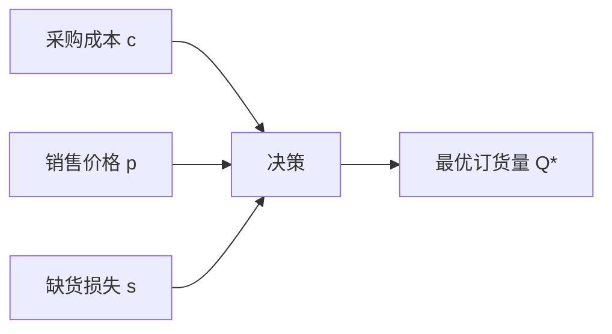
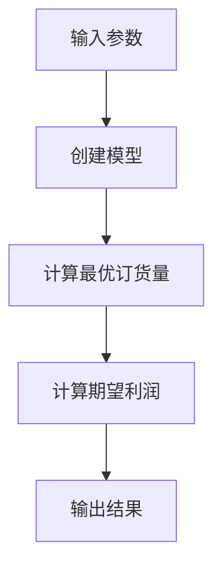
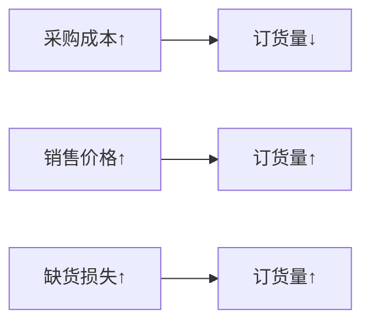
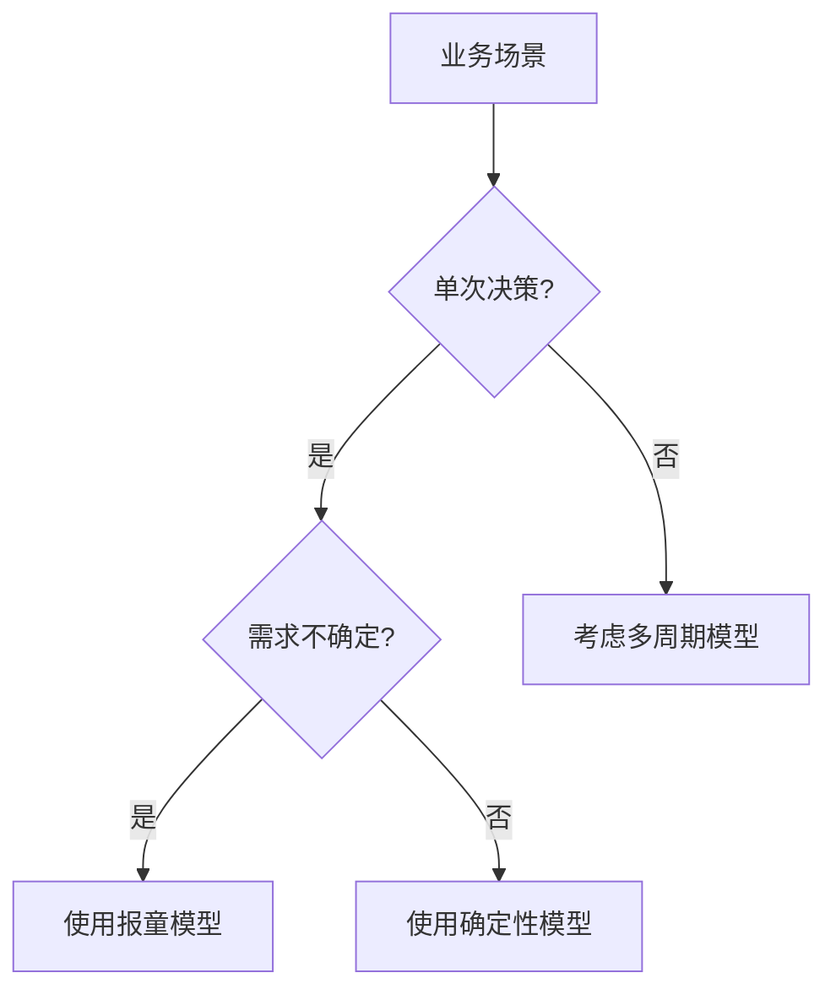

# 报童模型简介

## 什么是报童模型？

报童模型是一个经典的库存决策问题：**报童每天应该订购多少份报纸？**

- 订多了：卖不完，亏钱
- 订少了：不够卖，少赚钱

这个问题在很多行业都存在，比如：
- 服装店进货
- 超市采购生鲜
- 餐厅准备食材

## 问题的关键要素



### 基本参数
- **c**: 每份报纸的采购成本（比如5元）
- **p**: 每份报纸的销售价格（比如10元）
- **s**: 每份缺货的损失（比如3元，顾客不满意）
- **需求**: 不确定的，可能是100份，也可能是120份

## 数学原理（简化版）

### 核心公式
最优订货量的计算公式：
```
临界比率 = (p + s - c) / (p + s)
最优订货量 = 需求分布的临界比率分位数
```

### 举个例子
- 采购成本 c = 5元
- 销售价格 p = 10元  
- 缺货损失 s = 3元

临界比率 = (10 + 3 - 5) / (10 + 3) = 8/13 ≈ 0.615

这意味着应该满足61.5%的需求概率。

## 代码实现解析

### 1. 创建模型

```java
// 设置参数
double purchaseCost = 5.0;    // 采购成本
double sellingPrice = 10.0;   // 销售价格
double shortageCost = 3.0;    // 缺货损失

// 需求分布：平均100份，标准差20份
var demandDist = Stats.norm(100.0, 20.0);

// 创建报童模型
NewsvendorModel model = new NewsvendorModel(
    purchaseCost, sellingPrice, shortageCost, demandDist);
```

### 2. 计算最优解

```java
// 理论最优订货量
double optimalQuantity = model.computeTheoreticalOptimalQuantity();
System.out.println("最优订货量: " + optimalQuantity + " 份");

// 最大期望利润
double maxProfit = model.computeExpectedProfit(optimalQuantity);
System.out.println("最大期望利润: " + maxProfit + " 元");
```

### 3. 运行流程



## 实际应用示例

### 服装店进货
假设你开了一家T恤店：
- 进货价：50元/件
- 售价：100元/件
- 缺货损失：20元/件（顾客流失）
- 历史销量：平均200件，波动40件

```java
NewsvendorModel tshirtModel = new NewsvendorModel(
    50.0, 100.0, 20.0, Stats.norm(200.0, 40.0));

double optimalOrder = tshirtModel.computeTheoreticalOptimalQuantity();
// 结果：大约221件
```

### 结果解读
- **最优进货量**：221件
- **服务水平**：约70%（能满足70%情况下的需求）
- **期望利润**：约8,960元

## 敏感性分析

看看参数变化对结果的影响：



### 成本变化影响

| 采购成本 | 最优订货量 | 期望利润 |
|----------|------------|----------|
| 4元      | 108.2份    | 548.7元  |
| 5元      | 106.6份    | 498.7元  |
| 6元      | 105.0份    | 448.7元  |
| 7元      | 103.4份    | 398.7元  |

## 模型的优缺点

### 优点 ✅
- 数学原理简单清晰
- 计算快速
- 适用范围广

### 局限性 ⚠️
- 只考虑单周期
- 需求分布需要准确
- 不考虑库存成本

## 扩展思考

### 什么时候用报童模型？



### 适用场景
- ✅ 季节性商品
- ✅ 易腐商品
- ✅ 时效性强的产品
- ❌ 可以多次补货的商品
- ❌ 需求很稳定的商品

## 总结

报童模型帮我们回答一个核心问题：**在不确定的需求面前，如何做出最优的库存决策？**

关键要记住：
1. **临界比率**决定了服务水平
2. **成本结构**影响最优订货量
3. **需求预测**的准确性很重要

这个模型虽然简单，但在实际业务中非常实用！