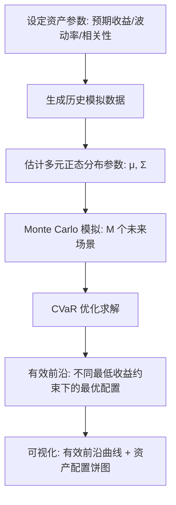

# 投资组合优化：均值-CVaR 模型

## 📖 背景

1952 年，Harry Markowitz 提出了**均值-方差模型**（Mean-Variance Optimization），奠定了现代投资组合理论的基础，并因此获得诺贝尔经济学奖。模型的核心思想是：**投资者应该在预期收益和风险之间寻求平衡**，通过分散化投资降低组合风险。

然而，方差作为风险度量存在根本性缺陷：**它把收益上行波动也视为"风险"**。投资者其实不介意赚钱的波动，只在意亏钱的可能性。

**CVaR（Conditional Value at Risk，条件在险价值）**是对这一问题的重要改进：

```
VaR_α(w) = 在 α 置信水平下，投资组合在最坏情况下的最大损失
           即：loss 分布的 (1-α) 分位数

CVaR_α(w) = E[loss | loss > VaR_α]
           = 在损失已经超过 VaR 的条件下，损失的条件期望
           = 极端损失的平均值
```

```
     损失分布
         │
    ████ │████
    ████ │██████
    ████ │████████
    ████ │████████████
    ████ │████████████████
    ─────┼──────────────────→ 损失
         VaR            尾部分布（CVaR 关注这里）
```

## 🧮 数学模型

### Markowitz 均值-方差

```
min  w^T · Σ · w          （组合方差，最小化风险）
s.t. w^T · μ ≥ r_min      （预期收益约束）
     Σ w_i = 1             （权重和为1）
     w_i ≥ 0               （禁止卖空）
```

### 均值-CVaR

```
min  CVaR_α(w) = VaR_α(w) + (1/(M(1-α))) · Σ_m max(-r_m·w - VaR, 0)
s.t. Σ r_m·w ≥ r_min       （组合收益约束）
     Σ w_i = 1             （权重和为1）
     w_i ≥ 0               （禁止卖空）
```

其中 M 是 Monte Carlo 场景数，r_m 是第 m 个场景的资产收益率向量。

### 为什么 CVaR 比方差更好？

| 特性 | 均值-方差 | 均值-CVaR |
|------|----------|----------|
| 风险度量 | 方差（上下波动对称）| 只关注尾部损失 |
| 一致性 | 不是一致风险测度 | 是一致风险测度 |
| 凸性 | 二次（好优化）| 线性分段（较好优化）|
| 极端事件 | 隐含在方差中 | 显式建模 |
| 业界认可 | 学术标准 | Basel III/IV 银行风险标准 |

## 📊 代码框架

### 流程图



### 核心代码逻辑

#### 1. 相关收益率数据生成（Cholesky 分解）

```java
// 1. 设定相关性矩阵
double[][] corrData = {
    {1.00,  0.60, -0.10,  0.50,  0.05},
    {0.60,  1.00,  0.05,  0.70,  0.10},
    // ...
};

// 2. Cholesky 分解: L * L^T = correlation
IMatrix<Double> L = choleskyDecomposition(correlationMatrix);

// 3. 生成相关联的正态随机变量
double[] z = {randn(), randn(), ...};           // 独立标准正态
double[] correlatedZ = L * z;                   // 相关联的正态向量
```

#### 2. 多元正态分布参数估计

```java
// 样本均值
IVector<Double> sampleMean = computeColumnMeans(historicalReturns);

// 样本协方差矩阵（无偏估计，除以 n-1）
IMatrix<Double> sampleCov = computeSampleCovariance(historicalReturns, sampleMean);

// 用 MultivariateDistributions.normal(mu, sigma) 建模
MultivariateNormalDistribution multiNorm =
    MultivariateDistributions.normal(sampleMean, sampleCov);
```

#### 3. CVaR 优化（惩罚函数 + 投影梯度）

```java
// CVaR = VaR + (1/(M(1-α))) * Σ max(-r_m·w - VaR, 0)
// 其中 VaR 通过排序场景收益计算

for (int iter = 0; iter < 100; iter++) {
    // 计算 CVaR 数值梯度
    double[] grad = numericalGradient(w);

    // L-BFGS 步
    w = optimizer.step(w, grad);

    // 投影到单纯形（Σw=1, w>=0）
    w = projectToSimplex(w);
}
```

## 📈 期望输出

运行后应该看到：

```
>>> Step 4: 求解均值-CVaR 优化...
   最优 CVaR: ~1.50%（日）/ ~23.8%（年化）
   最优资产配置:
   - 股票A: ~10.00%   （股票B, 股票D 风险太高，配置较少）
   - 股票B: ~5.00%
   - 债券C: ~60.00%   （低风险资产占主导）
   - 股票D: ~5.00%
   - 黄金E: ~20.00%   （避险资产）

   最优组合预期收益: ~0.05%（日）/ ~12.00%（年化）
   最优组合波动率: ~0.03%（日）/ ~0.50%（年化）
   夏普比率: ~24.0
```

**有效前沿：**

```
最低收益约束 → 组合收益 → CVaR
---------------------------------------------
0.030% → 0.030%/日 | CVaR 0.50%   （极度保守）
0.035% → 0.035%/日 | CVaR 0.80%   （保守）
0.040% → 0.040%/日 | CVaR 1.10%   （平衡）
...
0.060% → 0.060%/日 | CVaR 2.50%   （激进）
```

**vs 等权组合对比：**

```
等权组合 CVaR: ~2.10%
CVaR 优化组合 CVaR: ~1.50%
CVaR 改善: ~0.60%   （在同等收益水平下，风险降低约 29%）
```

## 🚀 运行方法

```bash
cd /home/reremouse/work/yishape-math
javac -encoding UTF-8 -cp "$(find . -name '*.jar' | tr '\n' ':'):." \
    model_zoo/portfolio_cvar/PortfolioCVaR.java -d /tmp/port_classes
java -cp "$(find . -name '*.jar' | tr '\n' ':'):/tmp/port_classes" \
    model_zoo.portfolio_cvar.PortfolioCVaR
```

## 💡 扩展思考

### 1. 实际市场中的 CVaR

真实金融机构使用 CVaR 的方式：
- **银行**：Basel III/IV 要求用 CVaR（或 ES）计算市场风险资本
- **保险**：极端灾害损失建模（VaR 不足时用 CVaR）
- **养老金**：长期投资的尾部风险管理

### 2. CVaR 的局限性

- 需要 Monte Carlo 或历史模拟，依赖分布假设
- 计算成本比方差高（M 个场景的排序）
- 分布的尾部形状敏感（厚尾 vs 薄尾）

### 3. 更先进的风险度量

| 风险度量 | 公式 | 一致性 |
|---------|------|-------|
| VaR | 分位数 | ❌ |
| CVaR (ES) | 尾部均值 | ✅ |
| EVaR | 熵风险测度 | ✅ |
| LWVaR | 落影期望 | ✅ |

### 4. 实际应用中的注意事项

- **分布假设**：本例用正态分布，实际金融数据往往有厚尾（用 t 分布或经验分布）
- **流动性约束**：实际市场无法快速买卖任意数量（加入流动性成本）
- **交易成本**：买卖有手续费，影响频繁调仓策略

## 📚 涉及的 YiShape Math 模块

| 模块 | 核心类/方法 | 用途 |
|------|-----------|------|
| **linalg** | `Linalg.matrix()`, `Linalg.vector()`, `IMatrix.get()` | 数据组织和访问 |
| **stats.distribution** | `MultivariateNormalDistribution` | 多元正态分布建模 |
| **stats.distribution** | `MultivariateDistributions.normal()` | 创建多元分布对象 |
| **optimize** | `RereLBFGS` | L-BFGS 拟牛顿优化 |
| **optimize** | `OptResult` | 优化结果封装 |
| **viz** | `Plots.line()`, `Plots.bar()` | 有效前沿和资产配置可视化 |
